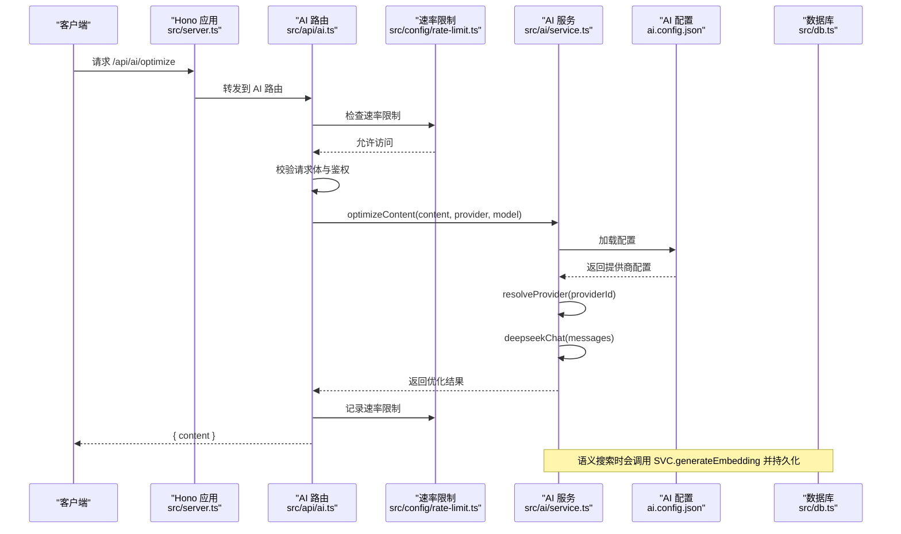
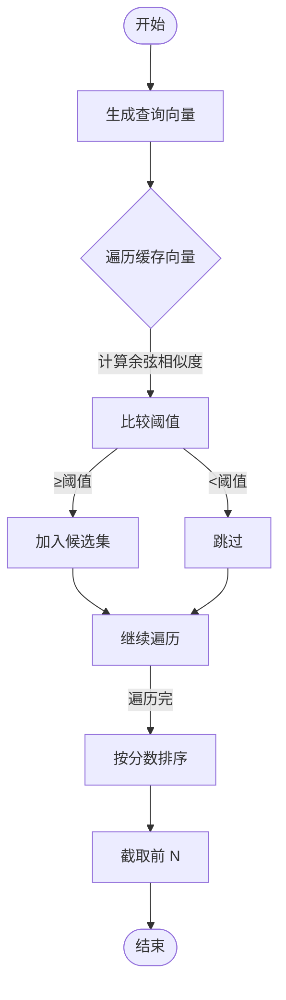
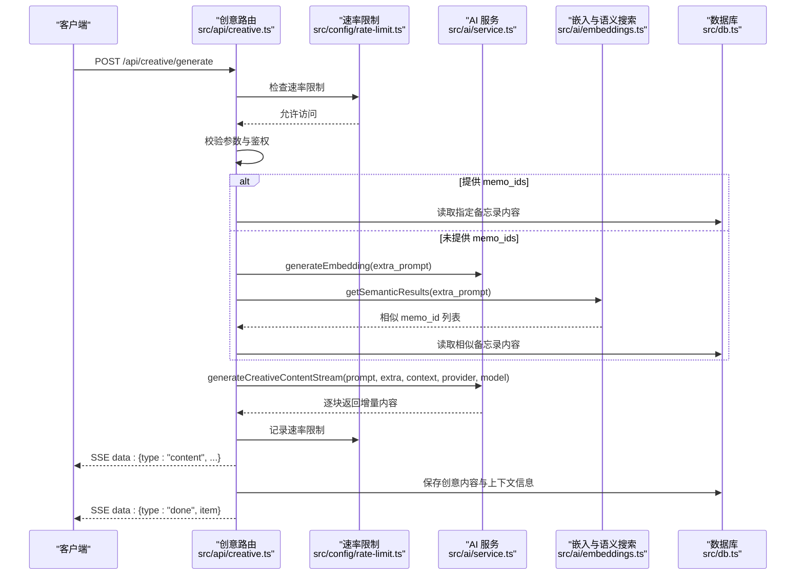
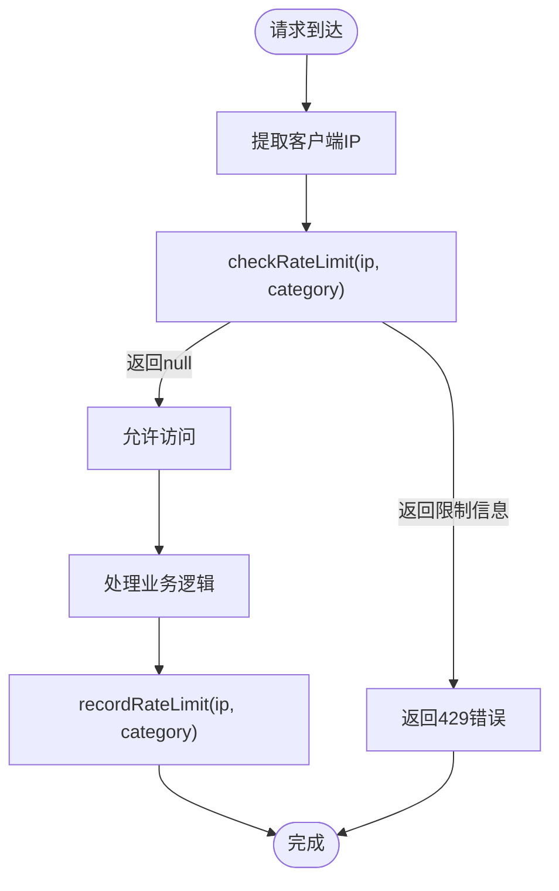
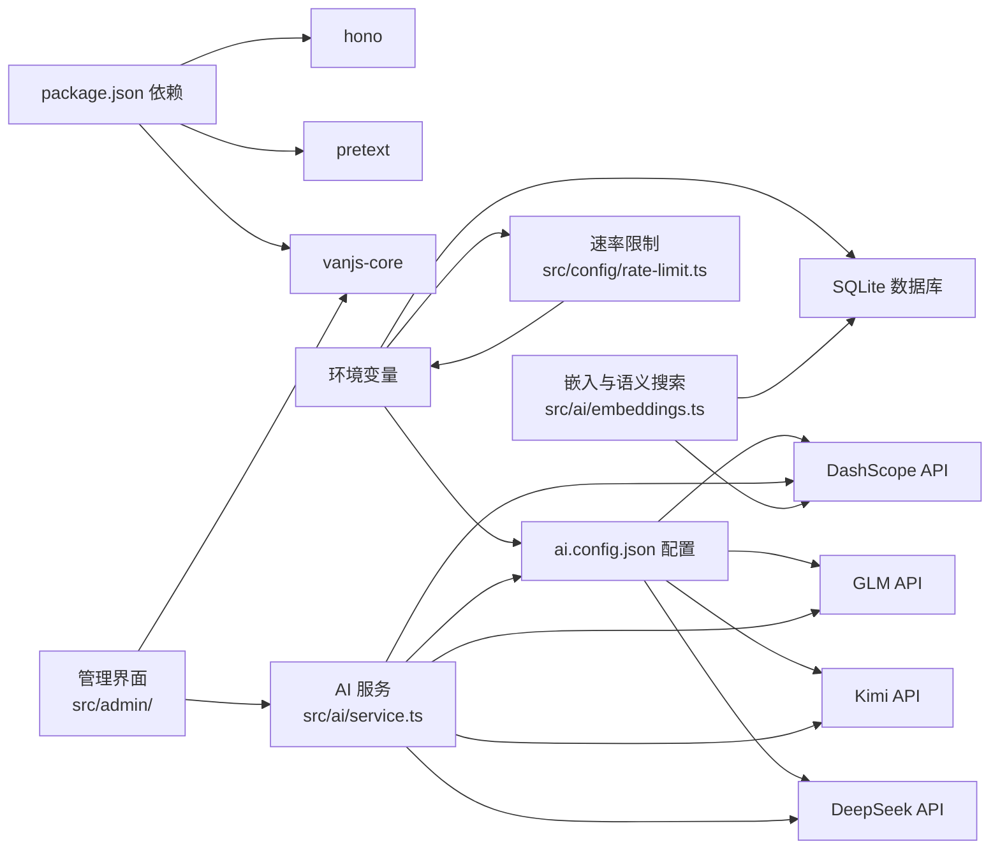

# AI 集成 API

<cite>
**本文档引用的文件**
- [src/api/ai.ts](file://src/api/ai.ts)
- [src/api/creative.ts](file://src/api/creative.ts)
- [src/ai/service.ts](file://src/ai/service.ts)
- [src/ai/embeddings.ts](file://src/ai/embeddings.ts)
- [src/config/rate-limit.ts](file://src/config/rate-limit.ts)
- [src/admin/ai-state.ts](file://src/admin/ai-state.ts)
- [src/admin/app.ts](file://src/admin/app.ts)
- [src/admin/creative.ts](file://src/admin/creative.ts)
- [src/server.ts](file://src/server.ts)
- [src/db.ts](file://src/db.ts)
- [ai.config.json](file://ai.config.json)
- [data/system-prompts/optimize.txt](file://data/system-prompts/optimize.txt)
- [data/system-prompts/suggest-tags.txt](file://data/system-prompts/suggest-tags.txt)
- [data/system-prompts/creative.txt](file://data/system-prompts/creative.txt)
- [data/prompts/creative-template.txt](file://data/prompts/creative-template.txt)
</cite>

## 更新摘要
**变更内容**
- 新增多提供商AI配置系统，支持DeepSeek、Kimi、GLM、DashScope
- 新增速率限制集成，支持AI调用和备忘录创建的两层窗口限制
- 新增AI配置文件`ai.config.json`和动态模型选择功能
- 更新API端点以支持多提供商架构和速率限制
- 新增`/api/ai/models`端点获取可用提供商和模型
- 增强AI服务的可扩展性和配置灵活性
- 新增创意内容生成API和流式输出支持

## 目录
1. [简介](#简介)
2. [项目结构](#项目结构)
3. [核心组件](#核心组件)
4. [架构总览](#架构总览)
5. [详细组件分析](#详细组件分析)
6. [速率限制系统](#速率限制系统)
7. [依赖关系分析](#依赖关系分析)
8. [性能考量](#性能考量)
9. [故障排查指南](#故障排查指南)
10. [结论](#结论)
11. [附录](#附录)

## 简介
本文件为 AI 集成 API 的详细接口文档，覆盖以下能力：
- 内容优化：基于多提供商的DeepSeek、Kimi、GLM的内容润色与优化
- 智能标签建议：基于多提供商的标签生成与复用
- 嵌入向量与语义搜索：基于DashScope的文本嵌入与内存中的余弦相似度检索
- 创意内容生成：结合提示词、上下文与嵌入的流式生成
- 多提供商配置：通过JSON配置文件动态管理AI提供商和模型
- 速率限制：支持AI调用和备忘录创建的两层窗口限制

文档包含端点定义、HTTP 方法、URL 模式、请求参数、响应格式、实际使用示例、嵌入与语义搜索实现原理、API 密钥配置与错误处理指南。

## 项目结构
- 服务入口在主服务器中挂载子应用，其中 AI 相关路由位于 /api/ai，创意内容相关路由位于 /api/creative。
- AI 服务封装在独立模块中，支持多提供商配置并通过JSON文件管理提供商信息。
- 数据层通过 SQLite 提供基础 CRUD 与嵌入持久化。
- 速率限制系统提供IP级别的两层窗口限制（小时 + 天）。

```mermaid
graph TB
subgraph "服务端"
S["Hono 应用<br/>src/server.ts"]
AIAPI["AI 路由<br/>src/api/ai.ts"]
CREATIVEAPI["创意路由<br/>src/api/creative.ts"]
RL["速率限制<br/>src/config/rate-limit.ts"]
DB["数据库层<br/>src/db.ts"]
AISVC["AI 服务<br/>src/ai/service.ts"]
EMB["嵌入与语义搜索<br/>src/ai/embeddings.ts"]
CONFIG["AI 配置<br/>ai.config.json"]
ADMIN["管理界面<br/>src/admin/"]
END
S --> AIAPI
S --> CREATIVEAPI
S --> RL
AIAPI --> AISVC
CREATIVEAPI --> AISVC
CREATIVEAPI --> EMB
AISVC --> DB
AISVC --> CONFIG
EMB --> DB
ADMIN --> AIAPI
ADMIN --> CREATIVEAPI
ADMIN --> AISVC
```

**图表来源**
- [src/server.ts:75-82](file://src/server.ts#L75-L82)
- [src/api/ai.ts:17-109](file://src/api/ai.ts#L17-L109)
- [src/api/creative.ts:28-257](file://src/api/creative.ts#L28-L257)
- [src/config/rate-limit.ts:26-144](file://src/config/rate-limit.ts#L26-L144)
- [src/ai/service.ts:34-66](file://src/ai/service.ts#L34-L66)
- [src/ai/embeddings.ts:1-99](file://src/ai/embeddings.ts#L1-L99)
- [src/db.ts:197-221](file://src/db.ts#L197-L221)
- [ai.config.json:1-44](file://ai.config.json#L1-L44)

**章节来源**
- [src/server.ts:75-82](file://src/server.ts#L75-L82)
- [src/api/ai.ts:17-109](file://src/api/ai.ts#L17-L109)
- [src/api/creative.ts:28-257](file://src/api/creative.ts#L28-L257)
- [src/config/rate-limit.ts:26-144](file://src/config/rate-limit.ts#L26-L144)
- [src/ai/service.ts:34-66](file://src/ai/service.ts#L34-L66)
- [src/ai/embeddings.ts:1-99](file://src/ai/embeddings.ts#L1-L99)
- [src/db.ts:197-221](file://src/db.ts#L197-L221)
- [ai.config.json:1-44](file://ai.config.json#L1-L44)

## 核心组件
- AI 路由（/api/ai）
  - /api/ai/status：检测 AI 能力可用性（无需认证）
  - /api/ai/models：获取可用提供商和模型列表（无需认证）
  - /api/ai/optimize：内容优化（需认证），支持指定provider和model
  - /api/ai/suggest-tags：标签建议（需认证），支持指定provider和model
- 嵌入与语义搜索
  - 内存缓存 + SQLite 持久化
  - 余弦相似度阈值筛选
- 创意内容生成（/api/creative）
  - 流式生成创意内容（SSE）
  - 支持手动指定上下文或基于嵌入的语义检索
  - 支持指定provider和model参数
- 速率限制系统
  - IP级别两层窗口（小时 + 天）
  - 支持memo和ai两类
  - 可配置的限制参数

**章节来源**
- [src/api/ai.ts:19-109](file://src/api/ai.ts#L19-L109)
- [src/ai/embeddings.ts:7-99](file://src/ai/embeddings.ts#L7-L99)
- [src/api/creative.ts:118-257](file://src/api/creative.ts#L118-L257)
- [src/config/rate-limit.ts:9-144](file://src/config/rate-limit.ts#L9-L144)

## 架构总览
AI 集成以"配置驱动 + 服务层 + 路由层 + 数据层 + 速率限制"分层组织：
- 配置层：通过`ai.config.json`管理多提供商配置
- 路由层负责鉴权、参数校验、速率限制与错误处理
- 服务层封装多提供商调用细节与超时控制
- 数据层负责嵌入持久化与基础 CRUD
- 速率限制层提供IP级别的访问控制



**图表来源**
- [src/server.ts:75-82](file://src/server.ts#L75-L82)
- [src/api/ai.ts:30-68](file://src/api/ai.ts#L30-L68)
- [src/config/rate-limit.ts:69-102](file://src/config/rate-limit.ts#L69-L102)
- [src/ai/service.ts:64-77](file://src/ai/service.ts#L64-L77)
- [src/ai/service.ts:240-255](file://src/ai/service.ts#L240-L255)

## 详细组件分析

### AI 路由与端点
- /api/ai/status
  - 方法：GET
  - 认证：否
  - 响应：包含 optimize、embedding、tags、available 的布尔值对象
  - 用途：前端根据可用性决定是否显示相关功能
- /api/ai/models
  - 方法：GET
  - 认证：否
  - 响应：包含可用提供商列表和默认配置的对象
  - 用途：获取当前可用的AI提供商和模型信息
- /api/ai/optimize
  - 方法：POST
  - 认证：是（Cookie）
  - 请求体：{ content: string, provider?: string, model?: string }
  - 响应：{ content: string } 或错误对象
  - 行为：调用指定提供商的DeepSeek对内容进行优化，返回优化后的文本
  - **新增**：集成速率限制检查和记录
- /api/ai/suggest-tags
  - 方法：POST
  - 认证：是（Cookie）
  - 请求体：{ content: string, provider?: string, model?: string }
  - 响应：{ tags: string[] } 或错误对象
  - 行为：调用指定提供商生成 1-3 个标签；优先复用现有标签；回退到行/逗号分割提取
  - **新增**：集成速率限制检查和记录

**章节来源**
- [src/api/ai.ts:19-109](file://src/api/ai.ts#L19-L109)

### AI 服务实现（多提供商 + DashScope）
- 配置系统
  - 通过`ai.config.json`管理多提供商配置
  - 支持动态提供商发现和模型映射
  - 回退机制：配置文件缺失时回退到DeepSeek-only模式
- 可用性检测
  - 依据配置文件中的提供商和环境变量判断功能可用性
  - 支持部分提供商可用的情况
- 多提供商支持
  - DeepSeek：支持 deepseek-v4-pro 和 deepseek-v4-flash
  - Kimi：支持 kimi-k2.5 和 kimi-k2.6  
  - GLM：支持 glm-4.7、glm-4.7-flash 和 glm-5
  - DashScope：支持多种模型的嵌入生成
- DashScope 嵌入
  - 使用 compatible-mode/v1/embeddings，模型 text-embedding-v3，维度 1024
  - 返回 Float32Array，失败时记录日志并返回空值
- 创意内容生成
  - 支持同步生成与流式生成（SSE）
  - 流式生成解析 data: 行，逐块推送增量内容

```mermaid
classDiagram
class AIService {
+isAiAvailable() object
+optimizeContent(content, provider?, model?) string|null
+suggestTags(content, existingTags, provider?, model?) string[]
+generateEmbedding(text) Float32Array|null
+generateCreativeContent(prompt, extra, context, provider?, model?) string|null
+generateCreativeContentStream(prompt, extra, context, provider?, model?) AsyncGenerator
+getAvailableModels() object
+getConfig() AiConfig
}
class AiConfig {
+providers : AiProviderConfig[]
+default : {provider, model}
}
class AiProviderConfig {
+id : string
+name : string
+baseUrl : string
+apiKeyEnv : string
+models : string[]
}
class DeepSeek {
+baseUrl() string|null
+chat(messages) string|null
}
class DashScope {
+baseUrl() string|null
+embeddings(text) Float32Array|null
}
AIService --> AiConfig : "使用"
AIService --> DeepSeek : "调用"
AIService --> DashScope : "调用"
```

**图表来源**
- [src/ai/service.ts:14-27](file://src/ai/service.ts#L14-L27)
- [src/ai/service.ts:64-77](file://src/ai/service.ts#L64-L77)
- [src/ai/service.ts:304-344](file://src/ai/service.ts#L304-L344)
- [src/ai/service.ts:348-407](file://src/ai/service.ts#L348-L407)

**章节来源**
- [src/ai/service.ts:14-27](file://src/ai/service.ts#L14-L27)
- [src/ai/service.ts:36-66](file://src/ai/service.ts#L36-L66)
- [src/ai/service.ts:64-77](file://src/ai/service.ts#L64-L77)
- [src/ai/service.ts:304-344](file://src/ai/service.ts#L304-L344)
- [src/ai/service.ts:348-407](file://src/ai/service.ts#L348-L407)

### AI 配置系统
- 配置文件结构
  - `providers`: 数组，包含各提供商的配置信息
  - `default`: 默认提供商和模型配置
- 提供商配置字段
  - `id`: 提供商唯一标识
  - `name`: 提供商显示名称
  - `baseUrl`: API 基础地址
  - `apiKeyEnv`: 环境变量名
  - `models`: 支持的模型列表
- 默认配置
  - 默认提供商：deepseek
  - 默认模型：deepseek-v4-flash
- 回退机制
  - 配置文件不存在时回退到DeepSeek-only模式
  - 保持向后兼容性

**章节来源**
- [ai.config.json:1-44](file://ai.config.json#L1-L44)
- [src/ai/service.ts:36-66](file://src/ai/service.ts#L36-L66)
- [src/ai/service.ts:48-62](file://src/ai/service.ts#L48-L62)

### 嵌入向量与语义搜索
- 初始化
  - 启动时从数据库加载已有嵌入到内存 Map，键为 memo_id，值为 Float32Array
- 生成与存储
  - generateAndStoreEmbedding：生成嵌入并写入缓存与数据库
- 查询
  - getSemanticResults：对查询文本生成嵌入，与缓存中向量计算余弦相似度，超过阈值（0.3）即纳入候选，按分数降序取前 N
- 阈值与限制
  - SIMILARITY_THRESHOLD = 0.3
  - 默认 limit = 20



**图表来源**
- [src/ai/embeddings.ts:66-86](file://src/ai/embeddings.ts#L66-L86)
- [src/ai/embeddings.ts:48-64](file://src/ai/embeddings.ts#L48-L64)

**章节来源**
- [src/ai/embeddings.ts:7-35](file://src/ai/embeddings.ts#L7-L35)
- [src/ai/embeddings.ts:48-64](file://src/ai/embeddings.ts#L48-L64)
- [src/ai/embeddings.ts:66-86](file://src/ai/embeddings.ts#L66-L86)
- [src/db.ts:199-221](file://src/db.ts#L199-L221)

### 创意内容生成（流式）
- 端点：/api/creative/generate
- 请求体：
  - prompt_id: number（必填）
  - extra_prompt: string（必填）
  - memo_ids: number[]（可选，手动指定上下文备忘录）
  - provider: string（可选，指定提供商）
  - model: string（可选，指定模型）
- 上下文策略：
  - 若提供 memo_ids，则直接读取对应备忘录内容作为上下文
  - 否则先生成 extra_prompt 的嵌入，再通过 getSemanticResults 获取相似备忘录作为上下文
- 流式输出：
  - SSE，逐块推送 { type: "content", content: string }
  - 完成后推送 { type: "done", item }，item 为保存到数据库的创意条目
- 错误处理：
  - 生成异常时推送 { type: "error", error }
- **新增**：集成速率限制检查和记录



**图表来源**
- [src/api/creative.ts:118-247](file://src/api/creative.ts#L118-L247)
- [src/config/rate-limit.ts:69-102](file://src/config/rate-limit.ts#L69-L102)
- [src/ai/service.ts:348-407](file://src/ai/service.ts#L348-L407)
- [src/ai/embeddings.ts:66-86](file://src/ai/embeddings.ts#L66-L86)

**章节来源**
- [src/api/creative.ts:118-247](file://src/api/creative.ts#L118-L247)
- [src/ai/service.ts:348-407](file://src/ai/service.ts#L348-L407)
- [src/ai/embeddings.ts:66-86](file://src/ai/embeddings.ts#L66-L86)

## 速率限制系统
- 类型定义
  - RateLimitCategory: "memo" | "ai"
  - WindowEntry: { count: number, windowStart: number }
  - RateLimitEntry: { hourly: WindowEntry, daily: WindowEntry }
- 限制参数
  - RATE_LIMIT_MEMOS_PER_HOUR: 默认 50
  - RATE_LIMIT_MEMOS_PER_DAY: 默认 200
  - RATE_LIMIT_AI_PER_HOUR: 默认 30
  - RATE_LIMIT_AI_PER_DAY: 默认 100
- 核心功能
  - getClientIP: 从X-Forwarded-For或X-Real-IP头提取客户端IP
  - checkRateLimit: 检查速率限制，返回null表示允许，否则返回限制信息
  - recordRateLimit: 记录一次速率限制调用
  - formatRateLimitError: 构建速率限制错误响应消息



**图表来源**
- [src/config/rate-limit.ts:59-102](file://src/config/rate-limit.ts#L59-L102)
- [src/config/rate-limit.ts:104-132](file://src/config/rate-limit.ts#L104-L132)

**章节来源**
- [src/config/rate-limit.ts:1-144](file://src/config/rate-limit.ts#L1-L144)

## 依赖关系分析
- 服务层依赖
  - Hono（路由框架）
  - bun:sqlite（数据库）
  - fetch（HTTP 客户端）
- 配置文件
  - ai.config.json：AI提供商配置
- 环境变量
  - DEEPSEEK_API_KEY：DeepSeek 认证
  - KIMI_API_KEY：Kimi 认证
  - GLM_API_KEY：GLM 认证
  - DASHSCOPE_API_KEY：DashScope 认证
  - DEEPSEEK_BASE_URL：DeepSeek 基础地址（向后兼容）
  - PORT：服务端口（默认 3020）
  - MEMOS_SECRET_KEY：管理后台密钥（非 AI 相关）
  - RATE_LIMIT_MEMOS_PER_HOUR：备忘录速率限制（默认 50）
  - RATE_LIMIT_MEMOS_PER_DAY：备忘录速率限制（默认 200）
  - RATE_LIMIT_AI_PER_HOUR：AI调用速率限制（默认 30）
  - RATE_LIMIT_AI_PER_DAY：AI调用速率限制（默认 100）
- 管理界面依赖
  - vanjs-core：前端状态管理
  - 本地存储：AI模型选择状态持久化



**图表来源**
- [src/ai/service.ts:18-25](file://src/ai/service.ts#L18-L25)
- [src/config/rate-limit.ts:28-31](file://src/config/rate-limit.ts#L28-L31)
- [src/db.ts:197-221](file://src/db.ts#L197-L221)

**章节来源**
- [src/ai/service.ts:18-25](file://src/ai/service.ts#L18-L25)
- [src/config/rate-limit.ts:28-31](file://src/config/rate-limit.ts#L28-L31)
- [src/db.ts:197-221](file://src/db.ts#L197-L221)

## 性能考量
- 超时控制
  - AI 请求统一设置 60 秒超时，避免阻塞
- 嵌入缓存
  - 启动时加载数据库中的嵌入到内存，避免每次查询都调用外部 API
  - 余弦相似度计算为 O(n*d)，n 为缓存向量数量，d 为向量维度
- 流式生成
  - 创意内容生成采用流式输出，降低首屏等待时间
- 配置缓存
  - 配置文件只在首次加载时读取，后续重复使用缓存配置
- 速率限制
  - IP级别两层窗口限制，防止滥用
  - 支持不同类别的独立限制
- 建议
  - 控制标签建议返回数量上限（当前最大 5）
  - 在高并发场景下考虑对 DeepSeek/Kimi/GLM/DashScope 的调用做限流或队列化
  - 合理配置速率限制参数以平衡用户体验和资源保护

## 故障排查指南
- 状态检测
  - 访问 /api/ai/status 查看 optimize/tags/embedding/available 的可用性
  - 访问 /api/ai/models 查看可用的提供商和模型列表
- 常见错误与原因
  - 400：请求体无效或缺少 content，或provider/model参数无效
  - 429：触发速率限制（每小时/每天上限）
  - 503：对应功能未配置（如未设置相应API密钥）
  - 500：AI 服务不可用或外部 API 调用失败
- 日志定位
  - 服务端会打印各提供商的错误状态与异常堆栈
  - 速率限制错误会包含详细的重试时间信息
- 配置核对
  - 确认 ai.config.json 配置文件存在且格式正确
  - 确认相应的 API 密钥已正确设置
  - 如需自定义 DeepSeek 基础地址，设置 DEEPSEEK_BASE_URL（向后兼容）
  - 检查速率限制环境变量配置

**章节来源**
- [src/api/ai.ts:19-109](file://src/api/ai.ts#L19-L109)
- [src/ai/service.ts:89-106](file://src/ai/service.ts#L89-L106)
- [src/ai/service.ts:240-255](file://src/ai/service.ts#L240-L255)
- [src/config/rate-limit.ts:134-144](file://src/config/rate-limit.ts#L134-L144)

## 结论
本项目提供了完整的多提供商AI集成功能：内容优化、标签建议、嵌入与语义搜索、创意内容生成（含流式）。通过JSON配置文件管理多提供商，既保证了易用性，也便于扩展与维护。新的配置系统支持动态提供商发现和模型选择，速率限制系统确保服务稳定运行。建议在生产环境中合理配置密钥与超时参数，并结合业务需求对返回数量与相似度阈值进行调优。

## 附录

### 端点一览与示例

- /api/ai/status
  - 方法：GET
  - 示例：curl http://localhost:3020/api/ai/status
  - 响应：包含 optimize、embedding、tags、available 的布尔值对象
- /api/ai/models
  - 方法：GET
  - 示例：curl http://localhost:3020/api/ai/models
  - 响应：包含可用提供商列表和默认配置的对象
- /api/ai/optimize
  - 方法：POST
  - 认证：Cookie（管理员登录后）
  - 请求体：{ "content": "你的备忘录内容", "provider": "deepseek", "model": "deepseek-v4-flash" }
  - 响应：{ "content": "优化后的文本" }
  - 示例：curl -X POST http://localhost:3020/api/ai/optimize -H "Content-Type: application/json" -d '{"content":"你的备忘录内容","provider":"deepseek","model":"deepseek-v4-flash"}'
- /api/ai/suggest-tags
  - 方法：POST
  - 认证：Cookie（管理员登录后）
  - 请求体：{ "content": "你的备忘录内容", "provider": "deepseek", "model": "deepseek-v4-flash" }
  - 响应：{ "tags": ["tag1","tag2"] }
  - 示例：curl -X POST http://localhost:3020/api/ai/suggest-tags -H "Content-Type: application/json" -d '{"content":"你的备忘录内容","provider":"deepseek","model":"deepseek-v4-flash"}'

**章节来源**
- [src/api/ai.ts:19-109](file://src/api/ai.ts#L19-L109)

### AI 配置文件示例
```json
{
  "providers": [
    {
      "id": "deepseek",
      "name": "DeepSeek",
      "baseUrl": "https://api.deepseek.com",
      "apiKeyEnv": "DEEPSEEK_API_KEY",
      "models": ["deepseek-v4-pro", "deepseek-v4-flash"]
    },
    {
      "id": "kimi",
      "name": "Kimi",
      "baseUrl": "https://api.moonshot.cn",
      "apiKeyEnv": "KIMI_API_KEY",
      "models": ["kimi-k2.5", "kimi-k2.6"]
    },
    {
      "id": "glm",
      "name": "GLM",
      "baseUrl": "https://open.bigmodel.cn/api/paas",
      "apiKeyEnv": "GLM_API_KEY",
      "models": ["glm-4.7", "glm-4.7-flash", "glm-5"]
    },
    {
      "id": "dashscope",
      "name": "DashScope",
      "baseUrl": "https://dashscope.aliyuncs.com/compatible-mode",
      "apiKeyEnv": "DASHSCOPE_API_KEY",
      "models": ["deepseek-v4-pro", "deepseek-v4-flash", "kimi-k2.5", "kimi-k2.6", "glm-5", "qwen-3.5"]
    }
  ],
  "default": {
    "provider": "deepseek",
    "model": "deepseek-v4-flash"
  }
}
```

**章节来源**
- [ai.config.json:1-44](file://ai.config.json#L1-L44)

### 速率限制配置示例
- 环境变量配置
  - RATE_LIMIT_MEMOS_PER_HOUR=50（默认 50）
  - RATE_LIMIT_MEMOS_PER_DAY=200（默认 200）
  - RATE_LIMIT_AI_PER_HOUR=30（默认 30）
  - RATE_LIMIT_AI_PER_DAY=100（默认 100）

**章节来源**
- [src/config/rate-limit.ts:2-6](file://src/config/rate-limit.ts#L2-L6)

### 嵌入与语义搜索使用流程
- 生成并存储嵌入
  - 调用生成函数，得到 Float32Array 后写入缓存与数据库
- 语义搜索
  - 输入查询文本，生成查询向量
  - 与缓存向量计算余弦相似度，超过阈值的进入候选
  - 按分数排序，取前 N 个 memo_id

**章节来源**
- [src/ai/embeddings.ts:88-99](file://src/ai/embeddings.ts#L88-L99)
- [src/ai/embeddings.ts:66-86](file://src/ai/embeddings.ts#L66-L86)

### API 密钥配置
- DEEPSEEK_API_KEY：用于 DeepSeek 对话与创意生成
- KIMI_API_KEY：用于 Kimi 对话与创意生成  
- GLM_API_KEY：用于 GLM 对话与创意生成
- DASHSCOPE_API_KEY：用于 DashScope 嵌入
- DEEPSEEK_BASE_URL：可选，自定义 DeepSeek 基础地址（向后兼容）
- PORT：服务端口（默认 3020）
- MEMOS_SECRET_KEY：管理后台登录密钥（非 AI 相关）

**章节来源**
- [src/ai/service.ts:18-25](file://src/ai/service.ts#L18-L25)

### 提示词模板
- 优化提示词：data/system-prompts/optimize.txt
- 标签建议提示词：data/system-prompts/suggest-tags.txt
- 创意内容提示词：data/system-prompts/creative.txt
- 创意模板：data/prompts/creative-template.txt

**章节来源**
- [data/system-prompts/optimize.txt:1-8](file://data/system-prompts/optimize.txt#L1-L8)
- [data/system-prompts/suggest-tags.txt:1-4](file://data/system-prompts/suggest-tags.txt#L1-L4)
- [data/system-prompts/creative.txt:1-2](file://data/system-prompts/creative.txt#L1-L2)
- [data/prompts/creative-template.txt:1-8](file://data/prompts/creative-template.txt#L1-L8)