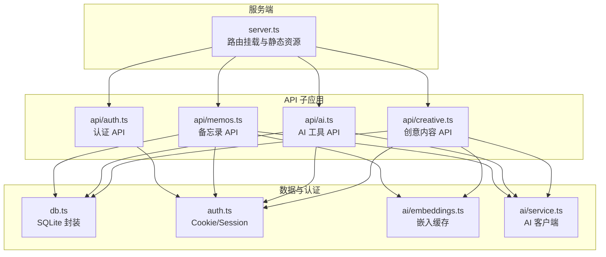
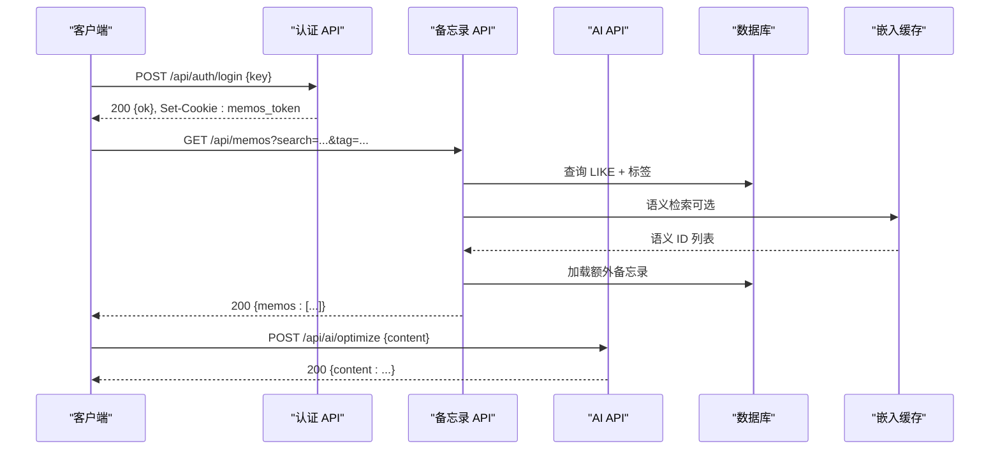
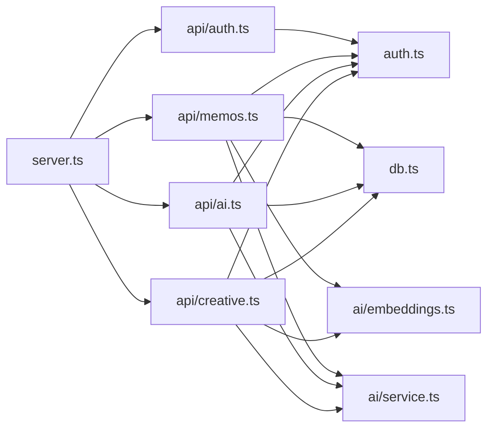

# API 接口文档

<cite>
**本文引用的文件**
- [src/server.ts](file://src/server.ts)
- [src/api/auth.ts](file://src/api/auth.ts)
- [src/api/memos.ts](file://src/api/memos.ts)
- [src/api/ai.ts](file://src/api/ai.ts)
- [src/api/creative.ts](file://src/api/creative.ts)
- [src/db.ts](file://src/db.ts)
- [src/auth.ts](file://src/auth.ts)
- [src/ai/embeddings.ts](file://src/ai/embeddings.ts)
- [src/ai/service.ts](file://src/ai/service.ts)
- [src/model.ts](file://src/model.ts)
- [README.md](file://README.md)
- [package.json](file://package.json)
</cite>

## 目录
1. [简介](#简介)
2. [项目结构](#项目结构)
3. [核心组件](#核心组件)
4. [架构总览](#架构总览)
5. [详细组件分析](#详细组件分析)
6. [依赖关系分析](#依赖关系分析)
7. [性能考虑](#性能考虑)
8. [故障排查指南](#故障排查指南)
9. [结论](#结论)
10. [附录](#附录)

## 简介
本项目是一个基于 Bun 运行时的轻量级备忘录应用，提供 RESTful API，支持公开/私密备忘录管理、标签分类、全文搜索、语义检索、AI 内容优化与标签建议、创意内容生成（SSE 流式输出）等能力。API 通过 Cookie + 内存 Session 进行认证，管理后台通过密钥登录。

## 项目结构
- 服务端入口负责路由挂载与静态资源分发
- API 子模块按功能拆分：认证、备忘录、AI、创意
- 数据层封装 SQLite 操作与模型定义
- 认证模块提供 Cookie 设置、会话校验与中间件
- AI 模块封装 DeepSeek/DashScope 的调用与嵌入缓存

图表来源
- [src/server.ts:74-81](file://src/server.ts#L74-L81)
- [src/api/auth.ts:22](file://src/api/auth.ts#L22)
- [src/api/memos.ts:18](file://src/api/memos.ts#L18)
- [src/api/ai.ts:6](file://src/api/ai.ts#L6)
- [src/api/creative.ts:22](file://src/api/creative.ts#L22)
- [src/db.ts:1](file://src/db.ts#L1)
- [src/auth.ts:1](file://src/auth.ts#L1)
- [src/ai/embeddings.ts:1](file://src/ai/embeddings.ts#L1)
- [src/ai/service.ts:1](file://src/ai/service.ts#L1)

章节来源
- [src/server.ts:74-127](file://src/server.ts#L74-L127)
- [README.md:25-45](file://README.md#L25-L45)

## 核心组件
- 服务端入口：统一挂载 /api/* 子应用，提供静态页面与打包后的前端资源
- 认证子应用：提供登录、登出、状态检查；使用 Cookie 保存 Session Token
- 备忘录子应用：提供 CRUD、计数、标签列表、全文搜索与语义检索融合
- AI 子应用：提供 AI 能力可用性检测、内容优化、标签建议
- 创意子应用：提供提示词管理与创意内容生成（SSE 流式输出）

章节来源
- [src/server.ts:74-81](file://src/server.ts#L74-L81)
- [src/api/auth.ts:22-54](file://src/api/auth.ts#L22-L54)
- [src/api/memos.ts:18-140](file://src/api/memos.ts#L18-L140)
- [src/api/ai.ts:6-67](file://src/api/ai.ts#L6-L67)
- [src/api/creative.ts:22-238](file://src/api/creative.ts#L22-L238)

## 架构总览
- 路由前缀：/api
- 认证方式：Cookie（memos_token），内存会话存储
- 数据持久化：SQLite（WAL 模式）
- AI 能力：可选 DeepSeek（聊天/优化/标签建议）、DashScope（嵌入）
- 语义检索：基于内存缓存的余弦相似度，支持与 LIKE 结果合并

图表来源
- [src/api/auth.ts:29-45](file://src/api/auth.ts#L29-L45)
- [src/api/memos.ts:20-48](file://src/api/memos.ts#L20-L48)
- [src/api/ai.ts:13-40](file://src/api/ai.ts#L13-L40)
- [src/db.ts:99-131](file://src/db.ts#L99-L131)
- [src/ai/embeddings.ts:66-86](file://src/ai/embeddings.ts#L66-L86)

## 详细组件分析

### 认证 API
- 目标：登录、登出、状态检查
- Cookie：memos_token，HttpOnly + SameSite=Strict + 24 小时过期
- 密钥：MEMOS_SECRET_KEY（生产环境必须设置）

端点定义
- GET /api/auth/check
  - 认证：否
  - 请求体：无
  - 响应：{ authenticated: boolean }
  - 错误：无
- POST /api/auth/login
  - 认证：否
  - 请求体：{ key: string }
  - 成功：200 { ok: true }，设置 Cookie
  - 失败：400（JSON 格式错误）、401（密钥不正确）
- POST /api/auth/logout
  - 认证：否
  - 请求体：无
  - 成功：200 { ok: true }，清除 Cookie

章节来源
- [src/api/auth.ts:24-54](file://src/api/auth.ts#L24-L54)
- [src/auth.ts:23-55](file://src/auth.ts#L23-L55)
- [README.md:104-111](file://README.md#L104-L111)

### 备忘录 API
- 目标：CRUD、计数、标签列表、全文搜索、语义检索融合
- 查询参数
  - search: string（LIKE content）
  - tag: string（精确标签筛选）
  - all: string（设为 "true" 时返回私密备忘录，需认证）
- 语义检索：当提供 search 时，异步执行语义检索，与 LIKE 结果去重合并

端点定义
- GET /api/memos
  - 认证：可选（all=true 时需认证）
  - 查询：search、tag、all
  - 响应：{ memos: Memo[] }
  - 错误：无
- GET /api/memos/count
  - 认证：是
  - 查询：无
  - 响应：{ count: number }
  - 错误：无
- GET /api/memos/tags
  - 认证：否
  - 查询：无
  - 响应：{ tags: string[] }
  - 错误：无
- POST /api/memos
  - 认证：是
  - 请求体：{ content: string, is_public?: boolean, tag?: string }
  - 成功：201 { memo: Memo }
  - 失败：400（内容缺失或为空）、401（未认证）
- PUT /api/memos/:id
  - 认证：是
  - 请求体：{ content?: string, is_public?: boolean, tag?: string }
  - 成功：200 { memo: Memo }
  - 失败：400（内容为空）、401（未认证）、404（不存在）
- DELETE /api/memos/:id
  - 认证：是
  - 请求体：无
  - 成功：200 { ok: true }
  - 失败：401（未认证）、404（不存在）

请求/响应示例（路径）
- 创建备忘录：[src/api/memos.ts:63-92](file://src/api/memos.ts#L63-L92)
- 获取备忘录列表（含搜索与标签筛选）：[src/api/memos.ts:20-48](file://src/api/memos.ts#L20-L48)

章节来源
- [src/api/memos.ts:20-140](file://src/api/memos.ts#L20-L140)
- [src/db.ts:99-139](file://src/db.ts#L99-L139)
- [README.md:122-129](file://README.md#L122-L129)
- [README.md:130-176](file://README.md#L130-L176)

### AI 工具 API
- 目标：AI 能力可用性检测、内容优化、标签建议
- 依赖：DeepSeek（聊天/优化/标签建议）、DashScope（嵌入）
- 可用性：根据环境变量判断（DEEPSEEK_API_KEY、DASHSCOPE_API_KEY）

端点定义
- GET /api/ai/status
  - 认证：否
  - 查询：无
  - 响应：{ optimize: boolean, embedding: boolean, tags: boolean, available: boolean }
  - 错误：无
- POST /api/ai/optimize
  - 认证：是
  - 请求体：{ content: string }
  - 成功：200 { content: string }
  - 失败：400（内容缺失）、503（未配置）、500（服务不可用）
- POST /api/ai/suggest-tags
  - 认证：是
  - 请求体：{ content: string }
  - 成功：200 { tags: string[] }
  - 失败：400（内容缺失）、503（未配置）

章节来源
- [src/api/ai.ts:8-67](file://src/api/ai.ts#L8-L67)
- [src/ai/service.ts:10-24](file://src/ai/service.ts#L10-L24)
- [src/ai/service.ts:144-177](file://src/ai/service.ts#L144-L177)

### 创意内容 API
- 目标：提示词管理、创意内容生成（SSE 流式输出）
- 上下文：可手动指定 memo_ids，或通过语义检索获取上下文
- 流式输出：SSE，事件类型包括 content、done、error

端点定义
- GET /api/creative/prompts
  - 认证：否
  - 查询：无
  - 响应：{ prompts: Prompt[] }
  - 错误：无
- POST /api/creative/prompts
  - 认证：是
  - 请求体：{ title: string, content: string }
  - 成功：201 { prompt: Prompt }
  - 失败：400（标题/内容缺失或为空）、401（未认证）
- PUT /api/creative/prompts/:id
  - 认证：是
  - 请求体：{ title?: string, content?: string }
  - 成功：200 { prompt: Prompt }
  - 失败：400（标题/内容为空）、401（未认证）、404（不存在）
- DELETE /api/creative/prompts/:id
  - 认证：是
  - 查询：无
  - 成功：200 { ok: true }
  - 失败：401（未认证）、404（不存在）
- GET /api/creative
  - 认证：否
  - 查询：prompt_id?: number
  - 响应：{ items: CreativeItem[] }
  - 错误：无
- POST /api/creative/generate
  - 认证：是
  - 请求体：{ prompt_id: number, extra_prompt: string, memo_ids?: number[] }
  - 成功：200 text/event-stream
  - 失败：400（参数缺失/非法）、401（未认证）、404（提示词不存在）
- DELETE /api/creative/:id
  - 认证：是
  - 查询：无
  - 成功：200 { ok: true }
  - 失败：401（未认证）、404（不存在）

章节来源
- [src/api/creative.ts:26-238](file://src/api/creative.ts#L26-L238)
- [src/db.ts:233-276](file://src/db.ts#L233-L276)
- [src/db.ts:293-338](file://src/db.ts#L293-L338)
- [src/ai/embeddings.ts:66-86](file://src/ai/embeddings.ts#L66-L86)
- [src/ai/service.ts:181-284](file://src/ai/service.ts#L181-L284)

### 数据模型
- Memo：id、content、tag、is_public、created_at、updated_at
- Prompt：id、title、content、created_at、updated_at
- CreativeItem：id、prompt_id、extra_prompt、embedding、content、context_memo_ids、created_at、updated_at

章节来源
- [src/model.ts:1-28](file://src/model.ts#L1-L28)

### 认证机制与 Cookie 处理
- 会话存储：内存 Set，重启丢失
- Cookie 名称：memos_token
- 安全属性：HttpOnly、SameSite=Strict、Path=/、Max-Age=86400
- 中间件：requireAuth 返回 401 或放行
- 登录频率限制：每 IP 最多 5 次，1 分钟冷却

章节来源
- [src/auth.ts:1-108](file://src/auth.ts#L1-L108)
- [src/api/auth.ts:11-21](file://src/api/auth.ts#L11-L21)

### 语义检索与嵌入缓存
- 初始化：启动时从数据库加载嵌入至内存
- 相似度：余弦相似度，阈值 0.3
- 生成与存储：创建/更新备忘录时触发
- 清理：删除备忘录时清理缓存

章节来源
- [src/ai/embeddings.ts:12-99](file://src/ai/embeddings.ts#L12-L99)
- [src/db.ts:195-219](file://src/db.ts#L195-L219)

## 依赖关系分析

图表来源
- [src/server.ts:74-81](file://src/server.ts#L74-L81)
- [src/api/memos.ts:1-17](file://src/api/memos.ts#L1-L17)
- [src/api/ai.ts:1-6](file://src/api/ai.ts#L1-L6)
- [src/api/creative.ts:1-21](file://src/api/creative.ts#L1-L21)
- [src/auth.ts:1-108](file://src/auth.ts#L1-L108)

章节来源
- [src/server.ts:74-127](file://src/server.ts#L74-L127)

## 性能考虑
- 嵌入缓存：启动时加载，避免每次计算；更新/删除备忘录时同步维护
- 语义检索：非阻塞地与 LIKE 结果合并，避免阻塞主查询
- SSE 流式生成：边生成边推送，降低等待时间
- 前端缓存：Pretext 文本预排版结果缓存，减少重复计算
- 频率限制：登录失败次数限制，防止暴力破解

章节来源
- [src/ai/embeddings.ts:12-35](file://src/ai/embeddings.ts#L12-L35)
- [src/ai/embeddings.ts:88-99](file://src/ai/embeddings.ts#L88-L99)
- [src/masonry/index.ts:52-61](file://src/masonry/index.ts#L52-L61)
- [src/auth.ts:57-89](file://src/auth.ts#L57-L89)

## 故障排查指南
- 401 未认证
  - 确认已登录且 Cookie 正确设置
  - 检查中间件是否生效
- 400 请求参数错误
  - JSON 格式错误或字段缺失/为空
- 503 AI 服务未配置
  - 检查 DEEPSEEK_API_KEY 或 DASHSCOPE_API_KEY 是否设置
- 500 AI 服务不可用
  - 检查网络与上游服务状态
- 语义检索无结果
  - 确认已生成嵌入且缓存加载成功
  - 检查相似度阈值与输入长度

章节来源
- [src/api/auth.ts:92-100](file://src/api/auth.ts#L92-L100)
- [src/api/memos.ts:63-92](file://src/api/memos.ts#L63-L92)
- [src/api/ai.ts:30-40](file://src/api/ai.ts#L30-L40)
- [src/ai/service.ts:10-24](file://src/ai/service.ts#L10-L24)
- [src/ai/embeddings.ts:66-86](file://src/ai/embeddings.ts#L66-L86)

## 结论
本项目以简洁的架构实现了完整的备忘录管理与 AI 辅助能力，API 设计清晰、易于集成。通过 Cookie + 内存会话实现简单可靠的认证，结合 SQLite 与嵌入缓存提供高效的全文与语义检索体验。建议在生产环境中配置密钥与 AI 服务凭据，并关注登录频率限制与 SSE 流式输出的客户端兼容性。

## 附录

### API 端点一览（按模块）
- 认证
  - GET /api/auth/check
  - POST /api/auth/login
  - POST /api/auth/logout
- 备忘录
  - GET /api/memos
  - GET /api/memos/count
  - GET /api/memos/tags
  - POST /api/memos
  - PUT /api/memos/:id
  - DELETE /api/memos/:id
- AI 工具
  - GET /api/ai/status
  - POST /api/ai/optimize
  - POST /api/ai/suggest-tags
- 创意内容
  - GET /api/creative/prompts
  - POST /api/creative/prompts
  - PUT /api/creative/prompts/:id
  - DELETE /api/creative/prompts/:id
  - GET /api/creative
  - POST /api/creative/generate
  - DELETE /api/creative/:id

章节来源
- [src/api/auth.ts:24-54](file://src/api/auth.ts#L24-L54)
- [src/api/memos.ts:20-140](file://src/api/memos.ts#L20-L140)
- [src/api/ai.ts:8-67](file://src/api/ai.ts#L8-L67)
- [src/api/creative.ts:26-238](file://src/api/creative.ts#L26-L238)

### 查询参数与示例
- 备忘录查询
  - search: 全文搜索（content LIKE %term%）
  - tag: 标签精确筛选
  - all: "true" 时包含私密备忘录（需认证）
- 示例请求
  - 创建备忘录：[src/api/memos.ts:63-92](file://src/api/memos.ts#L63-L92)
  - 获取备忘录列表：[src/api/memos.ts:20-48](file://src/api/memos.ts#L20-L48)

章节来源
- [src/api/memos.ts:20-48](file://src/api/memos.ts#L20-L48)
- [README.md:122-129](file://README.md#L122-L129)
- [README.md:130-176](file://README.md#L130-L176)

### 客户端实现要点
- 认证流程
  - 先调用 /api/auth/login，保存 Set-Cookie 返回的 memos_token
  - 后续请求携带 Cookie
- 备忘录操作
  - 使用 /api/memos 进行增删改查
  - 使用 /api/memos/tags 获取标签列表
- AI 能力
  - 先调用 /api/ai/status 检测可用性
  - 调用 /api/ai/optimize 与 /api/ai/suggest-tags
- 创意内容
  - 使用 /api/creative/generate 接收 SSE 流
  - 可选传入 memo_ids 或让系统自动检索上下文

章节来源
- [src/api/auth.ts:29-45](file://src/api/auth.ts#L29-L45)
- [src/api/memos.ts:20-48](file://src/api/memos.ts#L20-L48)
- [src/api/ai.ts:8-67](file://src/api/ai.ts#L8-L67)
- [src/api/creative.ts:112-228](file://src/api/creative.ts#L112-L228)

### API 版本管理与兼容性
- 当前版本：无显式版本号，遵循语义化变更策略
- 兼容性建议
  - 新增字段时保持向后兼容
  - 不破坏现有查询参数与响应结构
  - 对新增 SSE 事件类型进行客户端容错处理

章节来源
- [README.md:100-111](file://README.md#L100-L111)