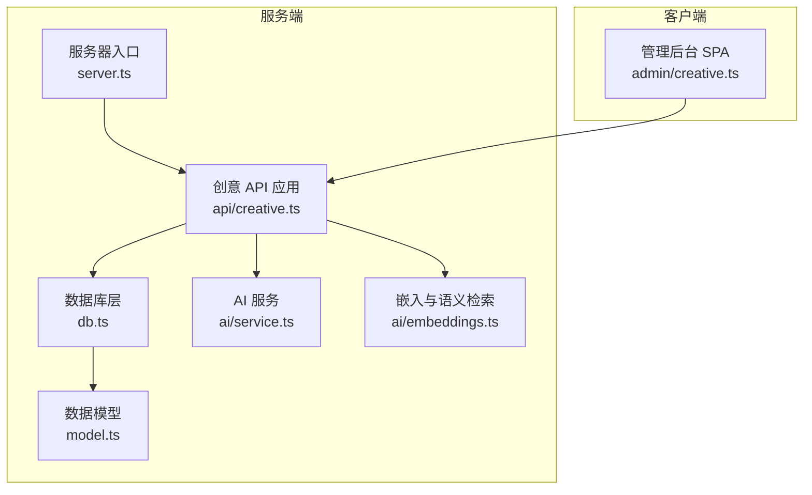
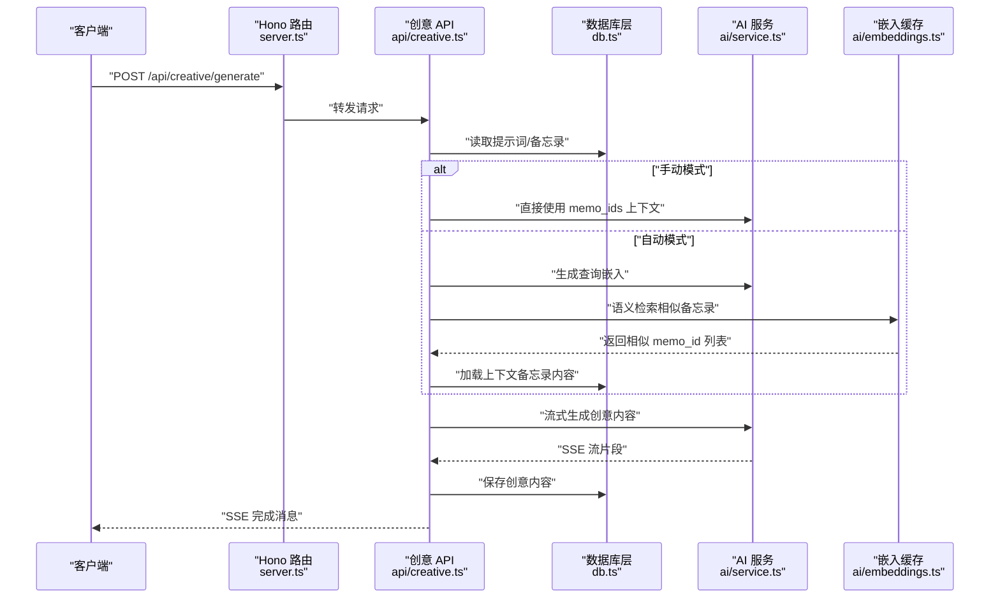
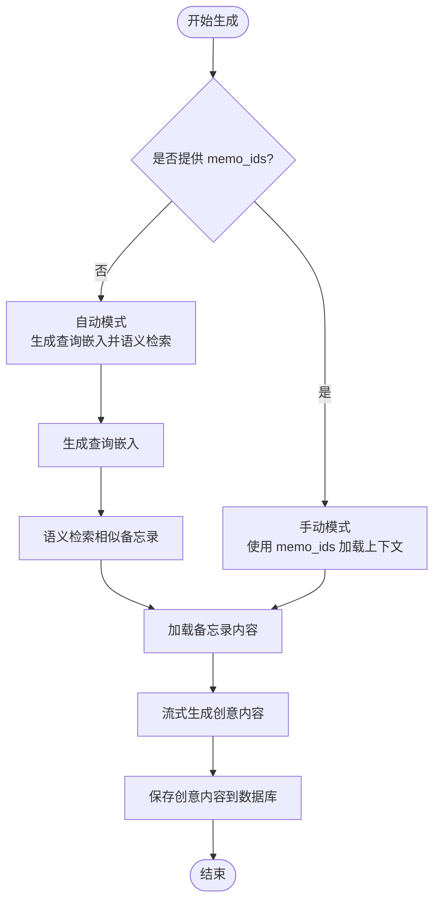
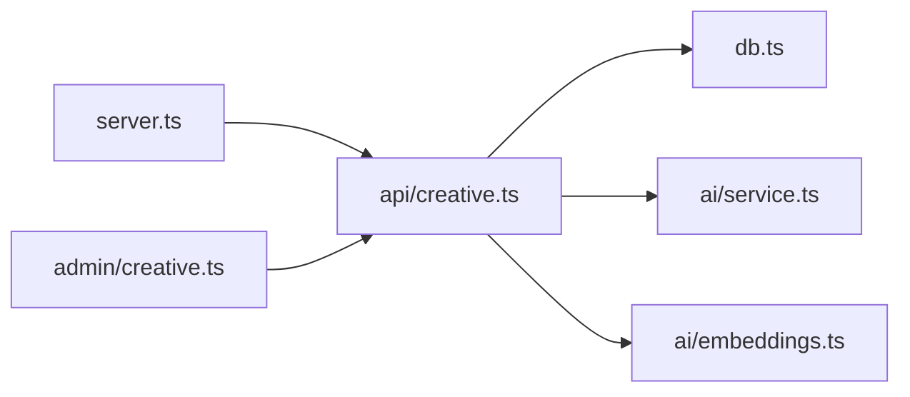

# 创意内容 API

<cite>
**本文引用的文件**
- [src/api/creative.ts](file://src/api/creative.ts)
- [src/model.ts](file://src/model.ts)
- [src/db.ts](file://src/db.ts)
- [src/admin/creative.ts](file://src/admin/creative.ts)
- [src/ai/service.ts](file://src/ai/service.ts)
- [src/ai/embeddings.ts](file://src/ai/embeddings.ts)
- [src/server.ts](file://src/server.ts)
- [src/util.ts](file://src/util.ts)
- [README.md](file://README.md)
- [ai.config.json](file://ai.config.json)
- [src/init/seed.ts](file://src/init/seed.ts)
- [data/system-prompts/creative.txt](file://data/system-prompts/creative.txt)
- [data/system-prompts/optimize.txt](file://data/system-prompts/optimize.txt)
- [data/system-prompts/suggest-tags.txt](file://data/system-prompts/suggest-tags.txt)
</cite>

## 目录
1. [简介](#简介)
2. [项目结构](#项目结构)
3. [核心组件](#核心组件)
4. [架构总览](#架构总览)
5. [详细组件分析](#详细组件分析)
6. [依赖关系分析](#依赖关系分析)
7. [性能考虑](#性能考虑)
8. [故障排除指南](#故障排除指南)
9. [结论](#结论)
10. [附录](#附录)

## 简介
本文件为"创意内容 API"的完整接口文档，覆盖创意内容的创建、管理和获取功能，说明数据结构与字段定义，提供每个端点的 HTTP 方法、URL 模式、请求参数与响应格式，并结合前端管理后台展示实际使用示例。同时阐述与 AI 功能的集成方式与数据流转过程，以及创意内容的分类与标签管理指南。

## 项目结构
该项目基于 Hono 框架与 SQLite 数据库存储，提供 Web 服务、管理后台与创意内容生成能力。创意相关内容主要分布在以下模块：
- API 层：/api/creative.ts 提供创意内容与提示词的 REST 接口
- 数据模型：/model.ts 定义 Memo、Prompt、CreativeItem 数据结构
- 数据访问层：/db.ts 封装 SQLite CRUD 与嵌入向量存储
- AI 集成：/ai/service.ts 提供内容优化、标签建议与创意生成；/ai/embeddings.ts 提供向量缓存与语义检索
- 服务器入口：/server.ts 组织路由与静态资源
- 管理后台：/admin/creative.ts 提供创意内容的可视化管理与生成流程

**图表来源**
- [src/server.ts:75-81](file://src/server.ts#L75-L81)
- [src/api/creative.ts:1-257](file://src/api/creative.ts#L1-L257)
- [src/db.ts:1-349](file://src/db.ts#L1-L349)
- [src/ai/service.ts:1-408](file://src/ai/service.ts#L1-L408)
- [src/ai/embeddings.ts:1-99](file://src/ai/embeddings.ts#L1-L99)
- [src/admin/creative.ts:1-729](file://src/admin/creative.ts#L1-L729)

**章节来源**
- [src/server.ts:75-81](file://src/server.ts#L75-L81)
- [src/api/creative.ts:1-257](file://src/api/creative.ts#L1-L257)
- [src/db.ts:15-57](file://src/db.ts#L15-L57)
- [src/admin/creative.ts:40-729](file://src/admin/creative.ts#L40-L729)

## 核心组件
- 创意内容 API 应用：提供提示词管理与创意内容生成、查询、删除等接口
- 数据模型：定义创意内容、提示词与备忘录的数据结构
- 数据库层：负责 SQLite 表结构初始化、CRUD 操作与嵌入向量持久化
- AI 服务：封装多种 AI 提供商的调用，提供内容优化、标签建议与创意内容生成（含流式）
- 嵌入与语义检索：维护内存向量缓存，基于余弦相似度进行语义检索
- 管理后台：提供可视化界面，支持选择提示词、生成创意内容、查看历史记录与删除操作

**章节来源**
- [src/api/creative.ts:28-257](file://src/api/creative.ts#L28-L257)
- [src/model.ts:1-28](file://src/model.ts#L1-L28)
- [src/db.ts:15-57](file://src/db.ts#L15-L57)
- [src/ai/service.ts:12-408](file://src/ai/service.ts#L12-L408)
- [src/ai/embeddings.ts:12-99](file://src/ai/embeddings.ts#L12-L99)
- [src/admin/creative.ts:40-729](file://src/admin/creative.ts#L40-L729)

## 架构总览
创意内容 API 的数据流从客户端发起请求，经由 Hono 路由进入创意应用，再调用数据库层与 AI 服务完成业务处理，最终以 JSON 或流式事件的形式返回结果。生成流程支持两种上下文模式：自动语义检索与手动指定备忘录 ID。

**图表来源**
- [src/server.ts:75-81](file://src/server.ts#L75-L81)
- [src/api/creative.ts:118-247](file://src/api/creative.ts#L118-L247)
- [src/db.ts:299-348](file://src/db.ts#L299-L348)
- [src/ai/service.ts:380-407](file://src/ai/service.ts#L380-L407)
- [src/ai/embeddings.ts:66-86](file://src/ai/embeddings.ts#L66-L86)

## 详细组件分析

### 数据模型与字段定义
- Prompt（提示词）
  - 字段：id、title、content、created_at、updated_at
  - 用途：定义创意内容生成的系统提示与任务描述
- CreativeItem（创意内容项）
  - 字段：id、prompt_id、extra_prompt、embedding、content、context_memo_ids、created_at、updated_at
  - 说明：保存一次生成的创意内容及其上下文信息；embedding 为向量；context_memo_ids 为逗号分隔的备忘录 ID 列表
- Memo（备忘录）
  - 字段：id、content、tag、is_public、created_at、updated_at
  - 用途：作为创意生成的上下文来源

**章节来源**
- [src/model.ts:10-27](file://src/model.ts#L10-L27)
- [src/db.ts:36-56](file://src/db.ts#L36-L56)

### 提示词管理 API
- 获取所有提示词
  - 方法：GET
  - 路径：/api/creative/prompts
  - 认证：否
  - 响应：包含 prompts 数组的对象
- 创建提示词
  - 方法：POST
  - 路径：/api/creative/prompts
  - 认证：是（需要登录 Cookie）
  - 请求体：{ title: string, content: string }
  - 响应：包含新建 prompt 的对象
- 更新提示词
  - 方法：PUT
  - 路径：/api/creative/prompts/:id
  - 认证：是
  - 请求体：{ title?: string, content?: string }（可选字段）
  - 响应：包含更新后的 prompt 对象
- 删除提示词
  - 方法：DELETE
  - 路径：/api/creative/prompts/:id
  - 认证：是
  - 响应：{ ok: true } 或错误信息

**章节来源**
- [src/api/creative.ts:32-103](file://src/api/creative.ts#L32-L103)
- [src/db.ts:235-282](file://src/db.ts#L235-L282)

### 创意内容 API
- 获取创意内容列表
  - 方法：GET
  - 路径：/api/creative
  - 查询参数：prompt_id（可选，按提示词过滤）
  - 认证：否
  - 响应：包含 items 数组的对象
- 生成创意内容（流式）
  - 方法：POST
  - 路径：/api/creative/generate
  - 认证：是
  - 请求体：
    - prompt_id: number（必填）
    - extra_prompt: string（必填，附加指令）
    - memo_ids: number[]（可选，手动指定备忘录 ID 列表）
    - provider: string（可选，AI 提供商 ID）
    - model: string（可选，模型名称）
  - 响应：SSE 流，消息类型包括：
    - content：增量内容片段
    - done：生成完成，包含新建的 CreativeItem
    - error：错误信息
- 删除创意内容
  - 方法：DELETE
  - 路径：/api/creative/:id
  - 认证：是
  - 响应：{ ok: true } 或错误信息

**章节来源**
- [src/api/creative.ts:107-256](file://src/api/creative.ts#L107-L256)
- [src/db.ts:299-348](file://src/db.ts#L299-L348)

### 生成流程与上下文模式
- 自动模式：根据 extra_prompt 生成查询嵌入，通过语义检索返回相似备忘录 ID，再加载其内容作为上下文
- 手动模式：直接使用请求体中的 memo_ids 作为上下文
- 生成完成后，将创意内容与上下文信息持久化到数据库

**图表来源**
- [src/api/creative.ts:171-189](file://src/api/creative.ts#L171-L189)
- [src/ai/service.ts:380-407](file://src/ai/service.ts#L380-L407)
- [src/ai/embeddings.ts:66-86](file://src/ai/embeddings.ts#L66-L86)

### 管理后台使用示例
- 选择提示词并生成创意内容
  - 在管理后台选择一个提示词，输入额外指令，选择自动或手动上下文模式，点击生成按钮
  - 浏览器接收 SSE 流，实时显示生成进度，完成后将新创意内容插入列表顶部
- 查看与删除创意内容
  - 支持展开查看完整内容，或删除已生成的创意内容项

**章节来源**
- [src/admin/creative.ts:145-271](file://src/admin/creative.ts#L145-L271)
- [src/admin/creative.ts:273-284](file://src/admin/creative.ts#L273-L284)

## 依赖关系分析
- 服务器入口将 /api/creative 路由挂载至创意应用
- 创意应用依赖数据库层与 AI 服务，用于提示词与创意内容的读写及生成
- 嵌入缓存在服务器启动时初始化，为语义检索提供基础
- 管理后台通过 /api/creative 发起请求，实现可视化管理

**图表来源**
- [src/server.ts:75-81](file://src/server.ts#L75-L81)
- [src/api/creative.ts:1-257](file://src/api/creative.ts#L1-L257)
- [src/db.ts:1-349](file://src/db.ts#L1-L349)
- [src/ai/service.ts:1-408](file://src/ai/service.ts#L1-L408)
- [src/ai/embeddings.ts:1-99](file://src/ai/embeddings.ts#L1-L99)
- [src/admin/creative.ts:1-729](file://src/admin/creative.ts#L1-L729)

**章节来源**
- [src/server.ts:75-81](file://src/server.ts#L75-L81)
- [src/api/creative.ts:1-257](file://src/api/creative.ts#L1-L257)
- [src/db.ts:1-349](file://src/db.ts#L1-L349)
- [src/ai/service.ts:1-408](file://src/ai/service.ts#L1-L408)
- [src/ai/embeddings.ts:1-99](file://src/ai/embeddings.ts#L1-L99)
- [src/admin/creative.ts:1-729](file://src/admin/creative.ts#L1-L729)

## 性能考虑
- 流式生成：使用 SSE 将生成过程分片传输，降低首屏等待时间
- 语义检索：基于内存向量缓存与余弦相似度，避免频繁外部调用
- 嵌入维度与阈值：嵌入维度为 1024，相似度阈值为 0.3，可根据需求调整
- 生成超时：AI 请求统一设置 60 秒超时，防止长时间阻塞
- 建议
  - 在高并发场景下，合理配置多个 AI 提供商的 API Key，确保外部服务可用
  - 对长文本生成，建议限制 extra_prompt 长度，避免超出模型上下文长度

## 故障排除指南
- 生成失败
  - 检查 AI 提供商配置文件 ai.config.json 是否正确
  - 确认请求体中 prompt_id 与 extra_prompt 是否有效
  - 若使用手动模式，确认 memo_ids 为正整数数组
- 语义检索无结果
  - 确认 DASHSCOPE_API_KEY 已配置且可用
  - 检查嵌入缓存是否已初始化（服务器启动时自动加载）
- 权限问题
  - 提示词与创意内容的创建、更新、删除均需登录态（Cookie），请先通过 /api/auth/login 获取 Cookie
- SSE 连接异常
  - 确保客户端正确解析 data: 前缀的消息，注意流式解析的缓冲区处理

**章节来源**
- [src/api/creative.ts:118-247](file://src/api/creative.ts#L118-L247)
- [src/ai/service.ts:36-62](file://src/ai/service.ts#L36-L62)
- [src/ai/embeddings.ts:12-35](file://src/ai/embeddings.ts#L12-L35)
- [README.md:104-111](file://README.md#L104-L111)

## 结论
创意内容 API 提供了从提示词管理到创意内容生成、存储与查询的完整闭环。通过与 AI 服务和嵌入缓存的集成，系统能够灵活地选择上下文模式，实现高质量的创意内容生成。管理后台进一步简化了用户的操作体验，适合个人知识管理与创意工作流的集成。

## 附录

### 环境变量与可用性检测
- DEEPSEEK_API_KEY：用于 DeepSeek 聊天与标签建议
- DASHSCOPE_API_KEY：用于 DashScope 嵌入生成
- KIMI_API_KEY：用于 Moonshot AI 聊天
- GLM_API_KEY：用于 Zhipu AI 聊天
- 可用性检测：isAiAvailable 返回 optimize、embedding、tags 与 available 状态

**章节来源**
- [src/ai/service.ts:89-106](file://src/ai/service.ts#L89-L106)

### 数据库初始化与表结构
- memos 表：存储备忘录内容、标签、可见性与时间戳
- memo_embeddings 表：存储备忘录嵌入向量
- prompts 表：存储提示词
- creative 表：存储创意内容项与关联的提示词、嵌入与上下文 ID 列表

**章节来源**
- [src/db.ts:15-57](file://src/db.ts#L15-L57)

### 管理后台交互要点
- 选择提示词后方可生成
- 自动模式基于语义检索，手动模式基于用户提供的 memo_ids
- 生成成功后，创意内容会立即出现在列表顶部

**章节来源**
- [src/admin/creative.ts:145-271](file://src/admin/creative.ts#L145-L271)

### AI 提供商配置
系统支持多种 AI 提供商，可通过 ai.config.json 进行配置：

- DeepSeek：支持 deepseek-v4-pro 和 deepseek-v4-flash 模型
- Kimi：支持 kimi-k2.5 和 kimi-k2.6 模型
- GLM：支持 glm-4.7、glm-4.7-flash 和 glm-5 模型
- DashScope：支持多种模型，包括 deepseek、kimi 和 glm 系列

**章节来源**
- [ai.config.json:1-44](file://ai.config.json#L1-L44)

### 种子数据初始化
系统启动时会自动初始化种子数据：
- 导入内置提示词文件（data/system-prompts/creative.txt 等）
- 创建示例备忘录数据
- 避免重复导入，保持数据完整性

**章节来源**
- [src/init/seed.ts:16-117](file://src/init/seed.ts#L16-L117)

### 系统提示词模板
- 创意内容生成：personal assistant for a personal memo app. Generate well-structured content based on provided instructions. Output in Chinese.
- 内容优化：writing assistant for a personal memo app. Optimize user memo content by distilling core points, naturally highlighting key information, keeping language fluent and natural, making expressions more concise without losing meaning, appropriately expanding and enriching if content is too brief, only return optimized text without explanations or prefixes.
- 标签建议：tag suggestion assistant. Analyze content and recommend 1-3 suitable tags. {EXISTING_TAGS} prioritize reusing existing tags when appropriate. Only suggest new concise tags when no suitable tags exist. Only return a JSON string array like ["tag1","tag2"], no explanations.

**章节来源**
- [data/system-prompts/creative.txt:1-2](file://data/system-prompts/creative.txt#L1-L2)
- [data/system-prompts/optimize.txt:1-8](file://data/system-prompts/optimize.txt#L1-L8)
- [data/system-prompts/suggest-tags.txt:1-4](file://data/system-prompts/suggest-tags.txt#L1-L4)