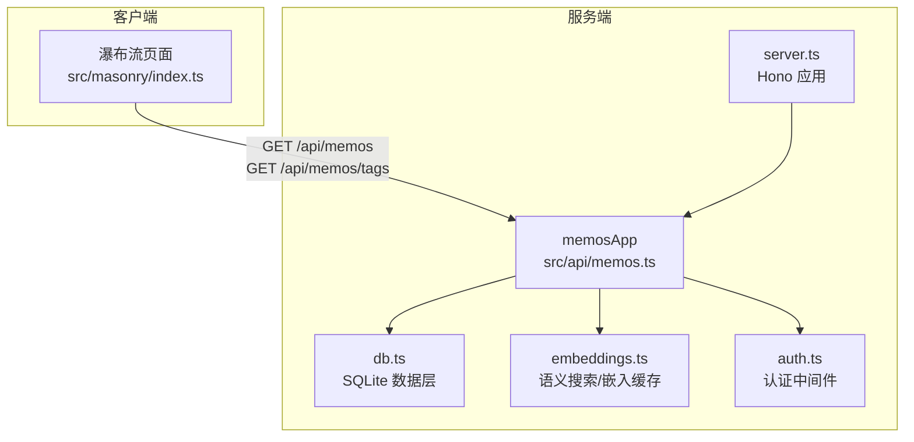
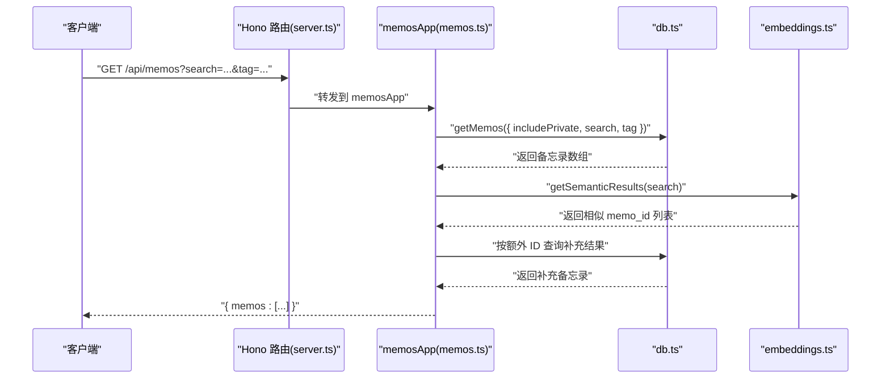
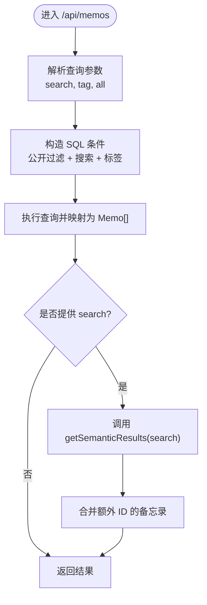
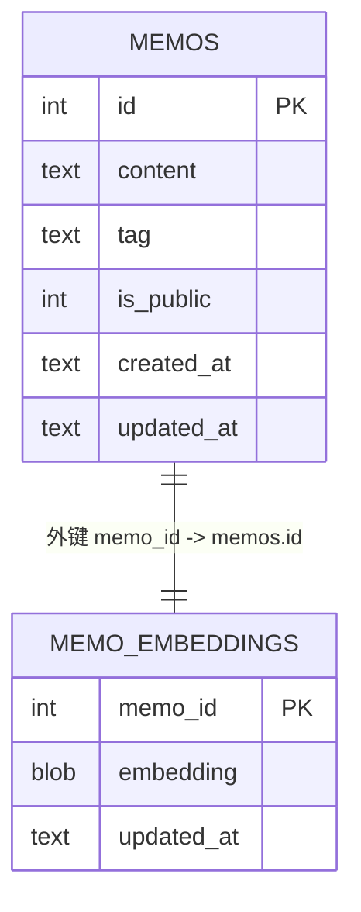
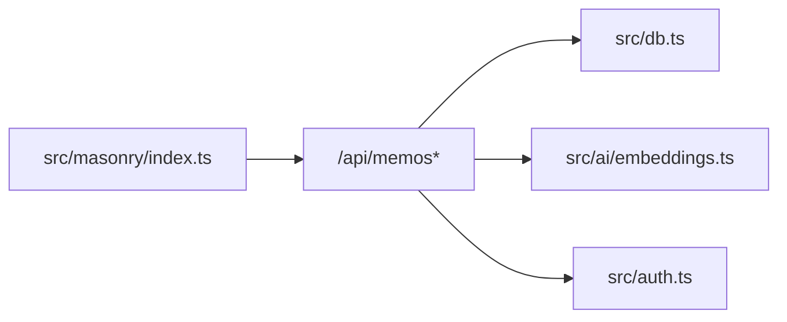

# 备忘录 API

<cite>
**本文引用的文件**
- [src/api/memos.ts](file://src/api/memos.ts)
- [src/db.ts](file://src/db.ts)
- [src/model.ts](file://src/model.ts)
- [src/auth.ts](file://src/auth.ts)
- [src/server.ts](file://src/server.ts)
- [src/ai/embeddings.ts](file://src/ai/embeddings.ts)
- [README.md](file://README.md)
- [src/masonry/index.ts](file://src/masonry/index.ts)
</cite>

## 目录
1. [简介](#简介)
2. [项目结构](#项目结构)
3. [核心组件](#核心组件)
4. [架构总览](#架构总览)
5. [详细组件分析](#详细组件分析)
6. [依赖关系分析](#依赖关系分析)
7. [性能考虑](#性能考虑)
8. [故障排查指南](#故障排查指南)
9. [结论](#结论)
10. [附录](#附录)

## 简介
本文件为“备忘录 API”的完整接口文档，覆盖所有与备忘录相关的 RESTful 端点，包括创建、读取、更新、删除等 CRUD 操作；说明查询参数的使用方法（搜索关键词、标签筛选、可见性选项），以及分页参数的现状与扩展建议；提供每个端点的 HTTP 方法、URL 模式、请求参数与响应格式；包含数据验证规则与错误处理机制；并给出性能优化建议与批量操作指南。

## 项目结构
- 后端基于 Hono 框架，主入口在 server.ts，挂载子应用 memosApp。
- 数据层使用 SQLite（bun:sqlite），表结构在 db.ts 中初始化。
- 备忘录模型定义在 model.ts。
- 认证逻辑在 auth.ts，提供中间件与会话管理。
- 语义搜索与嵌入缓存在 ai/embeddings.ts。
- 前端瀑布流页面通过 src/masonry/index.ts 调用 /api/memos 与 /api/memos/tags 等接口。

图表来源
- [src/server.ts:74-80](file://src/server.ts#L74-L80)
- [src/api/memos.ts:18-139](file://src/api/memos.ts#L18-L139)
- [src/db.ts:15-57](file://src/db.ts#L15-L57)
- [src/ai/embeddings.ts:12-35](file://src/ai/embeddings.ts#L12-L35)
- [src/auth.ts:95-111](file://src/auth.ts#L95-L111)

章节来源
- [src/server.ts:74-80](file://src/server.ts#L74-L80)
- [README.md:25-45](file://README.md#L25-L45)

## 核心组件
- 备忘录 API 子应用：提供 /api/memos 的 CRUD 与查询能力，支持搜索、标签筛选与可见性控制。
- 数据层：封装 SQLite 表操作，提供 getMemos、getAllTags、countMemos、create/update/delete 等方法。
- 认证中间件：requireAuth 与 authMiddleware，用于保护需要登录的端点。
- 语义搜索：基于嵌入向量的相似度检索，非阻塞地合并结果。

章节来源
- [src/api/memos.ts:18-139](file://src/api/memos.ts#L18-L139)
- [src/db.ts:99-148](file://src/db.ts#L99-L148)
- [src/auth.ts:95-111](file://src/auth.ts#L95-L111)
- [src/ai/embeddings.ts:66-86](file://src/ai/embeddings.ts#L66-L86)

## 架构总览
备忘录 API 的调用链路如下：客户端发起请求 → Hono 路由 → memosApp 控制器 → db 数据层 → SQLite；对于搜索，还会触发语义搜索并合并结果。

图表来源
- [src/server.ts:74-80](file://src/server.ts#L74-L80)
- [src/api/memos.ts:20-47](file://src/api/memos.ts#L20-L47)
- [src/db.ts:99-131](file://src/db.ts#L99-L131)
- [src/ai/embeddings.ts:66-86](file://src/ai/embeddings.ts#L66-L86)

## 详细组件分析

### 备忘录 API 端点总览
- GET /api/memos
  - 查询参数：search（字符串，全文搜索）、tag（字符串，标签精确匹配）、all（字符串，设为 "true" 时包含私密备忘录，需认证）
  - 响应：{ memos: Memo[] }
  - 特性：当提供 search 时，非阻塞地执行语义搜索并合并结果
- GET /api/memos/count
  - 查询参数：无
  - 响应：{ count: number }
- GET /api/memos/tags
  - 查询参数：无
  - 响应：{ tags: string[] }
- POST /api/memos
  - 请求体：{ content: string, is_public?: boolean, tag?: string }
  - 响应：{ memo: Memo }
  - 认证：需要 Cookie（通过 /api/auth/login 获取）
- PUT /api/memos/:id
  - 路径参数：id（数字）
  - 请求体：{ content?: string, is_public?: boolean, tag?: string }
  - 响应：{ memo: Memo }
  - 认证：需要 Cookie
- DELETE /api/memos/:id
  - 路径参数：id（数字）
  - 响应：{ ok: true }
  - 认证：需要 Cookie

章节来源
- [src/api/memos.ts:20-139](file://src/api/memos.ts#L20-L139)
- [README.md:112-129](file://README.md#L112-L129)

### GET /api/memos 查询参数与行为
- search：全文搜索（SQL LIKE %content%），同时触发语义相似度检索，将额外匹配的备忘录合并到结果中
- tag：按标签精确匹配
- all："true" 时包含私密备忘录，但需通过 requireAuth 校验（未认证时仅返回公开）
- 结果排序：按 created_at 降序

图表来源
- [src/api/memos.ts:20-47](file://src/api/memos.ts#L20-L47)
- [src/db.ts:99-131](file://src/db.ts#L99-L131)
- [src/ai/embeddings.ts:66-86](file://src/ai/embeddings.ts#L66-L86)

章节来源
- [src/api/memos.ts:20-47](file://src/api/memos.ts#L20-L47)
- [src/db.ts:99-131](file://src/db.ts#L99-L131)

### GET /api/memos/count
- 作用：统计备忘录总数
- 规则：若未认证，则仅统计公开备忘录；已认证则包含私密

章节来源
- [src/api/memos.ts:49-54](file://src/api/memos.ts#L49-L54)
- [src/db.ts:141-148](file://src/db.ts#L141-L148)

### GET /api/memos/tags
- 作用：获取所有非空标签
- 响应：{ tags: string[] }

章节来源
- [src/api/memos.ts:56-60](file://src/api/memos.ts#L56-L60)
- [src/db.ts:133-139](file://src/db.ts#L133-L139)

### POST /api/memos（创建）
- 请求体字段
  - content：必填，字符串且非空
  - is_public：可选，默认 true
  - tag：可选
- 成功响应：{ memo: Memo }（状态码 201）
- 错误响应：
  - 400：JSON 解析失败或 content 缺失/为空
- 嵌入处理：异步生成并存储向量嵌入（fire-and-forget）

章节来源
- [src/api/memos.ts:62-91](file://src/api/memos.ts#L62-L91)
- [src/db.ts:158-169](file://src/db.ts#L158-L169)
- [src/ai/embeddings.ts:88-98](file://src/ai/embeddings.ts#L88-L98)

### PUT /api/memos/:id（更新）
- 路径参数：id（数字）
- 请求体字段：content、is_public、tag（任选其一或多个）
- 验证规则：
  - 若提供 content，必须非空
- 成功响应：{ memo: Memo }
- 错误响应：
  - 400：content 提供但为空
  - 404：memo 不存在
- 嵌入处理：若 content 发生变化，异步重新生成并存储嵌入

章节来源
- [src/api/memos.ts:93-126](file://src/api/memos.ts#L93-L126)
- [src/db.ts:171-189](file://src/db.ts#L171-L189)
- [src/ai/embeddings.ts:88-98](file://src/ai/embeddings.ts#L88-L98)

### DELETE /api/memos/:id（删除）
- 路径参数：id（数字）
- 成功响应：{ ok: true }
- 错误响应：404（memo 不存在）
- 嵌入处理：清理对应嵌入缓存

章节来源
- [src/api/memos.ts:128-139](file://src/api/memos.ts#L128-L139)
- [src/db.ts:191-195](file://src/db.ts#L191-L195)
- [src/ai/embeddings.ts:43-46](file://src/ai/embeddings.ts#L43-L46)

### 认证与可见性
- 需要 Cookie 的端点：POST/PUT/DELETE /api/memos/*
- 认证中间件：requireAuth 与 authMiddleware
- all 查询参数：当设为 "true" 时包含私密备忘录，但前提是已认证

章节来源
- [src/api/memos.ts:62-69](file://src/api/memos.ts#L62-L69)
- [src/api/memos.ts:93-101](file://src/api/memos.ts#L93-L101)
- [src/api/memos.ts:128-132](file://src/api/memos.ts#L128-L132)
- [src/api/memos.ts:21-28](file://src/api/memos.ts#L21-L28)
- [src/auth.ts:95-111](file://src/auth.ts#L95-L111)

### 数据模型与表结构
- Memo 字段：id、content、tag、is_public、created_at、updated_at
- 表结构：memos（id、content、tag、is_public、created_at、updated_at）
- 嵌入表：memo_embeddings（memo_id、embedding、updated_at）

图表来源
- [src/db.ts:17-56](file://src/db.ts#L17-L56)
- [src/model.ts:1-8](file://src/model.ts#L1-L8)

章节来源
- [src/db.ts:17-56](file://src/db.ts#L17-L56)
- [src/model.ts:1-8](file://src/model.ts#L1-L8)

## 依赖关系分析
- memosApp 依赖 db.ts 提供的数据访问函数，以及 embeddings.ts 提供的语义搜索能力。
- 认证中间件 requireAuth/authMiddleware 用于保护写操作端点。
- 前端瀑布流页面通过 fetch 调用 /api/memos 与 /api/memos/tags，实现搜索与标签筛选。

图表来源
- [src/masonry/index.ts:272-351](file://src/masonry/index.ts#L272-L351)
- [src/api/memos.ts:18-139](file://src/api/memos.ts#L18-L139)
- [src/db.ts:99-148](file://src/db.ts#L99-L148)
- [src/ai/embeddings.ts:66-86](file://src/ai/embeddings.ts#L66-L86)
- [src/auth.ts:95-111](file://src/auth.ts#L95-L111)

章节来源
- [src/masonry/index.ts:272-351](file://src/masonry/index.ts#L272-L351)
- [src/api/memos.ts:18-139](file://src/api/memos.ts#L18-L139)

## 性能考虑
- 语义搜索非阻塞：在 LIKE 结果基础上并发执行相似度检索，避免阻塞主流程。
- 嵌入缓存：内存中维护向量缓存，减少重复计算；支持热加载与持久化存储。
- 前端瀑布流：虚拟滚动只渲染可视区域卡片，降低 DOM 与布局开销。
- SQLite 优化：WAL 模式与外键约束提升并发与一致性。
- 建议
  - 对高频搜索词建立索引（content、tag）以加速 LIKE 与精确匹配。
  - 限制语义搜索返回数量（默认 20），避免过多合并导致响应膨胀。
  - 对大文本内容进行分页或分段处理，避免一次性加载过多数据。

[本节为通用性能建议，不直接分析具体文件]

## 故障排查指南
- 400 错误（JSON 解析失败或字段校验失败）
  - 检查请求体格式与必填字段
  - 参考：POST/PUT 请求体校验逻辑
- 401 未认证
  - 确认已通过 /api/auth/login 获取 Cookie 并正确携带
- 404 未找到
  - 检查资源 ID 是否有效
- 语义搜索未生效
  - 确认 AI 能力可用与嵌入缓存已初始化
  - 检查 search 参数是否提供

章节来源
- [src/api/memos.ts:62-91](file://src/api/memos.ts#L62-L91)
- [src/api/memos.ts:93-126](file://src/api/memos.ts#L93-L126)
- [src/api/memos.ts:128-139](file://src/api/memos.ts#L128-L139)
- [src/auth.ts:95-111](file://src/auth.ts#L95-L111)
- [src/ai/embeddings.ts:12-35](file://src/ai/embeddings.ts#L12-L35)

## 结论
备忘录 API 提供了简洁而强大的 CRUD 能力，结合搜索与标签筛选满足日常使用需求；通过语义搜索增强发现能力，配合嵌入缓存与前端瀑布流实现高效体验。建议在生产环境中关注数据库索引、嵌入缓存与前端虚拟滚动的协同优化。

[本节为总结性内容，不直接分析具体文件]

## 附录

### 端点清单与示例
- GET /api/memos
  - 查询参数：search、tag、all
  - 示例：curl "http://localhost:3020/api/memos?search=备忘&tag=work"
  - 响应：{ memos: [...] }
- GET /api/memos/count
  - 示例：curl http://localhost:3020/api/memos/count
  - 响应：{ count: number }
- GET /api/memos/tags
  - 示例：curl http://localhost:3020/api/memos/tags
  - 响应：{ tags: string[] }
- POST /api/memos
  - 示例：curl -X POST http://localhost:3020/api/memos -H "Content-Type: application/json" -d '{"content":"今日备忘","is_public":true,"tag":"work"}'
  - 响应：{ memo: Memo }（201）
- PUT /api/memos/:id
  - 示例：curl -X PUT http://localhost:3020/api/memos/1 -H "Content-Type: application/json" -d '{"content":"更新内容","is_public":false}'
  - 响应：{ memo: Memo }
- DELETE /api/memos/:id
  - 示例：curl -X DELETE http://localhost:3020/api/memos/1
  - 响应：{ ok: true }

章节来源
- [README.md:112-176](file://README.md#L112-L176)
- [src/api/memos.ts:20-139](file://src/api/memos.ts#L20-L139)

### 数据验证与错误码
- 400：请求体无效（JSON 解析失败）、content 缺失或为空
- 401：未认证
- 404：资源不存在
- 201：创建成功

章节来源
- [src/api/memos.ts:62-91](file://src/api/memos.ts#L62-L91)
- [src/api/memos.ts:93-126](file://src/api/memos.ts#L93-L126)
- [src/api/memos.ts:128-139](file://src/api/memos.ts#L128-L139)
- [src/auth.ts:95-111](file://src/auth.ts#L95-L111)

### 批量操作指南
- 当前 API 不提供原生批量端点。建议方式：
  - 客户端循环调用 POST/PUT/DELETE，注意速率限制与幂等性
  - 或在服务端扩展批量端点（例如：批量创建/更新/删除），并确保事务与回滚策略

[本节为通用实践建议，不直接分析具体文件]