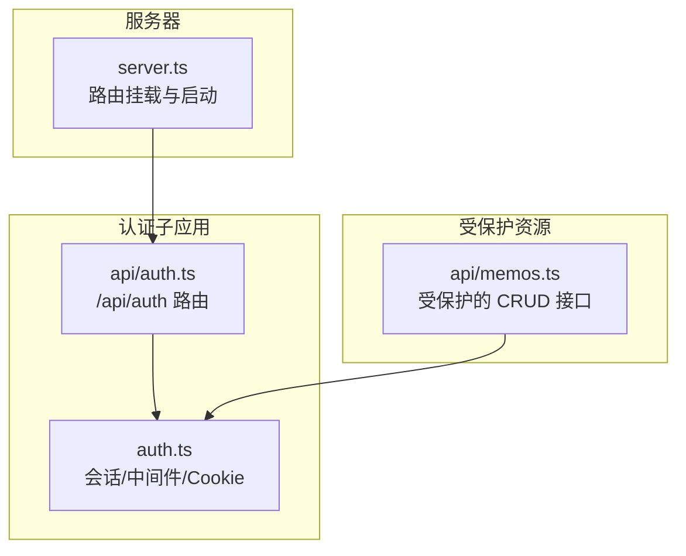
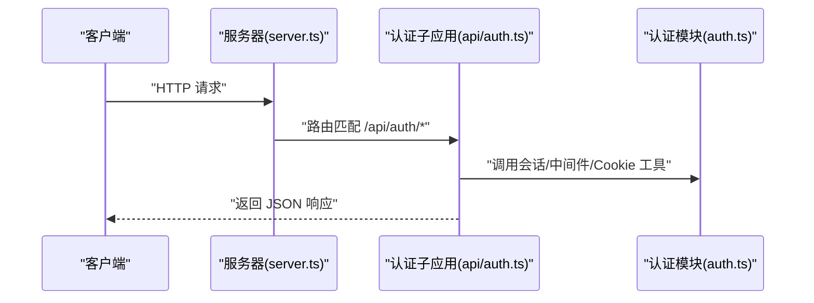
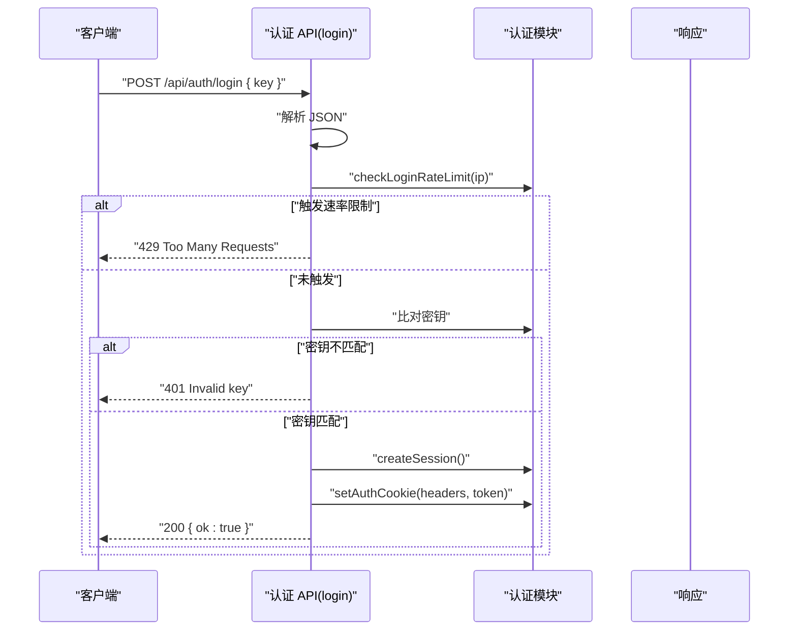
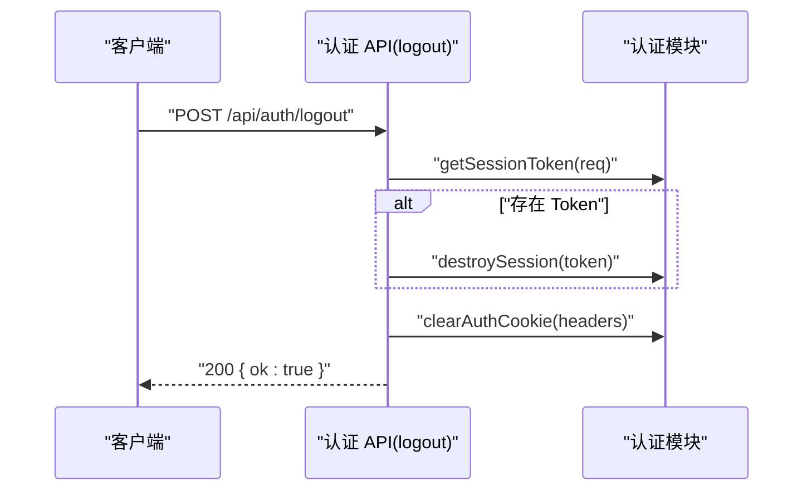
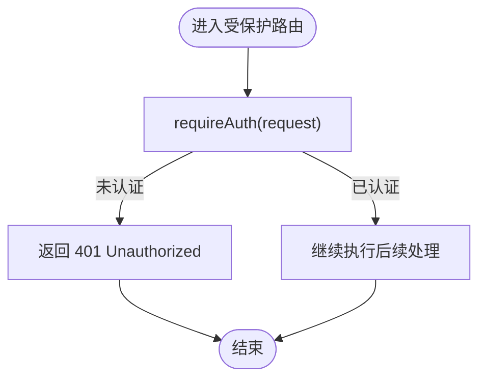
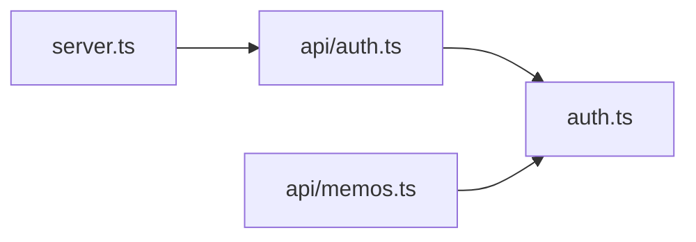

# 认证 API

<cite>
**本文引用的文件**
- [src/api/auth.ts](file://src/api/auth.ts)
- [src/auth.ts](file://src/auth.ts)
- [src/server.ts](file://src/server.ts)
- [README.md](file://README.md)
- [src/api/memos.ts](file://src/api/memos.ts)
</cite>

## 目录
1. [简介](#简介)
2. [项目结构](#项目结构)
3. [核心组件](#核心组件)
4. [架构总览](#架构总览)
5. [详细组件分析](#详细组件分析)
6. [依赖关系分析](#依赖关系分析)
7. [性能考量](#性能考量)
8. [故障排查指南](#故障排查指南)
9. [结论](#结论)
10. [附录](#附录)

## 简介
本文件为认证 API 的详细接口文档，覆盖以下端点：
- GET /api/auth/check
- POST /api/auth/login
- POST /api/auth/logout

文档内容包括：
- 认证机制与会话管理（密钥校验、Cookie 设置、内存会话存储）
- 每个端点的 HTTP 方法、URL 模式、请求参数、响应格式
- 请求/响应示例（以路径形式给出，避免直接粘贴代码）
- 错误处理与安全注意事项（生产环境密钥配置）
- 客户端实现建议与最佳实践

## 项目结构
认证相关代码集中在以下文件中：
- 认证业务逻辑与中间件：src/auth.ts
- 认证 API 路由与端点实现：src/api/auth.ts
- 服务器入口与路由挂载：src/server.ts
- 项目说明与 API 总览：README.md
- 使用认证中间件的受保护 API 示例：src/api/memos.ts

图表来源
- [src/server.ts:74-80](file://src/server.ts#L74-L80)
- [src/api/auth.ts:25](file://src/api/auth.ts#L25)
- [src/auth.ts:102-107](file://src/auth.ts#L102-L107)
- [src/api/memos.ts:1](file://src/api/memos.ts#L1)

章节来源
- [src/server.ts:74-80](file://src/server.ts#L74-L80)
- [README.md:100-111](file://README.md#L100-L111)

## 核心组件
- 认证模块（src/auth.ts）
  - 会话存储：内存 Set，仅支持单管理员用户，服务重启即失效
  - Cookie 名称与过期策略：名称为固定值，HttpOnly + SameSite=Strict + Path=/ + Max-Age=24小时
  - 认证工具函数：解析 Cookie、获取会话 Token、判断是否已认证、创建/销毁会话、设置/清除 Cookie
  - 登录频率限制：基于 IP 的计数与冷却时间控制
  - 中间件：requireAuth 与 Hono 中间件，用于保护受保护接口
- 认证 API（src/api/auth.ts）
  - 端点：/api/auth/check、/api/auth/login、/api/auth/logout
  - 密钥来源：优先从环境变量读取；生产环境未设置时直接退出；开发环境使用默认密钥并警告
  - 登录流程：速率限制检查、JSON 解析、密钥比对、成功后创建会话并设置 Cookie
  - 登出流程：根据请求中的 Cookie 获取 Token 并销毁，同时清除 Cookie

章节来源
- [src/auth.ts:4-55](file://src/auth.ts#L4-L55)
- [src/auth.ts:57-89](file://src/auth.ts#L57-L89)
- [src/auth.ts:91-107](file://src/auth.ts#L91-L107)
- [src/api/auth.ts:14-23](file://src/api/auth.ts#L14-L23)
- [src/api/auth.ts:27-30](file://src/api/auth.ts#L27-L30)
- [src/api/auth.ts:32-60](file://src/api/auth.ts#L32-L60)
- [src/api/auth.ts:62-68](file://src/api/auth.ts#L62-L68)

## 架构总览
认证 API 的调用链路如下：
- 客户端发起请求至 /api/auth/* 端点
- 认证 API 在内部调用认证模块提供的会话与 Cookie 工具
- 受保护的业务 API（如 /api/memos/*）通过中间件 requireAuth 或 Hono 中间件进行认证拦截

图表来源
- [src/server.ts:74-80](file://src/server.ts#L74-L80)
- [src/api/auth.ts:25](file://src/api/auth.ts#L25)
- [src/auth.ts:102-107](file://src/auth.ts#L102-L107)

## 详细组件分析

### 端点：GET /api/auth/check
- 方法与路径：GET /api/auth/check
- 认证要求：无需认证
- 功能描述：检查当前请求是否已认证（依据 Cookie 中的会话 Token 是否存在于内存会话集合）
- 请求参数：无
- 响应体字段
  - authenticated: boolean，表示当前会话是否有效
- 响应示例（路径）
  - [示例响应（已认证）:28-30](file://src/api/auth.ts#L28-L30)
  - [示例响应（未认证）:28-30](file://src/api/auth.ts#L28-L30)
- 错误码：无错误码；始终返回 200
- 安全性：无敏感信息返回，仅返回布尔状态

章节来源
- [src/api/auth.ts:27-30](file://src/api/auth.ts#L27-L30)
- [src/auth.ts:23-31](file://src/auth.ts#L23-L31)

### 端点：POST /api/auth/login
- 方法与路径：POST /api/auth/login
- 认证要求：无需认证
- 功能描述：使用密钥进行登录，成功后在响应头中设置 Cookie，用于后续会话保持
- 请求体
  - key: string，必需。必须与配置的密钥一致
- 响应体字段
  - ok: boolean，登录成功时为 true
- 错误处理
  - 400：请求体不是合法 JSON
  - 401：密钥无效或缺失
  - 429：登录过于频繁（速率限制触发）
- 速率限制
  - 基于客户端 IP（优先 X-Forwarded-For，其次 X-Real-IP，否则 unknown）统计
  - 最大尝试次数：5 次
  - 冷却时间：1 分钟
- 安全注意事项
  - 密钥来源：优先从环境变量 MEMOS_SECRET_KEY 读取
  - 生产环境未设置密钥时，进程会直接退出并输出致命错误日志
  - 开发环境使用默认密钥并输出警告日志
- Cookie 设置
  - 名称：固定值
  - 属性：HttpOnly、SameSite=Strict、Path=/、Max-Age=24小时
- 请求/响应示例（路径）
  - [登录请求（成功）:32-60](file://src/api/auth.ts#L32-L60)
  - [登录请求（密钥错误）:51-54](file://src/api/auth.ts#L51-L54)
  - [登录请求（速率限制触发）:37-42](file://src/api/auth.ts#L37-L42)

图表来源
- [src/api/auth.ts:32-60](file://src/api/auth.ts#L32-L60)
- [src/auth.ts:33-48](file://src/auth.ts#L33-L48)
- [src/auth.ts:57-89](file://src/auth.ts#L57-L89)

章节来源
- [src/api/auth.ts:32-60](file://src/api/auth.ts#L32-L60)
- [src/auth.ts:33-48](file://src/auth.ts#L33-L48)
- [src/auth.ts:57-89](file://src/auth.ts#L57-L89)

### 端点：POST /api/auth/logout
- 方法与路径：POST /api/auth/logout
- 认证要求：无需认证
- 功能描述：清除当前会话（如果存在），并清除 Cookie
- 请求参数：无
- 响应体字段
  - ok: boolean，登出成功时为 true
- 错误码：无错误码；始终返回 200
- Cookie 清除
  - 将 Cookie 的 Max-Age 设为 0，使其立即失效
- 请求/响应示例（路径）
  - [登出请求:62-68](file://src/api/auth.ts#L62-L68)

图表来源
- [src/api/auth.ts:62-68](file://src/api/auth.ts#L62-L68)
- [src/auth.ts:23-26](file://src/auth.ts#L23-L26)
- [src/auth.ts:39-41](file://src/auth.ts#L39-L41)
- [src/auth.ts:50-55](file://src/auth.ts#L50-L55)

章节来源
- [src/api/auth.ts:62-68](file://src/api/auth.ts#L62-L68)
- [src/auth.ts:23-26](file://src/auth.ts#L23-L26)
- [src/auth.ts:50-55](file://src/auth.ts#L50-L55)

### 会话与中间件集成
- requireAuth：若未认证，返回 401 响应；否则返回 null
- authMiddleware（Hono 中间件）：若未认证，直接返回 401；通过则继续后续处理
- 受保护 API 示例：memos API 对多个端点使用 authMiddleware 或 requireAuth 进行保护

图表来源
- [src/auth.ts:91-100](file://src/auth.ts#L91-L100)
- [src/auth.ts:102-107](file://src/auth.ts#L102-L107)
- [src/api/memos.ts:63](file://src/api/memos.ts#L63)

章节来源
- [src/auth.ts:91-100](file://src/auth.ts#L91-L100)
- [src/auth.ts:102-107](file://src/auth.ts#L102-L107)
- [src/api/memos.ts:63](file://src/api/memos.ts#L63)

## 依赖关系分析
- 服务器入口将认证子应用挂载到 /api/auth
- 认证 API 依赖认证模块提供的会话与 Cookie 工具
- 受保护的业务 API 依赖认证模块的中间件或 requireAuth 函数

图表来源
- [src/server.ts:74-80](file://src/server.ts#L74-L80)
- [src/api/auth.ts:1](file://src/api/auth.ts#L1)
- [src/auth.ts:1](file://src/auth.ts#L1)
- [src/api/memos.ts:1](file://src/api/memos.ts#L1)

章节来源
- [src/server.ts:74-80](file://src/server.ts#L74-L80)
- [src/api/auth.ts:1](file://src/api/auth.ts#L1)
- [src/auth.ts:1](file://src/auth.ts#L1)
- [src/api/memos.ts:1](file://src/api/memos.ts#L1)

## 性能考量
- 会话存储：内存 Set，查询与插入均为 O(1)，适合单管理员场景
- Cookie 设置：每次登录/登出均通过响应头设置/清除，开销极低
- 速率限制：基于 Map 的 IP 维度计数，时间复杂度低，冷却窗口到期后自动清理
- 注意：当前实现为单实例内存存储，不支持横向扩展；如需集群部署，建议迁移到共享存储（如 Redis）

## 故障排查指南
- 登录返回 401（Invalid key）
  - 检查请求体是否包含正确的密钥字段
  - 确认密钥与环境变量 MEMOS_SECRET_KEY 一致
  - 开发环境默认密钥可能被覆盖，但生产环境必须显式设置
  - 参考：[登录端点实现:51-54](file://src/api/auth.ts#L51-L54)
- 登录返回 429（Too many login attempts）
  - 触发速率限制，等待约 1 分钟后再试
  - 参考：[速率限制实现:57-89](file://src/auth.ts#L57-L89)
- 登录后仍提示未认证
  - 确认浏览器已接收并保存 Cookie（HttpOnly + SameSite=Strict）
  - 检查跨域/同源策略与 Cookie 作用域（Path=/）
  - 参考：[Cookie 设置:43-48](file://src/auth.ts#L43-L48)
- 生产环境启动报错退出
  - 未设置 MEMOS_SECRET_KEY，进程直接退出
  - 参考：[密钥加载逻辑:14-23](file://src/api/auth.ts#L14-L23)
- 登出后仍显示已登录
  - 确认请求头未携带旧 Cookie
  - 参考：[登出端点实现:62-68](file://src/api/auth.ts#L62-L68)

章节来源
- [src/api/auth.ts:14-23](file://src/api/auth.ts#L14-L23)
- [src/auth.ts:43-48](file://src/auth.ts#L43-L48)
- [src/auth.ts:57-89](file://src/auth.ts#L57-L89)
- [src/api/auth.ts:62-68](file://src/api/auth.ts#L62-L68)

## 结论
本认证方案采用“密钥 + Cookie + 内存会话”的简单模型，满足单管理员、本地或小规模部署场景。生产环境务必设置强密钥并妥善保管，避免明文或弱口令。对于需要高可用与横向扩展的场景，建议迁移至持久化会话存储与更完善的鉴权体系。

## 附录

### 环境变量与默认值
- MEMOS_SECRET_KEY：管理员登录密钥
  - 生产环境：必须设置，否则启动失败
  - 开发环境：可省略，使用默认密钥并输出警告
- PORT：服务器监听端口，默认 3020
- 参考：[环境变量说明:59-65](file://README.md#L59-L65)

### 客户端实现指南与最佳实践
- 登录流程
  - 发送 POST /api/auth/login，携带 JSON { key: "your-secret-key" }
  - 成功后浏览器会收到带有 HttpOnly Cookie 的 Set-Cookie 响应头
  - 后续请求自动携带该 Cookie，无需手动处理
- 登出流程
  - 发送 POST /api/auth/logout，清除会话与 Cookie
- 受保护接口
  - 对于需要认证的接口（如 /api/memos/*），确保携带 Cookie
  - 参考：[受保护接口示例:63-92](file://src/api/memos.ts#L63-L92)
- 安全建议
  - 使用 HTTPS 传输，防止中间人窃听
  - 避免在前端代码中硬编码密钥
  - 生产环境定期轮换密钥并更新环境变量
  - 合理设置 SameSite 与 Secure 属性（当前实现为 Strict，如需跨站访问请评估风险）
- 错误处理
  - 对 401 未授权与 429 过于频繁的登录进行降级处理
  - 登录失败时不要暴露具体原因给前端