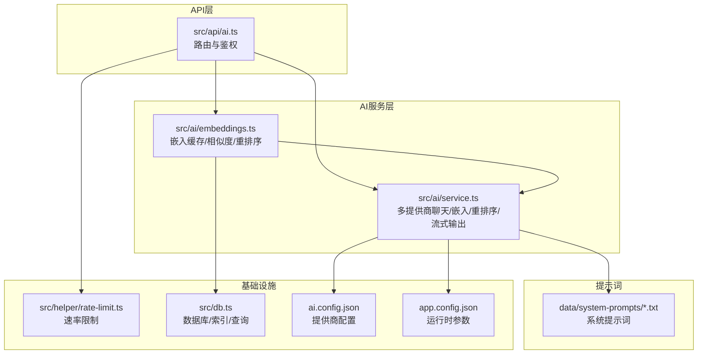
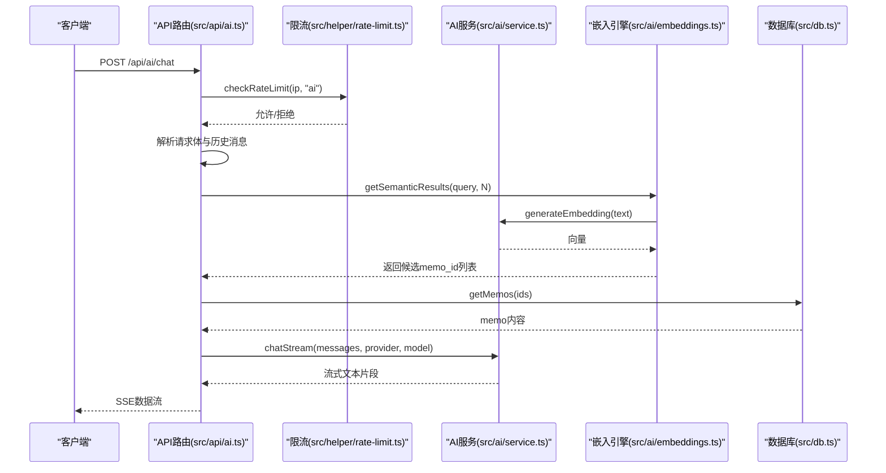
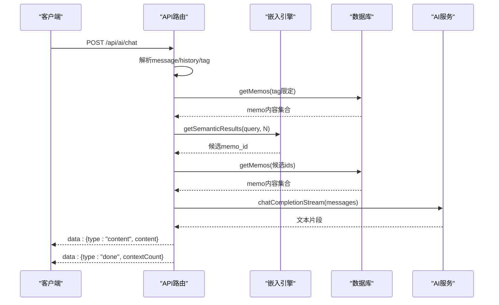
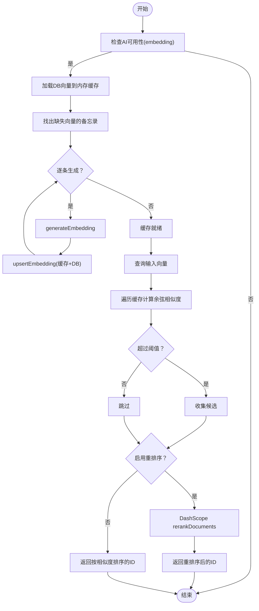
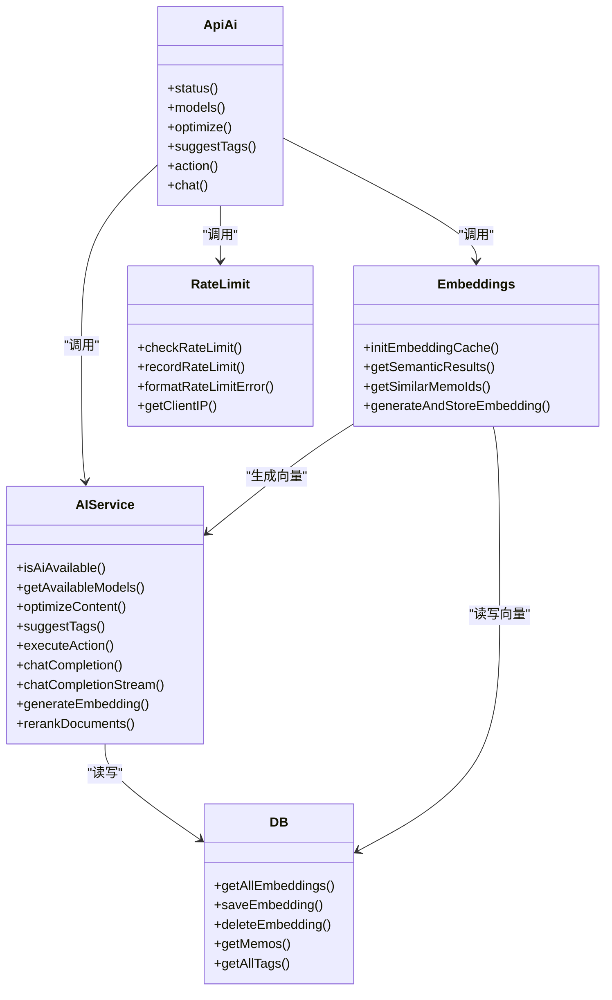

# AI服务API

<cite>
**本文引用的文件**
- [src/api/ai.ts](file://src/api/ai.ts)
- [src/ai/service.ts](file://src/ai/service.ts)
- [src/ai/embeddings.ts](file://src/ai/embeddings.ts)
- [src/helper/rate-limit.ts](file://src/helper/rate-limit.ts)
- [src/db.ts](file://src/db.ts)
- [ai.config.json](file://ai.config.json)
- [app.config.json](file://app.config.json)
- [data/system-prompts/optimize.txt](file://data/system-prompts/optimize.txt)
- [data/system-prompts/suggest-tags.txt](file://data/system-prompts/suggest-tags.txt)
- [data/system-prompts/rewrite.txt](file://data/system-prompts/rewrite.txt)
- [data/system-prompts/expand.txt](file://data/system-prompts/expand.txt)
- [data/system-prompts/extract-keypoints.txt](file://data/system-prompts/extract-keypoints.txt)
- [data/system-prompts/polish.txt](file://data/system-prompts/polish.txt)
- [data/system-prompts/summarize.txt](file://data/system-prompts/summarize.txt)
- [README.md](file://README.md)
</cite>

## 目录
1. [简介](#简介)
2. [项目结构](#项目结构)
3. [核心组件](#核心组件)
4. [架构总览](#架构总览)
5. [详细组件分析](#详细组件分析)
6. [依赖关系分析](#依赖关系分析)
7. [性能考量](#性能考量)
8. [故障排查指南](#故障排查指南)
9. [结论](#结论)
10. [附录](#附录)

## 简介
本文件面向AI服务API的使用者与维护者，系统化梳理以下能力与接口：
- 内容优化：/api/ai/optimize
- 标签建议：/api/ai/suggest-tags
- 创意写作（统一动作）：/api/ai/action（支持摘要、重写、扩写、提取要点、润色）
- 对话式工作台（SSE）：/api/ai/chat
- 语义搜索：基于嵌入向量的相似度检索与重排序

同时覆盖AI提供商集成（DeepSeek、Kimi、GLM、DashScope）、嵌入向量生成与缓存机制、请求/响应示例、限流与性能优化策略、错误处理与重试逻辑，以及配置指南与最佳实践。

## 项目结构
AI相关模块集中在src/ai目录，API路由在src/api/ai.ts中定义，限流逻辑在src/helper/rate-limit.ts中实现，配置文件为ai.config.json与app.config.json，系统提示词位于data/system-prompts。

图表来源
- [src/api/ai.ts:1-326](file://src/api/ai.ts#L1-L326)
- [src/ai/service.ts:1-507](file://src/ai/service.ts#L1-L507)
- [src/ai/embeddings.ts:1-228](file://src/ai/embeddings.ts#L1-L228)
- [src/helper/rate-limit.ts:1-153](file://src/helper/rate-limit.ts#L1-L153)
- [src/db.ts:1-200](file://src/db.ts#L1-L200)
- [ai.config.json:1-44](file://ai.config.json#L1-L44)
- [app.config.json:1-22](file://app.config.json#L1-L22)

章节来源
- [src/api/ai.ts:1-326](file://src/api/ai.ts#L1-L326)
- [src/ai/service.ts:1-507](file://src/ai/service.ts#L1-L507)
- [src/ai/embeddings.ts:1-228](file://src/ai/embeddings.ts#L1-L228)
- [src/helper/rate-limit.ts:1-153](file://src/helper/rate-limit.ts#L1-L153)
- [src/db.ts:1-200](file://src/db.ts#L1-L200)
- [ai.config.json:1-44](file://ai.config.json#L1-L44)
- [app.config.json:1-22](file://app.config.json#L1-L22)

## 核心组件
- 多提供商聊天与流式输出：封装OpenAI兼容格式的聊天完成与流式完成，支持超时控制与错误降级。
- 嵌入向量与语义检索：基于DashScope生成向量，内存缓存+余弦相似度，支持可选重排序（DashScope qwen3-rerank）。
- 统一动作执行：将“摘要、重写、扩写、提取要点、润色”映射到对应系统提示词。
- 速率限制：基于IP的小时/日双窗口限流，支持环境变量与配置文件覆盖。
- 配置体系：ai.config.json定义提供商、默认模型；app.config.json定义超时、温度、最大token、相似度阈值、重排序参数、限流阈值。

章节来源
- [src/ai/service.ts:130-506](file://src/ai/service.ts#L130-L506)
- [src/ai/embeddings.ts:16-228](file://src/ai/embeddings.ts#L16-L228)
- [src/helper/rate-limit.ts:77-153](file://src/helper/rate-limit.ts#L77-L153)
- [ai.config.json:1-44](file://ai.config.json#L1-L44)
- [app.config.json:1-22](file://app.config.json#L1-L22)

## 架构总览
AI服务API采用“路由层-服务层-外部服务”的分层设计。路由层负责鉴权、参数校验、限流与SSE流式输出；服务层负责提供商解析、HTTP调用、提示词拼装与错误降级；嵌入层负责向量化、缓存与相似度检索。

图表来源
- [src/api/ai.ts:198-325](file://src/api/ai.ts#L198-L325)
- [src/ai/embeddings.ts:95-154](file://src/ai/embeddings.ts#L95-L154)
- [src/ai/service.ts:480-506](file://src/ai/service.ts#L480-L506)
- [src/helper/rate-limit.ts:77-110](file://src/helper/rate-limit.ts#L77-L110)
- [src/db.ts:122-169](file://src/db.ts#L122-L169)

## 详细组件分析

### 路由与接口总览
- /api/ai/status：检测AI可用性（无需鉴权）
- /api/ai/models：列出可用提供商与模型（需鉴权）
- /api/ai/optimize：内容优化（需鉴权）
- /api/ai/suggest-tags：标签建议（需鉴权）
- /api/ai/action：统一动作（摘要/重写/扩写/提取要点/润色，需鉴权）
- /api/ai/chat：对话式工作台（SSE，需鉴权）

章节来源
- [src/api/ai.ts:23-325](file://src/api/ai.ts#L23-L325)

### 内容优化 /api/ai/optimize
- 请求体字段：content（必填）、provider（可选）、model（可选）
- 业务流程：参数校验 → 可用性检查 → 限流 → 调用optimizeContent → 记录限流 → 返回结果
- 错误处理：无效JSON、缺少content、未配置、限流、服务不可用
- 示例请求/响应路径：
  - 请求体示例：[请求体示例:34-72](file://src/api/ai.ts#L34-L72)
  - 成功响应：[成功响应:69-71](file://src/api/ai.ts#L69-L71)

章节来源
- [src/api/ai.ts:33-72](file://src/api/ai.ts#L33-L72)
- [src/ai/service.ts:249-264](file://src/ai/service.ts#L249-L264)

### 标签建议 /api/ai/suggest-tags
- 请求体字段：content（必填）、provider（可选）、model（可选）
- 业务流程：参数校验 → 可用性检查 → 限流 → 读取现有标签 → 调用suggestTags → 记录限流 → 返回标签数组
- 输出解析：优先尝试JSON数组，失败则按换行/逗号切分并清洗
- 示例请求/响应路径：
  - 请求体示例：[请求体示例:74-112](file://src/api/ai.ts#L74-L112)
  - 成功响应：[成功响应:109-111](file://src/api/ai.ts#L109-L111)

章节来源
- [src/api/ai.ts:74-112](file://src/api/ai.ts#L74-L112)
- [src/ai/service.ts:268-309](file://src/ai/service.ts#L268-L309)

### 统一动作 /api/ai/action
- 支持动作：summarize、rewrite、expand、extract-keypoints、polish
- 重写支持style：professional、casual、minimal、academic
- 业务流程：参数校验 → 动作与风格校验 → 可用性检查 → 限流 → 执行executeAction → 记录限流 → 返回结果
- 示例请求/响应路径：
  - 请求体示例：[请求体示例:127-196](file://src/api/ai.ts#L127-L196)
  - 成功响应：[成功响应:193-195](file://src/api/ai.ts#L193-L195)

章节来源
- [src/api/ai.ts:114-196](file://src/api/ai.ts#L114-L196)
- [src/ai/service.ts:313-347](file://src/ai/service.ts#L313-L347)

### 对话式工作台 /api/ai/chat（SSE）
- 请求体字段：message（必填）、history（可选）、provider（可选）、model（可选）、tag（可选）
- 上下文构建：tag过滤+语义检索（去重合并），最多取MAX_TAG_CONTEXT条
- 流式输出：逐片断发送，结束时发送done事件与上下文计数
- 错误处理：异常转为error事件并关闭流
- 示例请求/响应路径：
  - 请求体示例：[请求体示例:204-244](file://src/api/ai.ts#L204-L244)
  - SSE流构建：[SSE流构建:282-325](file://src/api/ai.ts#L282-L325)

图表来源
- [src/api/ai.ts:248-305](file://src/api/ai.ts#L248-L305)
- [src/ai/embeddings.ts:95-154](file://src/ai/embeddings.ts#L95-L154)
- [src/db.ts:122-169](file://src/db.ts#L122-L169)
- [src/ai/service.ts:179-245](file://src/ai/service.ts#L179-L245)

章节来源
- [src/api/ai.ts:198-325](file://src/api/ai.ts#L198-L325)

### AI提供商集成与配置
- 配置文件：ai.config.json
  - providers：提供商数组，包含id、名称、endpoint、apiKeyEnv、models
  - default：默认provider与model
- 环境变量：
  - DEEPSEEK_API_KEY、KIMI_API_KEY、GLM_API_KEY、DASHSCOPE_API_KEY
- 服务层能力：
  - 加载配置与回退策略
  - 解析提供商与API Key
  - OpenAI兼容聊天与流式聊天
  - DashScope嵌入与重排序
- 示例配置路径：
  - 配置文件：[ai.config.json:1-44](file://ai.config.json#L1-L44)
  - 默认温度/最大token/超时：[app.config.json:2-6](file://app.config.json#L2-L6)

章节来源
- [src/ai/service.ts:43-94](file://src/ai/service.ts#L43-L94)
- [ai.config.json:1-44](file://ai.config.json#L1-L44)
- [app.config.json:1-22](file://app.config.json#L1-L22)

### 嵌入向量生成与缓存机制
- 初始化：加载DB中已存在向量至内存Map，缺失则批量生成并持久化
- 生成：调用DashScope生成1024维向量，失败则跳过
- 相似度：余弦相似度，阈值来自app.config.json
- 重排序：可选启用，候选TopN由配置决定，最终TopN由配置决定
- 关键函数路径：
  - 缓存初始化：[initEmbeddingCache:16-64](file://src/ai/embeddings.ts#L16-L64)
  - 相似度计算：[cosineSimilarity:77-93](file://src/ai/embeddings.ts#L77-L93)
  - 语义检索：[getSemanticResults:95-154](file://src/ai/embeddings.ts#L95-L154)
  - 相似备忘录：[getSimilarMemoIds:156-215](file://src/ai/embeddings.ts#L156-L215)
  - 向量生成与存储：[generateAndStoreEmbedding:217-227](file://src/ai/embeddings.ts#L217-L227)

图表来源
- [src/ai/embeddings.ts:16-228](file://src/ai/embeddings.ts#L16-L228)
- [src/ai/service.ts:351-445](file://src/ai/service.ts#L351-L445)

章节来源
- [src/ai/embeddings.ts:16-228](file://src/ai/embeddings.ts#L16-L228)
- [src/ai/service.ts:351-445](file://src/ai/service.ts#L351-L445)

### 限流机制与性能优化
- 限流维度：IP + 分类（memo/ai）
- 窗口：小时窗口与日窗口，优先触发日限
- 配置来源：环境变量 > app.config.json > 硬编码默认
- 性能优化：
  - 速率限制：避免突发流量冲击外部服务
  - 嵌入缓存：内存Map减少重复向量化
  - 相似度阈值：过滤低相关候选项
  - 重排序候选TopN：平衡召回与重排序成本
- 关键函数路径：
  - 限流检查与记录：[checkRateLimit:77-110](file://src/helper/rate-limit.ts#L77-L110)、[recordRateLimit:113-140](file://src/helper/rate-limit.ts#L113-L140)
  - 限流错误格式化：[formatRateLimitError:143-152](file://src/helper/rate-limit.ts#L143-L152)
  - 限流配置：[app.config.json:15-20](file://app.config.json#L15-L20)

章节来源
- [src/helper/rate-limit.ts:1-153](file://src/helper/rate-limit.ts#L1-L153)
- [app.config.json:15-20](file://app.config.json#L15-L20)

### 错误处理与重试逻辑
- 外部服务错误降级：
  - 聊天/流式：返回null或抛错，上层返回500
  - 嵌入：返回null，跳过该条目
  - 重排序：捕获异常并回退到嵌入排序
- 参数与鉴权：
  - 非法JSON、缺少必要字段、动作非法、未配置AI
- 速率限制：
  - 触发时返回429与可读错误消息
- 关键路径：
  - 聊天/流式错误处理：[chatCompletion:132-175](file://src/ai/service.ts#L132-L175)、[chatCompletionStream:179-245](file://src/ai/service.ts#L179-L245)
  - 嵌入错误处理：[generateEmbedding:351-385](file://src/ai/service.ts#L351-L385)
  - 重排序错误处理：[rerankDocuments:389-445](file://src/ai/service.ts#L389-L445)
  - 嵌入层回退：[getSemanticResults:147-150](file://src/ai/embeddings.ts#L147-L150)

章节来源
- [src/ai/service.ts:132-245](file://src/ai/service.ts#L132-L245)
- [src/ai/service.ts:351-445](file://src/ai/service.ts#L351-L445)
- [src/ai/embeddings.ts:95-154](file://src/ai/embeddings.ts#L95-L154)

### 提示词与系统行为
- 内容优化：[optimize.txt:1-8](file://data/system-prompts/optimize.txt#L1-L8)
- 标签建议：[suggest-tags.txt:1-4](file://data/system-prompts/suggest-tags.txt#L1-L4)
- 重写（含风格占位符）：[rewrite.txt:1-5](file://data/system-prompts/rewrite.txt#L1-L5)
- 扩写：[expand.txt:1-5](file://data/system-prompts/expand.txt#L1-L5)
- 提取要点：[extract-keypoints.txt:1-5](file://data/system-prompts/extract-keypoints.txt#L1-L5)
- 润色：[polish.txt:1-7](file://data/system-prompts/polish.txt#L1-L7)
- 摘要：[summarize.txt:1-5](file://data/system-prompts/summarize.txt#L1-L5)

章节来源
- [data/system-prompts/*.txt:1-8](file://data/system-prompts/optimize.txt#L1-L8)

## 依赖关系分析

图表来源
- [src/api/ai.ts:1-326](file://src/api/ai.ts#L1-L326)
- [src/ai/service.ts:1-507](file://src/ai/service.ts#L1-L507)
- [src/ai/embeddings.ts:1-228](file://src/ai/embeddings.ts#L1-L228)
- [src/helper/rate-limit.ts:1-153](file://src/helper/rate-limit.ts#L1-L153)
- [src/db.ts:1-200](file://src/db.ts#L1-L200)

章节来源
- [src/api/ai.ts:1-326](file://src/api/ai.ts#L1-L326)
- [src/ai/service.ts:1-507](file://src/ai/service.ts#L1-L507)
- [src/ai/embeddings.ts:1-228](file://src/ai/embeddings.ts#L1-L228)
- [src/helper/rate-limit.ts:1-153](file://src/helper/rate-limit.ts#L1-L153)
- [src/db.ts:1-200](file://src/db.ts#L1-L200)

## 性能考量
- 嵌入缓存：内存Map避免重复向量化，初始化阶段批量生成缺失向量
- 相似度阈值：通过阈值过滤低相关候选项，减少后续重排序成本
- 重排序策略：先嵌入召回再重排序，候选TopN与最终TopN可调
- 超时控制：聊天与嵌入均设置超时，防止阻塞
- 流式输出：SSE逐片断推送，降低首包延迟
- 限流：避免外部服务过载，提升整体稳定性

## 故障排查指南
- AI不可用：
  - 检查ai.config.json与对应环境变量是否正确配置
  - 使用/status接口确认可用性
- 429 速率限制：
  - 检查环境变量或app.config.json中的限流阈值
  - 等待窗口重置或降低请求频率
- 500 服务不可用：
  - 查看聊天/嵌入/重排序的错误日志
  - 确认外部服务可用性与网络连通
- 嵌入为空：
  - 检查DashScope API Key与网络
  - 清理缓存后重新初始化

章节来源
- [src/api/ai.ts:24-26](file://src/api/ai.ts#L24-L26)
- [src/helper/rate-limit.ts:143-152](file://src/helper/rate-limit.ts#L143-L152)
- [src/ai/service.ts:162-174](file://src/ai/service.ts#L162-L174)
- [src/ai/embeddings.ts:38-64](file://src/ai/embeddings.ts#L38-L64)

## 结论
本AI服务API通过清晰的分层设计与完善的配置体系，实现了多提供商聊天、嵌入向量检索与重排序、统一动作执行与对话式工作台。结合限流与缓存策略，在保证稳定性的同时提升了性能与用户体验。建议在生产环境中合理设置限流阈值与相似度阈值，并定期评估重排序候选TopN以平衡质量与成本。

## 附录

### 接口清单与示例路径
- /api/ai/status
  - 请求：GET
  - 响应：布尔值表示可用性
  - 示例路径：[响应示例:24-26](file://src/api/ai.ts#L24-L26)
- /api/ai/models
  - 请求：GET（需鉴权）
  - 响应：providers与default
  - 示例路径：[响应示例:29-31](file://src/api/ai.ts#L29-L31)
- /api/ai/optimize
  - 请求：POST（content/provider/model）
  - 响应：优化后内容
  - 示例路径：[请求体:34-48](file://src/api/ai.ts#L34-L48)、[响应:69-71](file://src/api/ai.ts#L69-L71)
- /api/ai/suggest-tags
  - 请求：POST（content/provider/model）
  - 响应：标签数组
  - 示例路径：[请求体:74-89](file://src/api/ai.ts#L74-L89)、[响应:109-111](file://src/api/ai.ts#L109-L111)
- /api/ai/action
  - 请求：POST（content/action/style/provider/model）
  - 响应：处理结果
  - 示例路径：[请求体:127-157](file://src/api/ai.ts#L127-L157)、[响应:193-195](file://src/api/ai.ts#L193-L195)
- /api/ai/chat
  - 请求：POST（message/history/provider/model/tag）
  - 响应：SSE流
  - 示例路径：[请求体:204-244](file://src/api/ai.ts#L204-L244)、[SSE流:282-325](file://src/api/ai.ts#L282-L325)

章节来源
- [src/api/ai.ts:23-325](file://src/api/ai.ts#L23-L325)

### AI提供商配置指南
- ai.config.json
  - providers：添加/修改提供商id、名称、endpoint、apiKeyEnv、models
  - default：设置默认provider与model
- 环境变量
  - DEEPSEEK_API_KEY、KIMI_API_KEY、GLM_API_KEY、DASHSCOPE_API_KEY
- 最佳实践
  - 为每个提供商配置独立的API Key与endpoint
  - 在app.config.json中设置合理的超时、温度与最大token
  - 启用重排序时，适当提高候选TopN以提升召回质量

章节来源
- [ai.config.json:1-44](file://ai.config.json#L1-L44)
- [app.config.json:1-22](file://app.config.json#L1-L22)