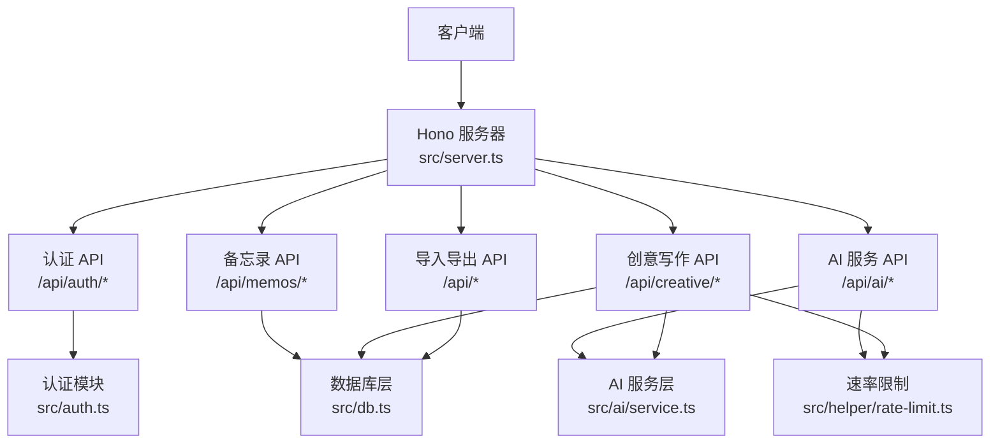
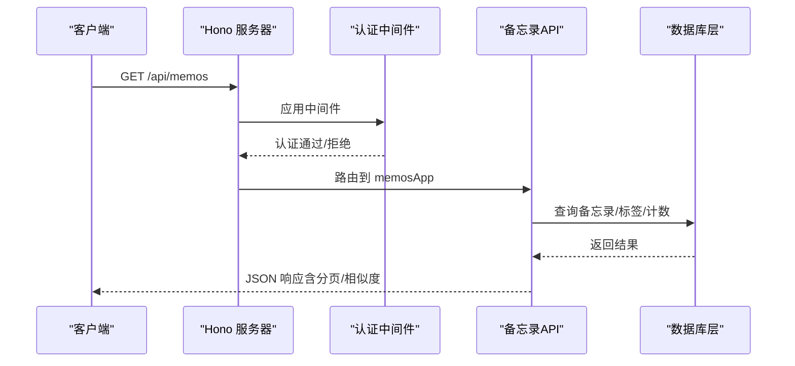
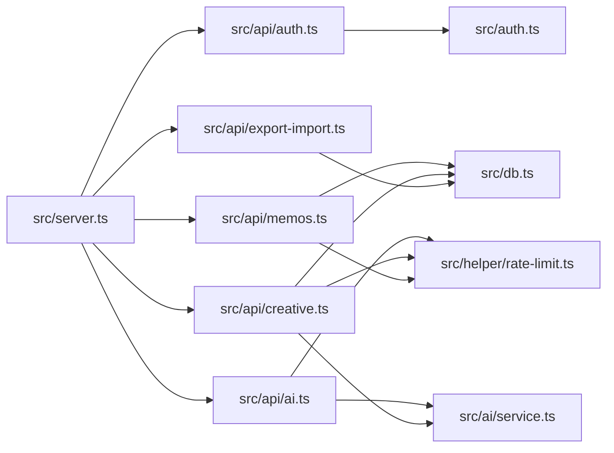
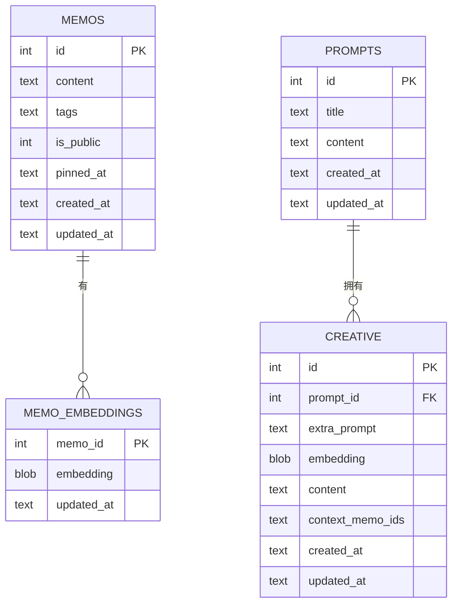

# API参考文档

<cite>
**本文档引用的文件**
- [src/server.ts](file://src/server.ts)
- [src/auth.ts](file://src/auth.ts)
- [src/api/auth.ts](file://src/api/auth.ts)
- [src/api/memos.ts](file://src/api/memos.ts)
- [src/api/ai.ts](file://src/api/ai.ts)
- [src/api/creative.ts](file://src/api/creative.ts)
- [src/api/export-import.ts](file://src/api/export-import.ts)
- [src/db.ts](file://src/db.ts)
- [src/helper/rate-limit.ts](file://src/helper/rate-limit.ts)
- [src/ai/service.ts](file://src/ai/service.ts)
- [src/model.ts](file://src/model.ts)
- [app.config.json](file://app.config.json)
- [ai.config.json](file://ai.config.json)
- [README.md](file://README.md)
</cite>

## 目录
1. [简介](#简介)
2. [项目结构](#项目结构)
3. [核心组件](#核心组件)
4. [架构概览](#架构概览)
5. [详细组件分析](#详细组件分析)
6. [依赖关系分析](#依赖关系分析)
7. [性能考量](#性能考量)
8. [故障排除指南](#故障排除指南)
9. [结论](#结论)
10. [附录](#附录)

## 简介
本文件为 Memos 项目的完整 API 参考文档，涵盖认证、备忘录、AI 服务、创意写作以及导入导出五大模块。文档面向开发者与集成者，提供每个端点的 HTTP 方法、URL 模式、请求参数、响应格式、错误码说明、认证机制、速率限制、最佳实践与使用场景。

## 项目结构
后端基于 Hono 框架，采用子应用路由组织各模块 API；认证采用 Cookie + 内存 Session，同时支持 Bearer Token；数据库使用 SQLite（bun:sqlite），WAL 模式；AI 服务通过外部提供商（如 DeepSeek、Kimi、GLM、DashScope）实现内容优化、标签建议、创意写作与嵌入向量检索。

**图表来源**
- [src/server.ts:41-45](file://src/server.ts#L41-L45)
- [src/api/auth.ts:29](file://src/api/auth.ts#L29)
- [src/api/memos.ts:26](file://src/api/memos.ts#L26)
- [src/api/ai.ts:21](file://src/api/ai.ts#L21)
- [src/api/creative.ts:27](file://src/api/creative.ts#L27)
- [src/api/export-import.ts:14](file://src/api/export-import.ts#L14)
- [src/auth.ts:1](file://src/auth.ts#L1)
- [src/db.ts:1](file://src/db.ts#L1)
- [src/ai/service.ts:1](file://src/ai/service.ts#L1)
- [src/helper/rate-limit.ts:1](file://src/helper/rate-limit.ts#L1)

**章节来源**
- [src/server.ts:38-45](file://src/server.ts#L38-L45)
- [README.md:25-45](file://README.md#L25-L45)

## 核心组件
- 认证模块：支持 Cookie 会话与 Bearer Token 双重认证，提供登录、登出、状态检查与中间件。
- 备忘录模块：提供 CRUD、标签管理、全文搜索、分页、置顶/取消置顶与相似度检索。
- AI 服务模块：内容优化、标签建议、统一动作执行（摘要、改写、扩写、要点提炼、润色）、对话式工作台（SSE 流式输出）。
- 创意写作模块：Prompt 管理、上下文预览、创意内容生成（SSE 流式输出）、结果持久化。
- 导入导出模块：自定义文本格式的导入导出，支持去重与时间戳恢复。
- 速率限制：基于 IP 的小时/天双窗口限制，支持 memo 与 AI 两类操作。
- 数据模型：Memo、Prompt、CreativeItem、MemoEmbedding。

**章节来源**
- [src/auth.ts:109-127](file://src/auth.ts#L109-L127)
- [src/api/memos.ts:26](file://src/api/memos.ts#L26)
- [src/api/ai.ts:21](file://src/api/ai.ts#L21)
- [src/api/creative.ts:27](file://src/api/creative.ts#L27)
- [src/api/export-import.ts:14](file://src/api/export-import.ts#L14)
- [src/helper/rate-limit.ts:77-110](file://src/helper/rate-limit.ts#L77-L110)
- [src/model.ts:1-35](file://src/model.ts#L1-L35)

## 架构概览

**图表来源**
- [src/server.ts:41-45](file://src/server.ts#L41-L45)
- [src/api/memos.ts:28-70](file://src/api/memos.ts#L28-L70)
- [src/db.ts:122-183](file://src/db.ts#L122-L183)

## 详细组件分析

### 认证 API
- 端点：/api/auth/check、/api/auth/login、/api/auth/logout
- 认证方式：
  - Cookie 会话：登录成功后设置 HttpOnly、SameSite=Strict 的会话 Cookie，有效期 24 小时。
  - Bearer Token：通过 Authorization: Bearer <密钥> 方式，密钥来自环境变量 MEMOS_SECRET_KEY。
- 速率限制：登录尝试受 IP 级冷却限制，超过阈值返回 429。
- 权限控制：authMiddleware 会同时校验 Cookie 会话与 Bearer Token，未通过返回 401。

请求示例（cURL）
- 登录
  - curl -X POST http://localhost:3020/api/auth/login -H "Content-Type: application/json" -d '{"key":"your-secret-key"}'
- 登出
  - curl -X POST http://localhost:3020/api/auth/logout -H "Cookie: memos_token=your-session-token"
- 检查状态
  - curl http://localhost:3020/api/auth/check

响应示例
- 登录/登出：{"ok": true}
- 状态检查：{"authenticated": true|false}

错误码
- 400：无效 JSON
- 401：无效密钥/未授权
- 429：登录尝试过多（冷却中）

最佳实践
- 生产环境必须设置 MEMOS_SECRET_KEY，避免使用默认值。
- 前端应通过 Cookie 会话进行常规操作，CLI/自动化脚本使用 Bearer Token。
- 登录失败后不要频繁重试，等待冷却时间结束。

**章节来源**
- [src/api/auth.ts:31-76](file://src/api/auth.ts#L31-L76)
- [src/auth.ts:23-70](file://src/auth.ts#L23-L70)
- [src/auth.ts:72-107](file://src/auth.ts#L72-L107)
- [src/auth.ts:109-127](file://src/auth.ts#L109-L127)

### 备忘录 API
- 端点：/api/memos、/api/memos/count、/api/memos/tags、/api/memos/:id/similar、/api/memos/:id/pin
- 查询参数（GET /api/memos）
  - search：全文搜索（content LIKE %term%）
  - tag：按标签筛选（支持逗号分隔的多个标签，满足其一即可）
  - all：设为 "true" 时返回包含私密备忘录（需认证）
  - page、limit：分页（默认 page=0、limit=50）
- 速率限制：创建/更新/删除操作使用 IP 级速率限制，类别为 "memo"。
- 相似度检索：GET /api/memos/:id/similar 基于嵌入向量返回相似备忘录（排除自身）。
- 权限控制：除公开列表外，其他操作需认证。

请求示例（cURL）
- 创建
  - curl -X POST http://localhost:3020/api/memos -H "Content-Type: application/json" -H "Cookie: memos_token=your-session" -d '{"content":"内容","is_public":true,"tags":["tag1","tag2"]}'
- 更新
  - curl -X PUT http://localhost:3020/api/memos/1 -H "Content-Type: application/json" -H "Cookie: memos_token=your-session" -d '{"content":"新内容","is_public":false}'
- 删除
  - curl -X DELETE http://localhost:3020/api/memos/1 -H "Cookie: memos_token=your-session"
- 置顶/取消置顶
  - curl -X PUT http://localhost:3020/api/memos/1/pin -H "Content-Type: application/json" -H "Cookie: memos_token=your-session" -d '{"pinned":true}'
- 列表（带搜索/标签/分页）
  - curl "http://localhost:3020/api/memos?search=关键词&tag=tag1&page=0&limit=50"

响应示例
- 创建/更新：{"memo": {...}}
- 列表：{"memos":[...],"hasMore":true|false}
- 相似：{"memos":[...]}
- 标签：{"tags":["tag1","tag2",...]}
- 计数：{"count":123}
- 置顶：{"memo": {...}}

错误码
- 400：请求体无效/必填字段缺失/内容为空
- 401：未授权
- 404：备忘录不存在
- 429：速率限制触发

最佳实践
- 使用 all=true 仅在管理员视角，避免泄露私密内容。
- 搜索与标签组合使用可提高召回质量。
- 分页时注意 hasMore 字段，前端可据此加载更多。

**章节来源**
- [src/api/memos.ts:28-70](file://src/api/memos.ts#L28-L70)
- [src/api/memos.ts:72-101](file://src/api/memos.ts#L72-L101)
- [src/api/memos.ts:79-95](file://src/api/memos.ts#L79-L95)
- [src/api/memos.ts:103-144](file://src/api/memos.ts#L103-L144)
- [src/api/memos.ts:146-199](file://src/api/memos.ts#L146-L199)
- [src/api/memos.ts:201-220](file://src/api/memos.ts#L201-L220)
- [src/db.ts:122-183](file://src/db.ts#L122-L183)

### AI 服务 API
- 端点：/api/ai/status、/api/ai/models、/api/ai/optimize、/api/ai/suggest-tags、/api/ai/action、/api/ai/chat
- 功能说明
  - /status：检测 AI 能力可用性（聊天/嵌入/标签）
  - /models：列出可用的提供商与模型（需认证）
  - /optimize：内容优化（兼容旧端点，内部委托到 action 的 polish）
  - /suggest-tags：基于内容与现有标签生成建议
  - /action：统一动作执行（摘要、改写、扩写、要点提炼、润色），支持 provider/model 与 style（改写）
  - /chat：对话式工作台，SSE 流式输出，自动检索上下文（标签或语义相似）
- 速率限制：AI 操作使用 IP 级速率限制，类别为 "ai"。
- 提供商配置：通过 ai.config.json 与环境变量配置（DEEPSEEK_API_KEY、KIMI_API_KEY、GLM_API_KEY、DASHSCOPE_API_KEY）。

请求示例（cURL）
- 获取状态
  - curl http://localhost:3020/api/ai/status
- 获取模型
  - curl http://localhost:3020/api/ai/models -H "Cookie: memos_token=your-session"
- 优化内容
  - curl -X POST http://localhost:3020/api/ai/optimize -H "Content-Type: application/json" -H "Cookie: memos_token=your-session" -d '{"content":"原文","provider":"deepseek","model":"deepseek-v4-flash"}'
- 标签建议
  - curl -X POST http://localhost:3020/api/ai/suggest-tags -H "Content-Type: application/json" -H "Cookie: memos_token=your-session" -d '{"content":"原文"}'
- 统一动作
  - curl -X POST http://localhost:3020/api/ai/action -H "Content-Type: application/json" -H "Cookie: memos_token=your-session" -d '{"content":"原文","action":"summarize","provider":"deepseek","model":"deepseek-v4-flash"}'
- 对话（SSE）
  - curl -N -X POST http://localhost:3020/api/ai/chat -H "Content-Type: application/json" -H "Cookie: memos_token=your-session" -d '{"message":"总结产品设计笔记","history":[{"role":"user","content":"..."}]}'

响应示例
- 状态：{"optimize":true,"embedding":true,"tags":true,"available":true}
- 模型：{"providers":[{"id":"deepseek","name":"DeepSeek","models":["deepseek-v4-pro","deepseek-v4-flash"]}],"default":{"provider":"deepseek","model":"deepseek-v4-flash"}}
- 优化/标签/动作：{"content":"优化后内容"} 或 {"tags":["tag1","tag2"]}
- 聊天：SSE 流，逐块返回 {"type":"content","content":"..."}，结束时 {"type":"done","contextCount":N}

错误码
- 400：请求体无效/必填字段缺失/参数非法
- 401：未授权
- 429：速率限制触发
- 503：AI 未配置
- 500：AI 服务不可用

最佳实践
- 优先使用 /action 统一入口，便于未来扩展。
- 对话时可结合标签筛选与语义检索，提升上下文质量。
- SSE 流式输出需正确处理 done/error 事件。

**章节来源**
- [src/api/ai.ts:23-322](file://src/api/ai.ts#L23-L322)
- [src/ai/service.ts:96-128](file://src/ai/service.ts#L96-L128)
- [src/ai/service.ts:130-175](file://src/ai/service.ts#L130-L175)
- [src/ai/service.ts:177-200](file://src/ai/service.ts#L177-L200)
- [ai.config.json:1-44](file://ai.config.json#L1-L44)

### 创意写作 API
- 端点：/api/creative/prompts、/api/creative、/api/creative/preview-context、/api/creative/generate、/api/creative/:id
- 功能说明
  - Prompt 管理：CRUD（标题、内容）
  - 创意内容：列表、创建、删除
  - 上下文预览：支持手动选择 memo_ids、按标签筛选、自动语义检索
  - 生成：SSE 流式输出，完成后持久化为 CreativeItem
- 速率限制：生成与预览使用 IP 级速率限制，类别为 "ai"。
- 权限控制：除获取所有 prompts 外，其余均需认证。

请求示例（cURL）
- 获取所有 prompts
  - curl http://localhost:3020/api/creative/prompts
- 创建 prompt
  - curl -X POST http://localhost:3020/api/creative/prompts -H "Content-Type: application/json" -H "Cookie: memos_token=your-session" -d '{"title":"标题","content":"内容"}'
- 上下文预览（自动模式）
  - curl -X POST http://localhost:3020/api/creative/preview-context -H "Content-Type: application/json" -H "Cookie: memos_token=your-session" -d '{"prompt_id":1,"extra_prompt":"主题"}'
- 生成创意内容（SSE）
  - curl -N -X POST http://localhost:3020/api/creative/generate -H "Content-Type: application/json" -H "Cookie: memos_token=your-session" -d '{"prompt_id":1,"extra_prompt":"主题","memo_ids":[1,2]}'
- 创建创意内容（直存）
  - curl -X POST http://localhost:3020/api/creative -H "Content-Type: application/json" -H "Cookie: memos_token=your-session" -d '{"prompt_id":1,"content":"生成内容"}'

响应示例
- Prompt：{"prompt": {...}} 或 {"prompts": [...]}
- 列表：{"items": [...]}
- 预览：{"memos":[...],"mode":"manual|tag|auto"}
- 生成：SSE 流，返回 content 块，结束后返回 {"type":"done","item":{...}}
- 删除：{"ok": true}

错误码
- 400：请求体无效/必填字段缺失/参数非法
- 401：未授权
- 404：资源不存在
- 429：速率限制触发

最佳实践
- 生成前先 preview-context 确认上下文质量。
- 自动模式会消耗 AI 配额，谨慎使用。
- SSE 流式输出需在前端正确解析 done/error 事件。

**章节来源**
- [src/api/creative.ts:31-377](file://src/api/creative.ts#L31-L377)
- [src/db.ts:272-397](file://src/db.ts#L272-L397)

### 导入导出 API
- 端点：/api/export、/api/import
- 导出格式：自定义文本块，每条记录以 "======" 分割，元数据块以 "—" 分隔，包含 date、tags/isPrivate/pinned/type 等键值。
- 导入规则：按 "======" 分割为记录，解析元数据与内容，支持去重（基于内容匹配），自动创建默认 Prompt（用于创意项）。
- 权限控制：需认证。

请求示例（cURL）
- 导出
  - curl -o memos-export.txt "http://localhost:3020/api/export" -H "Cookie: memos_token=your-session"
- 导入
  - curl -X POST http://localhost:3020/api/import -F file=@memos-export.txt -H "Cookie: memos_token=your-session"

响应示例
- 导出：返回纯文本文件（Content-Disposition: attachment）
- 导入：{"imported":10,"skipped":2,"deduped":3,"message":"...","errors":["..."]}

错误码
- 400：无效表单/空文件/记录格式无效
- 401：未授权

最佳实践
- 导出文件可用于备份与迁移。
- 导入前建议先预览或小批量测试，确保格式正确。

**章节来源**
- [src/api/export-import.ts:165-287](file://src/api/export-import.ts#L165-L287)
- [src/db.ts:400-479](file://src/db.ts#L400-L479)

## 依赖关系分析

**图表来源**
- [src/server.ts:41-45](file://src/server.ts#L41-L45)
- [src/api/auth.ts:1](file://src/api/auth.ts#L1)
- [src/api/memos.ts:1](file://src/api/memos.ts#L1)
- [src/api/ai.ts:1](file://src/api/ai.ts#L1)
- [src/api/creative.ts:1](file://src/api/creative.ts#L1)
- [src/api/export-import.ts:1](file://src/api/export-import.ts#L1)
- [src/auth.ts:1](file://src/auth.ts#L1)
- [src/db.ts:1](file://src/db.ts#L1)
- [src/ai/service.ts:1](file://src/ai/service.ts#L1)
- [src/helper/rate-limit.ts:1](file://src/helper/rate-limit.ts#L1)

**章节来源**
- [src/server.ts:38-45](file://src/server.ts#L38-L45)

## 性能考量
- 速率限制
  - 配置项：app.config.json 中 rateLimit 节点，支持通过环境变量覆盖。
  - 限制维度：按 IP 分类（memo/ai），小时与天两个窗口，先检查日限额再检查小时限额。
  - 影响范围：创建/更新/删除备忘录、AI 生成与聊天、创意内容生成与预览。
- 嵌入向量
  - 备忘录创建/更新时异步生成嵌入向量，失败不影响主流程。
  - 相似度检索基于向量缓存，支持 rerank 配置（开启、候选数、最终数量）。
- SSE 流式输出
  - AI 与创意内容生成均采用流式输出，降低前端等待时间，需正确处理 done/error 事件。

**章节来源**
- [app.config.json:15-20](file://app.config.json#L15-L20)
- [src/helper/rate-limit.ts:77-152](file://src/helper/rate-limit.ts#L77-L152)
- [src/ai/service.ts:96-128](file://src/ai/service.ts#L96-L128)
- [app.config.json:7-14](file://app.config.json#L7-L14)

## 故障排除指南
- 401 未授权
  - 检查 Cookie 是否正确设置与未过期；或 Bearer Token 是否正确传递。
  - 确认 MEMOS_SECRET_KEY 是否配置。
- 429 速率限制
  - 查看返回的错误消息中的剩余冷却时间，等待后重试。
  - 调整 app.config.json 或环境变量中的限额配置。
- 503 AI 不可用
  - 检查 ai.config.json 与对应环境变量是否正确配置。
  - 确认提供商 API Key 是否有效。
- SSE 流异常
  - 确保客户端正确处理 "done" 与 "error" 事件。
  - 检查网络连接与超时设置（AI 请求超时默认 120 秒）。

**章节来源**
- [src/auth.ts:109-127](file://src/auth.ts#L109-L127)
- [src/helper/rate-limit.ts:142-152](file://src/helper/rate-limit.ts#L142-L152)
- [src/ai/service.ts:96-115](file://src/ai/service.ts#L96-L115)
- [app.config.json:2-6](file://app.config.json#L2-L6)

## 结论
本 API 参考文档系统性地梳理了 Memos 的认证、备忘录、AI 服务、创意写作与导入导出模块，明确了端点、参数、响应、错误码与最佳实践。生产部署建议关注认证安全、速率限制配置与 AI 服务可用性，以获得稳定可靠的集成体验。

## 附录

### API 版本管理
- 当前版本：项目处于开发阶段，不提供传统语义化版本；API 变更可能随时发生，集成时请关注仓库变更。

**章节来源**
- [README.md:273-283](file://README.md#L273-L283)

### 速率限制配置
- 配置来源优先级：环境变量 > app.config.json > 硬编码默认值
- 配置项
  - RATE_LIMIT_MEMOS_PER_HOUR、RATE_LIMIT_MEMOS_PER_DAY（memo 类别）
  - RATE_LIMIT_AI_PER_HOUR、RATE_LIMIT_AI_PER_DAY（AI 类别）
- 默认值（来自 app.config.json）
  - 备忘录：每小时 50 次，每天 200 次
  - AI：每小时 30 次，每天 100 次

**章节来源**
- [src/helper/rate-limit.ts:27-39](file://src/helper/rate-limit.ts#L27-L39)
- [app.config.json:15-20](file://app.config.json#L15-L20)

### 数据模型

**图表来源**
- [src/db.ts:18-61](file://src/db.ts#L18-L61)
- [src/model.ts:1-35](file://src/model.ts#L1-L35)