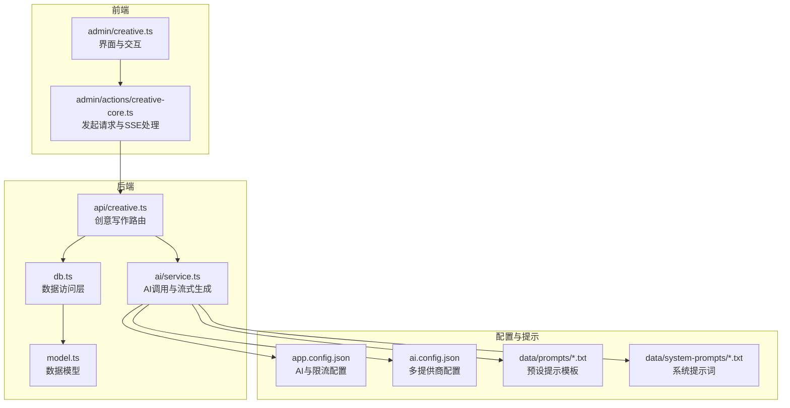
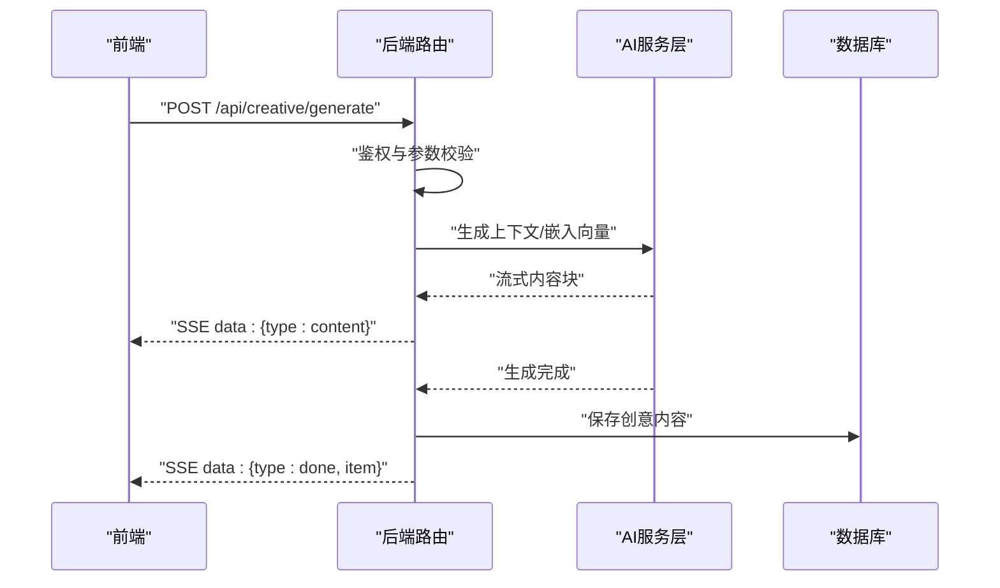
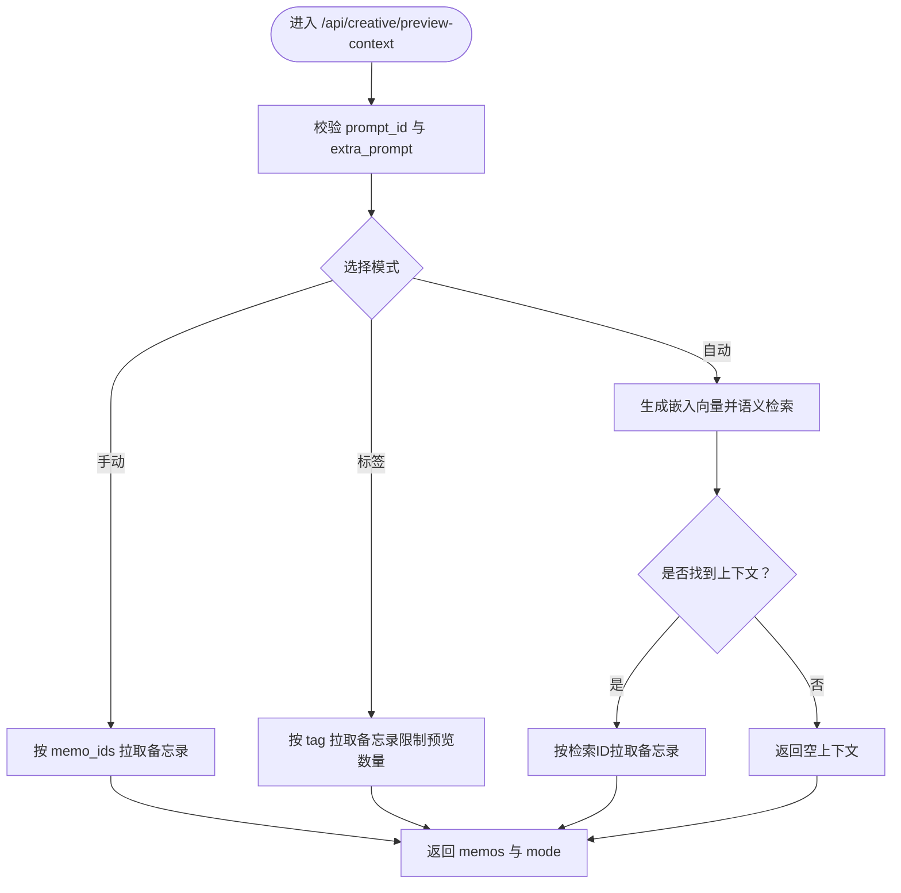
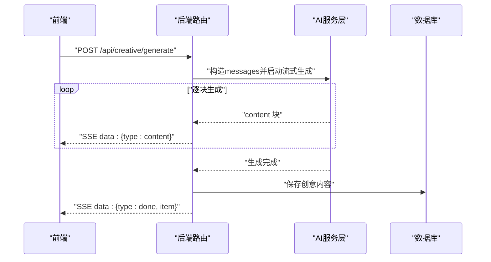
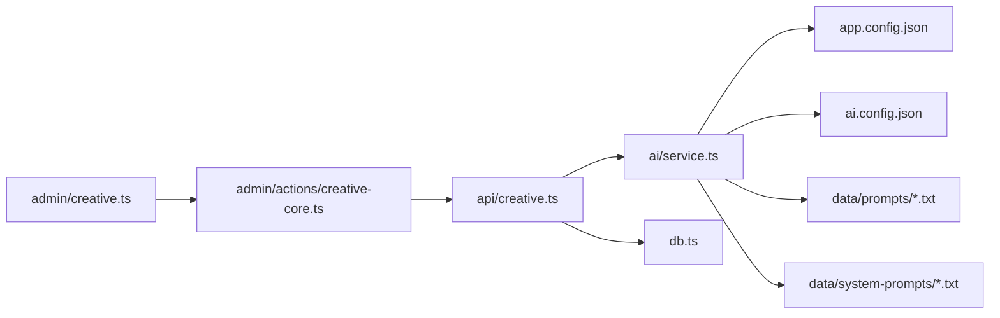

# 创意写作API

<cite>
**本文档引用的文件**
- [src/api/creative.ts](file://src/api/creative.ts)
- [src/ai/service.ts](file://src/ai/service.ts)
- [src/frontend/admin/creative.ts](file://src/frontend/admin/creative.ts)
- [src/frontend/admin/actions/creative-core.ts](file://src/frontend/admin/actions/creative-core.ts)
- [src/db.ts](file://src/db.ts)
- [src/model.ts](file://src/model.ts)
- [app.config.json](file://app.config.json)
- [ai.config.json](file://ai.config.json)
- [data/prompts/创意写作.txt](file://data/prompts/创意写作.txt)
- [data/prompts/日记优化.txt](file://data/prompts/日记优化.txt)
- [data/prompts/知识整理.txt](file://data/prompts/知识整理.txt)
- [data/system-prompts/creative.txt](file://data/system-prompts/creative.txt)
- [data/system-prompts/optimize.txt](file://data/system-prompts/optimize.txt)
- [data/system-prompts/rewrite.txt](file://data/system-prompts/rewrite.txt)
</cite>

## 目录
1. [简介](#简介)
2. [项目结构](#项目结构)
3. [核心组件](#核心组件)
4. [架构总览](#架构总览)
5. [详细组件分析](#详细组件分析)
6. [依赖关系分析](#依赖关系分析)
7. [性能考量](#性能考量)
8. [故障排查指南](#故障排查指南)
9. [结论](#结论)
10. [附录](#附录)

## 简介
本文件面向“创意写作API”的使用者与维护者，系统性说明创意写作相关接口与工作流，包括内容改写、文章优化、日记改进、知识整理等能力。文档覆盖：
- 接口定义与参数说明
- 预设提示模板与自定义配置方法
- 创意写作工作流程（输入处理、AI生成、结果返回）
- 请求/响应示例与典型使用场景
- 系统提示词的作用与调优策略
- 最佳实践与使用技巧

## 项目结构
创意写作API由后端路由、AI服务层、前端交互与数据库模型构成，围绕“提示词模板 + 上下文检索 + 流式生成”的模式组织。

图表来源
- [src/frontend/admin/creative.ts:220-354](file://src/frontend/admin/creative.ts#L220-L354)
- [src/frontend/admin/actions/creative-core.ts:1-354](file://src/frontend/admin/actions/creative-core.ts#L1-L354)
- [src/api/creative.ts:1-383](file://src/api/creative.ts#L1-L383)
- [src/ai/service.ts:1-507](file://src/ai/service.ts#L1-L507)
- [src/db.ts:1-200](file://src/db.ts#L1-L200)
- [src/model.ts:1-35](file://src/model.ts#L1-L35)
- [app.config.json:1-22](file://app.config.json#L1-L22)
- [ai.config.json:1-44](file://ai.config.json#L1-L44)
- [data/prompts/创意写作.txt:1-15](file://data/prompts/创意写作.txt#L1-L15)
- [data/system-prompts/creative.txt:1-2](file://data/system-prompts/creative.txt#L1-L2)

章节来源
- [src/api/creative.ts:1-383](file://src/api/creative.ts#L1-L383)
- [src/ai/service.ts:1-507](file://src/ai/service.ts#L1-L507)
- [src/frontend/admin/creative.ts:1-354](file://src/frontend/admin/creative.ts#L1-L354)
- [src/frontend/admin/actions/creative-core.ts:1-354](file://src/frontend/admin/actions/creative-core.ts#L1-L354)
- [src/db.ts:1-200](file://src/db.ts#L1-L200)
- [src/model.ts:1-35](file://src/model.ts#L1-L35)
- [app.config.json:1-22](file://app.config.json#L1-L22)
- [ai.config.json:1-44](file://ai.config.json#L1-L44)
- [data/prompts/创意写作.txt:1-15](file://data/prompts/创意写作.txt#L1-L15)
- [data/system-prompts/creative.txt:1-2](file://data/system-prompts/creative.txt#L1-L2)

## 核心组件
- 路由与控制流：后端提供创意写作相关REST接口，负责鉴权、参数校验、上下文检索、流式生成与持久化。
- AI服务层：封装多提供商聊天与DashScope嵌入，统一执行“创意内容生成”和“对话流式生成”，支持SSE。
- 前端交互：提供提示词管理、上下文预览、生成对话与列表视图，支持手动/标签/自动三种上下文模式。
- 数据层：SQLite存储备忘录、提示词与创意内容；支持标签查询、嵌入向量与相似度检索。
- 配置层：全局AI参数、限流策略、多提供商凭据与默认模型。

章节来源
- [src/api/creative.ts:1-383](file://src/api/creative.ts#L1-L383)
- [src/ai/service.ts:1-507](file://src/ai/service.ts#L1-L507)
- [src/frontend/admin/creative.ts:1-354](file://src/frontend/admin/creative.ts#L1-L354)
- [src/frontend/admin/actions/creative-core.ts:1-354](file://src/frontend/admin/actions/creative-core.ts#L1-L354)
- [src/db.ts:1-200](file://src/db.ts#L1-L200)
- [src/model.ts:1-35](file://src/model.ts#L1-L35)
- [app.config.json:1-22](file://app.config.json#L1-L22)
- [ai.config.json:1-44](file://ai.config.json#L1-L44)

## 架构总览
创意写作API采用“前端发起请求 -> 后端路由处理 -> AI服务层调用 -> 数据库持久化 -> SSE流式返回”的闭环。

图表来源
- [src/api/creative.ts:200-338](file://src/api/creative.ts#L200-L338)
- [src/ai/service.ts:449-476](file://src/ai/service.ts#L449-L476)
- [src/db.ts:49-61](file://src/db.ts#L49-L61)

## 详细组件分析

### 接口总览与工作流
- 接口路径与用途
  - GET /api/creative/prompts：获取所有提示词
  - POST /api/creative/prompts：创建提示词（需鉴权）
  - PUT /api/creative/prompts/:id：更新提示词（需鉴权）
  - DELETE /api/creative/prompts/:id：删除提示词（需鉴权）
  - GET /api/creative：获取创意内容列表（可按prompt_id过滤）
  - POST /api/creative/preview-context：预览将用于生成的上下文备忘录
  - POST /api/creative/generate：流式生成创意内容（SSE）
  - POST /api/creative：直接创建创意内容（如对话保存）
  - DELETE /api/creative/:id：删除创意内容
- 工作流要点
  - 上下文模式：手动（传入memo_ids）、标签（按tag筛选）、自动（语义检索Top N）
  - 限流：每次生成/预览均进行AI限流检查
  - 流式输出：SSE分片推送content，完成后推送done并落库

章节来源
- [src/api/creative.ts:36-107](file://src/api/creative.ts#L36-L107)
- [src/api/creative.ts:111-120](file://src/api/creative.ts#L111-L120)
- [src/api/creative.ts:122-198](file://src/api/creative.ts#L122-L198)
- [src/api/creative.ts:200-338](file://src/api/creative.ts#L200-L338)
- [src/api/creative.ts:340-382](file://src/api/creative.ts#L340-L382)

### 预设提示模板与自定义配置
- 预设提示模板
  - 创意写作：将备忘录内容转化为结构完整、引人入胜的创意文章
  - 日记优化：将简短日记扩展为完整、有深度、有温度的个人记录
  - 知识整理：对零散知识点进行系统化归纳整理与关联分析
- 系统提示词
  - creative.txt：通用创意助手角色设定
  - optimize.txt：内容优化的系统提示
  - rewrite.txt：按风格重写的系统提示
- 自定义配置
  - 新增/编辑/删除提示词：通过后端提示词接口完成
  - 前端界面支持新建、编辑、删除提示词，并在创意页选择使用
  - 提示词内容即为“创意内容生成”的system prompt

章节来源
- [data/prompts/创意写作.txt:1-15](file://data/prompts/创意写作.txt#L1-L15)
- [data/prompts/日记优化.txt:1-21](file://data/prompts/日记优化.txt#L1-L21)
- [data/prompts/知识整理.txt:1-16](file://data/prompts/知识整理.txt#L1-L16)
- [data/system-prompts/creative.txt:1-2](file://data/system-prompts/creative.txt#L1-L2)
- [data/system-prompts/optimize.txt:1-8](file://data/system-prompts/optimize.txt#L1-L8)
- [data/system-prompts/rewrite.txt:1-5](file://data/system-prompts/rewrite.txt#L1-L5)
- [src/frontend/admin/creative.ts:45-100](file://src/frontend/admin/creative.ts#L45-L100)
- [src/frontend/admin/actions/creative-core.ts:112-156](file://src/frontend/admin/actions/creative-core.ts#L112-L156)

### 输入处理与上下文检索
- 参数校验
  - prompt_id必填且为正整数
  - extra_prompt必填且非空
  - memo_ids可选，必须为正整数数组
- 上下文模式
  - 手动模式：直接使用传入memo_ids拉取备忘录
  - 标签模式：按tag筛选备忘录，限制预览数量
  - 自动模式：生成extra_prompt的嵌入向量，语义检索Top N备忘录
- 限流与错误处理
  - 每次生成/预览均检查AI限流，超限返回429
  - 语义检索失败时回退为空上下文

图表来源
- [src/api/creative.ts:122-198](file://src/api/creative.ts#L122-L198)

章节来源
- [src/api/creative.ts:122-198](file://src/api/creative.ts#L122-L198)

### AI生成与流式返回
- 生成流程
  - 解析provider/model（若未指定则使用默认）
  - 构造system prompt（来自所选提示词）+ user prompt（附加说明+上下文）
  - 调用流式聊天接口，逐块返回content
  - 全部完成后保存创意内容至数据库，推送done事件
- 错误处理
  - 生成异常时返回error事件并关闭流
  - 前端SSE解析器捕获content/done/error三类消息

图表来源
- [src/api/creative.ts:200-338](file://src/api/creative.ts#L200-L338)
- [src/ai/service.ts:449-476](file://src/ai/service.ts#L449-L476)

章节来源
- [src/api/creative.ts:200-338](file://src/api/creative.ts#L200-L338)
- [src/ai/service.ts:449-476](file://src/ai/service.ts#L449-L476)

### 数据模型与持久化
- 数据表
  - memos：备忘录内容、标签、公开状态、时间戳
  - memo_embeddings：备忘录嵌入向量（与memos外键关联）
  - prompts：提示词（标题、内容、时间戳）
  - creative：创意内容（关联prompt、嵌入、上下文memo id串、内容、时间戳）
- 查询与索引
  - 支持按标签、ID、搜索条件查询备忘录
  - 为pinned_at与tags建立索引提升查询性能

章节来源
- [src/db.ts:18-61](file://src/db.ts#L18-L61)
- [src/db.ts:122-169](file://src/db.ts#L122-L169)
- [src/model.ts:1-35](file://src/model.ts#L1-L35)

### 前端交互与最佳实践
- 前端功能
  - 提示词管理：新建/编辑/删除，支持选择与切换
  - 上下文预览：根据模式预览将使用的备忘录
  - 生成对话：支持手动/标签/自动三种模式，SSE流式渲染
  - 列表视图：展示历史创意内容，支持删除
- 使用技巧
  - 选择合适的提示词模板（创意写作/日记优化/知识整理）
  - 自动模式适合“模糊主题”的泛化创作；手动/标签模式适合“精确主题”的定向创作
  - 通过附加说明（extra_prompt）细化风格、长度、角度等要求
  - 合理设置上下文数量，避免token溢出

章节来源
- [src/frontend/admin/creative.ts:220-354](file://src/frontend/admin/creative.ts#L220-L354)
- [src/frontend/admin/actions/creative-core.ts:165-322](file://src/frontend/admin/actions/creative-core.ts#L165-L322)

## 依赖关系分析
- 组件耦合
  - 路由层依赖AI服务层与数据库层
  - AI服务层依赖配置文件与外部API（多提供商）
  - 前端通过动作模块调用后端接口，解析SSE并更新UI
- 外部依赖
  - 多提供商聊天接口（通过ai.config.json配置）
  - DashScope嵌入与rerank服务（用于语义检索与排序）

图表来源
- [src/api/creative.ts:1-383](file://src/api/creative.ts#L1-L383)
- [src/ai/service.ts:1-507](file://src/ai/service.ts#L1-L507)
- [src/frontend/admin/actions/creative-core.ts:1-354](file://src/frontend/admin/actions/creative-core.ts#L1-L354)
- [src/frontend/admin/creative.ts:1-354](file://src/frontend/admin/creative.ts#L1-L354)
- [app.config.json:1-22](file://app.config.json#L1-L22)
- [ai.config.json:1-44](file://ai.config.json#L1-L44)
- [data/prompts/创意写作.txt:1-15](file://data/prompts/创意写作.txt#L1-L15)
- [data/system-prompts/creative.txt:1-2](file://data/system-prompts/creative.txt#L1-L2)

## 性能考量
- 限流策略
  - AI生成/预览均受限流保护，默认每小时/天配额，防止滥用
- 上下文规模控制
  - 自动模式限制上下文备忘录数量，避免token溢出
  - 标签模式限制预览数量，兼顾性能与体验
- 嵌入与检索
  - 语义检索使用Top N候选，结合rerank提升质量
- 前端渲染
  - 流式渲染减少等待时间，及时展示生成进度

章节来源
- [src/api/creative.ts:29-32](file://src/api/creative.ts#L29-L32)
- [src/api/creative.ts:164-178](file://src/api/creative.ts#L164-L178)
- [src/ai/service.ts:389-445](file://src/ai/service.ts#L389-L445)
- [app.config.json:15-21](file://app.config.json#L15-L21)

## 故障排查指南
- 常见错误与定位
  - 400 错误：JSON格式错误或必填字段缺失（prompt_id、extra_prompt、memo_ids格式）
  - 401/403：未鉴权或权限不足（提示词CRUD与生成接口均需鉴权）
  - 404：提示词不存在或创意内容不存在
  - 429：AI限流触发，稍后再试或调整频率
  - 5xx：外部AI服务不可用或网络异常
- 建议排查步骤
  - 确认请求体格式与字段类型
  - 检查ai.config.json中的提供商与凭据是否正确
  - 检查app.config.json中的限流与AI参数是否合理
  - 查看SSE流是否正常接收content/done/error事件
  - 若自动模式无上下文，确认DashScope嵌入服务可用

章节来源
- [src/api/creative.ts:43-68](file://src/api/creative.ts#L43-L68)
- [src/api/creative.ts:70-98](file://src/api/creative.ts#L70-L98)
- [src/api/creative.ts:100-107](file://src/api/creative.ts#L100-L107)
- [src/api/creative.ts:182-187](file://src/api/creative.ts#L182-L187)
- [src/api/creative.ts:244-248](file://src/api/creative.ts#L244-L248)
- [src/ai/service.ts:79-86](file://src/ai/service.ts#L79-L86)
- [src/ai/service.ts:351-385](file://src/ai/service.ts#L351-L385)

## 结论
创意写作API通过“提示词模板 + 多模式上下文 + 流式生成”的设计，实现了灵活、可控且高效的创意内容生产。配合完善的限流与上下文控制策略，既保证了用户体验，也兼顾了资源消耗与稳定性。建议在实际使用中结合场景选择合适的提示词与上下文模式，并通过附加说明精细化控制输出风格与结构。

## 附录

### 接口定义与示例

- 获取提示词列表
  - 方法：GET
  - 路径：/api/creative/prompts
  - 示例请求：无
  - 示例响应：包含prompts数组

- 创建提示词
  - 方法：POST
  - 路径：/api/creative/prompts
  - 请求体：{ title: string, content: string }
  - 示例响应：{ prompt }

- 更新提示词
  - 方法：PUT
  - 路径：/api/creative/prompts/:id
  - 请求体：{ title?: string, content?: string }
  - 示例响应：{ prompt }

- 删除提示词
  - 方法：DELETE
  - 路径：/api/creative/prompts/:id
  - 示例响应：{ ok: true }

- 获取创意内容列表
  - 方法：GET
  - 路径：/api/creative
  - 查询参数：prompt_id（可选）
  - 示例响应：{ items: CreativeItem[] }

- 预览上下文
  - 方法：POST
  - 路径：/api/creative/preview-context
  - 请求体（手动模式）：{ prompt_id, extra_prompt, memo_ids: number[] }
  - 请求体（标签模式）：{ prompt_id, extra_prompt, tag: string }
  - 请求体（自动模式）：{ prompt_id, extra_prompt }
  - 示例响应：{ memos: Memo[], mode: "manual"|"tag"|"auto" }

- 流式生成创意内容
  - 方法：POST
  - 路径：/api/creative/generate
  - 请求体（手动/标签/自动三选一）：{ prompt_id, extra_prompt, memo_ids?: number[], provider?: string, model?: string, tag?: string }
  - 响应：SSE流，分片返回content，结束时返回done并附带item

- 直接创建创意内容
  - 方法：POST
  - 路径：/api/creative
  - 请求体：{ prompt_id, extra_prompt?, content, context_memo_ids? }
  - 示例响应：{ item }

- 删除创意内容
  - 方法：DELETE
  - 路径：/api/creative/:id
  - 示例响应：{ ok: true }

章节来源
- [src/api/creative.ts:36-107](file://src/api/creative.ts#L36-L107)
- [src/api/creative.ts:111-120](file://src/api/creative.ts#L111-L120)
- [src/api/creative.ts:122-198](file://src/api/creative.ts#L122-L198)
- [src/api/creative.ts:200-338](file://src/api/creative.ts#L200-L338)
- [src/api/creative.ts:340-382](file://src/api/creative.ts#L340-L382)

### 系统提示词作用与调优策略
- 作用
  - 控制AI角色与行为边界，确保输出符合预期风格与结构
  - 与“附加说明”配合，实现对风格、长度、角度的精细约束
- 调优建议
  - 创意写作：强调结构完整性与情感共鸣，鼓励具体细节与总结升华
  - 日记优化：强调还原场景、情感反思与收获提炼
  - 知识整理：强调概念提取、分类框架与关联分析
  - 优化/重写：明确“只返回文本”的输出规范，避免多余解释

章节来源
- [data/system-prompts/creative.txt:1-2](file://data/system-prompts/creative.txt#L1-L2)
- [data/system-prompts/optimize.txt:1-8](file://data/system-prompts/optimize.txt#L1-L8)
- [data/system-prompts/rewrite.txt:1-5](file://data/system-prompts/rewrite.txt#L1-L5)
- [data/prompts/创意写作.txt:1-15](file://data/prompts/创意写作.txt#L1-L15)
- [data/prompts/日记优化.txt:1-21](file://data/prompts/日记优化.txt#L1-L21)
- [data/prompts/知识整理.txt:1-16](file://data/prompts/知识整理.txt#L1-L16)

### 最佳实践与使用技巧
- 选择合适提示词
  - 创意写作：适合将碎片化想法转化为完整文章
  - 日记优化：适合将简短记录扩展为有温度的个人日志
  - 知识整理：适合对零散知识点进行系统化梳理
- 上下文模式选择
  - 自动模式：适合“泛主题”创作，系统自动检索相关备忘录
  - 标签模式：适合“主题明确”的内容，按标签精准筛选
  - 手动模式：适合“高度定制”的内容，直接指定备忘录ID
- 附加说明（extra_prompt）
  - 明确风格（专业/口语/极简/学术）
  - 指定长度目标与输出结构
  - 提供背景信息或参考角度
- 限流与配额
  - 合理安排生成频率，避免触发限流
  - 在批量任务中增加延迟或合并请求

章节来源
- [src/frontend/admin/creative.ts:220-354](file://src/frontend/admin/creative.ts#L220-L354)
- [src/frontend/admin/actions/creative-core.ts:165-322](file://src/frontend/admin/actions/creative-core.ts#L165-L322)
- [app.config.json:15-21](file://app.config.json#L15-L21)