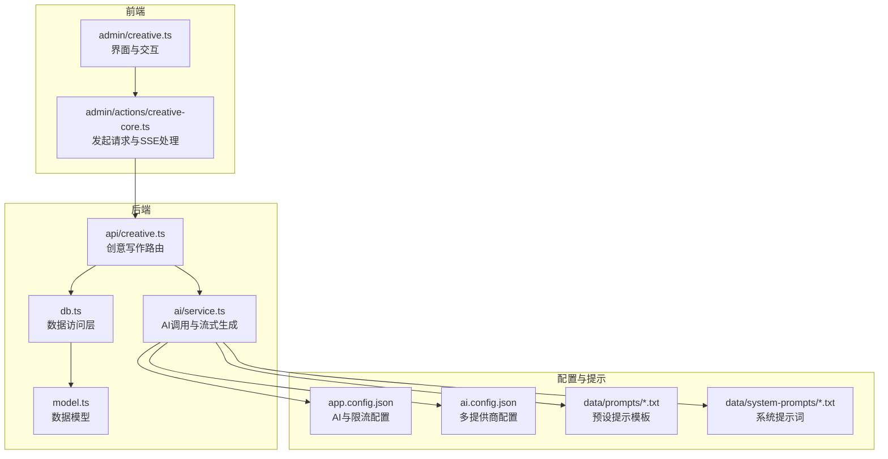
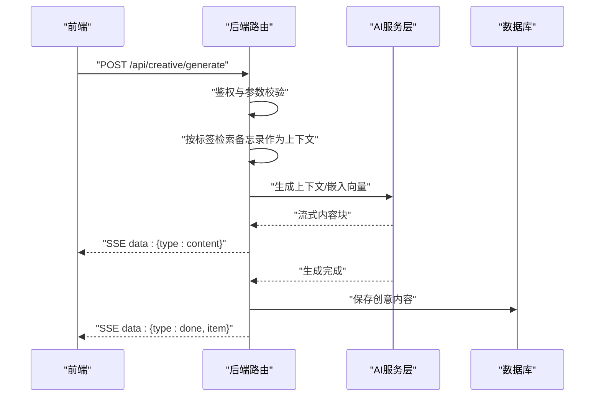
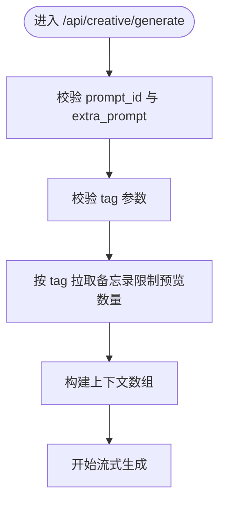
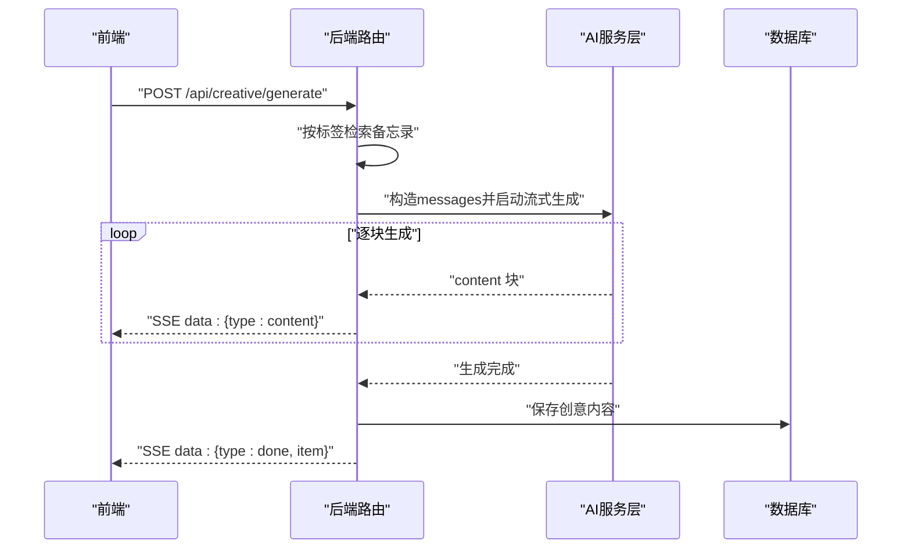
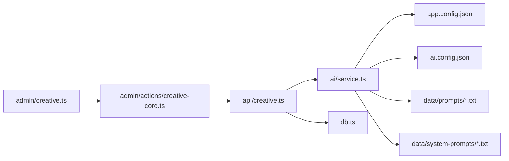

# 创意写作API

<cite>
**本文档引用的文件**
- [src/api/creative.ts](file://src/api/creative.ts)
- [src/ai/service.ts](file://src/ai/service.ts)
- [src/frontend/admin/creative.ts](file://src/frontend/admin/creative.ts)
- [src/frontend/admin/actions/creative-core.ts](file://src/frontend/admin/actions/creative-core.ts)
- [src/db.ts](file://src/db.ts)
- [src/model.ts](file://src/model.ts)
- [app.config.json](file://app.config.json)
- [ai.config.json](file://ai.config.json)
- [data/prompts/创意写作.txt](file://data/prompts/创意写作.txt)
- [data/system-prompts/creative.txt](file://data/system-prompts/creative.txt)
</cite>

## 更新摘要
**变更内容**
- 移除了 `/api/creative/preview-context` 预览上下文端点
- 简化了创意内容生成流程，直接从标签生成创意内容
- 更新了前端交互逻辑，移除了上下文预览功能
- 简化了API端点和实现逻辑

## 目录
1. [简介](#简介)
2. [项目结构](#项目结构)
3. [核心组件](#核心组件)
4. [架构总览](#架构总览)
5. [详细组件分析](#详细组件分析)
6. [依赖关系分析](#依赖关系分析)
7. [性能考量](#性能考量)
8. [故障排查指南](#故障排查指南)
9. [结论](#结论)
10. [附录](#附录)

## 简介
本文件面向"创意写作API"的使用者与维护者，系统性说明创意写作相关接口与工作流，包括内容改写、文章优化、日记改进、知识整理等能力。文档覆盖：
- 接口定义与参数说明
- 预设提示模板与自定义配置方法
- 创意写作工作流程（输入处理、AI生成、结果返回）
- 请求/响应示例与典型使用场景
- 系统提示词的作用与调优策略
- 最佳实践与使用技巧

## 项目结构
创意写作API由后端路由、AI服务层、前端交互与数据库模型构成，围绕"提示词模板 + 标签上下文 + 流式生成"的模式组织。

**图表来源**
- [src/frontend/admin/creative.ts:101-161](file://src/frontend/admin/creative.ts#L101-L161)
- [src/frontend/admin/actions/creative-core.ts:165-249](file://src/frontend/admin/actions/creative-core.ts#L165-L249)
- [src/api/creative.ts:1-266](file://src/api/creative.ts#L1-L266)
- [src/ai/service.ts:1-507](file://src/ai/service.ts#L1-L507)
- [src/db.ts:1-484](file://src/db.ts#L1-L484)
- [src/model.ts:1-35](file://src/model.ts#L1-L35)
- [app.config.json:1-22](file://app.config.json#L1-L22)
- [ai.config.json:1-44](file://ai.config.json#L1-L44)
- [data/prompts/创意写作.txt:1-15](file://data/prompts/创意写作.txt#L1-L15)
- [data/system-prompts/creative.txt:1-2](file://data/system-prompts/creative.txt#L1-L2)

## 核心组件
- 路由与控制流：后端提供创意写作相关REST接口，负责鉴权、参数校验、标签上下文检索、流式生成与持久化。
- AI服务层：封装多提供商聊天与DashScope嵌入，统一执行"创意内容生成"和"对话流式生成"，支持SSE。
- 前端交互：提供提示词管理、生成对话与列表视图，支持标签模式的上下文生成。
- 数据层：SQLite存储备忘录、提示词与创意内容；支持标签查询、嵌入向量与相似度检索。
- 配置层：全局AI参数、限流策略、多提供商凭据与默认模型。

**章节来源**
- [src/api/creative.ts:1-266](file://src/api/creative.ts#L1-L266)
- [src/ai/service.ts:1-507](file://src/ai/service.ts#L1-L507)
- [src/frontend/admin/creative.ts:1-161](file://src/frontend/admin/creative.ts#L1-L161)
- [src/frontend/admin/actions/creative-core.ts:1-249](file://src/frontend/admin/actions/creative-core.ts#L1-L249)
- [src/db.ts:1-484](file://src/db.ts#L1-L484)
- [src/model.ts:1-35](file://src/model.ts#L1-L35)
- [app.config.json:1-22](file://app.config.json#L1-L22)
- [ai.config.json:1-44](file://ai.config.json#L1-L44)

## 架构总览
创意写作API采用"前端发起请求 -> 后端路由处理 -> AI服务层调用 -> 数据库持久化 -> SSE流式返回"的闭环。

**图表来源**
- [src/api/creative.ts:118-221](file://src/api/creative.ts#L118-L221)
- [src/ai/service.ts:449-476](file://src/ai/service.ts#L449-L476)
- [src/db.ts:377-402](file://src/db.ts#L377-L402)

## 详细组件分析

### 接口总览与工作流
- 接口路径与用途
  - GET /api/creative/prompts：获取所有提示词
  - POST /api/creative/prompts：创建提示词（需鉴权）
  - PUT /api/creative/prompts/:id：更新提示词（需鉴权）
  - DELETE /api/creative/prompts/:id：删除提示词（需鉴权）
  - GET /api/creative：获取创意内容列表（可按prompt_id过滤）
  - POST /api/creative/generate：流式生成创意内容（SSE）
  - POST /api/creative：直接创建创意内容（如对话保存）
  - DELETE /api/creative/:id：删除创意内容
- 工作流要点
  - 上下文模式：仅支持标签模式（按tag筛选），限制预览数量
  - 限流：每次生成进行AI限流检查
  - 流式输出：SSE分片推送content，完成后推送done并落库

**更新** 移除了 `/api/creative/preview-context` 预览上下文端点，简化了工作流程

**章节来源**
- [src/api/creative.ts:32-103](file://src/api/creative.ts#L32-L103)
- [src/api/creative.ts:107-116](file://src/api/creative.ts#L107-L116)
- [src/api/creative.ts:118-221](file://src/api/creative.ts#L118-L221)
- [src/api/creative.ts:223-256](file://src/api/creative.ts#L223-L256)
- [src/api/creative.ts:258-265](file://src/api/creative.ts#L258-L265)

### 预设提示模板与自定义配置
- 预设提示模板
  - 创意写作：将备忘录内容转化为结构完整、引人入胜的创意文章
- 系统提示词
  - creative.txt：通用创意助手角色设定
- 自定义配置
  - 新增/编辑/删除提示词：通过后端提示词接口完成
  - 前端界面支持新建、编辑、删除提示词，并在创意页选择使用
  - 提示词内容即为"创意内容生成"的system prompt

**章节来源**
- [data/prompts/创意写作.txt:1-15](file://data/prompts/创意写作.txt#L1-L15)
- [data/system-prompts/creative.txt:1-2](file://data/system-prompts/creative.txt#L1-L2)
- [src/frontend/admin/creative.ts:6-25](file://src/frontend/admin/creative.ts#L6-L25)
- [src/frontend/admin/actions/creative-core.ts:39-161](file://src/frontend/admin/actions/creative-core.ts#L39-L161)

### 输入处理与上下文检索
- 参数校验
  - prompt_id必填且为正整数
  - extra_prompt必填且非空
  - tag必填且非空字符串
- 上下文模式
  - 标签模式：按tag筛选备忘录，限制预览数量
- 限流与错误处理
  - 每次生成检查AI限流，超限返回429

**更新** 移除了手动模式和自动模式，仅保留标签模式

**图表来源**
- [src/api/creative.ts:118-164](file://src/api/creative.ts#L118-L164)

**章节来源**
- [src/api/creative.ts:118-164](file://src/api/creative.ts#L118-L164)

### AI生成与流式返回
- 生成流程
  - 解析provider/model（若未指定则使用默认）
  - 构造system prompt（来自所选提示词）+ user prompt（附加说明+上下文）
  - 调用流式聊天接口，逐块返回content
  - 全部完成后保存创意内容至数据库，推送done事件
- 错误处理
  - 生成异常时返回error事件并关闭流
  - 前端SSE解析器捕获content/done/error三类消息

**图表来源**
- [src/api/creative.ts:118-221](file://src/api/creative.ts#L118-L221)
- [src/ai/service.ts:449-476](file://src/ai/service.ts#L449-L476)

**章节来源**
- [src/api/creative.ts:118-221](file://src/api/creative.ts#L118-L221)
- [src/ai/service.ts:449-476](file://src/ai/service.ts#L449-L476)

### 数据模型与持久化
- 数据表
  - memos：备忘录内容、标签、公开状态、时间戳
  - memo_embeddings：备忘录嵌入向量（与memos外键关联）
  - prompts：提示词（标题、内容、时间戳）
  - creative：创意内容（关联prompt、嵌入、上下文memo id串、内容、时间戳）
- 查询与索引
  - 支持按标签、ID、搜索条件查询备忘录
  - 为pinned_at与tags建立索引提升查询性能

**章节来源**
- [src/db.ts:18-61](file://src/db.ts#L18-L61)
- [src/db.ts:338-402](file://src/db.ts#L338-L402)
- [src/model.ts:1-35](file://src/model.ts#L1-L35)

### 前端交互与最佳实践
- 前端功能
  - 提示词管理：新建/编辑/删除，支持选择与切换
  - 生成对话：支持标签模式，SSE流式渲染
  - 列表视图：展示历史创意内容，支持删除
- 使用技巧
  - 选择合适的提示词模板（创意写作）
  - 标签模式适合"精确主题"的定向创作
  - 通过附加说明（extra_prompt）细化风格、长度、角度等要求
  - 合理设置上下文数量，避免token溢出

**更新** 移除了上下文预览功能，简化了前端交互

**章节来源**
- [src/frontend/admin/creative.ts:101-161](file://src/frontend/admin/creative.ts#L101-L161)
- [src/frontend/admin/actions/creative-core.ts:165-249](file://src/frontend/admin/actions/creative-core.ts#L165-L249)

## 依赖关系分析
- 组件耦合
  - 路由层依赖AI服务层与数据库层
  - AI服务层依赖配置文件与外部API（多提供商）
  - 前端通过动作模块调用后端接口，解析SSE并更新UI
- 外部依赖
  - 多提供商聊天接口（通过ai.config.json配置）
  - DashScope嵌入与rerank服务（用于语义检索与排序）

**图表来源**
- [src/api/creative.ts:1-266](file://src/api/creative.ts#L1-L266)
- [src/ai/service.ts:1-507](file://src/ai/service.ts#L1-L507)
- [src/frontend/admin/actions/creative-core.ts:1-249](file://src/frontend/admin/actions/creative-core.ts#L1-L249)
- [src/frontend/admin/creative.ts:1-161](file://src/frontend/admin/creative.ts#L1-L161)
- [app.config.json:1-22](file://app.config.json#L1-L22)
- [ai.config.json:1-44](file://ai.config.json#L1-L44)
- [data/prompts/创意写作.txt:1-15](file://data/prompts/创意写作.txt#L1-L15)
- [data/system-prompts/creative.txt:1-2](file://data/system-prompts/creative.txt#L1-L2)

## 性能考量
- 限流策略
  - AI生成受限流保护，默认每小时/天配额，防止滥用
- 上下文规模控制
  - 标签模式限制上下文备忘录数量，避免token溢出
- 嵌入与检索
  - 语义检索使用Top N候选，结合rerank提升质量
- 前端渲染
  - 流式渲染减少等待时间，及时展示生成进度

**更新** 移除了自动模式的语义检索，简化了上下文控制

**章节来源**
- [src/api/creative.ts:27](file://src/api/creative.ts#L27)
- [src/api/creative.ts:159-164](file://src/api/creative.ts#L159-L164)
- [src/ai/service.ts:389-445](file://src/ai/service.ts#L389-L445)
- [app.config.json:15-21](file://app.config.json#L15-L21)

## 故障排查指南
- 常见错误与定位
  - 400 错误：JSON格式错误或必填字段缺失（prompt_id、extra_prompt、tag格式）
  - 401/403：未鉴权或权限不足（提示词CRUD与生成接口均需鉴权）
  - 404：提示词不存在或创意内容不存在
  - 429：AI限流触发，稍后再试或调整频率
  - 5xx：外部AI服务不可用或网络异常
- 建议排查步骤
  - 确认请求体格式与字段类型
  - 检查ai.config.json中的提供商与凭据是否正确
  - 检查app.config.json中的限流与AI参数是否合理
  - 查看SSE流是否正常接收content/done/error事件

**更新** 移除了预览上下文相关的错误排查

**章节来源**
- [src/api/creative.ts:133-142](file://src/api/creative.ts#L133-L142)
- [src/api/creative.ts:145-147](file://src/api/creative.ts#L145-L147)
- [src/api/creative.ts:150-154](file://src/api/creative.ts#L150-L154)
- [src/ai/service.ts:79-86](file://src/ai/service.ts#L79-L86)

## 结论
创意写作API通过"提示词模板 + 标签上下文 + 流式生成"的设计，实现了简洁、高效且可控的创意内容生产。移除预览上下文功能后，流程更加直接明了，配合完善的限流与上下文控制策略，既保证了用户体验，也兼顾了资源消耗与稳定性。建议在实际使用中结合场景选择合适的提示词与标签模式，并通过附加说明精细化控制输出风格与结构。

## 附录

### 接口定义与示例

- 获取提示词列表
  - 方法：GET
  - 路径：/api/creative/prompts
  - 示例请求：无
  - 示例响应：包含prompts数组

- 创建提示词
  - 方法：POST
  - 路径：/api/creative/prompts
  - 请求体：{ title: string, content: string }
  - 示例响应：{ prompt }

- 更新提示词
  - 方法：PUT
  - 路径：/api/creative/prompts/:id
  - 请求体：{ title?: string, content?: string }
  - 示例响应：{ prompt }

- 删除提示词
  - 方法：DELETE
  - 路径：/api/creative/prompts/:id
  - 示例响应：{ ok: true }

- 获取创意内容列表
  - 方法：GET
  - 路径：/api/creative
  - 查询参数：prompt_id（可选）
  - 示例响应：{ items: CreativeItem[] }

- 流式生成创意内容
  - 方法：POST
  - 路径：/api/creative/generate
  - 请求体：{ prompt_id, extra_prompt, tag, provider?, model? }
  - 响应：SSE流，分片返回content，结束时返回done并附带item

- 直接创建创意内容
  - 方法：POST
  - 路径：/api/creative
  - 请求体：{ prompt_id, extra_prompt?, content, context_memo_ids? }
  - 示例响应：{ item }

- 删除创意内容
  - 方法：DELETE
  - 路径：/api/creative/:id
  - 示例响应：{ ok: true }

**更新** 移除了 `/api/creative/preview-context` 接口

**章节来源**
- [src/api/creative.ts:32-103](file://src/api/creative.ts#L32-L103)
- [src/api/creative.ts:107-116](file://src/api/creative.ts#L107-L116)
- [src/api/creative.ts:118-221](file://src/api/creative.ts#L118-L221)
- [src/api/creative.ts:223-256](file://src/api/creative.ts#L223-L256)
- [src/api/creative.ts:258-265](file://src/api/creative.ts#L258-L265)

### 系统提示词作用与调优策略
- 作用
  - 控制AI角色与行为边界，确保输出符合预期风格与结构
  - 与"附加说明"配合，实现对风格、长度、角度的精细约束
- 调优建议
  - 创意写作：强调结构完整性与情感共鸣，鼓励具体细节与总结升华

**更新** 移除了优化/重写相关的系统提示词

**章节来源**
- [data/system-prompts/creative.txt:1-2](file://data/system-prompts/creative.txt#L1-L2)
- [data/prompts/创意写作.txt:1-15](file://data/prompts/创意写作.txt#L1-L15)

### 最佳实践与使用技巧
- 选择合适提示词
  - 创意写作：适合将碎片化想法转化为完整文章
- 上下文模式选择
  - 标签模式：适合"主题明确"的内容，按标签精准筛选
- 附加说明（extra_prompt）
  - 明确风格（专业/口语/极简/学术）
  - 指定长度目标与输出结构
  - 提供背景信息或参考角度
- 限流与配额
  - 合理安排生成频率，避免触发限流
  - 在批量任务中增加延迟或合并请求

**更新** 移除了手动模式和自动模式的最佳实践

**章节来源**
- [src/frontend/admin/creative.ts:101-161](file://src/frontend/admin/creative.ts#L101-L161)
- [src/frontend/admin/actions/creative-core.ts:165-249](file://src/frontend/admin/actions/creative-core.ts#L165-L249)
- [app.config.json:15-21](file://app.config.json#L15-L21)