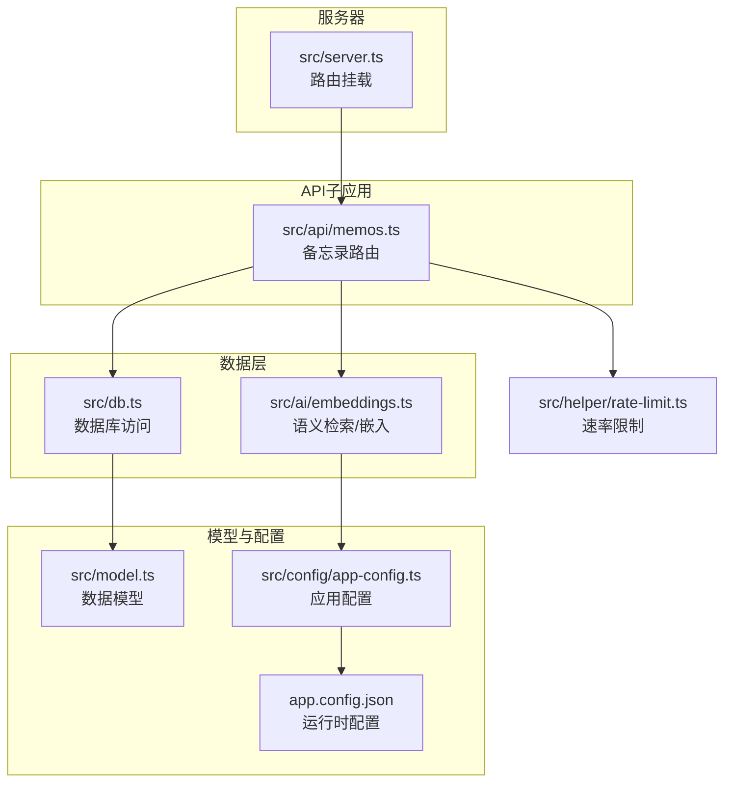
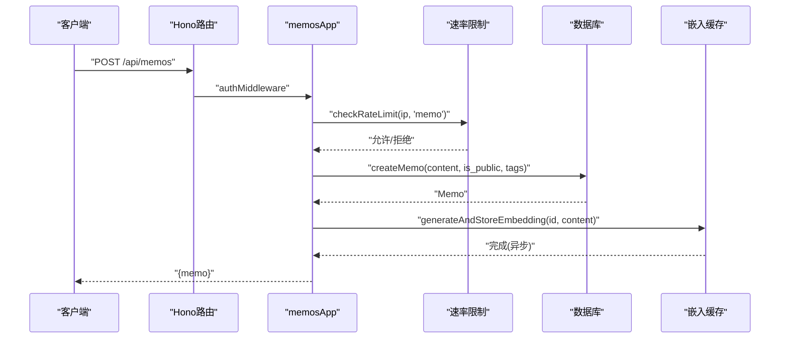
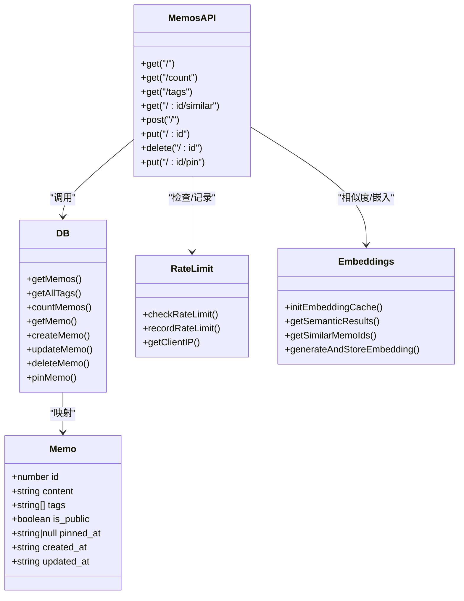

# 备忘录API

<cite>
**本文档引用的文件**
- [src/api/memos.ts](file://src/api/memos.ts)
- [src/db.ts](file://src/db.ts)
- [src/model.ts](file://src/model.ts)
- [src/server.ts](file://src/server.ts)
- [src/helper/rate-limit.ts](file://src/helper/rate-limit.ts)
- [src/ai/embeddings.ts](file://src/ai/embeddings.ts)
- [app.config.json](file://app.config.json)
- [src/config/app-config.ts](file://src/config/app-config.ts)
- [src/frontend/masonry/api.ts](file://src/frontend/masonry/api.ts)
</cite>

## 目录
1. [简介](#简介)
2. [项目结构](#项目结构)
3. [核心组件](#核心组件)
4. [架构总览](#架构总览)
5. [详细组件分析](#详细组件分析)
6. [依赖关系分析](#依赖关系分析)
7. [性能考量](#性能考量)
8. [故障排查指南](#故障排查指南)
9. [结论](#结论)
10. [附录](#附录)

## 简介
本文件为备忘录API的完整技术文档，覆盖CRUD操作、查询过滤、分页与排序、请求/响应格式、批量操作与错误处理，并提供实际使用示例与最佳实践。API基于Hono框架构建，采用SQLite作为持久化存储，支持语义相似度检索与嵌入向量缓存，具备速率限制保护与可配置的重排策略。

## 项目结构
备忘录API位于独立的子应用中，通过主服务器路由挂载，数据库访问封装在独立模块中，模型定义统一于类型声明文件。

图表来源
- [src/server.ts:40-46](file://src/server.ts#L40-L46)
- [src/api/memos.ts:26](file://src/api/memos.ts#L26)
- [src/db.ts:15-61](file://src/db.ts#L15-L61)
- [src/ai/embeddings.ts:16-64](file://src/ai/embeddings.ts#L16-L64)
- [src/config/app-config.ts:57-107](file://src/config/app-config.ts#L57-L107)
- [app.config.json:1-22](file://app.config.json#L1-L22)
- [src/helper/rate-limit.ts:25-152](file://src/helper/rate-limit.ts#L25-L152)

章节来源
- [src/server.ts:40-46](file://src/server.ts#L40-L46)
- [src/api/memos.ts:26](file://src/api/memos.ts#L26)

## 核心组件
- API子应用：提供备忘录的CRUD、置顶管理、标签查询、数量统计、相似检索等接口。
- 数据层：封装SQLite访问、SQL构造、JSON标签解析、排序规则与索引。
- 模型定义：统一Memo实体的字段与类型。
- 速率限制：基于IP的小时/天双窗口限流，保护备忘录创建。
- 语义检索：向量嵌入缓存、余弦相似度计算、可选重排。
- 应用配置：从配置文件加载AI、嵌入阈值、重排策略与速率限制参数。

章节来源
- [src/api/memos.ts:26-220](file://src/api/memos.ts#L26-L220)
- [src/db.ts:122-169](file://src/db.ts#L122-L169)
- [src/model.ts:1-9](file://src/model.ts#L1-L9)
- [src/helper/rate-limit.ts:25-152](file://src/helper/rate-limit.ts#L25-L152)
- [src/ai/embeddings.ts:16-228](file://src/ai/embeddings.ts#L16-L228)
- [app.config.json:1-22](file://app.config.json#L1-L22)
- [src/config/app-config.ts:57-107](file://src/config/app-config.ts#L57-L107)

## 架构总览
备忘录API采用“路由层-业务层-数据层”的分层设计，路由层负责参数解析与鉴权，业务层执行校验与调用数据层，数据层负责SQL构造与结果映射。语义检索与嵌入缓存作为可选增强功能，与主流程解耦。

图表来源
- [src/api/memos.ts:103-144](file://src/api/memos.ts#L103-L144)
- [src/helper/rate-limit.ts:77-110](file://src/helper/rate-limit.ts#L77-L110)
- [src/db.ts:198-212](file://src/db.ts#L198-L212)
- [src/ai/embeddings.ts:217-227](file://src/ai/embeddings.ts#L217-L227)

## 详细组件分析

### 路由与端点概览
- GET /api/memos：列表查询，支持搜索、标签过滤、分页与hasMore标记；管理员可通过all=true获取全部（无分页）。
- GET /api/memos/count：返回公开或私有（按鉴权）备忘录总数。
- GET /api/memos/tags：返回所有可用标签。
- GET /api/memos/:id/similar：基于向量相似度返回相似备忘录。
- POST /api/memos：创建备忘录，支持内容、公开状态、标签。
- PUT /api/memos/:id：更新备忘录，支持内容、公开状态、标签。
- DELETE /api/memos/:id：删除备忘录。
- PUT /api/memos/:id/pin：置顶/取消置顶备忘录。

章节来源
- [src/api/memos.ts:28-101](file://src/api/memos.ts#L28-L101)
- [src/api/memos.ts:103-199](file://src/api/memos.ts#L103-L199)
- [src/api/memos.ts:201-219](file://src/api/memos.ts#L201-L219)

### 查询参数与过滤选项
- all：当为true且已通过匿名鉴权时，返回全部备忘录（无分页）。
- search：全文模糊匹配content字段。
- tag：逗号分隔的多个标签，满足任一即命中。
- page/limit：分页参数，默认page=0，limit=50。
- hasMore：仅在分页模式下返回，指示是否存在更多数据。

排序规则
- 服务端统一排序：pinned_at存在且非空时优先显示，随后按pinned_at降序，最后按created_at降序。

章节来源
- [src/api/memos.ts:29-70](file://src/api/memos.ts#L29-L70)
- [src/db.ts:122-169](file://src/db.ts#L122-L169)

### 分页与排序
- 分页逻辑：根据page与limit计算起始偏移，取limit+1条以判断hasMore，再截取limit条返回。
- 排序逻辑：服务端统一ORDER BY，避免前端重复处理。

章节来源
- [src/api/memos.ts:61-69](file://src/api/memos.ts#L61-L69)
- [src/db.ts:163](file://src/db.ts#L163)

### 请求体格式
- 创建/更新通用字段
  - content：字符串，必填（创建时）。
  - is_public：布尔，缺省视为公开。
  - tags：字符串数组，空字符串会被过滤，去空白后保存。
- 置顶接口
  - pinned：布尔，true为置顶，false为取消置顶。

章节来源
- [src/api/memos.ts:105-144](file://src/api/memos.ts#L105-L144)
- [src/api/memos.ts:147-187](file://src/api/memos.ts#L147-L187)
- [src/api/memos.ts:204-219](file://src/api/memos.ts#L204-L219)

### 响应格式
- 列表响应
  - memos：Memo对象数组。
  - hasMore：布尔，仅分页时返回。
- 单个对象响应
  - memo：Memo对象。
- 标签列表响应
  - tags：字符串数组。
- 数量响应
  - count：数字。
- 错误响应
  - error：字符串，HTTP状态码对应语义。

Memo字段定义
- id：整数。
- content：字符串。
- tags：字符串数组。
- is_public：布尔。
- pinned_at：字符串或null。
- created_at：字符串（ISO时间戳）。
- updated_at：字符串（ISO时间戳）。

章节来源
- [src/api/memos.ts:29-70](file://src/api/memos.ts#L29-L70)
- [src/api/memos.ts:72-77](file://src/api/memos.ts#L72-L77)
- [src/api/memos.ts:97-101](file://src/api/memos.ts#L97-L101)
- [src/api/memos.ts:103-144](file://src/api/memos.ts#L103-L144)
- [src/api/memos.ts:146-199](file://src/api/memos.ts#L146-L199)
- [src/api/memos.ts:201-219](file://src/api/memos.ts#L201-L219)
- [src/model.ts:1-9](file://src/model.ts#L1-L9)

### 速率限制
- 适用场景：创建备忘录。
- 限制维度：IP + 类别（memo/ai）。
- 窗口策略：小时窗口与天窗口双层限制。
- 配置来源：环境变量 > app.config.json > 硬编码默认值。
- 错误响应：429，包含剩余等待秒数提示。

章节来源
- [src/helper/rate-limit.ts:25-152](file://src/helper/rate-limit.ts#L25-L152)
- [src/api/memos.ts:120-124](file://src/api/memos.ts#L120-L124)
- [app.config.json:15-20](file://app.config.json#L15-L20)
- [src/config/app-config.ts:57-107](file://src/config/app-config.ts#L57-L107)

### 语义检索与相似度
- 检索入口
  - GET /api/memos?search=关键词：同时执行LIKE与向量相似度召回，合并去重后返回。
  - GET /api/memos/:id/similar：基于指定备忘录的向量相似度返回相似集合。
- 相似度阈值：来自配置embeddings.similarityThreshold。
- 可选重排：当启用rerank时，先召回候选再用rerank模型重排，最终取前N。
- 嵌入缓存：内存中维护memo_id到Float32Array的映射，首次启动加载DB中的嵌入并补全缺失项。

章节来源
- [src/api/memos.ts:38-54](file://src/api/memos.ts#L38-L54)
- [src/api/memos.ts:79-95](file://src/api/memos.ts#L79-L95)
- [src/ai/embeddings.ts:16-228](file://src/ai/embeddings.ts#L16-L228)
- [app.config.json:7-14](file://app.config.json#L7-L14)
- [src/config/app-config.ts:15-28](file://src/config/app-config.ts#L15-L28)

### 数据模型与数据库
- 表结构要点
  - memos：id、content、tags（JSON数组）、is_public（1/0）、pinned_at、created_at、updated_at。
  - memo_embeddings：memo_id、embedding（BLOB）、updated_at。
- 标签存储
  - 以JSON数组形式存储，解析时兼容旧版字符串标签。
- 索引
  - idx_memos_pinned_at：提升置顶排序效率。

章节来源
- [src/db.ts:18-61](file://src/db.ts#L18-L61)
- [src/db.ts:93-108](file://src/db.ts#L93-L108)
- [src/db.ts:163](file://src/db.ts#L163)

### 批量操作
- 当前API未提供专门的批量操作端点。建议通过循环调用单条操作端点实现批量行为，并在客户端侧做好幂等与错误处理。

章节来源
- [src/api/memos.ts:28-219](file://src/api/memos.ts#L28-L219)

### 错误处理机制
- 参数校验
  - JSON解析失败：400。
  - 内容为空：400。
  - ID非法：400。
  - 不存在的备忘录：404。
- 速率限制触发：429。
- 语义检索异常：降级为LIKE结果，不中断主流程。

章节来源
- [src/api/memos.ts:107-118](file://src/api/memos.ts#L107-L118)
- [src/api/memos.ts:150-161](file://src/api/memos.ts#L150-L161)
- [src/api/memos.ts:189-199](file://src/api/memos.ts#L189-L199)
- [src/api/memos.ts:206-213](file://src/api/memos.ts#L206-L213)
- [src/api/memos.ts:82-84](file://src/api/memos.ts#L82-L84)
- [src/api/memos.ts:51-53](file://src/api/memos.ts#L51-L53)

### 使用示例与最佳实践

- 获取列表（含分页与hasMore）
  - 请求：GET /api/memos?page=0&limit=50&search=关键词&tag=标签1,标签2
  - 响应：{ memos: [...], hasMore: true/false }
  - 最佳实践：前端在滚动到底部时增加page并追加到列表，依据hasMore决定是否继续加载。

- 创建备忘录
  - 请求：POST /api/memos
  - Body：{ content: "内容", is_public: true, tags: ["tag1","tag2"] }
  - 响应：{ memo: { ... } }
  - 最佳实践：创建后立即触发一次embedding生成，但不要阻塞UI。

- 更新备忘录
  - 请求：PUT /api/memos/:id
  - Body：{ content: "新内容", is_public: false, tags: [...] }
  - 响应：{ memo: { ... } }
  - 最佳实践：仅传递需要变更的字段，避免不必要的写入。

- 删除备忘录
  - 请求：DELETE /api/memos/:id
  - 响应：{ ok: true }
  - 最佳实践：删除后清理本地缓存并同步嵌入缓存。

- 置顶/取消置顶
  - 请求：PUT /api/memos/:id/pin
  - Body：{ pinned: true }
  - 响应：{ memo: { ... } }
  - 最佳实践：置顶操作无需重新生成embedding。

- 相似检索
  - 请求：GET /api/memos/:id/similar
  - 响应：{ memos: [...] }
  - 最佳实践：在详情页或卡片右上角提供“查看相似”入口，避免频繁触发。

- 标签与数量
  - 请求：GET /api/memos/tags
  - 响应：{ tags: [...] }
  - 请求：GET /api/memos/count
  - 响应：{ count: 123 }

章节来源
- [src/frontend/masonry/api.ts:51-130](file://src/frontend/masonry/api.ts#L51-L130)
- [src/frontend/masonry/api.ts:143-161](file://src/frontend/masonry/api.ts#L143-L161)
- [src/api/memos.ts:29-70](file://src/api/memos.ts#L29-L70)
- [src/api/memos.ts:97-101](file://src/api/memos.ts#L97-L101)
- [src/api/memos.ts:72-77](file://src/api/memos.ts#L72-L77)

## 依赖关系分析

图表来源
- [src/model.ts:1-9](file://src/model.ts#L1-L9)
- [src/api/memos.ts:26-220](file://src/api/memos.ts#L26-L220)
- [src/db.ts:122-249](file://src/db.ts#L122-L249)
- [src/helper/rate-limit.ts:77-140](file://src/helper/rate-limit.ts#L77-L140)
- [src/ai/embeddings.ts:16-228](file://src/ai/embeddings.ts#L16-L228)

## 性能考量
- 查询性能
  - 标签过滤使用JSON函数与EXISTS子查询，建议在tags列上保持合理数量，避免过多标签导致LIKE开销上升。
  - 排序依赖pinned_at索引，建议定期维护索引有效性。
- 语义检索
  - 嵌入缓存为内存结构，首次启动会扫描并生成缺失的向量，建议在高并发场景下预热缓存。
  - 相似度阈值与候选集大小影响召回质量与性能，可根据业务调整配置。
- 分页与hasMore
  - 采用limit+1策略提前判断hasMore，减少一次查询往返。
- 速率限制
  - 通过小时/天双窗口控制备忘录创建频率，避免突发流量冲击。

章节来源
- [src/db.ts:141-158](file://src/db.ts#L141-L158)
- [src/ai/embeddings.ts:16-64](file://src/ai/embeddings.ts#L16-L64)
- [src/api/memos.ts:61-69](file://src/api/memos.ts#L61-L69)
- [src/helper/rate-limit.ts:77-110](file://src/helper/rate-limit.ts#L77-L110)

## 故障排查指南
- 400错误
  - JSON解析失败：检查请求体格式与Content-Type。
  - 内容为空：确保content非空且去除首尾空白。
  - ID非法：确认URL参数为正整数。
- 404错误
  - 备忘录不存在：确认ID有效且当前用户有权限访问。
- 429错误
  - 速率限制：等待小时/天窗口重置或降低创建频率。
- 语义检索异常
  - 降级为LIKE结果：检查AI服务可用性与网络连通性。
- 嵌入生成失败
  - 异步忽略，可在日志中查看错误并重试。

章节来源
- [src/api/memos.ts:107-118](file://src/api/memos.ts#L107-L118)
- [src/api/memos.ts:150-161](file://src/api/memos.ts#L150-L161)
- [src/api/memos.ts:189-199](file://src/api/memos.ts#L189-L199)
- [src/api/memos.ts:206-213](file://src/api/memos.ts#L206-L213)
- [src/api/memos.ts:51-53](file://src/api/memos.ts#L51-L53)
- [src/ai/embeddings.ts:217-227](file://src/ai/embeddings.ts#L217-L227)

## 结论
备忘录API提供了完备的CRUD能力与灵活的查询过滤、分页排序、速率限制与语义检索增强。通过清晰的分层设计与可配置的嵌入策略，既保证了易用性也兼顾了性能与扩展性。建议在生产环境中结合速率限制与重排策略，持续优化相似度阈值与候选集规模，以获得更好的用户体验。

## 附录

### 端点一览与参数说明
- GET /api/memos
  - 查询参数：all、search、tag、page、limit
  - 响应：{ memos: Memo[], hasMore: boolean }
- GET /api/memos/count
  - 响应：{ count: number }
- GET /api/memos/tags
  - 响应：{ tags: string[] }
- GET /api/memos/:id/similar
  - 响应：{ memos: Memo[] }
- POST /api/memos
  - 请求体：{ content, is_public?, tags? }
  - 响应：{ memo: Memo }
- PUT /api/memos/:id
  - 请求体：{ content?, is_public?, tags? }
  - 响应：{ memo: Memo }
- DELETE /api/memos/:id
  - 响应：{ ok: true }
- PUT /api/memos/:id/pin
  - 请求体：{ pinned: boolean }
  - 响应：{ memo: Memo }

章节来源
- [src/api/memos.ts:28-219](file://src/api/memos.ts#L28-L219)