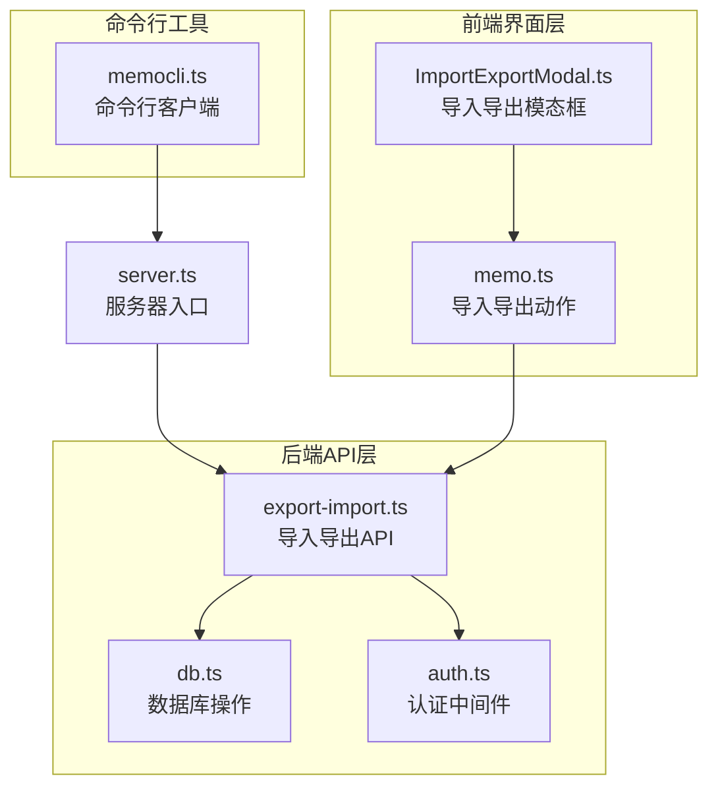
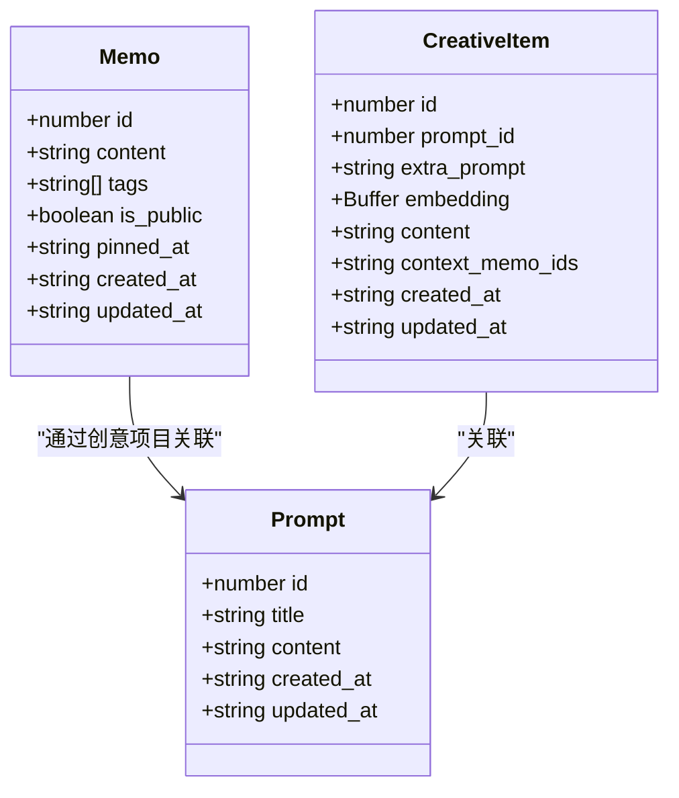
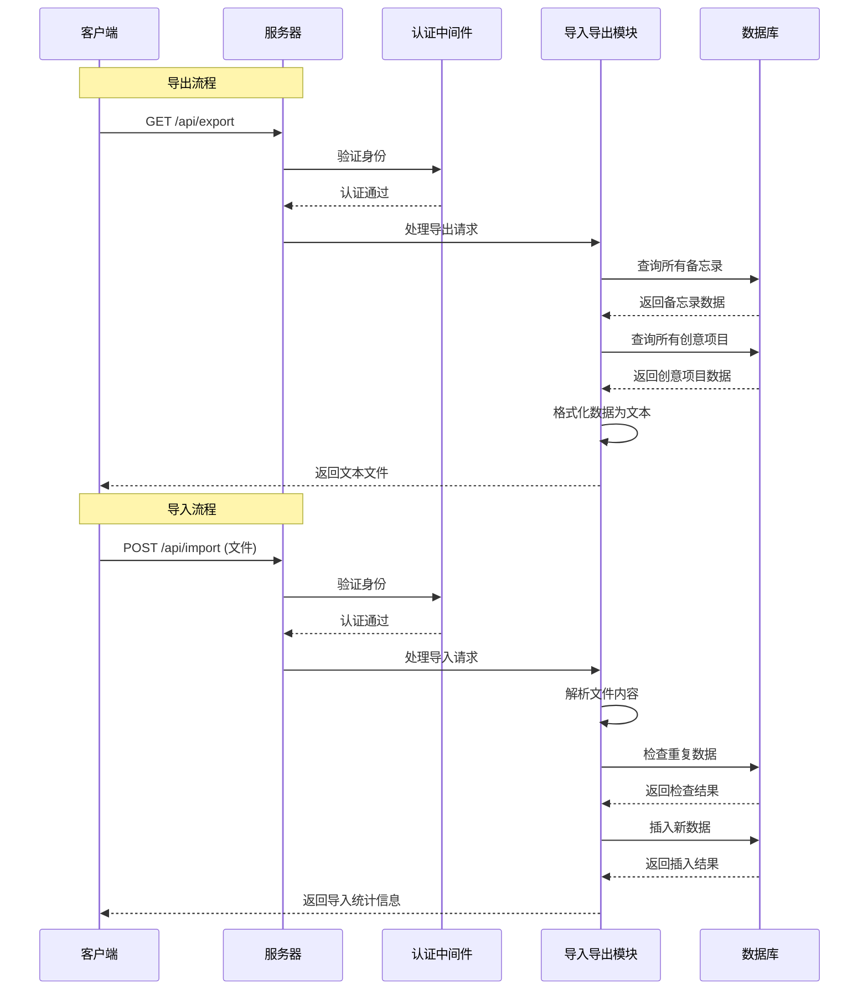
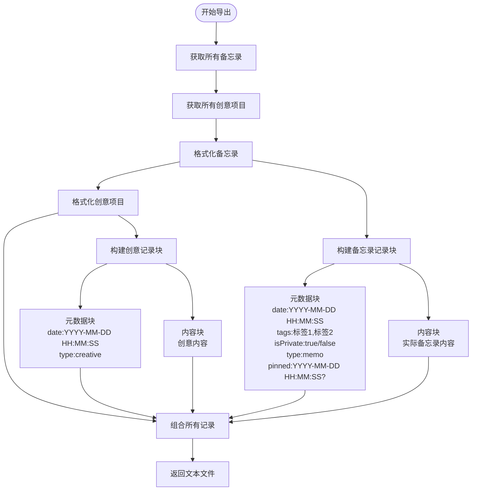
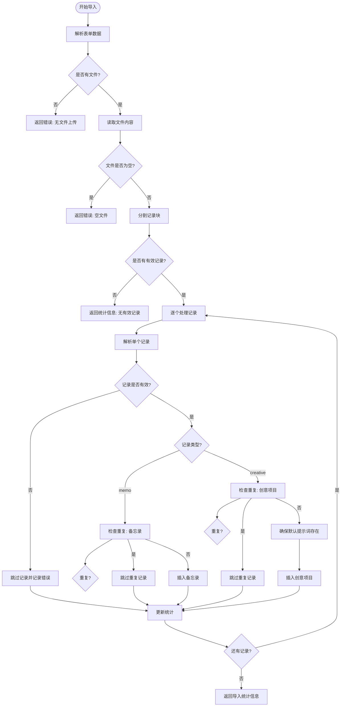
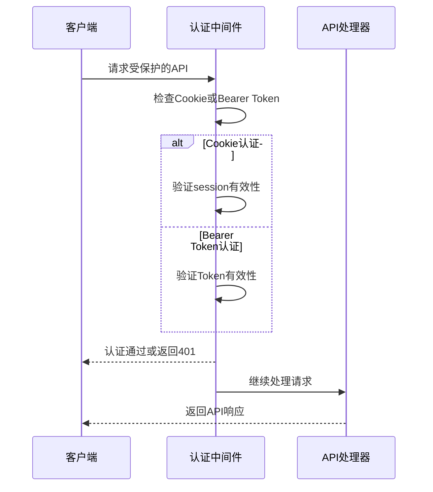
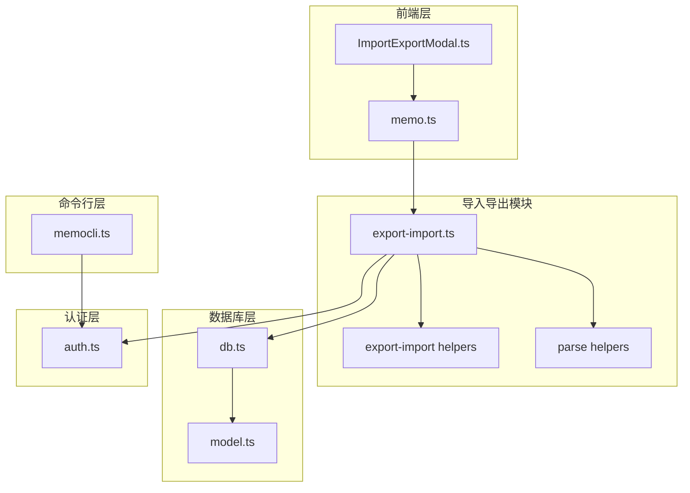
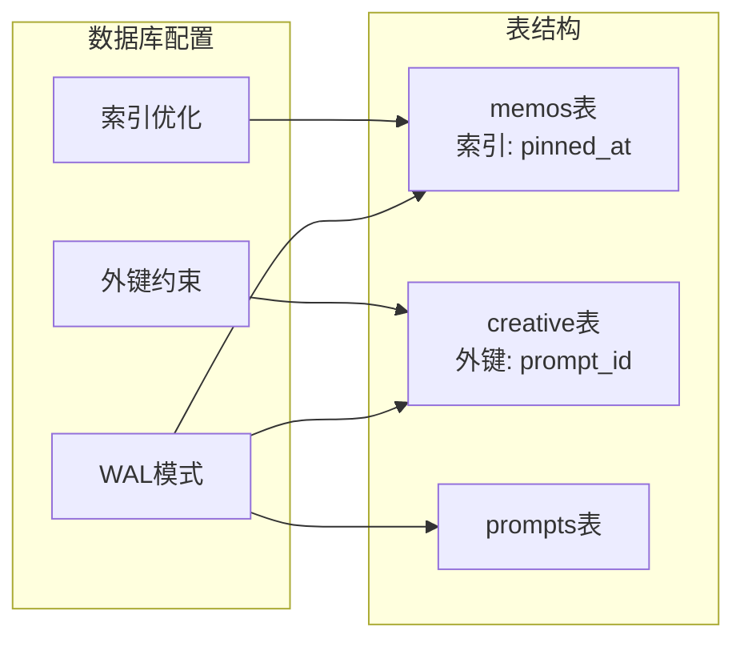

# 导入导出API

<cite>
**本文档引用的文件**
- [export-import.ts](file://src/api/export-import.ts)
- [db.ts](file://src/db.ts)
- [model.ts](file://src/model.ts)
- [server.ts](file://src/server.ts)
- [ImportExportModal.ts](file://src/frontend/admin/components/ImportExportModal.ts)
- [memo.ts](file://src/frontend/admin/actions/memo.ts)
- [auth.ts](file://src/auth.ts)
- [memocli.ts](file://memocli.ts)
</cite>

## 目录
1. [简介](#简介)
2. [项目结构](#项目结构)
3. [核心组件](#核心组件)
4. [架构概览](#架构概览)
5. [详细组件分析](#详细组件分析)
6. [依赖关系分析](#依赖关系分析)
7. [性能考虑](#性能考虑)
8. [故障排除指南](#故障排除指南)
9. [结论](#结论)
10. [附录](#附录)

## 简介

本文档详细介绍了 Memos 应用的导入导出 API 功能。该系统提供了完整的数据导入和导出能力，支持将备忘录和创意内容导出为纯文本格式，并从相同格式的文件中导入数据。系统采用 SQLite 作为数据存储，支持多种数据格式和强大的错误处理机制。

## 项目结构

导入导出功能主要分布在以下模块中：



**图表来源**
- [export-import.ts:1-288](file://src/api/export-import.ts#L1-L288)
- [db.ts:1-484](file://src/db.ts#L1-L484)
- [server.ts:1-137](file://src/server.ts#L1-L137)

**章节来源**
- [server.ts:38-46](file://src/server.ts#L38-L46)
- [export-import.ts:14-14](file://src/api/export-import.ts#L14-L14)

## 核心组件

### 导入导出应用实例

系统通过 Hono 框架创建了一个专门的导入导出应用实例，挂载在 `/api` 路径下：

- **GET /api/export** - 导出所有数据为文本文件
- **POST /api/import** - 从上传的文本文件导入数据

### 数据模型

系统支持两种主要数据类型：



**图表来源**
- [model.ts:1-35](file://src/model.ts#L1-L35)

**章节来源**
- [model.ts:1-35](file://src/model.ts#L1-L35)
- [db.ts:40-61](file://src/db.ts#L40-L61)

## 架构概览

导入导出系统的整体架构如下：



**图表来源**
- [export-import.ts:165-181](file://src/api/export-import.ts#L165-L181)
- [export-import.ts:183-287](file://src/api/export-import.ts#L183-L287)
- [auth.ts:123-127](file://src/auth.ts#L123-L127)

## 详细组件分析

### 导出功能实现

#### 导出数据格式

系统将数据导出为自定义的纯文本格式，每个记录块包含元数据和内容：



**图表来源**
- [export-import.ts:40-74](file://src/api/export-import.ts#L40-L74)
- [export-import.ts:24-37](file://src/api/export-import.ts#L24-L37)

#### 导出响应头设置

导出功能会设置适当的响应头以确保文件正确下载：

- Content-Type: text/plain; charset=utf-8
- Content-Disposition: attachment; filename="memos-export-YYYY-MM-DD.txt"

**章节来源**
- [export-import.ts:165-181](file://src/api/export-import.ts#L165-L181)

### 导入功能实现

#### 文件解析机制

导入功能支持解析自定义格式的文本文件：



**图表来源**
- [export-import.ts:183-287](file://src/api/export-import.ts#L183-L287)
- [export-import.ts:87-154](file://src/api/export-import.ts#L87-L154)
- [export-import.ts:156-161](file://src/api/export-import.ts#L156-L161)

#### 数据验证机制

导入过程包含多层次的数据验证：

1. **文件格式验证**: 检查文件是否存在且非空
2. **记录格式验证**: 验证每个记录块的元数据格式
3. **内容完整性验证**: 确保记录包含必要的元数据和内容
4. **类型验证**: 验证记录类型必须为 "memo" 或 "creative"
5. **重复数据检测**: 避免重复导入相同内容

**章节来源**
- [export-import.ts:183-287](file://src/api/export-import.ts#L183-L287)
- [db.ts:458-474](file://src/db.ts#L458-L474)

### 认证和安全

导入导出功能使用统一的认证中间件：



**图表来源**
- [auth.ts:123-127](file://src/auth.ts#L123-L127)
- [export-import.ts:1-12](file://src/api/export-import.ts#L1-L12)

**章节来源**
- [auth.ts:28-39](file://src/auth.ts#L28-L39)
- [auth.ts:111-119](file://src/auth.ts#L111-L119)

## 依赖关系分析

### 模块依赖图



**图表来源**
- [export-import.ts:1-12](file://src/api/export-import.ts#L1-L12)
- [db.ts:1-3](file://src/db.ts#L1-L3)
- [auth.ts:1-127](file://src/auth.ts#L1-L127)

### 数据流分析

导入导出功能的数据流遵循以下模式：

1. **输入验证**: 验证请求参数和文件格式
2. **数据解析**: 解析自定义格式的文本内容
3. **业务逻辑**: 执行导入/导出的核心业务逻辑
4. **数据持久化**: 将数据保存到数据库或从数据库读取
5. **输出格式化**: 格式化响应数据

**章节来源**
- [export-import.ts:183-287](file://src/api/export-import.ts#L183-L287)
- [db.ts:406-449](file://src/db.ts#L406-L449)

## 性能考虑

### 批量操作优化

系统在导入过程中实现了多项性能优化措施：

1. **批量处理**: 单个请求可以处理多个记录，减少网络往返
2. **重复数据检测**: 使用数据库查询避免重复导入
3. **内存管理**: 分块处理大文件，避免内存溢出
4. **索引优化**: 数据库表包含适当的索引以提高查询性能

### 数据库性能特性



**图表来源**
- [db.ts:8-13](file://src/db.ts#L8-L13)
- [db.ts:30-60](file://src/db.ts#L30-L60)

**章节来源**
- [db.ts:8-13](file://src/db.ts#L8-L13)
- [db.ts:122-169](file://src/db.ts#L122-L169)

## 故障排除指南

### 常见错误及解决方案

#### 导入错误

| 错误类型 | 可能原因 | 解决方案 |
|---------|---------|---------|
| 无效表单数据 | 文件上传格式不正确 | 确保使用正确的表单格式上传文件 |
| 无文件上传 | 请求中缺少文件字段 | 检查前端上传组件或命令行参数 |
| 空文件 | 上传的文件内容为空 | 检查源文件是否包含有效数据 |
| 记录格式无效 | 文件格式不符合预期 | 验证文件格式是否为自定义文本格式 |

#### 导出错误

| 错误类型 | 可能原因 | 解决方案 |
|---------|---------|---------|
| 权限不足 | 未通过认证 | 检查认证凭据是否正确 |
| 数据库连接失败 | 数据库不可访问 | 检查数据库服务状态 |
| 内存不足 | 数据量过大导致内存溢出 | 分批导出或增加系统内存 |

**章节来源**
- [export-import.ts:196-206](file://src/api/export-import.ts#L196-L206)
- [export-import.ts:225-230](file://src/api/export-import.ts#L225-L230)

### 调试技巧

1. **查看导入统计**: 系统会返回详细的导入统计信息，包括导入数量、跳过数量和去重数量
2. **检查错误列表**: 如果出现错误，系统会列出具体的错误信息
3. **验证文件格式**: 确保导入文件符合预期的格式要求
4. **监控数据库状态**: 检查数据库连接和表结构是否正常

**章节来源**
- [export-import.ts:275-287](file://src/api/export-import.ts#L275-L287)

## 结论

导入导出 API 提供了完整、可靠的数据迁移解决方案。系统具有以下优势：

1. **简单易用**: 支持标准的纯文本格式，易于理解和使用
2. **数据完整性**: 包含重复数据检测和错误处理机制
3. **安全性**: 通过统一的认证中间件保护 API
4. **性能优化**: 支持批量操作和内存优化
5. **扩展性**: 模块化设计便于功能扩展

该系统特别适合需要在不同环境之间迁移数据的场景，如备份恢复、系统升级或数据迁移。

## 附录

### 使用示例

#### 前端导入导出

```javascript
// 导出数据
fetch('/api/export', {
  credentials: 'same-origin'
})
.then(response => response.blob())
.then(blob => {
  const url = URL.createObjectURL(blob);
  const a = document.createElement('a');
  a.href = url;
  a.download = 'memos-export-YYYY-MM-DD.txt';
  document.body.appendChild(a);
  a.click();
  document.body.removeChild(a);
  URL.revokeObjectURL(url);
});

// 导入数据
const formData = new FormData();
formData.append('file', file);
fetch('/api/import', {
  method: 'POST',
  credentials: 'same-origin',
  body: formData
})
.then(response => response.json())
.then(data => console.log(data.message));
```

#### 命令行导入

虽然主要的导入导出功能通过前端界面实现，但系统也支持通过命令行工具进行数据操作：

```bash
# 设置环境变量
export MEMOS_API_URL="http://localhost:3020"
export MEMOS_SECRET_KEY="your-secret-key"

# 创建备忘录（命令行工具示例）
./memocli -c "测试内容" -t "标签1,标签2" --private
```

**章节来源**
- [memo.ts:180-205](file://src/frontend/admin/actions/memo.ts#L180-L205)
- [memo.ts:207-230](file://src/frontend/admin/actions/memo.ts#L207-L230)
- [memocli.ts:89-162](file://memocli.ts#L89-L162)

### 数据格式规范

#### 导出格式规范

每个导出记录包含以下结构：

```
======
—
date:YYYY-MM-DD HH:MM:SS
tags:标签1,标签2
isPrivate:true/false
type:memo
pinned:YYYY-MM-DD HH:MM:SS?
—
备忘录内容

======
—
date:YYYY-MM-DD HH:MM:SS
type:creative
—
创意内容
```

#### 字段说明

| 字段名 | 类型 | 必需 | 说明 |
|-------|------|------|------|
| date | string | 是 | 创建时间，格式为 YYYY-MM-DD HH:MM:SS |
| tags | string | 可选 | 备忘录标签，多个标签用逗号分隔 |
| isPrivate | boolean | 可选 | 是否为私有内容 |
| type | string | 是 | 记录类型，必须为 "memo" 或 "creative" |
| pinned | string | 可选 | 置顶时间，仅对备忘录有效 |
| content | string | 是 | 实际内容 |

**章节来源**
- [export-import.ts:24-37](file://src/api/export-import.ts#L24-L37)
- [export-import.ts:135-154](file://src/api/export-import.ts#L135-L154)

### 兼容性说明

系统设计考虑了以下兼容性要求：

1. **浏览器兼容性**: 支持现代浏览器的 File API 和 Fetch API
2. **服务器兼容性**: 基于 Hono 框架，可在多种环境中运行
3. **数据格式兼容性**: 使用标准的纯文本格式，便于第三方工具处理
4. **认证兼容性**: 支持 Cookie 和 Bearer Token 两种认证方式