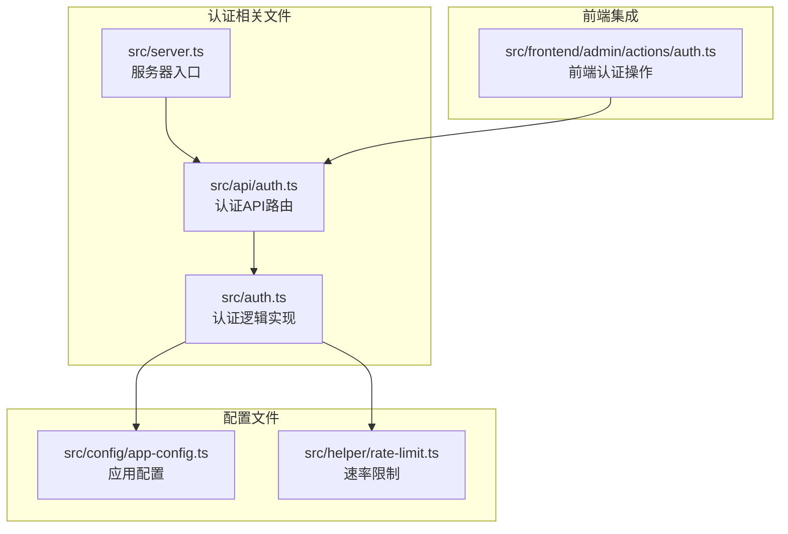
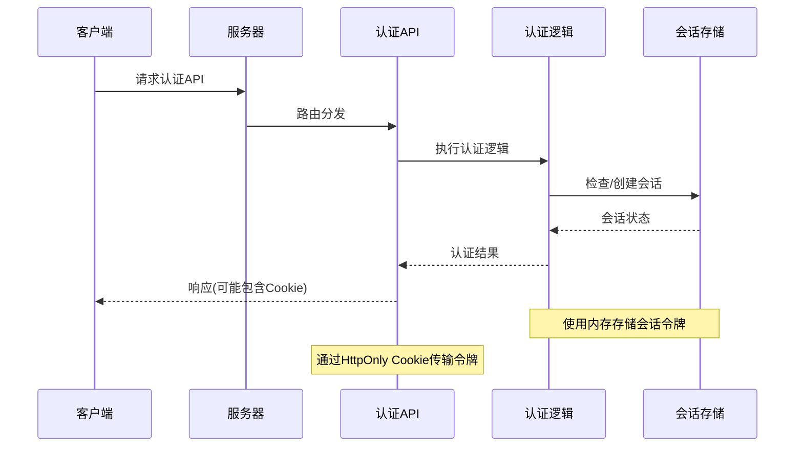
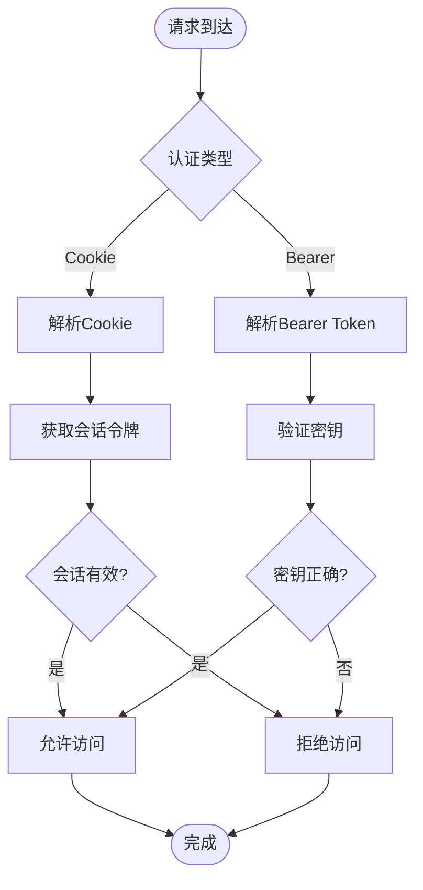
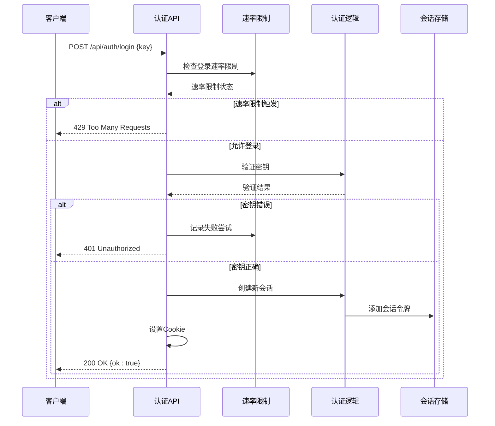
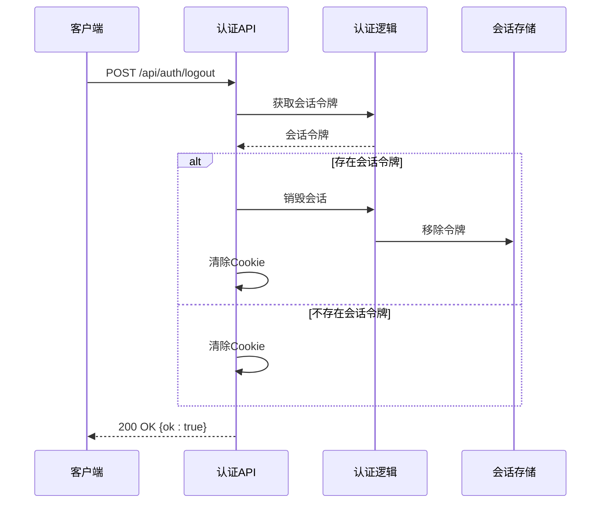
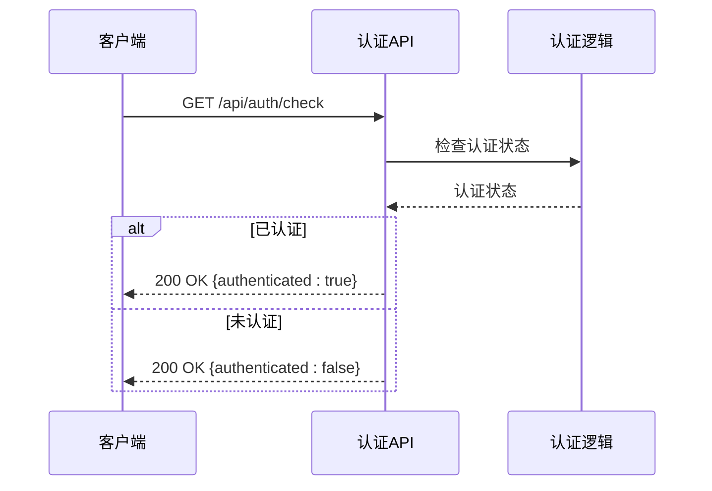
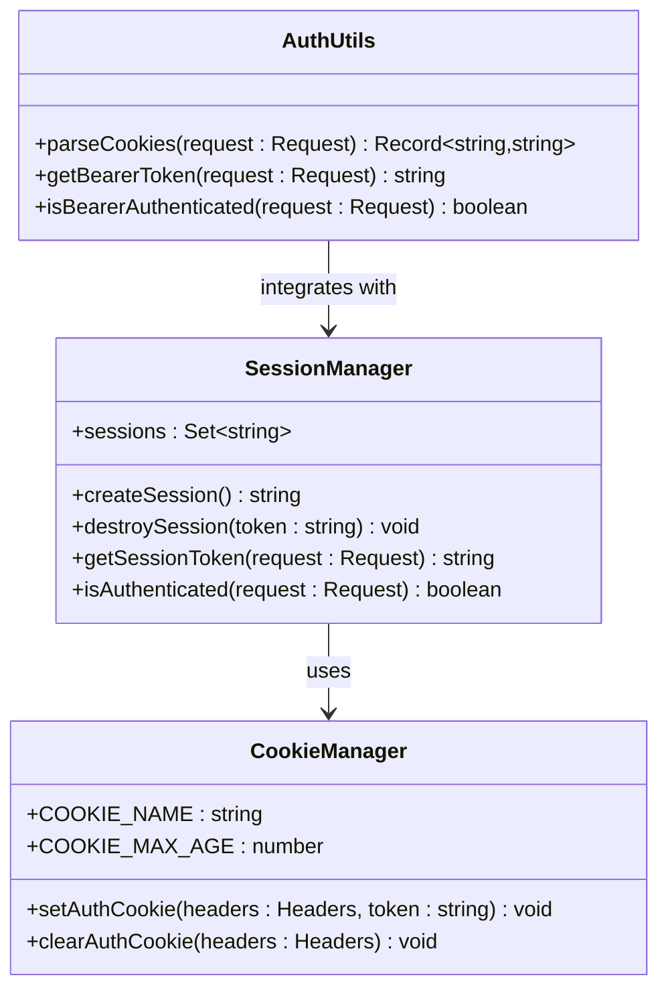
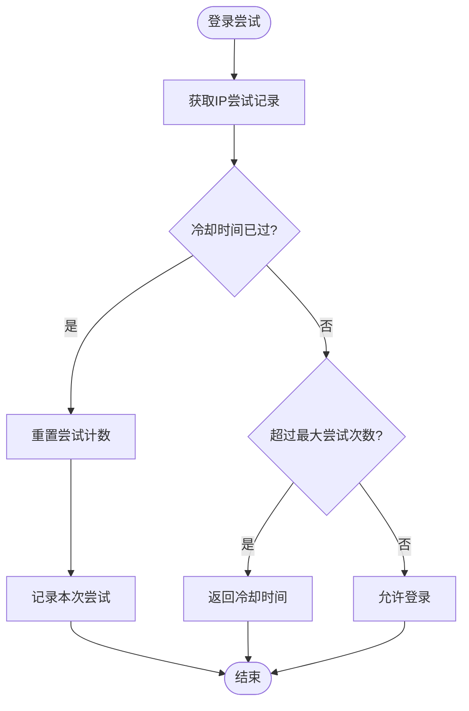
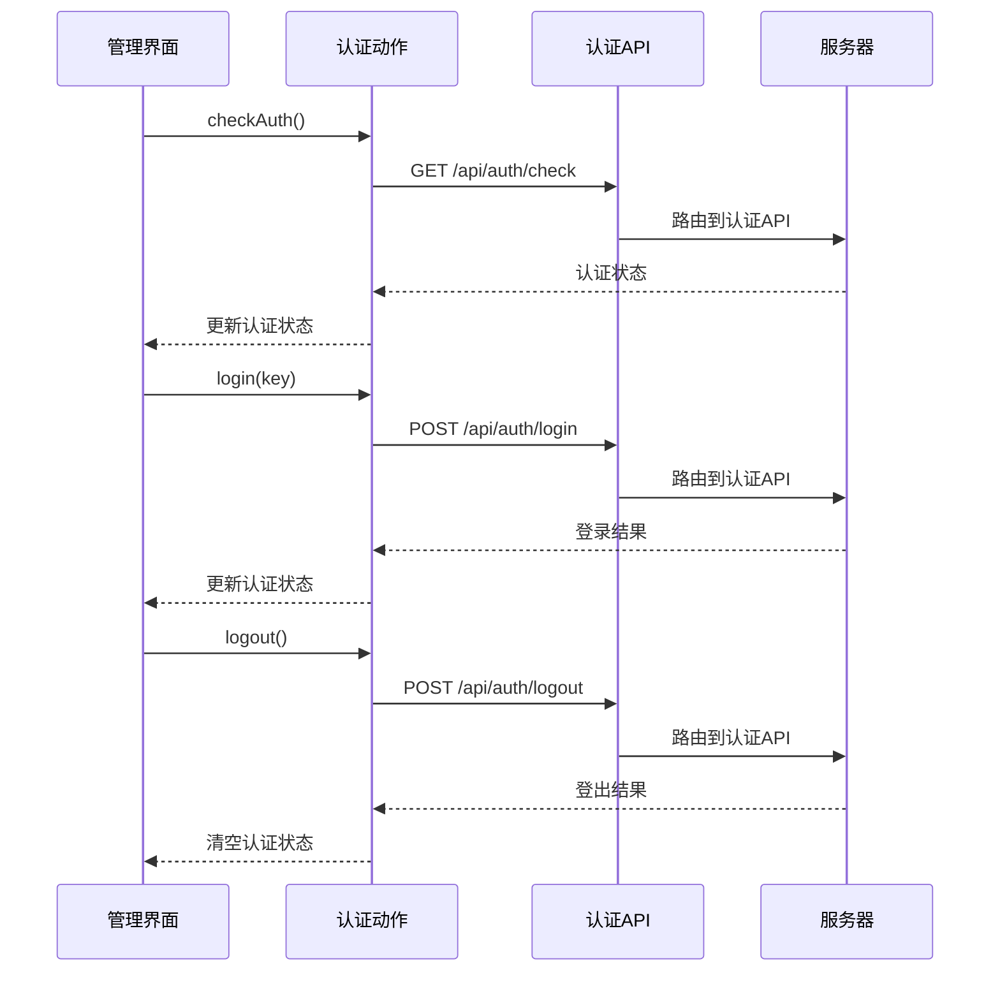
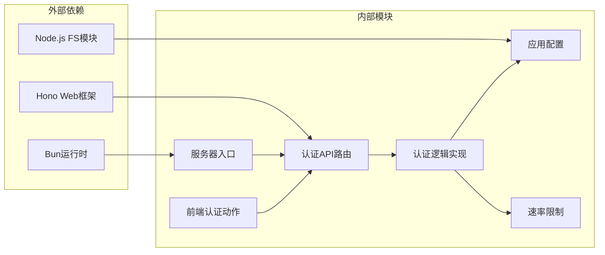

# 认证API

<cite>
**本文档引用的文件**
- [src/api/auth.ts](file://src/api/auth.ts)
- [src/auth.ts](file://src/auth.ts)
- [src/server.ts](file://src/server.ts)
- [src/frontend/admin/actions/auth.ts](file://src/frontend/admin/actions/auth.ts)
- [src/config/app-config.ts](file://src/config/app-config.ts)
- [src/helper/rate-limit.ts](file://src/helper/rate-limit.ts)
- [README.md](file://README.md)
</cite>

## 目录
1. [简介](#简介)
2. [项目结构](#项目结构)
3. [核心组件](#核心组件)
4. [架构概览](#架构概览)
5. [详细组件分析](#详细组件分析)
6. [依赖关系分析](#依赖关系分析)
7. [性能考虑](#性能考虑)
8. [故障排除指南](#故障排除指南)
9. [结论](#结论)

## 简介

认证API是Memos管理系统的核心安全组件，负责管理管理员用户的登录、登出和身份验证流程。该系统采用基于Cookie的会话认证机制，结合内存存储的会话令牌来实现用户身份验证。

Memos是一个轻量级的备忘录应用系统，基于Bun运行时构建，支持公开/私密备忘录管理、标签分类、全文搜索等功能。认证API为管理后台提供安全的身份验证机制，确保只有授权用户能够访问受保护的管理功能。

## 项目结构

认证API在项目中的组织结构如下：



**图表来源**
- [src/api/auth.ts:1-77](file://src/api/auth.ts#L1-L77)
- [src/auth.ts:1-128](file://src/auth.ts#L1-L128)
- [src/server.ts:1-125](file://src/server.ts#L1-L125)

**章节来源**
- [src/api/auth.ts:1-77](file://src/api/auth.ts#L1-L77)
- [src/auth.ts:1-128](file://src/auth.ts#L1-L128)
- [src/server.ts:1-125](file://src/server.ts#L1-L125)

## 核心组件

### 认证API路由

认证API提供了三个核心接口，都位于`/api/auth`路径下：

1. **登录验证** (`POST /api/auth/login`)
2. **登出** (`POST /api/auth/logout`)  
3. **认证检查** (`GET /api/auth/check`)

### 会话管理

系统使用内存存储的会话集合来管理用户会话状态，每个会话都有唯一的UUID令牌。会话令牌通过HttpOnly Cookie进行传输和存储，确保安全性。

### 速率限制

实现了双重登录速率限制机制：
- 最大5次登录尝试
- 1分钟冷却时间
- 基于IP地址的限制

**章节来源**
- [src/api/auth.ts:29-77](file://src/api/auth.ts#L29-L77)
- [src/auth.ts:4-107](file://src/auth.ts#L4-L107)

## 架构概览

认证系统的整体架构采用分层设计：



**图表来源**
- [src/api/auth.ts:31-76](file://src/api/auth.ts#L31-L76)
- [src/auth.ts:28-70](file://src/auth.ts#L28-L70)

### 认证流程

系统支持两种认证方式：

1. **Cookie会话认证**：通过HttpOnly Cookie存储会话令牌
2. **Bearer Token认证**：通过Authorization头传递密钥令牌



**图表来源**
- [src/auth.ts:28-46](file://src/auth.ts#L28-L46)
- [src/auth.ts:111-119](file://src/auth.ts#L111-L119)

## 详细组件分析

### 认证API实现

#### 登录接口 (POST /api/auth/login)

登录接口负责验证管理员密钥并创建新的会话：



**图表来源**
- [src/api/auth.ts:36-68](file://src/api/auth.ts#L36-L68)
- [src/auth.ts:48-70](file://src/auth.ts#L48-L70)

#### 登出接口 (POST /api/auth/logout)

登出接口负责销毁当前会话并清除Cookie：



**图表来源**
- [src/api/auth.ts:70-76](file://src/api/auth.ts#L70-L76)
- [src/auth.ts:54-70](file://src/auth.ts#L54-L70)

#### 认证检查接口 (GET /api/auth/check)

认证检查接口用于验证当前用户的登录状态：



**图表来源**
- [src/api/auth.ts:31-34](file://src/api/auth.ts#L31-L34)
- [src/auth.ts:28-31](file://src/auth.ts#L28-L31)

### 认证逻辑实现

#### 会话管理

系统使用内存存储来管理会话状态：



**图表来源**
- [src/auth.ts:4-70](file://src/auth.ts#L4-L70)

#### 速率限制机制

实现了双重登录速率限制：



**图表来源**
- [src/auth.ts:72-107](file://src/auth.ts#L72-L107)

### 前端集成

前端通过专用的认证动作模块与认证API交互：



**图表来源**
- [src/frontend/admin/actions/auth.ts:12-50](file://src/frontend/admin/actions/auth.ts#L12-L50)

**章节来源**
- [src/api/auth.ts:1-77](file://src/api/auth.ts#L1-L77)
- [src/auth.ts:1-128](file://src/auth.ts#L1-L128)
- [src/frontend/admin/actions/auth.ts:1-50](file://src/frontend/admin/actions/auth.ts#L1-L50)

## 依赖关系分析

认证系统的主要依赖关系如下：



**图表来源**
- [src/server.ts:1-10](file://src/server.ts#L1-L10)
- [src/api/auth.ts:1-12](file://src/api/auth.ts#L1-L12)

### 环境变量配置

系统主要依赖以下环境变量：

| 环境变量 | 默认值 | 用途 | 必需性 |
|---------|--------|------|--------|
| `PORT` | `3020` | 服务器监听端口 | 可选 |
| `MEMOS_SECRET_KEY` | `123` | 管理员登录密钥 | 强烈建议 |

**章节来源**
- [src/api/auth.ts:14-27](file://src/api/auth.ts#L14-L27)
- [README.md:59-65](file://README.md#L59-L65)

## 性能考虑

### 会话存储性能

系统使用内存存储会话令牌，具有以下特点：
- **高性能**：内存操作速度极快
- **简单性**：无需外部存储依赖
- **局限性**：服务重启后会话丢失

### 速率限制性能

登录速率限制使用内存映射表实现：
- **O(1)** 查找复杂度
- **内存占用**：每个IP约24字节
- **清理机制**：自动清理过期记录

### Cookie性能

Cookie设置采用HttpOnly属性：
- **安全性**：防止JavaScript访问
- **性能**：减少跨站脚本攻击风险
- **兼容性**：广泛支持的HTTP标准

## 故障排除指南

### 常见问题及解决方案

#### 1. 登录失败 (401 Unauthorized)

**症状**：POST /api/auth/login 返回401错误

**可能原因**：
- 密钥不正确
- 速率限制触发
- 服务器配置问题

**解决步骤**：
1. 验证`MEMOS_SECRET_KEY`环境变量设置
2. 检查是否触发了速率限制
3. 确认服务器正常运行

#### 2. 速率限制错误 (429 Too Many Requests)

**症状**：频繁登录尝试被拒绝

**解决方法**：
- 等待1分钟冷却时间
- 检查是否有多个客户端同时尝试登录
- 调整客户端重试策略

#### 3. 会话过期

**症状**：登录后一段时间无法访问受保护页面

**原因**：
- 服务器重启导致内存会话丢失
- Cookie被浏览器清除

**解决方法**：
- 重新登录
- 检查浏览器Cookie设置

#### 4. 认证状态检查失败

**症状**：GET /api/auth/check 返回false

**排查步骤**：
1. 检查Cookie是否正确设置
2. 验证会话令牌有效性
3. 确认服务器时间同步

### 错误码说明

| 状态码 | 错误类型 | 描述 | 解决方案 |
|--------|----------|------|----------|
| 200 | 成功 | 操作成功 | 正常使用 |
| 400 | 请求错误 | JSON格式无效 | 检查请求体格式 |
| 401 | 未授权 | 密钥或会话无效 | 重新登录 |
| 429 | 请求过多 | 超过速率限制 | 等待冷却时间 |
| 500 | 服务器错误 | 系统内部错误 | 检查服务器日志 |

### 安全最佳实践

#### 环境变量安全设置

1. **生产环境必须设置**：
   ```bash
   export MEMOS_SECRET_KEY="your-secure-random-key-here"
   ```

2. **密钥强度要求**：
   - 至少32字符
   - 包含字母、数字和特殊字符
   - 随机生成且定期轮换

3. **部署安全**：
   - 不要将密钥提交到版本控制系统
   - 使用加密存储服务
   - 限制密钥访问权限

#### Cookie安全配置

系统使用以下安全设置：
- `HttpOnly`: 防止XSS攻击
- `SameSite=Strict`: 防止CSRF攻击
- `Max-Age=86400`: 24小时有效期
- `Path=/`: 作用域限制

**章节来源**
- [src/api/auth.ts:14-27](file://src/api/auth.ts#L14-L27)
- [src/auth.ts:58-70](file://src/auth.ts#L58-L70)
- [src/auth.ts:72-107](file://src/auth.ts#L72-L107)

## 结论

认证API为Memos管理系统提供了简洁而有效的安全机制。系统采用基于Cookie的会话认证，结合内存存储和速率限制，实现了既安全又高效的用户身份验证。

### 主要优势

1. **简单易用**：基于标准HTTP Cookie协议
2. **安全可靠**：HttpOnly属性防止XSS攻击
3. **性能优秀**：内存存储提供快速访问
4. **易于部署**：零外部依赖

### 改进建议

1. **持久化会话存储**：考虑使用Redis等外部存储
2. **多用户支持**：扩展为支持多个管理员用户
3. **会话过期管理**：实现更精细的会话生命周期控制
4. **审计日志**：添加详细的认证事件记录

认证系统为Memos提供了坚实的安全基础，确保管理后台的访问安全，同时保持了系统的简洁性和易用性。