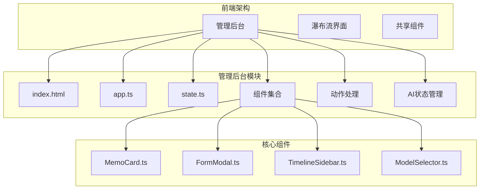
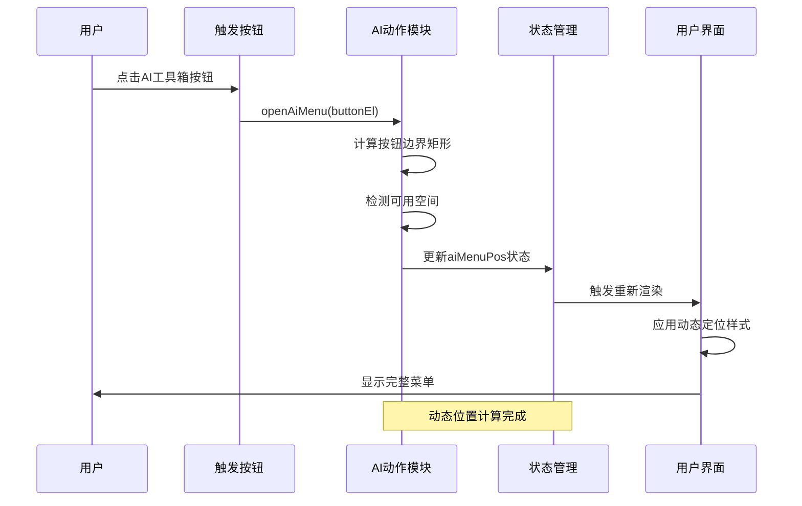
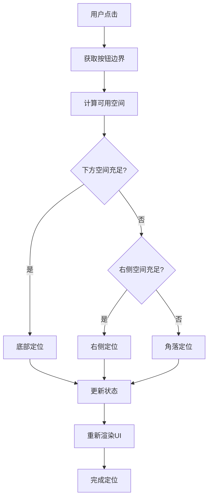
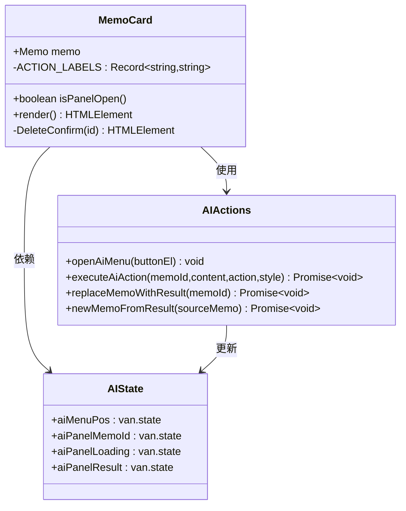
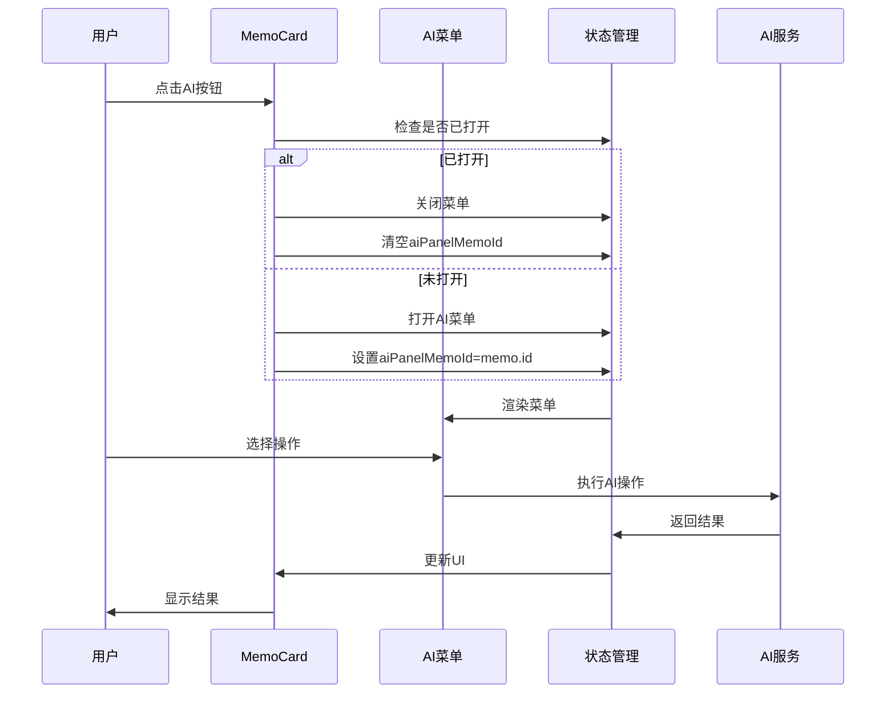
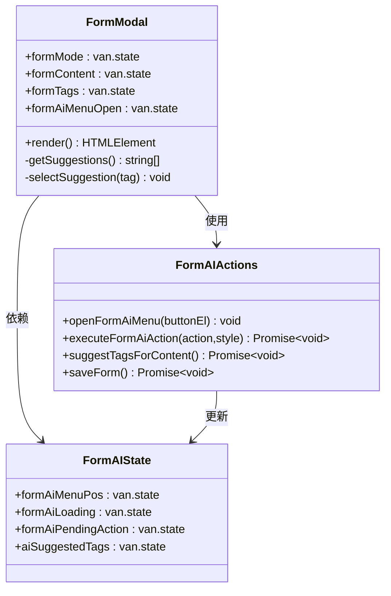
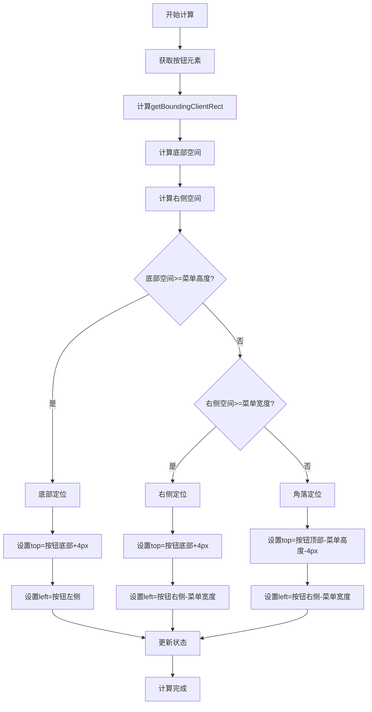
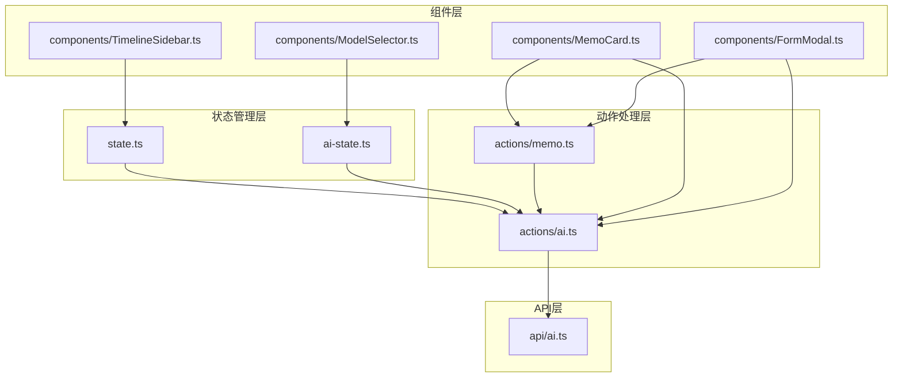

# AI菜单动态定位

<cite>
**本文档引用的文件**
- [README.md](file://README.md)
- [src/frontend/admin/index.html](file://src/frontend/admin/index.html)
- [src/frontend/admin/app.ts](file://src/frontend/admin/app.ts)
- [src/frontend/admin/state.ts](file://src/frontend/admin/state.ts)
- [src/frontend/admin/actions/ai.ts](file://src/frontend/admin/actions/ai.ts)
- [src/frontend/admin/components/MemoCard.ts](file://src/frontend/admin/components/MemoCard.ts)
- [src/frontend/admin/components/FormModal.ts](file://src/frontend/admin/components/FormModal.ts)
- [src/frontend/admin/components/TimelineSidebar.ts](file://src/frontend/admin/components/TimelineSidebar.ts)
- [src/frontend/admin/components/ModelSelector.ts](file://src/frontend/admin/components/ModelSelector.ts)
- [src/frontend/admin/ai-state.ts](file://src/frontend/admin/ai-state.ts)
- [src/api/ai.ts](file://src/api/ai.ts)
</cite>

## 目录
1. [简介](#简介)
2. [项目结构](#项目结构)
3. [核心组件](#核心组件)
4. [架构概览](#架构概览)
5. [详细组件分析](#详细组件分析)
6. [依赖关系分析](#依赖关系分析)
7. [性能考虑](#性能考虑)
8. [故障排除指南](#故障排除指南)
9. [结论](#结论)

## 简介

AI菜单动态定位是Memos项目中的一个重要UI优化功能，旨在解决AI工具箱菜单在不同屏幕位置和视口边界处可能出现的溢出问题。该功能通过智能检测按钮元素与视口边缘的空间可用性，动态计算菜单的最佳显示位置，确保用户在任何情况下都能完整地看到和使用AI工具箱的所有功能。

该项目是一个基于Bun运行时构建的轻量级备忘录应用系统，支持公开/私密备忘录管理、标签分类、全文搜索等功能。AI菜单动态定位功能主要集成在管理后台的备忘录管理和表单编辑界面中。

## 项目结构

Memos项目采用模块化的前端架构，主要分为以下几个核心部分：

**图表来源**
- [src/frontend/admin/index.html:1-800](file://src/frontend/admin/index.html#L1-L800)
- [src/frontend/admin/app.ts:1-295](file://src/frontend/admin/app.ts#L1-L295)

**章节来源**
- [README.md:25-45](file://README.md#L25-L45)
- [src/frontend/admin/index.html:1-800](file://src/frontend/admin/index.html#L1-L800)

## 核心组件

AI菜单动态定位功能涉及多个核心组件的协同工作：

### 状态管理组件

系统通过VanJS状态管理系统实现响应式UI更新，主要包括以下状态：

- **aiMenuPos**: 存储备忘录卡片AI菜单的位置信息
- **formAiMenuPos**: 存储表单AI菜单的位置信息  
- **aiPanelMemoId**: 标识当前激活的AI面板所属的备忘录
- **aiPanelLoading**: 控制AI操作加载状态
- **aiPanelResult**: 存储AI操作结果

### 位置计算算法

位置计算算法是整个功能的核心，通过以下步骤实现：

1. **获取按钮元素边界**: 使用`getBoundingClientRect()`获取触发按钮的精确位置
2. **计算可用空间**: 分别计算按钮下方和右侧的可用空间
3. **智能决策**: 根据可用空间选择最佳显示方向和对齐方式
4. **动态定位**: 将计算结果应用到菜单的CSS定位属性

**章节来源**
- [src/frontend/admin/state.ts:93-96](file://src/frontend/admin/state.ts#L93-L96)
- [src/frontend/admin/actions/ai.ts:176-209](file://src/frontend/admin/actions/ai.ts#L176-L209)

## 架构概览

AI菜单动态定位功能的架构设计体现了良好的分层原则和模块化思想：

**图表来源**
- [src/frontend/admin/actions/ai.ts:181-194](file://src/frontend/admin/actions/ai.ts#L181-L194)
- [src/frontend/admin/components/MemoCard.ts:174-186](file://src/frontend/admin/components/MemoCard.ts#L174-L186)

### 数据流图

**图表来源**
- [src/frontend/admin/actions/ai.ts:181-194](file://src/frontend/admin/actions/ai.ts#L181-L194)

## 详细组件分析

### MemoCard组件分析

MemoCard组件是AI菜单动态定位功能的主要应用场景之一，负责处理单个备忘录卡片的AI工具箱交互：

**图表来源**
- [src/frontend/admin/components/MemoCard.ts:64-362](file://src/frontend/admin/components/MemoCard.ts#L64-L362)
- [src/frontend/admin/actions/ai.ts:143-168](file://src/frontend/admin/actions/ai.ts#L143-L168)
- [src/frontend/admin/state.ts:76-96](file://src/frontend/admin/state.ts#L76-L96)

#### AI菜单交互流程

**图表来源**
- [src/frontend/admin/components/MemoCard.ts:156-222](file://src/frontend/admin/components/MemoCard.ts#L156-L222)
- [src/frontend/admin/actions/ai.ts:143-168](file://src/frontend/admin/actions/ai.ts#L143-L168)

**章节来源**
- [src/frontend/admin/components/MemoCard.ts:64-362](file://src/frontend/admin/components/MemoCard.ts#L64-L362)

### FormModal组件分析

FormModal组件提供了表单编辑界面中的AI工具箱功能，具有与MemoCard类似但更复杂的交互逻辑：

**图表来源**
- [src/frontend/admin/components/FormModal.ts:28-436](file://src/frontend/admin/components/FormModal.ts#L28-L436)
- [src/frontend/admin/actions/ai.ts:252-273](file://src/frontend/admin/actions/ai.ts#L252-L273)
- [src/frontend/admin/state.ts:87-96](file://src/frontend/admin/state.ts#L87-L96)

#### 表单AI菜单特殊处理

FormModal中的AI菜单具有以下特殊处理机制：

1. **延迟执行**: 支持先选择操作类型，再执行具体AI操作
2. **标签建议**: 自动根据内容生成标签建议
3. **样式选择**: 提供多种改写风格选项
4. **错误处理**: 完善的表单验证和错误提示

**章节来源**
- [src/frontend/admin/components/FormModal.ts:28-436](file://src/frontend/admin/components/FormModal.ts#L28-L436)

### 位置计算算法详解

AI菜单动态定位的核心算法通过精确的空间检测实现智能布局：

**图表来源**
- [src/frontend/admin/actions/ai.ts:181-194](file://src/frontend/admin/actions/ai.ts#L181-L194)

**章节来源**
- [src/frontend/admin/actions/ai.ts:176-209](file://src/frontend/admin/actions/ai.ts#L176-L209)

## 依赖关系分析

AI菜单动态定位功能的依赖关系体现了清晰的模块化设计：

**图表来源**
- [src/frontend/admin/state.ts:1-191](file://src/frontend/admin/state.ts#L1-L191)
- [src/frontend/admin/actions/ai.ts:1-274](file://src/frontend/admin/actions/ai.ts#L1-L274)
- [src/frontend/admin/components/MemoCard.ts:1-362](file://src/frontend/admin/components/MemoCard.ts#L1-L362)
- [src/frontend/admin/components/FormModal.ts:1-436](file://src/frontend/admin/components/FormModal.ts#L1-L436)
- [src/api/ai.ts:1-326](file://src/api/ai.ts#L1-L326)

### 组件间通信机制

系统通过以下机制实现组件间的松耦合通信：

1. **状态驱动**: 所有UI更新都通过状态变化触发
2. **事件冒泡**: 用户交互事件通过事件冒泡传递到相应处理器
3. **回调函数**: 组件间通过回调函数进行数据传递
4. **全局状态**: 共享状态通过全局状态对象管理

**章节来源**
- [src/frontend/admin/app.ts:258-295](file://src/frontend/admin/app.ts#L258-L295)
- [src/frontend/admin/state.ts:1-191](file://src/frontend/admin/state.ts#L1-L191)

## 性能考虑

AI菜单动态定位功能在设计时充分考虑了性能优化：

### 内存管理

- **状态清理**: 在菜单关闭时自动清理相关状态，防止内存泄漏
- **事件监听**: 使用事件委托减少事件监听器数量
- **DOM复用**: 通过VanJS的响应式系统避免不必要的DOM重建

### 计算优化

- **缓存策略**: 位置计算结果在组件生命周期内缓存
- **节流处理**: 避免频繁的窗口尺寸变化导致的重复计算
- **最小化重绘**: 仅在必要时触发布局计算

### 网络优化

- **AI调用优化**: 通过状态管理避免重复的AI请求
- **错误处理**: 完善的错误处理机制防止网络异常影响用户体验

## 故障排除指南

### 常见问题及解决方案

#### 菜单位置异常

**问题描述**: AI菜单出现在屏幕外或被遮挡

**可能原因**:
1. 视口尺寸变化未正确响应
2. 父容器定位属性影响
3. CSS样式冲突

**解决方案**:
1. 检查父容器的`position`属性
2. 确认`z-index`层级设置
3. 验证CSS盒模型计算

#### 菜单无法关闭

**问题描述**: 点击外部区域后菜单仍然保持打开状态

**可能原因**:
1. 事件冒泡处理不当
2. 状态更新逻辑错误
3. 事件监听器未正确移除

**解决方案**:
1. 检查`stopPropagation()`调用
2. 验证状态重置逻辑
3. 确认事件监听器生命周期

#### 性能问题

**问题描述**: 菜单切换时出现卡顿

**可能原因**:
1. 频繁的DOM查询
2. 大量的状态更新
3. 不必要的重渲染

**解决方案**:
1. 优化DOM查询频率
2. 批量更新状态
3. 减少不必要的响应式依赖

**章节来源**
- [src/frontend/admin/actions/ai.ts:272-294](file://src/frontend/admin/actions/ai.ts#L272-L294)
- [src/frontend/admin/components/MemoCard.ts:174-186](file://src/frontend/admin/components/MemoCard.ts#L174-L186)

## 结论

AI菜单动态定位功能通过智能的空间检测和动态定位算法，有效解决了传统静态定位方案在复杂界面布局中的局限性。该功能的设计体现了以下优势：

1. **用户体验优化**: 确保AI工具箱在任何情况下都能完整显示
2. **技术实现优雅**: 通过精确的几何计算实现智能布局
3. **架构设计合理**: 清晰的分层和模块化设计便于维护和扩展
4. **性能考虑周全**: 从内存管理到计算优化都有完善的考虑

该功能的成功实施为类似UI组件的开发提供了有价值的参考，展示了如何通过技术创新提升用户体验质量。未来可以在现有基础上进一步优化，如增加动画效果、支持触摸设备等，以适应更多样化的使用场景。