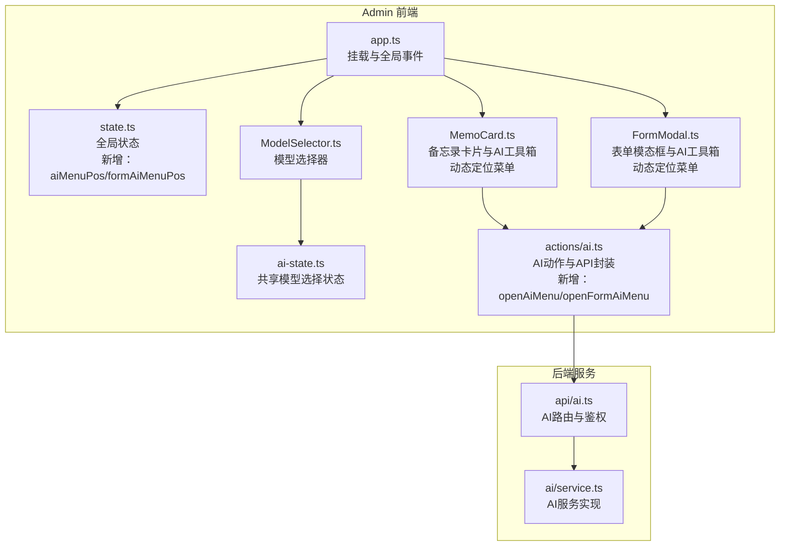
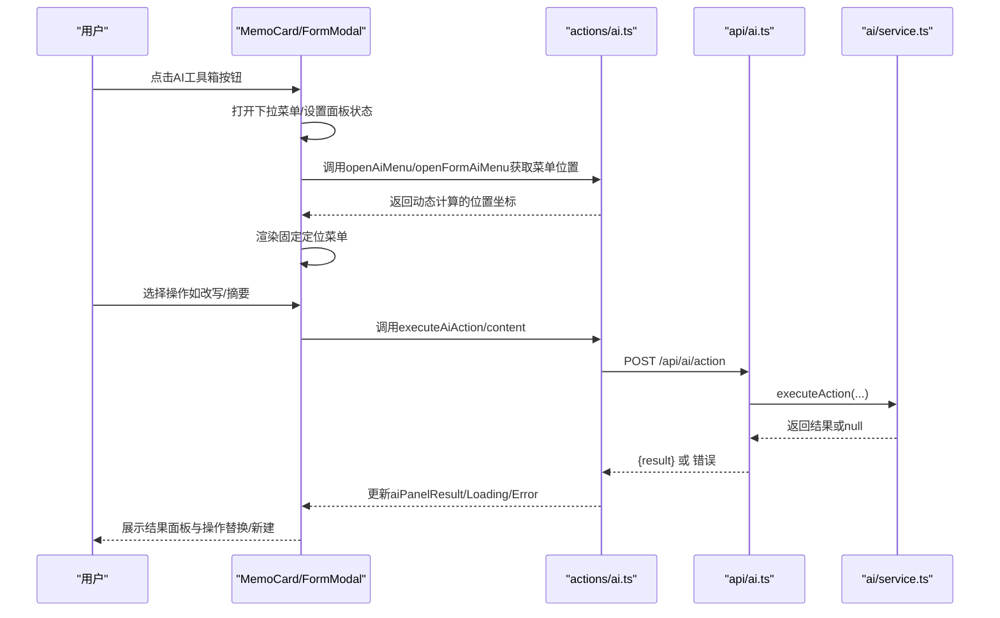
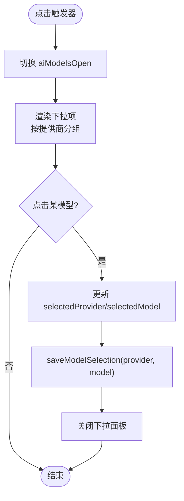
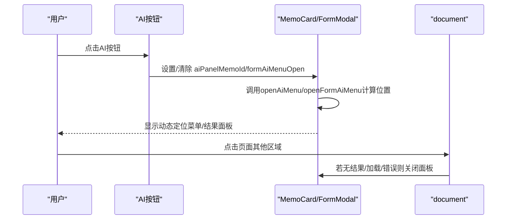
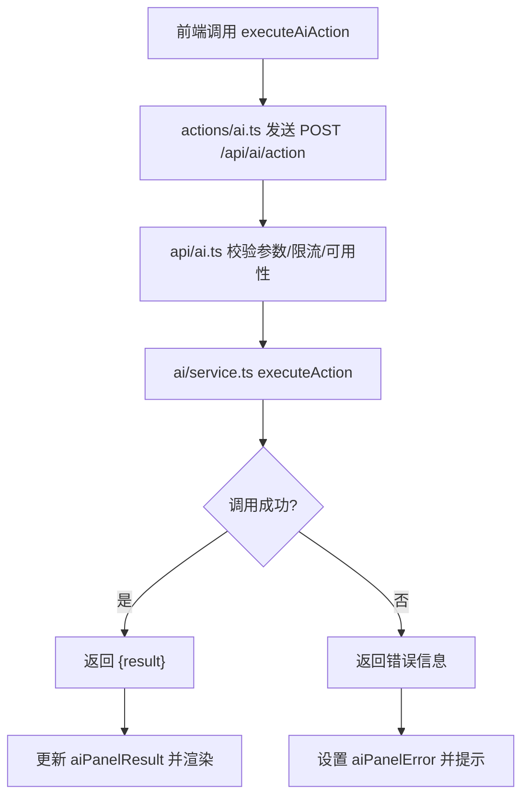
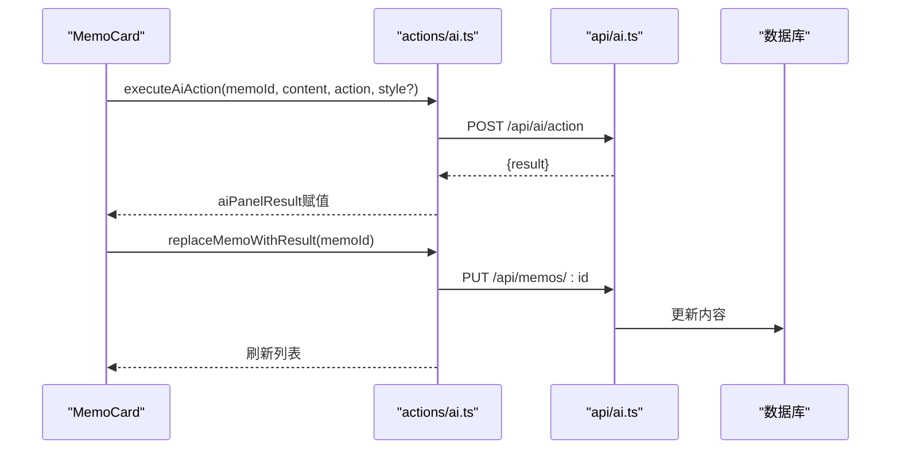
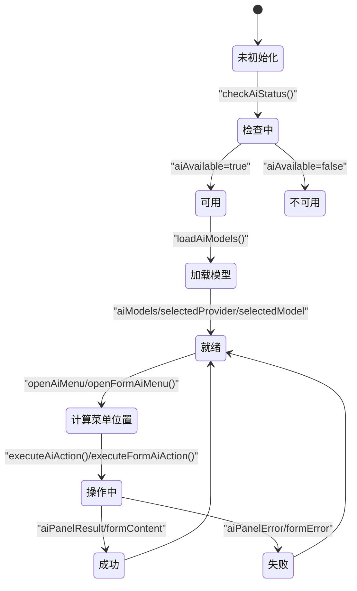
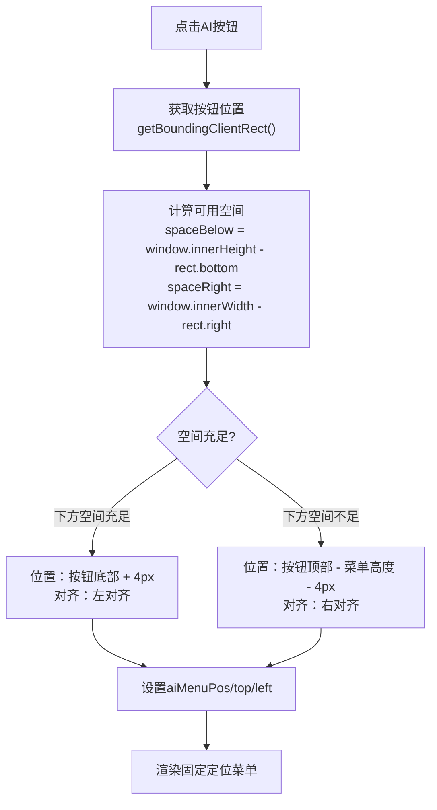
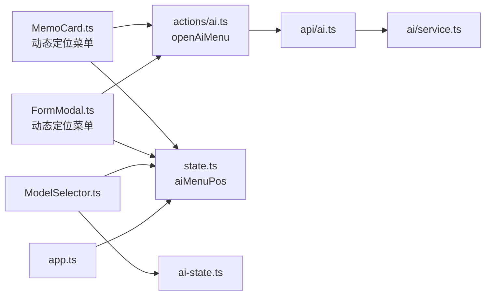

# AI工具箱集成

<cite>
**本文引用的文件**
- [ModelSelector.ts](file://src/frontend/admin/components/ModelSelector.ts)
- [ai.ts（前端动作）](file://src/frontend/admin/actions/ai.ts)
- [ai-state.ts](file://src/frontend/admin/ai-state.ts)
- [state.ts](file://src/frontend/admin/state.ts)
- [ai.ts（后端路由）](file://src/api/ai.ts)
- [service.ts（AI服务）](file://src/ai/service.ts)
- [app.ts](file://src/frontend/admin/app.ts)
- [MemoCard.ts](file://src/frontend/admin/components/MemoCard.ts)
- [FormModal.ts](file://src/frontend/admin/components/FormModal.ts)
- [2026-05-27-ux-optimization-design.md](file://docs/superpowers/specs/2026-05-27-ux-optimization-design.md)
- [README.md](file://README.md)
</cite>

## 更新摘要
**变更内容**
- 新增AI菜单动态定位功能，解决菜单被视口截断问题
- 更新状态管理，新增aiMenuPos和formAiMenuPos状态
- 改进MemoCard和FormModal组件的菜单定位逻辑
- 增强用户体验，确保菜单在页面任意位置正确显示

## 目录
1. [简介](#简介)
2. [项目结构](#项目结构)
3. [核心组件](#核心组件)
4. [架构总览](#架构总览)
5. [详细组件分析](#详细组件分析)
6. [AI菜单动态定位功能](#ai菜单动态定位功能)
7. [依赖关系分析](#依赖关系分析)
8. [性能考量](#性能考量)
9. [故障排查指南](#故障排查指南)
10. [结论](#结论)
11. [附录](#附录)

## 简介
本文件面向Admin界面中的"AI工具箱"集成，系统化阐述其在内容优化、创意写作与智能建议方面的价值与实现。重点覆盖以下方面：
- ModelSelector组件：AI模型选择、参数配置与切换逻辑
- 触发机制与交互设计：下拉面板显示/隐藏、点击外部关闭
- AI服务调用流程：请求发送、响应处理、错误处理
- 与备忘录编辑的集成：内容选择、模型选择、结果展示
- 状态管理：加载状态、结果缓存、错误状态
- **AI菜单动态定位功能**：解决菜单被视口截断问题，提升用户体验
- 最佳实践与性能优化建议

## 项目结构
Admin前端采用轻量响应式框架，通过状态驱动UI更新；AI工具箱位于Admin页面的备忘录卡片内，结合全局状态与后端AI服务完成内容改写、优化、摘要等操作。新增的AI菜单动态定位功能确保菜单在页面任意位置都能正确显示。

**图表来源**
- [app.ts:224-251](file://src/frontend/admin/app.ts#L224-L251)
- [state.ts:1-191](file://src/frontend/admin/state.ts#L1-L191)
- [ai.ts（前端动作）:1-274](file://src/frontend/admin/actions/ai.ts#L1-L274)
- [MemoCard.ts:1-362](file://src/frontend/admin/components/MemoCard.ts#L1-L362)
- [FormModal.ts:1-436](file://src/frontend/admin/components/FormModal.ts#L1-L436)

**章节来源**
- [app.ts:224-251](file://src/frontend/admin/app.ts#L224-L251)
- [state.ts:1-191](file://src/frontend/admin/state.ts#L1-L191)

## 核心组件
- ModelSelector：提供AI模型选择下拉面板，支持点击切换、键盘失焦关闭、本地持久化模型选择。
- MemoCard：在每个备忘录卡片右侧提供AI工具箱入口，支持多种操作（摘要、改写、扩写、提取要点、润色），并展示结果面板与替换/新建操作。**新增动态定位菜单功能**。
- FormModal：在表单模态框中提供AI工具箱入口，支持相同的操作集合并具备动态定位菜单功能。
- 全局状态：集中管理AI可用性、模型列表、面板状态（加载/结果/错误）、**新增AI菜单位置状态**（aiMenuPos/formAiMenuPos）。
- AI动作封装：负责调用后端API、处理请求/响应、错误回退与UI状态同步，**新增菜单定位工具函数**。
- 后端AI路由：统一鉴权、限流、参数校验、调用AI服务层并返回结果。

**章节来源**
- [ModelSelector.ts:1-65](file://src/frontend/admin/components/ModelSelector.ts#L1-L65)
- [MemoCard.ts:1-362](file://src/frontend/admin/components/MemoCard.ts#L1-L362)
- [FormModal.ts:1-436](file://src/frontend/admin/components/FormModal.ts#L1-L436)
- [state.ts:94-96](file://src/frontend/admin/state.ts#L94-L96)
- [ai.ts（前端动作）:176-209](file://src/frontend/admin/actions/ai.ts#L176-L209)
- [ai.ts（后端路由）:114-196](file://src/api/ai.ts#L114-L196)

## 架构总览
AI工具箱从前端到后端的调用链路如下：

**图表来源**
- [MemoCard.ts:162-163](file://src/frontend/admin/components/MemoCard.ts#L162-L163)
- [FormModal.ts:268-269](file://src/frontend/admin/components/FormModal.ts#L268-L269)
- [ai.ts（前端动作）:181-209](file://src/frontend/admin/actions/ai.ts#L181-L209)
- [ai.ts（前端动作）:141-166](file://src/frontend/admin/actions/ai.ts#L141-L166)

## 详细组件分析

### ModelSelector 组件实现
- 功能职责
  - 展示当前选中模型，支持点击展开/收起
  - 失焦时自动关闭下拉面板
  - 点击选项更新选中模型，并持久化到localStorage
- 关键交互
  - 点击触发器切换aiModelsOpen
  - 选项点击设置selectedProvider/selectedModel并调用保存函数
  - onblur判断焦点是否移出组件，决定是否关闭下拉
- 状态与存储
  - 使用共享状态selectedProvider/selectedModel
  - 本地持久化键值为固定字符串，恢复失败时回退默认

**图表来源**
- [ModelSelector.ts:9-65](file://src/frontend/admin/components/ModelSelector.ts#L9-L65)
- [ai.ts（前端动作）:33-57](file://src/frontend/admin/actions/ai.ts#L33-L57)
- [ai-state.ts:4-9](file://src/frontend/admin/ai-state.ts#L4-L9)

**章节来源**
- [ModelSelector.ts:1-65](file://src/frontend/admin/components/ModelSelector.ts#L1-L65)
- [ai.ts（前端动作）:33-57](file://src/frontend/admin/actions/ai.ts#L33-L57)
- [ai-state.ts:1-10](file://src/frontend/admin/ai-state.ts#L1-L10)

### AI工具箱触发机制与交互设计
- 触发入口
  - 备忘录卡片右上角AI按钮，点击切换aiPanelMemoId
  - 表单模态框中的AI按钮，点击切换formAiMenuOpen
- 下拉菜单
  - 展示多种操作（摘要、改写、扩写、提取要点、润色）
  - 改写操作支持风格选择（专业、口语、极简、学术）
- 结果面板
  - 加载态、错误态、结果态三态切换
  - 提供"替换原文"、"新建memo"、"丢弃"操作
- 点击外部关闭
  - 监听document点击，若面板打开且无结果/加载/错误，则关闭面板

**图表来源**
- [MemoCard.ts:162-163](file://src/frontend/admin/components/MemoCard.ts#L162-L163)
- [FormModal.ts:268-269](file://src/frontend/admin/components/FormModal.ts#L268-L269)
- [app.ts:237-250](file://src/frontend/admin/app.ts#L237-L250)

**章节来源**
- [MemoCard.ts:162-163](file://src/frontend/admin/components/MemoCard.ts#L162-L163)
- [FormModal.ts:268-269](file://src/frontend/admin/components/FormModal.ts#L268-L269)
- [app.ts:237-250](file://src/frontend/admin/app.ts#L237-L250)

### AI服务调用流程（请求/响应/错误）
- 前端动作
  - executeAiAction：设置面板状态，构造请求体（content/action/style），调用API，成功写入aiPanelResult，异常捕获并设置aiPanelError
  - replaceMemoWithResult/newMemoFromResult：基于aiPanelResult调用后端接口更新/创建备忘录
  - **新增**：executeFormAiAction：处理表单AI操作，直接更新表单内容
- 后端路由
  - /api/ai/action：校验内容、动作、风格、限流与可用性，调用服务层executeAction，返回结果或错误
- 服务层
  - resolveProvider解析提供商与密钥，chatCompletion发起OpenAI兼容请求，返回模型输出

**图表来源**
- [ai.ts（前端动作）:141-166](file://src/frontend/admin/actions/ai.ts#L141-L166)
- [ai.ts（前端动作）:252-273](file://src/frontend/admin/actions/ai.ts#L252-L273)
- [ai.ts（后端路由）:127-196](file://src/api/ai.ts#L127-L196)
- [service.ts（AI服务）:313-347](file://src/ai/service.ts#L313-L347)

**章节来源**
- [ai.ts（前端动作）:141-166](file://src/frontend/admin/actions/ai.ts#L141-L166)
- [ai.ts（前端动作）:252-273](file://src/frontend/admin/actions/ai.ts#L252-L273)
- [ai.ts（后端路由）:127-196](file://src/api/ai.ts#L127-L196)
- [service.ts（AI服务）:313-347](file://src/ai/service.ts#L313-L347)

### 与备忘录编辑的集成
- 内容选择
  - 从当前Memo对象读取content作为AI输入
- 模型选择
  - 使用全局selectedProvider/selectedModel，ModelSelector负责维护
- 结果展示
  - 执行完成后在同一卡片内展示结果面板，支持Markdown渲染
- 操作落地
  - 替换原文：PUT对应Memo
  - 新建memo：POST创建新Memo，携带来源标记标签

**图表来源**
- [MemoCard.ts:189-246](file://src/frontend/admin/components/MemoCard.ts#L189-L246)
- [MemoCard.ts:316-339](file://src/frontend/admin/components/MemoCard.ts#L316-L339)
- [ai.ts（前端动作）:174-187](file://src/frontend/admin/actions/ai.ts#L174-L187)
- [ai.ts（后端路由）:127-196](file://src/api/ai.ts#L127-L196)

**章节来源**
- [MemoCard.ts:189-246](file://src/frontend/admin/components/MemoCard.ts#L189-L246)
- [MemoCard.ts:316-339](file://src/frontend/admin/components/MemoCard.ts#L316-L339)
- [ai.ts（前端动作）:174-187](file://src/frontend/admin/actions/ai.ts#L174-L187)

### 状态管理（加载/结果/错误）
- 全局状态
  - aiAvailable：AI可用性检测
  - aiModels/aiModelsOpen：模型列表与下拉开关
  - aiPanelMemoId/aiPanelLoading/aiPanelResult/aiPanelError/aiPanelAction：卡片面板状态
  - formAiMenuOpen/formAiLoading/formContent/formError：表单AI状态
  - **新增**：aiMenuPos/formAiMenuPos：AI菜单位置状态，包含top、left坐标
- 生命周期
  - 初始化：检查AI状态、加载模型列表并尝试恢复上次选择
  - 运行期：根据用户操作更新面板状态，渲染不同UI态
  - 清理：关闭面板时清空结果与错误

**图表来源**
- [ai.ts（前端动作）:61-103](file://src/frontend/admin/actions/ai.ts#L61-L103)
- [state.ts:61-84](file://src/frontend/admin/state.ts#L61-L84)
- [state.ts:94-96](file://src/frontend/admin/state.ts#L94-L96)

**章节来源**
- [ai.ts（前端动作）:61-103](file://src/frontend/admin/actions/ai.ts#L61-L103)
- [state.ts:61-84](file://src/frontend/admin/state.ts#L61-L84)
- [state.ts:94-96](file://src/frontend/admin/state.ts#L94-L96)

## AI菜单动态定位功能

### 功能概述
AI菜单动态定位功能解决了传统静态CSS定位导致的菜单被视口截断问题。该功能通过JavaScript动态计算菜单的最佳显示位置，确保菜单在页面任意位置都能完整显示。

### 技术实现
- **状态管理**：新增aiMenuPos和formAiMenuPos状态，分别管理备忘录卡片和表单模态框的AI菜单位置
- **定位算法**：通过getBoundingClientRect()获取按钮位置，计算上方/下方和左对齐/右对齐的空间
- **动态渲染**：菜单使用position: fixed + 动态top/left属性，脱离父容器overflow限制

### 关键特性
- **自适应布局**：根据按钮位置自动选择最佳显示方向
- **空间感知**：检测视口剩余空间，避免菜单被截断
- **统一接口**：MemoCard和FormModal共享相同的定位逻辑
- **性能优化**：仅在菜单打开时计算位置，避免不必要的重排

**图表来源**
- [ai.ts（前端动作）:181-194](file://src/frontend/admin/actions/ai.ts#L181-L194)
- [ai.ts（前端动作）:196-209](file://src/frontend/admin/actions/ai.ts#L196-L209)
- [MemoCard.ts:178-185](file://src/frontend/admin/components/MemoCard.ts#L178-L185)
- [FormModal.ts:281-288](file://src/frontend/admin/components/FormModal.ts#L281-L288)

**章节来源**
- [ai.ts（前端动作）:176-209](file://src/frontend/admin/actions/ai.ts#L176-L209)
- [state.ts:94-96](file://src/frontend/admin/state.ts#L94-L96)
- [MemoCard.ts:178-185](file://src/frontend/admin/components/MemoCard.ts#L178-L185)
- [FormModal.ts:281-288](file://src/frontend/admin/components/FormModal.ts#L281-L288)

## 依赖关系分析
- 组件耦合
  - MemoCard依赖actions/ai.ts与state.ts，负责UI与业务逻辑桥接，**新增动态定位功能**
  - FormModal依赖actions/ai.ts与state.ts，负责表单AI工具箱与动态定位
  - ModelSelector依赖ai-state.ts与state.ts，负责模型选择与持久化
  - app.ts监听全局点击事件，统一处理面板关闭
- 外部依赖
  - 后端API提供统一鉴权与限流
  - AI服务层抽象多提供商调用，屏蔽差异

**图表来源**
- [MemoCard.ts:1-362](file://src/frontend/admin/components/MemoCard.ts#L1-L362)
- [FormModal.ts:1-436](file://src/frontend/admin/components/FormModal.ts#L1-L436)
- [ModelSelector.ts:1-65](file://src/frontend/admin/components/ModelSelector.ts#L1-L65)
- [app.ts:224-251](file://src/frontend/admin/app.ts#L224-L251)
- [ai.ts（前端动作）:1-274](file://src/frontend/admin/actions/ai.ts#L1-L274)
- [ai.ts（后端路由）:1-326](file://src/api/ai.ts#L1-L326)
- [service.ts（AI服务）:1-507](file://src/ai/service.ts#L1-L507)

**章节来源**
- [MemoCard.ts:1-362](file://src/frontend/admin/components/MemoCard.ts#L1-L362)
- [FormModal.ts:1-436](file://src/frontend/admin/components/FormModal.ts#L1-L436)
- [ModelSelector.ts:1-65](file://src/frontend/admin/components/ModelSelector.ts#L1-L65)
- [app.ts:224-251](file://src/frontend/admin/app.ts#L224-L251)
- [ai.ts（前端动作）:1-274](file://src/frontend/admin/actions/ai.ts#L1-L274)
- [ai.ts（后端路由）:1-326](file://src/api/ai.ts#L1-L326)
- [service.ts（AI服务）:1-507](file://src/ai/service.ts#L1-L507)

## 性能考量
- 请求去抖与中断
  - 标签建议支持AbortController，避免并发请求导致资源浪费
- 限流与降级
  - 后端对AI接口进行限流，失败时返回明确错误
  - AI不可用时前端禁用相关入口，减少无效请求
- 渲染优化
  - 使用轻量状态库，仅在必要时重绘
  - Markdown渲染按需执行，避免重复计算
  - **新增**：菜单位置计算仅在菜单打开时执行
- 缓存策略
  - 模型选择持久化到localStorage，减少每次初始化开销
  - 结果面板在操作期间缓存最新结果，避免重复请求
  - **新增**：菜单位置状态在菜单关闭时清空，避免内存泄漏

**章节来源**
- [ai.ts（前端动作）:107-137](file://src/frontend/admin/actions/ai.ts#L107-L137)
- [ai.ts（后端路由）:54-58](file://src/api/ai.ts#L54-L58)
- [ModelSelector.ts:33-39](file://src/frontend/admin/components/ModelSelector.ts#L33-L39)
- [ai.ts（前端动作）:193](file://src/frontend/admin/actions/ai.ts#L193)

## 故障排查指南
- 无法看到AI工具箱
  - 检查AI可用性状态与模型列表是否加载成功
  - 确认后端AI服务可用性与鉴权配置
- 操作无响应或报错
  - 查看面板错误状态，确认网络与后端限流情况
  - 检查模型选择是否有效，确保提供商API Key已配置
- 结果为空或格式异常
  - 确认输入内容非空，动作参数合法
  - 检查服务层返回内容是否符合预期格式
- **菜单显示异常**
  - **新增**：检查浏览器控制台是否有getBoundingClientRect相关错误
  - **新增**：确认父容器overflow属性未影响固定定位元素
  - **新增**：验证aiMenuPos状态是否正确更新

**章节来源**
- [ai.ts（前端动作）:61-68](file://src/frontend/admin/actions/ai.ts#L61-L68)
- [ai.ts（后端路由）:24-26](file://src/api/ai.ts#L24-L26)
- [service.ts（AI服务）:98-115](file://src/ai/service.ts#L98-L115)
- [ai.ts（前端动作）:181-194](file://src/frontend/admin/actions/ai.ts#L181-L194)

## 结论
AI工具箱通过清晰的组件边界与状态管理，在Admin界面中实现了"即点即用"的内容优化与改写能力。ModelSelector提供便捷的模型选择与持久化；MemoCard和FormModal承载操作入口与结果展示，**新增的动态定位功能确保菜单在页面任意位置都能正确显示**；前后端协作保证了安全性与稳定性。配合限流、中断与缓存等优化手段，可在保证体验的同时降低资源消耗。

## 附录
- 相关提示词与系统提示位于data目录，用于指导AI行为与风格
- 项目README提供了整体背景与使用说明
- **AI菜单动态定位功能设计文档位于docs/superpowers/specs/2026-05-27-ux-optimization-design.md**

**章节来源**
- [README.md](file://README.md)
- [data/system-prompts/optimize.txt](file://data/system-prompts/optimize.txt)
- [data/system-prompts/rewrite.txt](file://data/system-prompts/rewrite.txt)
- [data/system-prompts/polish.txt](file://data/system-prompts/polish.txt)
- [data/system-prompts/summarize.txt](file://data/system-prompts/summarize.txt)
- [2026-05-27-ux-optimization-design.md:103-149](file://docs/superpowers/specs/2026-05-27-ux-optimization-design.md#L103-L149)