# Admin管理界面

<cite>
**本文档引用的文件**
- [src/frontend/admin/index.html](file://src/frontend/admin/index.html)
- [src/frontend/admin/app.ts](file://src/frontend/admin/app.ts)
- [src/frontend/admin/state.ts](file://src/frontend/admin/state.ts)
- [src/frontend/admin/ai-state.ts](file://src/frontend/admin/ai-state.ts)
- [src/frontend/admin/creative.ts](file://src/frontend/admin/creative.ts)
- [src/frontend/admin/components/FormModal.ts](file://src/frontend/admin/components/FormModal.ts)
- [src/frontend/admin/components/MemoCard.ts](file://src/frontend/admin/components/MemoCard.ts)
- [src/frontend/admin/components/TimelineSidebar.ts](file://src/frontend/admin/components/TimelineSidebar.ts)
- [src/frontend/admin/components/ModelSelector.ts](file://src/frontend/admin/components/ModelSelector.ts)
- [src/frontend/admin/components/ImportExportModal.ts](file://src/frontend/admin/components/ImportExportModal.ts)
- [src/frontend/admin/components/GenerateBar.ts](file://src/frontend/admin/components/GenerateBar.ts)
- [src/frontend/admin/components/PromptDrawer.ts](file://src/frontend/admin/components/PromptDrawer.ts)
- [src/frontend/admin/actions/memo.ts](file://src/frontend/admin/actions/memo.ts)
- [src/frontend/admin/actions/auth.ts](file://src/frontend/admin/actions/auth.ts)
- [src/frontend/admin/actions/ai.ts](file://src/frontend/admin/actions/ai.ts)
- [src/frontend/admin/actions/creative-core.ts](file://src/frontend/admin/actions/creative-core.ts)
- [src/frontend/shared/styles/common.css](file://src/frontend/shared/styles/common.css)
</cite>

## 更新摘要
**变更内容**
- 移除ChatPanel聊天面板组件和GenerateModal生成模态框组件
- 移除相关的聊天功能和多模态生成系统
- 简化组件架构，专注于备忘录管理和创意内容生成
- 保留AI工具箱、标签系统、时间线侧边栏等核心功能

## 目录
1. [简介](#简介)
2. [项目结构](#项目结构)
3. [核心组件](#核心组件)
4. [架构总览](#架构总览)
5. [详细组件分析](#详细组件分析)
6. [依赖关系分析](#依赖关系分析)
7. [性能考虑](#性能考虑)
8. [故障排查指南](#故障排查指南)
9. [结论](#结论)
10. [附录](#附录)

## 简介
本文件面向Admin管理界面，系统性阐述VanJS框架在Admin中的应用，包括响应式状态管理、组件化开发与事件处理机制。文档覆盖登录页面、主管理页面、备忘录管理、标签系统、公开/私密状态切换、AI工具箱集成、时间线侧边栏、以及表单模态框、导入导出模态框等交互组件。同时提供状态管理最佳实践与性能优化建议。

**更新** 移除了ChatPanel聊天面板组件和GenerateModal生成模态框组件，简化了组件架构，专注于核心的备忘录管理和创意内容生成功能。

## 项目结构
Admin前端采用VanJS进行声明式UI构建，核心目录如下：
- 入口与布局：index.html定义样式与容器；app.ts负责挂载与路由渲染
- 状态层：state.ts集中管理全局状态；ai-state.ts共享AI模型选择
- 组件层：各功能页面与交互组件拆分为独立模块
- 动作层：actions/*封装业务逻辑与API调用
- 创意模块：creative.ts与actions/creative-core.ts实现提示词与创意内容管理

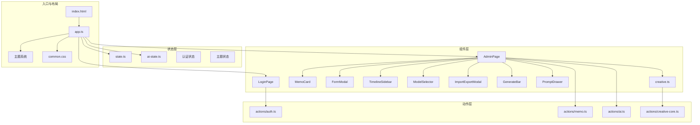

**图表来源**
- [src/frontend/admin/index.html](file://src/frontend/admin/index.html)
- [src/frontend/admin/app.ts](file://src/frontend/admin/app.ts)
- [src/frontend/admin/state.ts](file://src/frontend/admin/state.ts)
- [src/frontend/admin/ai-state.ts](file://src/frontend/admin/ai-state.ts)
- [src/frontend/admin/creative.ts](file://src/frontend/admin/creative.ts)
- [src/frontend/shared/styles/common.css](file://src/frontend/shared/styles/common.css)

**章节来源**
- [src/frontend/admin/index.html](file://src/frontend/admin/index.html)
- [src/frontend/admin/app.ts](file://src/frontend/admin/app.ts)

## 核心组件
- 登录页面：基于密码密钥认证，调用认证动作完成登录与登出
- 主管理页面：顶部工具栏、标签页切换、时间线侧边栏、内容区与模态框
- 备忘录卡片：展示内容、标签、公开/私密徽章、置顶、编辑、删除、AI工具箱
- 表单模态框：新建/编辑备忘录，标签输入与AI建议，公开状态勾选
- 时间线侧边栏：按年月组织备忘录，支持展开/折叠与跳转
- 导入/导出模态框：支持拖拽/文件选择导入与一键导出
- AI工具箱：模型选择器、内容优化、创意写作（提示词+上下文）
- 创意内容：提示词管理、生成流式输出、对话/列表视图
- **GenerateBar组件**：重构后的生成栏，支持提示词选择、标签过滤和流式生成
- **PromptDrawer组件**：提示词管理抽屉，支持新建、编辑、删除提示词
- **主题切换系统**：支持明暗主题自动检测与手动切换，持久化用户偏好
- **AI菜单动态定位**：智能计算菜单位置，避免超出屏幕边界

**章节来源**
- [src/frontend/admin/app.ts](file://src/frontend/admin/app.ts)
- [src/frontend/admin/state.ts](file://src/frontend/admin/state.ts)
- [src/frontend/admin/ai-state.ts](file://src/frontend/admin/ai-state.ts)
- [src/frontend/admin/creative.ts](file://src/frontend/admin/creative.ts)

## 架构总览
Admin采用"状态驱动的组件化"架构：
- 响应式状态：VanJS的van.state统一管理UI状态与数据
- 组件渲染：函数式组件通过状态订阅自动重渲染
- 事件处理：组件内绑定事件回调，调用动作层API
- 数据流：动作层通过API访问后端，更新状态，驱动UI

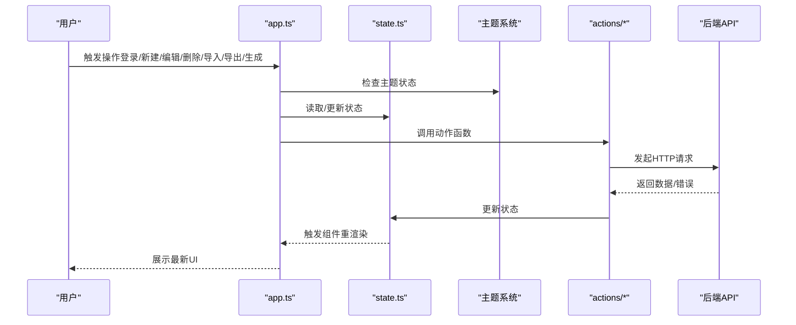

**图表来源**
- [src/frontend/admin/app.ts](file://src/frontend/admin/app.ts)
- [src/frontend/admin/state.ts](file://src/frontend/admin/state.ts)
- [src/frontend/admin/actions/auth.ts](file://src/frontend/admin/actions/auth.ts)
- [src/frontend/admin/actions/memo.ts](file://src/frontend/admin/actions/memo.ts)
- [src/frontend/admin/actions/ai.ts](file://src/frontend/admin/actions/ai.ts)
- [src/frontend/admin/actions/creative-core.ts](file://src/frontend/admin/actions/creative-core.ts)

## 详细组件分析

### 登录页面与认证流程
- 登录页由LoginPage组件渲染，输入密钥后触发登录动作
- 认证检查与登录成功后加载备忘录列表与AI状态
- 登出时清空状态并返回登录页

```mermaid
sequenceDiagram
participant U as "用户"
participant LP as "LoginPage"
participant AUTH as "actions/auth.ts"
participant ST as "state.ts"
participant API as "后端API"
U->>LP : 输入密钥并点击登录
LP->>AUTH : login(key)
AUTH->>API : POST /api/auth/login
API-->>AUTH : {authenticated}
AUTH->>ST : 设置authenticated=true
AUTH->>AUTH : loadMemos()
AUTH->>API : GET /api/memos?all=true
API-->>AUTH : {memos}
AUTH->>ST : 更新memos
AUTH->>AUTH : checkAiStatus()/loadAiModels()
-->>U : 进入AdminPage
```

**图表来源**
- [src/frontend/admin/app.ts](file://src/frontend/admin/app.ts)
- [src/frontend/admin/actions/auth.ts](file://src/frontend/admin/actions/auth.ts)
- [src/frontend/admin/actions/memo.ts](file://src/frontend/admin/actions/memo.ts)
- [src/frontend/admin/actions/ai.ts](file://src/frontend/admin/actions/ai.ts)

**章节来源**
- [src/frontend/admin/app.ts](file://src/frontend/admin/app.ts)
- [src/frontend/admin/actions/auth.ts](file://src/frontend/admin/actions/auth.ts)

### 主管理页面与时间线侧边栏
- AdminPage根据认证状态切换登录页或管理页
- 顶部工具栏包含模型选择器、新建按钮、导入导出、查看网站、退出登录、主题切换
- 根据当前标签页显示时间线侧边栏（备忘录或创意内容）
- 内容区根据activeTab切换"Memo"或"Creative"

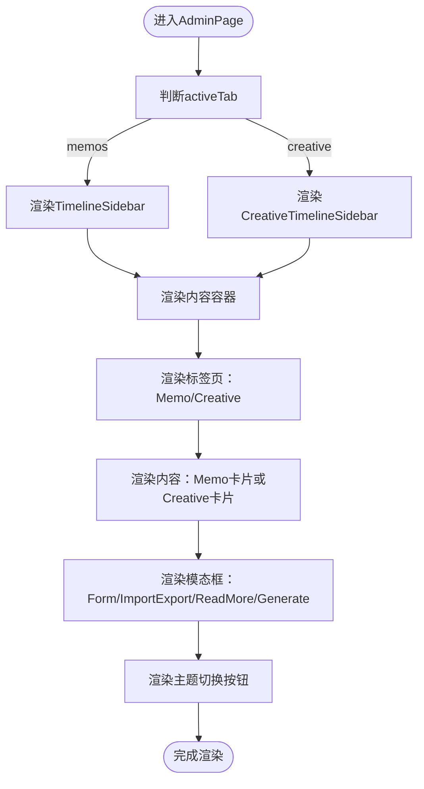

**图表来源**
- [src/frontend/admin/app.ts](file://src/frontend/admin/app.ts)
- [src/frontend/admin/components/TimelineSidebar.ts](file://src/frontend/admin/components/TimelineSidebar.ts)
- [src/frontend/admin/creative.ts](file://src/frontend/admin/creative.ts)

**章节来源**
- [src/frontend/admin/app.ts](file://src/frontend/admin/app.ts)
- [src/frontend/admin/components/TimelineSidebar.ts](file://src/frontend/admin/components/TimelineSidebar.ts)

### 备忘录管理（创建、编辑、删除、置顶）
- 新建/编辑：打开FormModal，输入内容、标签、公开状态，提交后刷新列表
- 删除：点击删除按钮弹出确认，确认后调用删除动作
- 置顶：点击置顶按钮切换pinned状态
- 公开/私密：点击切换is_public状态

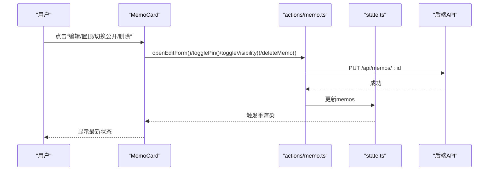

**图表来源**
- [src/frontend/admin/components/MemoCard.ts](file://src/frontend/admin/components/MemoCard.ts)
- [src/frontend/admin/actions/memo.ts](file://src/frontend/admin/actions/memo.ts)

**章节来源**
- [src/frontend/admin/components/MemoCard.ts](file://src/frontend/admin/components/MemoCard.ts)
- [src/frontend/admin/actions/memo.ts](file://src/frontend/admin/actions/memo.ts)

### 标签系统与AI建议
- 表单中可输入标签并回车添加，支持从AI建议中一键添加
- AI建议通过suggestTagsForContent接口获取，支持防抖与中断
- 标签用于筛选与展示，支持在创意内容中按标签生成


**图表来源**
- [src/frontend/admin/components/FormModal.ts](file://src/frontend/admin/components/FormModal.ts)
- [src/frontend/admin/actions/ai.ts](file://src/frontend/admin/actions/ai.ts)

**章节来源**
- [src/frontend/admin/components/FormModal.ts](file://src/frontend/admin/components/FormModal.ts)
- [src/frontend/admin/actions/ai.ts](file://src/frontend/admin/actions/ai.ts)

### 公开/私密状态切换
- 通过MemoCard中的图标按钮切换is_public
- 调用PUT /api/memos/:id更新状态并刷新列表

**章节来源**
- [src/frontend/admin/components/MemoCard.ts](file://src/frontend/admin/components/MemoCard.ts)
- [src/frontend/admin/actions/memo.ts](file://src/frontend/admin/actions/memo.ts)

### AI工具箱集成
- 模型选择器：ModelSelector展示provider与model，持久化到localStorage
- 卡片级AI工具箱：对单条Memo执行优化、改写、扩写、要点提炼、润色等动作
- 表单级AI工具箱：对输入内容执行相同动作，直接替换表单内容
- 结果面板：支持替换原文或新建Memo，支持关闭

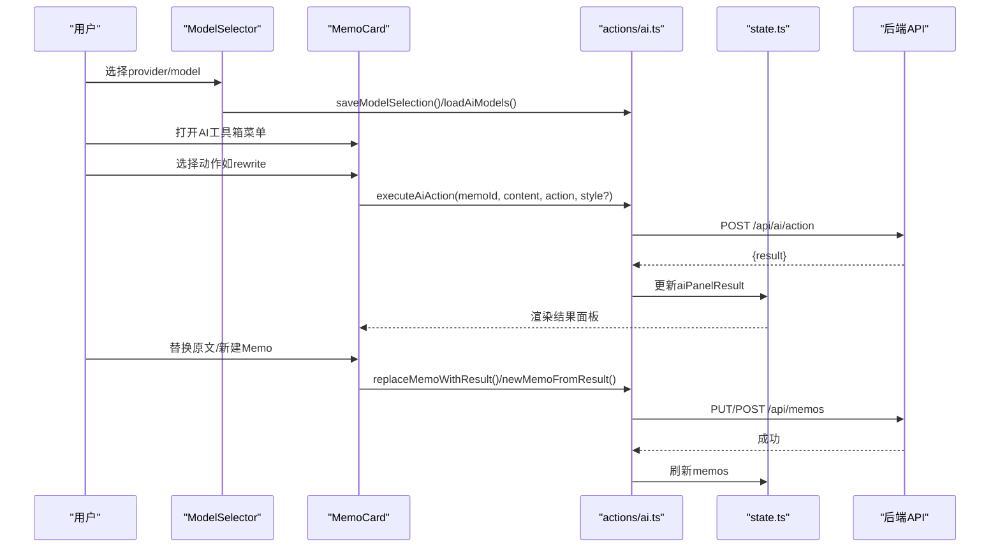

**图表来源**
- [src/frontend/admin/components/ModelSelector.ts](file://src/frontend/admin/components/ModelSelector.ts)
- [src/frontend/admin/components/MemoCard.ts](file://src/frontend/admin/components/MemoCard.ts)
- [src/frontend/admin/actions/ai.ts](file://src/frontend/admin/actions/ai.ts)

**章节来源**
- [src/frontend/admin/components/ModelSelector.ts](file://src/frontend/admin/components/ModelSelector.ts)
- [src/frontend/admin/components/MemoCard.ts](file://src/frontend/admin/components/MemoCard.ts)
- [src/frontend/admin/actions/ai.ts](file://src/frontend/admin/actions/ai.ts)

### 时间线侧边栏设计与实现
- TimelineSidebar按年月聚合备忘录，支持展开/折叠年份
- 点击月份滚动到对应第一条备忘录
- 支持备忘录与创意内容两套时间线组件

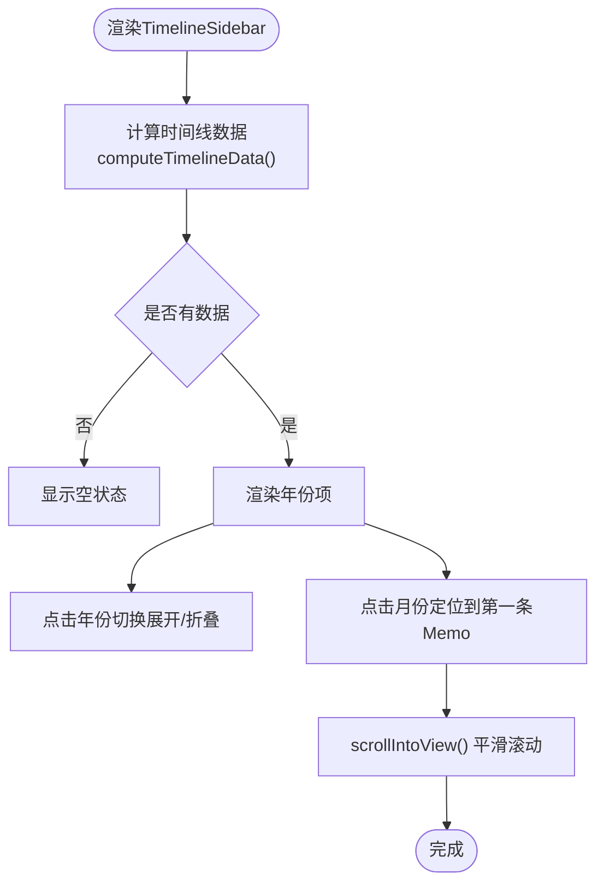

**图表来源**
- [src/frontend/admin/components/TimelineSidebar.ts](file://src/frontend/admin/components/TimelineSidebar.ts)

**章节来源**
- [src/frontend/admin/components/TimelineSidebar.ts](file://src/frontend/admin/components/TimelineSidebar.ts)

### 表单模态框与导入导出模态框
- FormModal：支持内容编辑、标签增删、AI建议、公开状态、保存与取消
- ImportExportModal：支持导出全部数据与导入（拖拽/文件选择），显示结果或错误

```mermaid
sequenceDiagram
participant U as "用户"
participant FM as "FormModal"
participant ACT as "actions/memo.ts"
participant API as "后端API"
U->>FM : 输入内容/标签/勾选公开
U->>FM : 点击"保存"
FM->>ACT : saveForm()
ACT->>API : POST/PUT /api/memos
API-->>ACT : 成功
ACT->>ACT : loadMemos()
-->>U : 关闭模态框并刷新列表
```

**图表来源**
- [src/frontend/admin/components/FormModal.ts](file://src/frontend/admin/components/FormModal.ts)
- [src/frontend/admin/actions/memo.ts](file://src/frontend/admin/actions/memo.ts)

**章节来源**
- [src/frontend/admin/components/FormModal.ts](file://src/frontend/admin/components/FormModal.ts)
- [src/frontend/admin/components/ImportExportModal.ts](file://src/frontend/admin/components/ImportExportModal.ts)
- [src/frontend/admin/actions/memo.ts](file://src/frontend/admin/actions/memo.ts)

### 创意写作功能（提示词、上下文、流式生成）
- 提示词管理：新增、编辑、删除、选择
- 上下文模式：自动匹配、手动ID、按标签三种
- 流式生成：SSE接收增量内容，支持预览上下文、错误处理与取消

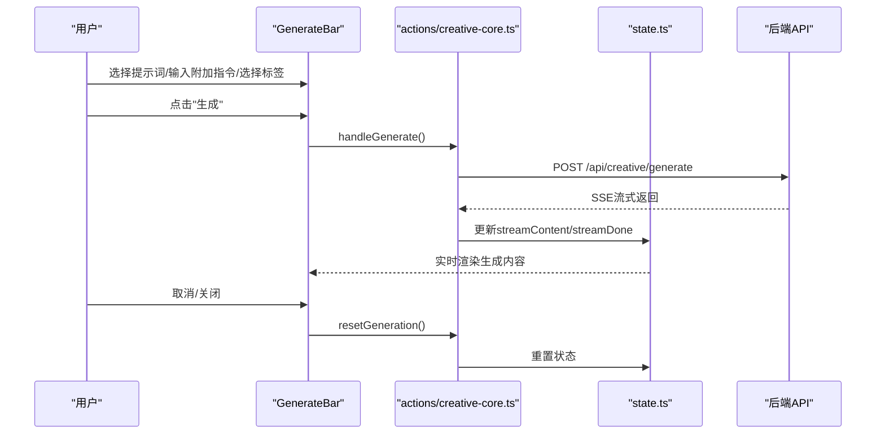

**图表来源**
- [src/frontend/admin/components/GenerateBar.ts](file://src/frontend/admin/components/GenerateBar.ts)
- [src/frontend/admin/actions/creative-core.ts](file://src/frontend/admin/actions/creative-core.ts)

**章节来源**
- [src/frontend/admin/creative.ts](file://src/frontend/admin/creative.ts)
- [src/frontend/admin/components/GenerateBar.ts](file://src/frontend/admin/components/GenerateBar.ts)
- [src/frontend/admin/actions/creative-core.ts](file://src/frontend/admin/actions/creative-core.ts)

### GenerateBar组件重构与功能增强
**更新** GenerateBar组件已完成重构，从复杂的生成模态框简化为简洁的生成栏，显著提升了用户体验和交互效率。

GenerateBar采用全新的三段式布局架构：

#### 1. 提示词选择区域（Prompt Selector）
- **提示词列表**：动态显示可用提示词，支持点击选择
- **视觉反馈**：当前选中提示词显示高亮状态
- **禁用状态**：生成过程中禁用所有提示词按钮

#### 2. 标签过滤区域（Tag Filter）
- **标签网格**：按行排列显示所有可用标签
- **选择逻辑**：支持单选标签，点击切换选中状态
- **空状态**：无标签时显示友好的提示信息

#### 3. 生成控制区域（Generate Control）
- **输入区域**：文本域支持附加指令输入
- **生成按钮**：条件启用，支持生成状态动画
- **加载指示**：生成过程显示进度动画
- **错误处理**：显示生成错误信息

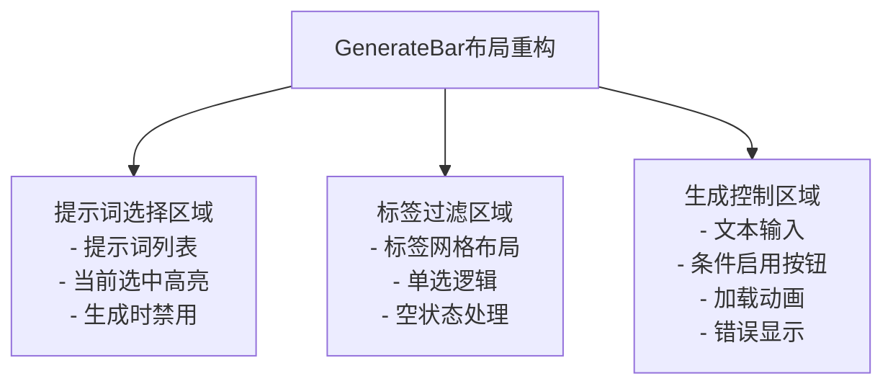

**图表来源**
- [src/frontend/admin/components/GenerateBar.ts:119-244](file://src/frontend/admin/components/GenerateBar.ts#L119-L244)

**章节来源**
- [src/frontend/admin/components/GenerateBar.ts:119-244](file://src/frontend/admin/components/GenerateBar.ts#L119-L244)

### PromptDrawer组件重构与功能增强
**更新** PromptDrawer组件已完成重构，从复杂的模态框简化为抽屉式管理界面，提升了提示词管理的便捷性。

PromptDrawer采用左右分栏布局：

#### 1. 提示词列表（左侧260px）
- **新建按钮**：固定在顶部，便于快速创建新提示词
- **列表滚动**：右侧滚动区域，支持大量提示词浏览
- **选择状态**：当前选中提示词显示特殊样式
- **空状态**：无提示词时显示引导信息

#### 2. 提示词编辑器（右侧弹性）
- **表单布局**：标题输入和内容编辑区域
- **操作按钮**：取消和保存按钮
- **删除功能**：编辑模式下显示删除按钮
- **保存状态**：保存过程中禁用表单控件

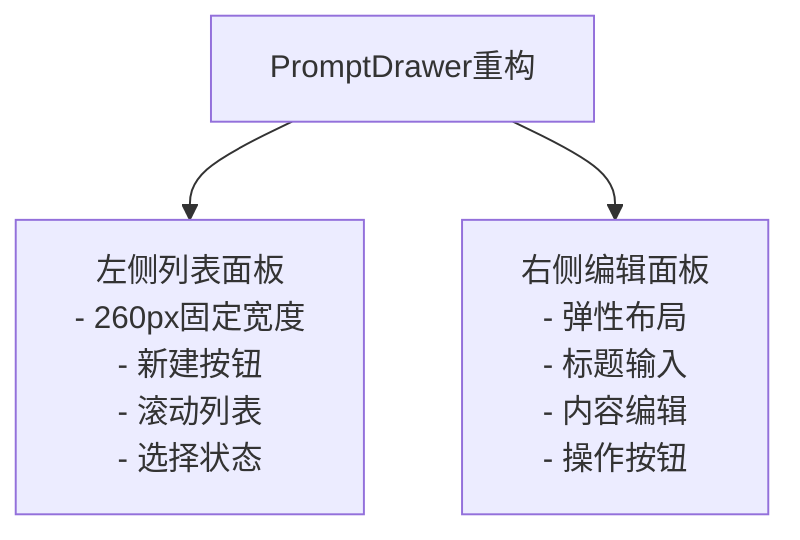

**图表来源**
- [src/frontend/admin/components/PromptDrawer.ts:225-276](file://src/frontend/admin/components/PromptDrawer.ts#L225-L276)

**章节来源**
- [src/frontend/admin/components/PromptDrawer.ts:225-276](file://src/frontend/admin/components/PromptDrawer.ts#L225-L276)

### 主题切换系统
**新增** Admin界面现已集成完整的主题切换系统，支持明暗主题自动检测与手动切换。

#### 主题状态管理
- **主题状态**：使用van.state管理当前主题状态（light/dark）
- **自动检测**：优先使用用户本地存储的主题偏好，否则检测系统深色模式偏好
- **持久化存储**：主题切换结果保存到localStorage，刷新后保持一致

#### 主题应用机制
- **CSS变量**：通过`:root`和[data-theme="light"/"dark"]选择器定义主题变量
- **动态切换**：切换时更新`document.documentElement.dataset.theme`属性
- **即时生效**：所有组件样式自动响应主题变化

#### 主题切换按钮
- **位置**：位于顶部工具栏右侧，与模型选择器、导入导出等按钮并列
- **图标**：太阳/月亮图标根据当前主题动态切换
- **标题**：显示当前主题状态的切换提示

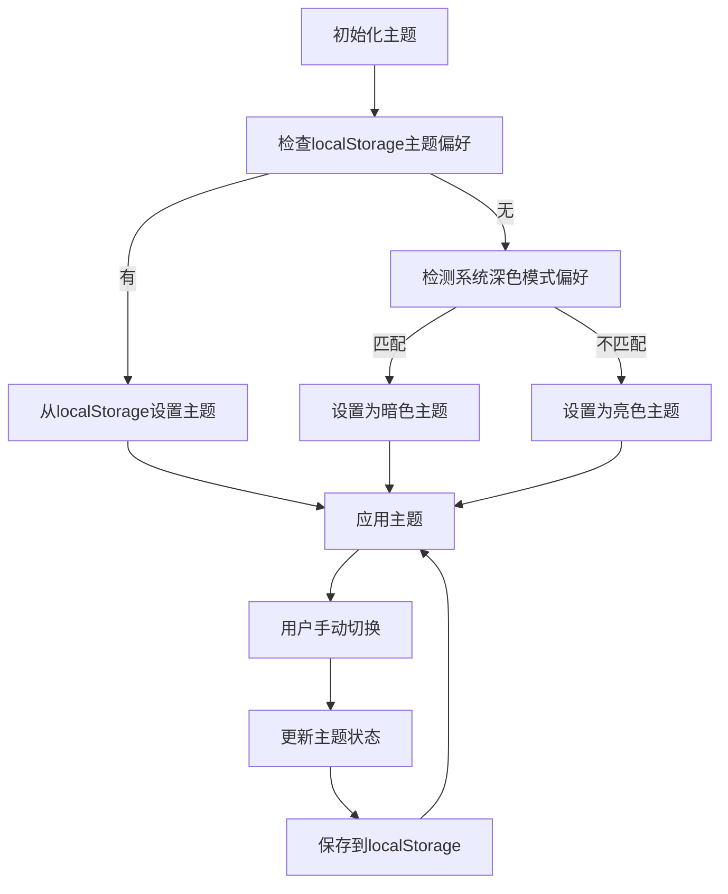

**图表来源**
- [src/frontend/admin/app.ts:55-81](file://src/frontend/admin/app.ts#L55-L81)
- [src/frontend/shared/styles/common.css:1-77](file://src/frontend/shared/styles/common.css#L1-L77)

**章节来源**
- [src/frontend/admin/app.ts:55-81](file://src/frontend/admin/app.ts#L55-L81)
- [src/frontend/shared/styles/common.css:1-77](file://src/frontend/shared/styles/common.css#L1-L77)

### AI菜单动态定位
**新增** AI工具箱菜单现已实现智能动态定位功能，避免菜单超出屏幕边界。

#### 定位算法
- **边界检测**：计算按钮元素相对于视窗的位置和可用空间
- **智能决策**：根据可用空间决定菜单的上下方显示位置
- **尺寸估算**：使用预设的菜单尺寸（高度230px，宽度140px）进行计算

#### 定位逻辑
- **向下显示**：当按钮底部到视窗底部的距离≥230px时，菜单显示在按钮下方
- **向上显示**：当按钮上方到视窗顶部的距离≥230px时，菜单显示在按钮上方
- **水平适配**：当按钮右侧到视窗右侧的距离≥140px时，菜单左对齐按钮
- **反向适配**：当按钮左侧到视窗左侧的距离≥140px时，菜单右对齐按钮

#### 状态管理
- **位置状态**：使用aiMenuPos和formAiMenuPos两个状态分别管理备忘录和表单的菜单位置
- **动态更新**：每次打开菜单时重新计算位置，确保在窗口大小变化时仍正确显示

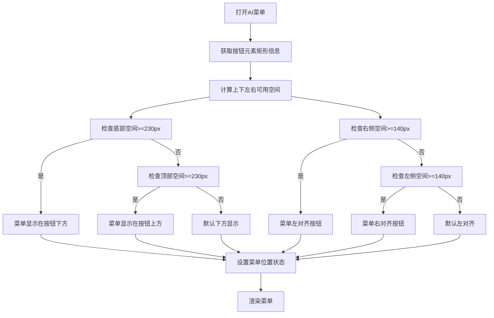

**图表来源**
- [src/frontend/admin/actions/ai.ts:181-209](file://src/frontend/admin/actions/ai.ts#L181-L209)
- [src/frontend/admin/components/MemoCard.ts:174-280](file://src/frontend/admin/components/MemoCard.ts#L174-L280)
- [src/frontend/admin/components/FormModal.ts:277-375](file://src/frontend/admin/components/FormModal.ts#L277-L375)

**章节来源**
- [src/frontend/admin/actions/ai.ts:181-209](file://src/frontend/admin/actions/ai.ts#L181-L209)
- [src/frontend/admin/components/MemoCard.ts:174-280](file://src/frontend/admin/components/MemoCard.ts#L174-L280)
- [src/frontend/admin/components/FormModal.ts:277-375](file://src/frontend/admin/components/FormModal.ts#L277-L375)

### 认证状态识别优化
**更新** 认证状态识别机制得到完善，优化了登录检查流程和状态管理。

#### 登录检查流程
- **异步检查**：启动时调用checkAuth()异步检查认证状态
- **状态管理**：authenticated状态使用van.state管理，支持null、true、false三种状态
- **UI反馈**：根据状态显示"Checking..."、登录页或管理页

#### 认证状态处理
- **null状态**：应用启动时的初始状态，显示加载提示
- **false状态**：未认证状态，显示登录页面
- **true状态**：已认证状态，加载备忘录数据并初始化AI功能

#### 错误处理
- **全局错误**：使用globalError状态统一管理错误信息
- **用户友好**：登录失败时显示错误提示，支持手动关闭
- **恢复机制**：错误清除后可重新尝试登录

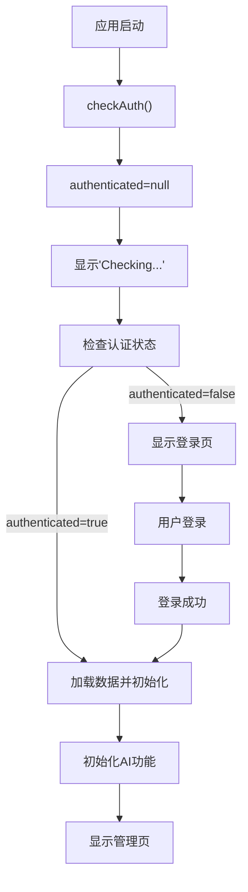

**图表来源**
- [src/frontend/admin/actions/auth.ts:12-25](file://src/frontend/admin/actions/auth.ts#L12-L25)
- [src/frontend/admin/app.ts:270-277](file://src/frontend/admin/app.ts#L270-L277)

**章节来源**
- [src/frontend/admin/actions/auth.ts:12-25](file://src/frontend/admin/actions/auth.ts#L12-L25)
- [src/frontend/admin/app.ts:270-277](file://src/frontend/admin/app.ts#L270-L277)

## 依赖关系分析

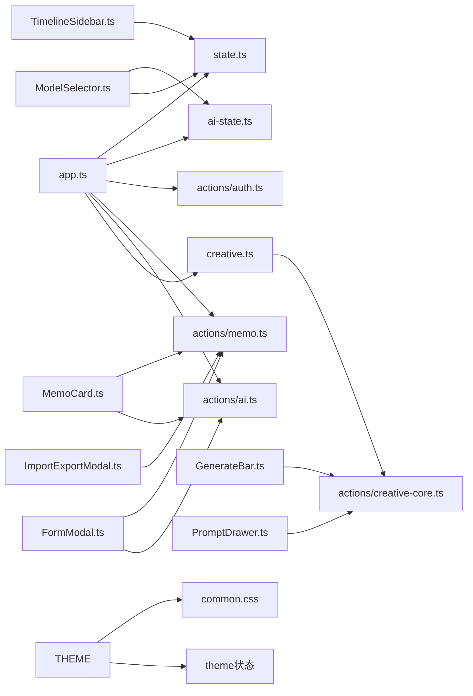

**图表来源**
- [src/frontend/admin/app.ts](file://src/frontend/admin/app.ts)
- [src/frontend/admin/state.ts](file://src/frontend/admin/state.ts)
- [src/frontend/admin/ai-state.ts](file://src/frontend/admin/ai-state.ts)
- [src/frontend/admin/actions/auth.ts](file://src/frontend/admin/actions/auth.ts)
- [src/frontend/admin/actions/memo.ts](file://src/frontend/admin/actions/memo.ts)
- [src/frontend/admin/actions/ai.ts](file://src/frontend/admin/actions/ai.ts)
- [src/frontend/admin/creative.ts](file://src/frontend/admin/creative.ts)
- [src/frontend/admin/actions/creative-core.ts](file://src/frontend/admin/actions/creative-core.ts)
- [src/frontend/admin/components/MemoCard.ts](file://src/frontend/admin/components/MemoCard.ts)
- [src/frontend/admin/components/FormModal.ts](file://src/frontend/admin/components/FormModal.ts)
- [src/frontend/admin/components/TimelineSidebar.ts](file://src/frontend/admin/components/TimelineSidebar.ts)
- [src/frontend/admin/components/ModelSelector.ts](file://src/frontend/admin/components/ModelSelector.ts)
- [src/frontend/admin/components/ImportExportModal.ts](file://src/frontend/admin/components/ImportExportModal.ts)
- [src/frontend/admin/components/GenerateBar.ts](file://src/frontend/admin/components/GenerateBar.ts)
- [src/frontend/admin/components/PromptDrawer.ts](file://src/frontend/admin/components/PromptDrawer.ts)
- [src/frontend/shared/styles/common.css](file://src/frontend/shared/styles/common.css)

**章节来源**
- [src/frontend/admin/app.ts](file://src/frontend/admin/app.ts)
- [src/frontend/admin/state.ts](file://src/frontend/admin/state.ts)

## 性能考虑
- 状态粒度控制：将UI状态与业务状态分离，避免无关状态变更引发重渲染
- 计算缓存：时间线侧边栏对数据进行缓存，仅在数据变化时重建
- 异步中断：AI标签建议与创意生成使用AbortController中断上一次请求
- 懒加载：首次进入CreativeTab时才加载提示词与标签，使用promptsLoaded和tagsLoaded标志防止重复加载
- DOM节流：流式生成使用requestAnimationFrame合并更新
- 本地存储：模型选择持久化减少重复请求
- **GenerateBar优化**：采用简洁的三段式布局，减少DOM层级和重绘开销
- **PromptDrawer优化**：左右分栏布局，提升提示词管理效率
- **主题切换优化**：主题状态持久化到localStorage，避免重复计算
- **AI菜单定位优化**：使用预设尺寸估算，减少布局计算开销
- **认证状态优化**：异步检查认证状态，避免阻塞UI渲染

**更新** 移除了ChatPanel和GenerateModal组件，简化了组件架构，减少了不必要的状态管理和DOM节点。GenerateBar和PromptDrawer的重构显著提升了性能和用户体验。

## 故障排查指南
- 登录失败：检查密钥是否正确，查看全局错误提示
- 加载失败：关注全局错误banner，确认网络连通与后端服务状态
- AI不可用：检查AI状态与模型加载，确认默认模型是否有效
- 导入失败：确认文件格式为.txt，查看错误信息并重试
- 生成异常：检查提示词选择、附加指令、标签选择与网络连接
- CreativeTab数据加载异常：检查promptsLoaded和tagsLoaded状态标志是否正确设置
- **GenerateBar问题**：检查提示词列表是否正确加载、标签选择逻辑是否正常
- **PromptDrawer问题**：检查提示词列表滚动、编辑器表单状态、删除功能
- **内存泄漏**：确认流式生成及时中断，避免长时间生成导致的内存占用
- **主题切换问题**：检查localStorage权限、CSS变量是否正确应用
- **AI菜单定位异常**：确认按钮元素是否正确获取、边界检测计算是否准确
- **认证状态异常**：检查checkAuth()调用、API响应格式、状态更新逻辑

**章节来源**
- [src/frontend/admin/app.ts](file://src/frontend/admin/app.ts)
- [src/frontend/admin/actions/auth.ts](file://src/frontend/admin/actions/auth.ts)
- [src/frontend/admin/actions/memo.ts](file://src/frontend/admin/actions/memo.ts)
- [src/frontend/admin/actions/ai.ts](file://src/frontend/admin/actions/ai.ts)
- [src/frontend/admin/actions/creative-core.ts](file://src/frontend/admin/actions/creative-core.ts)

## 结论
Admin管理界面以VanJS为核心，通过清晰的状态层、组件层与动作层实现高内聚低耦合的架构。借助响应式状态与事件驱动，实现了登录认证、备忘录管理、标签系统、公开/私密切换、AI工具箱与创意写作的完整闭环。时间线侧边栏与模态框提升了交互效率。

**更新** 移除了ChatPanel和GenerateModal组件，简化了组件架构，专注于核心的备忘录管理和创意内容生成功能。GenerateBar和PromptDrawer的重构显著提升了用户体验和性能表现。主题切换系统和AI菜单动态定位功能保持了原有的高质量体验。

遵循本文的状态管理与性能优化建议，可进一步提升用户体验与系统稳定性。

## 附录
- 最佳实践
  - 使用van.state集中管理UI状态，避免跨组件共享复杂对象
  - 将副作用（API调用）集中在actions层，保持组件纯函数特性
  - 对耗时操作（AI建议、生成、聊天）提供中断能力与错误兜底
  - 合理使用缓存与懒加载，降低首屏与频繁操作的延迟
  - 在组件初始化时使用状态标志防止重复数据加载
  - **GenerateBar优化**：采用简洁布局减少DOM层级，提升渲染性能
  - **PromptDrawer优化**：左右分栏布局提升提示词管理效率
  - **主题系统优化**：使用CSS变量实现即时主题切换，避免重排重绘
  - **AI菜单优化**：使用预设尺寸估算减少布局计算开销
  - **认证状态优化**：异步检查认证状态，避免阻塞UI渲染
- 常见问题
  - 模态框无法关闭：检查事件冒泡与状态重置逻辑
  - 时间线不更新：确认数据变更后是否更新缓存与selectedMonth
  - AI结果不显示：检查aiPanelMemoId与aiPanelResult状态联动
  - CreativeTab数据加载循环：确认promptsLoaded和tagsLoaded标志正确设置
  - **GenerateBar流式显示异常**：检查SSE连接状态和消息流完整性
  - **PromptDrawer表单状态异常**：检查保存状态和删除确认逻辑
  - **标签过滤失效**：确认availableTags状态正确更新且过滤逻辑正常
  - **主题切换失效**：检查localStorage权限和CSS变量应用
  - **AI菜单定位错误**：确认按钮元素获取和边界检测计算
  - **认证状态异常**：检查API响应格式和状态更新逻辑