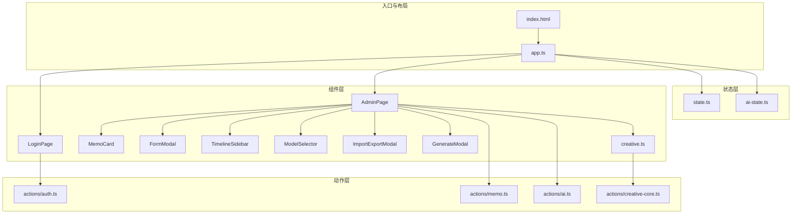
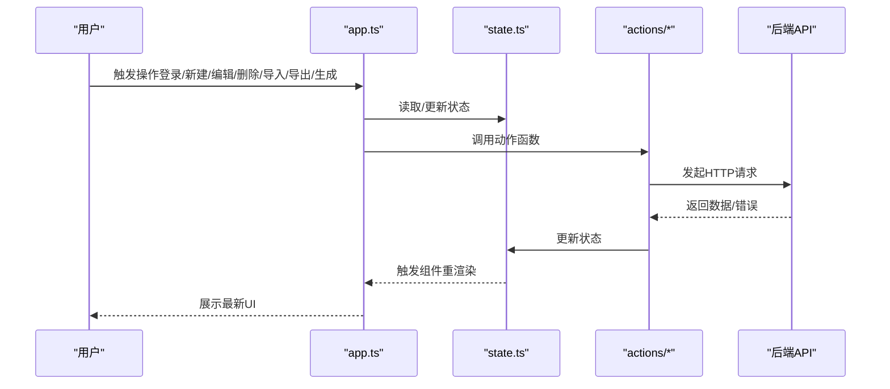
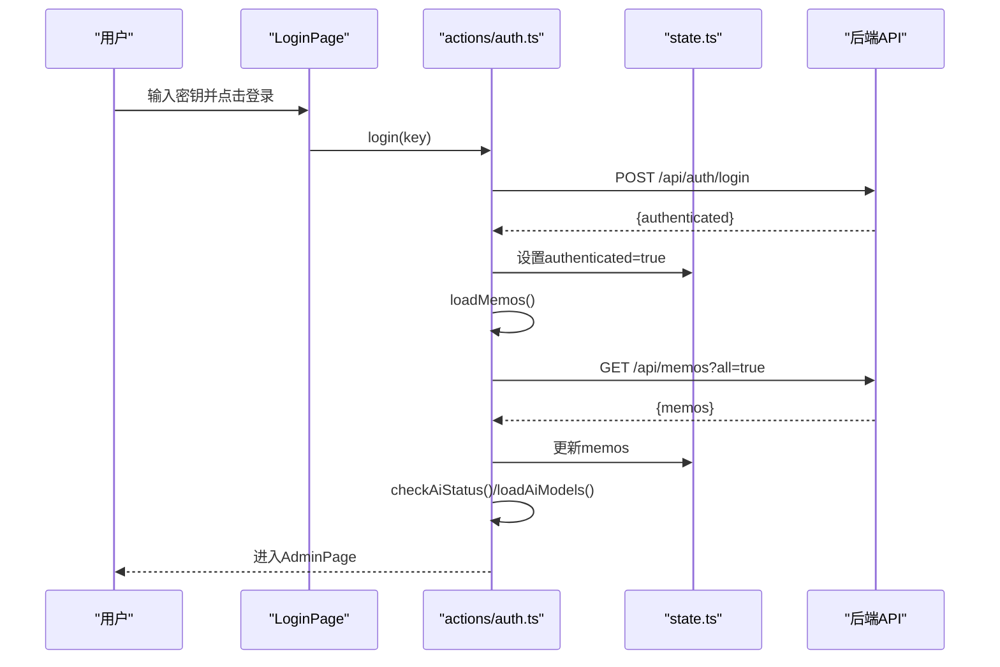
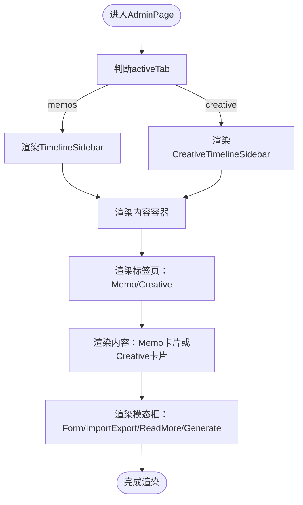
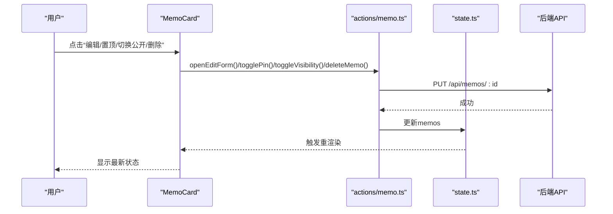
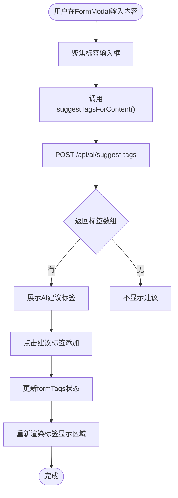
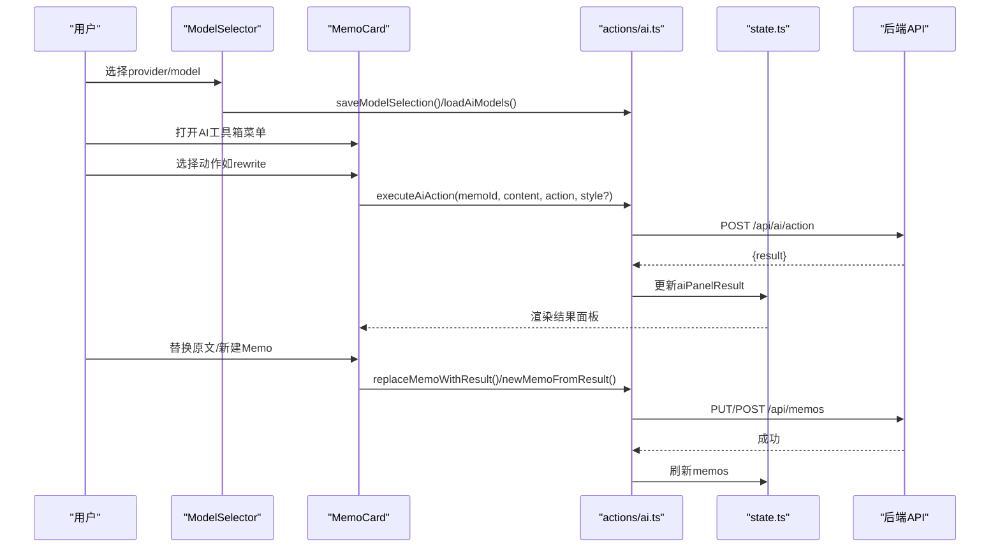
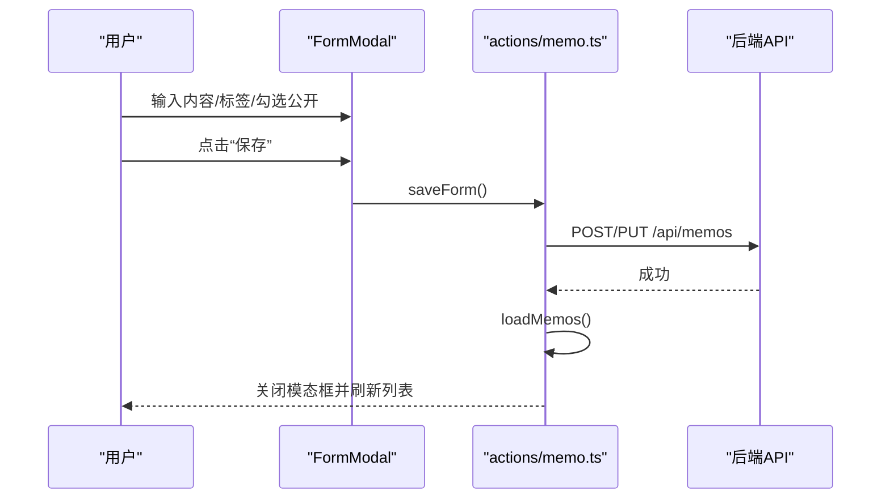
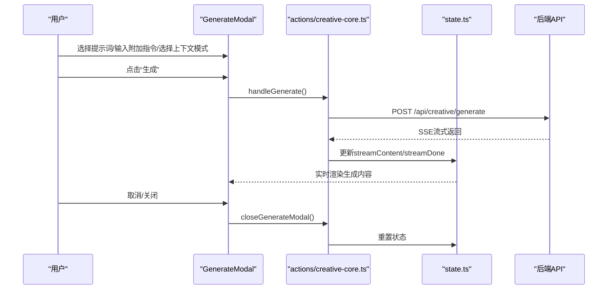
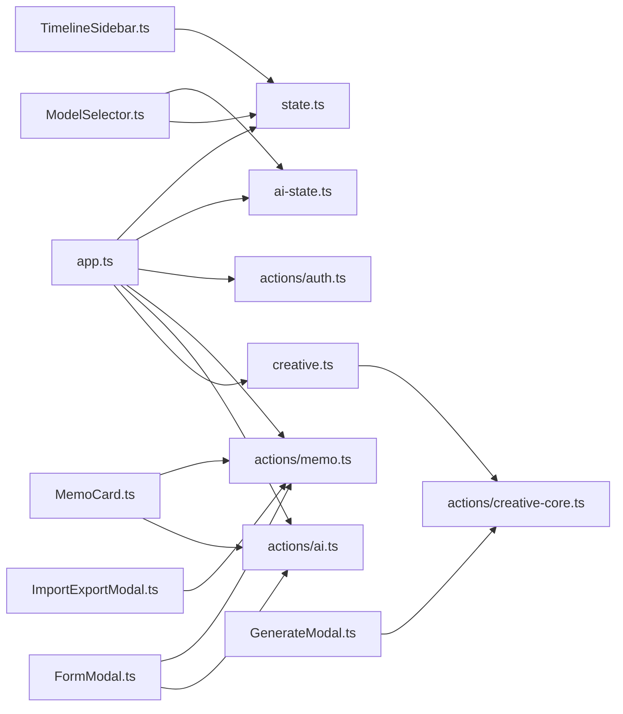

# Admin管理界面

<cite>
**本文档引用的文件**
- [src/frontend/admin/index.html](file://src/frontend/admin/index.html)
- [src/frontend/admin/app.ts](file://src/frontend/admin/app.ts)
- [src/frontend/admin/state.ts](file://src/frontend/admin/state.ts)
- [src/frontend/admin/ai-state.ts](file://src/frontend/admin/ai-state.ts)
- [src/frontend/admin/creative.ts](file://src/frontend/admin/creative.ts)
- [src/frontend/admin/components/FormModal.ts](file://src/frontend/admin/components/FormModal.ts)
- [src/frontend/admin/components/MemoCard.ts](file://src/frontend/admin/components/MemoCard.ts)
- [src/frontend/admin/components/TimelineSidebar.ts](file://src/frontend/admin/components/TimelineSidebar.ts)
- [src/frontend/admin/components/ModelSelector.ts](file://src/frontend/admin/components/ModelSelector.ts)
- [src/frontend/admin/components/ImportExportModal.ts](file://src/frontend/admin/components/ImportExportModal.ts)
- [src/frontend/admin/actions/memo.ts](file://src/frontend/admin/actions/memo.ts)
- [src/frontend/admin/actions/auth.ts](file://src/frontend/admin/actions/auth.ts)
- [src/frontend/admin/actions/ai.ts](file://src/frontend/admin/actions/ai.ts)
- [src/frontend/admin/actions/creative-core.ts](file://src/frontend/admin/actions/creative-core.ts)
- [src/frontend/admin/components/GenerateModal.ts](file://src/frontend/admin/components/GenerateModal.ts)
</cite>

## 目录
1. [简介](#简介)
2. [项目结构](#项目结构)
3. [核心组件](#核心组件)
4. [架构总览](#架构总览)
5. [详细组件分析](#详细组件分析)
6. [依赖关系分析](#依赖关系分析)
7. [性能考虑](#性能考虑)
8. [故障排查指南](#故障排查指南)
9. [结论](#结论)
10. [附录](#附录)

## 简介
本文件面向Admin管理界面，系统性阐述VanJS框架在Admin中的应用，包括响应式状态管理、组件化开发与事件处理机制。文档覆盖登录页面、主管理页面、备忘录管理、标签系统、公开/私密状态切换、AI工具箱集成、时间线侧边栏、以及表单模态框、导入导出模态框等交互组件。同时提供状态管理最佳实践与性能优化建议。

## 项目结构
Admin前端采用VanJS进行声明式UI构建，核心目录如下：
- 入口与布局：index.html定义样式与容器；app.ts负责挂载与路由渲染
- 状态层：state.ts集中管理全局状态；ai-state.ts共享AI模型选择
- 组件层：各功能页面与交互组件拆分为独立模块
- 动作层：actions/*封装业务逻辑与API调用
- 创意模块：creative.ts与actions/creative-core.ts实现提示词与创意内容管理

**图表来源**
- [src/frontend/admin/index.html](file://src/frontend/admin/index.html)
- [src/frontend/admin/app.ts](file://src/frontend/admin/app.ts)
- [src/frontend/admin/state.ts](file://src/frontend/admin/state.ts)
- [src/frontend/admin/ai-state.ts](file://src/frontend/admin/ai-state.ts)
- [src/frontend/admin/creative.ts](file://src/frontend/admin/creative.ts)

**章节来源**
- [src/frontend/admin/index.html](file://src/frontend/admin/index.html)
- [src/frontend/admin/app.ts](file://src/frontend/admin/app.ts)

## 核心组件
- 登录页面：基于密码密钥认证，调用认证动作完成登录与登出
- 主管理页面：顶部工具栏、标签页切换、时间线侧边栏、内容区与模态框
- 备忘录卡片：展示内容、标签、公开/私密徽章、置顶、编辑、删除、AI工具箱
- 表单模态框：新建/编辑备忘录，标签输入与AI建议，公开状态勾选
- 时间线侧边栏：按年月组织备忘录，支持展开/折叠与跳转
- 导入/导出模态框：支持拖拽/文件选择导入与一键导出
- AI工具箱：模型选择器、内容优化、创意写作（提示词+上下文）
- 创意内容：提示词管理、生成流式输出、对话/列表视图

**章节来源**
- [src/frontend/admin/app.ts](file://src/frontend/admin/app.ts)
- [src/frontend/admin/state.ts](file://src/frontend/admin/state.ts)
- [src/frontend/admin/ai-state.ts](file://src/frontend/admin/ai-state.ts)
- [src/frontend/admin/creative.ts](file://src/frontend/admin/creative.ts)

## 架构总览
Admin采用“状态驱动的组件化”架构：
- 响应式状态：VanJS的van.state统一管理UI状态与数据
- 组件渲染：函数式组件通过状态订阅自动重渲染
- 事件处理：组件内绑定事件回调，调用动作层API
- 数据流：动作层通过API访问后端，更新状态，驱动UI

**图表来源**
- [src/frontend/admin/app.ts](file://src/frontend/admin/app.ts)
- [src/frontend/admin/state.ts](file://src/frontend/admin/state.ts)
- [src/frontend/admin/actions/auth.ts](file://src/frontend/admin/actions/auth.ts)
- [src/frontend/admin/actions/memo.ts](file://src/frontend/admin/actions/memo.ts)
- [src/frontend/admin/actions/ai.ts](file://src/frontend/admin/actions/ai.ts)
- [src/frontend/admin/actions/creative-core.ts](file://src/frontend/admin/actions/creative-core.ts)

## 详细组件分析

### 登录页面与认证流程
- 登录页由LoginPage组件渲染，输入密钥后触发登录动作
- 认证检查与登录成功后加载备忘录列表与AI状态
- 登出时清空状态并返回登录页

**图表来源**
- [src/frontend/admin/app.ts](file://src/frontend/admin/app.ts)
- [src/frontend/admin/actions/auth.ts](file://src/frontend/admin/actions/auth.ts)
- [src/frontend/admin/actions/memo.ts](file://src/frontend/admin/actions/memo.ts)
- [src/frontend/admin/actions/ai.ts](file://src/frontend/admin/actions/ai.ts)

**章节来源**
- [src/frontend/admin/app.ts](file://src/frontend/admin/app.ts)
- [src/frontend/admin/actions/auth.ts](file://src/frontend/admin/actions/auth.ts)

### 主管理页面与时间线侧边栏
- AdminPage根据认证状态切换登录页或管理页
- 顶部工具栏包含模型选择器、新建按钮、导入导出、查看网站、退出登录
- 根据当前标签页显示时间线侧边栏（备忘录或创意内容）
- 内容区根据activeTab切换“Memo”或“Creative”

**图表来源**
- [src/frontend/admin/app.ts](file://src/frontend/admin/app.ts)
- [src/frontend/admin/components/TimelineSidebar.ts](file://src/frontend/admin/components/TimelineSidebar.ts)
- [src/frontend/admin/creative.ts](file://src/frontend/admin/creative.ts)

**章节来源**
- [src/frontend/admin/app.ts](file://src/frontend/admin/app.ts)
- [src/frontend/admin/components/TimelineSidebar.ts](file://src/frontend/admin/components/TimelineSidebar.ts)

### 备忘录管理（创建、编辑、删除、置顶）
- 新建/编辑：打开FormModal，输入内容、标签、公开状态，提交后刷新列表
- 删除：点击删除按钮弹出确认，确认后调用删除动作
- 置顶：点击置顶按钮切换pinned状态
- 公开/私密：点击切换is_public状态

**图表来源**
- [src/frontend/admin/components/MemoCard.ts](file://src/frontend/admin/components/MemoCard.ts)
- [src/frontend/admin/actions/memo.ts](file://src/frontend/admin/actions/memo.ts)

**章节来源**
- [src/frontend/admin/components/MemoCard.ts](file://src/frontend/admin/components/MemoCard.ts)
- [src/frontend/admin/actions/memo.ts](file://src/frontend/admin/actions/memo.ts)

### 标签系统与AI建议
- 表单中可输入标签并回车添加，支持从AI建议中一键添加
- AI建议通过suggestTagsForContent接口获取，支持防抖与中断
- 标签用于筛选与展示，支持在创意内容中按标签生成

**图表来源**
- [src/frontend/admin/components/FormModal.ts](file://src/frontend/admin/components/FormModal.ts)
- [src/frontend/admin/actions/ai.ts](file://src/frontend/admin/actions/ai.ts)

**章节来源**
- [src/frontend/admin/components/FormModal.ts](file://src/frontend/admin/components/FormModal.ts)
- [src/frontend/admin/actions/ai.ts](file://src/frontend/admin/actions/ai.ts)

### 公开/私密状态切换
- 通过MemoCard中的图标按钮切换is_public
- 调用PUT /api/memos/:id更新状态并刷新列表

**章节来源**
- [src/frontend/admin/components/MemoCard.ts](file://src/frontend/admin/components/MemoCard.ts)
- [src/frontend/admin/actions/memo.ts](file://src/frontend/admin/actions/memo.ts)

### AI工具箱集成
- 模型选择器：ModelSelector展示provider与model，持久化到localStorage
- 卡片级AI工具箱：对单条Memo执行优化、改写、扩写、要点提炼、润色等动作
- 表单级AI工具箱：对输入内容执行相同动作，直接替换表单内容
- 结果面板：支持替换原文或新建Memo，支持关闭

**图表来源**
- [src/frontend/admin/components/ModelSelector.ts](file://src/frontend/admin/components/ModelSelector.ts)
- [src/frontend/admin/components/MemoCard.ts](file://src/frontend/admin/components/MemoCard.ts)
- [src/frontend/admin/actions/ai.ts](file://src/frontend/admin/actions/ai.ts)

**章节来源**
- [src/frontend/admin/components/ModelSelector.ts](file://src/frontend/admin/components/ModelSelector.ts)
- [src/frontend/admin/components/MemoCard.ts](file://src/frontend/admin/components/MemoCard.ts)
- [src/frontend/admin/actions/ai.ts](file://src/frontend/admin/actions/ai.ts)

### 时间线侧边栏设计与实现
- TimelineSidebar按年月聚合备忘录，支持展开/折叠年份
- 点击月份滚动到对应第一条备忘录
- 支持备忘录与创意内容两套时间线组件

**图表来源**
- [src/frontend/admin/components/TimelineSidebar.ts](file://src/frontend/admin/components/TimelineSidebar.ts)

**章节来源**
- [src/frontend/admin/components/TimelineSidebar.ts](file://src/frontend/admin/components/TimelineSidebar.ts)

### 表单模态框与导入导出模态框
- FormModal：支持内容编辑、标签增删、AI建议、公开状态、保存与取消
- ImportExportModal：支持导出全部数据与导入（拖拽/文件选择），显示结果或错误

**图表来源**
- [src/frontend/admin/components/FormModal.ts](file://src/frontend/admin/components/FormModal.ts)
- [src/frontend/admin/actions/memo.ts](file://src/frontend/admin/actions/memo.ts)

**章节来源**
- [src/frontend/admin/components/FormModal.ts](file://src/frontend/admin/components/FormModal.ts)
- [src/frontend/admin/components/ImportExportModal.ts](file://src/frontend/admin/components/ImportExportModal.ts)
- [src/frontend/admin/actions/memo.ts](file://src/frontend/admin/actions/memo.ts)

### 创意写作功能（提示词、上下文、流式生成）
- 提示词管理：新增、编辑、删除、选择
- 上下文模式：自动匹配、手动ID、按标签三种
- 流式生成：SSE接收增量内容，支持预览上下文、错误处理与取消

**图表来源**
- [src/frontend/admin/components/GenerateModal.ts](file://src/frontend/admin/components/GenerateModal.ts)
- [src/frontend/admin/actions/creative-core.ts](file://src/frontend/admin/actions/creative-core.ts)

**章节来源**
- [src/frontend/admin/creative.ts](file://src/frontend/admin/creative.ts)
- [src/frontend/admin/components/GenerateModal.ts](file://src/frontend/admin/components/GenerateModal.ts)
- [src/frontend/admin/actions/creative-core.ts](file://src/frontend/admin/actions/creative-core.ts)

## 依赖关系分析

**图表来源**
- [src/frontend/admin/app.ts](file://src/frontend/admin/app.ts)
- [src/frontend/admin/state.ts](file://src/frontend/admin/state.ts)
- [src/frontend/admin/ai-state.ts](file://src/frontend/admin/ai-state.ts)
- [src/frontend/admin/actions/auth.ts](file://src/frontend/admin/actions/auth.ts)
- [src/frontend/admin/actions/memo.ts](file://src/frontend/admin/actions/memo.ts)
- [src/frontend/admin/actions/ai.ts](file://src/frontend/admin/actions/ai.ts)
- [src/frontend/admin/creative.ts](file://src/frontend/admin/creative.ts)
- [src/frontend/admin/actions/creative-core.ts](file://src/frontend/admin/actions/creative-core.ts)
- [src/frontend/admin/components/MemoCard.ts](file://src/frontend/admin/components/MemoCard.ts)
- [src/frontend/admin/components/FormModal.ts](file://src/frontend/admin/components/FormModal.ts)
- [src/frontend/admin/components/TimelineSidebar.ts](file://src/frontend/admin/components/TimelineSidebar.ts)
- [src/frontend/admin/components/ModelSelector.ts](file://src/frontend/admin/components/ModelSelector.ts)
- [src/frontend/admin/components/ImportExportModal.ts](file://src/frontend/admin/components/ImportExportModal.ts)
- [src/frontend/admin/components/GenerateModal.ts](file://src/frontend/admin/components/GenerateModal.ts)

**章节来源**
- [src/frontend/admin/app.ts](file://src/frontend/admin/app.ts)
- [src/frontend/admin/state.ts](file://src/frontend/admin/state.ts)

## 性能考虑
- 状态粒度控制：将UI状态与业务状态分离，避免无关状态变更引发重渲染
- 计算缓存：时间线侧边栏对数据进行缓存，仅在数据变化时重建
- 异步中断：AI标签建议与创意生成使用AbortController中断上一次请求
- 懒加载：首次进入CreativeTab时才加载提示词与标签
- DOM节流：流式生成使用requestAnimationFrame合并更新
- 本地存储：模型选择持久化减少重复请求

[本节为通用指导，无需特定文件引用]

## 故障排查指南
- 登录失败：检查密钥是否正确，查看全局错误提示
- 加载失败：关注全局错误banner，确认网络连通与后端服务状态
- AI不可用：检查AI状态与模型加载，确认默认模型是否有效
- 导入失败：确认文件格式为.txt，查看错误信息并重试
- 生成异常：检查提示词选择、附加指令、上下文模式与网络连接

**章节来源**
- [src/frontend/admin/app.ts](file://src/frontend/admin/app.ts)
- [src/frontend/admin/actions/auth.ts](file://src/frontend/admin/actions/auth.ts)
- [src/frontend/admin/actions/memo.ts](file://src/frontend/admin/actions/memo.ts)
- [src/frontend/admin/actions/ai.ts](file://src/frontend/admin/actions/ai.ts)
- [src/frontend/admin/actions/creative-core.ts](file://src/frontend/admin/actions/creative-core.ts)

## 结论
Admin管理界面以VanJS为核心，通过清晰的状态层、组件层与动作层实现高内聚低耦合的架构。借助响应式状态与事件驱动，实现了登录认证、备忘录管理、标签系统、公开/私密切换、AI工具箱与创意写作的完整闭环。时间线侧边栏与模态框提升了交互效率。遵循本文的状态管理与性能优化建议，可进一步提升用户体验与系统稳定性。

## 附录
- 最佳实践
  - 使用van.state集中管理UI状态，避免跨组件共享复杂对象
  - 将副作用（API调用）集中在actions层，保持组件纯函数特性
  - 对耗时操作（AI建议、生成）提供中断能力与错误兜底
  - 合理使用缓存与懒加载，降低首屏与频繁操作的延迟
- 常见问题
  - 模态框无法关闭：检查事件冒泡与状态重置逻辑
  - 时间线不更新：确认数据变更后是否更新缓存与selectedMonth
  - AI结果不显示：检查aiPanelMemoId与aiPanelResult状态联动

[本节为通用指导，无需特定文件引用]