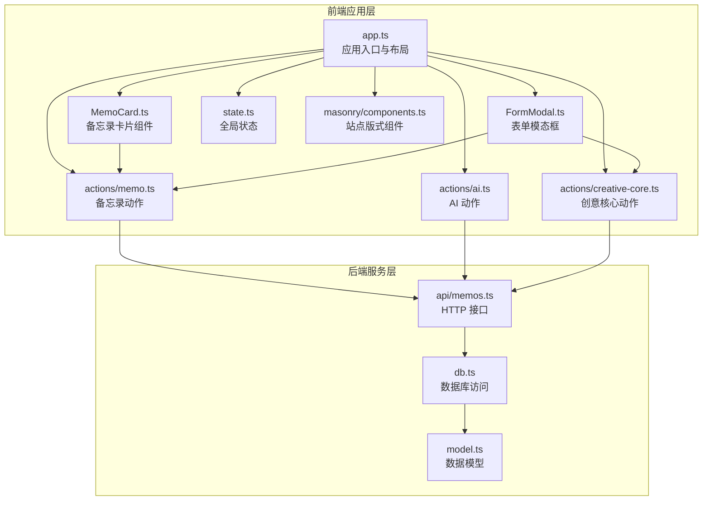
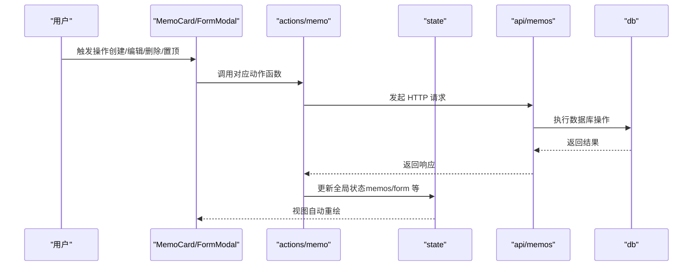
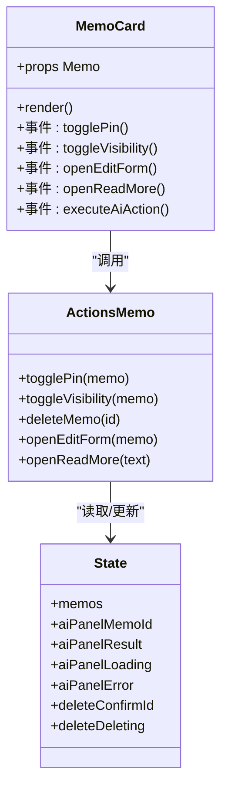
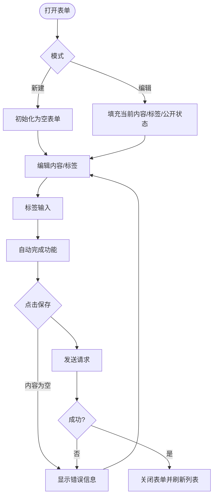
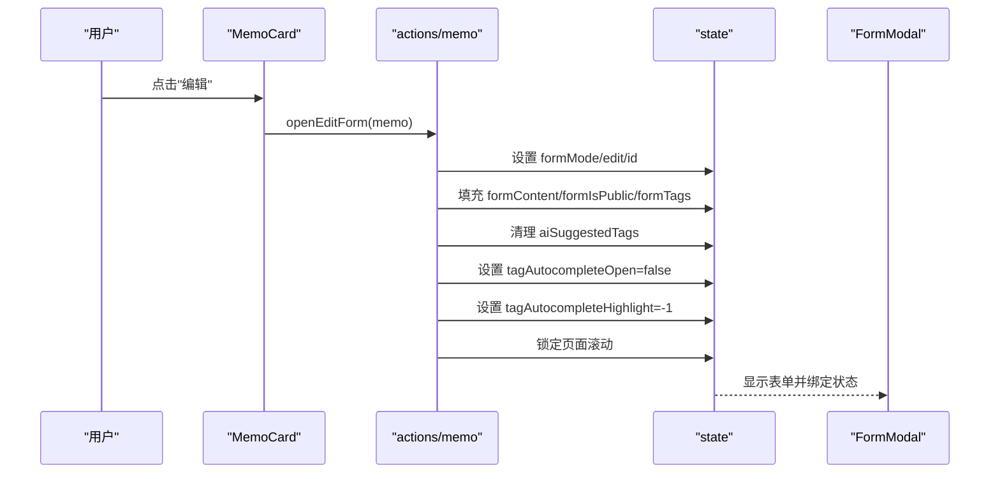
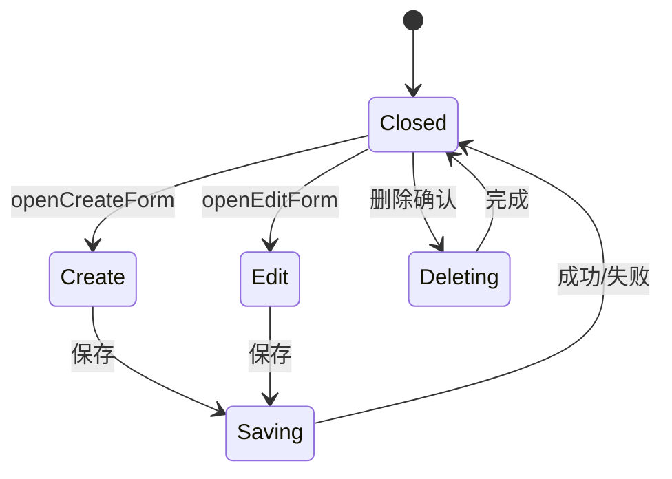
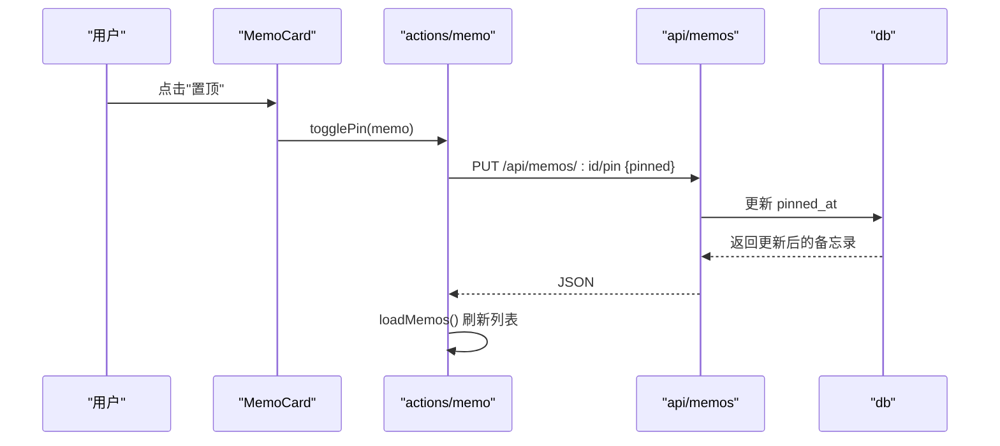
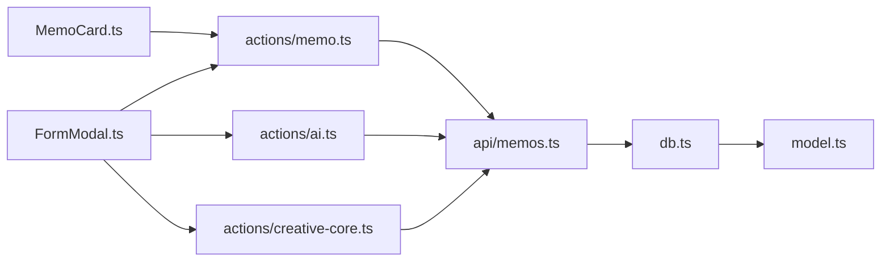

# 备忘录管理

<cite>
**本文引用的文件**
- [src/frontend/admin/components/MemoCard.ts](file://src/frontend/admin/components/MemoCard.ts)
- [src/frontend/admin/components/FormModal.ts](file://src/frontend/admin/components/FormModal.ts)
- [src/frontend/admin/actions/memo.ts](file://src/frontend/admin/actions/memo.ts)
- [src/frontend/admin/state.ts](file://src/frontend/admin/state.ts)
- [src/frontend/admin/app.ts](file://src/frontend/admin/app.ts)
- [src/frontend/admin/actions/ai.ts](file://src/frontend/admin/actions/ai.ts)
- [src/frontend/admin/actions/creative-core.ts](file://src/frontend/admin/actions/creative-core.ts)
- [src/api/memos.ts](file://src/api/memos.ts)
- [src/db.ts](file://src/db.ts)
- [src/model.ts](file://src/model.ts)
- [src/frontend/masonry/components.ts](file://src/frontend/masonry/components.ts)
- [src/frontend/masonry/index.ts](file://src/frontend/masonry/index.ts)
</cite>

## 更新摘要
**变更内容**
- 新增标签输入自动完成功能的详细说明
- 增强了FormModal表单模态框的标签处理机制
- 完善了标签状态管理和建议系统的实现细节
- 更新了标签相关的用户体验优化建议

## 目录
1. [简介](#简介)
2. [项目结构](#项目结构)
3. [核心组件](#核心组件)
4. [架构总览](#架构总览)
5. [详细组件分析](#详细组件分析)
6. [依赖关系分析](#依赖关系分析)
7. [性能考量](#性能考量)
8. [故障排查指南](#故障排查指南)
9. [结论](#结论)
10. [附录](#附录)

## 简介
本文件面向"备忘录管理"功能，系统性阐述前端组件与后端接口的协作方式，覆盖备忘录的创建、编辑、删除、置顶等 CRUD 操作；MemoCard 组件的设计与实现（内容展示、标签显示、操作按钮）；FormModal 表单模态框的使用（表单验证、数据提交、错误处理）；openCreateForm 与 openEditForm 的实现逻辑；备忘录状态管理（公开/私密切换、标签管理、内容更新）；以及备忘录列表渲染机制与性能优化策略。特别强调了增强的标签输入自动完成功能，显著改善了备忘录创建和编辑体验。

## 项目结构
该功能主要由以下层次构成：
- 前端应用层（Van.js）
  - 应用入口与页面布局：app.ts
  - 备忘录卡片组件：MemoCard.ts
  - 表单模态框组件：FormModal.ts
  - 动作与状态管理：actions/memo.ts、state.ts、actions/ai.ts、actions/creative-core.ts
  - 站点版式（非管理后台）：masonry/*（用于对比渲染与交互模式）
- 后端服务层（Hono）
  - API 路由：src/api/memos.ts
  - 数据访问与模型：src/db.ts、src/model.ts

**图表来源**
- [src/frontend/admin/app.ts:1-251](file://src/frontend/admin/app.ts#L1-L251)
- [src/frontend/admin/components/MemoCard.ts:1-346](file://src/frontend/admin/components/MemoCard.ts#L1-L346)
- [src/frontend/admin/components/FormModal.ts:1-436](file://src/frontend/admin/components/FormModal.ts#L1-L436)
- [src/frontend/admin/actions/memo.ts:1-261](file://src/frontend/admin/actions/memo.ts#L1-L261)
- [src/frontend/admin/actions/ai.ts:1-274](file://src/frontend/admin/actions/ai.ts#L1-L274)
- [src/frontend/admin/actions/creative-core.ts:1-354](file://src/frontend/admin/actions/creative-core.ts#L1-L354)
- [src/frontend/admin/state.ts:1-191](file://src/frontend/admin/state.ts#L1-L191)
- [src/frontend/masonry/components.ts:1-337](file://src/frontend/masonry/components.ts#L1-L337)
- [src/api/memos.ts:1-220](file://src/api/memos.ts#L1-L220)
- [src/db.ts:1-484](file://src/db.ts#L1-L484)
- [src/model.ts:1-35](file://src/model.ts#L1-L35)

**章节来源**
- [src/frontend/admin/app.ts:1-251](file://src/frontend/admin/app.ts#L1-L251)
- [src/frontend/admin/state.ts:1-191](file://src/frontend/admin/state.ts#L1-L191)

## 核心组件
- MemoCard：负责单条备忘录的展示与操作，包含置顶、公开/私密切换、编辑、删除、AI 工具箱等。
- FormModal：负责新建/编辑备忘录的表单，包含内容、标签、公开选项、AI 工具箱与表单验证。**新增标签自动完成功能**。
- actions/memo：封装 CRUD 与表单生命周期控制，统一调用 API 并刷新列表。
- state：集中管理全局状态（列表、表单、AI 面板、导入导出等）。**新增标签自动完成状态管理**。
- actions/ai：提供AI标签建议功能，支持基于内容的智能标签推荐。
- actions/creative-core：提供标签加载和管理功能，支持标签预加载和缓存。
- api/memos：后端路由，提供分页、搜索、置顶、标签等接口。
- db：SQLite 访问层，提供 CRUD、索引、全文检索支持。

**章节来源**
- [src/frontend/admin/components/MemoCard.ts:61-346](file://src/frontend/admin/components/MemoCard.ts#L61-L346)
- [src/frontend/admin/components/FormModal.ts:22-436](file://src/frontend/admin/components/FormModal.ts#L22-L436)
- [src/frontend/admin/actions/memo.ts:28-151](file://src/frontend/admin/actions/memo.ts#L28-L151)
- [src/frontend/admin/state.ts:42-104](file://src/frontend/admin/state.ts#L42-L104)
- [src/frontend/admin/actions/ai.ts:107-139](file://src/frontend/admin/actions/ai.ts#L107-L139)
- [src/frontend/admin/actions/creative-core.ts:52-60](file://src/frontend/admin/actions/creative-core.ts#L52-L60)
- [src/api/memos.ts:28-220](file://src/api/memos.ts#L28-L220)
- [src/db.ts:122-249](file://src/db.ts#L122-L249)

## 架构总览
前端通过 Van.js 响应式状态驱动视图，用户操作触发 actions，actions 调用 api 层，后端路由对接 db 层持久化。AI 工具箱贯穿卡片与表单，提供摘要、改写、扩写、要点提炼、润色等功能。**新增标签自动完成功能**，通过实时建议和键盘导航提升标签输入效率。

**图表来源**
- [src/frontend/admin/actions/memo.ts:28-151](file://src/frontend/admin/actions/memo.ts#L28-L151)
- [src/api/memos.ts:28-220](file://src/api/memos.ts#L28-L220)
- [src/db.ts:122-249](file://src/db.ts#L122-L249)
- [src/frontend/admin/state.ts:42-104](file://src/frontend/admin/state.ts#L42-L104)

## 详细组件分析

### MemoCard 组件设计与实现
- 内容展示
  - 截断显示与"展开更多"按钮，避免长文本影响布局。
  - 标签以徽章形式展示，支持多标签。
  - 公开/私密徽章根据 is_public 字段动态显示。
- 操作按钮
  - 置顶/取消置顶：调用 togglePin，后端接口为 PUT /api/memos/:id/pin。
  - 切换公开/私密：调用 toggleVisibility，后端接口为 PUT /api/memos/:id。
  - 编辑：调用 openEditForm，打开表单并填充当前内容。
  - 删除：弹出确认框，确认后调用 deleteMemo，后端接口为 DELETE /api/memos/:id。
- AI 工具箱
  - 支持摘要、改写、扩写、要点提炼、润色等动作。
  - 改写支持风格选择（专业、口语、极简、学术）。
  - 结果面板支持"替换原文"、"新建 memo"、"丢弃"。

**图表来源**
- [src/frontend/admin/components/MemoCard.ts:61-346](file://src/frontend/admin/components/MemoCard.ts#L61-L346)
- [src/frontend/admin/actions/memo.ts:70-105](file://src/frontend/admin/actions/memo.ts#L70-L105)
- [src/frontend/admin/state.ts:44-84](file://src/frontend/admin/state.ts#L44-L84)

**章节来源**
- [src/frontend/admin/components/MemoCard.ts:61-346](file://src/frontend/admin/components/MemoCard.ts#L61-L346)
- [src/frontend/admin/actions/memo.ts:70-105](file://src/frontend/admin/actions/memo.ts#L70-L105)
- [src/frontend/admin/state.ts:44-84](file://src/frontend/admin/state.ts#L44-L84)

### FormModal 表单模态框
- 表单字段
  - 内容：textarea，支持失焦时触发标签建议。
  - 标签：输入框回车添加，显示为可移除的标签芯片；支持 AI 建议。
  - 公开选项：复选框。
- **标签自动完成功能**
  - 输入监听：实时过滤可用标签，最多显示8个建议。
  - 键盘导航：支持上下箭头选择、Enter确认、Tab快速选择。
  - 悬停高亮：鼠标悬停时高亮显示选中项。
  - 延迟关闭：输入框失焦后200ms延迟关闭建议菜单。
- 表单验证与提交
  - 保存前校验内容非空；提交时根据 formMode.type 决定 POST 或 PUT。
  - 提交成功后关闭表单并重新加载列表。
- 错误处理
  - 表单级错误显示在底部；保存中禁用按钮与输入。
- AI 工具箱
  - 表单内 AI 工具箱支持摘要、改写、扩写、要点提炼、润色；改写支持风格选择。

**图表来源**
- [src/frontend/admin/components/FormModal.ts:22-436](file://src/frontend/admin/components/FormModal.ts#L22-L436)
- [src/frontend/admin/actions/memo.ts:43-68](file://src/frontend/admin/actions/memo.ts#L43-L68)

**章节来源**
- [src/frontend/admin/components/FormModal.ts:22-436](file://src/frontend/admin/components/FormModal.ts#L22-L436)
- [src/frontend/admin/actions/memo.ts:43-68](file://src/frontend/admin/actions/memo.ts#L43-L68)

### 标签自动完成功能详解
- **状态管理**
  - availableTags：存储可用标签列表，通过API获取并缓存。
  - tagAutocompleteOpen：控制自动完成菜单的显示/隐藏状态。
  - tagAutocompleteHighlight：跟踪键盘导航时的高亮选项索引。
  - tagsLoaded：标记标签是否已加载，避免重复请求。
- **建议算法**
  - 实时过滤：根据输入内容进行大小写不敏感匹配。
  - 去重处理：排除已添加的标签，避免重复选择。
  - 限制数量：最多显示8个建议，提升性能。
  - 排序规则：按字母顺序排列，便于用户发现标签。
- **交互体验**
  - 键盘导航：ArrowUp/ArrowDown选择，Enter确认，Escape关闭。
  - 鼠标交互：悬停高亮，点击选择。
  - Tab补全：快速将高亮选项填入输入框。
  - 延迟关闭：避免意外关闭导致的输入中断。
- **性能优化**
  - 防抖处理：输入变化时延迟计算建议，减少计算开销。
  - 内存管理：使用Van.js响应式状态，自动清理不再使用的状态。
  - 缓存策略：标签列表只加载一次，后续使用缓存数据。

**章节来源**
- [src/frontend/admin/components/FormModal.ts:37-57](file://src/frontend/admin/components/FormModal.ts#L37-L57)
- [src/frontend/admin/components/FormModal.ts:133-178](file://src/frontend/admin/components/FormModal.ts#L133-L178)
- [src/frontend/admin/components/FormModal.ts:200-247](file://src/frontend/admin/components/FormModal.ts#L200-L247)
- [src/frontend/admin/state.ts:174-182](file://src/frontend/admin/state.ts#L174-L182)
- [src/frontend/admin/actions/creative-core.ts:52-60](file://src/frontend/admin/actions/creative-core.ts#L52-L60)

### openCreateForm 与 openEditForm 实现逻辑
- openCreateForm
  - 设置 formMode 为 create，清空内容、标签、错误，锁定页面滚动。
  - 初始化标签自动完成状态，确保新表单从干净状态开始。
- openEditForm
  - 设置 formMode 为 edit(id)，复制 memo 的 content、is_public、tags，清空 AI 建议，锁定页面滚动。
  - 保留标签自动完成状态，避免影响编辑体验。
- closeForm
  - 关闭表单并清理所有临时状态，恢复页面滚动。
  - 清理标签自动完成相关状态，释放内存。

**图表来源**
- [src/frontend/admin/actions/memo.ts:121-140](file://src/frontend/admin/actions/memo.ts#L121-L140)
- [src/frontend/admin/state.ts:51-57](file://src/frontend/admin/state.ts#L51-L57)

**章节来源**
- [src/frontend/admin/actions/memo.ts:121-140](file://src/frontend/admin/actions/memo.ts#L121-L140)
- [src/frontend/admin/state.ts:51-57](file://src/frontend/admin/state.ts#L51-L57)

### 备忘录状态管理
- 列表状态
  - memos：存储后端返回的备忘录数组，排序规则优先置顶，再按时间倒序。
- 表单状态
  - formMode、formContent、formIsPublic、formTags、formTagInput、formError、formSaving。
- **标签状态管理**
  - availableTags：可用标签列表，通过API获取并缓存。
  - tagsLoaded：标签加载状态标志。
  - tagAutocompleteOpen：自动完成菜单显示状态。
  - tagAutocompleteHighlight：键盘导航高亮状态。
- AI 状态
  - 卡片面板：aiPanelMemoId、aiPanelLoading、aiPanelResult、aiPanelError、aiPanelAction。
  - 表单面板：formAiMenuOpen、formAiLoading、formAiPendingAction。
- 删除确认
  - deleteConfirmId、deleteDeleting 控制删除确认与加载状态。
- 可用性
  - aiAvailable 控制是否显示 AI 工具箱。

**图表来源**
- [src/frontend/admin/state.ts:44-104](file://src/frontend/admin/state.ts#L44-L104)
- [src/frontend/admin/actions/memo.ts:121-151](file://src/frontend/admin/actions/memo.ts#L121-L151)

**章节来源**
- [src/frontend/admin/state.ts:44-104](file://src/frontend/admin/state.ts#L44-L104)
- [src/frontend/admin/actions/memo.ts:121-151](file://src/frontend/admin/actions/memo.ts#L121-L151)

### 备忘录 CRUD 与置顶流程
- 创建
  - 前端：校验内容非空，发送 POST /api/memos。
  - 后端：校验内容、限流、清洗标签、创建记录并异步生成向量嵌入。
- 编辑
  - 前端：根据 formMode.type 发送 PUT /api/memos/:id。
  - 后端：可更新 content/is_public/tags，必要时重建向量嵌入。
- 删除
  - 前端：发送 DELETE /api/memos/:id，清理缓存并刷新列表。
  - 后端：删除记录并清理向量缓存。
- 置顶/取消置顶
  - 前端：发送 PUT /api/memos/:id/pin。
  - 后端：设置/清除 pinned_at 时间戳。

**图表来源**
- [src/frontend/admin/actions/memo.ts:82-92](file://src/frontend/admin/actions/memo.ts#L82-L92)
- [src/api/memos.ts:201-220](file://src/api/memos.ts#L201-L220)
- [src/db.ts:241-249](file://src/db.ts#L241-L249)

**章节来源**
- [src/frontend/admin/actions/memo.ts:82-92](file://src/frontend/admin/actions/memo.ts#L82-L92)
- [src/api/memos.ts:201-220](file://src/api/memos.ts#L201-L220)
- [src/db.ts:241-249](file://src/db.ts#L241-L249)

### 备忘录列表渲染机制与性能优化
- 管理后台列表
  - 使用 Van.js 响应式状态直接映射到组件，遍历 memos.val 渲染 MemoCard。
  - 排序：先置顶（pinned_at 非空且最新），再按创建时间倒序。
- 站点版式（对比参考）
  - masonry 版式采用瀑布流布局，支持搜索、标签筛选、无限滚动与相似内容查找。
  - 通过窗口尺寸变化与滚动事件触发重排与分页加载。
- 性能优化策略
  - 列表渲染：仅渲染可见区域，减少 DOM 数量。
  - 分页与懒加载：后端分页（limit/page），前端滚动触底加载下一页。
  - 搜索与语义检索：LIKE 检索为主，辅以语义检索合并结果，避免阻塞主查询。
  - 标签与计数：预取可用标签与总数，降低重复请求。
  - 本地存储：AI 模型选择持久化，提升体验。

**章节来源**
- [src/frontend/admin/app.ts:199-211](file://src/frontend/admin/app.ts#L199-L211)
- [src/db.ts:122-169](file://src/db.ts#L122-L169)
- [src/frontend/masonry/components.ts:283-337](file://src/frontend/masonry/components.ts#L283-L337)
- [src/frontend/masonry/index.ts:1-23](file://src/frontend/masonry/index.ts#L1-L23)
- [src/api/memos.ts:28-70](file://src/api/memos.ts#L28-L70)

## 依赖关系分析
- 组件依赖
  - MemoCard 依赖 actions/memo 与 state，内部还依赖 AI 动作模块。
  - FormModal 依赖 actions/memo、actions/ai、actions/creative-core 与 state 中的表单、AI 和标签状态。
- 动作依赖
  - actions/memo 依赖 api/util 与 state，负责网络请求与状态更新。
  - actions/ai 依赖 api/util 与 state，负责 AI 工具箱与标签建议。
  - actions/creative-core 依赖 api/util 与 state，负责标签加载和管理。
- 数据层依赖
  - api/memos 依赖 db 与模型定义，提供 HTTP 接口。
  - db 依赖 model 定义与 SQLite 存储。

**图表来源**
- [src/frontend/admin/components/MemoCard.ts:1-346](file://src/frontend/admin/components/MemoCard.ts#L1-L346)
- [src/frontend/admin/components/FormModal.ts:1-436](file://src/frontend/admin/components/FormModal.ts#L1-L436)
- [src/frontend/admin/actions/memo.ts:1-261](file://src/frontend/admin/actions/memo.ts#L1-L261)
- [src/frontend/admin/actions/ai.ts:1-274](file://src/frontend/admin/actions/ai.ts#L1-L274)
- [src/frontend/admin/actions/creative-core.ts:1-354](file://src/frontend/admin/actions/creative-core.ts#L1-L354)
- [src/api/memos.ts:1-220](file://src/api/memos.ts#L1-L220)
- [src/db.ts:1-484](file://src/db.ts#L1-L484)
- [src/model.ts:1-35](file://src/model.ts#L1-L35)

**章节来源**
- [src/frontend/admin/components/MemoCard.ts:1-346](file://src/frontend/admin/components/MemoCard.ts#L1-L346)
- [src/frontend/admin/components/FormModal.ts:1-436](file://src/frontend/admin/components/FormModal.ts#L1-L436)
- [src/frontend/admin/actions/memo.ts:1-261](file://src/frontend/admin/actions/memo.ts#L1-L261)
- [src/frontend/admin/actions/ai.ts:1-274](file://src/frontend/admin/actions/ai.ts#L1-L274)
- [src/frontend/admin/actions/creative-core.ts:1-354](file://src/frontend/admin/actions/creative-core.ts#L1-L354)
- [src/api/memos.ts:1-220](file://src/api/memos.ts#L1-L220)
- [src/db.ts:1-484](file://src/db.ts#L1-L484)
- [src/model.ts:1-35](file://src/model.ts#L1-L35)

## 性能考量
- 查询与排序
  - 后端对 memos 表按 pinned_at 与 created_at 建立索引，保证排序与分页高效。
- 搜索与语义检索
  - LIKE 检索与语义检索并行，语义检索失败不阻塞主流程。
- 渲染优化
  - 管理后台直接映射 memos，站点版式采用瀑布流与懒加载，减少首屏压力。
- 缓存与向量
  - 新建/更新内容时异步生成/更新向量嵌入，删除时清理缓存，避免冗余数据。
- **标签自动完成性能**
  - 标签列表预加载和缓存，避免重复网络请求。
  - 建议计算使用防抖处理，减少频繁的DOM更新。
  - 建议数量限制为8个，平衡性能和用户体验。

**章节来源**
- [src/db.ts:15-61](file://src/db.ts#L15-L61)
- [src/api/memos.ts:28-70](file://src/api/memos.ts#L28-L70)
- [src/frontend/masonry/components.ts:283-337](file://src/frontend/masonry/components.ts#L283-L337)

## 故障排查指南
- 表单保存失败
  - 检查 formError 是否存在；确认内容非空；查看全局错误 banner。
- 删除异常
  - 确认 deleteDeleting 状态；检查后端返回的 404/429 等错误。
- 置顶无效
  - 检查后端返回的 memo.pinned_at 是否更新；确认排序逻辑。
- AI 工具箱不可用
  - 检查 aiAvailable 状态；确认 AI 模型加载与选择是否正确。
- 列表未刷新
  - 确认 loadMemos 是否在保存/删除/置顶后被调用。
- **标签自动完成问题**
  - 检查 availableTags 是否正确加载；确认标签建议API是否正常工作。
  - 验证键盘导航是否正常；检查自动完成菜单的显示/隐藏逻辑。
  - 确认标签去重和过滤逻辑是否正确执行。

**章节来源**
- [src/frontend/admin/actions/memo.ts:43-68](file://src/frontend/admin/actions/memo.ts#L43-L68)
- [src/frontend/admin/actions/memo.ts:94-105](file://src/frontend/admin/actions/memo.ts#L94-L105)
- [src/frontend/admin/actions/memo.ts:82-92](file://src/frontend/admin/actions/memo.ts#L82-L92)
- [src/frontend/admin/actions/ai.ts:61-103](file://src/frontend/admin/actions/ai.ts#L61-L103)
- [src/frontend/admin/state.ts:38-47](file://src/frontend/admin/state.ts#L38-L47)

## 结论
备忘录管理功能通过清晰的组件划分与状态管理，实现了从创建、编辑、删除到置顶的完整 CRUD 流程，并提供了 AI 工具箱增强创作体验。**新增的标签输入自动完成功能显著提升了标签输入效率和用户体验**。前后端接口设计合理，数据库层面具备良好的索引与检索能力。结合站点版式的瀑布流与无限滚动，整体具备较好的性能与用户体验。

## 附录
- 最佳实践
  - 表单必填校验与保存状态反馈，避免重复提交。
  - 删除操作增加二次确认，防止误删。
  - 置顶操作保持显式提示，确保用户感知。
  - 标签建议与 AI 工具箱联动，提升内容质量。
  - **标签自动完成：合理使用Tab键快速补全，利用键盘导航提高效率**。
- 用户体验优化建议
  - 在列表中增加"无内容"占位与引导。
  - 为长内容卡片提供"展开/收起"与"复制全文"快捷操作。
  - 优化 AI 工具箱的交互反馈（加载动画、错误提示）。
  - 支持键盘快捷键（如 ESC 关闭模态框、Enter 保存）。
  - **标签输入：提供更直观的视觉反馈，如高亮选中项和成功添加的提示**。
  - **建议菜单：考虑添加搜索图标或"搜索标签"的占位符，提升可发现性**。