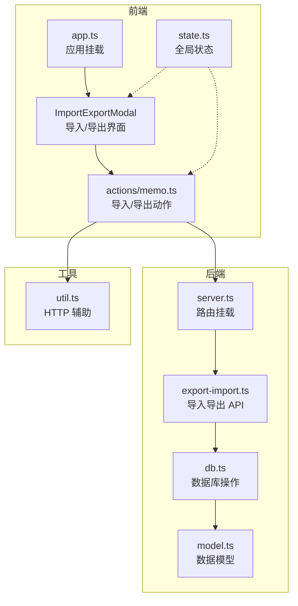
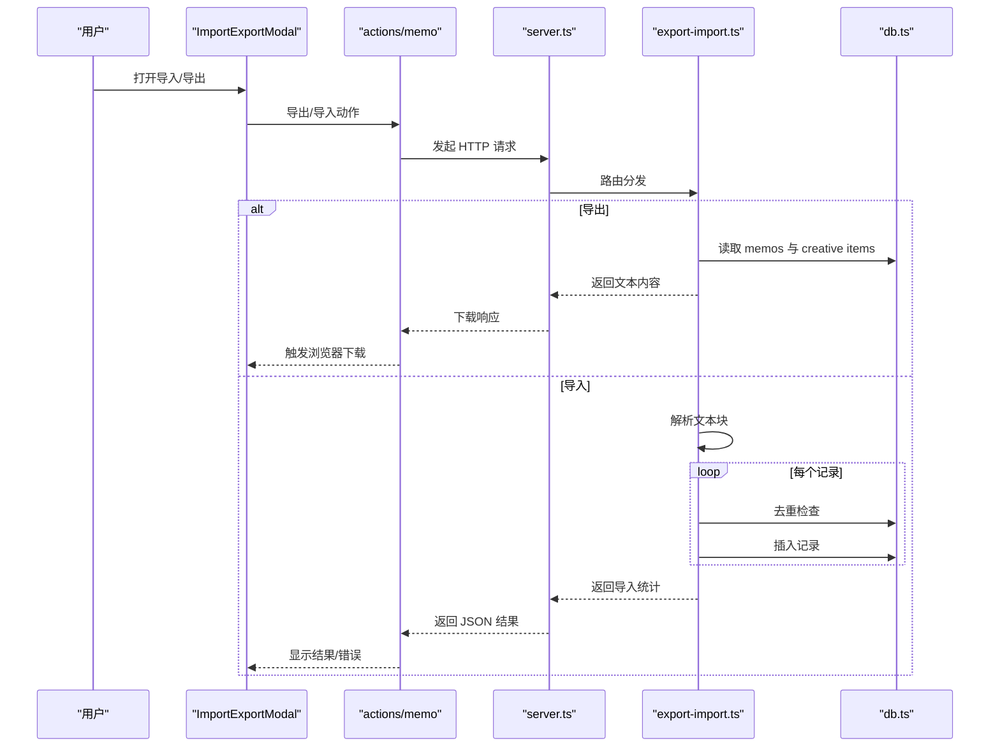
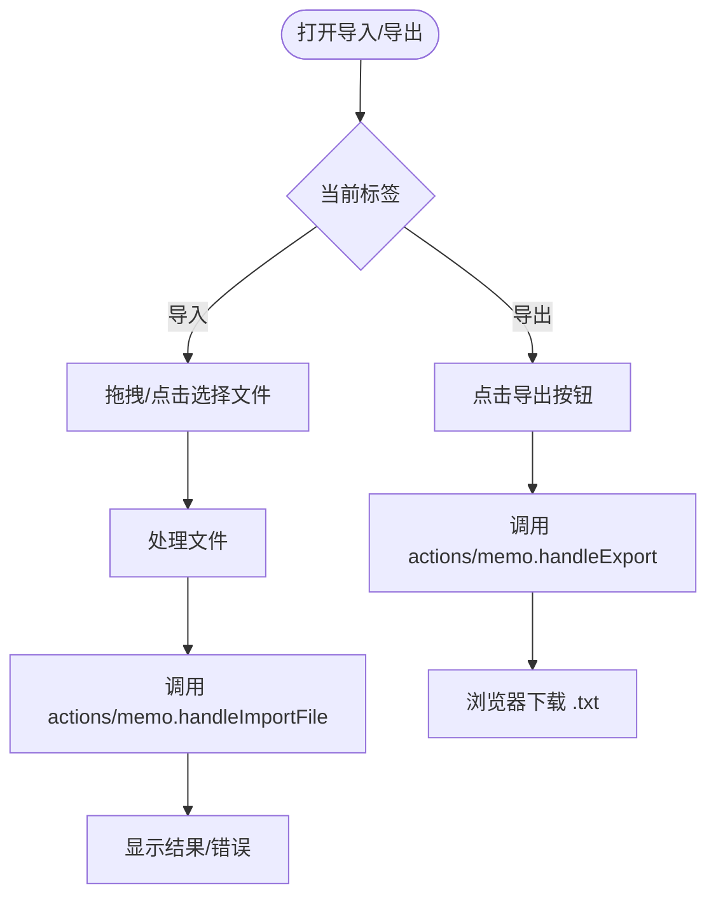
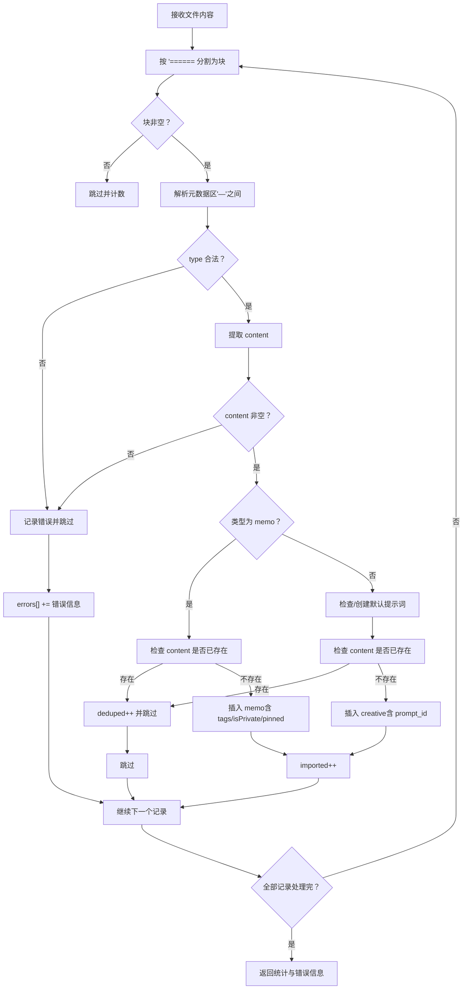
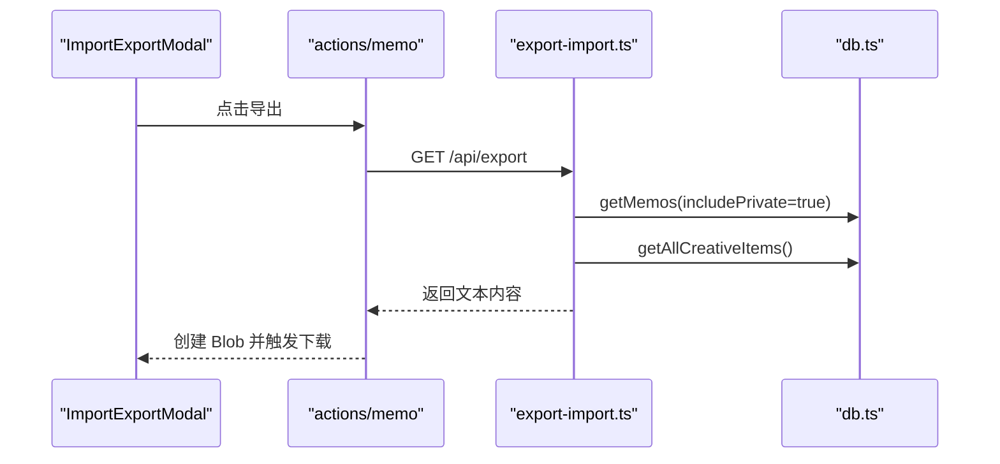
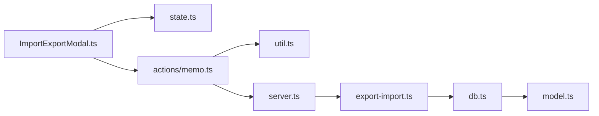

# 导入导出功能

<cite>
**本文档引用的文件**
- [ImportExportModal.ts](file://src/frontend/admin/components/ImportExportModal.ts)
- [export-import.ts](file://src/api/export-import.ts)
- [state.ts](file://src/frontend/admin/state.ts)
- [memo.ts](file://src/frontend/admin/actions/memo.ts)
- [db.ts](file://src/db.ts)
- [model.ts](file://src/model.ts)
- [util.ts](file://src/helper/util.ts)
- [app.ts](file://src/frontend/admin/app.ts)
- [server.ts](file://src/server.ts)
- [README.md](file://README.md)
</cite>

## 目录
1. [简介](#简介)
2. [项目结构](#项目结构)
3. [核心组件](#核心组件)
4. [架构总览](#架构总览)
5. [详细组件分析](#详细组件分析)
6. [依赖关系分析](#依赖关系分析)
7. [性能考量](#性能考量)
8. [故障排除指南](#故障排除指南)
9. [结论](#结论)
10. [附录](#附录)

## 简介
本文件详细说明了 Memos 应用的导入导出功能设计与实现，涵盖 ImportExportModal 组件的前端交互、文件上传与下载流程、数据格式处理、导入导出的后端实现、错误处理与用户反馈机制，以及数据完整性检查与冲突解决策略。同时提供使用指南与最佳实践，帮助用户进行数据备份、迁移与恢复操作。

## 项目结构
导入导出功能涉及以下关键模块：
- 前端组件：ImportExportModal（UI 交互）、state（全局状态）、actions/memo（业务动作）
- 后端 API：export-import（导入导出路由与处理逻辑）
- 数据层：db（数据库操作与导入专用函数）
- 工具与入口：util（HTTP 辅助）、server.ts（路由挂载）、model.ts（数据模型）

图表来源
- [app.ts:224-232](file://src/frontend/admin/app.ts#L224-L232)
- [ImportExportModal.ts:20-199](file://src/frontend/admin/components/ImportExportModal.ts#L20-L199)
- [memo.ts:167-230](file://src/frontend/admin/actions/memo.ts#L167-L230)
- [server.ts:40-45](file://src/server.ts#L40-L45)
- [export-import.ts:14-287](file://src/api/export-import.ts#L14-L287)
- [db.ts:404-483](file://src/db.ts#L404-L483)
- [util.ts:9-25](file://src/helper/util.ts#L9-L25)

章节来源
- [app.ts:224-232](file://src/frontend/admin/app.ts#L224-L232)
- [server.ts:40-45](file://src/server.ts#L40-L45)

## 核心组件
- ImportExportModal：提供“导入/导出”标签页，支持拖拽上传与点击选择文件，导出按钮触发下载，导入区域显示结果与错误信息。
- actions/memo：封装导入导出的动作，包括打开/关闭模态框、发起导出请求、提交导入文件、更新状态与错误信息。
- export-import API：后端路由，负责导出文本文件与解析导入文件，执行去重与批量插入。
- db 层：提供导入专用的插入函数、内容存在性检查、创意项默认提示词保证等。
- state：集中管理导入导出相关的 UI 状态（是否打开、当前标签、加载状态、结果与错误信息）。

章节来源
- [ImportExportModal.ts:20-199](file://src/frontend/admin/components/ImportExportModal.ts#L20-L199)
- [memo.ts:167-230](file://src/frontend/admin/actions/memo.ts#L167-L230)
- [export-import.ts:165-287](file://src/api/export-import.ts#L165-L287)
- [db.ts:404-483](file://src/db.ts#L404-L483)
- [state.ts:92-103](file://src/frontend/admin/state.ts#L92-L103)

## 架构总览
导入导出的整体流程如下：
- 前端通过 ImportExportModal 触发动作；actions/memo 调用 util 的 API 辅助方法，向后端发送请求。
- 后端 export-import API 接收请求，导出时读取 memos 和 creative items，格式化为自定义文本格式并返回下载；导入时解析文本块，逐条去重并批量插入。
- 数据库层提供导入专用函数与存在性检查，确保数据完整性与一致性。

图表来源
- [ImportExportModal.ts:20-199](file://src/frontend/admin/components/ImportExportModal.ts#L20-L199)
- [memo.ts:180-230](file://src/frontend/admin/actions/memo.ts#L180-L230)
- [server.ts:40-45](file://src/server.ts#L40-L45)
- [export-import.ts:165-287](file://src/api/export-import.ts#L165-L287)
- [db.ts:404-483](file://src/db.ts#L404-L483)

## 详细组件分析

### ImportExportModal 组件
- 功能要点
  - 提供“导出”和“导入”两个标签页，切换时清空上次结果与错误。
  - 导出页：点击导出按钮触发下载，禁用期间显示加载状态。
  - 导入页：支持拖拽上传与点击选择文件；显示导入结果与错误信息；拖拽区域高亮与加载状态。
  - 支持的文件类型：仅接受 .txt 文本文件。
- 事件处理
  - 拖拽事件：阻止默认行为，设置拖拽状态，提取文件并调用导入处理。
  - 文件选择：清空 input 值避免重复触发，提取文件并调用导入处理。
  - 关闭模态框：点击遮罩层关闭，清空结果与错误。

图表来源
- [ImportExportModal.ts:20-199](file://src/frontend/admin/components/ImportExportModal.ts#L20-L199)
- [memo.ts:180-230](file://src/frontend/admin/actions/memo.ts#L180-L230)

章节来源
- [ImportExportModal.ts:20-199](file://src/frontend/admin/components/ImportExportModal.ts#L20-L199)

### 导入功能实现
- 文件解析
  - 将上传的文本按“======”分割为记录块，过滤空块。
  - 对每个块解析元数据区（“—”之间的键值对），校验必需字段（type、content）。
  - 支持 memo 的 tags（逗号分隔）、isPrivate（布尔字符串）、pinned（时间戳）等字段；支持 creative 类型。
- 数据验证
  - 必填字段缺失或格式不合法则跳过该记录并记录错误。
  - 日期字段若为空，回退到当前时间。
- 去重与冲突解决
  - 导入 memo 时检查 content 是否已存在，存在则跳过并计入 deduped。
  - 导入 creative 时同样检查 content，不存在才插入。
  - 若 creative 缺少 prompt_id，则自动创建默认提示词并复用。
- 批量导入逻辑
  - 逐条解析与校验，遇到异常记录记录错误但继续处理后续记录。
  - 最终返回导入统计（imported、skipped、deduped）与错误列表。

图表来源
- [export-import.ts:156-287](file://src/api/export-import.ts#L156-L287)
- [db.ts:404-474](file://src/db.ts#L404-L474)

章节来源
- [export-import.ts:183-287](file://src/api/export-import.ts#L183-L287)
- [db.ts:404-474](file://src/db.ts#L404-L474)

### 导出功能实现
- 数据序列化
  - 读取所有 memos 与 creative items，按顺序构建记录块。
  - memos：输出 date、tags（数组转逗号分隔）、isPrivate（布尔转字符串）、type=memo、可选 pinned。
  - creative：输出 date、type=creative。
  - 每个记录块以“—”分隔元数据与内容。
- 文件生成与下载
  - 后端直接返回 text/plain 响应，设置 Content-Disposition 为附件并命名带日期。
  - 前端通过 fetch 获取 Blob，创建临时 URL 并触发浏览器下载。

图表来源
- [memo.ts:180-205](file://src/frontend/admin/actions/memo.ts#L180-L205)
- [export-import.ts:165-181](file://src/api/export-import.ts#L165-L181)
- [db.ts:122-169](file://src/db.ts#L122-L169)
- [db.ts:477-483](file://src/db.ts#L477-L483)

章节来源
- [memo.ts:180-205](file://src/frontend/admin/actions/memo.ts#L180-L205)
- [export-import.ts:165-181](file://src/api/export-import.ts#L165-L181)

### 数据格式与兼容性
- 导入/导出格式
  - 自定义纯文本格式，记录块以“======”分隔。
  - 元数据区以“—”包围，键值对形式（如 type、date、tags、isPrivate、pinned）。
  - content 为元数据区之后的所有文本。
- 兼容性考虑
  - 支持 memo 的 tags 字段（兼容旧版单 tag 字段）。
  - 支持 memo 的 isPrivate 字段（布尔字符串）。
  - 支持 memo 的 pinned 时间戳字段。
  - 支持 creative 类型记录。
- 文件类型
  - 导入：仅接受 .txt 文本文件。
  - 导出：生成 .txt 文本文件。

章节来源
- [export-import.ts:24-74](file://src/api/export-import.ts#L24-L74)
- [export-import.ts:78-154](file://src/api/export-import.ts#L78-L154)
- [ImportExportModal.ts:185-189](file://src/frontend/admin/components/ImportExportModal.ts#L185-L189)

### 错误处理与用户反馈
- 前端
  - 导入：捕获网络错误与 JSON 错误，显示在 importError 中；成功时显示 importResult。
  - 导出：捕获响应失败与错误消息，显示在 importError 中。
  - 加载状态：导出/导入期间禁用按钮并显示加载文案。
- 后端
  - 导入：表单解析失败、空文件、无效记录等均返回 400 与错误信息。
  - 导入：记录每条失败的索引与原因，最终汇总返回。
  - 导出：直接返回文本内容，未显式错误处理（由前端统一处理）。

章节来源
- [memo.ts:180-230](file://src/frontend/admin/actions/memo.ts#L180-L230)
- [export-import.ts:183-287](file://src/api/export-import.ts#L183-L287)

### 数据完整性检查与冲突解决
- 去重策略
  - memo：按 content 完全一致判断是否存在，存在则跳过并计入 deduped。
  - creative：按 content 完全一致判断是否存在，存在则跳过并计入 deduped。
- 冲突解决
  - 导入 creative 时若缺少 prompt_id，自动创建默认提示词并使用其 id。
  - 导入 memo 时若缺少日期，回退到当前时间。
- 事务与一致性
  - 导入过程中逐条处理，遇到错误记录会跳过并继续处理其他记录，保证整体导入的连续性。

章节来源
- [db.ts:458-474](file://src/db.ts#L458-L474)
- [export-import.ts:232-266](file://src/api/export-import.ts#L232-L266)
- [db.ts:451-456](file://src/db.ts#L451-L456)

## 依赖关系分析
- 组件耦合
  - ImportExportModal 依赖 state（控制显示与状态）与 actions/memo（触发导入/导出）。
  - actions/memo 依赖 util（API 辅助）与 server.ts（路由挂载）。
  - export-import.ts 依赖 db.ts（数据读取与导入）。
- 外部依赖
  - Hono（后端路由框架）
  - Bun:sqlite（SQLite 数据库）
  - VanJS（前端响应式 UI）

图表来源
- [ImportExportModal.ts:1-16](file://src/frontend/admin/components/ImportExportModal.ts#L1-L16)
- [memo.ts:1-26](file://src/frontend/admin/actions/memo.ts#L1-L26)
- [server.ts:1-10](file://src/server.ts#L1-L10)
- [export-import.ts:1-14](file://src/api/export-import.ts#L1-L14)
- [db.ts:1-2](file://src/db.ts#L1-L2)
- [model.ts:1-35](file://src/model.ts#L1-L35)

章节来源
- [server.ts:40-45](file://src/server.ts#L40-L45)

## 性能考量
- 导入性能
  - 逐条解析与校验，复杂度为 O(n)，其中 n 为记录数。
  - 去重查询为 O(1)（content 唯一索引），整体导入为线性扫描。
- 导出性能
  - 读取 memos 与 creative items 后拼接字符串，复杂度 O(n)。
  - 建议在大量数据时分批导出或压缩（当前实现为纯文本，未压缩）。
- 前端交互
  - 使用 Blob 与临时 URL 下载，避免内存占用过大。
  - 加载状态与禁用按钮提升用户体验。

[本节为通用性能讨论，无需特定文件来源]

## 故障排除指南
- 常见问题
  - 导入失败：检查文件是否为 .txt，内容是否包含合法记录块与元数据。
  - 导出失败：检查网络连接与后端服务状态。
  - 重复记录：导入时会自动去重，若仍出现重复，检查 content 是否完全一致。
- 错误定位
  - 查看前端 importError 与 importResult。
  - 后端返回的错误信息包含具体记录索引与原因。
- 修复建议
  - 重新生成导出文件，确保格式正确。
  - 清理重复内容后再导入。
  - 如需保留历史时间，请在导出文件中正确填写 date 字段。

章节来源
- [memo.ts:180-230](file://src/frontend/admin/actions/memo.ts#L180-L230)
- [export-import.ts:218-287](file://src/api/export-import.ts#L218-L287)

## 结论
导入导出功能通过简洁的自定义文本格式实现了跨平台的数据迁移能力。前端提供直观的拖拽与点击上传体验，后端完成严格的解析、去重与批量导入，保障数据完整性与一致性。当前版本专注于文本格式与基础字段，未来可扩展为 JSON/CSV 等更多格式以满足不同场景需求。

[本节为总结性内容，无需特定文件来源]

## 附录

### 使用指南与最佳实践
- 数据备份
  - 定期导出数据，保存为 .txt 文件，建议按日期命名以便归档。
- 数据迁移
  - 在新环境首次启动后，先导入旧数据，再进行日常使用。
- 数据恢复
  - 若误删数据，可从最近一次导出文件中恢复。
- 导入注意事项
  - 确保导入文件为 .txt 文本格式。
  - 元数据字段必须包含 type 与 content，memo 可包含 tags、isPrivate、pinned 等。
  - 若缺少 prompt_id，系统会自动创建默认提示词。

章节来源
- [ImportExportModal.ts:185-189](file://src/frontend/admin/components/ImportExportModal.ts#L185-L189)
- [export-import.ts:24-74](file://src/api/export-import.ts#L24-L74)
- [db.ts:451-456](file://src/db.ts#L451-L456)

### API 定义概览
- 导出
  - 方法：GET
  - 路径：/api/export
  - 认证：需要
  - 响应：text/plain，Content-Disposition 为附件，文件名为包含日期的 .txt
- 导入
  - 方法：POST
  - 路径：/api/import
  - 认证：需要
  - 请求体：multipart/form-data，包含一个文件字段（名称任意）
  - 成功响应：JSON，包含 imported、skipped、deduped、message（可选 errors）

章节来源
- [export-import.ts:165-181](file://src/api/export-import.ts#L165-L181)
- [export-import.ts:183-287](file://src/api/export-import.ts#L183-L287)