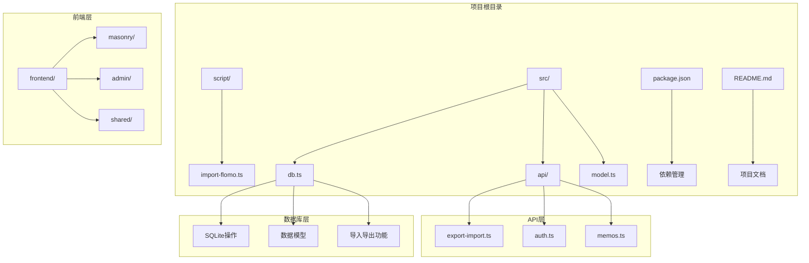
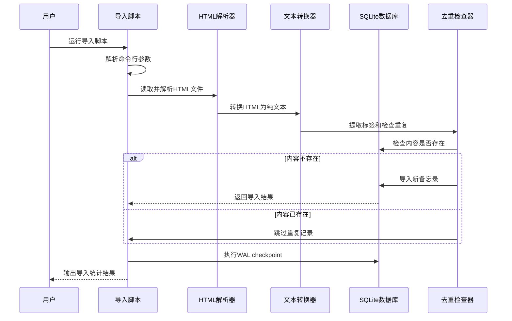
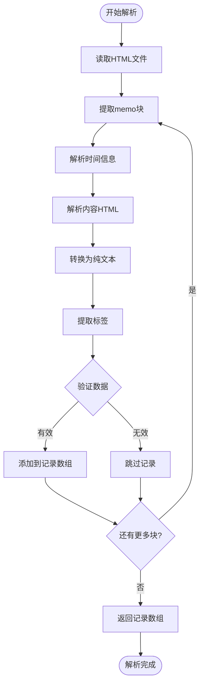
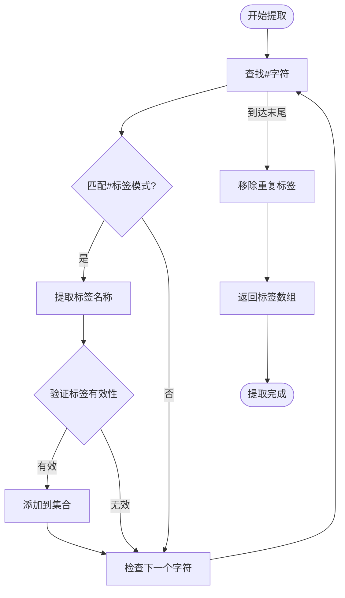
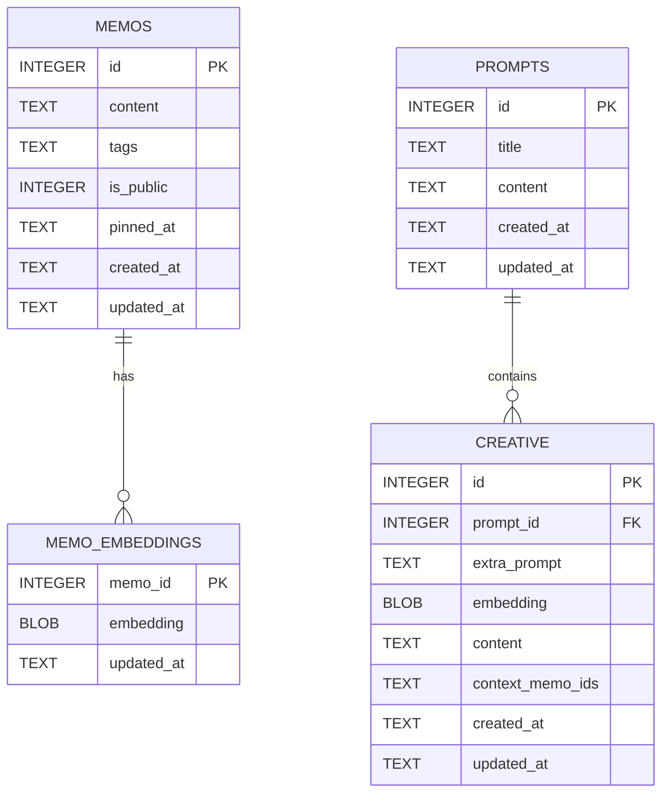
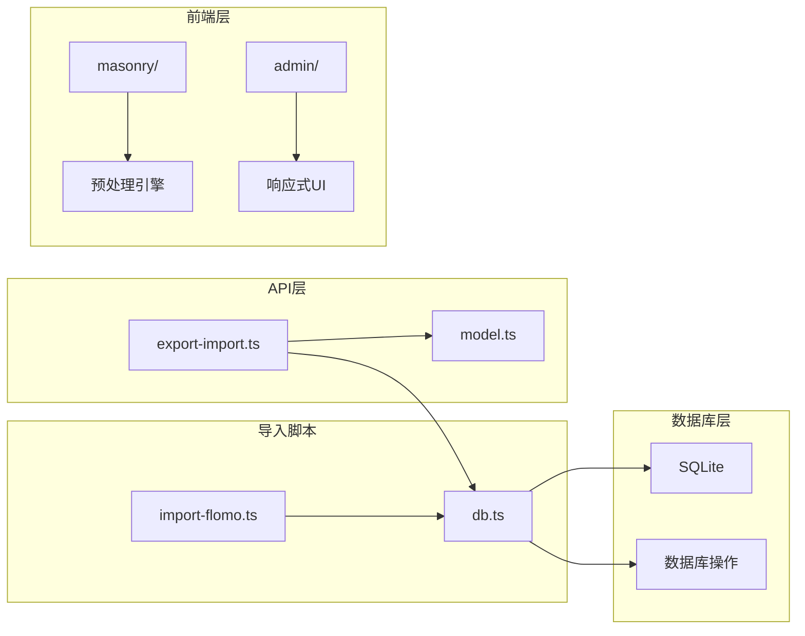

# Flomo HTML导入脚本

<cite>
**本文档引用的文件**
- [import-flomo.ts](file://script/import-flomo.ts)
- [export-import.ts](file://src/api/export-import.ts)
- [db.ts](file://src/db.ts)
- [model.ts](file://src/model.ts)
- [README.md](file://README.md)
- [package.json](file://package.json)
</cite>

## 目录
1. [简介](#简介)
2. [项目结构](#项目结构)
3. [核心组件](#核心组件)
4. [架构概览](#架构概览)
5. [详细组件分析](#详细组件分析)
6. [依赖关系分析](#依赖关系分析)
7. [性能考虑](#性能考虑)
8. [故障排除指南](#故障排除指南)
9. [结论](#结论)

## 简介

Flomo HTML导入脚本是一个专门用于将Flomo导出的HTML文件中的备忘录数据批量导入到MemOS系统中的工具。该脚本通过解析Flomo的HTML格式，提取备忘录内容、时间和标签信息，并将其转换为MemOS可识别的数据格式，最终导入到SQLite数据库中。

### 主要功能特性

- **HTML解析**：准确解析Flomo导出的HTML文件结构
- **内容转换**：将HTML内容转换为纯文本格式
- **标签提取**：自动从内容中提取#标签格式的标签
- **去重处理**：避免重复导入相同内容的备忘录
- **批量导入**：支持一次性导入大量备忘录记录
- **错误处理**：完善的错误处理和日志输出机制

## 项目结构

该项目采用模块化的架构设计，主要包含以下核心目录和文件：

**图表来源**
- [import-flomo.ts:1-236](file://script/import-flomo.ts#L1-L236)
- [db.ts:1-484](file://src/db.ts#L1-L484)
- [export-import.ts:1-288](file://src/api/export-import.ts#L1-L288)

**章节来源**
- [README.md:25-45](file://README.md#L25-L45)
- [package.json:1-26](file://package.json#L1-L26)

## 核心组件

### 导入脚本核心组件

脚本主要由以下几个核心组件构成：

1. **FlomoRecord接口**：定义Flomo记录的数据结构
2. **HTML实体解码器**：处理HTML特殊字符
3. **HTML转纯文本转换器**：将HTML内容转换为可读的纯文本
4. **标签提取器**：从文本中提取#标签格式的标签
5. **HTML解析器**：解析Flomo导出的HTML文件
6. **主流程控制器**：协调整个导入过程

### 数据库集成组件

- **initDb函数**：初始化SQLite数据库连接
- **importMemo函数**：将单个备忘录导入数据库
- **memoContentExists函数**：检查内容是否已存在
- **getDb函数**：获取数据库连接实例

**章节来源**
- [import-flomo.ts:13-134](file://script/import-flomo.ts#L13-L134)
- [db.ts:15-61](file://src/db.ts#L15-L61)
- [db.ts:407-428](file://src/db.ts#L407-L428)

## 架构概览

**图表来源**
- [import-flomo.ts:138-233](file://script/import-flomo.ts#L138-L233)
- [db.ts:458-465](file://src/db.ts#L458-L465)

## 详细组件分析

### HTML解析器组件

HTML解析器是整个脚本的核心组件，负责从Flomo导出的HTML文件中提取备忘录数据。

#### 解析流程

**图表来源**
- [import-flomo.ts:96-134](file://script/import-flomo.ts#L96-L134)

#### 关键实现细节

- **正则表达式匹配**：使用复杂的正则表达式来定位和提取每个备忘录块
- **嵌套块处理**：正确处理嵌套的HTML结构
- **边界检测**：智能检测块的边界，包括下一个同类div、容器结束标签或文件末尾

**章节来源**
- [import-flomo.ts:96-134](file://script/import-flomo.ts#L96-L134)

### 文本转换器组件

文本转换器负责将HTML内容转换为纯文本格式，确保导入的数据格式统一且可读。

#### 转换规则

| HTML元素 | 转换规则 | 示例 |
|---------|---------|------|
| ` ` 和 `
` | 转换为换行符 | ` ` → `\n` |
| 块级元素结束标签 | 转换为换行符 | `
` → `\n` |
| 列表和表格容器结束标签 | 转换为换行符 | `</ul>` → `\n` |
| 其余HTML标签 | 完全移除 | `<strong>` → "" |
| HTML实体 | 解码为对应字符 | `&amp;` → `&` |

**章节来源**
- [import-flomo.ts:49-72](file://script/import-flomo.ts#L49-L72)

### 标签提取器组件

标签提取器从纯文本中自动识别和提取#标签格式的标签。

#### 提取算法

**图表来源**
- [import-flomo.ts:81-88](file://script/import-flomo.ts#L81-L88)

**章节来源**
- [import-flomo.ts:81-88](file://script/import-flomo.ts#L81-L88)

### 数据库集成组件

数据库集成组件提供了与SQLite数据库交互的所有功能，包括初始化、查询、插入和更新操作。

#### 数据库模式

**图表来源**
- [db.ts:18-60](file://src/db.ts#L18-L60)

**章节来源**
- [db.ts:18-60](file://src/db.ts#L18-L60)
- [model.ts:1-28](file://src/model.ts#L1-L28)

## 依赖关系分析

### 外部依赖

项目的主要外部依赖包括：

| 依赖包 | 版本 | 用途 |
|-------|------|------|
| bun:sqlite | 内置 | SQLite数据库操作 |
| hono | ^4.7.10 | Web框架 |
| @chenglou/pretext | ^0.0.6 | 文字排版引擎 |
| vanjs-core | ^1.6.0 | 响应式UI框架 |
| marked | ^18.0.4 | Markdown解析器 |
| dompurify | ^3.4.5 | HTML清理工具 |

### 内部模块依赖

**图表来源**
- [import-flomo.ts:9](file://script/import-flomo.ts#L9)
- [export-import.ts:3-12](file://src/api/export-import.ts#L3-L12)

**章节来源**
- [package.json:19-25](file://package.json#L19-L25)
- [import-flomo.ts:9](file://script/import-flomo.ts#L9)

## 性能考虑

### 内存使用优化

- **流式处理**：脚本采用一次性读取整个文件的方式，适合处理中等大小的HTML文件
- **批量导入**：所有记录导入完成后才执行WAL checkpoint，减少数据库I/O操作
- **去重检查**：使用内存中的去重检查机制，避免重复的数据库查询

### 导入性能优化

- **正则表达式优化**：使用预编译的正则表达式提高匹配效率
- **索引利用**：数据库表已建立适当的索引以优化查询性能
- **事务处理**：批量导入过程中使用SQLite的事务机制提高写入速度

### 错误处理策略

- **渐进式错误处理**：单个记录的导入失败不会影响其他记录的处理
- **详细日志输出**：提供详细的进度和错误信息，便于调试和监控
- **优雅降级**：遇到格式不兼容的记录时会跳过而不是中断整个过程

## 故障排除指南

### 常见问题及解决方案

#### 文件读取问题

**问题**：脚本报错显示文件不存在或读取失败
**解决方案**：
1. 确认HTML文件路径正确
2. 检查文件权限设置
3. 验证文件编码格式为UTF-8

#### HTML格式兼容性问题

**问题**：解析到的记录数量为0或格式不正确
**解决方案**：
1. 确认使用的是Flomo官方导出的HTML格式
2. 检查HTML文件是否完整且未被修改
3. 验证HTML结构符合预期格式

#### 数据库连接问题

**问题**：导入过程中出现数据库连接错误
**解决方案**：
1. 检查SQLite数据库文件权限
2. 确认数据库文件未被其他进程占用
3. 验证磁盘空间充足

#### 重复数据处理

**问题**：大量记录被标记为重复
**解决方案**：
1. 检查去重机制是否正常工作
2. 验证内容比较逻辑
3. 考虑手动清理数据库中的重复记录

**章节来源**
- [import-flomo.ts:146-160](file://script/import-flomo.ts#L146-L160)
- [import-flomo.ts:184-213](file://script/import-flomo.ts#L184-L213)

## 结论

Flomo HTML导入脚本是一个功能完整、设计合理的数据迁移工具。它成功地解决了从Flomo到MemOS的数据迁移需求，具有以下显著特点：

### 技术优势

- **模块化设计**：清晰的功能分离和职责划分
- **健壮的错误处理**：完善的异常处理和用户反馈机制
- **高效的性能**：优化的算法和数据库操作
- **良好的扩展性**：易于维护和功能扩展

### 使用建议

1. **备份数据**：在进行大规模导入前务必备份现有数据
2. **测试环境**：先在测试环境中验证导入效果
3. **监控进度**：关注导入过程中的日志输出
4. **验证结果**：导入完成后检查数据完整性和准确性

该脚本为用户提供了从Flomo迁移到MemOS的便捷途径，简化了数据迁移过程，提高了用户体验。其设计原则和实现方式也为类似的数据迁移场景提供了有价值的参考。