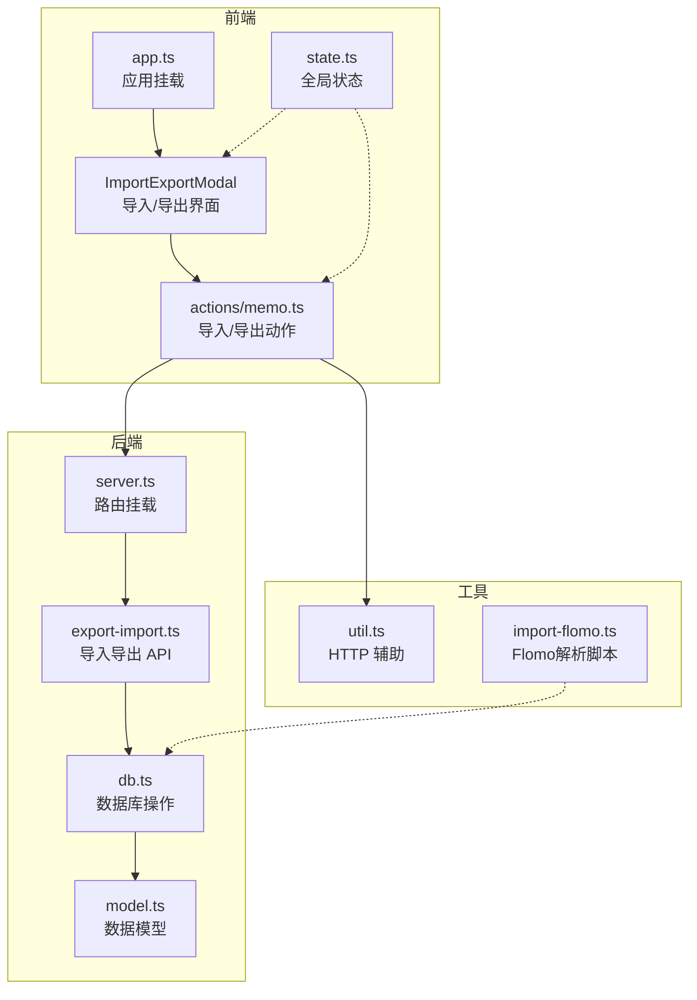
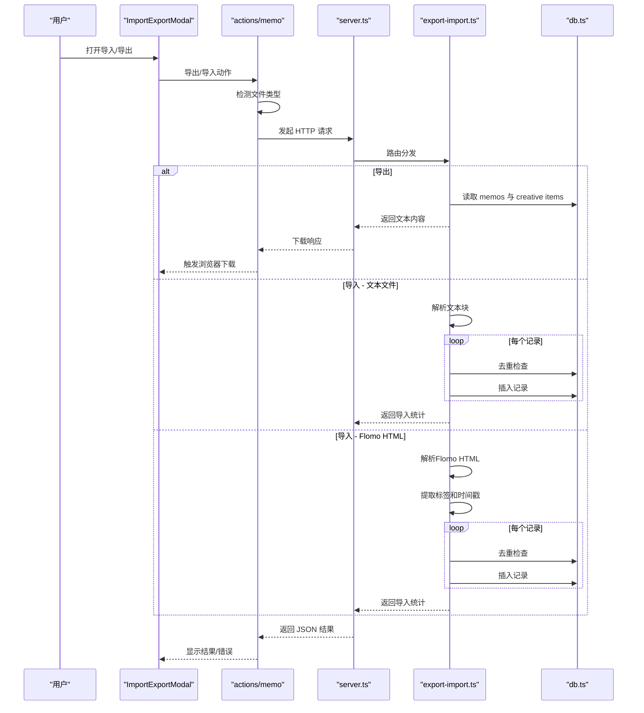
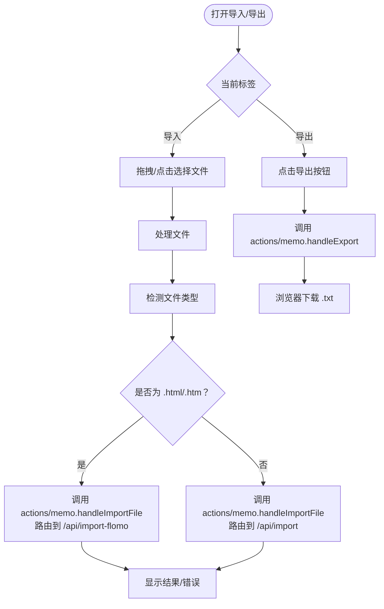
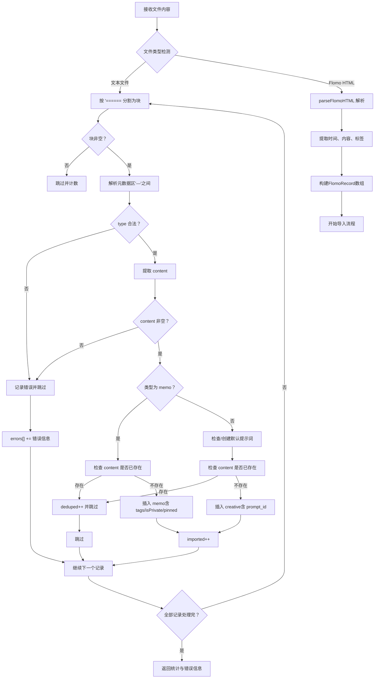
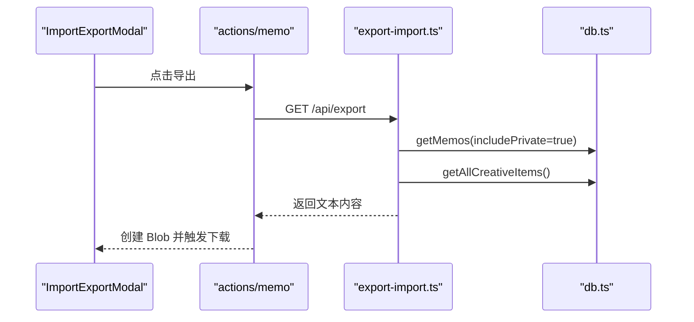
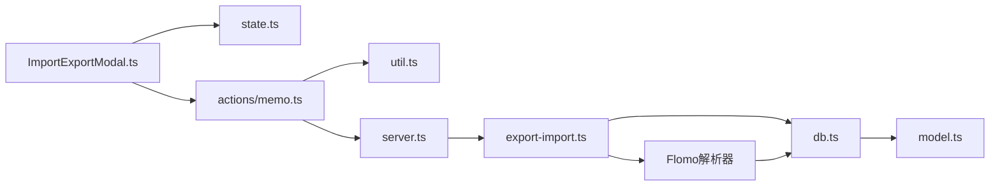

# 导入导出功能

<cite>
**本文档引用的文件**
- [ImportExportModal.ts](file://src/frontend/admin/components/ImportExportModal.ts)
- [export-import.ts](file://src/api/export-import.ts)
- [state.ts](file://src/frontend/admin/state.ts)
- [memo.ts](file://src/frontend/admin/actions/memo.ts)
- [db.ts](file://src/db.ts)
- [model.ts](file://src/model.ts)
- [util.ts](file://src/helper/util.ts)
- [app.ts](file://src/frontend/admin/app.ts)
- [server.ts](file://src/server.ts)
- [import-flomo.ts](file://script/import-flomo.ts)
- [README.md](file://README.md)
</cite>

## 更新摘要
**变更内容**
- 新增Flomo HTML文件导入功能，支持.html和.htm文件类型
- 前端自动检测Flomo HTML文件并路由到/api/import-flomo端点
- 后端实现专门的Flomo HTML解析器，支持标签提取和时间戳解析
- 扩展文件类型支持，accept属性包含.html和.htm
- 新增独立的Flomo导入API端点

## 目录
1. [简介](#简介)
2. [项目结构](#项目结构)
3. [核心组件](#核心组件)
4. [架构总览](#架构总览)
5. [详细组件分析](#详细组件分析)
6. [Flomo HTML导入功能](#flomo-html导入功能)
7. [依赖关系分析](#依赖关系分析)
8. [性能考量](#性能考量)
9. [故障排除指南](#故障排除指南)
10. [结论](#结论)
11. [附录](#附录)

## 简介
本文件详细说明了 Memos 应用的导入导出功能设计与实现，涵盖 ImportExportModal 组件的前端交互、文件上传与下载流程、数据格式处理、导入导出的后端实现、错误处理与用户反馈机制，以及数据完整性检查与冲突解决策略。特别关注新增的Flomo HTML文件导入功能，支持.html和.htm文件类型的自动检测和路由。同时提供使用指南与最佳实践，帮助用户进行数据备份、迁移与恢复操作。

## 项目结构
导入导出功能涉及以下关键模块：
- 前端组件：ImportExportModal（UI 交互）、state（全局状态）、actions/memo（业务动作）
- 后端 API：export-import（导入导出路由与处理逻辑）
- 数据层：db（数据库操作与导入专用函数）
- 工具与入口：util（HTTP 辅助）、server.ts（路由挂载）、model.ts（数据模型）
- Flomo工具：import-flomo.ts（独立的Flomo HTML解析脚本）

**图表来源**
- [app.ts:224-232](file://src/frontend/admin/app.ts#L224-L232)
- [ImportExportModal.ts:20-199](file://src/frontend/admin/components/ImportExportModal.ts#L20-L199)
- [memo.ts:167-235](file://src/frontend/admin/actions/memo.ts#L167-L235)
- [server.ts:40-45](file://src/server.ts#L40-L45)
- [export-import.ts:14-469](file://src/api/export-import.ts#L14-L469)
- [db.ts:404-483](file://src/db.ts#L404-L483)
- [util.ts:9-25](file://src/helper/util.ts#L9-L25)
- [import-flomo.ts:1-236](file://script/import-flomo.ts#L1-L236)

**章节来源**
- [app.ts:224-232](file://src/frontend/admin/app.ts#L224-L232)
- [server.ts:40-45](file://src/server.ts#L40-L45)

## 核心组件
- ImportExportModal：提供"导入/导出"标签页，支持拖拽上传与点击选择文件，导出按钮触发下载，导入区域显示结果与错误信息。现已支持.html和.htm文件类型的自动检测。
- actions/memo：封装导入导出的动作，包括打开/关闭模态框、发起导出请求、提交导入文件、更新状态与错误信息。新增Flomo HTML文件的自动路由功能。
- export-import API：后端路由，负责导出文本文件与解析导入文件，执行去重与批量插入。新增/api/import-flomo端点用于Flomo HTML文件导入。
- db 层：提供导入专用的插入函数、内容存在性检查、创意项默认提示词保证等。
- state：集中管理导入导出相关的 UI 状态（是否打开、当前标签、加载状态、结果与错误信息）。
- import-flomo.ts：独立的Flomo HTML解析脚本，可在命令行环境中使用。

**章节来源**
- [ImportExportModal.ts:20-199](file://src/frontend/admin/components/ImportExportModal.ts#L20-L199)
- [memo.ts:167-235](file://src/frontend/admin/actions/memo.ts#L167-L235)
- [export-import.ts:165-469](file://src/api/export-import.ts#L165-L469)
- [db.ts:404-483](file://src/db.ts#L404-L483)
- [state.ts:92-103](file://src/frontend/admin/state.ts#L92-L103)
- [import-flomo.ts:1-236](file://script/import-flomo.ts#L1-L236)

## 架构总览
导入导出的整体流程如下：
- 前端通过 ImportExportModal 触发动作；actions/memo 调用 util 的 API 辅助方法，向后端发送请求。
- 后端 export-import API 接收请求，导出时读取 memos 和 creative items，格式化为自定义文本格式并返回下载；导入时根据文件类型自动路由到相应端点。
- 对于Flomo HTML文件，自动检测.html和.htm扩展名并路由到/api/import-flomo端点，使用专门的解析器处理。
- 数据库层提供导入专用函数与存在性检查，确保数据完整性与一致性。

**图表来源**
- [ImportExportModal.ts:20-199](file://src/frontend/admin/components/ImportExportModal.ts#L20-L199)
- [memo.ts:180-235](file://src/frontend/admin/actions/memo.ts#L180-L235)
- [server.ts:40-45](file://src/server.ts#L40-L45)
- [export-import.ts:165-469](file://src/api/export-import.ts#L165-L469)
- [db.ts:404-483](file://src/db.ts#L404-L483)

## 详细组件分析

### ImportExportModal 组件
- 功能要点
  - 提供"导出"和"导入"两个标签页，切换时清空上次结果与错误。
  - 导出页：点击导出按钮触发下载，禁用期间显示加载状态。
  - 导入页：支持拖拽上传与点击选择文件；显示导入结果与错误信息；拖拽区域高亮与加载状态。
  - 支持的文件类型：.txt 文本文件、.html Flomo导出文件、.htm Flomo导出文件。
- 事件处理
  - 拖拽事件：阻止默认行为，设置拖拽状态，提取文件并调用导入处理。
  - 文件选择：清空 input 值避免重复触发，提取文件并调用导入处理。
  - 关闭模态框：点击遮罩层关闭，清空结果与错误。

**图表来源**
- [ImportExportModal.ts:20-199](file://src/frontend/admin/components/ImportExportModal.ts#L20-L199)
- [memo.ts:180-235](file://src/frontend/admin/actions/memo.ts#L180-L235)

**章节来源**
- [ImportExportModal.ts:20-199](file://src/frontend/admin/components/ImportExportModal.ts#L20-L199)

### 导入功能实现
- 文件解析
  - **文本文件解析**：将上传的文本按"======"分割为记录块，过滤空块。
  - **Flomo HTML解析**：使用专门的HTML解析器，提取
块，解析时间、内容和标签。
  - 对每个块解析元数据区（"—"之间的键值对），校验必需字段（type、content）。
  - 支持 memo 的 tags（逗号分隔）、isPrivate（布尔字符串）、pinned（时间戳）等字段；支持 creative 类型。
- 数据验证
  - 必填字段缺失或格式不合法则跳过该记录并记录错误。
  - 日期字段若为空，回退到当前时间。
- 去重与冲突解决
  - 导入 memo 时检查 content 是否已存在，存在则跳过并计入 deduped。
  - 导入 creative 时同样检查 content，不存在才插入。
  - 若 creative 缺少 prompt_id，则自动创建默认提示词并复用。
- 批量导入逻辑
  - 逐条解析与校验，遇到异常记录记录错误但继续处理后续记录。
  - 最终返回导入统计（imported、skipped、deduped）与错误列表。

**图表来源**
- [export-import.ts:156-469](file://src/api/export-import.ts#L156-L469)
- [db.ts:404-474](file://src/db.ts#L404-L474)

**章节来源**
- [export-import.ts:183-469](file://src/api/export-import.ts#L183-L469)
- [db.ts:404-474](file://src/db.ts#L404-L474)

### 导出功能实现
- 数据序列化
  - 读取所有 memos 与 creative items，按顺序构建记录块。
  - memos：输出 date、tags（数组转逗号分隔）、isPrivate（布尔转字符串）、type=memo、可选 pinned。
  - creative：输出 date、type=creative。
  - 每个记录块以"—"分隔元数据与内容。
- 文件生成与下载
  - 后端直接返回 text/plain 响应，设置 Content-Disposition 为附件并命名带日期。
  - 前端通过 fetch 获取 Blob，创建临时 URL 并触发浏览器下载。

**图表来源**
- [memo.ts:180-205](file://src/frontend/admin/actions/memo.ts#L180-L205)
- [export-import.ts:165-181](file://src/api/export-import.ts#L165-L181)
- [db.ts:122-169](file://src/db.ts#L122-L169)
- [db.ts:477-483](file://src/db.ts#L477-L483)

**章节来源**
- [memo.ts:180-205](file://src/frontend/admin/actions/memo.ts#L180-L205)
- [export-import.ts:165-181](file://src/api/export-import.ts#L165-L181)

### 数据格式与兼容性
- 导入/导出格式
  - **文本文件格式**：自定义纯文本格式，记录块以"======"分隔。
  - **Flomo HTML格式**：Flomo导出的HTML文件，包含
和
等特定结构。
  - 元数据区以"—"包围，键值对形式（如 type、date、tags、isPrivate、pinned）。
  - content 为元数据区之后的所有文本。
- 兼容性考虑
  - 支持 memo 的 tags 字段（兼容旧版单 tag 字段）。
  - 支持 memo 的 isPrivate 字段（布尔字符串）。
  - 支持 memo 的 pinned 时间戳字段。
  - 支持 creative 类型记录。
  - **Flomo HTML支持**：自动提取标签（#标签格式）和时间戳。
- 文件类型
  - 导入：.txt 文本文件、.html Flomo导出文件、.htm Flomo导出文件。
  - 导出：生成 .txt 文本文件。

**章节来源**
- [export-import.ts:24-74](file://src/api/export-import.ts#L24-L74)
- [export-import.ts:78-154](file://src/api/export-import.ts#L78-L154)
- [ImportExportModal.ts:185-189](file://src/frontend/admin/components/ImportExportModal.ts#L185-L189)

### 错误处理与用户反馈
- 前端
  - 导入：捕获网络错误与 JSON 错误，显示在 importError 中；成功时显示 importResult。
  - 导出：捕获响应失败与错误消息，显示在 importError 中。
  - 加载状态：导出/导入期间禁用按钮并显示加载文案。
  - **Flomo HTML检测**：自动识别.html和.htm文件并显示相应的提示信息。
- 后端
  - 导入：表单解析失败、空文件、无效记录等均返回 400 与错误信息。
  - 导入：记录每条失败的索引与原因，最终汇总返回。
  - 导出：直接返回文本内容，未显式错误处理（由前端统一处理）。
  - **Flomo HTML解析**：解析失败时返回详细的错误信息和统计结果。

**章节来源**
- [memo.ts:180-235](file://src/frontend/admin/actions/memo.ts#L180-L235)
- [export-import.ts:183-469](file://src/api/export-import.ts#L183-L469)

### 数据完整性检查与冲突解决
- 去重策略
  - memo：按 content 完全一致判断是否存在，存在则跳过并计入 deduped。
  - creative：按 content 完全一致判断是否存在，存在则跳过并计入 deduped。
- 冲突解决
  - 导入 creative 时若缺少 prompt_id，自动创建默认提示词并使用其 id。
  - 导入 memo 时若缺少日期，回退到当前时间。
  - **Flomo HTML导入**：自动提取标签和时间戳，无时间戳时使用当前时间。
- 事务与一致性
  - 导入过程中逐条处理，遇到错误记录会跳过并继续处理其他记录，保证整体导入的连续性。

**更新** 去重机制现在使用精确的内容匹配查询，通过 memoContentExists 和 creativeContentExists 函数实现高效的重复检测。

**章节来源**
- [db.ts:458-474](file://src/db.ts#L458-L474)
- [export-import.ts:232-266](file://src/api/export-import.ts#L232-L266)
- [db.ts:451-456](file://src/db.ts#L451-L456)

## Flomo HTML导入功能

### 自动文件类型检测
- **前端检测逻辑**：在handleImportFile函数中，通过检查文件名的扩展名来判断是否为Flomo HTML文件。
- **检测规则**：文件名以".html"或".htm"结尾即视为Flomo HTML文件。
- **路由自动切换**：根据检测结果自动选择/api/import-flomo或/api/import端点。

### Flomo HTML解析器
- **HTML结构解析**：使用正则表达式匹配
块，提取每个备忘录记录。
- **内容提取**：解析
和
标签，获取时间戳和内容。
- **标签提取**：从纯文本内容中提取#标签格式的标签，支持多个标签。
- **HTML转纯文本**：将HTML内容转换为纯文本，处理 、
等标签为换行符。
- **HTML实体解码**：解码常见的HTML实体（&amp;、&lt;、&gt;等）。

### Flomo导入API端点
- **端点路径**：/api/import-flomo
- **请求方法**：POST
- **请求体**：multipart/form-data，包含文件字段
- **响应格式**：JSON，包含导入统计和错误信息
- **特殊处理**：自动设置is_public为false，适合Flomo的私有导入场景

### 使用场景
- **Flomo用户迁移**：从Flomo应用导出的HTML文件导入到Memos。
- **批量导入**：支持一次性导入多个Flomo备忘录记录。
- **标签保留**：自动提取并保留Flomo中的标签信息。

**章节来源**
- [memo.ts:207-235](file://src/frontend/admin/actions/memo.ts#L207-L235)
- [export-import.ts:385-469](file://src/api/export-import.ts#L385-L469)
- [import-flomo.ts:1-236](file://script/import-flomo.ts#L1-L236)

## 依赖关系分析
- 组件耦合
  - ImportExportModal 依赖 state（控制显示与状态）与 actions/memo（触发导入/导出）。
  - actions/memo 依赖 util（API 辅助）与 server.ts（路由挂载）。
  - export-import.ts 依赖 db.ts（数据读取与导入）。
  - **新增**：Flomo HTML解析依赖专门的解析器函数。
- 外部依赖
  - Hono（后端路由框架）
  - Bun:sqlite（SQLite 数据库）
  - VanJS（前端响应式 UI）
  - **新增**：Bun运行时环境（用于独立的Flomo解析脚本）

**图表来源**
- [ImportExportModal.ts:1-16](file://src/frontend/admin/components/ImportExportModal.ts#L1-L16)
- [memo.ts:1-26](file://src/frontend/admin/actions/memo.ts#L1-L26)
- [server.ts:1-10](file://src/server.ts#L1-L10)
- [export-import.ts:1-14](file://src/api/export-import.ts#L1-L14)
- [db.ts:1-2](file://src/db.ts#L1-L2)
- [model.ts:1-35](file://src/model.ts#L1-L35)

**章节来源**
- [server.ts:40-45](file://src/server.ts#L40-L45)

## 性能考量
- 导入性能
  - 逐条解析与校验，复杂度为 O(n)，其中 n 为记录数。
  - 去重查询为 O(1)（content 唯一索引），整体导入为线性扫描。
  - **Flomo HTML解析**：正则表达式匹配和字符串处理，性能良好。
- 导出性能
  - 读取 memos 与 creative items 后拼接字符串，复杂度 O(n)。
  - 建议在大量数据时分批导出或压缩（当前实现为纯文本，未压缩）。
- 前端交互
  - 使用 Blob 与临时 URL 下载，避免内存占用过大。
  - 加载状态与禁用按钮提升用户体验。
  - **文件类型检测**：前端即时检测，无需额外网络请求。

## 故障排除指南
- 常见问题
  - 导入失败：检查文件是否为 .txt、.html或.htm，内容是否包含合法记录块与元数据。
  - 导出失败：检查网络连接与后端服务状态。
  - 重复记录：导入时会自动去重，若仍出现重复，检查 content 是否完全一致。
  - **Flomo HTML导入失败**：检查HTML文件格式是否为Flomo导出的标准格式。
- 错误定位
  - 查看前端 importError 与 importResult。
  - 后端返回的错误信息包含具体记录索引与原因。
  - **Flomo HTML解析错误**：检查HTML结构和标签格式。
- 修复建议
  - 重新生成导出文件，确保格式正确。
  - 清理重复内容后再导入。
  - 如需保留历史时间，请在导出文件中正确填写 date 字段。
  - **Flomo HTML修复**：确保使用Flomo官方导出功能生成标准HTML文件。

**章节来源**
- [memo.ts:180-235](file://src/frontend/admin/actions/memo.ts#L180-L235)
- [export-import.ts:218-469](file://src/api/export-import.ts#L218-L469)

## 结论
导入导出功能通过简洁的自定义文本格式和新增的Flomo HTML支持实现了跨平台的数据迁移能力。前端提供直观的拖拽与点击上传体验，后端完成严格的解析、去重与批量导入，保障数据完整性与一致性。新增的Flomo HTML导入功能特别优化了从Flomo应用的数据迁移体验，支持标签提取和时间戳保留。当前版本专注于文本格式与基础字段，未来可扩展为 JSON/CSV 等更多格式以满足不同场景需求。

## 附录

### 使用指南与最佳实践
- 数据备份
  - 定期导出数据，保存为 .txt 文件，建议按日期命名以便归档。
  - **Flomo用户**：可直接使用Flomo的HTML导出功能配合Memos导入。
- 数据迁移
  - 在新环境首次启动后，先导入旧数据，再进行日常使用。
  - **Flomo迁移**：使用Flomo的HTML导出功能，然后在Memos中导入。
- 数据恢复
  - 若误删数据，可从最近一次导出文件中恢复。
  - **Flomo恢复**：从Flomo导出的HTML文件中恢复数据。
- 导入注意事项
  - 确保导入文件为 .txt 文本格式或 .html/.htm Flomo导出文件。
  - 元数据字段必须包含 type 与 content，memo 可包含 tags、isPrivate、pinned 等。
  - 若缺少 prompt_id，系统会自动创建默认提示词。
  - **Flomo HTML注意事项**：确保HTML文件为Flomo官方导出格式，包含标准的
结构。

**章节来源**
- [ImportExportModal.ts:185-189](file://src/frontend/admin/components/ImportExportModal.ts#L185-L189)
- [export-import.ts:24-74](file://src/api/export-import.ts#L24-L74)
- [db.ts:451-456](file://src/db.ts#L451-L456)

### API 定义概览
- 导出
  - 方法：GET
  - 路径：/api/export
  - 认证：需要
  - 响应：text/plain，Content-Disposition 为附件，文件名为包含日期的 .txt
- 导入（文本文件）
  - 方法：POST
  - 路径：/api/import
  - 认证：需要
  - 请求体：multipart/form-data，包含一个文件字段（名称任意）
  - 成功响应：JSON，包含 imported、skipped、deduped、message（可选 errors）
- 导入（Flomo HTML）
  - 方法：POST
  - 路径：/api/import-flomo
  - 认证：需要
  - 请求体：multipart/form-data，包含一个HTML文件字段
  - 成功响应：JSON，包含 imported、skipped、message（可选 errors）
  - 特殊处理：自动设置is_public为false

**章节来源**
- [export-import.ts:165-181](file://src/api/export-import.ts#L165-L181)
- [export-import.ts:183-469](file://src/api/export-import.ts#L183-L469)

### 数据库查询逻辑增强详情

**更新** 数据库查询逻辑已得到显著改进，特别是在内容存在性检查方面：

- **memoContentExists 函数改进**
  - 使用精确的 SQL 查询语句 `SELECT 1 FROM memos WHERE content = ? LIMIT 1`
  - 通过 LIMIT 1 优化查询性能，避免不必要的完整扫描
  - 返回布尔值表示内容是否存在，实现 O(1) 时间复杂度的重复检测
  - 利用数据库的唯一索引确保查询效率

- **creativeContentExists 函数**
  - 实现与 memoContentExists 相同的精确查询模式
  - 针对 creative 表的 content 字段进行快速存在性检查
  - 支持创意内容的去重机制

- **去重机制优化**
  - 导入过程中先进行存在性检查，避免重复插入
  - 通过数据库层面的约束确保数据一致性
  - 减少内存占用和网络传输，提高整体导入性能

**章节来源**
- [db.ts:458-474](file://src/db.ts#L458-L474)
- [export-import.ts:232-266](file://src/api/export-import.ts#L232-L266)

### Flomo HTML解析器技术细节

**新增** Flomo HTML解析器提供了完整的Flomo文件导入支持：

- **HTML结构识别**：使用正则表达式 `/div class="memo">\s*([\s\S]*?)<\/div>/g` 匹配Flomo的备忘录块结构。
- **内容提取**：分别提取
和
标签中的时间戳和内容。
- **标签系统**：从纯文本内容中提取#标签格式的标签，支持多标签提取和去重。
- **HTML处理**：将HTML标签转换为适当的文本格式，保持内容的可读性。
- **错误处理**：对解析失败的记录进行跳过处理，不影响其他记录的导入。

**章节来源**
- [export-import.ts:164-257](file://src/api/export-import.ts#L164-L257)
- [import-flomo.ts:90-134](file://script/import-flomo.ts#L90-L134)