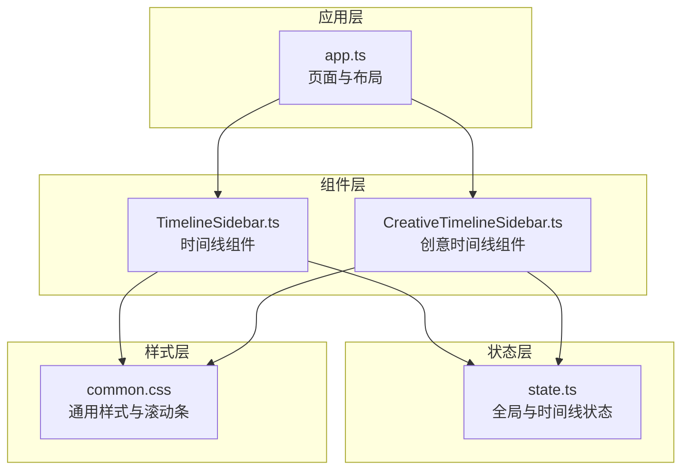
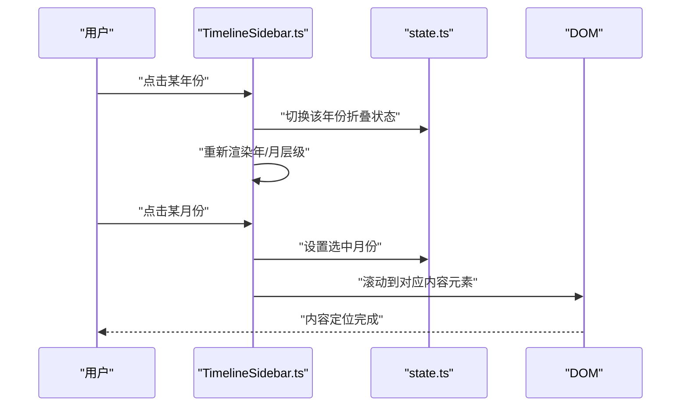
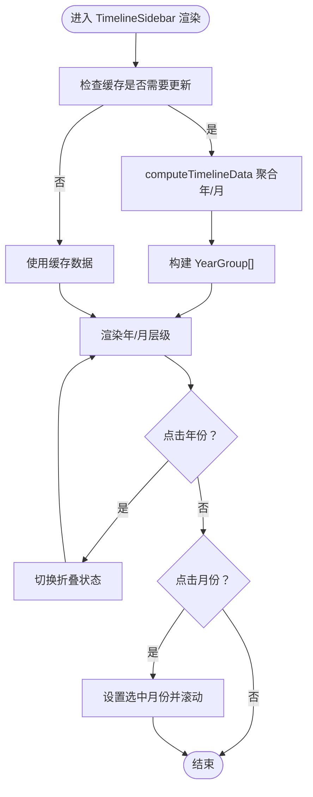
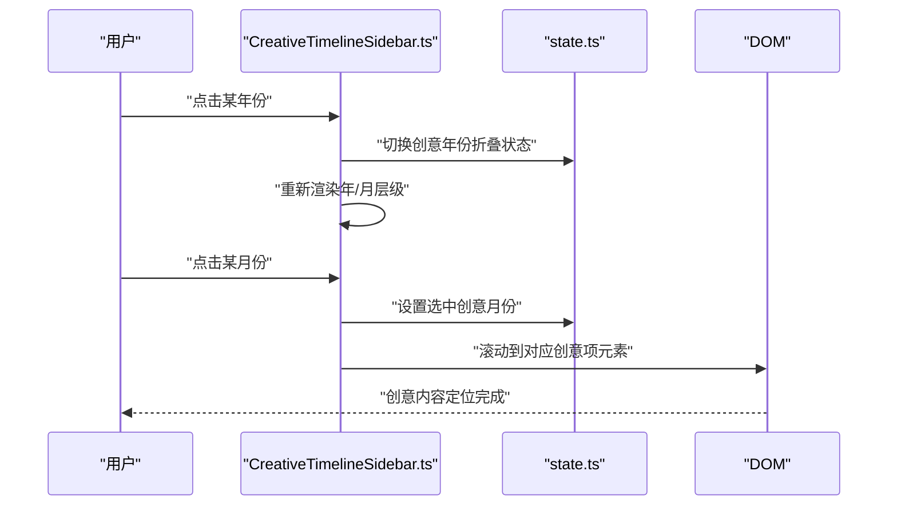
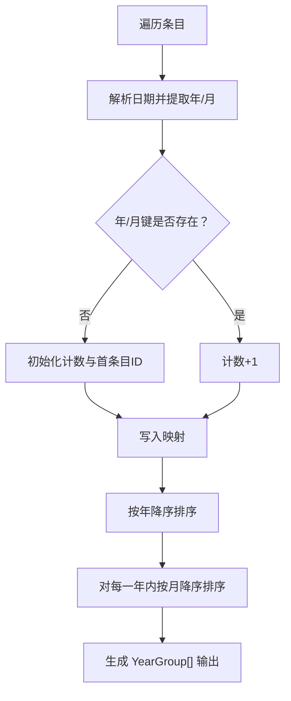
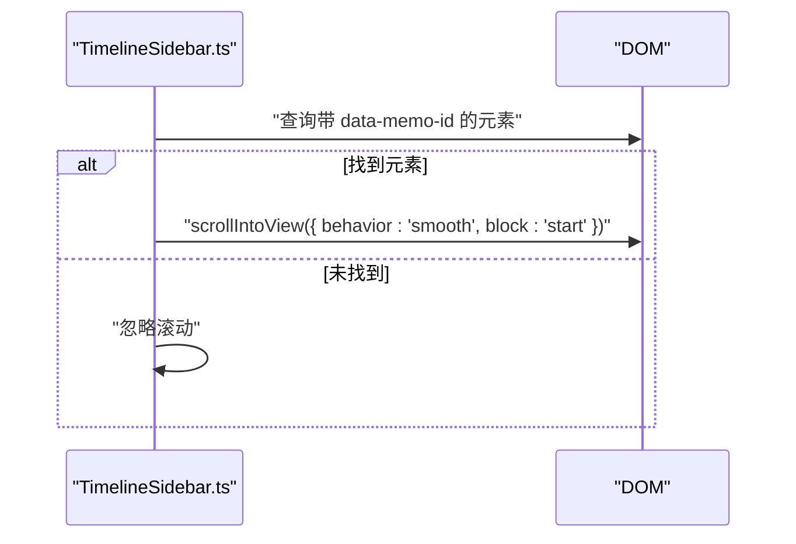
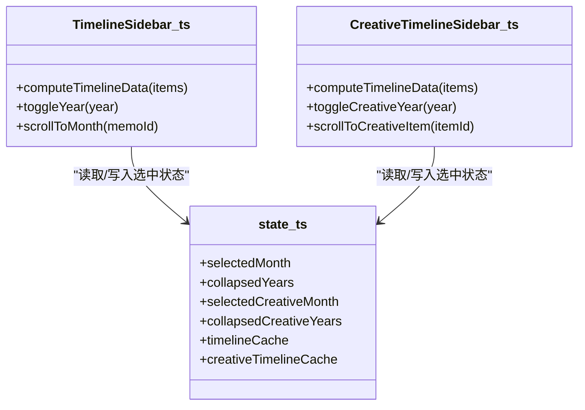
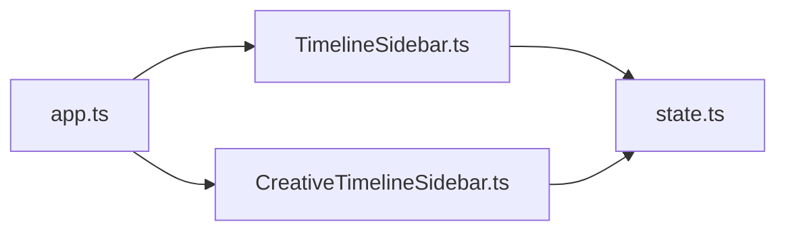

# 时间线导航

<cite>
**本文引用的文件**
- [src/frontend/admin/components/TimelineSidebar.ts](file://src/frontend/admin/components/TimelineSidebar.ts)
- [src/frontend/admin/state.ts](file://src/frontend/admin/state.ts)
- [src/frontend/admin/app.ts](file://src/frontend/admin/app.ts)
- [src/frontend/shared/styles/common.css](file://src/frontend/shared/styles/common.css)
</cite>

## 目录
1. [简介](#简介)
2. [项目结构](#项目结构)
3. [核心组件](#核心组件)
4. [架构总览](#架构总览)
5. [详细组件分析](#详细组件分析)
6. [依赖关系分析](#依赖关系分析)
7. [性能考量](#性能考量)
8. [故障排查指南](#故障排查指南)
9. [结论](#结论)
10. [附录](#附录)

## 简介
本文件聚焦于“时间线导航”系统，围绕 TimelineSidebar 组件及其创意版本 CreativeTimelineSidebar 的设计与实现展开，涵盖以下主题：
- 备忘录与创意内容的时间轴数据组织与排序逻辑
- 时间线的滚动行为、视口管理与性能优化（含虚拟滚动建议）
- 时间线与主内容区域的交互机制（选中状态管理与高亮显示）
- 响应式设计与移动端适配建议
- 用户体验优化与性能调优策略

## 项目结构
时间线导航位于前端管理界面模块中，采用轻量响应式框架进行状态驱动渲染。关键文件与职责如下：
- 组件层：时间线侧边栏组件定义与渲染逻辑
- 状态层：全局与局部状态管理，包含时间线缓存、折叠状态、选中项等
- 应用层：页面布局与组件挂载，根据当前标签页动态渲染对应时间线
- 样式层：通用样式与滚动条美化，为时间线提供基础视觉与交互支持

图表来源
- [src/frontend/admin/app.ts:150-213](file://src/frontend/admin/app.ts#L150-L213)
- [src/frontend/admin/components/TimelineSidebar.ts:107-201](file://src/frontend/admin/components/TimelineSidebar.ts#L107-L201)
- [src/frontend/admin/state.ts:105-155](file://src/frontend/admin/state.ts#L105-L155)
- [src/frontend/shared/styles/common.css:236-265](file://src/frontend/shared/styles/common.css#L236-L265)

章节来源
- [src/frontend/admin/app.ts:150-213](file://src/frontend/admin/app.ts#L150-L213)
- [src/frontend/admin/components/TimelineSidebar.ts:107-201](file://src/frontend/admin/components/TimelineSidebar.ts#L107-L201)
- [src/frontend/admin/state.ts:105-155](file://src/frontend/admin/state.ts#L105-L155)
- [src/frontend/shared/styles/common.css:236-265](file://src/frontend/shared/styles/common.css#L236-L265)

## 核心组件
- TimelineSidebar：用于常规备忘录的时间线展示与导航
- CreativeTimelineSidebar：用于创意内容的时间线展示与导航
- 共享类型与状态：年/月分组结构、选中月份、折叠集合、缓存对象等

章节来源
- [src/frontend/admin/components/TimelineSidebar.ts:23-33](file://src/frontend/admin/components/TimelineSidebar.ts#L23-L33)
- [src/frontend/admin/state.ts:23-33](file://src/frontend/admin/state.ts#L23-L33)
- [src/frontend/admin/state.ts:105-155](file://src/frontend/admin/state.ts#L105-L155)

## 架构总览
时间线导航采用“状态驱动渲染”的架构模式：
- 数据来源：备忘录列表或创意内容列表
- 数据处理：在组件内部对原始数据进行年/月聚合与排序
- 缓存策略：基于输入列表的缓存，避免重复计算
- 视图渲染：按年/月层级渲染，支持年份折叠与月份选中态
- 交互行为：点击月份触发选中与滚动到对应内容

图表来源
- [src/frontend/admin/components/TimelineSidebar.ts:87-105](file://src/frontend/admin/components/TimelineSidebar.ts#L87-L105)
- [src/frontend/admin/components/TimelineSidebar.ts:139-142](file://src/frontend/admin/components/TimelineSidebar.ts#L139-L142)
- [src/frontend/admin/state.ts:107-110](file://src/frontend/admin/state.ts#L107-L110)

## 详细组件分析

### TimelineSidebar 组件
- 设计目标：提供备忘录按年/月维度的时间线导航，支持折叠与选中态高亮
- 数据结构：YearGroup 与 MonthGroup 定义年/月分组信息
- 排序逻辑：按年降序、月降序排列
- 渲染流程：年份标题行可折叠；展开后渲染月份条目，包含名称与数量
- 交互机制：点击年份切换折叠状态；点击月份设置选中并滚动到对应内容

图表来源
- [src/frontend/admin/components/TimelineSidebar.ts:31-71](file://src/frontend/admin/components/TimelineSidebar.ts#L31-L71)
- [src/frontend/admin/components/TimelineSidebar.ts:87-105](file://src/frontend/admin/components/TimelineSidebar.ts#L87-L105)
- [src/frontend/admin/components/TimelineSidebar.ts:116-152](file://src/frontend/admin/components/TimelineSidebar.ts#L116-L152)

章节来源
- [src/frontend/admin/components/TimelineSidebar.ts:31-71](file://src/frontend/admin/components/TimelineSidebar.ts#L31-L71)
- [src/frontend/admin/components/TimelineSidebar.ts:87-105](file://src/frontend/admin/components/TimelineSidebar.ts#L87-L105)
- [src/frontend/admin/components/TimelineSidebar.ts:116-152](file://src/frontend/admin/components/TimelineSidebar.ts#L116-L152)

### CreativeTimelineSidebar 组件
- 设计目标：与 TimelineSidebar 类似，但面向创意内容
- 实现要点：复用相同的排序与渲染逻辑，使用独立的状态与缓存
- 交互机制：点击月份设置选中并滚动到对应创意项

图表来源
- [src/frontend/admin/components/TimelineSidebar.ts:155-201](file://src/frontend/admin/components/TimelineSidebar.ts#L155-L201)
- [src/frontend/admin/state.ts:148-155](file://src/frontend/admin/state.ts#L148-L155)

章节来源
- [src/frontend/admin/components/TimelineSidebar.ts:155-201](file://src/frontend/admin/components/TimelineSidebar.ts#L155-L201)
- [src/frontend/admin/state.ts:148-155](file://src/frontend/admin/state.ts#L148-L155)

### 时间线排序与数据组织
- 输入：原始条目数组（包含唯一标识与创建时间）
- 步骤：
  1) 以年/月为键建立映射，统计各月数量，并记录该月首个条目的标识
  2) 对年份与月份分别进行降序排序
  3) 生成 YearGroup[] 结构，供组件渲染
- 复杂度：O(n) 聚合 + O(y log y + m log m) 排序（y 为年数，m 为月数）

图表来源
- [src/frontend/admin/components/TimelineSidebar.ts:31-71](file://src/frontend/admin/components/TimelineSidebar.ts#L31-L71)

章节来源
- [src/frontend/admin/components/TimelineSidebar.ts:31-71](file://src/frontend/admin/components/TimelineSidebar.ts#L31-L71)

### 滚动行为与视口管理
- 滚动到指定条目：通过元素的 data 属性选择器定位，使用平滑滚动至顶部对齐
- 视口管理：当前实现为直接滚动到目标元素；对于大量条目，建议引入虚拟滚动以提升性能
- 高亮显示：月份条目根据选中状态添加 active 类，配合样式实现高亮

图表来源
- [src/frontend/admin/components/TimelineSidebar.ts:73-85](file://src/frontend/admin/components/TimelineSidebar.ts#L73-L85)
- [src/frontend/admin/components/TimelineSidebar.ts:139-142](file://src/frontend/admin/components/TimelineSidebar.ts#L139-L142)

章节来源
- [src/frontend/admin/components/TimelineSidebar.ts:73-85](file://src/frontend/admin/components/TimelineSidebar.ts#L73-L85)
- [src/frontend/admin/components/TimelineSidebar.ts:139-142](file://src/frontend/admin/components/TimelineSidebar.ts#L139-L142)

### 与主内容区域的交互机制
- 选中状态管理：通过全局状态 selectedMonth 或 selectedCreativeMonth 记录当前选中月份
- 高亮显示：月份条目类名根据选中状态动态计算，渲染时自动应用 active
- 内容定位：点击月份后滚动到该月首条内容，确保用户快速定位

图表来源
- [src/frontend/admin/components/TimelineSidebar.ts:31-105](file://src/frontend/admin/components/TimelineSidebar.ts#L31-L105)
- [src/frontend/admin/components/TimelineSidebar.ts:155-201](file://src/frontend/admin/components/TimelineSidebar.ts#L155-L201)
- [src/frontend/admin/state.ts:107-155](file://src/frontend/admin/state.ts#L107-L155)

章节来源
- [src/frontend/admin/components/TimelineSidebar.ts:31-105](file://src/frontend/admin/components/TimelineSidebar.ts#L31-L105)
- [src/frontend/admin/components/TimelineSidebar.ts:155-201](file://src/frontend/admin/components/TimelineSidebar.ts#L155-L201)
- [src/frontend/admin/state.ts:107-155](file://src/frontend/admin/state.ts#L107-L155)

### 响应式设计与移动端适配
- 当前样式提供基础滚动条美化与通用布局，时间线侧边栏本身未显式声明响应式断点
- 建议：
  - 在窄屏设备上将时间线侧边栏改为顶部或底部面板，或提供抽屉式菜单
  - 控制时间线最大宽度与滚动方向，避免横向滚动
  - 为触摸设备优化点击反馈与滚动性能

章节来源
- [src/frontend/shared/styles/common.css:236-265](file://src/frontend/shared/styles/common.css#L236-L265)

## 依赖关系分析
- 组件依赖状态层：时间线渲染依赖于 memos 或 creativeItems 的值，以及对应的选中与折叠状态
- 组件间耦合：两个时间线组件共享相同的数据结构与排序逻辑，降低重复实现
- 外部依赖：使用浏览器原生选择器与滚动 API，无额外第三方库

图表来源
- [src/frontend/admin/components/TimelineSidebar.ts:107-201](file://src/frontend/admin/components/TimelineSidebar.ts#L107-L201)
- [src/frontend/admin/state.ts:105-155](file://src/frontend/admin/state.ts#L105-L155)
- [src/frontend/admin/app.ts:150-213](file://src/frontend/admin/app.ts#L150-L213)

章节来源
- [src/frontend/admin/components/TimelineSidebar.ts:107-201](file://src/frontend/admin/components/TimelineSidebar.ts#L107-L201)
- [src/frontend/admin/state.ts:105-155](file://src/frontend/admin/state.ts#L105-L155)
- [src/frontend/admin/app.ts:150-213](file://src/frontend/admin/app.ts#L150-L213)

## 性能考量
- 计算复杂度：排序阶段为 O(y log y + m log m)，通常远小于 O(n log n)
- 缓存策略：通过缓存已计算的年/月分组，避免每次渲染都重新计算
- DOM 查询：滚动到目标元素使用选择器，建议在大量条目场景下限制查询范围或使用索引
- 虚拟滚动建议：当条目数量增长时，采用虚拟滚动仅渲染可视窗口内的月份与条目，显著降低重排与重绘成本

## 故障排查指南
- 点击月份无反应
  - 检查选中状态是否正确更新
  - 确认目标元素的 data 属性是否匹配
- 滚动不生效
  - 确保目标元素存在且可见
  - 检查容器滚动容器是否正确
- 折叠状态异常
  - 确认折叠集合的 Set 是否正确切换
- 样式高亮未出现
  - 检查 active 类是否被正确应用
  - 确认样式文件加载正常

章节来源
- [src/frontend/admin/components/TimelineSidebar.ts:73-85](file://src/frontend/admin/components/TimelineSidebar.ts#L73-L85)
- [src/frontend/admin/components/TimelineSidebar.ts:87-105](file://src/frontend/admin/components/TimelineSidebar.ts#L87-L105)
- [src/frontend/admin/components/TimelineSidebar.ts:139-142](file://src/frontend/admin/components/TimelineSidebar.ts#L139-L142)
- [src/frontend/admin/state.ts:107-110](file://src/frontend/admin/state.ts#L107-L110)

## 结论
时间线导航系统以简洁的状态驱动方式实现了备忘录与创意内容的年/月级时间轴展示。其核心优势在于：
- 明确的数据结构与稳定的排序逻辑
- 基于缓存的高效渲染
- 直观的交互与滚动定位
针对大规模数据，建议引入虚拟滚动与更精细的滚动优化策略，以进一步提升性能与用户体验。

## 附录
- 关键实现路径参考
  - 时间线数据聚合与排序：[src/frontend/admin/components/TimelineSidebar.ts:31-71](file://src/frontend/admin/components/TimelineSidebar.ts#L31-L71)
  - 年份折叠与月份选中：[src/frontend/admin/components/TimelineSidebar.ts:87-105](file://src/frontend/admin/components/TimelineSidebar.ts#L87-L105)
  - 滚动到目标元素：[src/frontend/admin/components/TimelineSidebar.ts:73-85](file://src/frontend/admin/components/TimelineSidebar.ts#L73-L85)
  - 选中状态与高亮：[src/frontend/admin/components/TimelineSidebar.ts:139-142](file://src/frontend/admin/components/TimelineSidebar.ts#L139-L142)
  - 页面挂载与时间线渲染：[src/frontend/admin/app.ts:150-213](file://src/frontend/admin/app.ts#L150-L213)
  - 状态定义与缓存：[src/frontend/admin/state.ts:105-155](file://src/frontend/admin/state.ts#L105-L155)
  - 滚动条样式：[src/frontend/shared/styles/common.css:236-265](file://src/frontend/shared/styles/common.css#L236-L265)