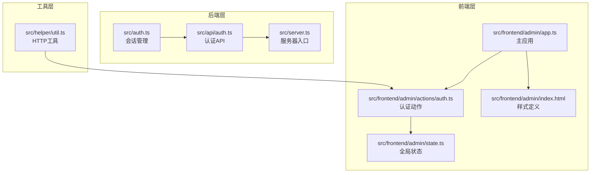
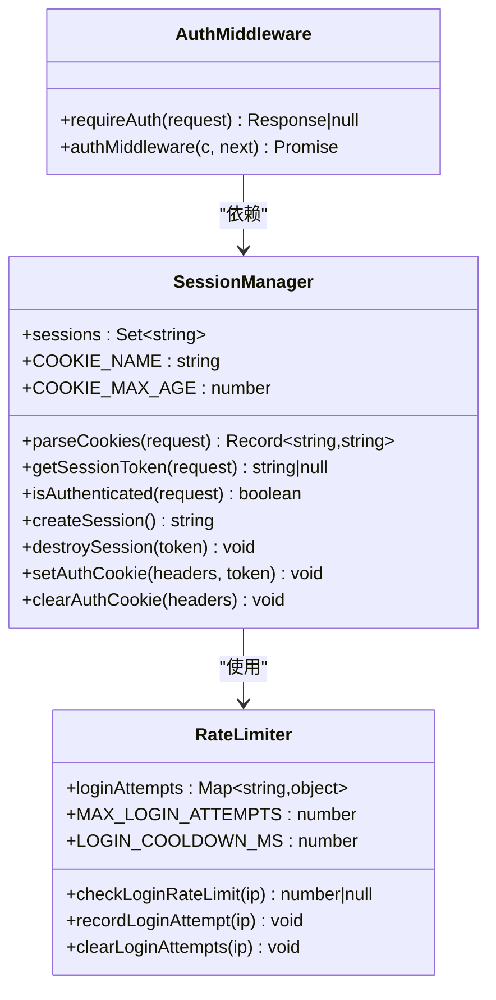
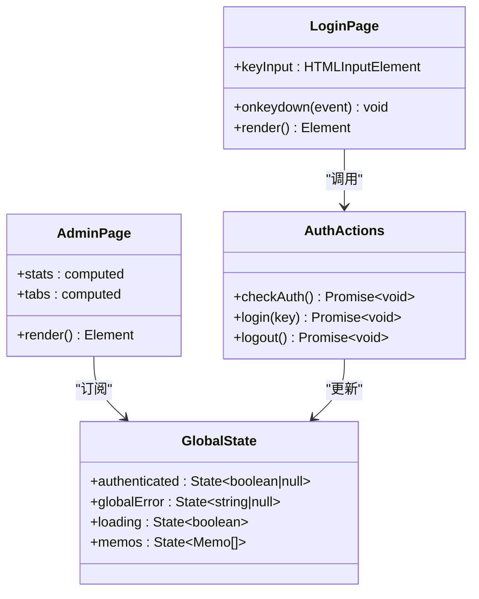
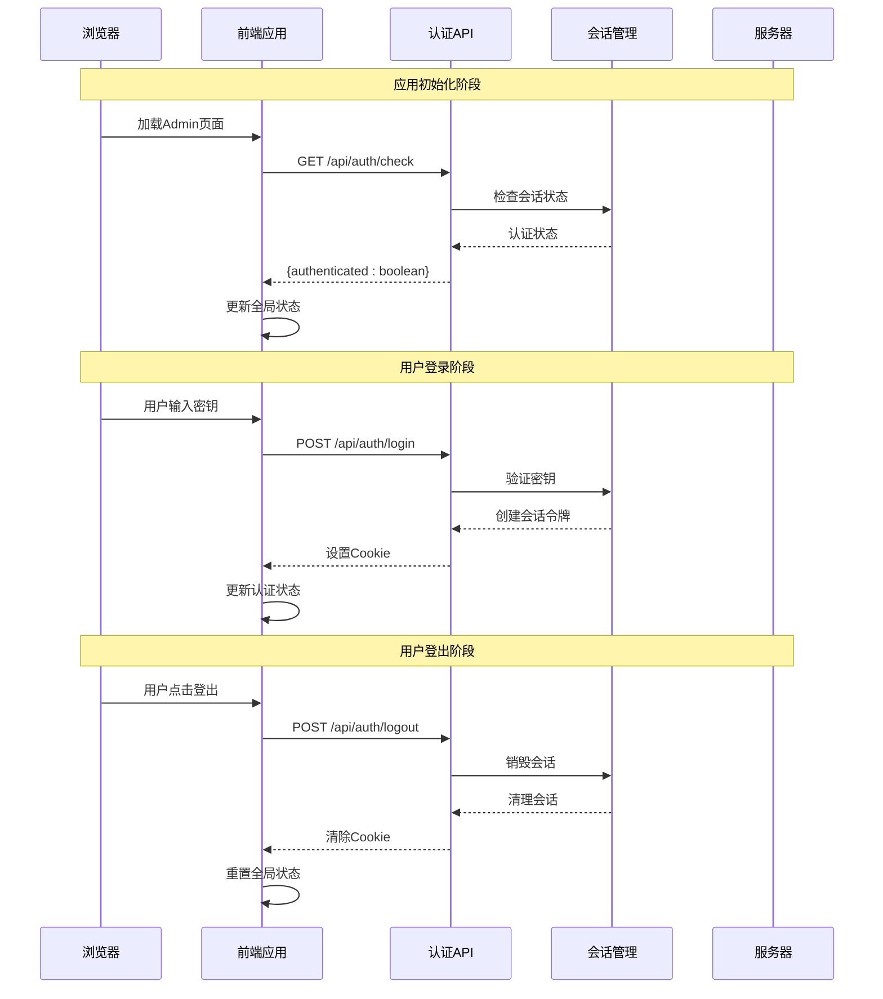
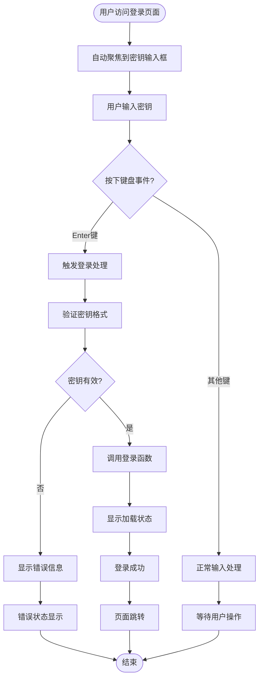
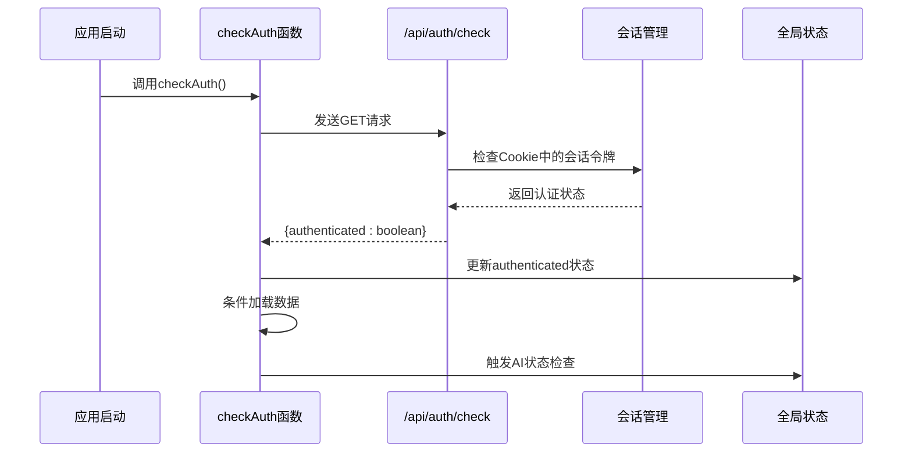
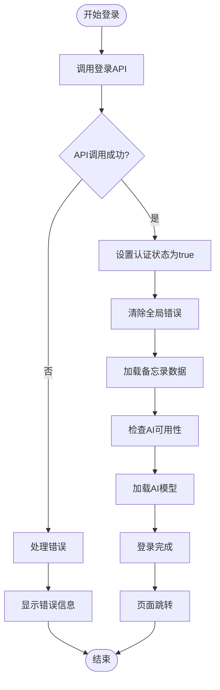
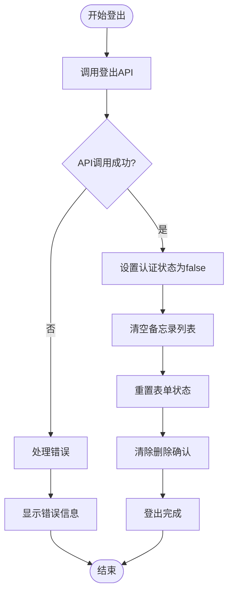
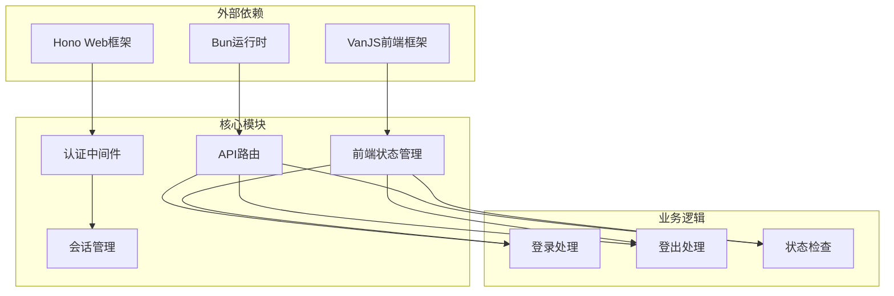

# 认证系统

<cite>
**本文档引用的文件**
- [src/auth.ts](file://src/auth.ts)
- [src/api/auth.ts](file://src/api/auth.ts)
- [src/frontend/admin/actions/auth.ts](file://src/frontend/admin/actions/auth.ts)
- [src/frontend/admin/app.ts](file://src/frontend/admin/app.ts)
- [src/frontend/admin/state.ts](file://src/frontend/admin/state.ts)
- [src/frontend/admin/index.html](file://src/frontend/admin/index.html)
- [src/helper/util.ts](file://src/helper/util.ts)
- [src/server.ts](file://src/server.ts)
</cite>

## 目录
1. [简介](#简介)
2. [项目结构](#项目结构)
3. [核心组件](#核心组件)
4. [架构概览](#架构概览)
5. [详细组件分析](#详细组件分析)
6. [依赖关系分析](#依赖关系分析)
7. [性能考虑](#性能考虑)
8. [故障排除指南](#故障排除指南)
9. [结论](#结论)

## 简介

这是一个基于现代Web技术栈构建的认证系统，采用前后端分离架构，使用Hono作为后端框架，VanJS作为前端框架。系统实现了基于密钥的管理员认证机制，支持会话管理和安全的密码输入处理。

该认证系统具有以下特点：
- 基于环境变量的密钥验证机制
- Cookie会话管理
- 登录频率限制保护
- 前后端分离的SPA架构
- 完整的错误处理和状态管理

## 项目结构

认证系统主要分布在以下几个关键目录中：

**图表来源**
- [src/auth.ts:1-128](file://src/auth.ts#L1-L128)
- [src/api/auth.ts:1-77](file://src/api/auth.ts#L1-L77)
- [src/frontend/admin/app.ts:1-251](file://src/frontend/admin/app.ts#L1-L251)

**章节来源**
- [src/server.ts:1-137](file://src/server.ts#L1-L137)
- [src/frontend/admin/index.html:1-800](file://src/frontend/admin/index.html#L1-L800)

## 核心组件

### 会话管理系统

系统使用内存中的会话集合来管理认证状态，采用随机生成的UUID作为会话令牌。

**图表来源**
- [src/auth.ts:4-128](file://src/auth.ts#L4-L128)

### 前端认证组件

前端使用VanJS框架构建响应式UI，包含登录页面和管理界面。

**图表来源**
- [src/frontend/admin/app.ts:50-77](file://src/frontend/admin/app.ts#L50-L77)
- [src/frontend/admin/actions/auth.ts:12-50](file://src/frontend/admin/actions/auth.ts#L12-L50)
- [src/frontend/admin/state.ts:37-40](file://src/frontend/admin/state.ts#L37-L40)

**章节来源**
- [src/auth.ts:1-128](file://src/auth.ts#L1-L128)
- [src/frontend/admin/actions/auth.ts:1-51](file://src/frontend/admin/actions/auth.ts#L1-L51)
- [src/frontend/admin/state.ts:1-178](file://src/frontend/admin/state.ts#L1-L178)

## 架构概览

认证系统采用分层架构设计，实现了完整的认证生命周期管理：

**图表来源**
- [src/frontend/admin/app.ts:225-236](file://src/frontend/admin/app.ts#L225-L236)
- [src/frontend/admin/actions/auth.ts:12-50](file://src/frontend/admin/actions/auth.ts#L12-L50)
- [src/api/auth.ts:31-76](file://src/api/auth.ts#L31-L76)

## 详细组件分析

### LoginPage组件实现

LoginPage是认证系统的核心UI组件，负责处理用户的密钥输入和认证交互。

#### 密码输入处理

组件使用HTML密码输入框，支持键盘事件处理：

**图表来源**
- [src/frontend/admin/app.ts:50-77](file://src/frontend/admin/app.ts#L50-L77)

#### 键盘事件处理

组件实现了完整的键盘事件处理机制：

- **Enter键支持**：用户按Enter键时自动触发登录
- **事件绑定**：使用`onkeydown`事件处理器
- **输入值获取**：通过DOM查询获取当前输入值

#### 错误状态显示

系统提供了完善的错误处理机制：

- **全局错误状态**：通过`globalError`状态管理
- **实时错误显示**：错误信息会在登录表单下方显示
- **错误清除**：登录成功后自动清除错误状态

**章节来源**
- [src/frontend/admin/app.ts:48-77](file://src/frontend/admin/app.ts#L48-L77)
- [src/frontend/admin/state.ts:37-39](file://src/frontend/admin/state.ts#L37-L39)

### checkAuth函数认证检查逻辑

checkAuth函数负责在应用启动时检查用户的认证状态：

#### 本地存储读取

函数通过API调用检查当前会话状态：

**图表来源**
- [src/frontend/admin/actions/auth.ts:12-25](file://src/frontend/admin/actions/auth.ts#L12-L25)
- [src/api/auth.ts:31-34](file://src/api/auth.ts#L31-L34)

#### 服务器验证

后端API实现了完整的认证检查逻辑：

- **会话令牌解析**：从Cookie中提取认证令牌
- **状态验证**：检查令牌是否存在于会话集合中
- **响应格式**：返回标准化的JSON响应

**章节来源**
- [src/frontend/admin/actions/auth.ts:12-25](file://src/frontend/admin/actions/auth.ts#L12-L25)
- [src/api/auth.ts:31-34](file://src/api/auth.ts#L31-L34)

### 登录成功后的状态更新和页面跳转

登录成功后，系统执行一系列状态更新和页面跳转操作：

#### 状态更新流程

**图表来源**
- [src/frontend/admin/actions/auth.ts:27-42](file://src/frontend/admin/actions/auth.ts#L27-L42)

#### 页面跳转机制

登录成功后，系统会：
- 自动切换到管理界面
- 加载相关的数据内容
- 初始化AI功能模块
- 清除任何之前的错误状态

**章节来源**
- [src/frontend/admin/actions/auth.ts:27-42](file://src/frontend/admin/actions/auth.ts#L27-L42)
- [src/frontend/admin/app.ts:225-232](file://src/frontend/admin/app.ts#L225-L232)

### logout功能实现

logout函数负责清理认证状态并处理用户登出：

#### 状态清理流程

**图表来源**
- [src/frontend/admin/actions/auth.ts:44-50](file://src/frontend/admin/actions/auth.ts#L44-L50)

#### 重定向处理

登出后，系统会：
- 清理所有认证相关的状态
- 重置用户界面到初始状态
- 移除所有临时数据
- 返回到登录页面

**章节来源**
- [src/frontend/admin/actions/auth.ts:44-50](file://src/frontend/admin/actions/auth.ts#L44-L50)

## 依赖关系分析

认证系统的依赖关系体现了清晰的分层架构：

**图表来源**
- [src/server.ts:38-46](file://src/server.ts#L38-L46)
- [src/auth.ts:123-128](file://src/auth.ts#L123-L128)

**章节来源**
- [src/server.ts:1-137](file://src/server.ts#L1-L137)
- [src/auth.ts:123-128](file://src/auth.ts#L123-L128)

## 性能考虑

### 会话存储优化

系统使用内存中的Set数据结构存储会话令牌，具有以下优势：
- **快速查找**：O(1)时间复杂度的会话验证
- **内存效率**：轻量级的数据结构
- **简单可靠**：无需外部存储依赖

### 登录频率限制

系统实现了智能的登录频率限制机制：
- **IP地址跟踪**：基于客户端IP的登录尝试记录
- **时间窗口控制**：1分钟内的最大尝试次数限制
- **动态冷却**：超过限制时提供剩余等待时间

### 前端性能优化

前端应用采用了响应式状态管理：
- **细粒度更新**：只更新受影响的UI部分
- **异步加载**：非阻塞的后台数据加载
- **内存管理**：自动清理不再使用的状态

## 故障排除指南

### 常见认证问题

#### 会话过期问题

**症状**：用户登录后一段时间自动登出
**原因**：浏览器Cookie过期或服务器重启
**解决方案**：
- 检查浏览器Cookie设置
- 验证服务器会话配置
- 确认网络连接稳定性

#### 密钥验证失败

**症状**：登录时提示密钥无效
**原因**：
- 密钥输入错误
- 环境变量配置问题
- 服务器密钥不匹配

**解决方案**：
- 重新输入正确的密钥
- 检查`MEMOS_SECRET_KEY`环境变量
- 验证服务器配置

#### 登录频率限制

**症状**：频繁登录尝试被拒绝
**原因**：超过每分钟最大尝试次数
**解决方案**：
- 等待冷却时间结束
- 减少登录尝试频率
- 检查网络代理设置

**章节来源**
- [src/api/auth.ts:73-107](file://src/api/auth.ts#L73-L107)
- [src/auth.ts:72-107](file://src/auth.ts#L72-L107)

## 结论

这个认证系统展现了现代Web应用的最佳实践，具有以下突出特点：

### 安全性设计
- 使用HttpOnly和SameSite=Strict的Cookie设置
- 实现了登录频率限制保护
- 支持多种认证方式（会话Cookie和Bearer Token）

### 用户体验
- 响应式的前端界面
- 实时的状态反馈
- 完善的错误处理机制

### 可维护性
- 清晰的代码结构和职责分离
- 完整的类型定义
- 模块化的架构设计

### 扩展性
- 易于添加新的认证方式
- 支持插件化功能扩展
- 良好的性能表现

该系统为类似的应用场景提供了优秀的参考实现，展示了如何在保证安全性的同时提供良好的用户体验。