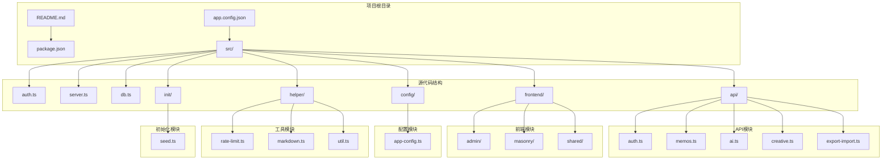
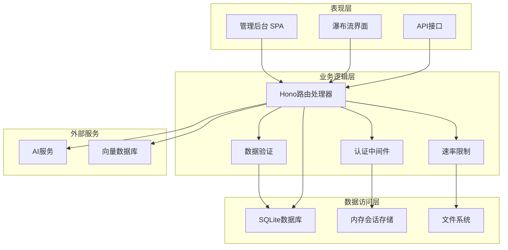
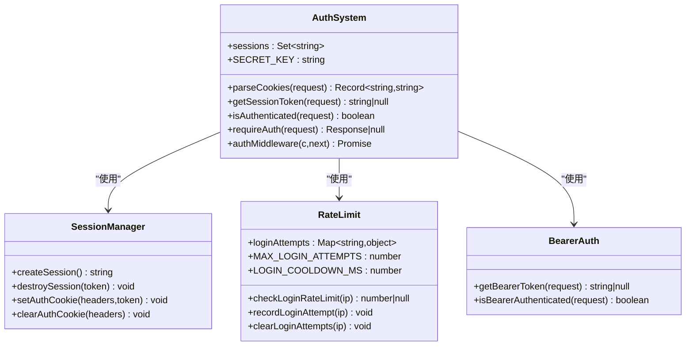
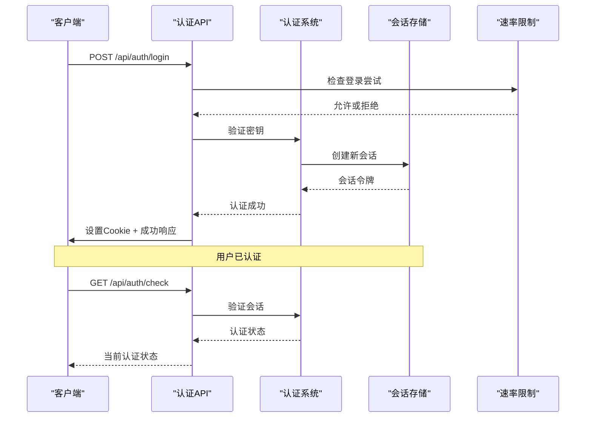
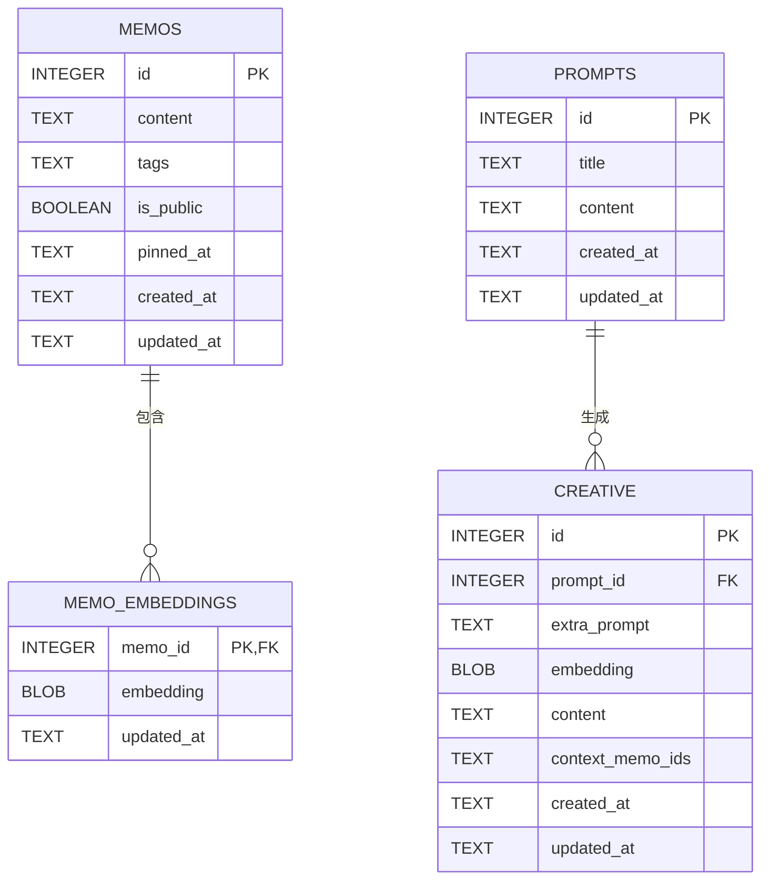
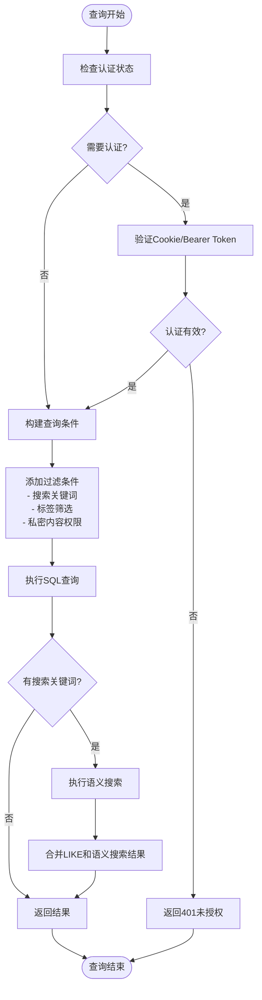
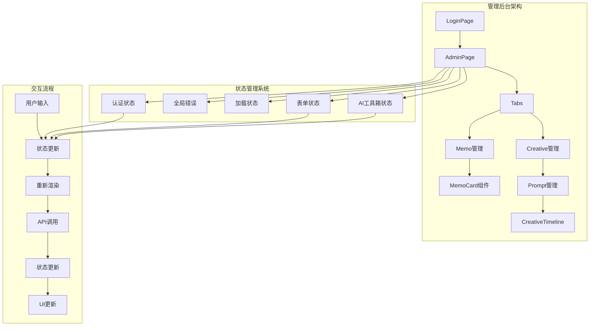
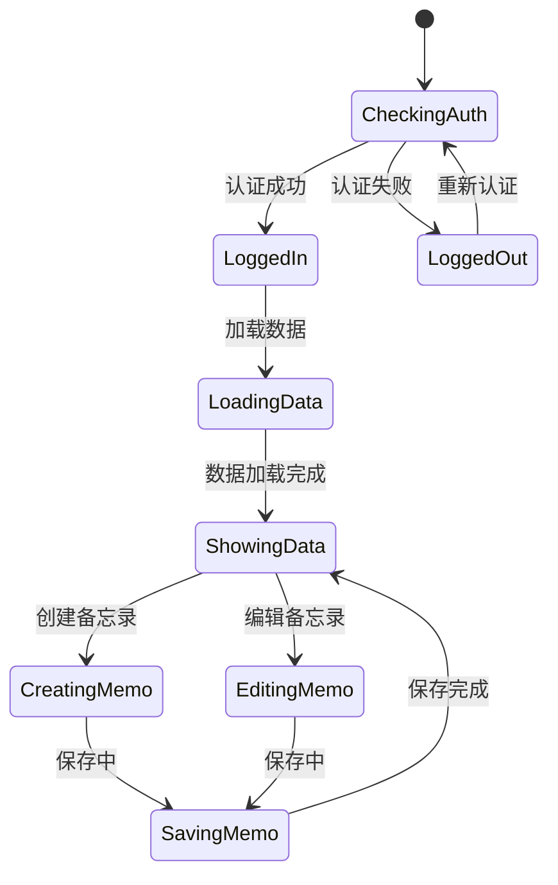

# Better Auth集成指南

<cite>
**本文档引用的文件**
- [README.md](file://README.md)
- [package.json](file://package.json)
- [src/auth.ts](file://src/auth.ts)
- [src/api/auth.ts](file://src/api/auth.ts)
- [src/server.ts](file://src/server.ts)
- [src/db.ts](file://src/db.ts)
- [src/api/memos.ts](file://src/api/memos.ts)
- [src/config/app-config.ts](file://src/config/app-config.ts)
- [src/helper/rate-limit.ts](file://src/helper/rate-limit.ts)
- [src/frontend/admin/app.ts](file://src/frontend/admin/app.ts)
- [src/frontend/masonry/index.ts](file://src/frontend/masonry/index.ts)
- [src/init/seed.ts](file://src/init/seed.ts)
- [app.config.json](file://app.config.json)
</cite>

## 目录
1. [简介](#简介)
2. [项目结构](#项目结构)
3. [核心组件](#核心组件)
4. [架构概览](#架构概览)
5. [详细组件分析](#详细组件分析)
6. [依赖关系分析](#依赖关系分析)
7. [性能考虑](#性能考虑)
8. [故障排除指南](#故障排除指南)
9. [结论](#结论)

## 简介

Better Auth是一个基于Bun运行时构建的轻量级备忘录应用系统。该项目集成了现代化的认证机制，支持Cookie + 内存Session的用户认证，以及Bearer Token认证方式。系统提供了瀑布流展示界面和独立的管理后台，支持公开/私密备忘录管理、标签分类、全文搜索等功能。

该项目的核心特色包括：
- 基于Bun内置API的高性能运行时
- SQLite数据库（WAL模式）持久化存储
- 支持Cookie + 内存Session的认证机制
- Bearer Token认证支持
- 管理后台SPA界面
- 瀑布流布局的首页展示

## 项目结构

项目采用模块化的文件组织结构，主要分为以下几个核心部分：



**图表来源**
- [src/server.ts:1-137](file://src/server.ts#L1-L137)
- [src/auth.ts:1-128](file://src/auth.ts#L1-L128)
- [src/db.ts:1-484](file://src/db.ts#L1-L484)

**章节来源**
- [README.md:25-45](file://README.md#L25-L45)
- [package.json:1-26](file://package.json#L1-L26)

## 核心组件

### 认证系统组件

认证系统是整个应用的核心安全组件，主要包含以下关键组件：

1. **会话管理器**：基于内存的会话存储，使用Set数据结构管理有效的认证令牌
2. **Cookie处理**：解析和设置HTTP Cookie，支持HttpOnly和SameSite属性
3. **认证中间件**：Hono框架的认证中间件，支持多种认证方式
4. **速率限制**：防止暴力破解的登录尝试限制机制

### 数据库组件

数据库层负责所有数据持久化操作，采用SQLite数据库并启用WAL模式以提高并发性能：

1. **Memories表**：存储备忘录内容、标签、可见性和时间戳
2. **嵌入向量表**：存储备忘录的向量表示用于语义搜索
3. **提示词表**：存储AI创作相关的提示词模板
4. **创意内容表**：存储AI生成的创意内容

### 前端组件

前端采用VanJS框架构建响应式用户界面：

1. **管理后台**：基于VanJS的SPA应用，提供备忘录管理和AI创作功能
2. **瀑布流界面**：首页采用Masonry布局，支持自适应列数和虚拟滚动
3. **状态管理**：使用VanJS的响应式状态系统管理UI状态

**章节来源**
- [src/auth.ts:1-128](file://src/auth.ts#L1-L128)
- [src/db.ts:15-61](file://src/db.ts#L15-L61)
- [src/frontend/admin/app.ts:1-251](file://src/frontend/admin/app.ts#L1-L251)

## 架构概览

系统采用分层架构设计，清晰分离了表现层、业务逻辑层和数据访问层：



**图表来源**
- [src/server.ts:38-46](file://src/server.ts#L38-L46)
- [src/api/auth.ts:29](file://src/api/auth.ts#L29)
- [src/api/memos.ts:26](file://src/api/memos.ts#L26)

## 详细组件分析

### 认证组件分析

认证系统实现了双重认证机制，支持传统的Cookie + Session方式和现代的Bearer Token方式：



**图表来源**
- [src/auth.ts:4-128](file://src/auth.ts#L4-L128)

#### 认证流程序列图



**图表来源**
- [src/api/auth.ts:36-77](file://src/api/auth.ts#L36-L77)
- [src/auth.ts:111-128](file://src/auth.ts#L111-L128)

**章节来源**
- [src/auth.ts:28-128](file://src/auth.ts#L28-L128)
- [src/api/auth.ts:14-77](file://src/api/auth.ts#L14-L77)

### 数据库组件分析

数据库层采用了现代化的SQLite设计，支持JSON数据类型和复杂的查询操作：



**图表来源**
- [src/db.ts:18-60](file://src/db.ts#L18-L60)

#### 数据查询流程



**图表来源**
- [src/api/memos.ts:28-70](file://src/api/memos.ts#L28-L70)

**章节来源**
- [src/db.ts:122-169](file://src/db.ts#L122-L169)
- [src/api/memos.ts:28-95](file://src/api/memos.ts#L28-L95)

### 前端组件分析

前端采用VanJS框架构建响应式用户界面，实现了现代化的SPA应用：



**图表来源**
- [src/frontend/admin/app.ts:48-232](file://src/frontend/admin/app.ts#L48-L232)
- [src/frontend/admin/state.ts:35-180](file://src/frontend/admin/state.ts#L35-L180)

#### 响应式状态管理

前端使用VanJS的响应式状态系统，实现了高效的状态管理：



**图表来源**
- [src/frontend/admin/app.ts:224-236](file://src/frontend/admin/app.ts#L224-L236)

**章节来源**
- [src/frontend/admin/app.ts:1-251](file://src/frontend/admin/app.ts#L1-L251)
- [src/frontend/masonry/index.ts:1-23](file://src/frontend/masonry/index.ts#L1-L23)

## 依赖关系分析

项目依赖关系清晰明确，采用了模块化的设计原则：

```mermaid
graph TB
subgraph "核心依赖"
A[Bun运行时]
B[Hono Web框架]
C[VanJS前端框架]
D[SQLite数据库]
end
subgraph "开发依赖"
E[@types/bun]
F[TypeScript]
end
subgraph "工具依赖"
G[marked - Markdown解析]
H[dompurify - XSS防护]
I[pretext - 文字排版]
end
subgraph "应用模块"
J[认证模块]
K[API模块]
L[数据库模块]
M[前端模块]
N[配置模块]
O[工具模块]
end
A --> B
A --> C
B --> J
B --> K
K --> L
M --> C
N --> O
J --> L
K --> L
```

**图表来源**
- [package.json:19-26](file://package.json#L19-L26)
- [src/server.ts:1-10](file://src/server.ts#L1-L10)

### 关键依赖分析

1. **运行时环境**：Bun提供了高性能的JavaScript运行时，支持原生的SQLite和HTTP服务器
2. **Web框架**：Hono提供了轻量级的Web框架，支持中间件和路由处理
3. **前端框架**：VanJS提供了响应式的前端开发体验
4. **数据库**：SQLite结合WAL模式提供了高性能的本地存储解决方案

**章节来源**
- [package.json:13-26](file://package.json#L13-L26)
- [src/server.ts:1-10](file://src/server.ts#L1-L10)

## 性能考虑

系统在多个层面进行了性能优化：

### 数据库性能优化

1. **WAL模式**：启用Write-Ahead Logging模式提高并发性能
2. **索引优化**：为常用查询字段建立索引
3. **JSON查询**：利用SQLite的JSON1扩展进行标签查询
4. **批量操作**：支持批量插入和查询优化

### 认证性能优化

1. **内存存储**：会话信息存储在内存中，避免磁盘I/O开销
2. **速率限制**：防止暴力破解攻击，保护系统安全
3. **Cookie优化**：使用HttpOnly和SameSite属性提升安全性

### 前端性能优化

1. **虚拟滚动**：瀑布流界面使用虚拟滚动技术，只渲染可视区域
2. **响应式状态**：VanJS的响应式系统减少了不必要的DOM更新
3. **懒加载**：前端资源按需加载，减少初始加载时间

## 故障排除指南

### 常见问题及解决方案

#### 认证相关问题

1. **登录失败**
   - 检查MEMOS_SECRET_KEY环境变量是否正确设置
   - 验证请求格式是否为JSON
   - 查看速率限制是否触发

2. **Cookie问题**
   - 确认浏览器允许第三方Cookie
   - 检查SameSite属性设置
   - 验证域名和路径配置

#### 数据库相关问题

1. **连接失败**
   - 检查SQLite文件权限
   - 验证数据库文件完整性
   - 确认WAL模式配置正确

2. **查询性能问题**
   - 检查索引是否正确创建
   - 优化查询条件
   - 考虑添加适当的LIMIT子句

#### 前端相关问题

1. **页面加载失败**
   - 检查构建产物是否存在
   - 验证静态资源路径
   - 确认base标签配置正确

2. **状态不同步**
   - 检查响应式状态更新
   - 验证事件处理器绑定
   - 确认异步操作完成

**章节来源**
- [src/auth.ts:72-107](file://src/auth.ts#L72-L107)
- [src/db.ts:15-61](file://src/db.ts#L15-L61)
- [src/frontend/admin/app.ts:224-236](file://src/frontend/admin/app.ts#L224-L236)

## 结论

Better Auth项目展示了如何构建一个现代化、高性能的备忘录应用系统。项目采用了最佳实践的设计模式，包括：

1. **模块化架构**：清晰的分层设计和模块划分
2. **安全认证**：双重认证机制和速率限制保护
3. **性能优化**：多层面的性能优化策略
4. **用户体验**：现代化的前端界面和交互设计

该系统为开发者提供了一个优秀的参考实现，展示了如何在实际项目中应用现代Web开发技术和最佳实践。无论是学习认证机制、数据库设计还是前端架构，这个项目都提供了宝贵的实践经验。

通过深入理解这个项目的架构设计和实现细节，开发者可以更好地掌握构建生产级Web应用的关键要素，包括安全性、性能、可维护性和用户体验等方面。