# Masonry瀑布流界面

<cite>
**本文档引用的文件**
- [src/frontend/masonry/index.ts](file://src/frontend/masonry/index.ts)
- [src/frontend/masonry/state.ts](file://src/frontend/masonry/state.ts)
- [src/frontend/masonry/components.ts](file://src/frontend/masonry/components.ts)
- [src/frontend/masonry/api.ts](file://src/frontend/masonry/api.ts)
- [src/frontend/masonry/index.html](file://src/frontend/masonry/index.html)
- [src/frontend/shared/components/ReadMoreModal.ts](file://src/frontend/shared/components/ReadMoreModal.ts)
- [src/frontend/shared/styles/common.css](file://src/frontend/shared/styles/common.css)
- [package.json](file://package.json)
</cite>

## 更新摘要
**变更内容**
- 新增主题切换系统，支持明暗主题切换和本地存储持久化
- 增强瀑布流标签显示功能，卡片上显示标签行并支持点击筛选
- 集成认证状态识别，根据用户登录状态动态调整界面元素
- 优化状态管理，新增主题状态和认证状态管理
- 增强组件化架构，主题切换和认证状态在组件中统一管理

## 目录
1. [简介](#简介)
2. [项目结构](#项目结构)
3. [核心组件](#核心组件)
4. [架构概览](#架构概览)
5. [详细组件分析](#详细组件分析)
6. [依赖关系分析](#依赖关系分析)
7. [性能考虑](#性能考虑)
8. [故障排除指南](#故障排除指南)
9. [结论](#结论)
10. [附录](#附录)

## 简介

Masonry瀑布流界面是一个基于VanJS框架构建的现代化笔记展示系统，采用瀑布流布局算法实现动态卡片排列。该系统支持实时搜索、标签筛选、无限滚动加载、响应式设计、主题切换和认证状态识别等多种功能特性。

系统的核心特点包括：
- **瀑布流布局算法**：智能列数计算和元素高度估算
- **虚拟滚动技术**：可见区域计算和DOM节点复用
- **实时搜索功能**：关键词匹配和结果高亮
- **响应式设计**：多断点自适应布局
- **主题切换系统**：明暗主题切换和本地存储持久化
- **认证状态识别**：用户登录状态检测和界面动态调整
- **组件化架构**：可复用组件设计模式
- **状态管理**：完整的加载状态、搜索状态、布局状态和主题状态管理

## 项目结构

Masonry瀑布流界面采用模块化的前端架构，主要文件组织如下：

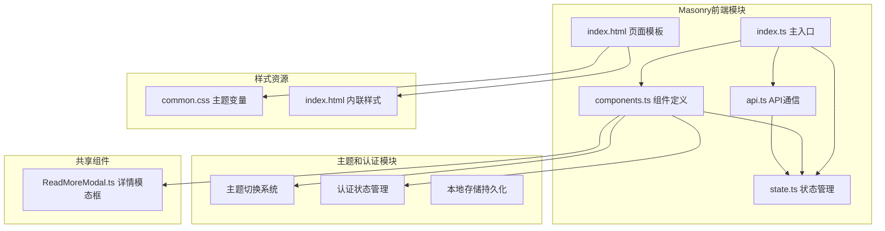

**图表来源**
- [src/frontend/masonry/index.ts:1-51](file://src/frontend/masonry/index.ts#L1-L51)
- [src/frontend/masonry/state.ts:61](file://src/frontend/masonry/state.ts#L61)
- [src/frontend/masonry/components.ts:43-61](file://src/frontend/masonry/components.ts#L43-L61)
- [src/frontend/masonry/api.ts:8](file://src/frontend/masonry/api.ts#L8)

**章节来源**
- [src/frontend/masonry/index.ts:1-51](file://src/frontend/masonry/index.ts#L1-L51)
- [src/frontend/masonry/state.ts:1-185](file://src/frontend/masonry/state.ts#L1-L185)
- [src/frontend/masonry/components.ts:1-392](file://src/frontend/masonry/components.ts#L1-L392)
- [src/frontend/masonry/api.ts:1-167](file://src/frontend/masonry/api.ts#L1-L167)

## 核心组件

### 状态管理系统

系统采用VanJS的响应式状态管理机制，通过`van.state()`创建全局状态：

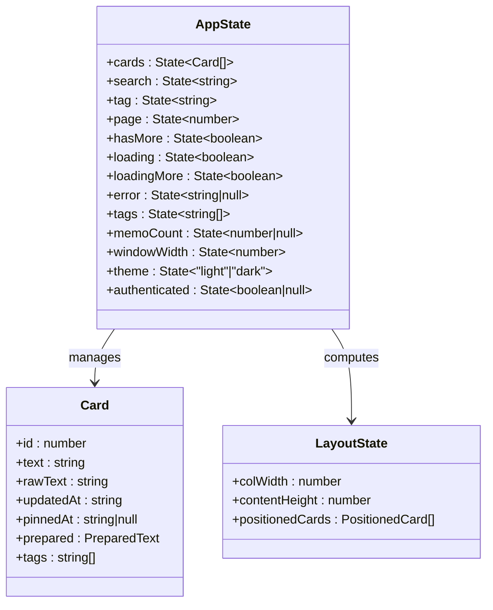

**图表来源**
- [src/frontend/masonry/state.ts:43-62](file://src/frontend/masonry/state.ts#L43-L62)
- [src/frontend/masonry/state.ts:13-21](file://src/frontend/masonry/state.ts#L13-L21)
- [src/frontend/masonry/state.ts:30-34](file://src/frontend/masonry/state.ts#L30-L34)

### 主题切换系统

系统实现了完整的主题切换功能：

#### 主题状态管理

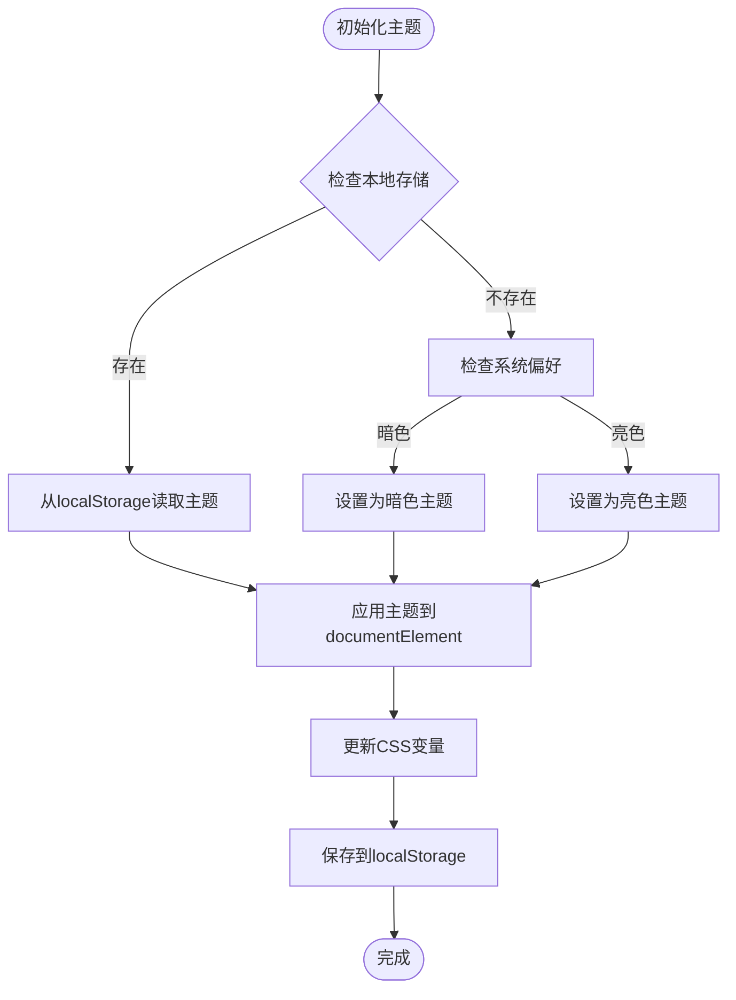

**图表来源**
- [src/frontend/masonry/components.ts:43-61](file://src/frontend/masonry/components.ts#L43-L61)
- [src/frontend/masonry/state.ts:61](file://src/frontend/masonry/state.ts#L61)

#### 认证状态识别

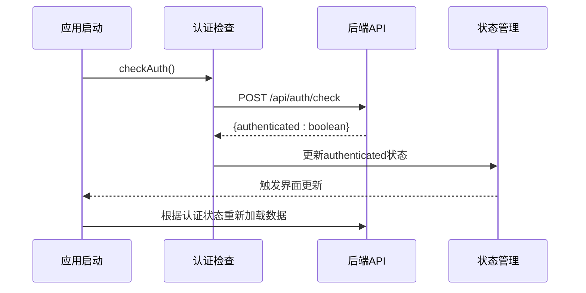

**图表来源**
- [src/frontend/masonry/index.ts:8-22](file://src/frontend/masonry/index.ts#L8-L22)

### 布局算法实现

瀑布流布局算法通过以下步骤实现：

1. **列数计算**：根据窗口宽度动态计算列数
2. **高度估算**：使用预处理文本计算元素高度
3. **位置分配**：将元素分配到最短的列中
4. **布局缓存**：避免重复计算

**章节来源**
- [src/frontend/masonry/state.ts:87-137](file://src/frontend/masonry/state.ts#L87-L137)

## 架构概览

系统采用分层架构设计，各层职责明确：

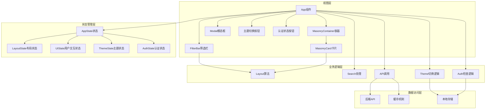

**图表来源**
- [src/frontend/masonry/components.ts:338-391](file://src/frontend/masonry/components.ts#L338-L391)
- [src/frontend/masonry/state.ts:87-137](file://src/frontend/masonry/state.ts#L87-L137)
- [src/frontend/masonry/api.ts:53-135](file://src/frontend/masonry/api.ts#L53-L135)

## 详细组件分析

### 应用主组件

App组件作为整个界面的根组件，负责：

- **事件监听**：窗口大小变化和滚动事件
- **状态管理**：协调各个子组件的状态
- **渲染控制**：根据不同状态显示相应内容

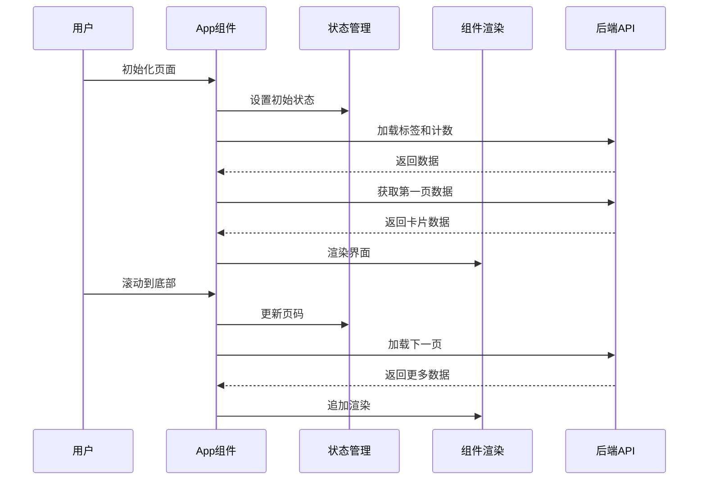

**图表来源**
- [src/frontend/masonry/index.ts:34-50](file://src/frontend/masonry/index.ts#L34-L50)
- [src/frontend/masonry/components.ts:338-391](file://src/frontend/masonry/components.ts#L338-L391)

### 主题切换组件

主题切换功能通过独立的组件实现：

#### 主题切换逻辑

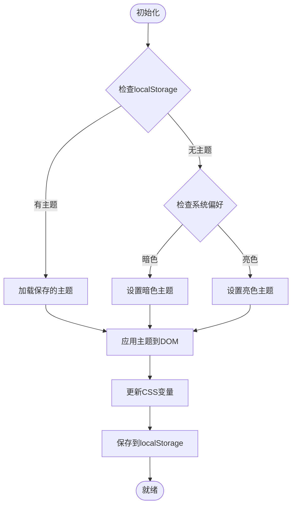

**图表来源**
- [src/frontend/masonry/components.ts:43-61](file://src/frontend/masonry/components.ts#L43-L61)

#### 主题状态管理

主题状态通过响应式状态管理：

- **状态存储**：`theme`状态变量
- **持久化**：自动保存到localStorage
- **系统检测**：自动检测系统暗色模式偏好
- **实时更新**：切换时立即更新所有CSS变量

**章节来源**
- [src/frontend/masonry/components.ts:43-61](file://src/frontend/masonry/components.ts#L43-L61)
- [src/frontend/masonry/state.ts:61](file://src/frontend/masonry/state.ts#L61)

### 认证状态组件

认证状态识别通过独立的组件实现：

#### 认证检查流程

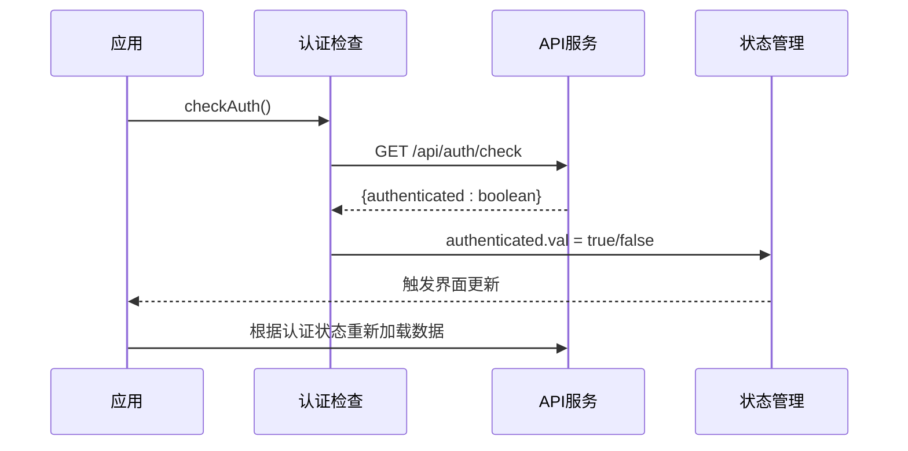

**图表来源**
- [src/frontend/masonry/index.ts:8-22](file://src/frontend/masonry/index.ts#L8-L22)

#### 认证状态按钮

认证状态影响界面元素：

- **未认证**：显示"登录"按钮
- **已认证**：显示"Admin"按钮
- **状态变化**：自动重新渲染相关元素

**章节来源**
- [src/frontend/masonry/index.ts:8-22](file://src/frontend/masonry/index.ts#L8-L22)
- [src/frontend/masonry/components.ts:157-159](file://src/frontend/masonry/components.ts#L157-L159)

### 瀑布流标签显示

系统增强了标签显示功能：

#### 标签显示逻辑

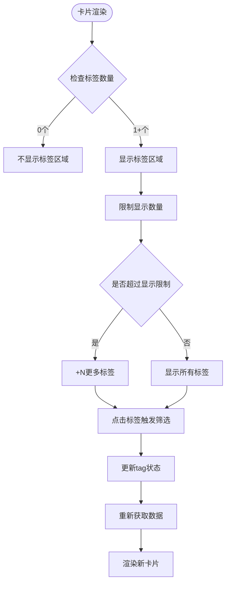

**图表来源**
- [src/frontend/masonry/components.ts:186-207](file://src/frontend/masonry/components.ts#L186-L207)

#### 标签交互功能

- **点击筛选**：点击标签直接跳转到对应标签筛选
- **数量限制**：最多显示5个标签，其余显示"+N"
- **动态更新**：标签状态变化时自动重新渲染

**章节来源**
- [src/frontend/masonry/components.ts:186-207](file://src/frontend/masonry/components.ts#L186-L207)
- [src/frontend/masonry/state.ts:117-118](file://src/frontend/masonry/state.ts#L117-L118)

### 布局算法实现

布局算法的核心实现包括：

#### 列数计算逻辑

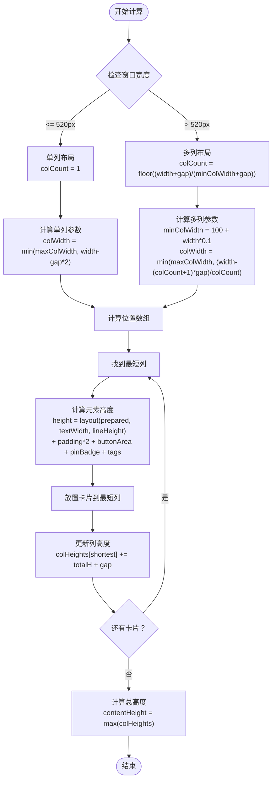

**图表来源**
- [src/frontend/masonry/state.ts:87-137](file://src/frontend/masonry/state.ts#L87-L137)

#### 布局缓存机制

为了提高性能，系统实现了布局缓存：

- **缓存键**：`cards.val`和`windowWidth.val`的组合
- **缓存失效**：当卡片列表或窗口宽度变化时重新计算
- **性能提升**：避免重复的布局计算

**章节来源**
- [src/frontend/masonry/state.ts:139-156](file://src/frontend/masonry/state.ts#L139-L156)

### 搜索功能实现

系统实现了完整的搜索功能，包括：

#### 实时搜索机制

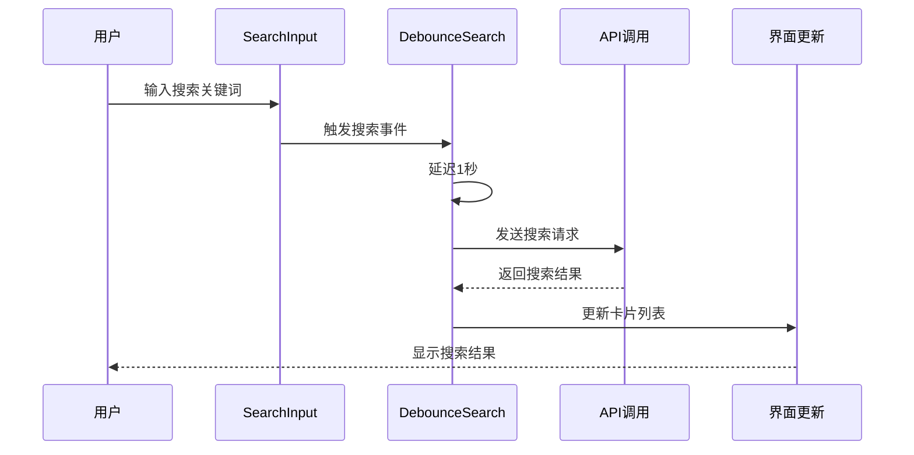

**图表来源**
- [src/frontend/masonry/components.ts:71-82](file://src/frontend/masonry/components.ts#L71-L82)
- [src/frontend/masonry/api.ts:140-145](file://src/frontend/masonry/api.ts#L140-L145)

#### 关键词匹配策略

- **模糊匹配**：支持部分关键词匹配
- **实时过滤**：输入即过滤，延迟1秒避免频繁请求
- **URL同步**：搜索参数同步到URL便于书签分享

**章节来源**
- [src/frontend/masonry/api.ts:53-135](file://src/frontend/masonry/api.ts#L53-L135)

### 响应式设计实现

系统采用移动优先的设计理念，支持多断点自适应：

#### 断点设置

| 断点 | 最大宽度 | 特性 |
|------|----------|------|
| 移动端 | 520px | 单列布局，简化界面 |
| 平板端 | 768px | 两列布局，优化触摸体验 |
| 桌面端 | 1024px | 多列布局，充分利用空间 |

#### 自适应布局策略

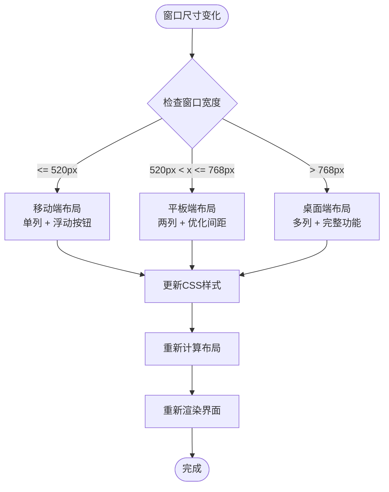

**图表来源**
- [src/frontend/masonry/index.html:142-179](file://src/frontend/masonry/index.html#L142-L179)
- [src/frontend/masonry/state.ts:88-100](file://src/frontend/masonry/state.ts#L88-L100)

**章节来源**
- [src/frontend/masonry/index.html:142-179](file://src/frontend/masonry/index.html#L142-L179)
- [src/frontend/masonry/state.ts:87-100](file://src/frontend/masonry/state.ts#L87-L100)

### 组件化架构设计

系统采用高度模块化的组件设计：

#### 可复用组件

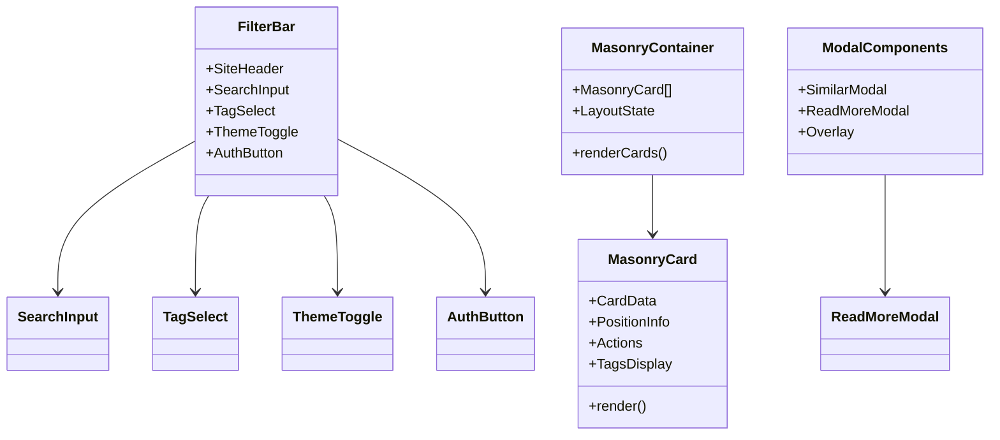

**图表来源**
- [src/frontend/masonry/components.ts:63-162](file://src/frontend/masonry/components.ts#L63-L162)
- [src/frontend/masonry/components.ts:164-274](file://src/frontend/masonry/components.ts#L164-L274)
- [src/frontend/shared/components/ReadMoreModal.ts:15-71](file://src/frontend/shared/components/ReadMoreModal.ts#L15-L71)

#### 组件通信模式

- **父子组件通信**：通过props传递数据
- **兄弟组件通信**：通过共享状态
- **跨模块通信**：通过全局状态管理

**章节来源**
- [src/frontend/masonry/components.ts:1-392](file://src/frontend/masonry/components.ts#L1-L392)

## 依赖关系分析

系统依赖关系清晰，模块间耦合度低：

```mermaid
graph TB
subgraph "核心依赖"
A[vanjs-core] --> B[响应式状态]
A --> C[组件渲染]
D[@chenglou/pretext] --> E[文本预处理]
F[marked] --> G[Markdown解析]
H[dompurify] --> I[HTML安全清洗]
J[localStorage API] --> K[主题持久化]
L[fetch API] --> M[认证检查]
end
subgraph "Masonry模块"
N[index.ts] --> O[state.ts]
N --> P[components.ts]
N --> Q[api.ts]
P --> O
P --> R[ReadMoreModal.ts]
S[markdown.ts] --> T[util.ts]
end
subgraph "样式依赖"
U[common.css] --> V[主题变量]
W[index.html] --> U
X[theme-toggle-btn] --> Y[主题切换样式]
end
```

**图表来源**
- [package.json:19-25](file://package.json#L19-L25)
- [src/frontend/masonry/index.ts:1-5](file://src/frontend/masonry/index.ts#L1-L5)

**章节来源**
- [package.json:19-25](file://package.json#L19-L25)
- [src/frontend/masonry/index.ts:1-5](file://src/frontend/masonry/index.ts#L1-L5)

## 性能考虑

### 虚拟滚动技术

系统实现了高效的虚拟滚动机制：

#### 可见区域计算

- **视口检测**：滚动事件中检测距离底部的距离
- **阈值控制**：距离底部400px时触发加载
- **防抖处理**：避免频繁触发滚动事件

#### DOM节点复用

- **绝对定位**：卡片使用绝对定位避免重排
- **布局缓存**：缓存计算结果避免重复计算
- **增量渲染**：只渲染可见区域内的卡片

### 缓存策略

#### 预处理文本缓存

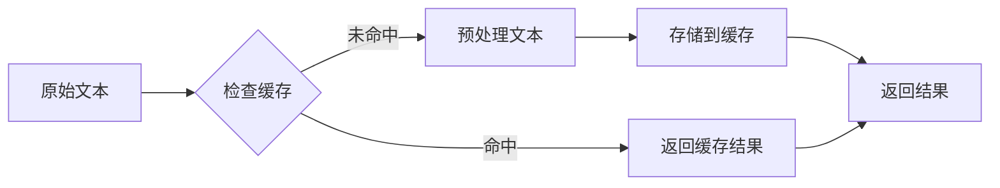

**图表来源**
- [src/frontend/masonry/state.ts:67-73](file://src/frontend/masonry/state.ts#L67-L73)

#### 布局状态缓存

- **缓存键**：卡片数组引用和窗口宽度
- **失效机制**：当缓存键变化时重新计算
- **内存管理**：避免缓存无限增长

#### 主题状态缓存

- **本地存储**：主题状态持久化到localStorage
- **系统检测**：自动检测系统暗色模式偏好
- **即时应用**：切换时立即更新所有CSS变量

**章节来源**
- [src/frontend/masonry/state.ts:67-73](file://src/frontend/masonry/state.ts#L67-L73)
- [src/frontend/masonry/state.ts:139-156](file://src/frontend/masonry/state.ts#L139-L156)
- [src/frontend/masonry/components.ts:43-61](file://src/frontend/masonry/components.ts#L43-L61)

### 图片优化

虽然当前版本主要处理文本内容，但系统已为图片优化预留了接口：

- **懒加载支持**：可扩展为图片懒加载
- **格式优化**：支持现代图片格式
- **尺寸适配**：根据设备像素比选择合适尺寸

## 故障排除指南

### 常见问题诊断

#### 布局异常问题

**症状**：卡片重叠或布局错乱
**可能原因**：
- 窗口尺寸变化未正确响应
- 布局缓存失效时机不当
- 文本高度计算错误

**解决方案**：
- 检查resize事件监听器
- 验证布局缓存逻辑
- 确认预处理文本的字体设置

#### 性能问题

**症状**：滚动卡顿或加载缓慢
**可能原因**：
- DOM节点过多
- 频繁的重排重绘
- 缓存未生效

**解决方案**：
- 实施虚拟滚动
- 优化CSS属性动画
- 检查缓存策略

#### 搜索功能问题

**症状**：搜索无响应或结果不准确
**可能原因**：
- 防抖时间设置不当
- API请求参数错误
- 前端过滤逻辑问题

**解决方案**：
- 调整防抖延迟时间
- 验证API端点
- 检查关键词匹配算法

#### 主题切换问题

**症状**：主题切换无效或状态不同步
**可能原因**：
- localStorage访问失败
- CSS变量更新未生效
- 系统偏好检测错误

**解决方案**：
- 检查浏览器localStorage支持
- 验证CSS变量命名
- 确认系统暗色模式检测

#### 认证状态问题

**症状**：认证状态显示错误或功能异常
**可能原因**：
- 认证检查API失败
- 会话状态异常
- 状态更新时机问题

**解决方案**：
- 检查网络连接和API可用性
- 验证会话cookie设置
- 确认状态更新逻辑

**章节来源**
- [src/frontend/masonry/components.ts:338-391](file://src/frontend/masonry/components.ts#L338-L391)
- [src/frontend/masonry/api.ts:53-135](file://src/frontend/masonry/api.ts#L53-L135)

## 结论

Masonry瀑布流界面是一个设计精良的前端应用，具有以下优势：

### 技术亮点

1. **优秀的架构设计**：模块化、组件化、状态分离
2. **高效的性能优化**：虚拟滚动、缓存机制、响应式设计
3. **完善的用户体验**：实时搜索、无限滚动、响应式布局
4. **主题系统集成**：明暗主题切换和本地存储持久化
5. **认证状态管理**：用户登录状态检测和界面动态调整
6. **标签显示增强**：卡片级标签展示和交互功能
7. **可维护性强**：清晰的代码结构、良好的文档规范

### 改进建议

1. **增加图片懒加载**：提升大图场景下的性能
2. **实现骨架屏**：改善首次加载体验
3. **添加错误边界**：增强应用稳定性
4. **优化SEO**：为搜索引擎友好化
5. **增强主题定制**：支持更多主题选项

该系统为类似的数据展示应用提供了优秀的参考实现，其设计理念和架构模式值得学习和借鉴。

## 附录

### API接口规范

系统主要API接口包括：

| 接口 | 方法 | 参数 | 功能 |
|------|------|------|------|
| `/api/memos` | GET | search, tag, page, limit, all | 获取笔记列表 |
| `/api/memos/tags` | GET | 无 | 获取标签列表 |
| `/api/memos/count` | GET | 无 | 获取笔记总数 |
| `/api/memos/:id/similar` | GET | 无 | 获取相似笔记 |
| `/api/auth/check` | GET | cookies | 检查认证状态 |

### 状态管理最佳实践

根据VanJS文档，推荐的状态管理模式：

1. **单一数据源**：所有状态集中管理
2. **不可变更新**：通过赋值触发更新
3. **模块化组织**：按功能划分状态模块
4. **类型安全**：使用TypeScript确保类型安全
5. **响应式更新**：利用VanJS的响应式特性

**章节来源**
- [src/frontend/masonry/state.ts:43-62](file://src/frontend/masonry/state.ts#L43-L62)
- [src/frontend/masonry/components.ts:43-61](file://src/frontend/masonry/components.ts#L43-L61)