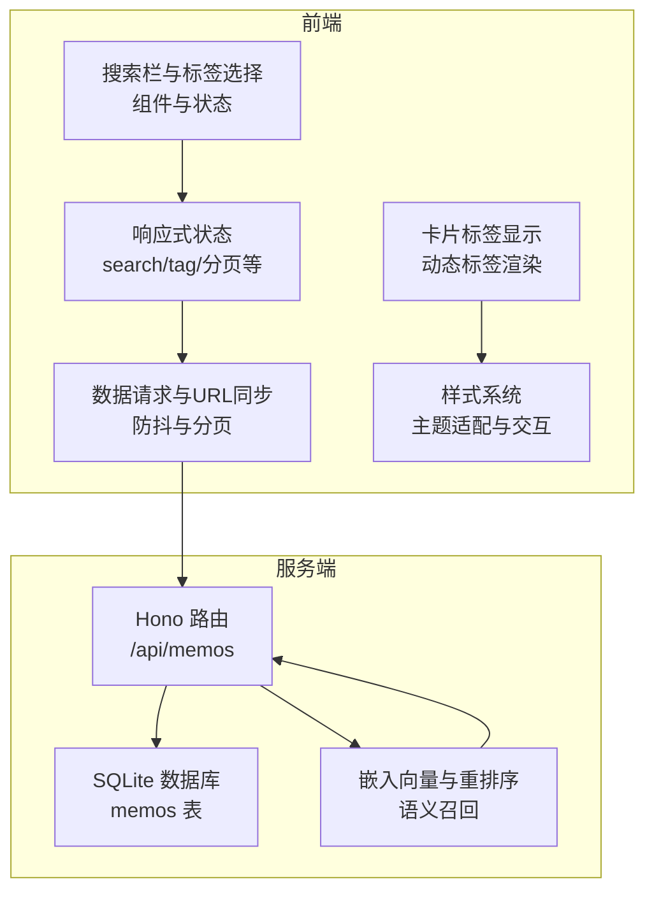
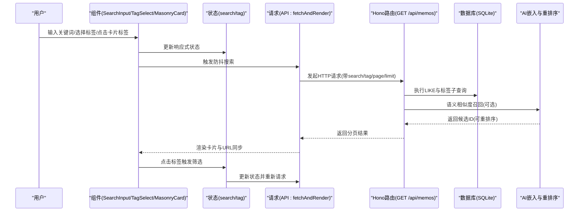
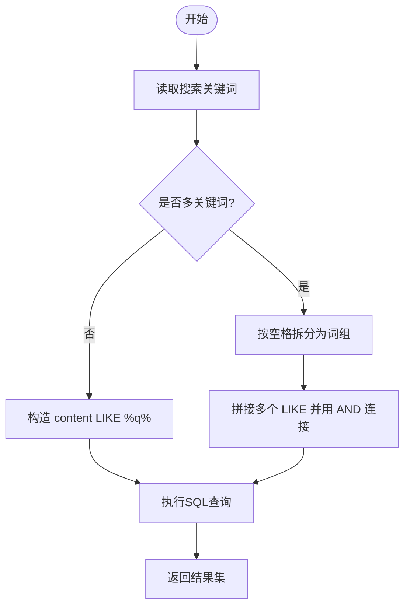
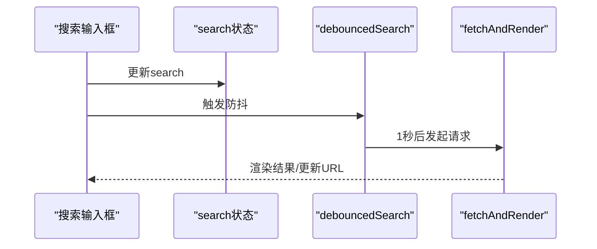
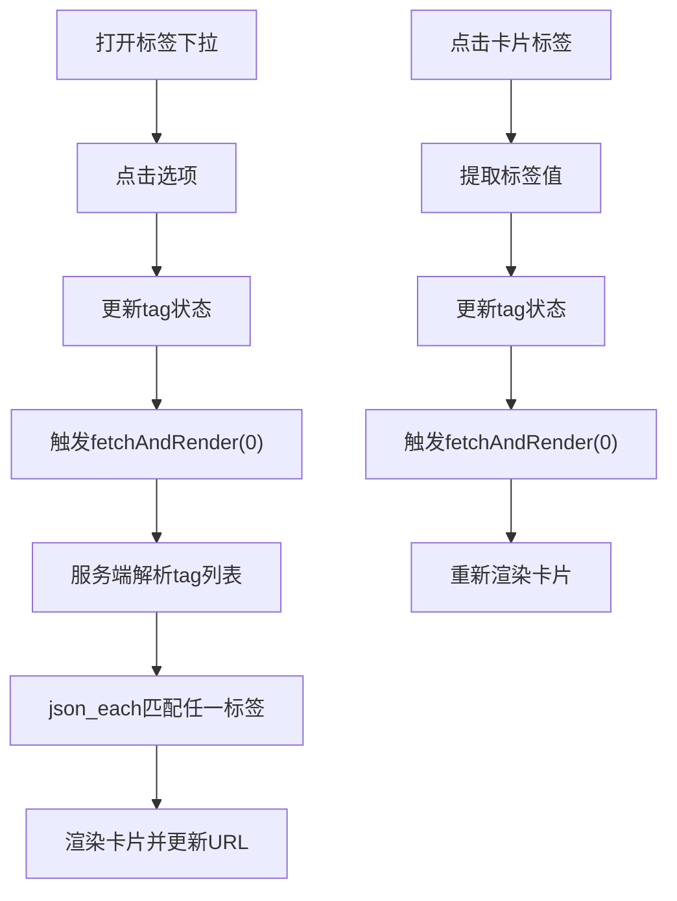
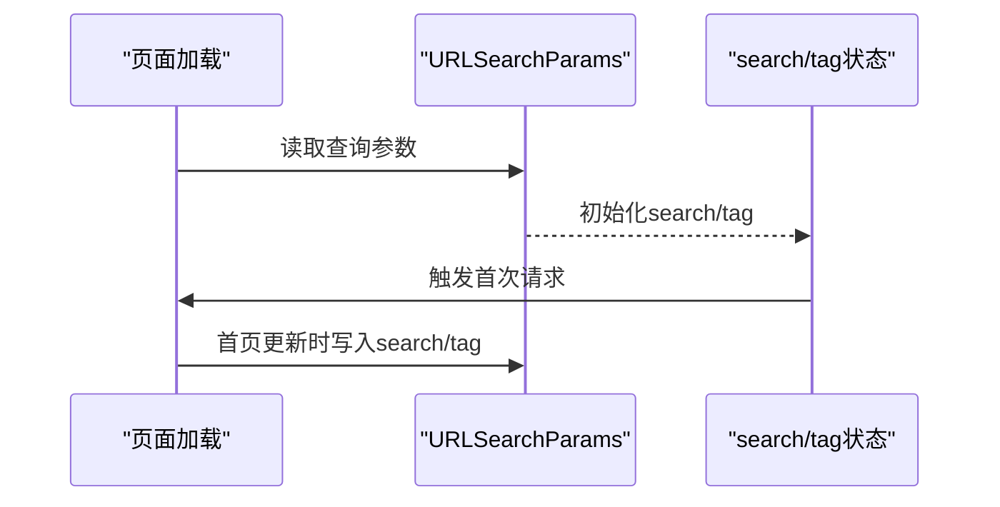
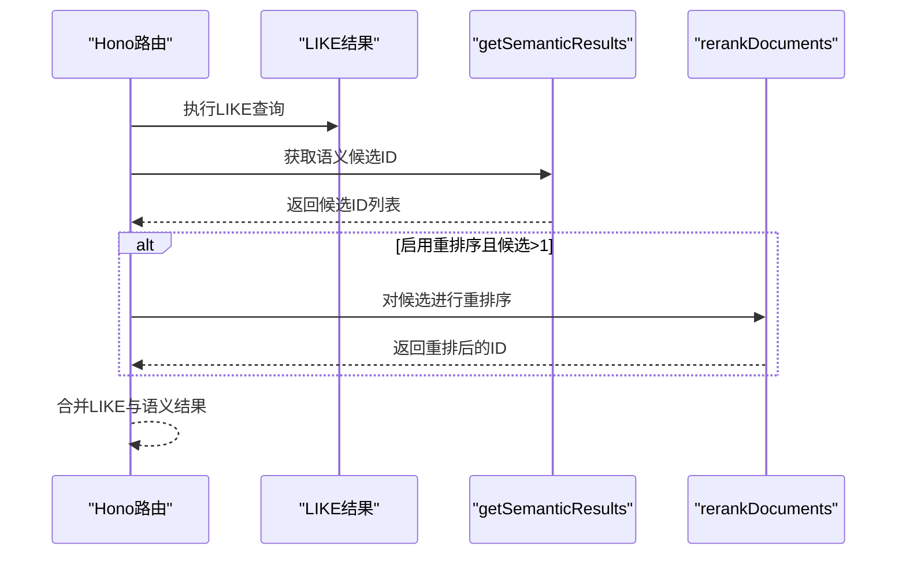
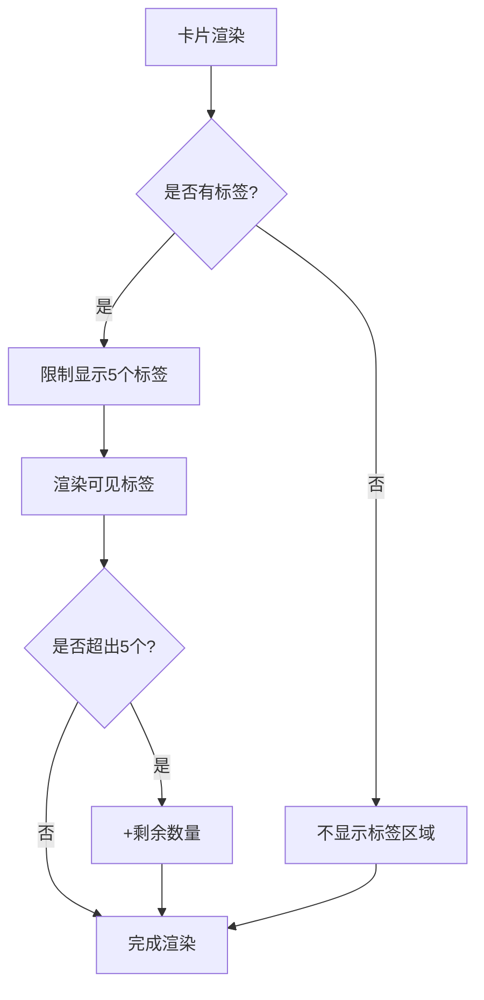
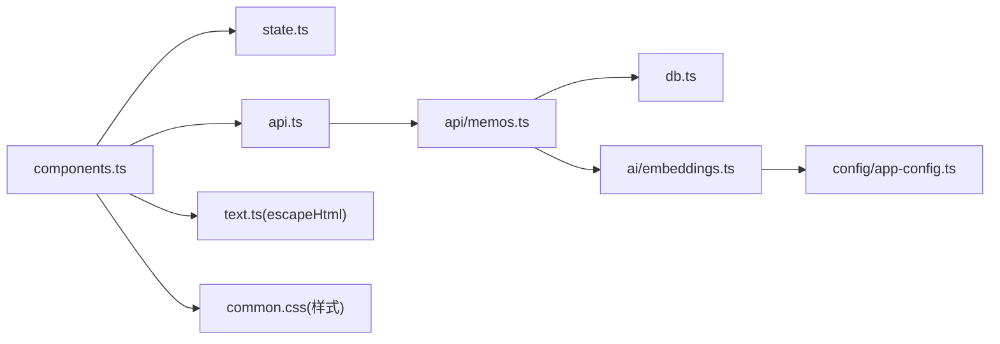

# 搜索与过滤功能

<cite>
**本文引用的文件**
- [README.md](file://README.md)
- [src/frontend/masonry/index.html](file://src/frontend/masonry/index.html)
- [src/frontend/masonry/index.ts](file://src/frontend/masonry/index.ts)
- [src/frontend/masonry/state.ts](file://src/frontend/masonry/state.ts)
- [src/frontend/masonry/api.ts](file://src/frontend/masonry/api.ts)
- [src/frontend/masonry/components.ts](file://src/frontend/masonry/components.ts)
- [src/frontend/shared/utils/text.ts](file://src/frontend/shared/utils/text.ts)
- [src/api/memos.ts](file://src/api/memos.ts)
- [src/db.ts](file://src/db.ts)
- [src/ai/embeddings.ts](file://src/ai/embeddings.ts)
- [src/config/app-config.ts](file://src/config/app-config.ts)
- [src/frontend/shared/styles/common.css](file://src/frontend/shared/styles/common.css)
</cite>

## 更新摘要
**变更内容**
- 新增瀑布流界面标签显示功能的详细实现
- 增强标签过滤系统的用户体验设计
- 添加标签在卡片中的动态显示与交互功能
- 完善标签样式系统与主题适配

## 目录
1. [简介](#简介)
2. [项目结构](#项目结构)
3. [核心组件](#核心组件)
4. [架构总览](#架构总览)
5. [详细组件分析](#详细组件分析)
6. [依赖关系分析](#依赖关系分析)
7. [性能考量](#性能考量)
8. [故障排查指南](#故障排查指南)
9. [结论](#结论)
10. [附录](#附录)

## 简介
本文件聚焦"搜索与过滤"功能的完整实现，覆盖关键词匹配算法（精确匹配、模糊搜索、多关键词组合）、实时过滤机制（输入事件处理、防抖优化、即时结果）、标签过滤系统（标签选择、多标签筛选、过滤状态管理）、搜索结果高亮（关键词标记、HTML 转义与安全处理）、URL 参数同步（搜索状态持久化与分享链接生成），并提供性能优化与用户体验改进建议。

**更新** 本次更新重点增强了瀑布流界面的标签显示功能，现在支持更丰富的标签过滤体验，包括卡片内标签的动态显示、标签交互筛选和增强的视觉反馈。

## 项目结构
瀑布流首页采用 VanJS 响应式前端，结合服务端 Hono API 与 SQLite 数据库，实现"搜索 + 标签筛选"的实时过滤体验；同时支持语义相似度召回与重排序，提升检索质量。

**图表来源**
- [src/frontend/masonry/components.ts:164-256](file://src/frontend/masonry/components.ts#L164-L256)
- [src/frontend/masonry/state.ts:42-60](file://src/frontend/masonry/state.ts#L42-L60)
- [src/frontend/masonry/api.ts:51-130](file://src/frontend/masonry/api.ts#L51-L130)
- [src/api/memos.ts:28-70](file://src/api/memos.ts#L28-L70)
- [src/db.ts:122-169](file://src/db.ts#L122-L169)
- [src/ai/embeddings.ts:95-154](file://src/ai/embeddings.ts#L95-L154)

**章节来源**
- [README.md:178-186](file://README.md#L178-L186)
- [src/frontend/masonry/index.html:48-168](file://src/frontend/masonry/index.html#L48-L168)
- [src/frontend/masonry/index.ts:6-22](file://src/frontend/masonry/index.ts#L6-L22)

## 核心组件
- 前端状态与UI
  - 搜索输入框与标签下拉选择，绑定响应式状态 search 与 tag
  - 防抖函数 debouncedSearch 控制搜索触发频率
  - URL 同步：首次加载与分页更新时写入 URL 查询参数
  - **新增** 卡片标签显示：每个备忘录卡片显示最多5个标签，支持点击跳转筛选
- 服务端 API
  - GET /api/memos 支持 search、tag、all、page、limit 参数
  - 模糊匹配 content LIKE %q%，标签使用 json_each 子查询匹配任一标签
  - 语义召回：在 LIKE 结果基础上合并语义相似度候选，支持重排序
  - **新增** GET /api/memos/tags 提供标签列表接口
- 数据库层
  - LIKE 模糊匹配与标签 IN 子查询
  - 标签去重与排序：getAllTags 使用 json_each 提取 DISTINCT 标签
- 安全与高亮
  - 前端统一使用 escapeHtml 对文本进行 HTML 转义，避免 XSS

**章节来源**
- [src/frontend/masonry/components.ts:52-121](file://src/frontend/masonry/components.ts#L52-L121)
- [src/frontend/masonry/api.ts:133-140](file://src/frontend/masonry/api.ts#L133-L140)
- [src/frontend/masonry/api.ts:105-130](file://src/frontend/masonry/api.ts#L105-L130)
- [src/api/memos.ts:28-70](file://src/api/memos.ts#L28-L70)
- [src/db.ts:122-179](file://src/db.ts#L122-L179)
- [src/frontend/shared/utils/text.ts:1-12](file://src/frontend/shared/utils/text.ts#L1-L12)

## 架构总览
搜索与过滤的端到端流程如下：

**图表来源**
- [src/frontend/masonry/components.ts:52-121](file://src/frontend/masonry/components.ts#L52-L121)
- [src/frontend/masonry/api.ts:51-130](file://src/frontend/masonry/api.ts#L51-L130)
- [src/api/memos.ts:28-70](file://src/api/memos.ts#L28-L70)
- [src/db.ts:122-169](file://src/db.ts#L122-L169)
- [src/ai/embeddings.ts:95-154](file://src/ai/embeddings.ts#L95-L154)

## 详细组件分析

### 关键词匹配算法
- 模糊搜索（LIKE）
  - 服务端对 content 使用 LIKE %q% 进行模糊匹配
  - 前端输入变更后经防抖触发，避免高频查询
- 精确匹配（标签）
  - 服务端解析 tag 参数，支持逗号分隔的多个标签，使用 json_each 子查询匹配任一标签
- 多关键词组合搜索
  - 当前实现以 search 字段作为单一模糊条件；如需多关键词组合，可在客户端扩展为"空格分词 + 多条件 AND"，并在服务端转换为多个 LIKE 条件或正则/FTS（需额外索引）

**图表来源**
- [src/db.ts:141-158](file://src/db.ts#L141-L158)
- [src/api/memos.ts:28-70](file://src/api/memos.ts#L28-L70)

**章节来源**
- [src/db.ts:122-169](file://src/db.ts#L122-L169)
- [src/api/memos.ts:28-70](file://src/api/memos.ts#L28-L70)

### 实时过滤机制
- 输入事件处理
  - 搜索输入框 oninput 将值写入响应式状态 search，并调用 debouncedSearch
- 防抖优化
  - 统一的防抖函数在每次输入后延迟 1000ms 触发一次请求，减少网络与数据库压力
- 即时结果显示
  - 首次加载与分页加载分别控制 loading 与 loadingMore 状态，保证 UI 流畅

**图表来源**
- [src/frontend/masonry/components.ts:52-62](file://src/frontend/masonry/components.ts#L52-L62)
- [src/frontend/masonry/api.ts:133-140](file://src/frontend/masonry/api.ts#L133-L140)
- [src/frontend/masonry/api.ts:51-130](file://src/frontend/masonry/api.ts#L51-L130)

**章节来源**
- [src/frontend/masonry/components.ts:52-62](file://src/frontend/masonry/components.ts#L52-L62)
- [src/frontend/masonry/api.ts:133-140](file://src/frontend/masonry/api.ts#L133-L140)
- [src/frontend/masonry/api.ts:51-130](file://src/frontend/masonry/api.ts#L51-L130)

### 标签过滤系统
- 标签选择
  - 下拉选择组件 TagSelect 支持"全部标签"与具体标签切换
  - 选择后更新 tag 状态并立即触发 fetchAndRender(0)
- 多标签筛选
  - 服务端解析逗号分隔的 tag 列表，使用 json_each(value IN (...)) 匹配任一标签
- 过滤状态管理
  - 响应式状态 search、tag、page、hasMore、loading 等协同控制 UI 与请求
- **新增** 卡片标签交互
  - 每个卡片最多显示5个标签，超出部分显示"+剩余数量"
  - 点击标签可直接触发筛选，无需手动输入
  - 标签样式支持主题切换和悬停效果

**图表来源**
- [src/frontend/masonry/components.ts:65-121](file://src/frontend/masonry/components.ts#L65-L121)
- [src/frontend/masonry/components.ts:186-207](file://src/frontend/masonry/components.ts#L186-L207)
- [src/frontend/masonry/api.ts:51-130](file://src/frontend/masonry/api.ts#L51-L130)
- [src/db.ts:145-158](file://src/db.ts#L145-L158)

**章节来源**
- [src/frontend/masonry/components.ts:65-121](file://src/frontend/masonry/components.ts#L65-L121)
- [src/frontend/masonry/components.ts:186-207](file://src/frontend/masonry/components.ts#L186-L207)
- [src/db.ts:145-158](file://src/db.ts#L145-L158)

### 搜索结果高亮功能
- 关键词标记
  - 当前实现未对关键词进行高亮标记，仅对输出文本进行 HTML 转义
- HTML 转义与安全处理
  - 前端统一使用 escapeHtml 对标签与内容进行转义，防止 XSS
- 建议
  - 如需高亮，可在客户端对 content 进行关键词高亮替换（注意保持 HTML 结构安全），或服务端返回匹配位置信息由前端高亮

**章节来源**
- [src/frontend/shared/utils/text.ts:1-12](file://src/frontend/shared/utils/text.ts#L1-L12)
- [src/frontend/masonry/components.ts:263-278](file://src/frontend/masonry/components.ts#L263-L278)

### URL 参数同步机制
- 搜索状态持久化
  - 首次加载时从 URL 查询参数读取 search 与 tag，并写入响应式状态
- 分页与分享链接生成
  - 第一页更新时将 search 与 tag 写入 URL，支持浏览器前进/后退与书签分享
- 注意事项
  - 分页参数 page/limit 在服务端处理，但 URL 中未显式同步；如需深度分享，可将 page/limit 也写入 URL

**图表来源**
- [src/frontend/masonry/index.ts:6-12](file://src/frontend/masonry/index.ts#L6-L12)
- [src/frontend/masonry/api.ts:111-120](file://src/frontend/masonry/api.ts#L111-L120)

**章节来源**
- [src/frontend/masonry/index.ts:6-12](file://src/frontend/masonry/index.ts#L6-L12)
- [src/frontend/masonry/api.ts:111-120](file://src/frontend/masonry/api.ts#L111-L120)

### 语义搜索与召回融合
- 语义召回
  - 服务端在 LIKE 结果基础上调用 getSemanticResults 获取相似备忘录 ID
  - 若存在额外候选，则按原始顺序追加到结果中
- 重排序
  - 可选启用 rerankDocuments，对候选进行重排序，再取前 N
- 配置
  - 相似度阈值、候选 TopN、最终 TopN 等由 app.config.json 控制

**图表来源**
- [src/api/memos.ts:35-54](file://src/api/memos.ts#L35-L54)
- [src/ai/embeddings.ts:95-154](file://src/ai/embeddings.ts#L95-L154)
- [src/config/app-config.ts:15-22](file://src/config/app-config.ts#L15-L22)

**章节来源**
- [src/api/memos.ts:35-54](file://src/api/memos.ts#L35-L54)
- [src/ai/embeddings.ts:95-154](file://src/ai/embeddings.ts#L95-L154)
- [src/config/app-config.ts:15-22](file://src/config/app-config.ts#L15-L22)

### 卡片标签显示系统
- 动态标签渲染
  - 每个卡片最多显示5个标签，超出部分显示"+剩余数量"
  - 标签采用圆角样式，支持悬停效果和点击交互
- 标签交互功能
  - 点击标签可直接触发筛选，无需手动输入
  - 支持单标签和多标签组合筛选
- 样式系统
  - 基于 CSS 变量的主题适配，支持明暗主题切换
  - 标签颜色在不同主题下自动调整
  - 响应式设计，移动端友好

**图表来源**
- [src/frontend/masonry/components.ts:186-207](file://src/frontend/masonry/components.ts#L186-L207)
- [src/frontend/masonry/state.ts:13-21](file://src/frontend/masonry/state.ts#L13-L21)

**章节来源**
- [src/frontend/masonry/components.ts:186-207](file://src/frontend/masonry/components.ts#L186-L207)
- [src/frontend/masonry/state.ts:13-21](file://src/frontend/masonry/state.ts#L13-L21)

## 依赖关系分析
- 前端组件依赖
  - components.ts 依赖 state.ts 的响应式状态与工具函数
  - components.ts 依赖 api.ts 的请求与防抖函数
  - components.ts 依赖 shared/utils/text.ts 的 HTML 转义
  - **新增** components.ts 依赖 common.css 的样式定义
- 服务端依赖
  - memos.ts 依赖 db.ts 的查询实现与 getAllTags
  - memos.ts 依赖 ai/embeddings.ts 的语义召回与重排序
- 配置依赖
  - ai/embeddings.ts 依赖 app-config.ts 的相似度阈值与重排序配置

**图表来源**
- [src/frontend/masonry/components.ts:1-40](file://src/frontend/masonry/components.ts#L1-L40)
- [src/frontend/masonry/state.ts:1-40](file://src/frontend/masonry/state.ts#L1-L40)
- [src/frontend/masonry/api.ts:1-27](file://src/frontend/masonry/api.ts#L1-L27)
- [src/frontend/shared/utils/text.ts:1-12](file://src/frontend/shared/utils/text.ts#L1-L12)
- [src/api/memos.ts:1-26](file://src/api/memos.ts#L1-L26)
- [src/db.ts:1-20](file://src/db.ts#L1-L20)
- [src/ai/embeddings.ts:1-11](file://src/ai/embeddings.ts#L1-L11)
- [src/config/app-config.ts:1-29](file://src/config/app-config.ts#L1-L29)

**章节来源**
- [src/frontend/masonry/components.ts:1-40](file://src/frontend/masonry/components.ts#L1-L40)
- [src/frontend/masonry/api.ts:1-27](file://src/frontend/masonry/api.ts#L1-L27)
- [src/api/memos.ts:1-26](file://src/api/memos.ts#L1-L26)

## 性能考量
- 防抖与节流
  - 防抖时间 1000ms 已显著降低请求频率；可根据输入长度与网络状况调整
- 分页与无限滚动
  - 服务端支持 page/limit 分页；前端滚动至底部自动加载下一页，避免一次性渲染大量卡片
- 语义召回成本
  - 嵌入向量相似度计算与可选重排序会增加延迟；建议：
    - 限制候选 TopN 与最终 TopN
    - 仅在搜索词长度超过阈值时启用
    - 缓存热门查询的语义结果
- 数据库索引
  - 建议为 tags 字段建立 JSON 索引（如可用）或使用虚拟列配合 LIKE 优化
- 前端渲染
  - 使用 @chenglou/pretext 进行文本预排版与布局缓存，减少重复计算
- **新增** 标签渲染优化
  - 卡片标签限制显示数量，避免过多标签影响渲染性能
  - 标签点击事件采用事件委托，减少事件监听器数量

## 故障排查指南
- 搜索无结果
  - 检查 search 是否为空；确认 LIKE 条件是否正确传参
  - 确认 includePrivate 条件（all=true 仅管理员可见）
- 标签筛选无效
  - 确认 tag 参数格式为逗号分隔字符串；服务端会 trim 并过滤空值
  - 检查标签是否存在于数据库（getAllTags）
- **新增** 卡片标签显示问题
  - 检查标签数组是否正确传递到卡片组件
  - 确认标签样式类名是否正确应用
  - 验证标签点击事件是否正常触发
- 语义搜索异常
  - 检查 AI 能力开关与嵌入缓存是否加载成功
  - 查看相似度阈值与重排序配置
- URL 不同步
  - 首页仅在 pageNum=0 时更新 URL；分页加载不会更新 URL
- XSS 风险
  - 确保所有输出均经过 escapeHtml 转义

**章节来源**
- [src/frontend/masonry/api.ts:111-120](file://src/frontend/masonry/api.ts#L111-L120)
- [src/db.ts:145-158](file://src/db.ts#L145-L158)
- [src/ai/embeddings.ts:16-36](file://src/ai/embeddings.ts#L16-L36)
- [src/frontend/shared/utils/text.ts:1-12](file://src/frontend/shared/utils/text.ts#L1-L12)

## 结论
该搜索与过滤系统以简洁的 LIKE 模糊匹配为基础，结合标签子查询与可选的语义召回与重排序，实现了兼顾性能与质量的实时搜索体验。前端通过防抖与 URL 同步提升了交互效率与可分享性；安全方面通过统一的 HTML 转义保障了输出安全。

**更新** 本次增强显著改善了标签过滤体验，新增的卡片标签显示功能让用户能够更直观地浏览和筛选内容。标签的动态显示、交互筛选和主题适配使得整个界面更加友好和专业。后续可在多关键词组合、高亮显示与更精细的分页 URL 同步等方面进一步增强。

## 附录
- 关键实现路径参考
  - 搜索输入与防抖：[src/frontend/masonry/components.ts:52-62](file://src/frontend/masonry/components.ts#L52-L62)，[src/frontend/masonry/api.ts:133-140](file://src/frontend/masonry/api.ts#L133-L140)
  - 标签选择与筛选：[src/frontend/masonry/components.ts:65-121](file://src/frontend/masonry/components.ts#L65-L121)，[src/db.ts:145-158](file://src/db.ts#L145-L158)
  - **新增** 卡片标签显示：[src/frontend/masonry/components.ts:186-207](file://src/frontend/masonry/components.ts#L186-L207)，[src/frontend/masonry/state.ts:13-21](file://src/frontend/masonry/state.ts#L13-L21)
  - 服务端查询与语义融合：[src/api/memos.ts:28-70](file://src/api/memos.ts#L28-L70)，[src/ai/embeddings.ts:95-154](file://src/ai/embeddings.ts#L95-L154)
  - URL 同步与初始状态：[src/frontend/masonry/index.ts:6-12](file://src/frontend/masonry/index.ts#L6-L12)，[src/frontend/masonry/api.ts:111-120](file://src/frontend/masonry/api.ts#L111-L120)
  - HTML 转义工具：[src/frontend/shared/utils/text.ts:1-12](file://src/frontend/shared/utils/text.ts#L1-L12)
  - **新增** 样式系统：[src/frontend/shared/styles/common.css:30-77](file://src/frontend/shared/styles/common.css#L30-L77)，[src/frontend/masonry/index.html:437-464](file://src/frontend/masonry/index.html#L437-L464)