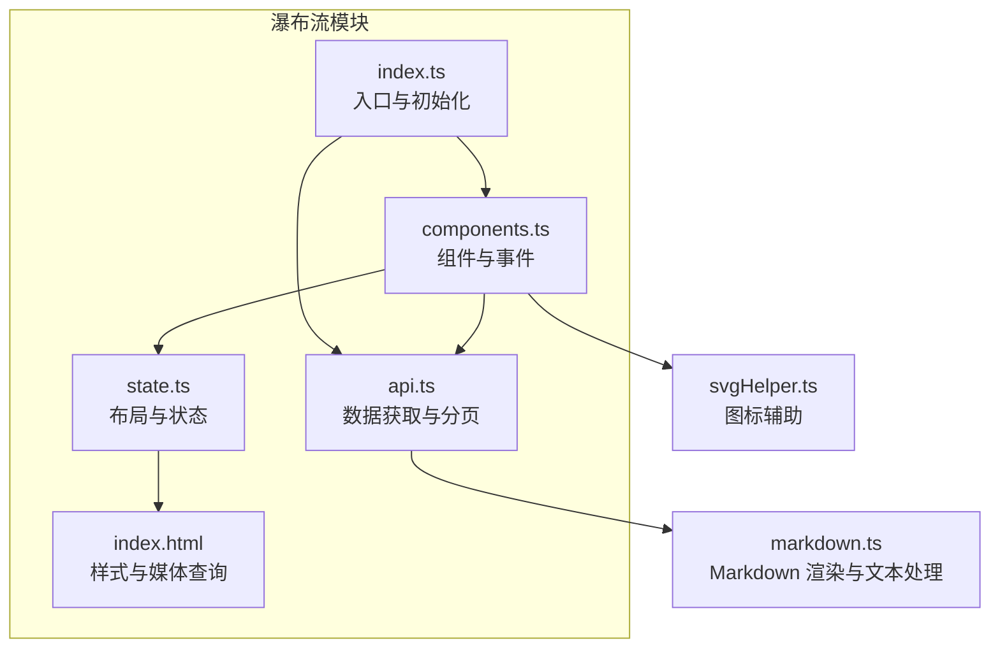
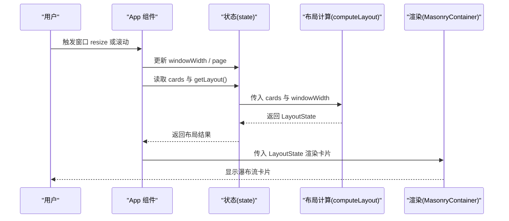
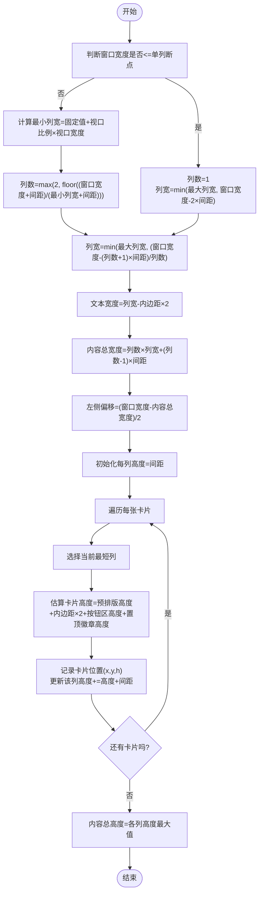
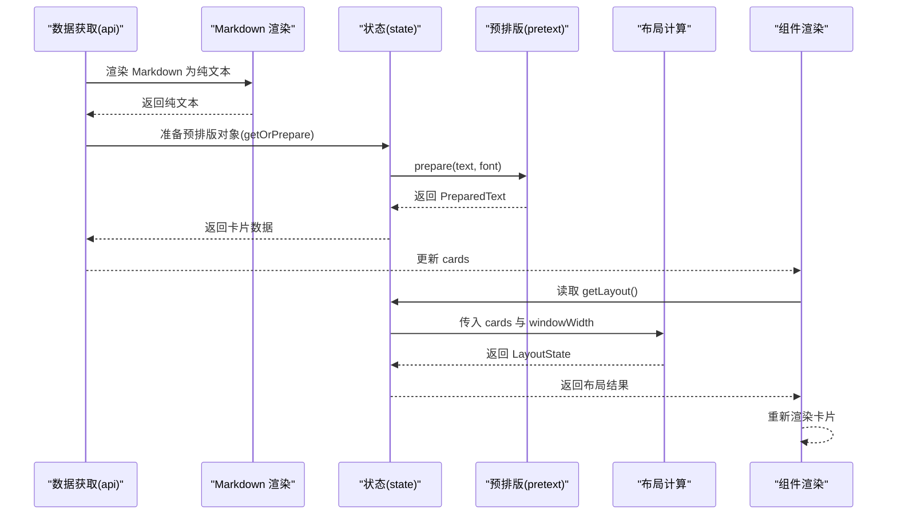
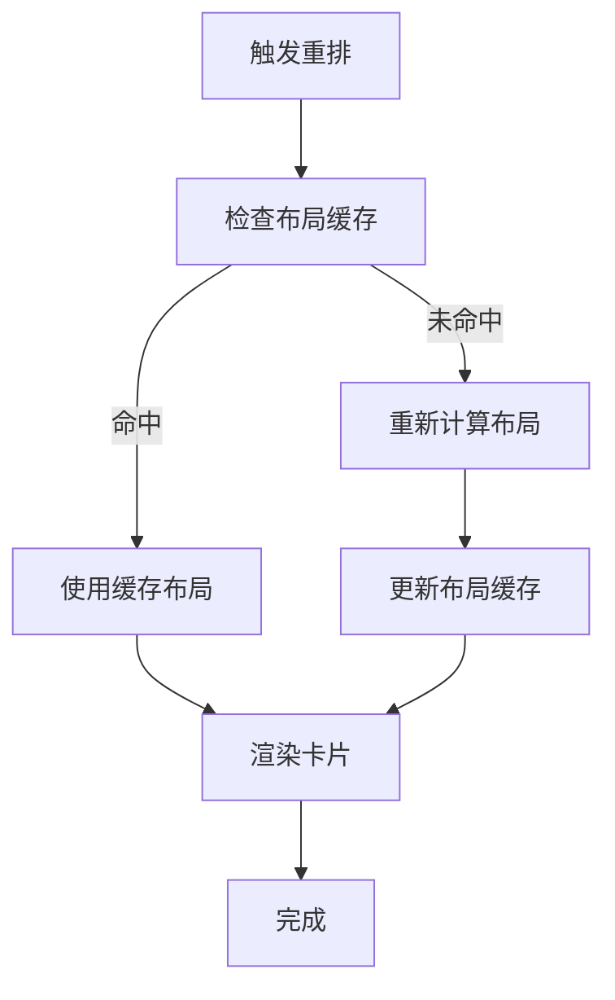
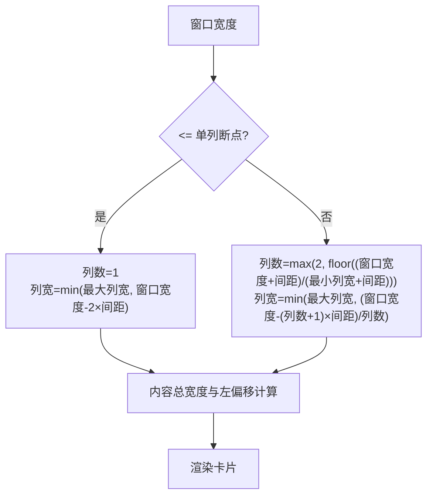
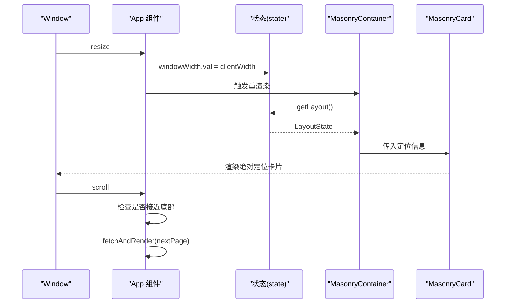
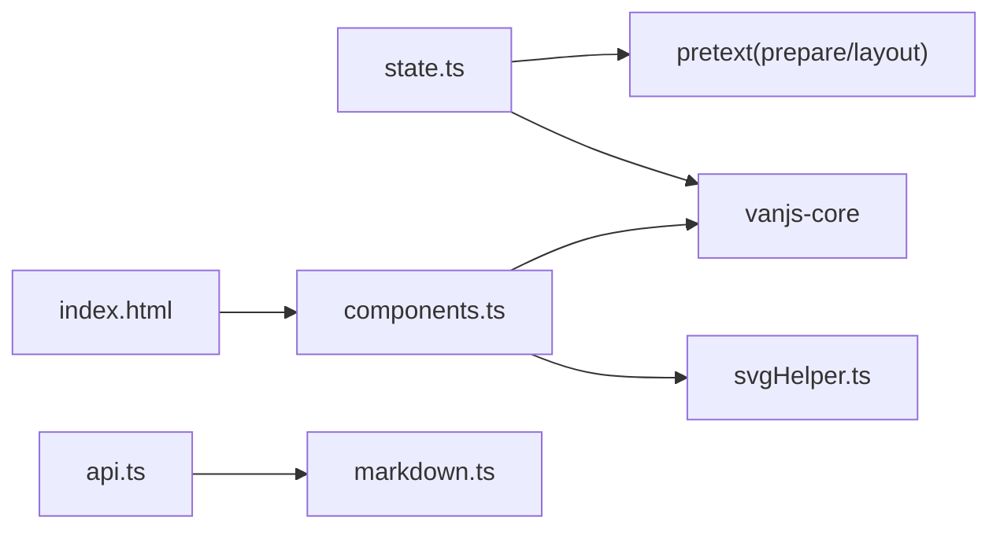

# 瀑布流布局算法

<cite>
**本文引用的文件**
- [src/frontend/masonry/index.ts](file://src/frontend/masonry/index.ts)
- [src/frontend/masonry/state.ts](file://src/frontend/masonry/state.ts)
- [src/frontend/masonry/components.ts](file://src/frontend/masonry/components.ts)
- [src/frontend/masonry/api.ts](file://src/frontend/masonry/api.ts)
- [src/frontend/masonry/index.html](file://src/frontend/masonry/index.html)
- [src/helper/markdown.ts](file://src/helper/markdown.ts)
- [src/helper/svgHelper.ts](file://src/helper/svgHelper.ts)
- [README.md](file://README.md)
</cite>

## 目录
1. [简介](#简介)
2. [项目结构](#项目结构)
3. [核心组件](#核心组件)
4. [架构总览](#架构总览)
5. [详细组件分析](#详细组件分析)
6. [依赖关系分析](#依赖关系分析)
7. [性能考量](#性能考量)
8. [故障排查指南](#故障排查指南)
9. [结论](#结论)
10. [附录](#附录)

## 简介
本技术文档围绕前端瀑布流布局算法进行深入解析，重点覆盖以下方面：
- 列数计算算法：基于窗口宽度的动态列数确定、最小列宽限制与最大列数控制
- 元素高度估算机制：占位符高度计算、异步高度更新与布局重排触发条件
- 布局重排算法：元素重新分配、高度平衡策略与性能优化
- 响应式布局：断点检测、列数动态调整与移动端适配
- 具体流程图与边界情况处理，帮助读者快速理解并扩展该实现

## 项目结构
瀑布流布局位于前端子模块 masonry 中，采用 VanJS 响应式框架与 @chenglou/pretext 文本排版库实现精确的高度估算与布局计算。核心文件如下：
- 入口与初始化：index.ts
- 布局与状态：state.ts
- 组件与事件：components.ts
- 数据获取与分页：api.ts
- 样式与媒体查询：index.html
- Markdown 渲染与文本处理：helper/markdown.ts
- 图标辅助：helper/svgHelper.ts

图表来源
- [src/frontend/masonry/index.ts:1-23](file://src/frontend/masonry/index.ts#L1-L23)
- [src/frontend/masonry/state.ts:1-181](file://src/frontend/masonry/state.ts#L1-L181)
- [src/frontend/masonry/components.ts:1-337](file://src/frontend/masonry/components.ts#L1-L337)
- [src/frontend/masonry/api.ts:1-162](file://src/frontend/masonry/api.ts#L1-L162)
- [src/frontend/masonry/index.html:1-427](file://src/frontend/masonry/index.html#L1-L427)
- [src/helper/markdown.ts:1-148](file://src/helper/markdown.ts#L1-L148)
- [src/helper/svgHelper.ts:1-113](file://src/helper/svgHelper.ts#L1-L113)

章节来源
- [README.md:178-186](file://README.md#L178-L186)

## 核心组件
- 布局配置与常量：字体、行高、内边距、列间距、最大列宽、单列断点等
- 卡片类型与布局状态：卡片数据结构、定位信息、布局结果
- 布局计算函数：根据窗口宽度计算列数与列宽、逐列高度累加、定位每个卡片位置
- 布局缓存：避免重复计算，提升滚动性能
- 组件渲染：基于布局结果生成绝对定位的卡片容器
- 事件与交互：窗口尺寸变化、滚动加载更多、搜索与筛选

章节来源
- [src/frontend/masonry/state.ts:5-33](file://src/frontend/masonry/state.ts#L5-L33)
- [src/frontend/masonry/state.ts:84-152](file://src/frontend/masonry/state.ts#L84-L152)
- [src/frontend/masonry/components.ts:203-219](file://src/frontend/masonry/components.ts#L203-L219)
- [src/frontend/masonry/index.ts:21-22](file://src/frontend/masonry/index.ts#L21-L22)

## 架构总览
瀑布流布局由“数据获取 -> 文本预处理 -> 布局计算 -> 组件渲染 -> 事件驱动”的链路构成。数据层负责分页与筛选；文本层负责将 Markdown 渲染为纯文本并准备预排版对象；布局层计算列数、列宽与每列高度，输出定位信息；渲染层将定位信息映射为绝对定位的卡片；事件层响应窗口尺寸变化与滚动加载。

图表来源
- [src/frontend/masonry/components.ts:283-336](file://src/frontend/masonry/components.ts#L283-L336)
- [src/frontend/masonry/state.ts:84-152](file://src/frontend/masonry/state.ts#L84-L152)
- [src/frontend/masonry/index.ts:284-298](file://src/frontend/masonry/index.ts#L284-L298)

## 详细组件分析

### 列数计算与布局算法
- 断点与列数规则
  - 当视口宽度小于等于单列断点阈值时，强制单列，列宽不超过窗口宽度减去两侧间距
  - 否则计算最小列宽：固定像素 + 视口比例，列数取整，列宽受最大列宽限制
- 列宽与内容宽度
  - 文本宽度 = 列宽 - 内边距×2
  - 内容总宽度 = 列数×列宽 + (列数-1)×间距
  - 左侧偏移 = (窗口宽度 - 内容总宽度)/2，保证居中
- 列高度数组与最短列选择
  - 初始化每列高度为间距
  - 对每个卡片，选择当前最短列插入，更新该列高度
- 卡片高度估算
  - 使用预排版库计算文本高度，叠加卡片内边距、按钮区高度、置顶徽章高度
- 结果输出
  - 返回列宽、内容总高度、每张卡片的定位信息

图表来源
- [src/frontend/masonry/state.ts:84-133](file://src/frontend/masonry/state.ts#L84-L133)

章节来源
- [src/frontend/masonry/state.ts:84-133](file://src/frontend/masonry/state.ts#L84-L133)

### 元素高度估算与异步更新
- 预排版与缓存
  - 使用预排版库对文本进行预处理，得到可测量的排版对象
  - 缓存已准备的预排版对象，避免重复计算
- 文本准备与截断
  - 在数据获取阶段，先将 Markdown 渲染为纯文本，再进行截断，最后准备预排版对象
- 布局计算中的高度估算
  - 通过预排版对象计算文本高度，叠加按钮区与置顶徽章高度，得到卡片总高度
- 异步更新与重排触发
  - 当窗口尺寸变化或卡片集合变化时，重新计算布局并触发渲染
  - 由于 VanJS 的响应式机制，状态变更会自动触发组件重渲染

图表来源
- [src/frontend/masonry/api.ts:91-103](file://src/frontend/masonry/api.ts#L91-L103)
- [src/frontend/masonry/state.ts:64-70](file://src/frontend/masonry/state.ts#L64-L70)
- [src/frontend/masonry/state.ts:84-133](file://src/frontend/masonry/state.ts#L84-L133)
- [src/frontend/masonry/components.ts:203-219](file://src/frontend/masonry/components.ts#L203-L219)

章节来源
- [src/frontend/masonry/api.ts:91-103](file://src/frontend/masonry/api.ts#L91-L103)
- [src/frontend/masonry/state.ts:64-70](file://src/frontend/masonry/state.ts#L64-L70)
- [src/frontend/masonry/state.ts:84-133](file://src/frontend/masonry/state.ts#L84-L133)
- [src/frontend/masonry/components.ts:203-219](file://src/frontend/masonry/components.ts#L203-L219)

### 布局重排与性能优化
- 重排触发条件
  - 窗口尺寸变化（resize）
  - 新增卡片（分页加载）
  - 搜索或筛选条件变化
- 重排策略
  - 采用“最短列优先”策略，尽量保持列高度均衡
  - 使用浮点数组存储列高度，减少整数溢出风险
- 性能优化
  - 布局结果缓存：当卡片集合与窗口宽度不变时复用上次布局结果
  - 仅渲染可视区域卡片（结合滚动事件与分页）
  - 预排版缓存：避免重复计算相同文本的排版对象
  - 绝对定位：避免频繁的 DOM 重排与回流

图表来源
- [src/frontend/masonry/state.ts:140-152](file://src/frontend/masonry/state.ts#L140-L152)
- [src/frontend/masonry/components.ts:283-298](file://src/frontend/masonry/components.ts#L283-L298)

章节来源
- [src/frontend/masonry/state.ts:140-152](file://src/frontend/masonry/state.ts#L140-L152)
- [src/frontend/masonry/components.ts:283-298](file://src/frontend/masonry/components.ts#L283-L298)

### 响应式布局与移动端适配
- 断点与列数
  - 单列断点：当视口宽度小于等于阈值时，强制单列
  - 多列：根据最小列宽与列间距计算列数，列宽受最大列宽限制
- 媒体查询与 UI 适配
  - 搜索栏与标签选择器在窄屏下换行与收缩，保证可用性
  - 卡片在窄屏下宽度自适应，确保内容不被裁剪
- 事件驱动
  - 监听窗口 resize，实时更新 windowWidth 并触发布局重算
  - 滚动接近底部时触发分页加载

图表来源
- [src/frontend/masonry/state.ts:87-100](file://src/frontend/masonry/state.ts#L87-L100)
- [src/frontend/masonry/index.html:131-168](file://src/frontend/masonry/index.html#L131-L168)
- [src/frontend/masonry/index.ts:284-287](file://src/frontend/masonry/index.ts#L284-L287)

章节来源
- [src/frontend/masonry/state.ts:87-100](file://src/frontend/masonry/state.ts#L87-L100)
- [src/frontend/masonry/index.html:131-168](file://src/frontend/masonry/index.html#L131-L168)
- [src/frontend/masonry/index.ts:284-287](file://src/frontend/masonry/index.ts#L284-L287)

### 组件与事件交互
- App 组件
  - 监听 resize 事件，更新 windowWidth
  - 监听 scroll 事件，滚动接近底部时加载下一页
- MasonryContainer
  - 基于 getLayout() 的布局结果渲染卡片
  - 每个卡片使用绝对定位，位置由布局结果决定
- 交互按钮
  - 查看相似、复制文本、展开详情等按钮通过事件回调触发相应行为

图表来源
- [src/frontend/masonry/components.ts:283-336](file://src/frontend/masonry/components.ts#L283-L336)
- [src/frontend/masonry/state.ts:203-219](file://src/frontend/masonry/state.ts#L203-L219)

章节来源
- [src/frontend/masonry/components.ts:283-336](file://src/frontend/masonry/components.ts#L283-L336)
- [src/frontend/masonry/state.ts:203-219](file://src/frontend/masonry/state.ts#L203-L219)

## 依赖关系分析
- @chenglou/pretext：用于文本预排版与高度估算
- VanJS：用于响应式状态与组件渲染
- 浏览器环境：依赖 document、window 等 DOM API
- Markdown 渲染：使用 marked 与 DOMPurify 进行安全渲染与清洗

图表来源
- [src/frontend/masonry/state.ts:1-2](file://src/frontend/masonry/state.ts#L1-L2)
- [src/frontend/masonry/components.ts:1-39](file://src/frontend/masonry/components.ts#L1-L39)
- [src/frontend/masonry/api.ts:1-27](file://src/frontend/masonry/api.ts#L1-L27)
- [src/frontend/masonry/index.html:1-427](file://src/frontend/masonry/index.html#L1-L427)

章节来源
- [src/frontend/masonry/state.ts:1-2](file://src/frontend/masonry/state.ts#L1-L2)
- [src/frontend/masonry/components.ts:1-39](file://src/frontend/masonry/components.ts#L1-L39)
- [src/frontend/masonry/api.ts:1-27](file://src/frontend/masonry/api.ts#L1-L27)
- [src/frontend/masonry/index.html:1-427](file://src/frontend/masonry/index.html#L1-L427)

## 性能考量
- 布局缓存：避免重复计算，提高滚动与窗口变化时的响应速度
- 预排版缓存：避免重复准备相同文本的排版对象
- 最短列优先：减少列间高度差异，降低滚动时的视觉抖动
- 分页加载：仅加载可见区域附近的卡片，减少一次性渲染压力
- 绝对定位：避免频繁的 DOM 重排与回流，提升渲染性能

## 故障排查指南
- 布局异常或卡片重叠
  - 检查列数与列宽计算是否符合预期
  - 确认窗口宽度更新是否正确
  - 验证预排版高度与叠加高度是否一致
- 卡片高度估算不准
  - 确认字体、行高、内边距、按钮区高度与徽章高度是否正确
  - 检查预排版对象是否正确缓存
- 响应式效果异常
  - 检查媒体查询与断点设置
  - 确认窄屏下的 UI 组件布局是否正常
- 滚动加载无效
  - 检查滚动事件监听与阈值设置
  - 确认分页参数与请求 URL 是否正确

章节来源
- [src/frontend/masonry/state.ts:84-133](file://src/frontend/masonry/state.ts#L84-L133)
- [src/frontend/masonry/components.ts:283-298](file://src/frontend/masonry/components.ts#L283-L298)
- [src/frontend/masonry/api.ts:51-130](file://src/frontend/masonry/api.ts#L51-L130)

## 结论
该瀑布流布局算法通过“预排版高度估算 + 最短列优先分配 + 布局缓存”的组合，在保证视觉均衡的同时实现了良好的性能表现。其响应式设计与事件驱动机制使得在不同设备与交互场景下均能稳定运行。建议在实际项目中结合业务需求进一步扩展缓存策略与懒加载能力，以获得更佳的用户体验。

## 附录
- 关键配置项
  - 字体与行高：用于预排版高度计算
  - 内边距与列间距：影响列宽与内容总宽度
  - 最大列宽与单列断点：控制布局密度与移动端体验
- 边界情况
  - 窗口宽度极小：强制单列，列宽受限
  - 卡片数量极少：布局结果简单，性能开销低
  - 预排版对象缺失：触发重新准备，可能产生短暂延迟

章节来源
- [src/frontend/masonry/state.ts:5-10](file://src/frontend/masonry/state.ts#L5-L10)
- [src/frontend/masonry/state.ts:84-133](file://src/frontend/masonry/state.ts#L84-L133)