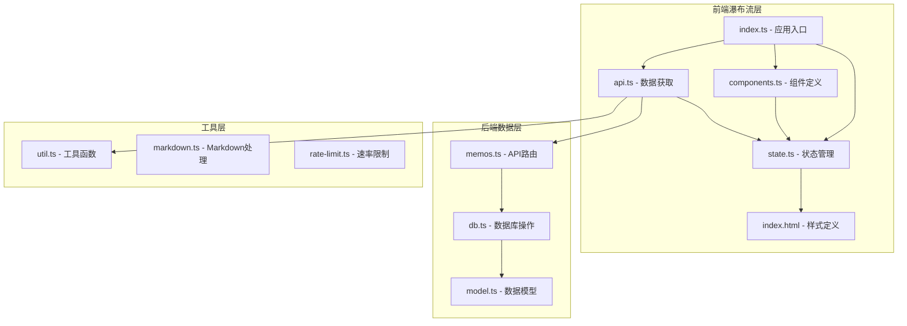
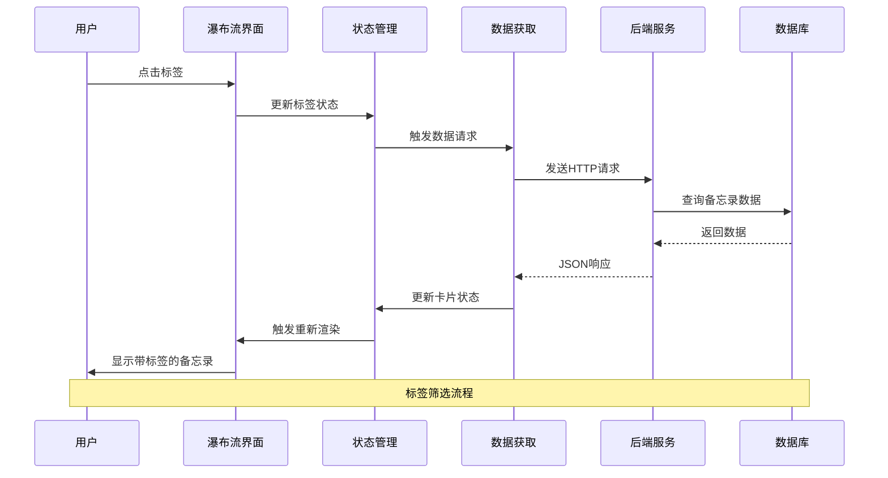
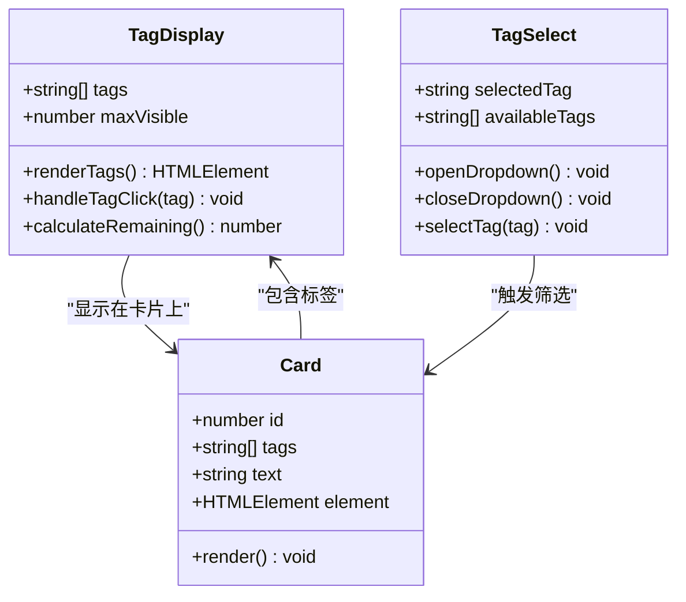
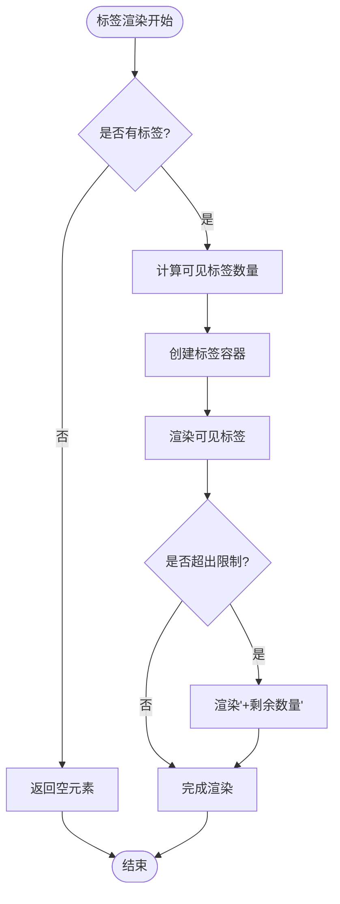
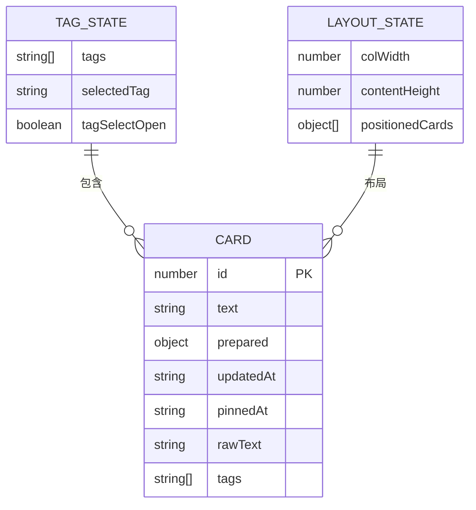
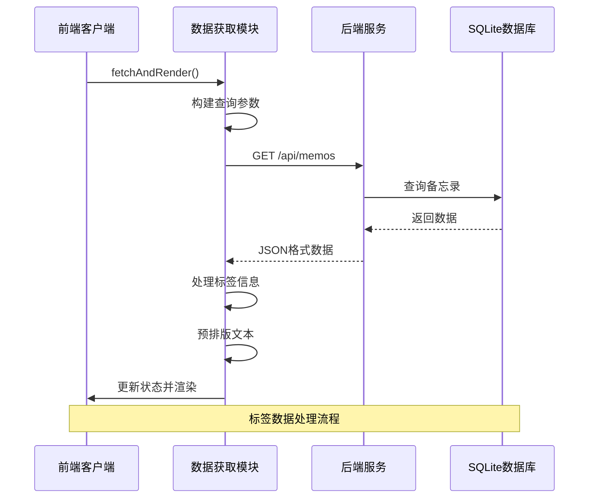

# 瀑布流标签显示

<cite>
**本文档引用的文件**
- [README.md](file://README.md)
- [index.ts](file://src/frontend/masonry/index.ts)
- [state.ts](file://src/frontend/masonry/state.ts)
- [components.ts](file://src/frontend/masonry/components.ts)
- [api.ts](file://src/frontend/masonry/api.ts)
- [index.html](file://src/frontend/masonry/index.html)
- [memos.ts](file://src/api/memos.ts)
- [db.ts](file://src/db.ts)
- [util.ts](file://src/helper/util.ts)
</cite>

## 目录
1. [简介](#简介)
2. [项目结构](#项目结构)
3. [核心组件](#核心组件)
4. [架构概览](#架构概览)
5. [详细组件分析](#详细组件分析)
6. [依赖关系分析](#依赖关系分析)
7. [性能考虑](#性能考虑)
8. [故障排除指南](#故障排除指南)
9. [结论](#结论)

## 简介

Memos 是一个基于 Bun 运行时构建的轻量级备忘录应用系统，采用瀑布流布局展示备忘录内容。该系统支持标签分类、全文搜索、公开/私密备忘录管理等功能。本文档专注于瀑布流标签显示功能的实现细节和技术分析。

## 项目结构

Memos 项目采用模块化架构设计，主要分为前端瀑布流展示层和后端数据处理层：



**图表来源**
- [index.ts:1-51](file://src/frontend/masonry/index.ts#L1-L51)
- [state.ts:1-185](file://src/frontend/masonry/state.ts#L1-L185)
- [components.ts:1-392](file://src/frontend/masonry/components.ts#L1-L392)
- [api.ts:1-167](file://src/frontend/masonry/api.ts#L1-L167)

**章节来源**
- [README.md:25-45](file://README.md#L25-L45)
- [index.ts:1-51](file://src/frontend/masonry/index.ts#L1-L51)

## 核心组件

瀑布流标签显示功能由以下核心组件构成：

### 状态管理系统
- **卡片状态**: 管理备忘录卡片的数据结构和布局信息
- **查询状态**: 处理搜索关键词和标签筛选条件
- **布局状态**: 计算瀑布流布局参数和位置信息
- **标签状态**: 维护可用标签列表和选择状态

### 组件渲染系统
- **过滤栏**: 包含搜索输入框和标签选择器
- **瀑布流容器**: 实现动态布局计算和卡片渲染
- **标签组件**: 显示单个备忘录的标签信息
- **模态框**: 提供相似备忘录搜索功能

**章节来源**
- [state.ts:13-62](file://src/frontend/masonry/state.ts#L13-L62)
- [components.ts:142-274](file://src/frontend/masonry/components.ts#L142-L274)

## 架构概览

瀑布流标签显示采用响应式架构设计，实现了前后端分离的数据交互模式：



**图表来源**
- [components.ts:185-207](file://src/frontend/masonry/components.ts#L185-L207)
- [api.ts:53-135](file://src/frontend/masonry/api.ts#L53-L135)
- [memos.ts:28-70](file://src/api/memos.ts#L28-L70)

## 详细组件分析

### 标签显示组件

标签显示组件是瀑布流界面的核心功能模块，负责在每个备忘录卡片上展示相关的标签信息：



**图表来源**
- [components.ts:185-207](file://src/frontend/masonry/components.ts#L185-L207)
- [state.ts:13-21](file://src/frontend/masonry/state.ts#L13-L21)

#### 标签渲染逻辑

标签组件实现了智能截断和交互功能：

1. **标签截断**: 最多显示5个标签，超出部分显示"+N"形式
2. **点击交互**: 点击标签触发全局筛选，更新URL参数
3. **样式定制**: 每个标签使用统一的样式类进行渲染

#### 瀑布流布局集成

标签显示与瀑布流布局系统深度集成：



**图表来源**
- [components.ts:185-207](file://src/frontend/masonry/components.ts#L185-L207)
- [state.ts:86-137](file://src/frontend/masonry/state.ts#L86-L137)

**章节来源**
- [components.ts:164-256](file://src/frontend/masonry/components.ts#L164-L256)
- [index.html:437-464](file://src/frontend/masonry/index.html#L437-L464)

### 状态管理机制

状态管理系统采用响应式设计，确保标签显示与用户交互的实时同步：

#### 卡片状态结构



**图表来源**
- [state.ts:13-34](file://src/frontend/masonry/state.ts#L13-L34)
- [state.ts:43-62](file://src/frontend/masonry/state.ts#L43-L62)

#### 布局计算算法

瀑布流布局算法根据屏幕宽度动态计算列数和卡片位置：

1. **自适应列数**: 窄屏单列，宽屏多列布局
2. **高度计算**: 基于文本预排版计算准确高度
3. **位置分配**: 选择最短列插入新卡片
4. **缓存优化**: 避免重复计算相同的布局

**章节来源**
- [state.ts:87-156](file://src/frontend/masonry/state.ts#L87-L156)

### 数据获取与处理

数据获取层负责从后端API获取备忘录数据并进行标签处理：

#### API调用流程



**图表来源**
- [api.ts:53-135](file://src/frontend/masonry/api.ts#L53-L135)
- [memos.ts:28-70](file://src/api/memos.ts#L28-L70)

#### 标签数据处理

后端数据库使用JSON存储标签数组，支持复杂的查询操作：

1. **标签存储**: 使用SQLite的json_each函数存储和查询
2. **多标签支持**: 支持逗号分隔的多个标签查询
3. **去重排序**: 返回去重后的标签列表并按字母顺序排序

**章节来源**
- [api.ts:30-51](file://src/frontend/masonry/api.ts#L30-L51)
- [db.ts:171-179](file://src/db.ts#L171-L179)

## 依赖关系分析

瀑布流标签显示功能涉及多个层次的依赖关系：

```mermaid
graph TB
subgraph "前端依赖"
A[vanjs-core - 响应式框架]
B[@chenglou/pretext - 文本预排版]
C[SVG图标 - 图标资源]
D[本地存储 - 主题配置]
end
subgraph "后端依赖"
E[Hono - Web框架]
F[bun:sqlite - SQLite驱动]
G[AI嵌入 - 相似度搜索]
H[速率限制 - 请求控制]
end
subgraph "外部API"
I[fetch - HTTP客户端]
J[URLSearchParams - URL处理]
K[localStorage - 本地存储]
end
A --> B
A --> C
A --> D
E --> F
E --> G
E --> H
A --> I
A --> J
A --> K
```

**图表来源**
- [index.ts:1-6](file://src/frontend/masonry/index.ts#L1-L6)
- [memos.ts:1-26](file://src/api/memos.ts#L1-L26)

**章节来源**
- [index.ts:1-51](file://src/frontend/masonry/index.ts#L1-L51)
- [memos.ts:1-220](file://src/api/memos.ts#L1-L220)

## 性能考虑

瀑布流标签显示功能在设计时充分考虑了性能优化：

### 渲染优化策略

1. **虚拟滚动**: 只渲染可视区域内的卡片
2. **布局缓存**: 缓存计算结果避免重复布局
3. **文本预排版**: 使用预排版算法提高渲染精度
4. **事件节流**: 搜索输入采用防抖机制

### 内存管理

1. **对象池**: 复用DOM元素减少内存分配
2. **垃圾回收**: 及时清理不再使用的状态
3. **图片懒加载**: 避免不必要的资源加载

## 故障排除指南

### 常见问题及解决方案

#### 标签不显示问题

**症状**: 备忘录卡片上没有标签显示
**可能原因**:
- 标签数据格式错误
- CSS样式冲突
- JavaScript执行错误

**解决步骤**:
1. 检查数据库中标签字段格式
2. 验证CSS类名是否正确
3. 查看浏览器控制台错误信息

#### 布局异常问题

**症状**: 瀑布流布局错乱或重叠
**可能原因**:
- 窗口尺寸变化未触发重绘
- 文本预排版计算错误
- 样式冲突导致高度计算异常

**解决步骤**:
1. 确认resize事件监听正常工作
2. 检查字体和行高设置
3. 验证CSS盒模型配置

**章节来源**
- [components.ts:358-382](file://src/frontend/masonry/components.ts#L358-L382)
- [state.ts:144-156](file://src/frontend/masonry/state.ts#L144-L156)

## 结论

瀑布流标签显示功能展现了现代Web应用的优秀实践，通过响应式架构、高效的布局算法和优雅的用户交互设计，为用户提供了一个流畅、直观的备忘录浏览体验。该功能不仅实现了基础的标签展示需求，还为后续的功能扩展奠定了坚实的技术基础。

系统的主要优势包括：
- **高性能**: 采用虚拟滚动和布局缓存技术
- **响应式**: 支持多种屏幕尺寸和设备
- **可扩展**: 模块化设计便于功能扩展
- **用户体验**: 流畅的交互和视觉反馈

未来可以考虑的功能增强方向：
- 标签云功能
- 标签搜索建议
- 批量标签操作
- 自定义标签样式