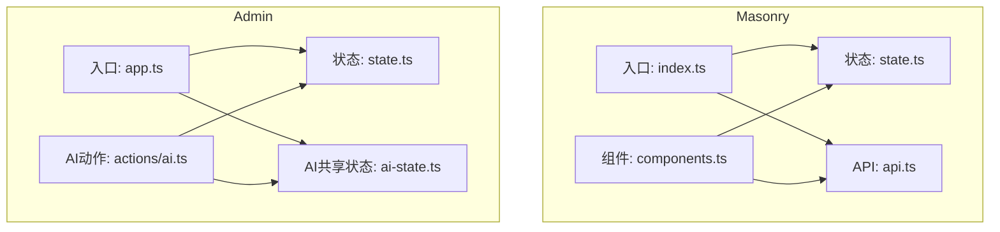
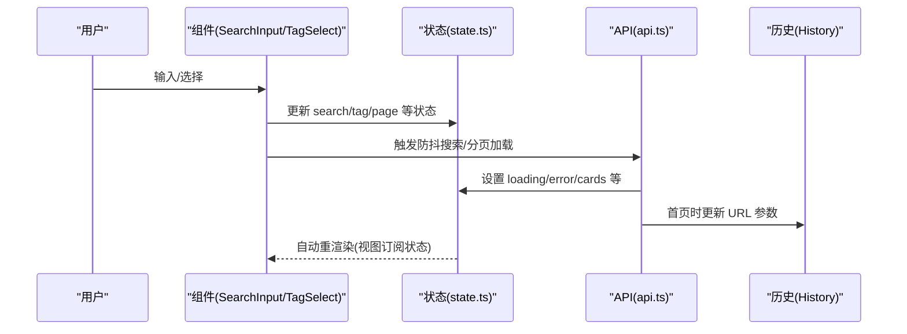
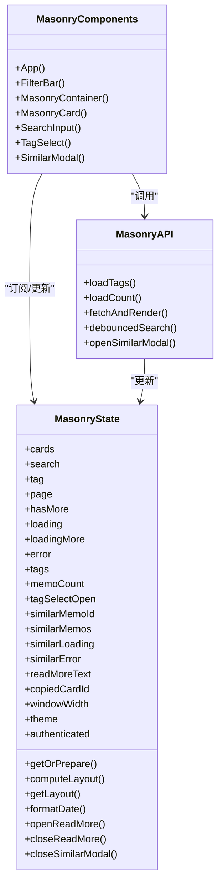

# 状态管理机制

<cite>
**本文引用的文件**
- [state.ts](file://src/frontend/masonry/state.ts)
- [index.ts](file://src/frontend/masonry/index.ts)
- [components.ts](file://src/frontend/masonry/components.ts)
- [api.ts](file://src/frontend/masonry/api.ts)
- [ReadMoreModal.ts](file://src/frontend/shared/components/ReadMoreModal.ts)
- [state.ts](file://src/frontend/admin/state.ts)
- [app.ts](file://src/frontend/admin/app.ts)
- [ai.ts](file://src/frontend/admin/actions/ai.ts)
- [ai-state.ts](file://src/frontend/admin/ai-state.ts)
</cite>

## 更新摘要
**变更内容**
- 简化状态管理架构，移除 generateModalOpen、previewOpen、previewMemos 等旧状态变量
- 更新状态管理最佳实践和组件通信模式
- 优化状态类型划分和命名约定
- 改进模态框状态管理机制

## 目录
1. [简介](#简介)
2. [项目结构](#项目结构)
3. [核心组件](#核心组件)
4. [架构总览](#架构总览)
5. [详细组件分析](#详细组件分析)
6. [依赖关系分析](#依赖关系分析)
7. [性能考量](#性能考量)
8. [故障排查指南](#故障排查指南)
9. [结论](#结论)
10. [附录](#附录)

## 简介
本文件系统性阐述 Masonry 界面的状态管理机制，重点围绕 vanjs 响应式数据绑定与自动更新、状态类型划分（搜索、标签、窗口、数据等）、状态同步（URL 同步、组件间共享、全局状态）、持久化策略（localStorage 使用、状态恢复与离线支持）、性能优化（批量更新、状态合并、渲染优化）以及调试与开发辅助工具的使用方法。文档同时对比 Admin 管理端的状态模式，帮助读者建立统一的状态管理认知。

**更新** 本版本反映了最新的状态管理架构简化，移除了过时的状态变量，采用了更清晰的状态命名和管理模式。

## 项目结构
Masonry 与 Admin 均采用"状态集中定义 + 组件按需订阅"的模式：
- Masonry：在独立模块中集中声明所有响应式状态，组件通过状态直接驱动视图更新。
- Admin：同样集中定义状态，但引入了跨模块共享（如 AI 模型选择）与更复杂的数据流（列表、表单、AI 工具箱、导入导出等）。

**图表来源**
- [index.ts:1-51](file://src/frontend/masonry/index.ts#L1-L51)
- [state.ts:1-185](file://src/frontend/masonry/state.ts#L1-L185)
- [components.ts:1-400](file://src/frontend/masonry/components.ts#L1-L400)
- [api.ts:1-167](file://src/frontend/masonry/api.ts#L1-L167)
- [app.ts:1-306](file://src/frontend/admin/app.ts#L1-L306)
- [state.ts:1-168](file://src/frontend/admin/state.ts#L1-L168)
- [ai-state.ts:1-10](file://src/frontend/admin/ai-state.ts#L1-L10)
- [ai.ts](file://src/frontend/admin/actions/ai.ts)

**章节来源**
- [index.ts:1-51](file://src/frontend/masonry/index.ts#L1-L51)
- [state.ts:1-185](file://src/frontend/masonry/state.ts#L1-L185)
- [components.ts:1-400](file://src/frontend/masonry/components.ts#L1-L400)
- [api.ts:1-167](file://src/frontend/masonry/api.ts#L1-L167)
- [app.ts:1-306](file://src/frontend/admin/app.ts#L1-L306)
- [state.ts:1-168](file://src/frontend/admin/state.ts#L1-L168)
- [ai-state.ts:1-10](file://src/frontend/admin/ai-state.ts#L1-L10)

## 核心组件
- Masonry 状态模块：集中定义卡片、布局、搜索、标签、窗口尺寸、相似内容、读取更多文本、复制状态、主题和认证状态等响应式状态，并提供布局计算缓存与文本预处理缓存。
- Masonry 组件模块：负责 UI 渲染、事件绑定、滚动加载、模态框控制等；通过状态驱动布局与内容更新。
- Masonry API 模块：负责标签加载、数量统计、分页加载与渲染、URL 同步、防抖搜索、相似内容查询等。
- Admin 状态模块：集中定义认证、全局错误、标签、时间线、AI 可用性、模型、表单、导入导出、创意内容等状态。
- Admin 应用模块：根据状态切换登录/管理页面，组织顶部栏、标签页、侧边时间线、主内容区与各类模态框。
- Admin AI 动作模块：封装 AI 模型选择的本地持久化与恢复、标签建议、AI 工具箱执行、结果替换或新建备忘录等流程。
- Admin AI 共享状态：提供 Provider 与 Model 的跨模块共享状态，便于不同入口复用。

**更新** 移除了 generateModalOpen、previewOpen、previewMemos 等过时状态变量，简化了状态管理架构。

**章节来源**
- [state.ts:1-185](file://src/frontend/masonry/state.ts#L1-L185)
- [components.ts:1-400](file://src/frontend/masonry/components.ts#L1-L400)
- [api.ts:1-167](file://src/frontend/masonry/api.ts#L1-L167)
- [state.ts:1-168](file://src/frontend/admin/state.ts#L1-L168)
- [app.ts:1-306](file://src/frontend/admin/app.ts#L1-L306)
- [ai.ts](file://src/frontend/admin/actions/ai.ts)
- [ai-state.ts:1-10](file://src/frontend/admin/ai-state.ts#L1-L10)

## 架构总览
Masonry 采用"状态驱动视图"的单向数据流：组件订阅状态，状态变化触发自动重渲染；API 层负责从后端拉取数据并更新状态；URL 与滚动事件作为外部输入参与状态更新。

**图表来源**
- [components.ts:79-148](file://src/frontend/masonry/components.ts#L79-L148)
- [api.ts:53-135](file://src/frontend/masonry/api.ts#L53-L135)
- [state.ts:42-62](file://src/frontend/masonry/state.ts#L42-L62)

## 详细组件分析

### Masonry 响应式状态系统与自动更新
- 设计原理
  - 使用 vanjs 的响应式状态对象（van.state）封装可变数据，组件通过函数返回值或属性直接订阅状态，实现细粒度自动更新。
  - 状态变更会触发依赖该状态的节点重新计算与渲染，无需手动调用渲染函数。
- 关键状态
  - 数据状态：卡片数组、分页、是否还有更多、加载中、错误信息、相似内容、相似加载与错误、读取更多文本、复制状态。
  - 搜索与标签状态：搜索词、当前选中标签、可用标签列表、标签下拉展开状态。
  - 窗口状态：窗口宽度，用于动态布局计算。
  - 布局状态：列宽、内容高度、每张卡片的位置信息。
  - 主题与认证状态：主题模式、认证状态。
- 文本预处理与布局缓存
  - 预处理缓存：对已处理的文本进行缓存，避免重复计算。
  - 布局缓存：当卡片集合与窗口宽度未变化时，复用上次布局结果，减少昂贵的布局计算。
- 自动更新机制
  - 组件内通过状态访问器（如 () => state.val）订阅状态，状态变化即触发重渲染。
  - 布局计算在容器渲染时按需触发，避免不必要的重复计算。

**更新** 新增了主题和认证状态，移除了过时的模态框状态变量。

**章节来源**
- [state.ts:42-62](file://src/frontend/masonry/state.ts#L42-L62)
- [state.ts:64-73](file://src/frontend/masonry/state.ts#L64-L73)
- [state.ts:87-156](file://src/frontend/masonry/state.ts#L87-L156)

### 搜索、标签与窗口状态管理
- 搜索状态
  - 组件层：SearchInput 将输入值写入 search 状态，并触发防抖搜索。
  - API 层：防抖搜索在定时器结束后调用分页加载，首屏时更新 URL 参数以便书签化。
- 标签状态
  - 组件层：TagSelect 下拉展示可用标签，点击后设置 tag 并刷新数据。
  - 状态层：维护可用标签列表与当前选中标签。
- 窗口状态
  - 组件层：监听 resize 事件，更新 windowWidth 状态，触发布局重新计算。
  - 状态层：布局计算依赖窗口宽度，确保响应式布局。

**章节来源**
- [components.ts:79-148](file://src/frontend/masonry/components.ts#L79-L148)
- [components.ts:347-350](file://src/frontend/masonry/components.ts#L347-L350)
- [api.ts:116-125](file://src/frontend/masonry/api.ts#L116-L125)
- [api.ts:140-145](file://src/frontend/masonry/api.ts#L140-L145)
- [state.ts:60](file://src/frontend/masonry/state.ts#L60)

### 数据状态与无限滚动
- 数据状态
  - API 加载时设置 loading/hasMore/page/error 等状态，首屏清空卡片列表，后续分页追加。
  - 卡片由后端返回的备忘录数据转换而来，包含 ID、内容、更新时间、置顶标记等。
- 无限滚动
  - 组件监听滚动事件，在接近底部时自动加载下一页。
  - loadingMore 控制加载中的 UI 提示，hasMore 控制是否继续加载。

**章节来源**
- [api.ts:53-135](file://src/frontend/masonry/api.ts#L53-L135)
- [components.ts:352-361](file://src/frontend/masonry/components.ts#L352-L361)

### URL 状态同步与组件间状态共享
- URL 同步
  - 首次加载时从 URL 查询参数初始化搜索与标签状态。
  - 首屏搜索完成后，使用 history.replaceState 更新 URL，保持可书签性。
- 组件间状态共享
  - Masonry 中各组件通过共享状态模块直接访问与修改状态，无需显式传递。
  - Admin 中通过共享 AI 状态模块（selectedProvider/selectedModel）在不同入口之间共享模型选择。

**章节来源**
- [index.ts:25-30](file://src/frontend/masonry/index.ts#L25-L30)
- [api.ts:116-125](file://src/frontend/masonry/api.ts#L116-L125)
- [ai-state.ts:1-10](file://src/frontend/admin/ai-state.ts#L1-L10)

### 全局状态管理与模态框
- 全局状态
  - Masonry：通过单一状态模块集中管理，组件按需订阅，降低耦合。
  - Admin：状态模块更复杂，涵盖认证、全局错误、标签、时间线、AI、表单、导入导出等。
- 模态框
  - Masonry：相似内容弹窗、读取更多弹窗均通过状态控制显示/隐藏与内容。
  - Admin：登录页、表单弹窗、导入导出弹窗、AI 工具箱等均通过状态驱动。

**更新** 移除了 generateModalOpen、previewOpen、previewMemos 等过时的模态框状态变量，简化了模态框状态管理。

**章节来源**
- [state.ts:54-62](file://src/frontend/masonry/state.ts#L54-L62)
- [components.ts:284-344](file://src/frontend/masonry/components.ts#L284-L344)
- [ReadMoreModal.ts:1-71](file://src/frontend/shared/components/ReadMoreModal.ts#L1-L71)
- [app.ts:116-266](file://src/frontend/admin/app.ts#L116-L266)
- [app.ts:260-266](file://src/frontend/admin/app.ts#L260-L266)

### 状态持久化策略与离线支持
- localStorage 使用
  - Admin 的 AI 动作模块提供模型选择的持久化与恢复，键为固定字符串，存储 provider 与 model。
  - 在不可用或异常时进行容错处理，保证应用稳定性。
- 状态恢复
  - Masonry 首次加载从 URL 恢复搜索与标签状态。
  - Admin 在检查认证后进入相应页面，避免重复登录。
- 离线支持
  - 代码未见专门的离线缓存策略；可通过浏览器缓存与 URL 状态实现基本的"离线浏览"体验（如书签化 URL）。

**章节来源**
- [ai.ts](file://src/frontend/admin/actions/ai.ts)
- [index.ts:25-30](file://src/frontend/masonry/index.ts#L25-L30)
- [app.ts:270-281](file://src/frontend/admin/app.ts#L270-L281)

### 性能优化：批量更新、状态合并与渲染优化
- 批量更新
  - API 层在首次加载时一次性设置多个状态（loading、error、cards、hasMore、page），减少多次重渲染。
- 状态合并
  - 分页加载时采用"追加"而非"覆盖"，避免全量替换导致的重排。
- 渲染优化
  - 布局计算缓存：仅在卡片集合或窗口宽度变化时重新计算布局。
  - 文本预处理缓存：避免重复解析与格式化。
  - 防抖搜索：降低频繁请求与状态更新频率。
  - 无限滚动节流：通过 loadingMore 与 hasMore 控制加载节奏。

**章节来源**
- [api.ts:57-108](file://src/frontend/masonry/api.ts#L57-L108)
- [state.ts:139-156](file://src/frontend/masonry/state.ts#L139-L156)
- [state.ts:64-73](file://src/frontend/masonry/state.ts#L64-L73)
- [api.ts:140-145](file://src/frontend/masonry/api.ts#L140-L145)
- [components.ts:352-361](file://src/frontend/masonry/components.ts#L352-L361)

### 调试工具与开发辅助
- 状态可视化
  - 通过浏览器开发者工具观察状态对象的值变化，确认响应式更新是否生效。
- 日志与错误
  - API 层在失败时记录错误日志，同时设置错误状态，便于 UI 显示。
  - Admin 全局错误状态用于统一展示错误信息。
- URL 调试
  - 修改 URL 查询参数可快速验证状态恢复与渲染逻辑。
- 组件边界
  - 通过最小化组件职责与明确的状态边界，降低调试复杂度。

**章节来源**
- [api.ts:126-135](file://src/frontend/masonry/api.ts#L126-L135)
- [state.ts:30-32](file://src/frontend/admin/state.ts#L30-L32)
- [app.ts:283-305](file://src/frontend/admin/app.ts#L283-L305)

## 依赖关系分析

**图表来源**
- [state.ts:42-185](file://src/frontend/masonry/state.ts#L42-L185)
- [components.ts:283-400](file://src/frontend/masonry/components.ts#L283-L400)
- [api.ts:30-167](file://src/frontend/masonry/api.ts#L30-L167)

**章节来源**
- [state.ts:42-185](file://src/frontend/masonry/state.ts#L42-L185)
- [components.ts:1-400](file://src/frontend/masonry/components.ts#L1-L400)
- [api.ts:1-167](file://src/frontend/masonry/api.ts#L1-L167)

## 性能考量
- 计算缓存
  - 布局缓存：在卡片集合与窗口宽度不变时复用布局结果，显著降低重排成本。
  - 文本预处理缓存：避免重复解析 Markdown 与 HTML 标签剥离。
- 请求节流
  - 防抖搜索：降低高频输入带来的请求压力。
  - 无限滚动：通过 loadingMore 与 hasMore 控制加载节奏，避免过度请求。
- 渲染粒度
  - 组件按需订阅状态，只在相关状态变化时重渲染，提升整体性能。
- 内存管理
  - 缓存采用 Map 结构，注意在状态重置或路由切换时清理缓存，防止内存泄漏。

## 故障排查指南
- URL 不更新或状态不恢复
  - 检查首屏加载是否正确设置 search/tag，并确认 history.replaceState 是否被调用。
- 搜索无响应
  - 确认防抖定时器是否被正确清除与重建，以及分页加载是否正确设置 page 与 hasMore。
- 布局异常
  - 检查 windowWidth 是否正确更新，布局缓存是否被意外保留。
- 错误显示不一致
  - 确认 API 层在不同场景下正确设置 loading/error 状态，并在 finally 中清理 loadingMore。
- 模态框无法关闭
  - 检查模态框状态的打开/关闭函数是否被正确调用，以及 body 滚动控制逻辑。

**章节来源**
- [api.ts:116-125](file://src/frontend/masonry/api.ts#L116-L125)
- [api.ts:140-145](file://src/frontend/masonry/api.ts#L140-L145)
- [components.ts:352-361](file://src/frontend/masonry/components.ts#L352-L361)
- [state.ts:139-156](file://src/frontend/masonry/state.ts#L139-L156)
- [state.ts:170-185](file://src/frontend/masonry/state.ts#L170-L185)

## 结论
Masonry 的状态管理以 vanjs 响应式为核心，通过集中状态定义、细粒度订阅与自动更新，实现了简洁高效的 UI 数据流。配合 URL 同步、缓存与防抖等优化手段，系统在交互流畅性与性能上取得良好平衡。Admin 端进一步扩展了状态边界，引入跨模块共享与复杂业务流程，体现了状态管理在大型前端应用中的可扩展性与一致性。

**更新** 最新的状态管理架构更加简洁，移除了冗余的状态变量，采用了更清晰的命名约定，提高了代码的可维护性和可读性。

## 附录
- 开发建议
  - 保持状态粒度适中，避免过度拆分或聚合。
  - 对昂贵计算（布局、文本预处理）实施缓存策略。
  - 在关键路径上使用防抖与节流，减少无效渲染与请求。
  - 使用统一的错误状态与错误提示，提升用户体验。
  - 避免使用过时的状态变量，遵循最新的状态管理最佳实践。
- 进一步阅读
  - 参考 Admin 端的状态模块与 AI 动作模块，学习跨模块状态共享与持久化的最佳实践。
  - 学习如何设计简洁而高效的状态管理架构，避免状态膨胀。