# 组件架构设计

<cite>
**本文档引用的文件**
- [src/frontend/masonry/index.ts](file://src/frontend/masonry/index.ts)
- [src/frontend/masonry/components.ts](file://src/frontend/masonry/components.ts)
- [src/frontend/masonry/state.ts](file://src/frontend/masonry/state.ts)
- [src/frontend/masonry/api.ts](file://src/frontend/masonry/api.ts)
- [src/frontend/masonry/index.html](file://src/frontend/masonry/index.html)
- [src/frontend/shared/components/ReadMoreModal.ts](file://src/frontend/shared/components/ReadMoreModal.ts)
- [src/frontend/admin/app.ts](file://src/frontend/admin/app.ts)
- [src/frontend/admin/components/MemoCard.ts](file://src/frontend/admin/components/MemoCard.ts)
- [src/frontend/admin/state.ts](file://src/frontend/admin/state.ts)
- [src/frontend/admin/actions/memo.ts](file://src/frontend/admin/actions/memo.ts)
</cite>

## 目录
1. [简介](#简介)
2. [项目结构](#项目结构)
3. [核心组件](#核心组件)
4. [架构概览](#架构概览)
5. [详细组件分析](#详细组件分析)
6. [依赖关系分析](#依赖关系分析)
7. [性能考虑](#性能考虑)
8. [故障排除指南](#故障排除指南)
9. [结论](#结论)

## 简介

本设计文档深入分析了Masonry界面组件架构，这是一个基于VanJS的现代化前端应用。该架构采用组件化设计理念，实现了单一职责原则、组件复用和状态分离。系统包含两个主要界面：主页（Masonry布局）和管理员界面，每个界面都有独立的组件体系和状态管理。

## 项目结构

Masonry架构采用模块化设计，将功能按界面和职责进行清晰分离：

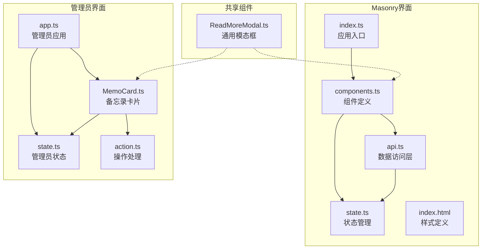

**图表来源**
- [src/frontend/masonry/index.ts:1-23](file://src/frontend/masonry/index.ts#L1-L23)
- [src/frontend/masonry/components.ts:1-337](file://src/frontend/masonry/components.ts#L1-L337)
- [src/frontend/admin/app.ts:1-251](file://src/frontend/admin/app.ts#L1-L251)

**章节来源**
- [src/frontend/masonry/index.ts:1-23](file://src/frontend/masonry/index.ts#L1-L23)
- [src/frontend/masonry/index.html:1-427](file://src/frontend/masonry/index.html#L1-L427)

## 核心组件

### Masonry主容器组件

App主容器是整个Masonry界面的核心，负责协调所有子组件的生命周期和状态同步：

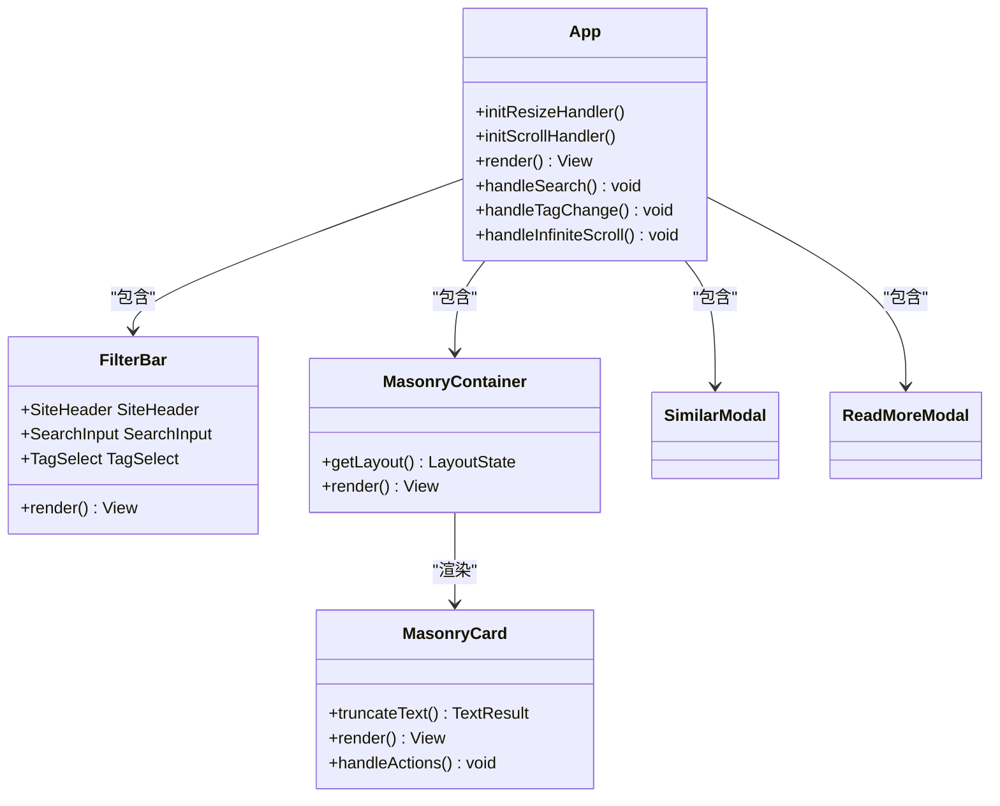

**图表来源**
- [src/frontend/masonry/components.ts:283-337](file://src/frontend/masonry/components.ts#L283-L337)
- [src/frontend/masonry/components.ts:123-130](file://src/frontend/masonry/components.ts#L123-L130)
- [src/frontend/masonry/components.ts:203-219](file://src/frontend/masonry/components.ts#L203-L219)

### 状态管理组件

状态管理采用集中式设计，所有组件通过响应式状态进行通信：

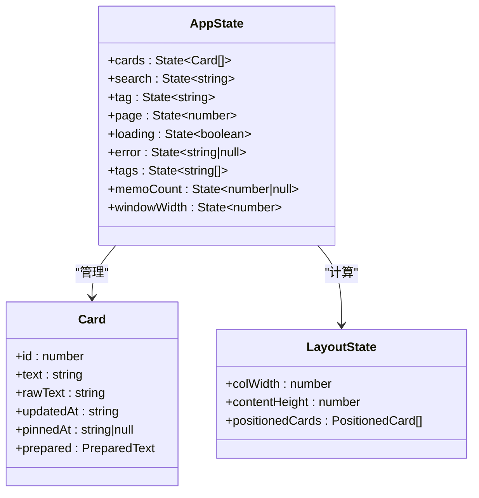

**图表来源**
- [src/frontend/masonry/state.ts:42-59](file://src/frontend/masonry/state.ts#L42-L59)
- [src/frontend/masonry/state.ts:13-40](file://src/frontend/masonry/state.ts#L13-L40)

**章节来源**
- [src/frontend/masonry/state.ts:1-181](file://src/frontend/masonry/state.ts#L1-L181)

## 架构概览

Masonry架构遵循以下设计原则：

### 单一职责原则
- **组件职责分离**：每个组件只负责特定的功能领域
- **状态管理分离**：UI状态与业务逻辑状态明确区分
- **数据流单向**：从父组件到子组件的单向数据流

### 组件复用设计
- **共享组件**：ReadMoreModal在多个界面中复用
- **配置化组件**：支持参数化的组件配置
- **组合模式**：通过函数组合实现复杂UI结构

### 状态分离策略
- **本地状态**：组件内部的临时状态
- **全局状态**：跨组件共享的应用状态
- **缓存状态**：计算结果和预处理数据的缓存

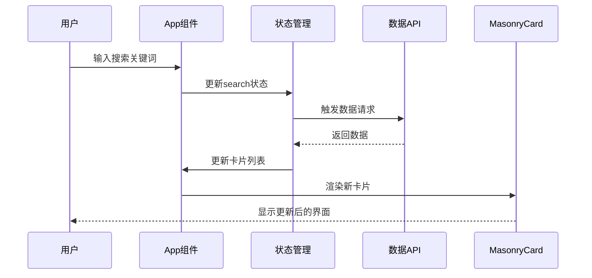

**图表来源**
- [src/frontend/masonry/components.ts:52-63](file://src/frontend/masonry/components.ts#L52-L63)
- [src/frontend/masonry/api.ts:51-130](file://src/frontend/masonry/api.ts#L51-L130)

## 详细组件分析

### MasonryCard组件分析

MasonryCard是核心展示组件，实现了复杂的交互逻辑：

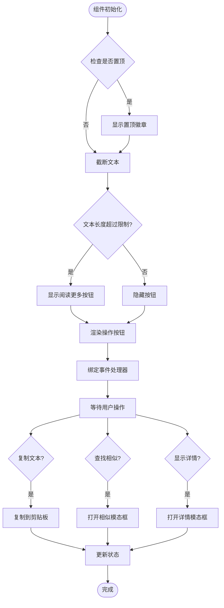

**图表来源**
- [src/frontend/masonry/components.ts:132-201](file://src/frontend/masonry/components.ts#L132-L201)

#### 组件特性
- **响应式布局**：根据窗口宽度动态调整列数
- **智能截断**：自动截断长文本并提供展开功能
- **交互丰富**：支持复制、相似查找、详情查看等操作
- **性能优化**：使用虚拟滚动避免大量DOM节点

**章节来源**
- [src/frontend/masonry/components.ts:132-201](file://src/frontend/masonry/components.ts#L132-L201)

### 状态管理系统分析

状态管理采用VanJS的响应式系统，实现了高效的状态更新：

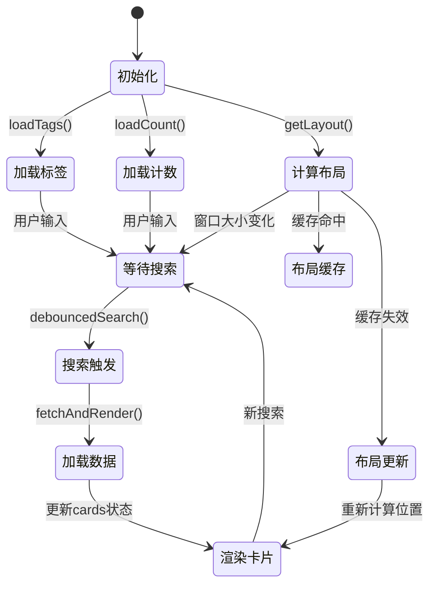

**图表来源**
- [src/frontend/masonry/state.ts:140-152](file://src/frontend/masonry/state.ts#L140-L152)
- [src/frontend/masonry/api.ts:135-140](file://src/frontend/masonry/api.ts#L135-L140)

#### 状态类型设计
- **基础状态**：字符串、数字、布尔值等简单数据
- **复合状态**：对象数组等复杂数据结构
- **计算状态**：通过函数派生的派生状态
- **缓存状态**：性能优化相关的缓存机制

**章节来源**
- [src/frontend/masonry/state.ts:12-181](file://src/frontend/masonry/state.ts#L12-L181)

### 数据访问层分析

API层提供了统一的数据访问接口：

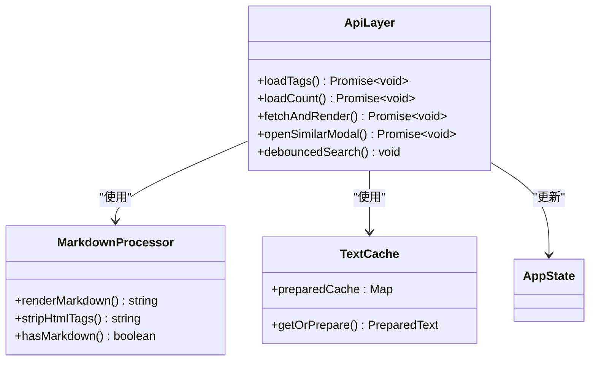

**图表来源**
- [src/frontend/masonry/api.ts:29-162](file://src/frontend/masonry/api.ts#L29-L162)

**章节来源**
- [src/frontend/masonry/api.ts:1-162](file://src/frontend/masonry/api.ts#L1-L162)

### 共享组件设计

ReadMoreModal展示了组件复用的最佳实践：

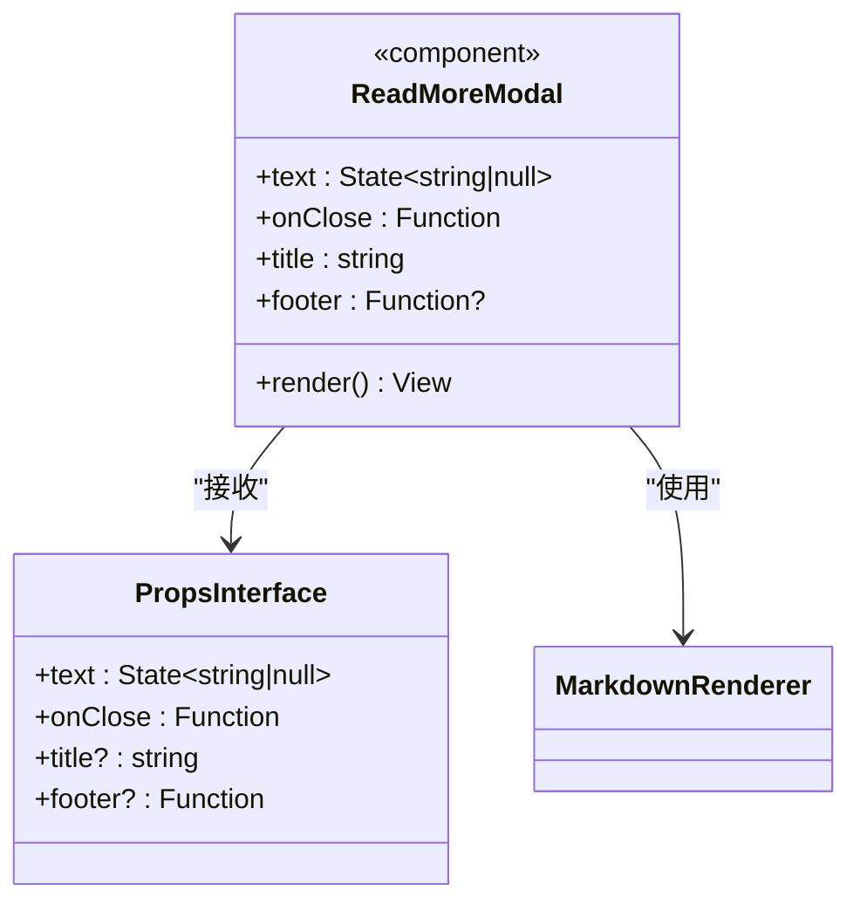

**图表来源**
- [src/frontend/shared/components/ReadMoreModal.ts:15-25](file://src/frontend/shared/components/ReadMoreModal.ts#L15-L25)

**章节来源**
- [src/frontend/shared/components/ReadMoreModal.ts:1-71](file://src/frontend/shared/components/ReadMoreModal.ts#L1-L71)

## 依赖关系分析

### 组件间依赖关系

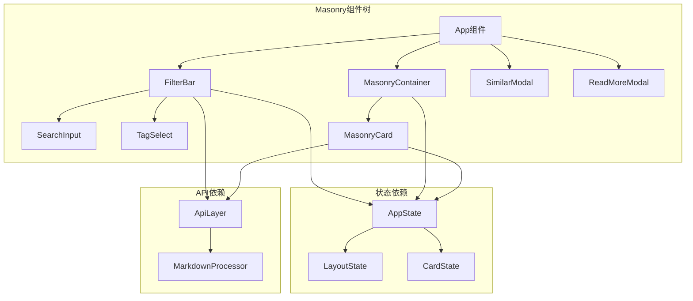

**图表来源**
- [src/frontend/masonry/components.ts:1-337](file://src/frontend/masonry/components.ts#L1-L337)
- [src/frontend/masonry/state.ts:1-181](file://src/frontend/masonry/state.ts#L1-L181)
- [src/frontend/masonry/api.ts:1-162](file://src/frontend/masonry/api.ts#L1-L162)

### 管理员界面对比分析

管理员界面采用了类似的组件架构，但具有更复杂的状态管理：

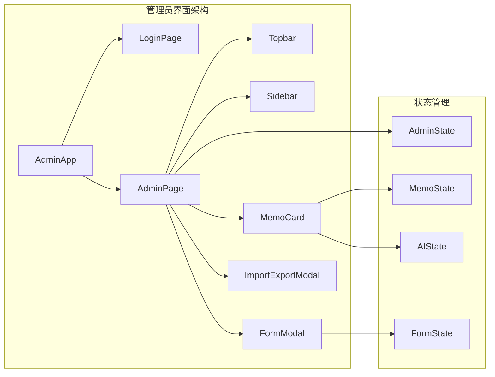

**图表来源**
- [src/frontend/admin/app.ts:81-222](file://src/frontend/admin/app.ts#L81-L222)
- [src/frontend/admin/state.ts:1-178](file://src/frontend/admin/state.ts#L1-L178)

**章节来源**
- [src/frontend/admin/app.ts:1-251](file://src/frontend/admin/app.ts#L1-L251)

## 性能考虑

### 布局算法优化

Masonry布局采用了高效的列高度跟踪算法：

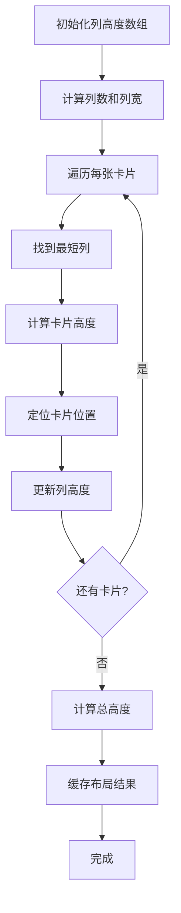

**图表来源**
- [src/frontend/masonry/state.ts:84-133](file://src/frontend/masonry/state.ts#L84-L133)

### 缓存策略

系统实现了多层次的缓存机制：

1. **文本预处理缓存**：避免重复的Markdown解析
2. **布局计算缓存**：避免重复的布局计算
3. **API响应缓存**：减少网络请求次数

**章节来源**
- [src/frontend/masonry/state.ts:62-70](file://src/frontend/masonry/state.ts#L62-L70)
- [src/frontend/masonry/state.ts:135-152](file://src/frontend/masonry/state.ts#L135-L152)

## 故障排除指南

### 常见问题诊断

#### 组件渲染问题
- **症状**：组件不显示或显示异常
- **原因**：状态未正确更新或依赖关系错误
- **解决方案**：检查状态订阅和组件渲染逻辑

#### 性能问题
- **症状**：页面卡顿或响应缓慢
- **原因**：过多的DOM操作或重复计算
- **解决方案**：检查布局缓存和事件处理优化

#### 状态同步问题
- **症状**：UI状态与实际状态不一致
- **原因**：异步操作中的状态更新时机
- **解决方案**：确保状态更新的原子性和一致性

**章节来源**
- [src/frontend/masonry/components.ts:283-337](file://src/frontend/masonry/components.ts#L283-L337)
- [src/frontend/masonry/api.ts:51-130](file://src/frontend/masonry/api.ts#L51-L130)

## 结论

Masonry界面组件架构展现了现代前端开发的最佳实践：

### 设计优势
- **模块化程度高**：组件职责清晰，易于维护和扩展
- **状态管理优雅**：响应式状态系统简化了复杂的状态逻辑
- **性能优化到位**：多层缓存和智能布局算法确保流畅体验
- **代码复用性强**：共享组件设计提高了开发效率

### 技术亮点
- **VanJS响应式系统**：提供了轻量级但强大的状态管理
- **组件组合模式**：通过函数组合实现灵活的UI构建
- **配置化组件设计**：支持参数化的组件定制
- **双向数据绑定**：简化了用户交互和状态同步

### 改进建议
- **增加单元测试**：为关键组件和状态逻辑添加测试覆盖
- **文档完善**：为复杂组件添加详细的使用说明
- **错误边界**：实现更完善的错误处理和恢复机制
- **性能监控**：添加性能指标监控和分析工具

这个架构为类似的内容展示应用提供了优秀的参考模板，其组件化设计理念和状态管理模式值得在其他项目中借鉴和应用。