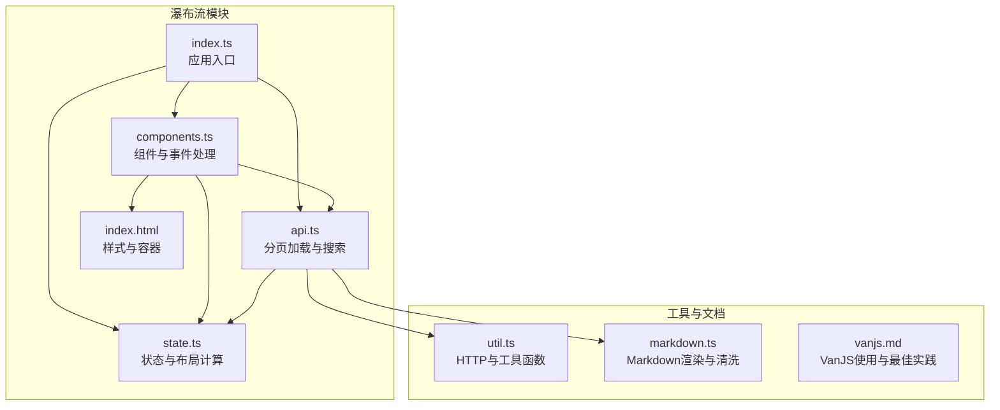
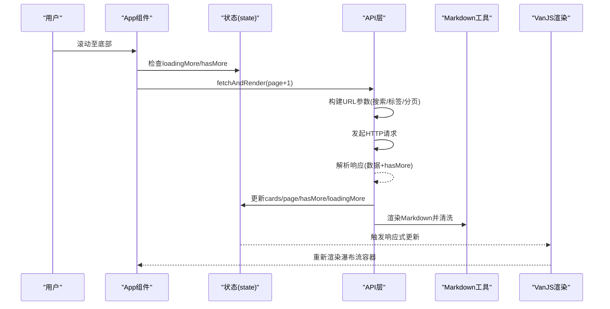
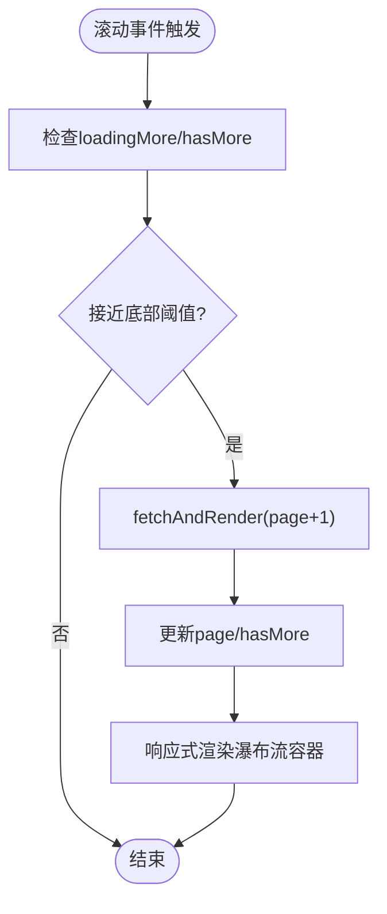
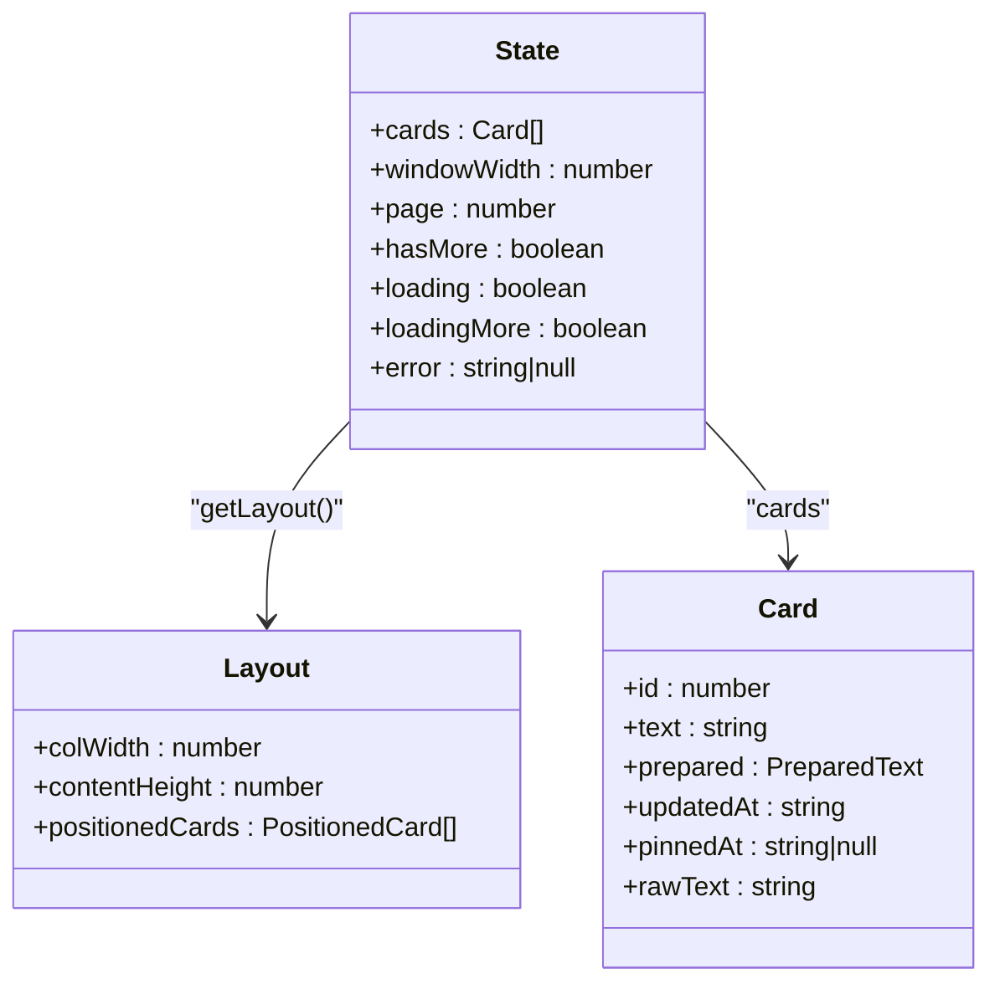
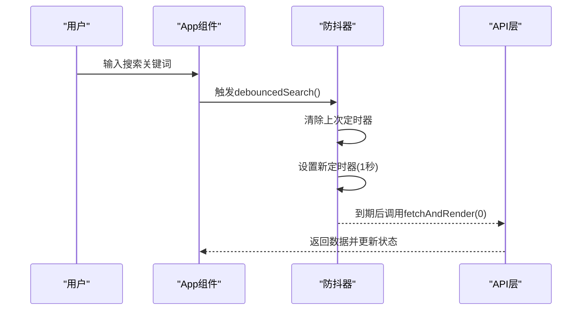
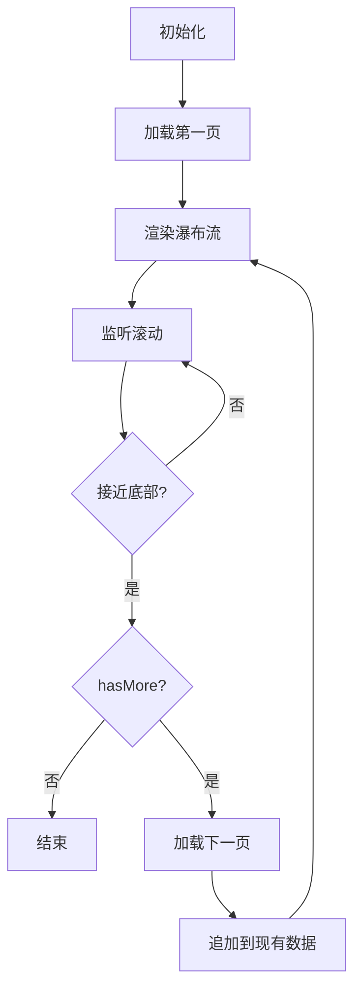
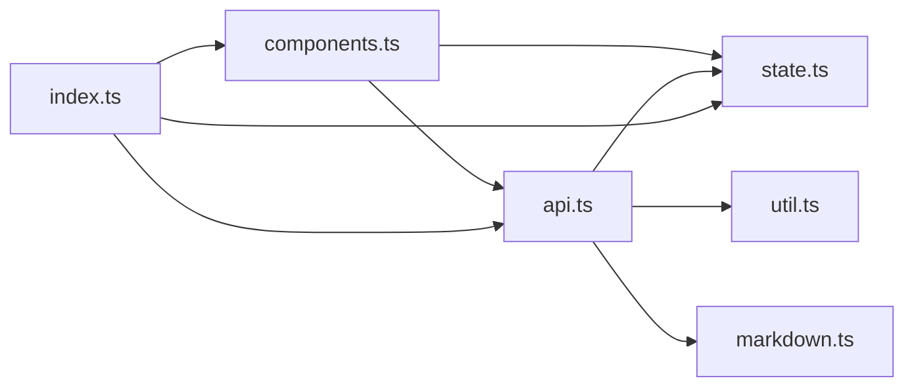

# 虚拟滚动技术

<cite>
**本文档引用的文件**
- [index.ts](file://src/frontend/masonry/index.ts)
- [components.ts](file://src/frontend/masonry/components.ts)
- [api.ts](file://src/frontend/masonry/api.ts)
- [state.ts](file://src/frontend/masonry/state.ts)
- [index.html](file://src/frontend/masonry/index.html)
- [vanjs.md](file://docs/vanjs.md)
- [util.ts](file://src/helper/util.ts)
- [markdown.ts](file://src/helper/markdown.ts)
</cite>

## 目录
1. [简介](#简介)
2. [项目结构](#项目结构)
3. [核心组件](#核心组件)
4. [架构总览](#架构总览)
5. [详细组件分析](#详细组件分析)
6. [依赖关系分析](#依赖关系分析)
7. [性能考量](#性能考量)
8. [故障排查指南](#故障排查指南)
9. [结论](#结论)
10. [附录](#附录)

## 简介
本文件围绕项目中的“瀑布流卡片”展示界面，系统性阐述虚拟滚动技术的实现与优化策略。该界面采用绝对定位布局与响应式状态驱动的渲染模式，结合分页加载与节流防抖机制，实现了对大规模数据集的高效浏览体验。文档重点覆盖以下方面：
- 可见区域计算与滚动位置跟踪
- DOM 节点复用与内存优化
- requestAnimationFrame 批量更新与节流防抖
- 大数据集处理：分页加载、懒加载与预加载
- 性能基准与优化建议

## 项目结构
该功能位于前端瀑布流模块，核心由入口初始化、组件渲染、状态与布局计算、API 请求与分页逻辑组成，并通过 VanJS 的响应式状态驱动 UI 更新。

图表来源
- [index.ts:1-23](file://src/frontend/masonry/index.ts#L1-L23)
- [components.ts:1-337](file://src/frontend/masonry/components.ts#L1-L337)
- [api.ts:1-162](file://src/frontend/masonry/api.ts#L1-L162)
- [state.ts:1-181](file://src/frontend/masonry/state.ts#L1-L181)
- [index.html:1-427](file://src/frontend/masonry/index.html#L1-L427)
- [util.ts:1-75](file://src/helper/util.ts#L1-L75)
- [markdown.ts:1-148](file://src/helper/markdown.ts#L1-L148)
- [vanjs.md:1-563](file://docs/vanjs.md#L1-L563)

章节来源
- [index.ts:1-23](file://src/frontend/masonry/index.ts#L1-L23)
- [components.ts:1-337](file://src/frontend/masonry/components.ts#L1-L337)
- [api.ts:1-162](file://src/frontend/masonry/api.ts#L1-L162)
- [state.ts:1-181](file://src/frontend/masonry/state.ts#L1-L181)
- [index.html:1-427](file://src/frontend/masonry/index.html#L1-L427)
- [util.ts:1-75](file://src/helper/util.ts#L1-L75)
- [markdown.ts:1-148](file://src/helper/markdown.ts#L1-L148)
- [vanjs.md:1-563](file://docs/vanjs.md#L1-L563)

## 核心组件
- 应用入口与初始化：负责读取 URL 查询参数、设置初始状态、挂载根组件并触发首次数据加载。
- 组件层：包含过滤栏、瀑布流容器、卡片渲染、相似内容弹窗与“阅读更多”弹窗；处理窗口尺寸变化与滚动事件，实现无限滚动。
- 状态与布局：集中管理卡片列表、搜索条件、分页状态、窗口宽度、布局缓存与文本预处理缓存；提供布局计算与格式化工具。
- API 层：封装标签与数量查询、分页加载、搜索防抖、相似内容查询；负责 URL 同步与错误处理。
- 工具与文档：提供 HTTP 辅助、Markdown 渲染与清洗、VanJS 最佳实践参考。

章节来源
- [index.ts:1-23](file://src/frontend/masonry/index.ts#L1-L23)
- [components.ts:1-337](file://src/frontend/masonry/components.ts#L1-L337)
- [api.ts:1-162](file://src/frontend/masonry/api.ts#L1-L162)
- [state.ts:1-181](file://src/frontend/masonry/state.ts#L1-L181)
- [util.ts:1-75](file://src/helper/util.ts#L1-L75)
- [markdown.ts:1-148](file://src/helper/markdown.ts#L1-L148)
- [vanjs.md:1-563](file://docs/vanjs.md#L1-L563)

## 架构总览
瀑布流采用“响应式状态驱动 + 绝对定位布局”的组合方案：
- 响应式状态：VanJS 的状态对象承载数据与 UI 状态，任何状态变更都会触发依赖该状态的组件重新渲染。
- 绝对定位布局：卡片使用绝对定位，通过布局计算得出每列宽度、内容高度与每个卡片的 x/y/h，一次性渲染全部卡片但仅显示可视区域。
- 分页加载：滚动接近底部时触发下一页加载，避免一次性渲染全部数据。
- 防抖与节流：搜索输入采用防抖，滚动事件采用阈值判断，降低频繁请求与重排。

图表来源
- [components.ts:289-298](file://src/frontend/masonry/components.ts#L289-L298)
- [api.ts:51-130](file://src/frontend/masonry/api.ts#L51-L130)
- [state.ts:42-59](file://src/frontend/masonry/state.ts#L42-L59)
- [markdown.ts:52-66](file://src/helper/markdown.ts#L52-L66)

## 详细组件分析

### 可见区域计算与滚动位置跟踪
- 视口高度检测：通过 window.innerHeight 获取视口高度。
- 滚动位置跟踪：通过 window.scrollY 获取当前滚动偏移。
- 可视区域内元素范围确定：当“视口底部距离文档底部的距离”小于阈值时，判定接近底部，触发分页加载。
- 布局计算：根据窗口宽度与列数计算每列宽度、内容高度与每个卡片的绝对定位坐标，一次性计算并缓存布局结果，避免重复计算。

图表来源
- [components.ts:289-298](file://src/frontend/masonry/components.ts#L289-L298)
- [api.ts:51-130](file://src/frontend/masonry/api.ts#L51-L130)
- [state.ts:84-152](file://src/frontend/masonry/state.ts#L84-L152)

章节来源
- [components.ts:289-298](file://src/frontend/masonry/components.ts#L289-L298)
- [api.ts:51-130](file://src/frontend/masonry/api.ts#L51-L130)
- [state.ts:84-152](file://src/frontend/masonry/state.ts#L84-L152)

### DOM 节点复用机制与内存优化
- 单一容器渲染：瀑布流容器通过响应式函数一次性渲染全部卡片，使用绝对定位布局，避免频繁插入/删除 DOM 节点。
- 布局缓存：布局计算结果缓存在内存中，只有当卡片列表或窗口宽度变化时才重新计算，显著降低重排成本。
- 文本预处理缓存：对已准备的文本进行缓存，避免重复计算文本高度与布局。
- 状态驱动更新：通过 VanJS 的响应式更新机制，仅在状态变更时触发必要的 UI 重绘，减少不必要的 DOM 操作。

图表来源
- [state.ts:42-152](file://src/frontend/masonry/state.ts#L42-L152)

章节来源
- [state.ts:62-70](file://src/frontend/masonry/state.ts#L62-L70)
- [state.ts:135-152](file://src/frontend/masonry/state.ts#L135-L152)
- [components.ts:203-219](file://src/frontend/masonry/components.ts#L203-L219)

### requestAnimationFrame 批量更新与节流防抖
- 搜索防抖：输入搜索关键词后，延迟一段时间再发起请求，避免频繁请求。
- 滚动阈值：仅在接近底部时触发加载，减少无效请求。
- 响应式批量更新：VanJS 的状态更新天然具备批处理特性，配合滚动事件的阈值判断，有效降低重渲染频率。

图表来源
- [components.ts:289-298](file://src/frontend/masonry/components.ts#L289-L298)
- [api.ts:132-140](file://src/frontend/masonry/api.ts#L132-L140)

章节来源
- [components.ts:289-298](file://src/frontend/masonry/components.ts#L289-L298)
- [api.ts:132-140](file://src/frontend/masonry/api.ts#L132-L140)
- [vanjs.md:296-320](file://docs/vanjs.md#L296-L320)

### 大数据集处理：分页加载、懒加载与预加载
- 分页加载：每次请求固定数量的数据，通过 hasMore 控制是否还有下一页。
- 懒加载：滚动接近底部时才加载下一页，避免一次性加载全部数据。
- 预加载：在进入页面时预先加载第一页数据，保证首屏体验。

图表来源
- [index.ts:18-22](file://src/frontend/masonry/index.ts#L18-L22)
- [api.ts:51-130](file://src/frontend/masonry/api.ts#L51-L130)
- [components.ts:289-298](file://src/frontend/masonry/components.ts#L289-L298)

章节来源
- [index.ts:18-22](file://src/frontend/masonry/index.ts#L18-L22)
- [api.ts:51-130](file://src/frontend/masonry/api.ts#L51-L130)
- [components.ts:289-298](file://src/frontend/masonry/components.ts#L289-L298)

### 样式与容器设计
- 瀑布流容器使用绝对定位布局，卡片通过 left/top/width/height 精确定位。
- 过滤栏采用粘性定位，确保在滚动过程中保持可见。
- 按钮组在卡片 hover 时显示，提升交互体验。

章节来源
- [index.html:24-427](file://src/frontend/masonry/index.html#L24-L427)
- [components.ts:203-219](file://src/frontend/masonry/components.ts#L203-L219)

## 依赖关系分析
- 组件依赖状态与 API：组件通过状态驱动渲染，通过 API 层发起网络请求与更新状态。
- 状态依赖布局计算：布局计算依赖窗口宽度与卡片列表，结果缓存避免重复计算。
- 工具依赖：API 层依赖 HTTP 工具与 Markdown 渲染工具，确保数据安全与一致性。

图表来源
- [components.ts:1-337](file://src/frontend/masonry/components.ts#L1-L337)
- [api.ts:1-162](file://src/frontend/masonry/api.ts#L1-L162)
- [state.ts:1-181](file://src/frontend/masonry/state.ts#L1-L181)
- [util.ts:1-75](file://src/helper/util.ts#L1-L75)
- [markdown.ts:1-148](file://src/helper/markdown.ts#L1-L148)
- [index.ts:1-23](file://src/frontend/masonry/index.ts#L1-L23)

章节来源
- [components.ts:1-337](file://src/frontend/masonry/components.ts#L1-L337)
- [api.ts:1-162](file://src/frontend/masonry/api.ts#L1-L162)
- [state.ts:1-181](file://src/frontend/masonry/state.ts#L1-L181)
- [util.ts:1-75](file://src/helper/util.ts#L1-L75)
- [markdown.ts:1-148](file://src/helper/markdown.ts#L1-L148)
- [index.ts:1-23](file://src/frontend/masonry/index.ts#L1-L23)

## 性能考量
- 布局计算缓存：通过内存缓存布局结果，避免重复计算，提高滚动流畅度。
- 文本预处理缓存：对已准备的文本进行缓存，减少重复的文本测量与布局计算。
- 分页与阈值：分页加载与接近底部阈值触发，降低一次性渲染压力。
- 防抖与节流：搜索输入防抖与滚动事件阈值，减少请求与重排次数。
- 响应式批量更新：VanJS 的状态更新天然具备批处理特性，减少不必要的 DOM 操作。

章节来源
- [state.ts:62-70](file://src/frontend/masonry/state.ts#L62-L70)
- [state.ts:135-152](file://src/frontend/masonry/state.ts#L135-L152)
- [api.ts:132-140](file://src/frontend/masonry/api.ts#L132-L140)
- [components.ts:289-298](file://src/frontend/masonry/components.ts#L289-L298)
- [vanjs.md:296-320](file://docs/vanjs.md#L296-L320)

## 故障排查指南
- 滚动穿透与模态框：模态框打开时应阻止背景滚动，可通过设置 body 的 overflow 属性控制。
- 焦点丢失：在动态容器中使用响应式属性绑定，确保 DOM 节点身份稳定，避免重建导致焦点丢失。
- 无限请求：在响应式函数中读取状态时，注意不要在同一个响应式函数中直接修改状态，避免形成无限循环。
- 死代码清理：及时清理不再使用的功能代码，保持代码库整洁。

章节来源
- [vanjs.md:533-541](file://docs/vanjs.md#L533-L541)
- [vanjs.md:505-523](file://docs/vanjs.md#L505-L523)

## 结论
本项目通过“响应式状态 + 绝对定位布局 + 分页加载 + 防抖与阈值”的组合，实现了对大规模数据集的高效浏览。布局与文本预处理的缓存机制进一步提升了滚动性能。建议在后续迭代中引入更精细的滚动事件节流与更完善的错误边界处理，以进一步提升用户体验与稳定性。

## 附录
- 关键实现路径参考：
  - 可见区域与滚动位置：[components.ts:289-298](file://src/frontend/masonry/components.ts#L289-L298)
  - 分页加载与搜索防抖：[api.ts:51-140](file://src/frontend/masonry/api.ts#L51-L140)
  - 布局计算与缓存：[state.ts:84-152](file://src/frontend/masonry/state.ts#L84-L152)
  - 文本预处理缓存：[state.ts:62-70](file://src/frontend/masonry/state.ts#L62-L70)
  - Markdown 渲染与清洗：[markdown.ts:52-66](file://src/helper/markdown.ts#L52-L66)
  - HTTP 工具函数：[util.ts:15-25](file://src/helper/util.ts#L15-L25)
  - VanJS 最佳实践：[vanjs.md:296-320](file://docs/vanjs.md#L296-L320)