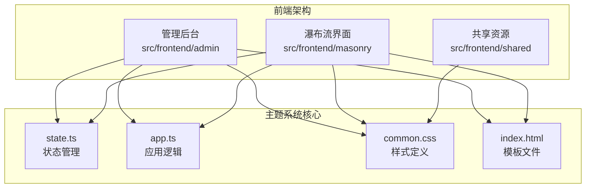
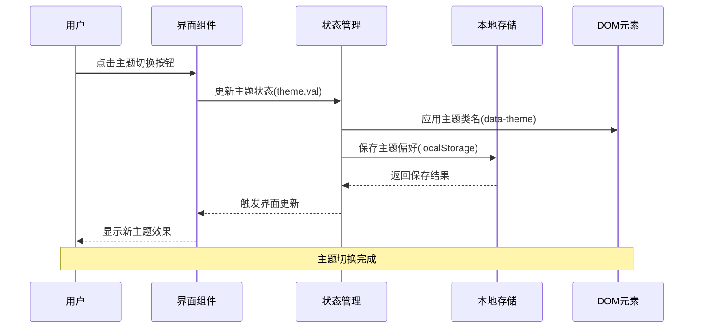
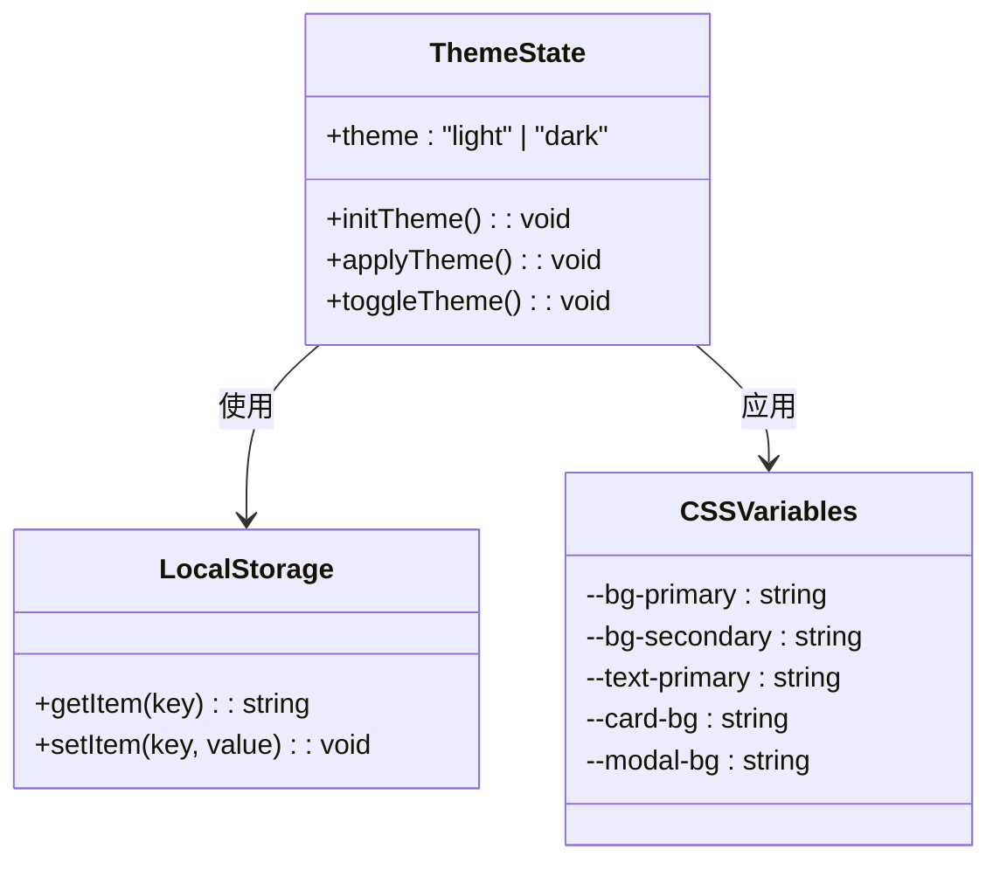
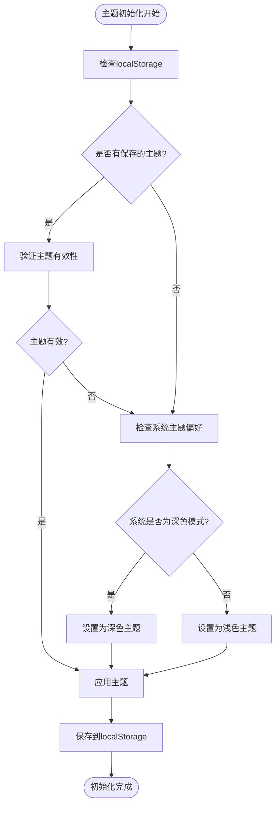
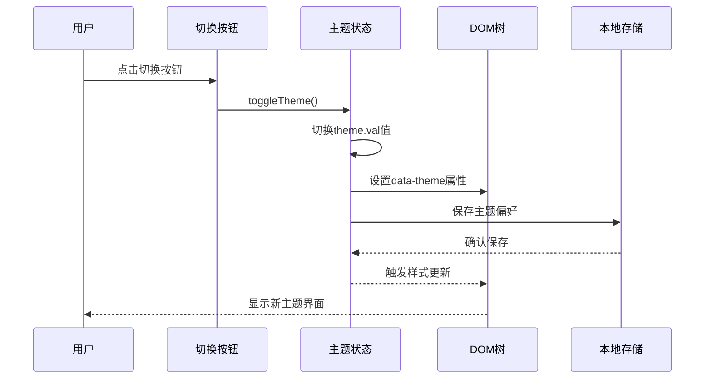
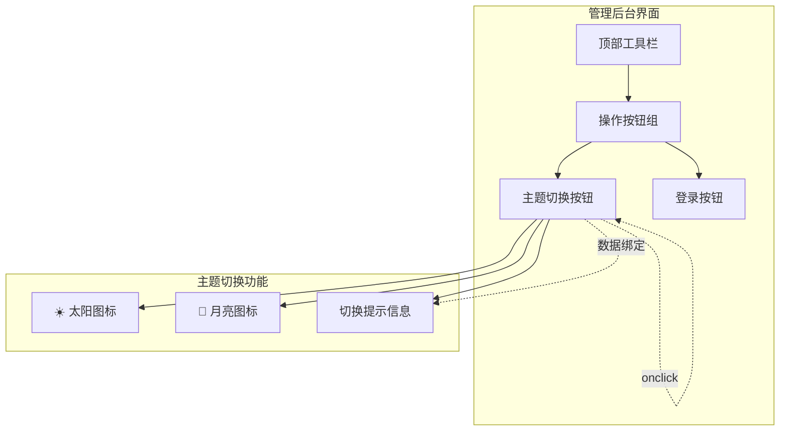
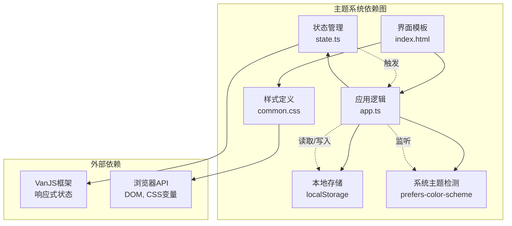

# 主题切换系统

<cite>
**本文档引用的文件**
- [README.md](file://README.md)
- [app.ts](file://src/frontend/admin/app.ts)
- [state.ts](file://src/frontend/admin/state.ts)
- [common.css](file://src/frontend/shared/styles/common.css)
- [index.html](file://src/frontend/admin/index.html)
- [components.ts](file://src/frontend/masonry/components.ts)
- [index.ts](file://src/frontend/masonry/index.ts)
- [index.html](file://src/frontend/masonry/index.html)
</cite>

## 目录
1. [简介](#简介)
2. [项目结构](#项目结构)
3. [核心组件](#核心组件)
4. [架构概览](#架构概览)
5. [详细组件分析](#详细组件分析)
6. [依赖关系分析](#依赖关系分析)
7. [性能考虑](#性能考虑)
8. [故障排除指南](#故障排除指南)
9. [结论](#结论)

## 简介

主题切换系统是 Memos 应用中的一个核心功能模块，负责管理用户界面的主题切换（明暗主题）。该系统基于现代 Web 技术实现，使用 CSS 变量和本地存储来提供无缝的主题切换体验。

Memos 是一个基于 Bun 运行时构建的轻量级备忘录应用系统，支持公开/私密备忘录管理、标签分类、全文搜索等功能。主题切换系统作为用户体验的重要组成部分，为用户提供了个性化的视觉体验。

## 项目结构

Memos 项目采用模块化架构设计，主题切换系统分布在多个前端模块中：



**图表来源**
- [app.ts:1-295](file://src/frontend/admin/app.ts#L1-L295)
- [state.ts:1-191](file://src/frontend/admin/state.ts#L1-L191)
- [common.css:1-420](file://src/frontend/shared/styles/common.css#L1-L420)

**章节来源**
- [README.md:25-45](file://README.md#L25-L45)

## 核心组件

主题切换系统由以下核心组件构成：

### 1. 状态管理 (state.ts)
- 使用 VanJS 的 `van.state` 创建响应式主题状态
- 支持 "light" 和 "dark" 两种主题模式
- 默认主题为 "light"

### 2. 应用逻辑 (app.ts)
- 实现主题初始化、切换和应用逻辑
- 使用 localStorage 持久化用户偏好
- 支持系统主题检测（prefers-color-scheme）

### 3. 样式定义 (common.css)
- 定义 CSS 变量主题系统
- 提供明暗主题的颜色方案
- 支持细粒度的组件样式定制

### 4. 用户界面 (index.html)
- 提供主题切换按钮
- 集成到管理后台界面
- 支持键盘快捷键操作

**章节来源**
- [state.ts:41-41](file://src/frontend/admin/state.ts#L41-L41)
- [app.ts:50-71](file://src/frontend/admin/app.ts#L50-L71)
- [common.css:1-77](file://src/frontend/shared/styles/common.css#L1-L77)

## 架构概览

主题切换系统采用分层架构设计，确保了良好的可维护性和扩展性：



**图表来源**
- [app.ts:63-71](file://src/frontend/admin/app.ts#L63-L71)
- [state.ts:41-41](file://src/frontend/admin/state.ts#L41-L41)

## 详细组件分析

### 主题状态管理

主题状态管理系统基于 VanJS 的响应式编程模型：



**图表来源**
- [state.ts:41-41](file://src/frontend/admin/state.ts#L41-L41)
- [app.ts:53-71](file://src/frontend/admin/app.ts#L53-L71)

#### 初始化流程

主题初始化过程遵循以下步骤：



**图表来源**
- [app.ts:53-61](file://src/frontend/admin/app.ts#L53-L61)

#### 切换机制

主题切换采用即时生效的设计：



**图表来源**
- [app.ts:67-71](file://src/frontend/admin/app.ts#L67-L71)

**章节来源**
- [app.ts:50-71](file://src/frontend/admin/app.ts#L50-L71)
- [state.ts:41-41](file://src/frontend/admin/state.ts#L41-L41)

### 样式系统架构

CSS 变量主题系统提供了强大的样式定制能力：

```mermaid
graph LR
subgraph "CSS变量定义"
LightRoot[:root<br/>浅色主题变量]
DarkRoot[[data-theme="dark"]]<br/>深色主题变量]
end
subgraph "变量类别"
Color[颜色变量<br/>--text-primary, --bg-primary]
Layout[布局变量<br/>--card-bg, --modal-bg]
Border[边框变量<br/>--border-color, --input-border]
Shadow[阴影变量<br/>--card-shadow, --modal-shadow]
end
LightRoot --> Color
LightRoot --> Layout
LightRoot --> Border
LightRoot --> Shadow
DarkRoot --> Color
DarkRoot --> Layout
DarkRoot --> Border
DarkRoot --> Shadow
```

**图表来源**
- [common.css:1-77](file://src/frontend/shared/styles/common.css#L1-L77)

#### 组件级主题适配

各个 UI 组件都实现了主题适配：

| 组件类型 | 主题变量使用 | 特殊处理 |
|---------|-------------|----------|
| 按钮组件 | --bg-primary, --text-primary | hover 状态变体 |
| 卡片组件 | --card-bg, --card-shadow | 阴影和边框适配 |
| 输入组件 | --input-bg, --input-border | 焦点状态高亮 |
| 模态框 | --modal-bg, --modal-shadow | 背景半透明效果 |
| 标签组件 | --tag-bg, --tag-hover-bg | 交互状态变化 |

**章节来源**
- [common.css:1-420](file://src/frontend/shared/styles/common.css#L1-L420)

### 用户界面集成

主题切换按钮集成在管理后台的顶部工具栏中：



**图表来源**
- [index.html:117-180](file://src/frontend/admin/index.html#L117-L180)
- [app.ts:164-172](file://src/frontend/admin/app.ts#L164-L172)

**章节来源**
- [index.html:117-180](file://src/frontend/admin/index.html#L117-L180)
- [app.ts:164-172](file://src/frontend/admin/app.ts#L164-L172)

## 依赖关系分析

主题切换系统与其他组件的依赖关系如下：



**图表来源**
- [state.ts:1-5](file://src/frontend/admin/state.ts#L1-L5)
- [app.ts:1-40](file://src/frontend/admin/app.ts#L1-L40)
- [common.css:1-40](file://src/frontend/shared/styles/common.css#L1-L40)

**章节来源**
- [state.ts:1-5](file://src/frontend/admin/state.ts#L1-L5)
- [app.ts:1-40](file://src/frontend/admin/app.ts#L1-L40)

## 性能考虑

主题切换系统在设计时充分考虑了性能优化：

### 1. 渲染性能
- 使用 CSS 变量而非 JavaScript 动态修改样式
- 通过 data-theme 属性一次性应用主题
- 避免频繁的 DOM 操作和重排

### 2. 存储性能
- localStorage 异步操作，不影响主线程
- 主题状态缓存在内存中
- 避免重复的样式计算

### 3. 内存管理
- 主题状态为单一实例
- CSS 变量在页面生命周期内复用
- 及时清理事件监听器

## 故障排除指南

### 常见问题及解决方案

#### 1. 主题切换无效
**症状**: 点击切换按钮但界面无变化  
**原因**: CSS 变量未正确应用  
**解决**: 检查 `data-theme` 属性是否正确设置

#### 2. 主题偏好未保存
**症状**: 页面刷新后主题恢复默认  
**原因**: localStorage 访问权限问题  
**解决**: 检查浏览器隐私设置和存储权限

#### 3. 系统主题检测失败
**症状**: 自动检测功能不工作  
**原因**: 浏览器不支持 prefers-color-scheme  
**解决**: 降级到用户手动选择

#### 4. 样式冲突
**症状**: 部分组件主题显示异常  
**原因**: CSS 优先级问题  
**解决**: 检查 CSS 选择器优先级和变量覆盖

**章节来源**
- [app.ts:53-61](file://src/frontend/admin/app.ts#L53-L61)
- [common.css:1-40](file://src/frontend/shared/styles/common.css#L1-L40)

## 结论

主题切换系统作为 Memos 应用的重要组成部分，展现了现代前端开发的最佳实践。通过采用响应式状态管理、CSS 变量和本地存储等技术，系统实现了高效、流畅的主题切换体验。

系统的主要优势包括：
- **简洁的架构**: 分层设计清晰，职责分离明确
- **高性能表现**: 基于 CSS 变量的样式切换零开销
- **良好的用户体验**: 即时反馈和持久化偏好
- **可扩展性**: 易于添加新的主题变量和组件适配

未来可以考虑的功能增强：
- 添加自定义主题支持
- 实现主题动画过渡效果
- 增加主题预设和个性化选项
- 支持动态主题加载