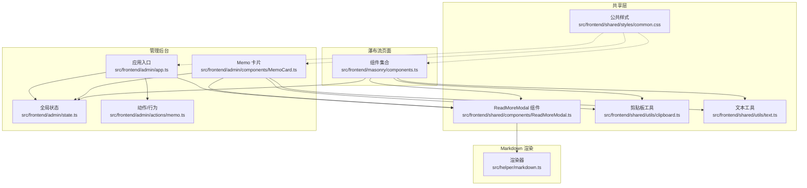
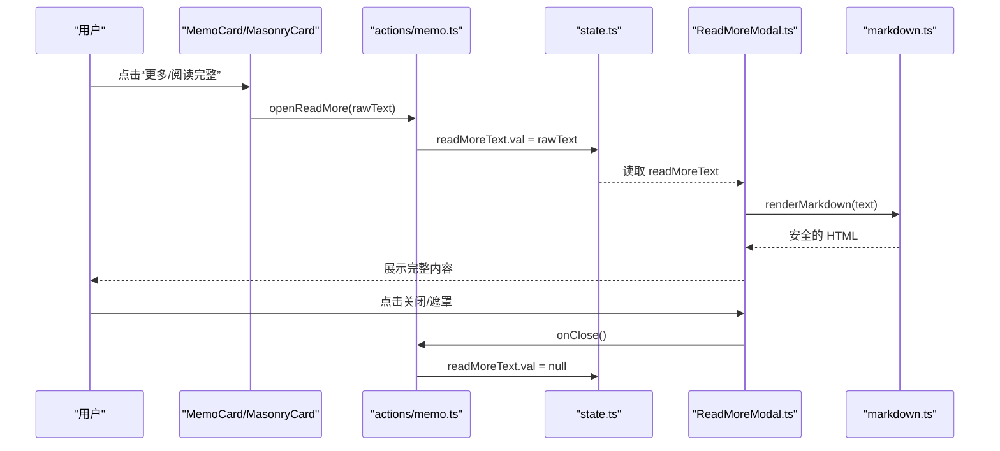
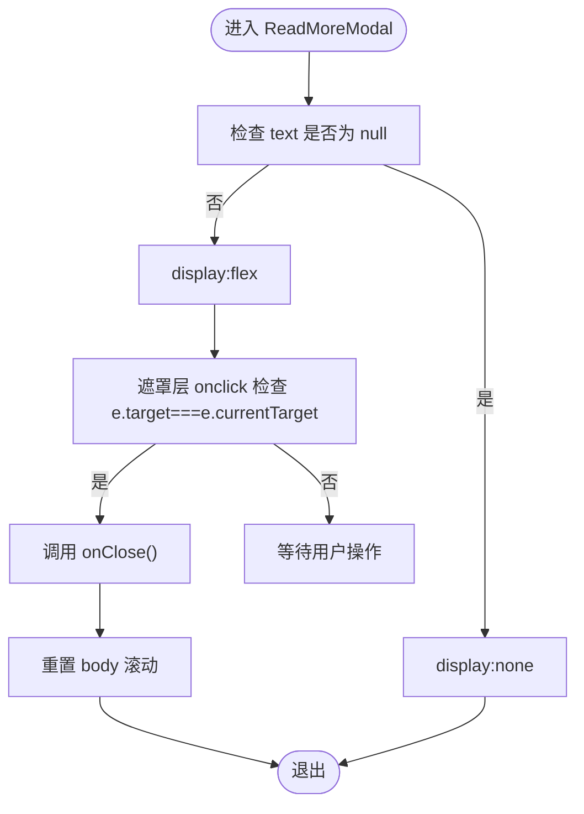
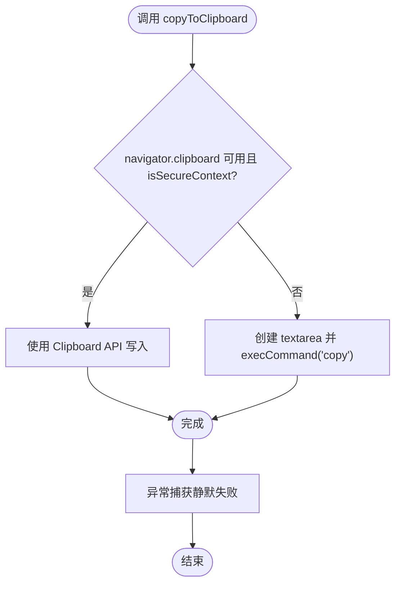
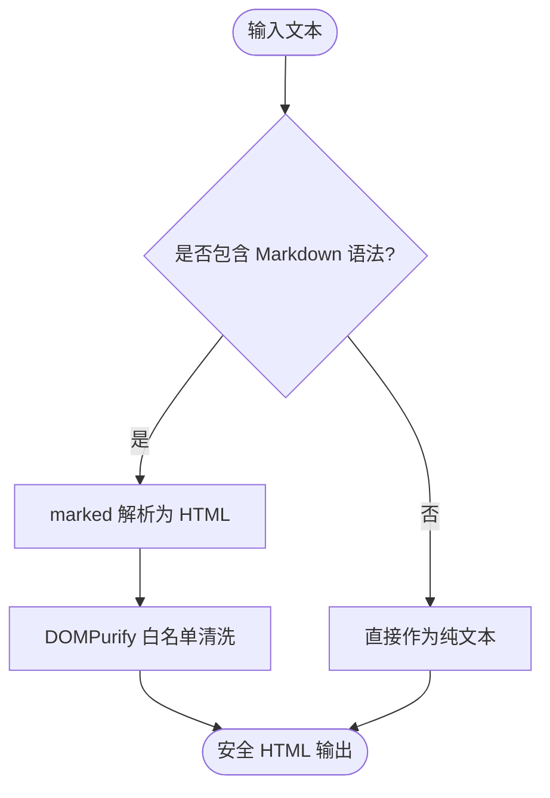
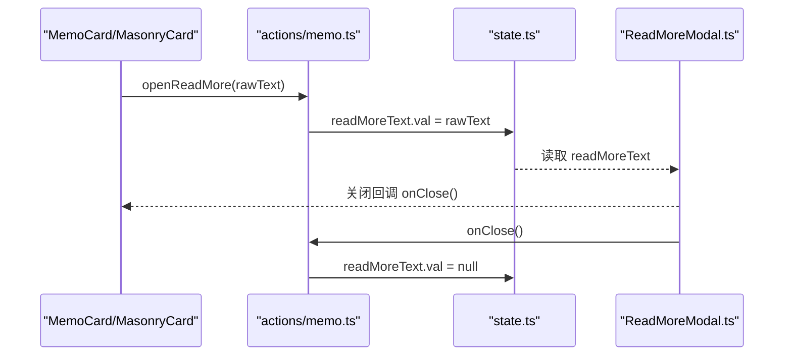
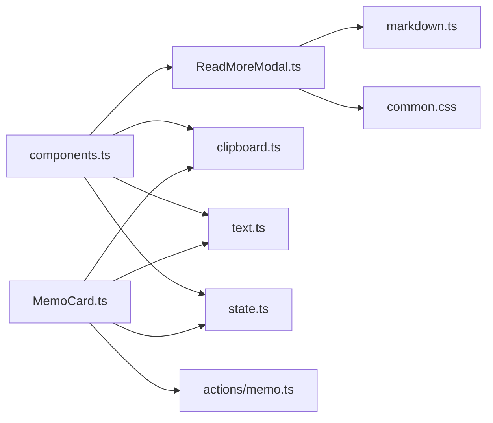

# 共享组件库

<cite>
**本文引用的文件**
- [ReadMoreModal.ts](file://src/frontend/shared/components/ReadMoreModal.ts)
- [clipboard.ts](file://src/frontend/shared/utils/clipboard.ts)
- [text.ts](file://src/frontend/shared/utils/text.ts)
- [common.css](file://src/frontend/shared/styles/common.css)
- [markdown.ts](file://src/helper/markdown.ts)
- [MemoCard.ts](file://src/frontend/admin/components/MemoCard.ts)
- [app.ts](file://src/frontend/admin/app.ts)
- [state.ts](file://src/frontend/admin/state.ts)
- [actions/memo.ts](file://src/frontend/admin/actions/memo.ts)
- [util.ts](file://src/helper/util.ts)
- [components.ts](file://src/frontend/masonry/components.ts)
- [vanjs.md](file://docs/vanjs.md)
- [README.md](file://README.md)
</cite>

## 目录
1. [简介](#简介)
2. [项目结构](#项目结构)
3. [核心组件](#核心组件)
4. [架构总览](#架构总览)
5. [组件详解](#组件详解)
6. [依赖关系分析](#依赖关系分析)
7. [性能考量](#性能考量)
8. [故障排查指南](#故障排查指南)
9. [结论](#结论)
10. [附录](#附录)

## 简介
本文件面向“共享组件库”的使用者与维护者，系统梳理可复用组件的设计原则与实现模式，重点覆盖以下主题：
- 可复用组件的接口设计、属性传递与事件处理
- ReadMoreModal 模态框的实现细节（内容截断、展开/收起、用户交互）
- 剪贴板工具函数的使用（文本复制、格式化处理、浏览器兼容性）
- 文本处理工具函数（Markdown 渲染、HTML 转义、内容清理）
- 公共样式组织与管理（CSS 变量、主题定制、响应式规则）
- 组件间通信机制（props 传递、事件冒泡、状态共享）
- 组件开发最佳实践（命名规范、文档编写、测试策略）
- 组件使用示例与集成指南

## 项目结构
共享组件库位于前端共享目录，包含组件、样式与工具函数；同时在管理后台与瀑布流页面中复用这些能力。整体结构如下图所示：

图表来源
- [ReadMoreModal.ts:1-71](file://src/frontend/shared/components/ReadMoreModal.ts#L1-L71)
- [clipboard.ts:1-25](file://src/frontend/shared/utils/clipboard.ts#L1-L25)
- [text.ts:1-12](file://src/frontend/shared/utils/text.ts#L1-L12)
- [common.css:1-277](file://src/frontend/shared/styles/common.css#L1-L277)
- [markdown.ts:1-148](file://src/helper/markdown.ts#L1-L148)
- [MemoCard.ts:1-346](file://src/frontend/admin/components/MemoCard.ts#L1-L346)
- [app.ts:1-251](file://src/frontend/admin/app.ts#L1-L251)
- [state.ts:1-178](file://src/frontend/admin/state.ts#L1-L178)
- [actions/memo.ts:1-231](file://src/frontend/admin/actions/memo.ts#L1-L231)
- [components.ts:1-337](file://src/frontend/masonry/components.ts#L1-L337)

章节来源
- [README.md:25-45](file://README.md#L25-L45)

## 核心组件
- ReadMoreModal：跨页面复用的模态框，负责展示完整内容，支持点击遮罩关闭、标题与底部插槽扩展。
- 剪贴板工具：统一的复制接口，优先使用现代 Clipboard API，在不安全上下文或旧浏览器回退至 textarea 方案。
- 文本工具：HTML 转义，防止 XSS；Markdown 渲染与安全清洗；内容截断与可见字符计数。
- 公共样式：按钮、模态框、标签页、表单基础、反馈状态、Markdown 内容、滚动条与动画等通用样式。

章节来源
- [ReadMoreModal.ts:15-70](file://src/frontend/shared/components/ReadMoreModal.ts#L15-L70)
- [clipboard.ts:5-24](file://src/frontend/shared/utils/clipboard.ts#L5-L24)
- [text.ts:4-11](file://src/frontend/shared/utils/text.ts#L4-L11)
- [common.css:14-277](file://src/frontend/shared/styles/common.css#L14-L277)

## 架构总览
共享组件库采用“组件 + 工具 + 样式”三层结构，配合 VanJS 的响应式状态进行跨页面复用。管理后台与瀑布流页面通过状态与动作模块驱动组件渲染与交互。

图表来源
- [MemoCard.ts:87-97](file://src/frontend/admin/components/MemoCard.ts#L87-L97)
- [components.ts:160-170](file://src/frontend/masonry/components.ts#L160-L170)
- [actions/memo.ts:153-163](file://src/frontend/admin/actions/memo.ts#L153-L163)
- [state.ts:45-45](file://src/frontend/admin/state.ts#L45-L45)
- [ReadMoreModal.ts:26-69](file://src/frontend/shared/components/ReadMoreModal.ts#L26-L69)
- [markdown.ts:52-56](file://src/helper/markdown.ts#L52-L56)

## 组件详解

### ReadMoreModal 模态框
- 设计目标：在不改变主页面上下文的前提下，弹出展示完整内容，支持标题与底部插槽扩展。
- 接口设计：
  - 属性
    - text: 状态对象，承载待展示文本；为 null 时表示关闭
    - onClose: 关闭回调，负责重置 body 滚动与状态
    - title?: 标题，默认“Memo”
    - footer?: 底部渲染函数，用于扩展信息（如创意模式）
  - 事件
    - 点击遮罩层：仅当点击目标等于当前元素时才关闭
- 渲染与交互
  - 条件渲染：根据 text 是否为 null 控制显示/隐藏
  - 内容渲染：通过 Markdown 渲染器输出安全 HTML 并注入到容器
  - 滚动与尺寸：最大高度限制、纵向滚动、右侧内边距
  - 关闭行为：关闭时重置 body 滚动，避免背景滚动穿透
- 与页面集成
  - 管理后台：由应用入口条件渲染，接收 readMoreText 与 closeReadMore
  - 瀑布流：卡片组件在内容截断时提供“阅读完整”按钮，打开模态框

图表来源
- [ReadMoreModal.ts:26-33](file://src/frontend/shared/components/ReadMoreModal.ts#L26-L33)
- [ReadMoreModal.ts:60-65](file://src/frontend/shared/components/ReadMoreModal.ts#L60-L65)
- [actions/memo.ts:153-163](file://src/frontend/admin/actions/memo.ts#L153-L163)

章节来源
- [ReadMoreModal.ts:15-70](file://src/frontend/shared/components/ReadMoreModal.ts#L15-L70)
- [app.ts:216-219](file://src/frontend/admin/app.ts#L216-L219)
- [components.ts:331-334](file://src/frontend/masonry/components.ts#L331-L334)

### 剪贴板工具函数
- 功能概述：提供统一的文本复制接口，优先使用现代 Clipboard API；在非安全上下文或旧浏览器环境下回退到 textarea 方案。
- 浏览器兼容性
  - 现代方案：navigator.clipboard.writeText
  - 回退方案：创建隐藏 textarea，选择并执行复制命令
  - 错误处理：静默失败，避免阻塞用户操作
- 使用建议
  - 在用户主动触发（如点击按钮）时调用
  - 复制成功后可结合 UI 状态反馈（如按钮图标变化）

图表来源
- [clipboard.ts:5-24](file://src/frontend/shared/utils/clipboard.ts#L5-L24)

章节来源
- [clipboard.ts:1-25](file://src/frontend/shared/utils/clipboard.ts#L1-L25)
- [components.ts:188-195](file://src/frontend/masonry/components.ts#L188-L195)

### 文本处理工具函数
- HTML 转义：将特殊字符替换为实体，防止 XSS 攻击
- Markdown 渲染与安全清洗：使用 marked 解析，DOMPurify 白名单清洗，确保输出安全 HTML
- 内容截断：按可见字符数截断，保持标签闭合，末尾追加省略号
- 可见字符计数：支持中英文混合统计，区分汉字与英文单词

图表来源
- [markdown.ts:52-56](file://src/helper/markdown.ts#L52-L56)
- [text.ts:4-11](file://src/frontend/shared/utils/text.ts#L4-L11)

章节来源
- [markdown.ts:1-148](file://src/helper/markdown.ts#L1-L148)
- [text.ts:1-12](file://src/frontend/shared/utils/text.ts#L1-L12)

### 公共样式组织与管理
- 结构化组织
  - 全局重置与基础字体
  - 按组件类型划分：按钮、模态框、标签页、表单基础、反馈状态
  - Markdown 内容样式：标题、列表、块引用、分割线、代码块、链接等
  - 滚动条工具：隐藏滚动条与模态框专用滚动条
  - 动画：滑入与闪烁等基础动画
- 主题与定制
  - 通过颜色变量与过渡属性实现主题一致性
  - 按钮变体（primary、outline、danger）、尺寸（sm）等可组合使用
- 响应式规则
  - 模态框最大宽度与最大高度限制，适配不同屏幕尺寸
  - 滚动条样式针对 WebKit 与非 WebKit 浏览器分别处理

章节来源
- [common.css:1-277](file://src/frontend/shared/styles/common.css#L1-L277)

### 组件间通信机制
- 状态共享
  - 全局状态集中管理：认证状态、加载状态、列表数据、模态框文本等
  - 跨模块共享：状态对象导出，多处导入使用，保证组件间一致的状态来源
- 属性传递
  - 组件通过状态对象作为 props 传入，实现响应式绑定
  - 可选属性（如标题、底部插槽）通过可选参数扩展
- 事件处理
  - 通过动作模块更新状态，驱动组件重新渲染
  - 模态框关闭事件通过回调函数解耦，避免硬编码
- 事件冒泡与拦截
  - 卡片按钮点击时阻止冒泡，避免误触模态框遮罩关闭
  - 全局点击监听用于关闭 AI 工具箱等外部点击关闭场景

图表来源
- [MemoCard.ts:87-97](file://src/frontend/admin/components/MemoCard.ts#L87-L97)
- [components.ts:160-170](file://src/frontend/masonry/components.ts#L160-L170)
- [actions/memo.ts:153-163](file://src/frontend/admin/actions/memo.ts#L153-L163)
- [state.ts:45-45](file://src/frontend/admin/state.ts#L45-L45)
- [ReadMoreModal.ts:26-33](file://src/frontend/shared/components/ReadMoreModal.ts#L26-L33)

章节来源
- [state.ts:1-178](file://src/frontend/admin/state.ts#L1-L178)
- [app.ts:216-219](file://src/frontend/admin/app.ts#L216-L219)
- [vanjs.md:543-561](file://docs/vanjs.md#L543-L561)

## 依赖关系分析
- 组件依赖
  - ReadMoreModal 依赖 Markdown 渲染器与公共样式
  - 卡片组件依赖剪贴板与文本工具，用于复制与转义
- 状态依赖
  - 全局状态集中于 state.ts，动作模块负责更新状态
  - 组件通过状态对象读取与响应式更新
- 外部依赖
  - marked 与 DOMPurify 用于 Markdown 渲染与安全清洗
  - VanJS 用于响应式状态与组件渲染

图表来源
- [ReadMoreModal.ts:1-2](file://src/frontend/shared/components/ReadMoreModal.ts#L1-L2)
- [markdown.ts:1-6](file://src/helper/markdown.ts#L1-L6)
- [MemoCard.ts:1-12](file://src/frontend/admin/components/MemoCard.ts#L1-L12)
- [components.ts:9-11](file://src/frontend/masonry/components.ts#L9-L11)
- [state.ts:1-3](file://src/frontend/admin/state.ts#L1-L3)
- [actions/memo.ts:1-26](file://src/frontend/admin/actions/memo.ts#L1-L26)

章节来源
- [util.ts:15-25](file://src/helper/util.ts#L15-L25)

## 性能考量
- 渲染性能
  - 使用响应式状态驱动渲染，避免不必要的 DOM 更新
  - 模态框内容按需渲染，关闭时释放状态
- 资源加载
  - Markdown 渲染器与 DOMPurify 作为浏览器端依赖，建议按需引入
- 交互体验
  - 复制操作异步执行，完成后通过状态反馈提升感知
  - 模态框滚动区域使用专用滚动条样式，提升可读性

## 故障排查指南
- 模态框无法关闭
  - 检查遮罩层事件是否正确判断 e.target 与 e.currentTarget
  - 确认 onClose 回调是否正确重置 readMoreText
- 复制失败
  - 确认当前上下文是否为安全（HTTPS + 同源）
  - 检查浏览器是否支持 Clipboard API；必要时降级到 textarea 方案
- Markdown 渲染异常
  - 确保输入文本已通过 DOMPurify 清洗
  - 检查白名单配置是否符合预期
- XSS 风险
  - 对用户输入与外部内容一律进行 HTML 转义
  - 仅在信任环境使用 innerHTML，且必须先清洗

章节来源
- [ReadMoreModal.ts:30-32](file://src/frontend/shared/components/ReadMoreModal.ts#L30-L32)
- [actions/memo.ts:160-163](file://src/frontend/admin/actions/memo.ts#L160-L163)
- [clipboard.ts:7-20](file://src/frontend/shared/utils/clipboard.ts#L7-L20)
- [markdown.ts:18-44](file://src/helper/markdown.ts#L18-L44)
- [text.ts:4-11](file://src/frontend/shared/utils/text.ts#L4-L11)

## 结论
共享组件库通过清晰的接口设计、稳定的工具函数与统一的样式体系，实现了跨页面的高复用性与一致性。ReadMoreModal、剪贴板与文本处理工具构成了内容展示与交互的核心能力；VanJS 响应式状态与动作模块确保了组件间通信的简洁与可靠。遵循本文档的最佳实践，可进一步提升组件的可维护性与用户体验。

## 附录

### 组件开发最佳实践
- 命名规范
  - 组件文件使用帕斯卡命名（如 ReadMoreModal.ts）
  - 工具函数语义明确，避免缩写
- 文档编写
  - 为组件与工具函数提供简明注释，说明用途、参数与返回值
  - 在 README 或专门文档中补充使用示例与注意事项
- 测试策略
  - 工具函数（如 HTML 转义、Markdown 渲染）建议编写单元测试
  - 组件交互（如模态框开关、复制反馈）建议编写集成测试
- 版本与依赖
  - 明确浏览器端依赖（marked、DOMPurify）版本范围
  - 在构建阶段确保依赖正确打包与按需加载

### 组件使用示例与集成指南
- 在管理后台集成
  - 在应用入口条件渲染 ReadMoreModal，并传入 readMoreText 与 closeReadMore
  - 在 MemoCard 中，当内容长度超过阈值时显示“更多”按钮，点击后调用 openReadMore
- 在瀑布流页面集成
  - 在 MasonryCard 中，当文本被截断时显示“阅读完整”按钮，点击后调用 openReadMore
  - 在卡片按钮组中使用 copyToClipboard 实现一键复制
- 样式与主题
  - 使用公共样式中的按钮、模态框与 Markdown 内容类名
  - 如需主题定制，建议通过 CSS 变量或覆盖类名的方式进行扩展

章节来源
- [app.ts:216-219](file://src/frontend/admin/app.ts#L216-L219)
- [MemoCard.ts:87-97](file://src/frontend/admin/components/MemoCard.ts#L87-L97)
- [components.ts:160-170](file://src/frontend/masonry/components.ts#L160-L170)
- [common.css:14-277](file://src/frontend/shared/styles/common.css#L14-L277)