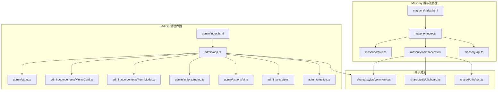
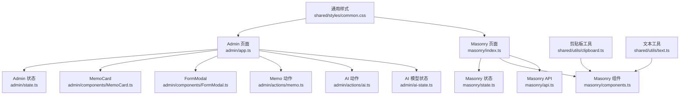
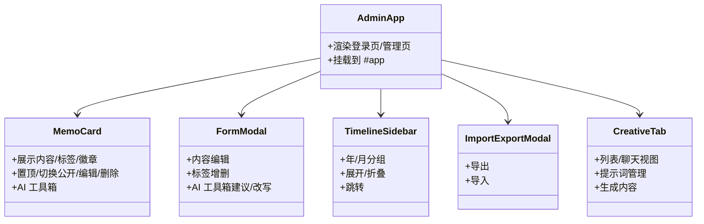
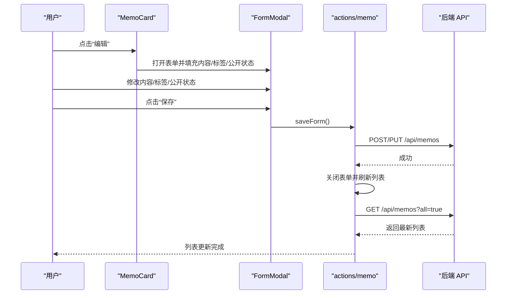
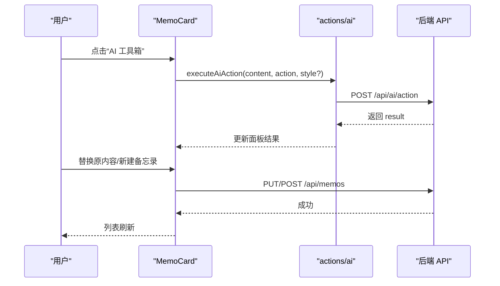
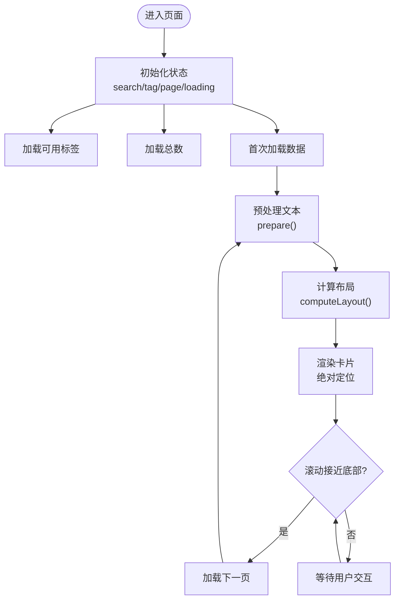
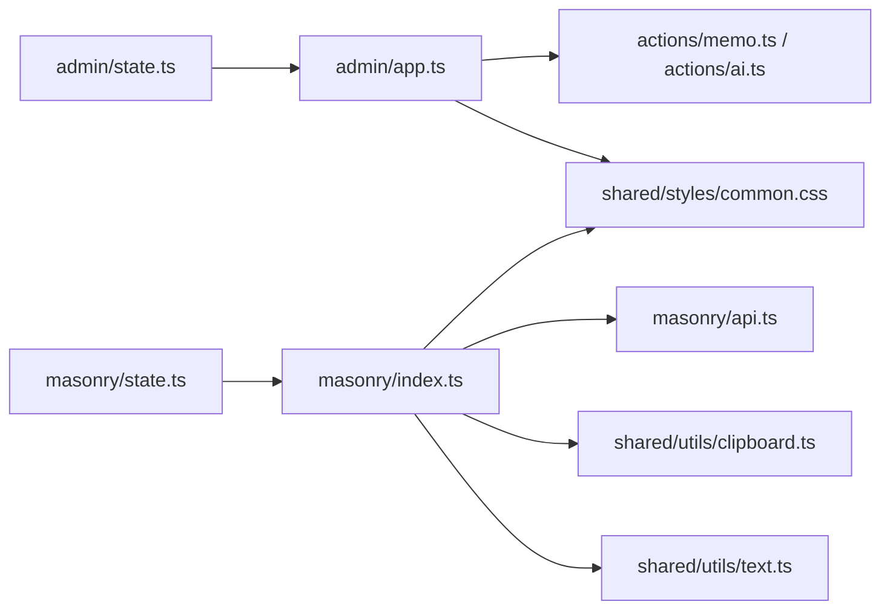

# 前端应用

<cite>
**本文引用的文件**
- [src/frontend/admin/index.html](file://src/frontend/admin/index.html)
- [src/frontend/admin/app.ts](file://src/frontend/admin/app.ts)
- [src/frontend/admin/state.ts](file://src/frontend/admin/state.ts)
- [src/frontend/admin/components/MemoCard.ts](file://src/frontend/admin/components/MemoCard.ts)
- [src/frontend/admin/components/FormModal.ts](file://src/frontend/admin/components/FormModal.ts)
- [src/frontend/admin/actions/memo.ts](file://src/frontend/admin/actions/memo.ts)
- [src/frontend/admin/actions/ai.ts](file://src/frontend/admin/actions/ai.ts)
- [src/frontend/admin/ai-state.ts](file://src/frontend/admin/ai-state.ts)
- [src/frontend/admin/creative.ts](file://src/frontend/admin/creative.ts)
- [src/frontend/masonry/index.html](file://src/frontend/masonry/index.html)
- [src/frontend/masonry/index.ts](file://src/frontend/masonry/index.ts)
- [src/frontend/masonry/state.ts](file://src/frontend/masonry/state.ts)
- [src/frontend/masonry/components.ts](file://src/frontend/masonry/components.ts)
- [src/frontend/masonry/api.ts](file://src/frontend/masonry/api.ts)
- [src/frontend/shared/styles/common.css](file://src/frontend/shared/styles/common.css)
- [src/frontend/shared/utils/clipboard.ts](file://src/frontend/shared/utils/clipboard.ts)
- [src/frontend/shared/utils/text.ts](file://src/frontend/shared/utils/text.ts)
</cite>

## 目录
1. [简介](#简介)
2. [项目结构](#项目结构)
3. [核心组件](#核心组件)
4. [架构总览](#架构总览)
5. [详细组件分析](#详细组件分析)
6. [依赖关系分析](#依赖关系分析)
7. [性能考量](#性能考量)
8. [故障排查指南](#故障排查指南)
9. [结论](#结论)
10. [附录](#附录)

## 简介
本文件面向前端开发者，系统性梳理 Memmos 项目的前端应用，重点覆盖两大界面：
- Admin 管理界面：提供备忘录的增删改查、标签编辑、公开/私密切换、AI 工具箱、导入导出、时间线导航等功能。
- Masonry 瀑布流展示界面：提供卡片瀑布流布局、虚拟滚动（无限滚动）、搜索与标签筛选、相似内容查找、复制文本等能力。

文档围绕 VanJS 响应式框架的使用进行深入解析，包括状态管理、组件化开发、事件处理、与后端 API 的通信机制、样式系统与主题定制、响应式设计以及可复用组件的设计与使用模式，并给出开发指南与最佳实践。

## 项目结构
前端采用“按页面/功能域分层”的组织方式：
- admin：管理后台界面，包含状态定义、页面入口、组件与动作模块。
- masonry：瀑布流展示界面，包含状态、组件、API 与入口脚本。
- shared：共享资源，包括通用样式与工具函数。
- 其他：辅助模块（如 Markdown 渲染、SVG 图标、剪贴板工具等）。

图表来源
- [src/frontend/admin/index.html](file://src/frontend/admin/index.html)
- [src/frontend/admin/app.ts](file://src/frontend/admin/app.ts)
- [src/frontend/admin/state.ts](file://src/frontend/admin/state.ts)
- [src/frontend/admin/components/MemoCard.ts](file://src/frontend/admin/components/MemoCard.ts)
- [src/frontend/admin/components/FormModal.ts](file://src/frontend/admin/components/FormModal.ts)
- [src/frontend/admin/actions/memo.ts](file://src/frontend/admin/actions/memo.ts)
- [src/frontend/admin/actions/ai.ts](file://src/frontend/admin/actions/ai.ts)
- [src/frontend/admin/ai-state.ts](file://src/frontend/admin/ai-state.ts)
- [src/frontend/admin/creative.ts](file://src/frontend/admin/creative.ts)
- [src/frontend/masonry/index.html](file://src/frontend/masonry/index.html)
- [src/frontend/masonry/index.ts](file://src/frontend/masonry/index.ts)
- [src/frontend/masonry/state.ts](file://src/frontend/masonry/state.ts)
- [src/frontend/masonry/components.ts](file://src/frontend/masonry/components.ts)
- [src/frontend/masonry/api.ts](file://src/frontend/masonry/api.ts)
- [src/frontend/shared/styles/common.css](file://src/frontend/shared/styles/common.css)
- [src/frontend/shared/utils/clipboard.ts](file://src/frontend/shared/utils/clipboard.ts)
- [src/frontend/shared/utils/text.ts](file://src/frontend/shared/utils/text.ts)

章节来源
- [src/frontend/admin/index.html](file://src/frontend/admin/index.html)
- [src/frontend/masonry/index.html](file://src/frontend/masonry/index.html)

## 核心组件
- Admin 管理界面
  - 登录页与主页面：基于认证状态动态渲染，顶部栏包含统计信息、模型选择器、新建按钮、导入导出、跳转站点与登出。
  - 时间线侧边栏：按年/月聚合备忘录，支持展开折叠与跳转。
  - 备忘录卡片：展示内容、标签、公开/私密徽章、置顶状态、操作按钮（置顶、切换公开/私密、编辑、删除、AI 工具箱）。
  - 表单模态框：支持内容编辑、标签增删、AI 工具箱建议与改写。
  - 导入/导出模态框：支持导出与导入备忘录。
  - 创意（Creative）标签页：提示词管理、聊天/列表视图、生成内容列表与读更多弹窗。
- Masonry 瀑布流界面
  - 过滤栏：站点标题、搜索输入、标签下拉选择、跳转 Admin 按钮。
  - 瀑布流容器：根据窗口宽度计算列数与列宽，使用预处理文本高度布局卡片绝对定位。
  - 单个卡片：显示内容、置顶徽章、信息区（ID/日期）、悬停显示的操作按钮（阅读更多、相似内容、复制）。
  - 相似内容弹窗：异步查询相似备忘录并展示。
  - 无限滚动：接近底部时自动加载下一页。

章节来源
- [src/frontend/admin/app.ts](file://src/frontend/admin/app.ts)
- [src/frontend/admin/components/MemoCard.ts](file://src/frontend/admin/components/MemoCard.ts)
- [src/frontend/admin/components/FormModal.ts](file://src/frontend/admin/components/FormModal.ts)
- [src/frontend/admin/creative.ts](file://src/frontend/admin/creative.ts)
- [src/frontend/masonry/components.ts](file://src/frontend/masonry/components.ts)
- [src/frontend/masonry/state.ts](file://src/frontend/masonry/state.ts)
- [src/frontend/masonry/api.ts](file://src/frontend/masonry/api.ts)

## 架构总览
- 响应式框架：VanJS 提供轻量级响应式状态与视图绑定，通过 van.state 定义全局状态，组件通过状态派生渲染。
- 组件化：每个页面由若干可复用组件组合而成，组件内部封装 UI 结构与交互逻辑。
- 状态管理：Admin 与 Masonry 分别维护独立的状态模块，避免跨域耦合；公共状态（如 AI 模型选择）通过共享模块集中管理。
- 事件处理：统一在组件内注册事件监听，通过状态变更触发重新渲染；对全局事件（如点击外部关闭面板）进行集中处理。
- API 通信：统一的 API 辅助函数负责请求与错误处理；Admin 使用自定义 api 封装，Masonry 使用带 baseUrl 的 apiUrl。
- 样式系统：共享基础样式 common.css，页面内联样式与类名配合，支持主题变量与响应式断点。

图表来源
- [src/frontend/admin/app.ts](file://src/frontend/admin/app.ts)
- [src/frontend/admin/state.ts](file://src/frontend/admin/state.ts)
- [src/frontend/admin/components/MemoCard.ts](file://src/frontend/admin/components/MemoCard.ts)
- [src/frontend/admin/components/FormModal.ts](file://src/frontend/admin/components/FormModal.ts)
- [src/frontend/admin/actions/memo.ts](file://src/frontend/admin/actions/memo.ts)
- [src/frontend/admin/actions/ai.ts](file://src/frontend/admin/actions/ai.ts)
- [src/frontend/admin/ai-state.ts](file://src/frontend/admin/ai-state.ts)
- [src/frontend/masonry/index.ts](file://src/frontend/masonry/index.ts)
- [src/frontend/masonry/state.ts](file://src/frontend/masonry/state.ts)
- [src/frontend/masonry/components.ts](file://src/frontend/masonry/components.ts)
- [src/frontend/masonry/api.ts](file://src/frontend/masonry/api.ts)
- [src/frontend/shared/styles/common.css](file://src/frontend/shared/styles/common.css)
- [src/frontend/shared/utils/clipboard.ts](file://src/frontend/shared/utils/clipboard.ts)
- [src/frontend/shared/utils/text.ts](file://src/frontend/shared/utils/text.ts)

## 详细组件分析

### Admin 管理界面

#### 状态管理与组件化
- 全局状态集中在 admin/state.ts，涵盖认证、加载、标签、时间线缓存、AI 工具箱、导入导出、创意内容等。
- 页面入口 admin/app.ts 依据认证状态渲染登录页或管理页；管理页包含顶部栏、侧边栏、内容区与多个模态框。
- 可复用组件：
  - MemoCard：展示单条备忘录，支持置顶、切换公开/私密、编辑、删除、AI 工具箱。
  - FormModal：表单模态框，支持标签增删、AI 工具箱建议与改写。
  - TimelineSidebar：按年/月聚合时间线，支持展开折叠与跳转。
  - ImportExportModal：导入导出功能。
  - CreativeTab：创意内容的列表/聊天视图与相关交互。

图表来源
- [src/frontend/admin/app.ts](file://src/frontend/admin/app.ts)
- [src/frontend/admin/components/MemoCard.ts](file://src/frontend/admin/components/MemoCard.ts)
- [src/frontend/admin/components/FormModal.ts](file://src/frontend/admin/components/FormModal.ts)
- [src/frontend/admin/creative.ts](file://src/frontend/admin/creative.ts)

章节来源
- [src/frontend/admin/app.ts](file://src/frontend/admin/app.ts)
- [src/frontend/admin/state.ts](file://src/frontend/admin/state.ts)
- [src/frontend/admin/components/MemoCard.ts](file://src/frontend/admin/components/MemoCard.ts)
- [src/frontend/admin/components/FormModal.ts](file://src/frontend/admin/components/FormModal.ts)
- [src/frontend/admin/creative.ts](file://src/frontend/admin/creative.ts)

#### 备忘录管理流程（创建/编辑/删除/置顶/公开切换）

图表来源
- [src/frontend/admin/components/MemoCard.ts](file://src/frontend/admin/components/MemoCard.ts)
- [src/frontend/admin/components/FormModal.ts](file://src/frontend/admin/components/FormModal.ts)
- [src/frontend/admin/actions/memo.ts](file://src/frontend/admin/actions/memo.ts)

章节来源
- [src/frontend/admin/actions/memo.ts](file://src/frontend/admin/actions/memo.ts)

#### AI 工具箱（卡片与表单）
- 卡片级 AI 工具箱：针对选中备忘录执行摘要、改写、扩写、要点提炼、润色等操作，支持风格选择（改写时）。
- 表单级 AI 工具箱：在新建/编辑表单中对内容进行 AI 优化与建议标签。
- 模型选择：持久化到 localStorage，支持恢复上次选择。

图表来源
- [src/frontend/admin/components/MemoCard.ts](file://src/frontend/admin/components/MemoCard.ts)
- [src/frontend/admin/actions/ai.ts](file://src/frontend/admin/actions/ai.ts)

章节来源
- [src/frontend/admin/actions/ai.ts](file://src/frontend/admin/actions/ai.ts)
- [src/frontend/admin/ai-state.ts](file://src/frontend/admin/ai-state.ts)

#### 标签编辑与建议
- 表单中输入标签按回车添加；支持从 AI 获取标签建议，过滤重复标签后展示。
- 备忘录卡片支持直接删除标签或打开“读更多”查看完整内容。

章节来源
- [src/frontend/admin/components/FormModal.ts](file://src/frontend/admin/components/FormModal.ts)
- [src/frontend/admin/actions/ai.ts](file://src/frontend/admin/actions/ai.ts)
- [src/frontend/admin/components/MemoCard.ts](file://src/frontend/admin/components/MemoCard.ts)

#### 导入/导出
- 导出：调用 /api/export 下载文件。
- 导入：上传文件至 /api/import，成功后刷新列表。

章节来源
- [src/frontend/admin/actions/memo.ts](file://src/frontend/admin/actions/memo.ts)

### Masonry 瀑布流界面

#### 布局算法与虚拟滚动
- 预处理文本：使用 @chenglou/pretext 对文本进行预处理，计算每行高度与总高度。
- 布局计算：根据窗口宽度动态计算列数与列宽，维护每列当前高度，选择最短列插入新卡片，最终得出内容总高度。
- 绝对定位：卡片使用 left/top/width/height 绝对定位，容器高度随内容变化。
- 虚拟滚动：监听滚动事件，当接近底部时触发加载下一页，实现无限滚动。

图表来源
- [src/frontend/masonry/state.ts](file://src/frontend/masonry/state.ts)
- [src/frontend/masonry/api.ts](file://src/frontend/masonry/api.ts)
- [src/frontend/masonry/components.ts](file://src/frontend/masonry/components.ts)

章节来源
- [src/frontend/masonry/state.ts](file://src/frontend/masonry/state.ts)
- [src/frontend/masonry/api.ts](file://src/frontend/masonry/api.ts)
- [src/frontend/masonry/components.ts](file://src/frontend/masonry/components.ts)

#### 搜索与标签筛选
- 搜索输入：防抖 1 秒后发起请求，更新 URL 参数以便书签化。
- 标签下拉：支持全标签与具体标签筛选，切换后重置到第 0 页并重新渲染。

章节来源
- [src/frontend/masonry/components.ts](file://src/frontend/masonry/components.ts)
- [src/frontend/masonry/api.ts](file://src/frontend/masonry/api.ts)

#### 相似内容查找
- 弹窗展示：点击卡片“相似内容”按钮打开弹窗，异步请求 /api/memos/{id}/similar 并过滤自身 ID。
- 错误处理：失败时显示错误信息。

章节来源
- [src/frontend/masonry/components.ts](file://src/frontend/masonry/components.ts)
- [src/frontend/masonry/api.ts](file://src/frontend/masonry/api.ts)

#### 复制文本
- 使用现代 Clipboard API 或回退方案复制纯文本，成功后短暂高亮复制按钮。

章节来源
- [src/frontend/masonry/components.ts](file://src/frontend/masonry/components.ts)
- [src/frontend/shared/utils/clipboard.ts](file://src/frontend/shared/utils/clipboard.ts)

#### 读更多与安全渲染
- 读更多弹窗：用于展示完整内容，支持 Markdown 渲染与 HTML 转义，防止 XSS。
- 文本转义：escapeHtml 用于弹窗与卡片中的文本输出。

章节来源
- [src/frontend/masonry/components.ts](file://src/frontend/masonry/components.ts)
- [src/frontend/shared/utils/text.ts](file://src/frontend/shared/utils/text.ts)

## 依赖关系分析
- 组件耦合
  - Admin 与 Masonry 界面各自拥有独立状态与入口，耦合度低，便于维护与扩展。
  - 共享组件（如 ReadMoreModal）在 Admin 与 Masonry 中复用，降低重复代码。
- 外部依赖
  - @chenglou/pretext：文本预处理与高度计算。
  - VanJS：响应式状态与视图绑定。
- 数据流
  - Admin：状态驱动 UI，动作模块负责与后端交互，再通过状态更新触发重渲染。
  - Masonry：状态驱动布局与渲染，滚动事件触发数据加载，URL 参数与分页状态协同。

图表来源
- [src/frontend/admin/state.ts](file://src/frontend/admin/state.ts)
- [src/frontend/masonry/state.ts](file://src/frontend/masonry/state.ts)
- [src/frontend/admin/app.ts](file://src/frontend/admin/app.ts)
- [src/frontend/masonry/index.ts](file://src/frontend/masonry/index.ts)
- [src/frontend/admin/actions/memo.ts](file://src/frontend/admin/actions/memo.ts)
- [src/frontend/admin/actions/ai.ts](file://src/frontend/admin/actions/ai.ts)
- [src/frontend/masonry/api.ts](file://src/frontend/masonry/api.ts)
- [src/frontend/shared/styles/common.css](file://src/frontend/shared/styles/common.css)
- [src/frontend/shared/utils/clipboard.ts](file://src/frontend/shared/utils/clipboard.ts)
- [src/frontend/shared/utils/text.ts](file://src/frontend/shared/utils/text.ts)

章节来源
- [src/frontend/admin/state.ts](file://src/frontend/admin/state.ts)
- [src/frontend/masonry/state.ts](file://src/frontend/masonry/state.ts)
- [src/frontend/admin/app.ts](file://src/frontend/admin/app.ts)
- [src/frontend/masonry/index.ts](file://src/frontend/masonry/index.ts)
- [src/frontend/admin/actions/memo.ts](file://src/frontend/admin/actions/memo.ts)
- [src/frontend/admin/actions/ai.ts](file://src/frontend/admin/actions/ai.ts)
- [src/frontend/masonry/api.ts](file://src/frontend/masonry/api.ts)

## 性能考量
- 文本预处理缓存：Masonry 使用 Map 缓存预处理结果，避免重复计算。
- 布局缓存：在窗口宽度未变化时复用上次布局结果，减少布局计算。
- 防抖搜索：1 秒防抖降低频繁请求。
- 无限滚动阈值：接近底部 400px 触发加载，平衡体验与性能。
- 绝对定位：卡片使用绝对定位，避免 DOM 重排与重绘成本过高。
- 建议
  - 对 Masonry 的预处理缓存可考虑 LRU 策略，防止内存增长。
  - 在大量卡片场景下，可引入 IntersectionObserver 优化可见区域渲染。
  - Admin 的时间线缓存可增加失效策略，避免长时间不刷新导致的数据陈旧。

## 故障排查指南
- 认证失败或网络异常
  - Admin 登录页会显示全局错误；检查后端鉴权接口与密钥配置。
- 备忘录 CRUD 失败
  - 查看 actions/memo.ts 中的错误处理与全局错误提示；确认后端接口返回状态码与消息。
- AI 工具箱报错
  - actions/ai.ts 中捕获错误并显示；检查模型选择与后端 AI 接口可用性。
- Masonry 加载失败
  - api.ts 中记录错误并显示；检查分页参数、搜索条件与网络状态。
- 复制失败
  - shared/utils/clipboard.ts 对不可用情况静默处理；确保在安全上下文（HTTPS）下使用现代 API。

章节来源
- [src/frontend/admin/actions/memo.ts](file://src/frontend/admin/actions/memo.ts)
- [src/frontend/admin/actions/ai.ts](file://src/frontend/admin/actions/ai.ts)
- [src/frontend/masonry/api.ts](file://src/frontend/masonry/api.ts)
- [src/frontend/shared/utils/clipboard.ts](file://src/frontend/shared/utils/clipboard.ts)

## 结论
Memmos 前端应用以 VanJS 为核心，构建了清晰的 Admin 管理界面与高性能 Masonry 瀑布流展示界面。通过模块化的状态管理、可复用组件与完善的 API 通信机制，实现了良好的可维护性与用户体验。Admin 界面强调内容管理与 AI 辅助创作，Masonry 界面强调浏览效率与交互体验。未来可在缓存策略、滚动优化与可访问性方面进一步提升。

## 附录
- 开发指南与最佳实践
  - 状态设计：优先使用细粒度状态，避免大对象整体替换；通过派生状态减少重复计算。
  - 组件拆分：遵循单一职责，尽量无副作用；事件回调集中处理，避免在模板中直接调用动作。
  - 样式规范：优先使用 shared/styles/common.css 的通用类名；页面内联样式仅限局部与动态值。
  - 安全性：始终对用户输入进行转义；在弹窗中渲染 Markdown 时注意内容来源可信度。
  - 可测试性：将副作用（API 调用）抽象为可注入的函数，便于单元测试。
  - 性能：利用现有缓存与防抖策略；在复杂布局与大量数据场景下谨慎使用重排重绘。