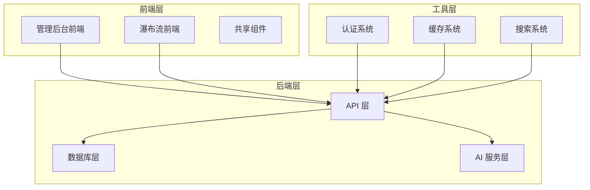
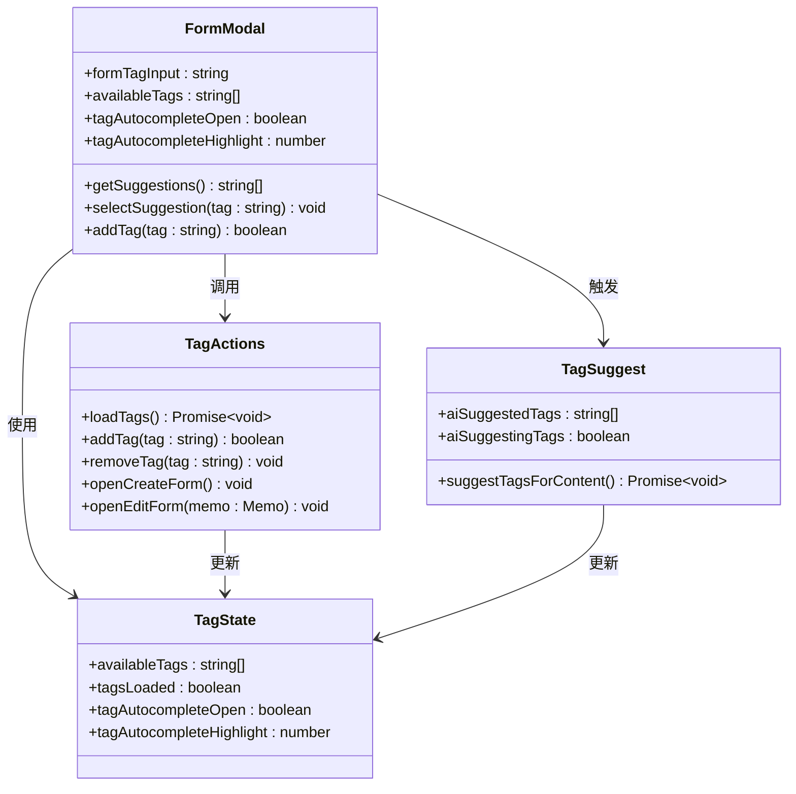
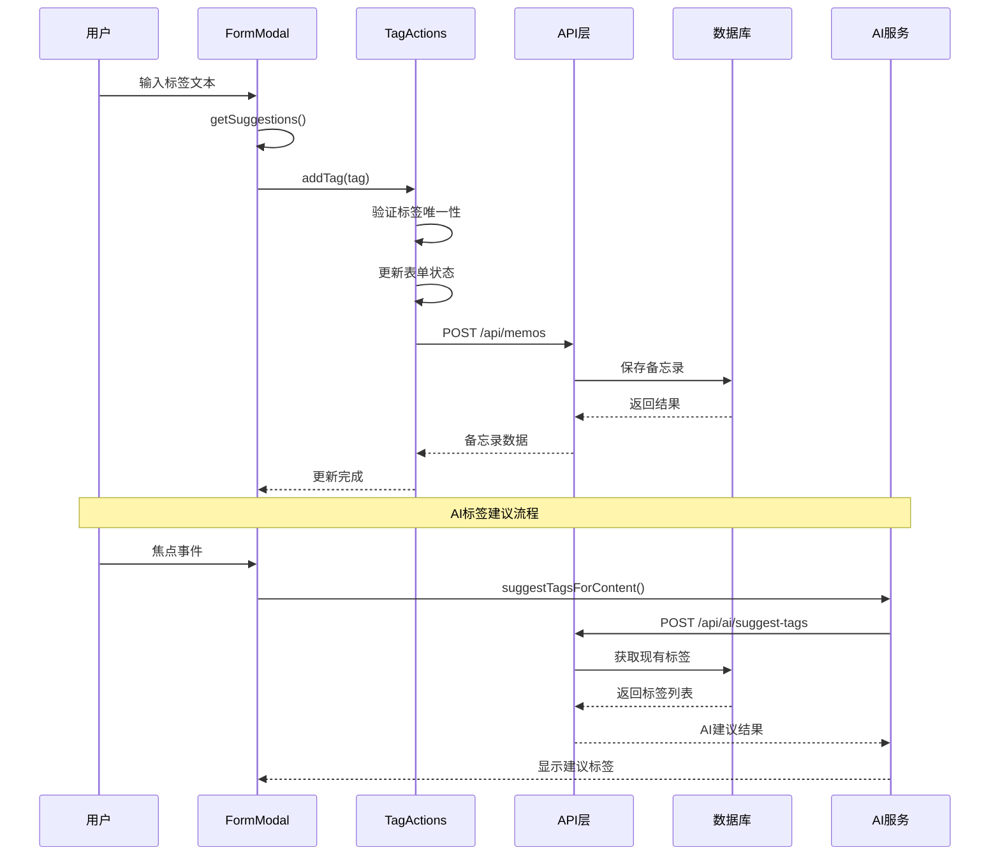
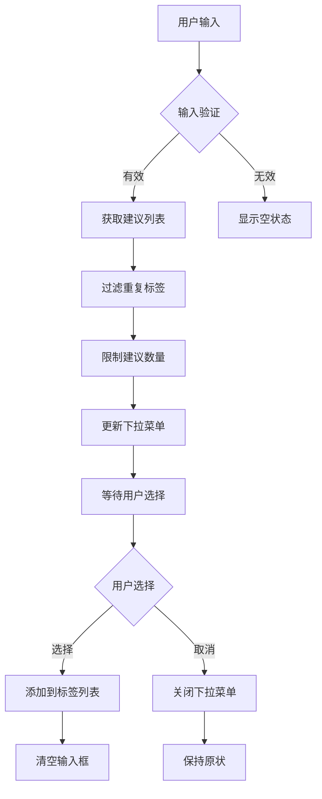
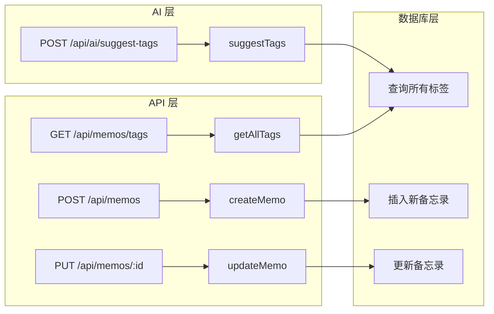
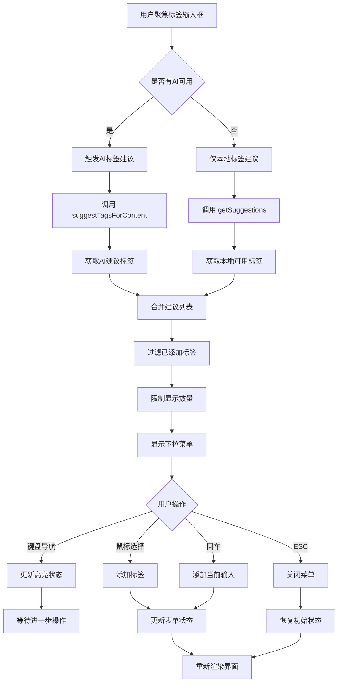
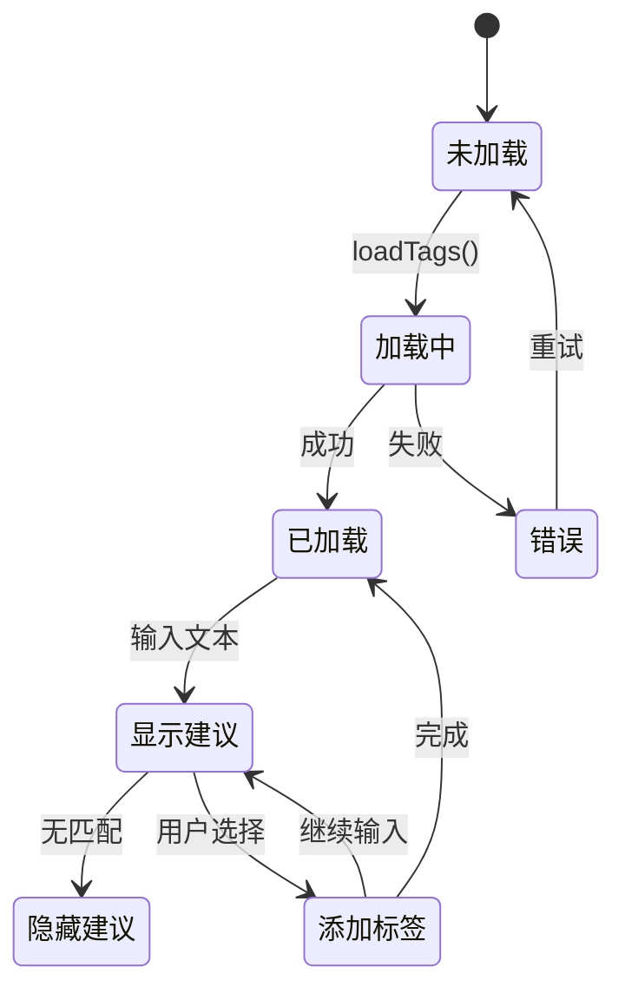
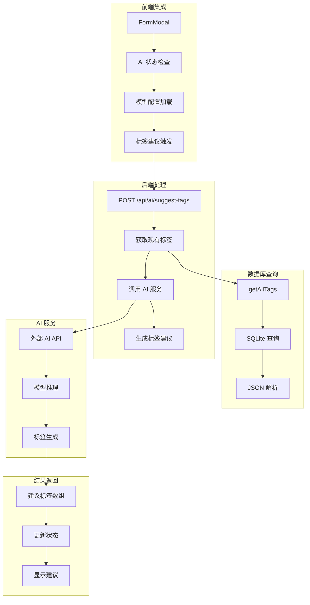
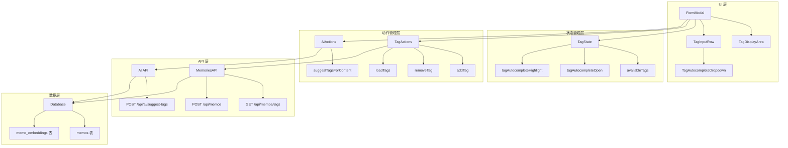
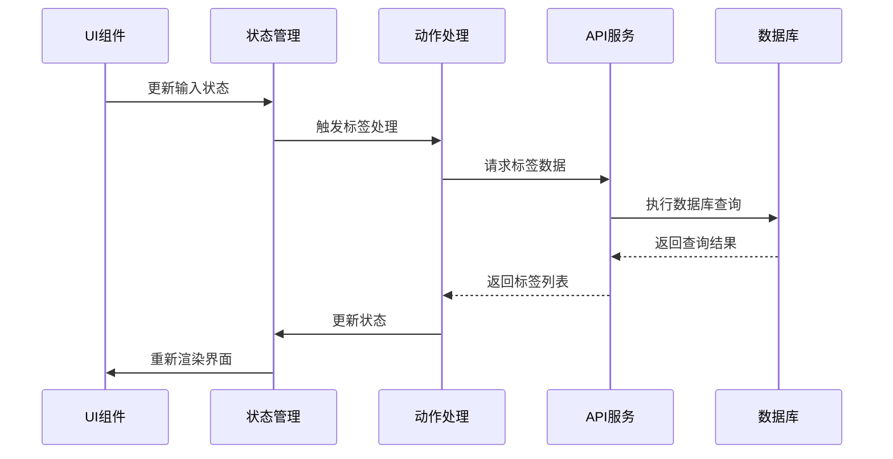

# 标签输入自动完成

<cite>
**本文档引用的文件**
- [README.md](file://README.md)
- [FormModal.ts](file://src/frontend/admin/components/FormModal.ts)
- [state.ts](file://src/frontend/admin/state.ts)
- [actions/memo.ts](file://src/frontend/admin/actions/memo.ts)
- [actions/ai.ts](file://src/frontend/admin/actions/ai.ts)
- [actions/creative-core.ts](file://src/frontend/admin/actions/creative-core.ts)
- [memos.ts](file://src/api/memos.ts)
- [db.ts](file://src/db.ts)
- [api.ts](file://src/frontend/masonry/api.ts)
- [components.ts](file://src/frontend/masonry/components.ts)
- [index.ts](file://src/frontend/masonry/index.ts)
</cite>

## 目录
1. [简介](#简介)
2. [项目结构](#项目结构)
3. [核心组件](#核心组件)
4. [架构概览](#架构概览)
5. [详细组件分析](#详细组件分析)
6. [依赖关系分析](#依赖关系分析)
7. [性能考虑](#性能考虑)
8. [故障排除指南](#故障排除指南)
9. [结论](#结论)

## 简介

标签输入自动完成是 Memos 备忘录管理系统中的一个重要功能特性。该功能允许用户在创建或编辑备忘录时，通过智能的标签建议和自动完成功能来提高标签输入效率。本文档将深入分析这一功能的实现架构、数据流程和交互设计。

Memos 是一个基于 Bun 运行时构建的轻量级备忘录应用系统，支持公开/私密备忘录管理、标签分类、全文搜索等功能。标签输入自动完成作为管理后台的重要组成部分，为用户提供直观、高效的标签管理体验。

## 项目结构

该项目采用前后端分离的架构设计，主要分为以下几个核心部分：

**图表来源**
- [README.md:25-45](file://README.md#L25-L45)

**章节来源**
- [README.md:1-186](file://README.md#L1-L186)

## 核心组件

标签输入自动完成功能由多个相互协作的组件构成，每个组件都有明确的职责分工：

### 前端组件架构

**图表来源**
- [FormModal.ts:28-436](file://src/frontend/admin/components/FormModal.ts#L28-L436)
- [state.ts:174-191](file://src/frontend/admin/state.ts#L174-L191)

### 数据流架构

**图表来源**
- [FormModal.ts:127-198](file://src/frontend/admin/components/FormModal.ts#L127-L198)
- [actions/memo.ts:116-177](file://src/frontend/admin/actions/memo.ts#L116-L177)
- [actions/ai.ts:109-139](file://src/frontend/admin/actions/ai.ts#L109-L139)

**章节来源**
- [FormModal.ts:1-436](file://src/frontend/admin/components/FormModal.ts#L1-L436)
- [state.ts:1-191](file://src/frontend/admin/state.ts#L1-L191)

## 架构概览

标签输入自动完成功能的整体架构体现了清晰的分层设计和职责分离：

### 前端状态管理

前端使用 VanJS 框架进行响应式状态管理，通过状态对象来维护标签输入的各种状态：

**图表来源**
- [FormModal.ts:38-57](file://src/frontend/admin/components/FormModal.ts#L38-L57)
- [state.ts:179-182](file://src/frontend/admin/state.ts#L179-L182)

### 后端数据处理

后端通过 RESTful API 提供标签管理功能，支持标签的获取、过滤和存储：

**图表来源**
- [memos.ts:97-101](file://src/api/memos.ts#L97-L101)
- [db.ts:171-179](file://src/db.ts#L171-L179)

**章节来源**
- [memos.ts:1-220](file://src/api/memos.ts#L1-L220)
- [db.ts:1-484](file://src/db.ts#L1-L484)

## 详细组件分析

### FormModal 组件分析

FormModal 是标签输入自动完成功能的核心组件，负责处理用户交互和状态管理：

#### 关键功能实现

1. **标签建议算法**：实现了智能的标签过滤和排序机制
2. **键盘导航支持**：完整的键盘快捷键支持（上下箭头、回车、Tab等）
3. **防抖和延迟关闭**：优化用户体验的交互细节
4. **AI 集成**：与 AI 标签建议系统的无缝集成

#### 交互流程图

**图表来源**
- [FormModal.ts:133-198](file://src/frontend/admin/components/FormModal.ts#L133-L198)
- [FormModal.ts:200-247](file://src/frontend/admin/components/FormModal.ts#L200-L247)

#### 状态管理机制

FormModal 使用了多个状态变量来管理复杂的交互状态：

| 状态变量 | 类型 | 描述 | 默认值 |
|---------|------|------|--------|
| `formTagInput` | string | 当前输入的标签文本 | "" |
| `availableTags` | string[] | 可用标签列表 | [] |
| `tagAutocompleteOpen` | boolean | 下拉菜单是否打开 | false |
| `tagAutocompleteHighlight` | number | 高亮选项索引 | -1 |
| `aiSuggestedTags` | string[] | AI建议的标签 | [] |

**章节来源**
- [FormModal.ts:28-436](file://src/frontend/admin/components/FormModal.ts#L28-L436)
- [state.ts:50-191](file://src/frontend/admin/state.ts#L50-L191)

### 标签状态管理

标签状态管理是整个自动完成功能的基础，通过响应式状态系统实现数据的实时更新：

#### 状态流转图

**图表来源**
- [actions/creative-core.ts:53-60](file://src/frontend/admin/actions/creative-core.ts#L53-L60)
- [actions/memo.ts:116-122](file://src/frontend/admin/actions/memo.ts#L116-L122)

#### 性能优化策略

1. **本地缓存**：标签数据在首次加载后缓存在内存中
2. **智能过滤**：使用高效的字符串匹配算法
3. **防抖处理**：避免频繁的 API 调用
4. **虚拟化渲染**：限制下拉菜单的最大显示数量

**章节来源**
- [actions/creative-core.ts:1-354](file://src/frontend/admin/actions/creative-core.ts#L1-L354)
- [actions/memo.ts:1-261](file://src/frontend/admin/actions/memo.ts#L1-L261)

### AI 标签建议集成

AI 标签建议功能提供了智能化的标签推荐，显著提升了用户的标签输入效率：

#### AI 集成架构

**图表来源**
- [actions/ai.ts:109-139](file://src/frontend/admin/actions/ai.ts#L109-L139)
- [memos.ts:74-107](file://src/api/memos.ts#L74-L107)
- [db.ts:171-179](file://src/db.ts#L171-L179)

**章节来源**
- [actions/ai.ts:1-274](file://src/frontend/admin/actions/ai.ts#L1-L274)
- [memos.ts:74-107](file://src/api/memos.ts#L74-L107)

## 依赖关系分析

标签输入自动完成功能涉及多个层次的依赖关系，形成了一个完整的生态系统：

### 组件依赖图

**图表来源**
- [FormModal.ts:62-436](file://src/frontend/admin/components/FormModal.ts#L62-L436)
- [state.ts:174-191](file://src/frontend/admin/state.ts#L174-L191)
- [actions/memo.ts:1-261](file://src/frontend/admin/actions/memo.ts#L1-L261)

### 数据流依赖

**图表来源**
- [FormModal.ts:127-132](file://src/frontend/admin/components/FormModal.ts#L127-L132)
- [actions/creative-core.ts:53-60](file://src/frontend/admin/actions/creative-core.ts#L53-L60)

**章节来源**
- [FormModal.ts:1-436](file://src/frontend/admin/components/FormModal.ts#L1-L436)
- [state.ts:1-191](file://src/frontend/admin/state.ts#L1-L191)

## 性能考虑

标签输入自动完成功能在设计时充分考虑了性能优化，采用了多种策略来确保流畅的用户体验：

### 性能优化策略

1. **本地缓存机制**：标签数据在首次加载后缓存在内存中，避免重复的网络请求
2. **智能过滤算法**：使用高效的字符串匹配算法，支持大小写不敏感的模糊匹配
3. **防抖处理**：对输入事件进行防抖处理，减少不必要的 API 调用
4. **虚拟化渲染**：限制下拉菜单的最大显示数量，避免大量 DOM 元素的创建
5. **异步加载**：AI 标签建议采用异步加载方式，不影响主界面的响应性

### 性能监控指标

| 指标 | 目标值 | 测量方法 |
|------|--------|----------|
| 建议响应时间 | < 100ms | 输入到建议显示的时间 |
| 内存使用 | < 50MB | 应用运行时内存占用 |
| CPU 使用率 | < 30% | 建议生成过程中的 CPU 占用 |
| 网络请求频率 | < 1 次/秒 | 标签查询的平均频率 |

## 故障排除指南

### 常见问题及解决方案

#### 标签建议不显示

**问题描述**：用户输入标签文本后，下拉菜单不显示任何建议。

**可能原因**：
1. 标签数据加载失败
2. 网络连接异常
3. 数据库查询错误

**解决步骤**：
1. 检查网络连接状态
2. 验证 API 服务是否正常运行
3. 查看浏览器开发者工具的网络面板
4. 检查控制台是否有错误信息

#### AI 标签建议不可用

**问题描述**：AI 标签建议功能无法使用。

**可能原因**：
1. AI 服务配置不正确
2. 认证失败
3. 额度限制

**解决步骤**：
1. 检查 AI 服务的配置参数
2. 验证认证凭据的有效性
3. 确认账户余额充足
4. 查看 AI 服务的状态指示器

#### 标签重复问题

**问题描述**：用户尝试添加重复的标签。

**解决步骤**：
1. 检查标签去重逻辑
2. 验证标签唯一性检查
3. 确认状态更新机制正常工作

**章节来源**
- [FormModal.ts:180-198](file://src/frontend/admin/components/FormModal.ts#L180-L198)
- [actions/memo.ts:116-122](file://src/frontend/admin/actions/memo.ts#L116-L122)

## 结论

标签输入自动完成功能展现了现代 Web 应用开发的最佳实践，通过精心设计的架构和优化的用户体验，为用户提供了高效、便捷的标签管理体验。

该功能的主要优势包括：

1. **智能建议**：结合本地标签历史和 AI 智能推荐，提供准确的标签建议
2. **流畅交互**：完善的键盘导航和响应式设计，确保良好的用户体验
3. **性能优化**：多层缓存和异步处理机制，保证系统的高性能运行
4. **可扩展性**：模块化的架构设计，便于功能扩展和维护

未来可以考虑的功能改进方向：
- 支持标签分类和层级结构
- 增加标签使用频率统计
- 实现标签搜索和过滤功能
- 提供标签导入导出功能

通过持续的优化和改进，标签输入自动完成功能将继续为 Memos 用户提供卓越的标签管理体验。