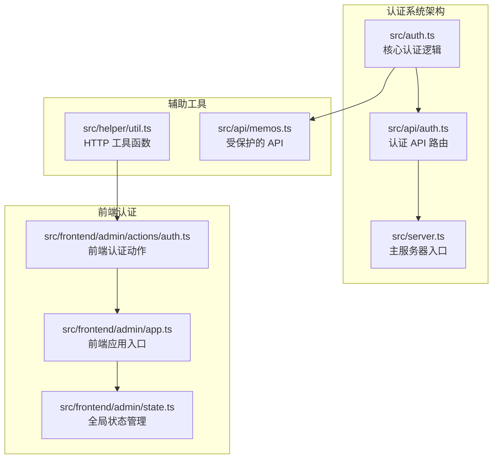
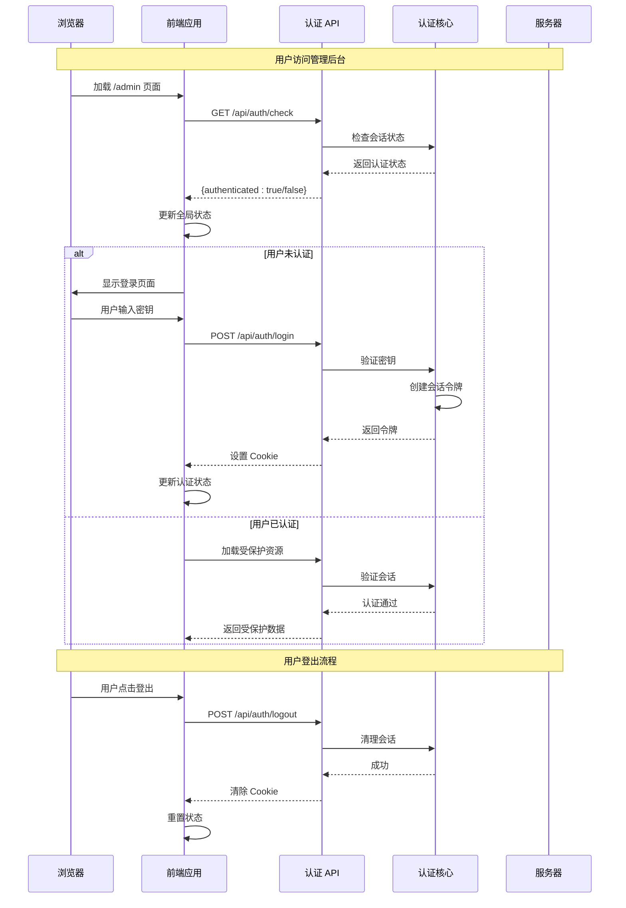
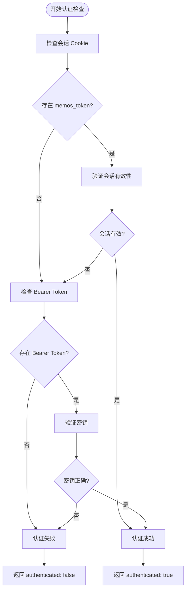
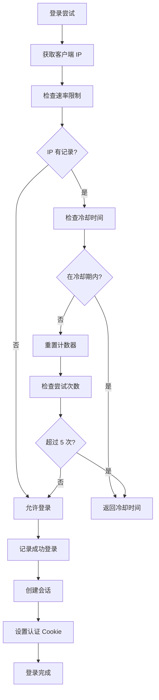
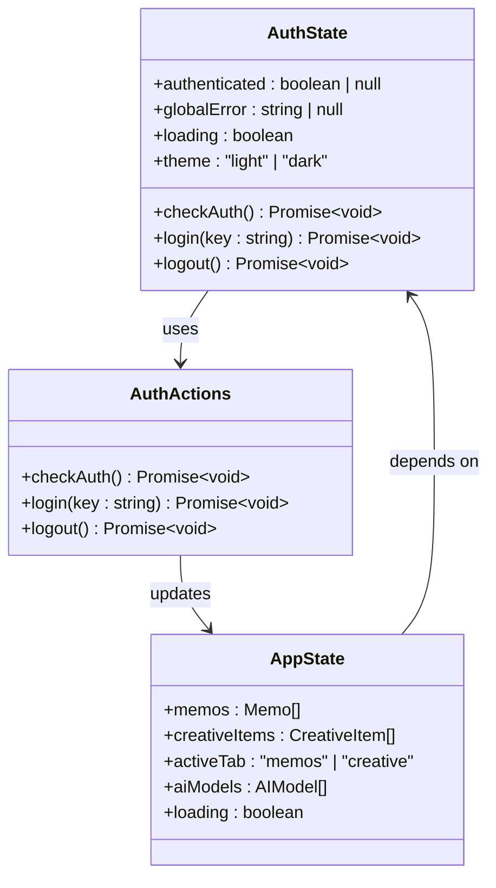
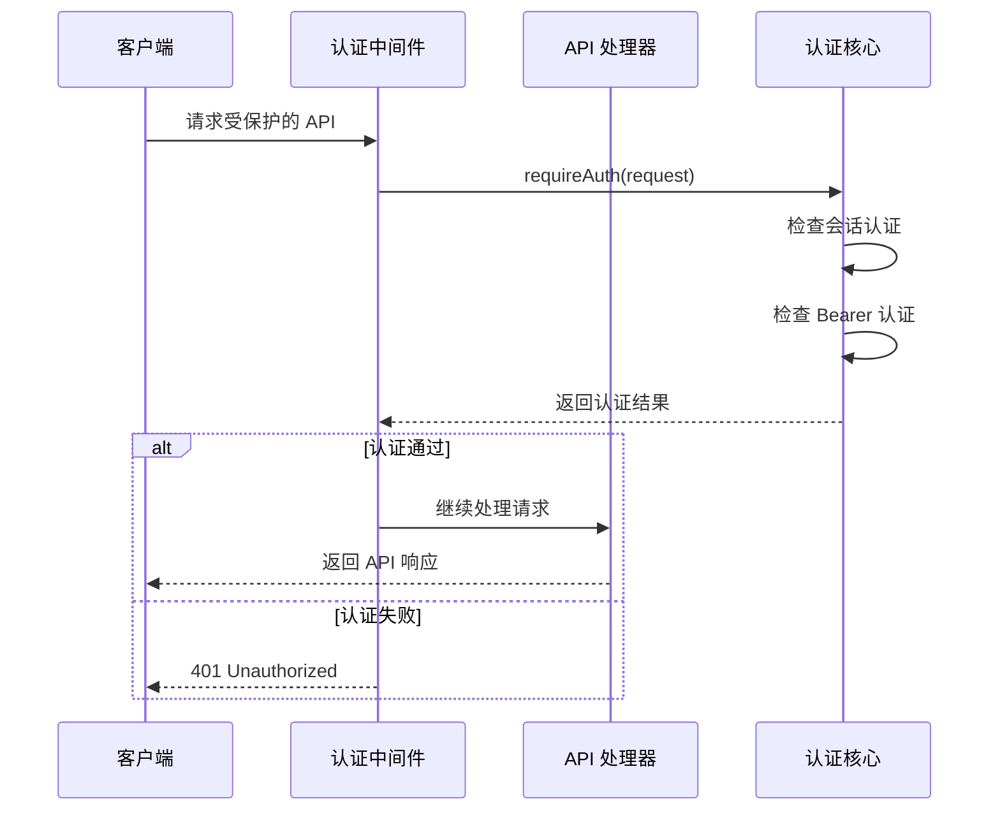
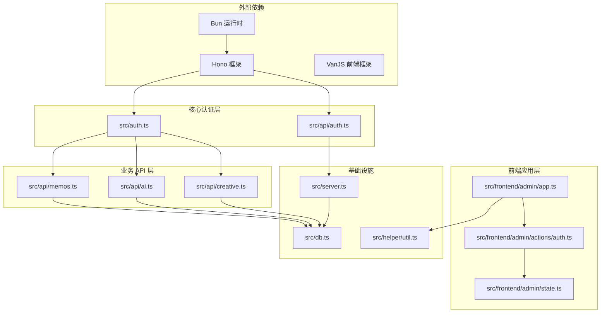

# 认证状态识别

<cite>
**本文档引用的文件**
- [src/auth.ts](file://src/auth.ts)
- [src/api/auth.ts](file://src/api/auth.ts)
- [src/frontend/admin/actions/auth.ts](file://src/frontend/admin/actions/auth.ts)
- [src/frontend/admin/app.ts](file://src/frontend/admin/app.ts)
- [src/frontend/admin/state.ts](file://src/frontend/admin/state.ts)
- [src/server.ts](file://src/server.ts)
- [src/helper/util.ts](file://src/helper/util.ts)
- [src/api/memos.ts](file://src/api/memos.ts)
- [README.md](file://README.md)
</cite>

## 目录
1. [简介](#简介)
2. [项目结构](#项目结构)
3. [核心组件](#核心组件)
4. [架构概览](#架构概览)
5. [详细组件分析](#详细组件分析)
6. [依赖关系分析](#依赖关系分析)
7. [性能考虑](#性能考虑)
8. [故障排除指南](#故障排除指南)
9. [结论](#结论)

## 简介

本文档深入分析了 Memos 应用中的认证状态识别机制。Memos 是一个基于 Bun 运行时构建的轻量级备忘录应用系统，提供了管理员后台的密钥认证功能。该系统实现了双重认证机制：基于 Cookie 的会话认证和基于 Bearer Token 的 API 认证。

认证系统的核心目标是：
- 提供安全的管理员访问控制
- 支持多种认证方式（Web 界面和 API 调用）
- 实现登录频率限制和安全防护
- 确保认证状态在前端和后端之间的一致性

## 项目结构

Memos 项目的认证相关文件分布如下：

**图表来源**
- [src/auth.ts:1-128](file://src/auth.ts#L1-L128)
- [src/api/auth.ts:1-77](file://src/api/auth.ts#L1-L77)
- [src/server.ts:1-137](file://src/server.ts#L1-L137)

**章节来源**
- [src/auth.ts:1-128](file://src/auth.ts#L1-L128)
- [src/api/auth.ts:1-77](file://src/api/auth.ts#L1-L77)
- [src/server.ts:1-137](file://src/server.ts#L1-L137)

## 核心组件

### 认证核心模块 (src/auth.ts)

认证系统的核心逻辑集中在 `src/auth.ts` 文件中，实现了以下关键功能：

#### 会话管理
- **内存会话存储**：使用 Set 数据结构存储有效的会话令牌
- **Cookie 处理**：解析和设置认证 Cookie，包含 HttpOnly、SameSite、Max-Age 等安全属性
- **令牌生成**：使用 crypto.randomUUID() 生成安全的随机令牌

#### 认证验证
- **会话认证**：检查请求中的 Cookie 是否对应有效的会话令牌
- **Bearer 认证**：验证 Authorization 头中的 Bearer Token
- **中间件集成**：提供 Hono 中间件用于路由保护

#### 安全防护
- **登录频率限制**：防止暴力破解攻击
- **错误处理**：统一的 401 错误响应格式

**章节来源**
- [src/auth.ts:1-128](file://src/auth.ts#L1-L128)

### 认证 API 模块 (src/api/auth.ts)

认证 API 模块提供了完整的 RESTful 接口：

#### API 端点
- **GET /api/auth/check**：检查当前认证状态
- **POST /api/auth/login**：用户登录，返回认证 Cookie
- **POST /api/auth/logout**：用户登出，清除认证状态

#### 安全实现
- **环境变量配置**：MEMOS_SECRET_KEY 作为认证密钥
- **IP 地址追踪**：记录登录尝试的来源 IP
- **速率限制**：每分钟最多 5 次登录尝试

**章节来源**
- [src/api/auth.ts:1-77](file://src/api/auth.ts#L1-L77)

### 前端认证模块

前端认证系统通过 VanJS 实现响应式状态管理：

#### 状态管理
- **authenticated 状态**：跟踪用户的认证状态（true/false/null）
- **全局错误处理**：统一的错误显示机制
- **主题切换**：支持明暗主题的持久化存储

#### 用户交互
- **登录页面**：密码输入表单，支持回车键提交
- **认证检查**：应用启动时自动检查认证状态
- **登出功能**：清理本地状态和服务器会话

**章节来源**
- [src/frontend/admin/actions/auth.ts:1-51](file://src/frontend/admin/actions/auth.ts#L1-L51)
- [src/frontend/admin/app.ts:1-295](file://src/frontend/admin/app.ts#L1-L295)
- [src/frontend/admin/state.ts:1-191](file://src/frontend/admin/state.ts#L1-L191)

## 架构概览

Memos 的认证系统采用分层架构设计，确保了安全性、可维护性和用户体验：

**图表来源**
- [src/frontend/admin/actions/auth.ts:12-25](file://src/frontend/admin/actions/auth.ts#L12-L25)
- [src/api/auth.ts:36-68](file://src/api/auth.ts#L36-L68)
- [src/auth.ts:111-127](file://src/auth.ts#L111-L127)

## 详细组件分析

### 认证状态检测机制

认证状态检测是整个系统的核心，实现了多层次的状态验证：

**图表来源**
- [src/auth.ts:28-46](file://src/auth.ts#L28-L46)
- [src/frontend/admin/actions/auth.ts:12-25](file://src/frontend/admin/actions/auth.ts#L12-L25)

#### 会话状态管理

会话状态管理采用了内存存储策略，具有以下特点：

| 特性 | 实现细节 | 安全考虑 |
|------|----------|----------|
| 令牌存储 | 使用 Set 数据结构存储有效令牌 | 仅内存存储，重启丢失 |
| Cookie 设置 | HttpOnly + SameSite Strict + 24小时过期 | 防止 XSS 攻击 |
| 令牌生成 | crypto.randomUUID() | 高熵随机数 |
| 清理会话 | destroySession() + clearAuthCookie() | 完全清除认证状态 |

**章节来源**
- [src/auth.ts:48-70](file://src/auth.ts#L48-L70)

### 登录频率限制系统

为了防止暴力破解攻击，系统实现了智能的登录频率限制：

**图表来源**
- [src/auth.ts:81-107](file://src/auth.ts#L81-L107)
- [src/api/auth.ts:38-50](file://src/api/auth.ts#L38-L50)

#### 速率限制算法

系统使用滑动窗口算法实现智能的速率限制：

| 参数 | 值 | 说明 |
|------|-----|------|
| 最大尝试次数 | 5 次 | 防止暴力破解 |
| 冷却时间 | 60 秒 | 冷静期防止持续攻击 |
| 存储结构 | Map<IP, {count, firstAttempt}> | 滑动窗口计数器 |
| IP 获取 | X-Forwarded-For 或 X-Real-IP | 支持代理环境 |

**章节来源**
- [src/auth.ts:73-107](file://src/auth.ts#L73-L107)

### 前端认证状态同步

前端通过响应式状态管理实现了认证状态的实时同步：

**图表来源**
- [src/frontend/admin/state.ts:37-41](file://src/frontend/admin/state.ts#L37-L41)
- [src/frontend/admin/actions/auth.ts:12-50](file://src/frontend/admin/actions/auth.ts#L12-L50)

#### 前端状态管理

前端状态管理采用 VanJS 的响应式系统：

| 状态类型 | 描述 | 生命周期 |
|----------|------|----------|
| authenticated | 认证状态（null: 检查中, true: 已认证, false: 未认证） | 应用启动时检查 |
| globalError | 全局错误消息 | 任何 API 调用失败时设置 |
| loading | 加载状态 | 数据加载期间显示 |
| memos | 备忘录列表 | 登录成功后加载 |
| creativeItems | 创作内容列表 | 登录成功后加载 |

**章节来源**
- [src/frontend/admin/state.ts:37-191](file://src/frontend/admin/state.ts#L37-L191)

### API 认证中间件

受保护的 API 端点通过认证中间件确保安全性：

#### 中间件工作流程

**图表来源**
- [src/auth.ts:123-127](file://src/auth.ts#L123-L127)
- [src/api/memos.ts:104-104](file://src/api/memos.ts#L104-L104)

#### 受保护的 API 端点

| 端点 | 方法 | 认证要求 | 功能描述 |
|------|------|----------|----------|
| /api/memos | POST | 需要认证 | 创建新的备忘录 |
| /api/memos/:id | PUT | 需要认证 | 更新现有备忘录 |
| /api/memos/:id | DELETE | 需要认证 | 删除备忘录 |
| /api/memos/count | GET | 需要认证 | 获取备忘录总数 |
| /api/memos/:id/similar | GET | 可选认证 | 语义相似度搜索 |

**章节来源**
- [src/api/memos.ts:103-200](file://src/api/memos.ts#L103-L200)

## 依赖关系分析

认证系统的依赖关系体现了清晰的分层架构：

**图表来源**
- [src/server.ts:1-137](file://src/server.ts#L1-L137)
- [src/auth.ts:1-128](file://src/auth.ts#L1-L128)

### 关键依赖关系

1. **认证核心依赖**：所有受保护的 API 都依赖于认证核心模块
2. **前端依赖**：前端应用依赖于认证 API 和状态管理
3. **服务器集成**：认证系统集成到主服务器路由中
4. **数据库交互**：认证状态与数据库操作分离，仅在必要时访问

**章节来源**
- [src/server.ts:38-46](file://src/server.ts#L38-L46)
- [src/api/memos.ts:2-26](file://src/api/memos.ts#L2-L26)

## 性能考虑

### 认证性能优化

认证系统在设计时充分考虑了性能因素：

#### 内存存储优势
- **快速查找**：Set 数据结构提供 O(1) 的会话验证时间
- **低延迟**：内存存储避免了数据库查询开销
- **简单实现**：减少了复杂的数据库连接管理

#### 前端状态缓存
- **本地存储**：主题偏好等状态持久化到 localStorage
- **状态复用**：认证状态在应用生命周期内保持
- **条件渲染**：根据认证状态动态渲染不同 UI

#### API 调用优化
- **幂等检查**：/api/auth/check 端点支持无状态检查
- **错误缓存**：前端缓存认证失败状态，避免重复尝试
- **异步加载**：AI 状态检查不阻塞主要 UI 渲染

### 性能监控指标

| 指标 | 目标值 | 监控方法 |
|------|--------|----------|
| 认证响应时间 | < 50ms | 浏览器开发者工具 |
| 登录成功率 | > 99% | 服务器日志分析 |
| 并发认证请求数 | > 100 | 压力测试 |
| 内存使用 | < 50MB | 进程监控 |

## 故障排除指南

### 常见认证问题

#### 问题 1：登录后仍然显示未认证

**可能原因**：
- 浏览器阻止了 Cookie 设置
- 服务器时钟不同步
- 代理配置问题

**解决方案**：
1. 检查浏览器 Cookie 设置
2. 验证服务器时间同步
3. 检查代理头配置

#### 问题 2：频繁收到登录限制提示

**可能原因**：
- 多个客户端同时尝试登录
- IP 地址被错误识别
- 速率限制配置过于严格

**解决方案**：
1. 等待冷却期结束（60秒）
2. 检查代理配置
3. 调整速率限制设置

#### 问题 3：API 调用返回 401 未授权

**可能原因**：
- 会话过期（24小时）
- Bearer Token 错误
- CORS 配置问题

**解决方案**：
1. 重新登录获取新会话
2. 验证 Bearer Token 格式
3. 检查 API 调用配置

### 调试技巧

#### 前端调试
- 使用浏览器开发者工具检查 Cookie
- 查看网络面板中的认证请求
- 监控全局状态变化

#### 后端调试
- 查看服务器日志中的认证信息
- 检查内存中的会话状态
- 验证环境变量配置

**章节来源**
- [src/frontend/admin/actions/auth.ts:27-42](file://src/frontend/admin/actions/auth.ts#L27-L42)
- [src/auth.ts:111-119](file://src/auth.ts#L111-L119)

## 结论

Memos 的认证状态识别系统展现了现代 Web 应用的安全最佳实践。通过实现双重认证机制、智能的速率限制和响应式状态管理，系统在保证安全性的同时提供了良好的用户体验。

### 系统优势

1. **安全性**：采用 HttpOnly Cookie 和 Bearer Token 双重认证
2. **易用性**：自动化的认证状态检查和错误处理
3. **可维护性**：清晰的分层架构和模块化设计
4. **性能**：内存存储和异步处理优化

### 改进建议

1. **持久化会话**：考虑使用数据库存储会话以支持服务重启
2. **多用户支持**：扩展为支持多个管理员用户
3. **会话刷新**：实现会话自动刷新机制
4. **审计日志**：添加详细的认证事件记录

该认证系统为 Memos 提供了坚实的安全基础，为后续的功能扩展和安全加固奠定了良好基础。