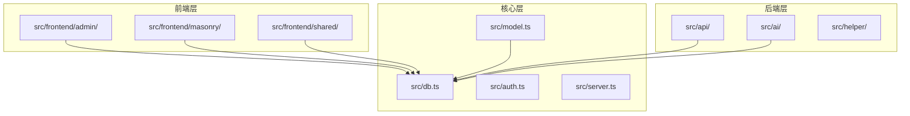
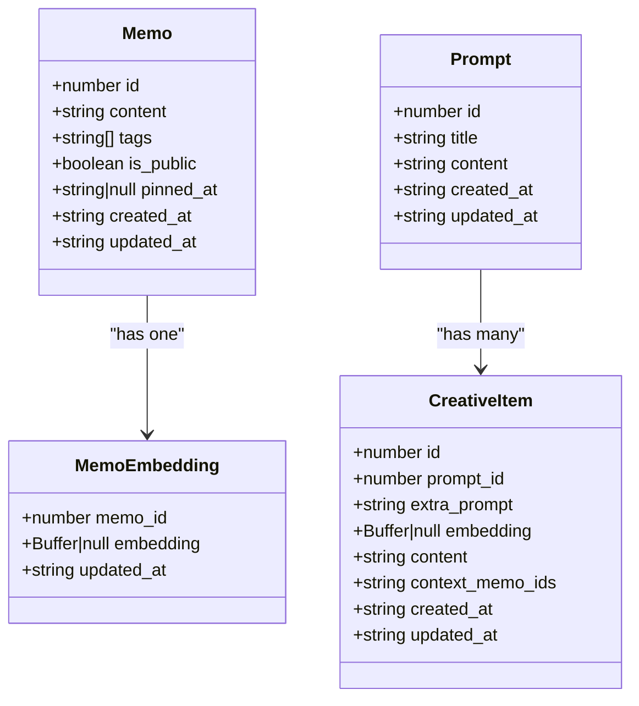
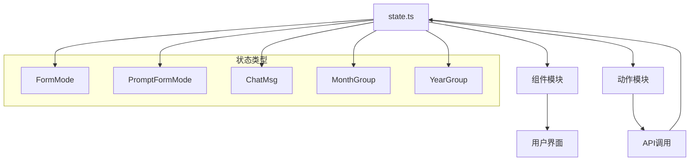
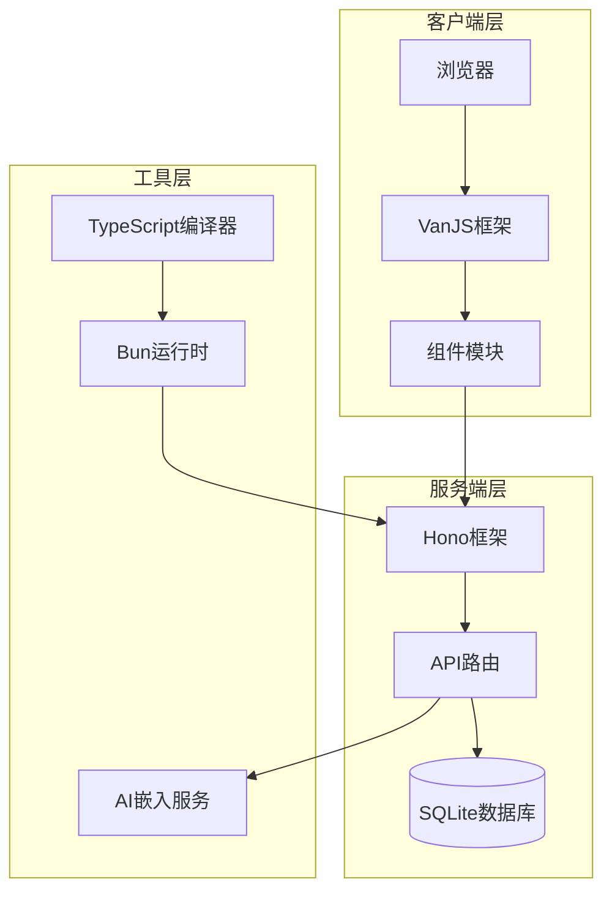

# TypeScript编码规范

<cite>
**本文档引用的文件**
- [tsconfig.json](file://tsconfig.json)
- [package.json](file://package.json)
- [src/frontend/admin/app.ts](file://src/frontend/admin/app.ts)
- [src/api/memos.ts](file://src/api/memos.ts)
- [src/model.ts](file://src/model.ts)
- [src/frontend/admin/state.ts](file://src/frontend/admin/state.ts)
- [src/db.ts](file://src/db.ts)
- [src/helper/util.ts](file://src/helper/util.ts)
- [src/frontend/shared/utils/text.ts](file://src/frontend/shared/utils/text.ts)
- [src/frontend/admin/actions/memo.ts](file://src/frontend/admin/actions/memo.ts)
- [src/frontend/admin/components/MemoCard.ts](file://src/frontend/admin/components/MemoCard.ts)
- [src/frontend/masonry/index.ts](file://src/frontend/masonry/index.ts)
- [docs/vanjs.md](file://docs/vanjs.md)
</cite>

## 目录
1. [简介](#简介)
2. [项目结构](#项目结构)
3. [核心组件](#核心组件)
4. [架构概览](#架构概览)
5. [详细组件分析](#详细组件分析)
6. [依赖关系分析](#依赖关系分析)
7. [性能考虑](#性能考虑)
8. [故障排除指南](#故障排除指南)
9. [结论](#结论)

## 简介

本文件为Memmos项目的TypeScript编码规范文档，旨在建立统一的代码风格标准，确保项目的可维护性和一致性。Memmos是一个基于Bun运行时的现代化笔记应用，采用TypeScript进行开发，结合VanJS前端框架和Hono后端框架构建。

## 项目结构

Memmos项目采用模块化的文件组织方式，主要分为以下层次：



**图表来源**
- [src/frontend/admin/app.ts:1-251](file://src/frontend/admin/app.ts#L1-L251)
- [src/api/memos.ts:1-220](file://src/api/memos.ts#L1-L220)
- [src/db.ts:1-484](file://src/db.ts#L1-L484)

**章节来源**
- [src/frontend/admin/app.ts:1-251](file://src/frontend/admin/app.ts#L1-L251)
- [src/api/memos.ts:1-220](file://src/api/memos.ts#L1-L220)
- [src/db.ts:1-484](file://src/db.ts#L1-L484)

## 核心组件

### 类型系统规范

Memmos项目采用严格的TypeScript类型系统，所有数据结构都通过接口定义：



**图表来源**
- [src/model.ts:1-35](file://src/model.ts#L1-L35)

### 状态管理架构

项目采用VanJS的响应式状态管理模式，通过独立的状态模块实现跨组件共享：



**图表来源**
- [src/frontend/admin/state.ts:1-178](file://src/frontend/admin/state.ts#L1-L178)

**章节来源**
- [src/model.ts:1-35](file://src/model.ts#L1-L35)
- [src/frontend/admin/state.ts:1-178](file://src/frontend/admin/state.ts#L1-L178)

## 架构概览

Memmos采用前后端分离的架构设计，结合了现代Web技术栈：



**图表来源**
- [src/frontend/admin/app.ts:1-251](file://src/frontend/admin/app.ts#L1-L251)
- [src/api/memos.ts:1-220](file://src/api/memos.ts#L1-L220)
- [src/db.ts:1-484](file://src/db.ts#L1-L484)

## 详细组件分析

### 命名约定规范

#### 接口命名
- 使用I前缀的接口命名：`IMemo`、`IPrompt`、`ICreativeItem`
- 现有实现中采用简洁接口名，建议统一添加I前缀以提高可读性

#### 类名规范
- 采用帕斯卡命名法：`MemoCard`、`FormModal`、`TimelineSidebar`
- 组件类名使用名词形式，动作为方法名

#### 变量命名
- 采用驼峰命名法：`apiUrl`、`loadMemos`、`formMode`
- 布尔变量使用is/has/can前缀：`isLoading`、`hasError`、`canSave`

#### 文件命名
- 模块文件采用小写加连字符：`memo-card.ts`、`form-modal.ts`、`timeline-sidebar.ts`
- 类型定义文件以.d.ts结尾：`types.d.ts`、`models.d.ts`

**章节来源**
- [src/frontend/admin/components/MemoCard.ts:1-346](file://src/frontend/admin/components/MemoCard.ts#L1-L346)
- [src/frontend/admin/actions/memo.ts:1-231](file://src/frontend/admin/actions/memo.ts#L1-L231)

### 模块导入导出规则

#### 相对路径导入
项目广泛使用相对路径导入，遵循就近原则：
- 本地模块：`import { api } from "../../../helper/util"`
- 组件模块：`import { MemoCard } from "./components/MemoCard"`

#### 绝对路径别名
- 通过Bun的模块解析策略支持绝对路径导入
- 建议使用`@/*`别名指向src目录

#### 导出策略
- 默认导出用于单一功能模块：`export default function api()`
- 命名导出用于多用途模块：`export function loadMemos()`、`export function saveForm()`

**章节来源**
- [src/frontend/admin/actions/memo.ts:1-231](file://src/frontend/admin/actions/memo.ts#L1-L231)
- [src/frontend/admin/components/MemoCard.ts:1-346](file://src/frontend/admin/components/MemoCard.ts#L1-L346)

### 编译配置说明

#### 严格模式设置
项目启用了全面的TypeScript严格模式：
- `"strict": true` - 启用所有严格检查
- `"skipLibCheck": true` - 跳过库文件检查
- `"noFallthroughCasesInSwitch": true` - 防止switch语句穿透
- `"noUncheckedIndexedAccess": true` - 索引访问类型安全

#### 模块解析策略
- `"moduleResolution": "bundler"` - Bundler模式解析
- `"allowImportingTsExtensions": true` - 允许TS文件扩展名导入
- `"verbatimModuleSyntax": true` - 保持原始模块语法

#### 目标版本选择
- `"target": "ESNext"` - 最新JavaScript特性
- `"module": "ESNext"` - ES模块语法
- `"lib": ["ESNext", "DOM"]` - 支持DOM API

**章节来源**
- [tsconfig.json:1-30](file://tsconfig.json#L1-L30)

### 代码格式化规范

#### 代码风格
- 使用4空格缩进
- 行尾不保留多余空格
- 逗号后留空格，逗号前不留空格
- 大括号独占一行

#### 注释规范
- 接口和类使用JSDoc注释
- 复杂逻辑添加行内注释
- TODO/FIXME标记明确问题

#### 错误处理
- 所有异步操作必须包含错误处理
- API调用使用try-catch包装
- 用户友好的错误消息

**章节来源**
- [src/helper/util.ts:1-75](file://src/helper/util.ts#L1-L75)
- [src/frontend/admin/actions/memo.ts:1-231](file://src/frontend/admin/actions/memo.ts#L1-L231)

## 依赖关系分析

```mermaid
graph TB
subgraph "前端依赖"
VanJS[vanjs-core]
DOMPurify[dompurify]
Marked[marked]
end
subgraph "后端依赖"
Hono[hono]
BunSQLite[bun:sqlite]
end
subgraph "开发依赖"
TypeScript[typescript ^5]
BunTypes[@types/bun]
end
VanJS --> DOMPurify
VanJS --> Marked
Hono --> BunSQLite
TypeScript --> BunTypes
```

**图表来源**
- [package.json:13-26](file://package.json#L13-L26)

**章节来源**
- [package.json:1-26](file://package.json#L1-L26)

## 性能考虑

### 内存管理
- 使用VanJS的响应式系统避免不必要的重渲染
- 合理使用状态缓存机制
- 及时清理事件监听器和定时器

### 网络优化
- API请求使用防抖和节流
- 图片和资源懒加载
- 合理的数据分页和缓存策略

### 数据库优化
- 使用索引优化查询性能
- 批量操作减少数据库往返
- 连接池管理和事务优化

## 故障排除指南

### 常见编译错误
- **类型不匹配**：检查接口定义和实际数据结构
- **模块解析失败**：确认相对路径正确性和文件存在性
- **严格模式错误**：启用可选链和非空断言

### 运行时错误
- **API调用失败**：检查网络连接和服务器状态
- **状态更新异常**：验证响应式绑定的依赖关系
- **内存泄漏**：检查事件监听器的清理

**章节来源**
- [src/frontend/admin/app.ts:224-251](file://src/frontend/admin/app.ts#L224-L251)
- [src/db.ts:15-13](file://src/db.ts#L15-L13)

## 结论

Memmos项目的TypeScript编码规范体现了现代前端开发的最佳实践。通过严格的类型系统、清晰的模块化架构和完善的错误处理机制，项目实现了良好的可维护性和扩展性。建议团队在现有基础上进一步完善代码注释和测试覆盖率，以提升整体代码质量。