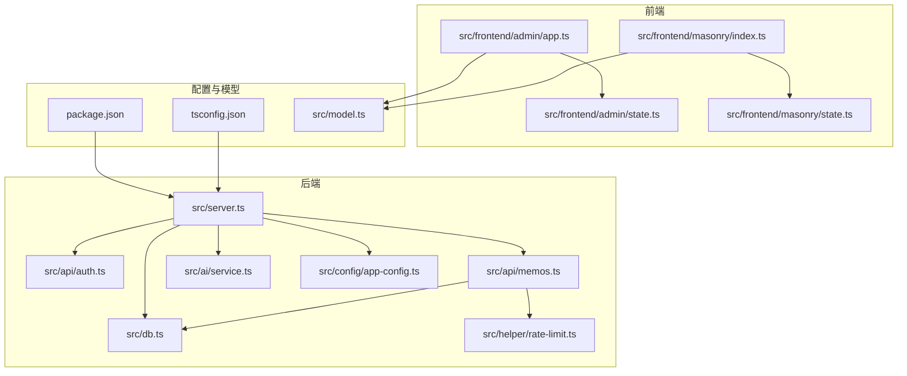
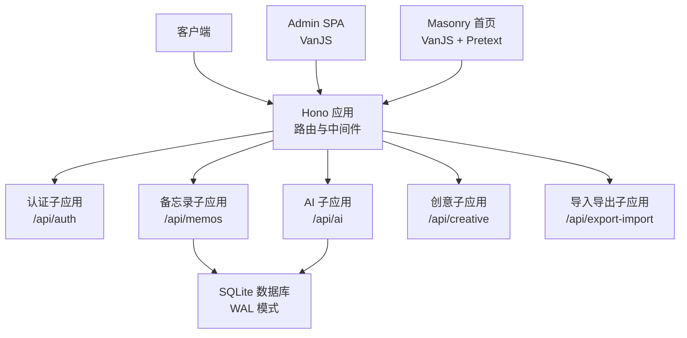
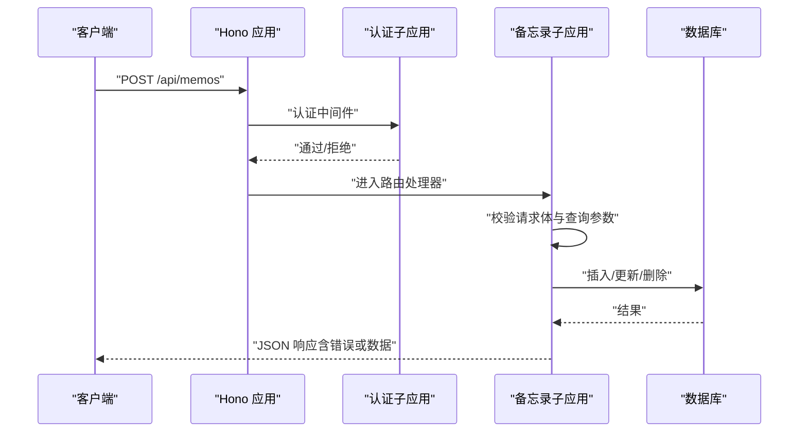
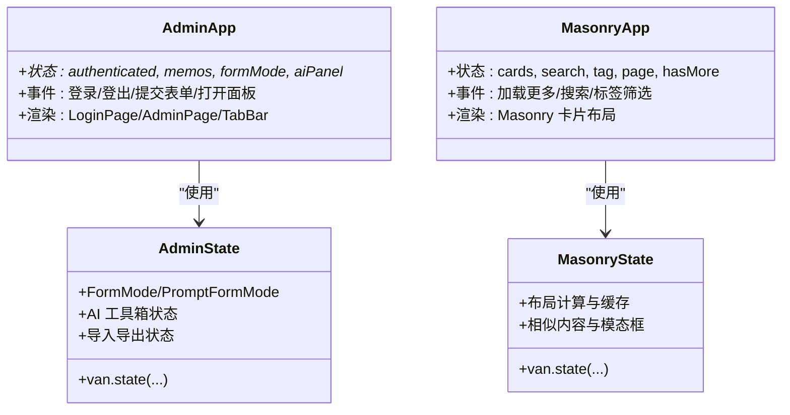
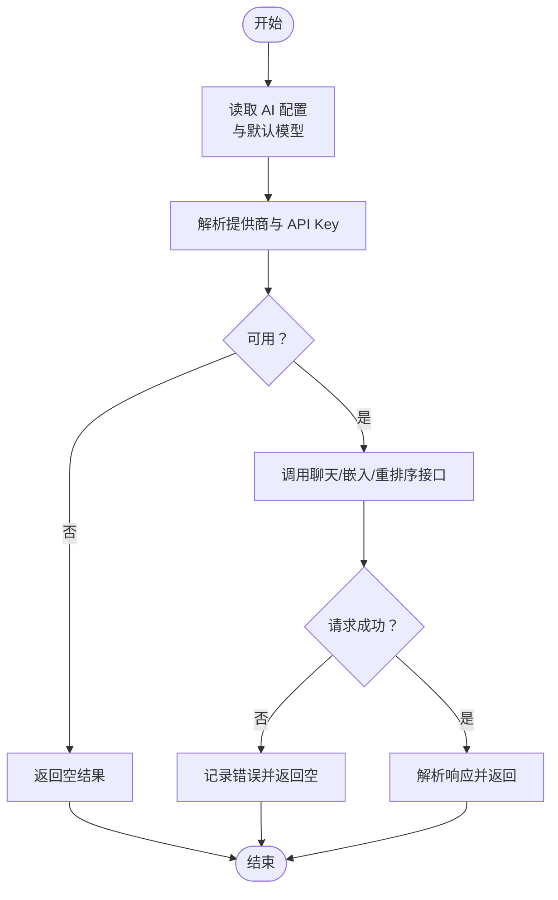
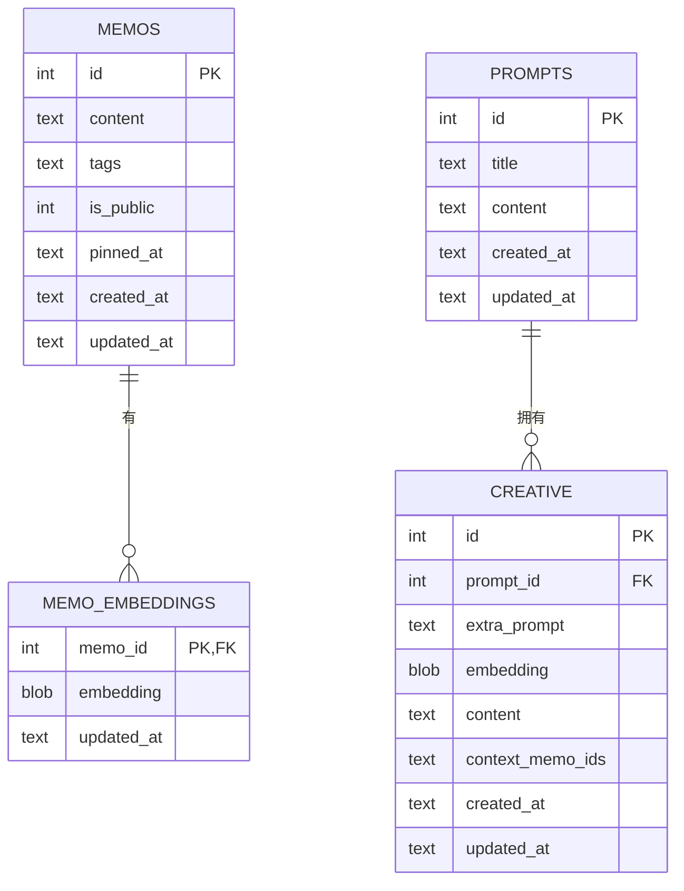
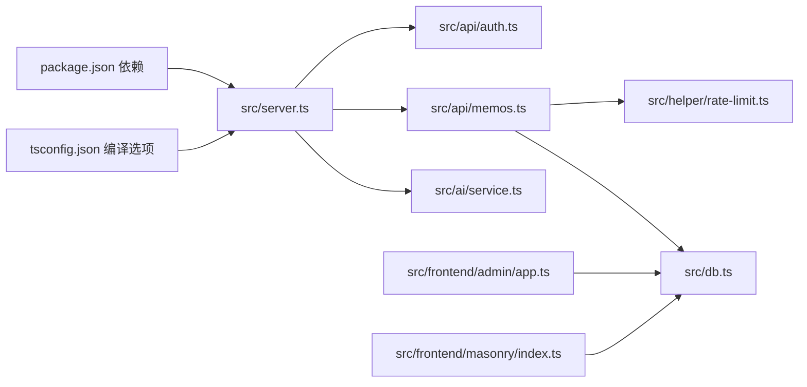

# 代码结构与规范

<cite>
**本文引用的文件**
- [package.json](file://package.json)
- [tsconfig.json](file://tsconfig.json)
- [README.md](file://README.md)
- [src/server.ts](file://src/server.ts)
- [src/config/app-config.ts](file://src/config/app-config.ts)
- [src/api/auth.ts](file://src/api/auth.ts)
- [src/api/memos.ts](file://src/api/memos.ts)
- [src/db.ts](file://src/db.ts)
- [src/frontend/admin/app.ts](file://src/frontend/admin/app.ts)
- [src/frontend/admin/state.ts](file://src/frontend/admin/state.ts)
- [src/frontend/masonry/index.ts](file://src/frontend/masonry/index.ts)
- [src/frontend/masonry/state.ts](file://src/frontend/masonry/state.ts)
- [src/ai/service.ts](file://src/ai/service.ts)
- [src/helper/rate-limit.ts](file://src/helper/rate-limit.ts)
- [src/model.ts](file://src/model.ts)
</cite>

## 目录
1. [简介](#简介)
2. [项目结构](#项目结构)
3. [核心组件](#核心组件)
4. [架构总览](#架构总览)
5. [详细组件分析](#详细组件分析)
6. [依赖关系分析](#依赖关系分析)
7. [性能考量](#性能考量)
8. [故障排查指南](#故障排查指南)
9. [结论](#结论)
10. [附录](#附录)

## 简介
本文件面向 Memos 项目，系统化梳理代码结构与编码规范，覆盖目录组织原则、TypeScript 编码标准、注释规范、前端组件架构模式、后端 API 设计规范以及代码质量检查工具配置。目标是帮助开发者快速理解并高效维护项目。

## 项目结构
项目采用“按层+按功能”的混合组织方式：
- src/server.ts：主服务入口，负责路由挂载、静态资源与页面分发、初始化流程。
- src/api/*：后端子应用，按领域拆分（认证、备忘录、AI、创意、导入导出）。
- src/frontend/*：前端 SPA 与页面，分为 admin 管理后台与 masonry 首页瀑布流。
- src/ai/*：AI 能力封装（模型选择、请求、嵌入、重排序、创意生成等）。
- src/helper/*：通用辅助模块（速率限制、工具函数、Markdown 渲染等）。
- src/config/*：应用配置加载器（从配置文件读取并提供默认值）。
- src/db.ts：数据库初始化与 CRUD，包含表结构、索引与查询方法。
- src/model.ts：跨层共享的数据模型定义。
- data/：提示词与系统提示词模板。
- docs/：文档与范式说明（例如 VanJS 使用说明）。

图表来源
- [src/server.ts:1-125](file://src/server.ts#L1-L125)
- [src/api/auth.ts:1-77](file://src/api/auth.ts#L1-L77)
- [src/api/memos.ts:1-220](file://src/api/memos.ts#L1-L220)
- [src/ai/service.ts:1-507](file://src/ai/service.ts#L1-L507)
- [src/config/app-config.ts:1-108](file://src/config/app-config.ts#L1-L108)
- [src/db.ts:1-484](file://src/db.ts#L1-L484)
- [src/helper/rate-limit.ts:1-153](file://src/helper/rate-limit.ts#L1-L153)
- [src/frontend/admin/app.ts:1-251](file://src/frontend/admin/app.ts#L1-L251)
- [src/frontend/admin/state.ts:1-178](file://src/frontend/admin/state.ts#L1-L178)
- [src/frontend/masonry/index.ts:1-23](file://src/frontend/masonry/index.ts#L1-L23)
- [src/frontend/masonry/state.ts:1-181](file://src/frontend/masonry/state.ts#L1-L181)
- [src/model.ts:1-35](file://src/model.ts#L1-L35)
- [package.json:1-26](file://package.json#L1-L26)
- [tsconfig.json:1-30](file://tsconfig.json#L1-L30)

章节来源
- [README.md:25-45](file://README.md#L25-L45)
- [src/server.ts:1-125](file://src/server.ts#L1-L125)

## 核心组件
- 服务入口与路由组织：Hono 子应用挂载、静态资源与 SPA 分发、深链路回退。
- 认证与会话：基于 Cookie 的内存会话，密钥校验，登录限流。
- 数据层：SQLite（bun:sqlite）WAL 模式，表结构与查询封装，嵌入向量缓存。
- 前端架构：VanJS 响应式状态驱动，组件化 UI，SPA 深链路支持。
- AI 能力：多提供商聊天、DashScope 嵌入与重排序、创意内容生成与聊天工作区。
- 速率限制：双窗口（小时/天）策略，支持 memo 与 AI 两类。

章节来源
- [src/server.ts:38-125](file://src/server.ts#L38-L125)
- [src/api/auth.ts:14-77](file://src/api/auth.ts#L14-L77)
- [src/db.ts:15-61](file://src/db.ts#L15-L61)
- [src/frontend/admin/app.ts:1-251](file://src/frontend/admin/app.ts#L1-L251)
- [src/ai/service.ts:1-507](file://src/ai/service.ts#L1-L507)
- [src/helper/rate-limit.ts:1-153](file://src/helper/rate-limit.ts#L1-L153)

## 架构总览
后端以 Hono 为核心，将认证、备忘录、AI、创意、导入导出等子应用按前缀路由挂载；前端分别提供 admin SPA 与 masonry 首页，二者通过静态资源与预构建 JS 提供运行时支持。数据库采用 SQLite，配合嵌入向量与标签检索实现语义增强的全文搜索。

图表来源
- [src/server.ts:40-46](file://src/server.ts#L40-L46)
- [src/api/auth.ts:29](file://src/api/auth.ts#L29)
- [src/api/memos.ts:26](file://src/api/memos.ts#L26)
- [src/db.ts:15-61](file://src/db.ts#L15-L61)

## 详细组件分析

### 后端 API 设计规范
- 路由组织：以 Hono 子应用形式挂载，前缀清晰（/api/auth、/api/memos、/api/ai、/api/creative、/api）。
- 中间件使用：认证中间件用于受保护接口；速率限制中间件用于创建备忘录等高频操作。
- 错误处理模式：统一返回 JSON 错误体，包含明确的状态码与错误信息；对无效输入、鉴权失败、资源不存在等情况进行区分处理。
- 请求/响应契约：遵循 REST 风格，查询参数用于过滤与分页；成功响应包含业务对象或集合；幂等性与副作用明确标注。

图表来源
- [src/api/memos.ts:103-144](file://src/api/memos.ts#L103-L144)
- [src/api/auth.ts:36-68](file://src/api/auth.ts#L36-L68)
- [src/db.ts:198-239](file://src/db.ts#L198-L239)

章节来源
- [src/api/memos.ts:26-220](file://src/api/memos.ts#L26-L220)
- [src/api/auth.ts:29-77](file://src/api/auth.ts#L29-L77)
- [src/helper/rate-limit.ts:76-140](file://src/helper/rate-limit.ts#L76-L140)

### 前端组件架构模式（VanJS）
- 组件结构：采用 VanJS 的响应式状态（van.state）与标签 API（van.tags）组合，组件以函数形式定义，内部通过状态派生 UI。
- 状态管理：admin 与 masonry 各自维护独立状态模块，集中管理 UI 状态、数据加载、错误与交互行为。
- 事件处理：通过内联回调绑定事件，支持键盘事件、点击事件与外部点击关闭逻辑。
- 深链路与 SPA：服务端对 /admin/* 进行回退到 SPA 入口，前端通过 URL 参数同步搜索与标签状态。

图表来源
- [src/frontend/admin/app.ts:1-251](file://src/frontend/admin/app.ts#L1-L251)
- [src/frontend/admin/state.ts:1-178](file://src/frontend/admin/state.ts#L1-L178)
- [src/frontend/masonry/index.ts:1-23](file://src/frontend/masonry/index.ts#L1-L23)
- [src/frontend/masonry/state.ts:1-181](file://src/frontend/masonry/state.ts#L1-L181)

章节来源
- [src/frontend/admin/app.ts:48-232](file://src/frontend/admin/app.ts#L48-L232)
- [src/frontend/admin/state.ts:35-178](file://src/frontend/admin/state.ts#L35-L178)
- [src/frontend/masonry/index.ts:6-23](file://src/frontend/masonry/index.ts#L6-L23)
- [src/frontend/masonry/state.ts:41-181](file://src/frontend/masonry/state.ts#L41-L181)

### AI 服务与嵌入检索
- 多提供商聊天：通过配置文件与环境变量解析提供商与模型，统一 OpenAI 兼容格式请求。
- 嵌入与重排序：DashScope 嵌入生成与 qwen3-rerank 重排序，结合相似度阈值与候选集大小控制结果质量。
- 创意生成：支持流式输出，结合上下文备忘录与额外提示生成内容。
- 配置优先级：环境变量 > 应用配置文件 > 硬编码默认值。

图表来源
- [src/ai/service.ts:43-94](file://src/ai/service.ts#L43-L94)
- [src/ai/service.ts:132-175](file://src/ai/service.ts#L132-L175)
- [src/ai/service.ts:351-385](file://src/ai/service.ts#L351-L385)
- [src/ai/service.ts:389-445](file://src/ai/service.ts#L389-L445)

章节来源
- [src/ai/service.ts:1-507](file://src/ai/service.ts#L1-L507)
- [src/config/app-config.ts:1-108](file://src/config/app-config.ts#L1-L108)

### 数据库与模型
- 表结构：memos、memo_embeddings、prompts、creative；索引覆盖置顶字段；外键约束保证级联删除。
- 查询封装：支持按标签、内容模糊匹配、置顶优先、分页；提供统计与存在性检查。
- 嵌入向量：保存/删除/批量读取；与备忘录内容变更联动。

图表来源
- [src/db.ts:18-61](file://src/db.ts#L18-L61)
- [src/db.ts:122-169](file://src/db.ts#L122-L169)
- [src/db.ts:253-276](file://src/db.ts#L253-L276)
- [src/model.ts:1-35](file://src/model.ts#L1-L35)

章节来源
- [src/db.ts:1-484](file://src/db.ts#L1-L484)
- [src/model.ts:1-35](file://src/model.ts#L1-L35)

## 依赖关系分析
- 运行时与构建：Bun（SQLite、HTTP 服务器、构建）、Hono（路由）、VanJS（UI）、Pretext（文本排版）。
- 配置加载：应用配置与 AI 配置分别从 JSON 文件与环境变量读取，提供默认值与降级策略。
- 依赖耦合：API 层依赖认证中间件与速率限制；备忘录 API 依赖数据库与 AI 嵌入；前端组件依赖各自状态模块与共享工具。

图表来源
- [package.json:19-25](file://package.json#L19-L25)
- [tsconfig.json:4-15](file://tsconfig.json#L4-L15)
- [src/server.ts:1-125](file://src/server.ts#L1-L125)
- [src/api/memos.ts:1-220](file://src/api/memos.ts#L1-L220)
- [src/db.ts:1-484](file://src/db.ts#L1-L484)
- [src/helper/rate-limit.ts:1-153](file://src/helper/rate-limit.ts#L1-L153)
- [src/ai/service.ts:1-507](file://src/ai/service.ts#L1-L507)
- [src/frontend/admin/app.ts:1-251](file://src/frontend/admin/app.ts#L1-L251)
- [src/frontend/masonry/index.ts:1-23](file://src/frontend/masonry/index.ts#L1-L23)

章节来源
- [package.json:1-26](file://package.json#L1-L26)
- [tsconfig.json:1-30](file://tsconfig.json#L1-L30)

## 性能考量
- 前端瀑布流：Pretext 文本预排版与布局缓存，减少重复计算；虚拟滚动仅渲染可视区域。
- 后端查询：SQLite 使用 WAL 模式提升并发；索引覆盖置顶字段；LIKE 查询配合标签索引与 JSON 函数。
- AI 调用：超时控制与流式输出降低等待时间；重排序与相似度阈值控制候选规模。
- 速率限制：双窗口限流避免突发流量，保障系统稳定性。

## 故障排查指南
- 认证失败：检查密钥环境变量与登录尝试记录；确认 Cookie 设置与会话销毁流程。
- 速率限制：核对环境变量与配置文件中的限额设置；关注小时/天窗口重置逻辑。
- 数据库异常：确认 WAL 模式启用与外键约束；检查 JSON 标签解析与兼容性。
- 前端 SPA 404：确认服务端对 /admin/* 的回退逻辑与静态资源路径。

章节来源
- [src/api/auth.ts:14-77](file://src/api/auth.ts#L14-L77)
- [src/helper/rate-limit.ts:27-153](file://src/helper/rate-limit.ts#L27-L153)
- [src/db.ts:15-61](file://src/db.ts#L15-L61)
- [src/server.ts:100-107](file://src/server.ts#L100-L107)

## 结论
本项目通过清晰的目录划分、严格的 API 设计与前端响应式架构，实现了轻量、可扩展且易维护的备忘录系统。建议在后续迭代中持续完善注释规范与测试覆盖，保持配置与环境变量的最小化耦合。

## 附录

### TypeScript 编码标准
- 命名约定
  - 文件：小驼峰命名（如 memos.ts、rate-limit.ts）。
  - 类型与接口：大驼峰（如 Memo、Prompt、CreativeItem）。
  - 常量：全大写下划线（如 MAX_TOKENS）。
  - 变量与函数：小驼峰（如 getMemos、recordRateLimit）。
- 文件命名规范
  - 顶层模块：小驼峰（如 server.ts、db.ts）。
  - 子模块：小驼峰（如 rate-limit.ts、markdown.ts）。
  - 组件文件：若为 UI 组件，采用 PascalCase（如 MemoCard.ts）。
- 模块导入导出规则
  - 显式导出与命名导出，避免通配符导入。
  - 路径使用相对路径，避免隐式解析。
  - 类型与实现分离，尽量使用类型前置导入。
- 编译器选项要点
  - 目标与模块：ESNext，bundler 模式，严格模式开启。
  - 禁止未检查索引访问、禁止隐式覆盖等严格规则。
  - JSX：react-jsx，便于前端组件开发。

章节来源
- [tsconfig.json:2-28](file://tsconfig.json#L2-L28)

### 代码注释规范
- JSDoc 注释格式
  - 函数/类/接口：使用 JSDoc 注释块，包含 @param、@returns、@throws 等标签。
  - 参数说明：明确类型、默认值与取值范围。
  - 返回值文档：说明返回结构、可能的空值与异常情况。
  - 复杂逻辑：在关键步骤添加简要说明，必要时给出调用示例。
- 注释风格
  - 中文注释为主，保持简洁与准确。
  - 对外暴露的 API 与公共函数必须具备完整注释。
  - 配置项与环境变量在 README 或配置文件旁补充说明。

### 前端组件架构模式（VanJS）
- 组件结构
  - 使用 van.tags 定义元素，通过 van.state 派生 UI。
  - 将交互逻辑与渲染逻辑解耦，事件回调集中在组件内部。
- 状态管理
  - 将全局状态集中在一个模块中，避免跨组件状态漂移。
  - 使用闭包或单例模式管理状态实例，避免重复创建。
- 事件处理机制
  - 内联回调绑定事件，支持键盘事件与外部点击关闭。
  - 对异步操作（如网络请求）设置加载状态与错误提示。

### 后端 API 设计规范
- 路由组织
  - 按领域划分子应用，统一前缀与命名空间。
  - 静态资源与 SPA 入口通过服务端路由分发。
- 中间件使用
  - 认证中间件用于受保护接口；速率限制中间件用于高频操作。
  - 中间件顺序影响错误处理与响应格式一致性。
- 错误处理模式
  - 统一 JSON 错误响应，包含错误码与错误信息。
  - 对不同错误类型（无效输入、鉴权失败、资源不存在）进行区分。

### 代码质量检查工具配置
- ESLint：建议启用 strict 规则，禁用未使用变量与参数（可按团队策略调整）。
- Prettier：统一缩进、引号与行尾，与编辑器集成自动格式化。
- TypeScript 编译器选项：严格模式、跳过库检查、禁止隐式覆盖等已在 tsconfig.json 中配置。

章节来源
- [tsconfig.json:18-27](file://tsconfig.json#L18-L27)