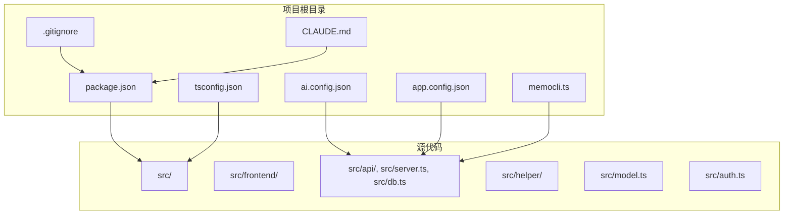
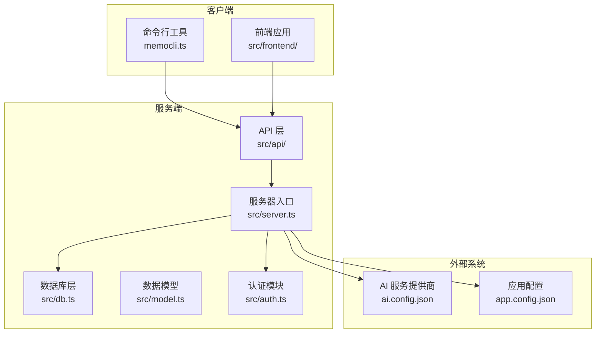
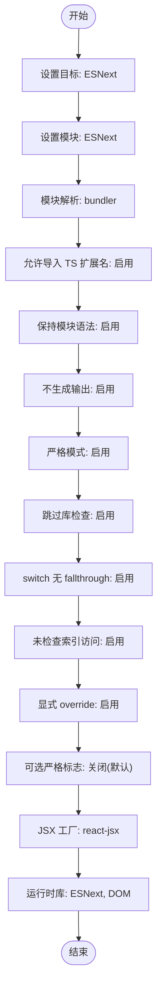
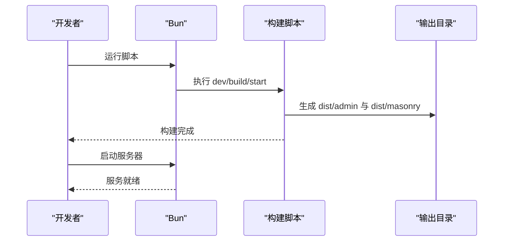
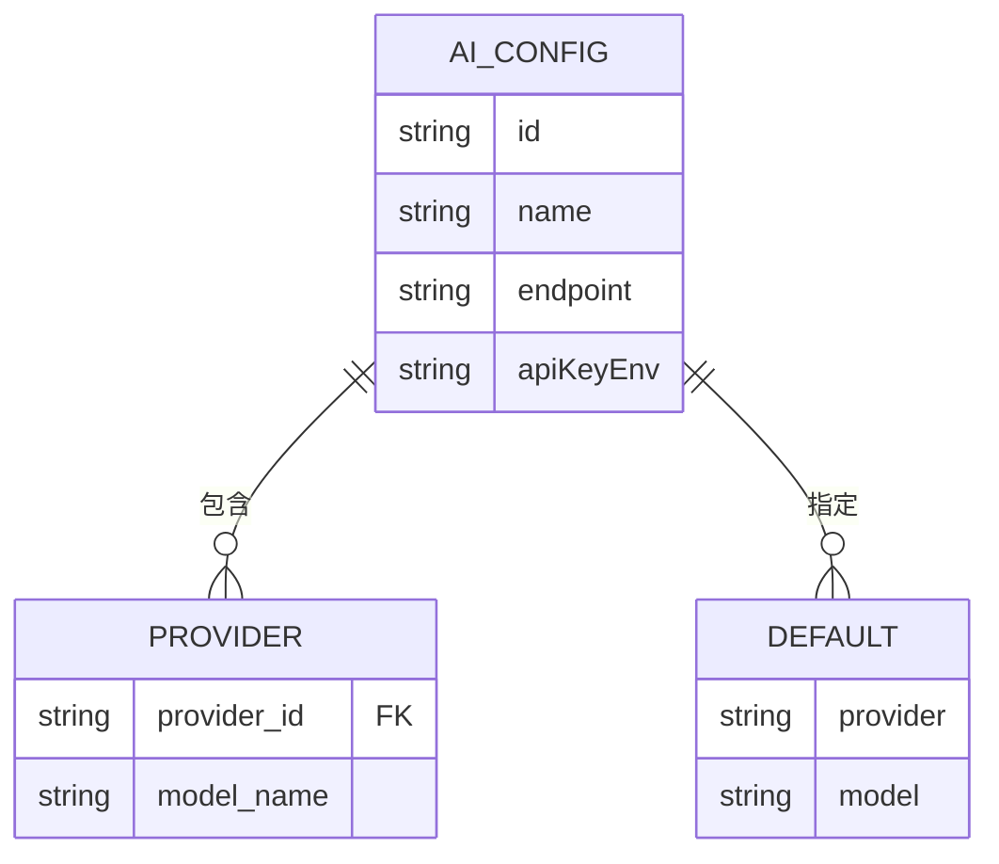
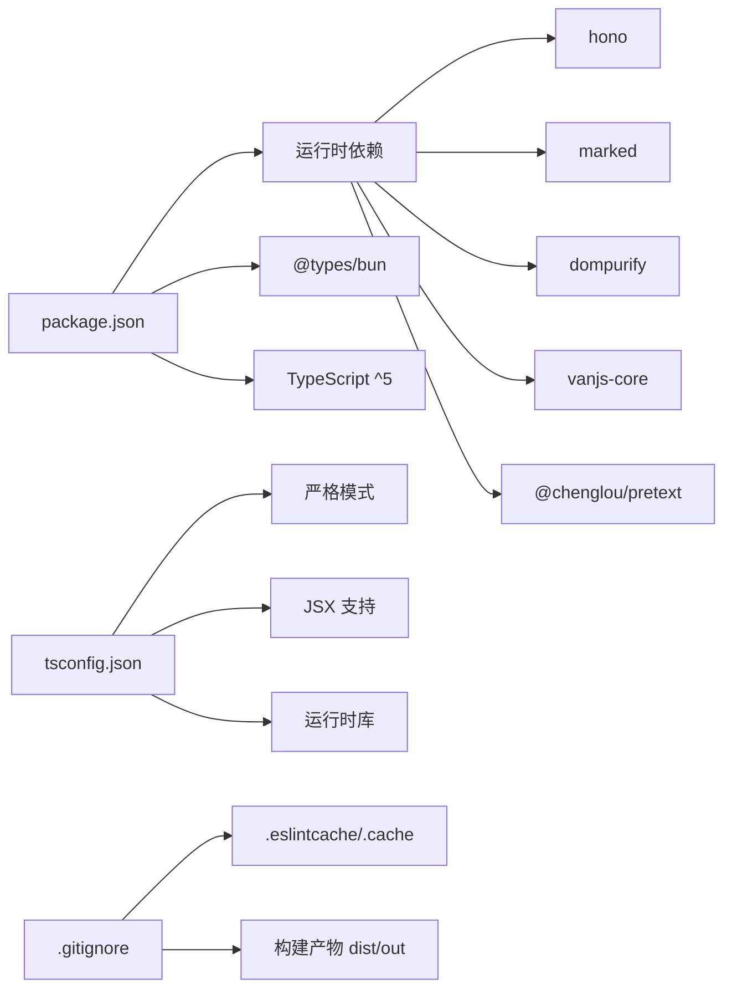

# 代码质量工具配置

<cite>
**本文档引用的文件**
- [package.json](file://package.json)
- [tsconfig.json](file://tsconfig.json)
- [.gitignore](file://.gitignore)
- [ai.config.json](file://ai.config.json)
- [app.config.json](file://app.config.json)
- [CLAUDE.md](file://CLAUDE.md)
- [memocli.ts](file://memocli.ts)
</cite>

## 目录
1. [简介](#简介)
2. [项目结构](#项目结构)
3. [核心组件](#核心组件)
4. [架构概览](#架构概览)
5. [详细组件分析](#详细组件分析)
6. [依赖关系分析](#依赖关系分析)
7. [性能考虑](#性能考虑)
8. [故障排除指南](#故障排除指南)
9. [结论](#结论)

## 简介

本文件为 Memmos 项目的代码质量工具配置文档，重点说明以下方面：
- TypeScript 编译器选项与严格模式配置
- 代码风格与格式化策略
- Git 钩子与提交规范建议
- 代码审查清单与质量门禁标准

需要特别说明的是：当前仓库中未发现专门的 ESLint 或 Prettier 配置文件。因此，本文件基于现有配置文件与项目实践，给出符合项目现状的配置建议与最佳实践。

## 项目结构

Memmos 项目采用 Bun 作为运行时与构建工具，TypeScript 作为主要开发语言。项目结构清晰，前端与后端分离，配置文件集中管理。

**图表来源**
- [package.json:1-26](file://package.json#L1-L26)
- [tsconfig.json:1-30](file://tsconfig.json#L1-L30)
- [.gitignore:1-35](file://.gitignore#L1-L35)
- [ai.config.json:1-44](file://ai.config.json#L1-L44)
- [app.config.json:1-22](file://app.config.json#L1-L22)
- [memocli.ts:1-115](file://memocli.ts#L1-L115)
- [CLAUDE.md:1-68](file://CLAUDE.md#L1-L68)

**章节来源**
- [package.json:1-26](file://package.json#L1-L26)
- [tsconfig.json:1-30](file://tsconfig.json#L1-L30)
- [.gitignore:1-35](file://.gitignore#L1-L35)
- [ai.config.json:1-44](file://ai.config.json#L1-L44)
- [app.config.json:1-22](file://app.config.json#L1-L22)
- [CLAUDE.md:1-68](file://CLAUDE.md#L1-L68)
- [memocli.ts:1-115](file://memocli.ts#L1-L115)

## 核心组件

### TypeScript 编译器配置

- 目标与模块系统
  - 目标: ESNext
  - 模块: ESNext
  - 模块解析: bundler
  - 允许导入 TS 扩展名: 启用
  - 保持模块语法: 启用
  - 不生成输出: 启用

- 严格性与最佳实践
  - 严格模式: 启用
  - 跳过库检查: 启用
  - switch 中无 fallthrough: 启用
  - 未检查索引访问: 启用
  - 显式 override: 启用

- 可选严格标志（默认关闭）
  - 未使用局部变量: 关闭
  - 未使用参数: 关闭
  - 通过索引签名的属性访问: 关闭

- JSX 支持
  - JSX 工厂: react-jsx
  - 允许 JavaScript: 启用

- 运行时库
  - lib: ESNext, DOM

这些配置确保项目在现代浏览器与 Bun 环境下运行，并通过严格模式提升类型安全与代码质量。

**章节来源**
- [tsconfig.json:1-30](file://tsconfig.json#L1-L30)

### 包管理与脚本

- 包管理器: Bun
- 类型: module
- 开发脚本
  - dev: 监听并运行服务器
  - build:masonry: 构建 masonry 前端
  - build:admin: 构建 admin 前端
  - build: 并行执行上述两个构建
  - start: 先构建再启动服务器

- 依赖
  - 运行时: hono, marked, dompurify, vanjs-core, @chenglou/pretext
  - 类型: @types/bun
  - TypeScript 版本要求: ^5

**章节来源**
- [package.json:1-26](file://package.json#L1-L26)

### Git 忽略规则

- 输出目录: dist, out, *.tgz
- 缓存与构建产物: .eslintcache, .cache, *.tsbuildinfo
- 日志与覆盖率: logs, coverage, *.lcov
- 环境变量文件: .env*
- 数据库文件: memos.db*
- IDE 配置: .idea, .DS_Store

**章节来源**
- [.gitignore:1-35](file://.gitignore#L1-L35)

### 配置文件

- AI 配置 (ai.config.json)
  - 提供商列表: deepseek, kimi, glm, dashscope
  - 默认提供商与模型
  - API 密钥环境变量映射

- 应用配置 (app.config.json)
  - AI 请求超时、默认最大令牌数、温度
  - 嵌入相似度阈值
  - 重排序开关与候选/最终数量
  - 速率限制（每小时/每天）

**章节来源**
- [ai.config.json:1-44](file://ai.config.json#L1-L44)
- [app.config.json:1-22](file://app.config.json#L1-L22)

## 架构概览

**图表来源**
- [memocli.ts:1-115](file://memocli.ts#L1-L115)
- [ai.config.json:1-44](file://ai.config.json#L1-L44)
- [app.config.json:1-22](file://app.config.json#L1-L22)

## 详细组件分析

### TypeScript 编译器选项详解

**图表来源**
- [tsconfig.json:1-30](file://tsconfig.json#L1-L30)

**章节来源**
- [tsconfig.json:1-30](file://tsconfig.json#L1-L30)

### 包管理与构建流程

**图表来源**
- [package.json:6-12](file://package.json#L6-L12)

**章节来源**
- [package.json:1-26](file://package.json#L1-L26)

### 配置驱动的 AI 服务集成

**图表来源**
- [ai.config.json:1-44](file://ai.config.json#L1-L44)

**章节来源**
- [ai.config.json:1-44](file://ai.config.json#L1-L44)

## 依赖关系分析

**图表来源**
- [package.json:13-25](file://package.json#L13-L25)
- [tsconfig.json:17-22](file://tsconfig.json#L17-L22)
- [.gitignore:25-28](file://.gitignore#L25-L28)

**章节来源**
- [package.json:1-26](file://package.json#L1-L26)
- [tsconfig.json:1-30](file://tsconfig.json#L1-L30)
- [.gitignore:1-35](file://.gitignore#L1-L35)

## 性能考虑

- 构建性能
  - 使用 Bun 的原生 ESM 构建，避免额外打包开销
  - 并行构建前端模块，缩短等待时间

- 运行时性能
  - 严格模式减少运行时错误，提高稳定性
  - 跳过库检查降低编译时间
  - ESNext 目标充分利用现代运行时特性

- 配置优化
  - 将未使用变量/参数检查设为关闭，平衡严格性与开发效率
  - 保持模块语法，确保 Tree-shaking 效果

## 故障排除指南

- 构建失败
  - 检查 TypeScript 版本是否满足 ^5 要求
  - 确认 tsconfig.json 中的模块解析与 bundler 兼容

- 运行时错误
  - 在严格模式下，确保所有变量初始化与类型推断正确
  - 检查 switch 语句是否遗漏 break

- 环境变量问题
  - memocli.ts 依赖 MEMOS_API_URL 与 MEMOS_SECRET_KEY
  - AI 服务依赖 ai.config.json 中的 API 密钥环境变量

- Git 缓存干扰
  - 清理 .eslintcache 与 .cache 后重试
  - 确保 .gitignore 正确忽略构建产物

**章节来源**
- [memocli.ts:6-115](file://memocli.ts#L6-L115)
- [ai.config.json:1-44](file://ai.config.json#L1-L44)
- [.gitignore:25-28](file://.gitignore#L25-L28)

## 结论

本项目以 Bun 为核心运行时，配合严格的 TypeScript 配置与合理的构建脚本，形成了高效且可靠的开发与运行环境。虽然当前仓库未包含专门的 ESLint 与 Prettier 配置文件，但通过 tsconfig.json 的严格模式与 .gitignore 的缓存清理策略，已具备良好的代码质量基础。建议后续补充 ESLint 与 Prettier 配置，以进一步统一团队代码风格并自动化质量检查。