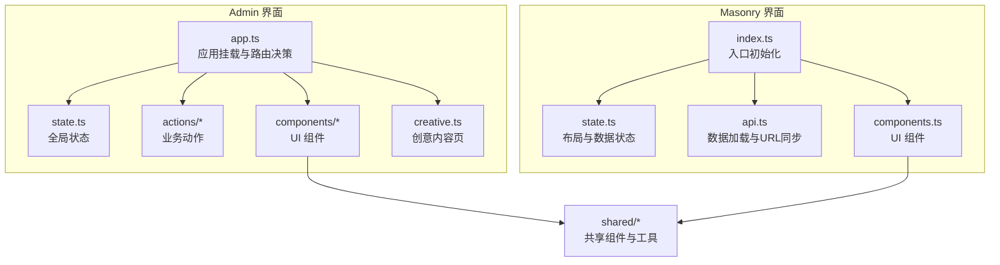
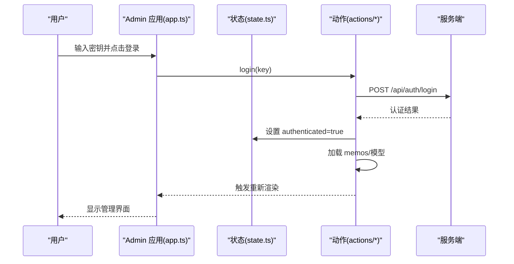
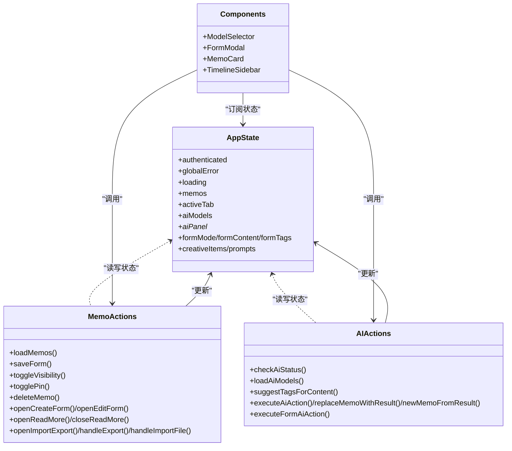
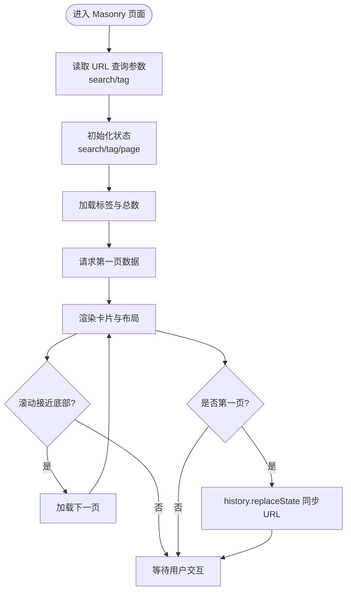
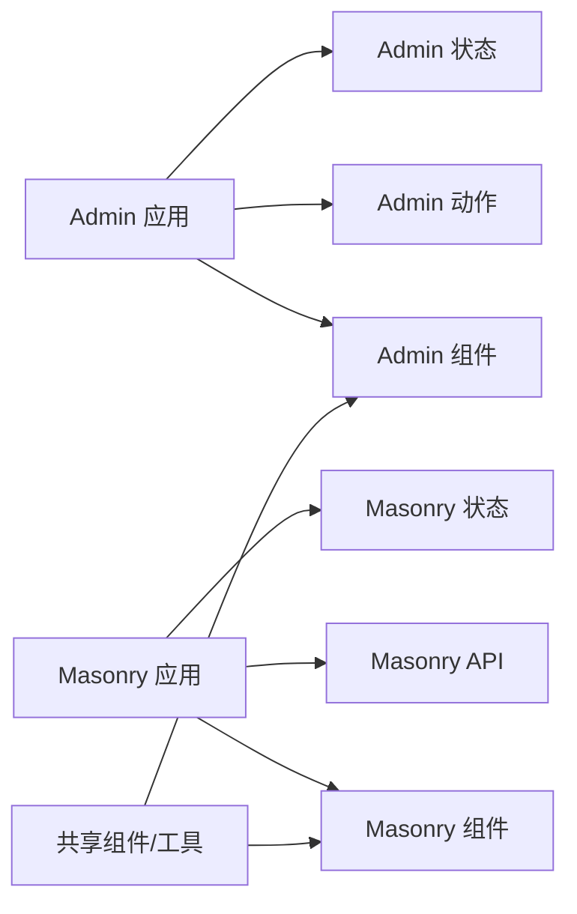

# 前端架构模式

<cite>
**本文引用的文件**
- [src/frontend/admin/app.ts](file://src/frontend/admin/app.ts)
- [src/frontend/admin/state.ts](file://src/frontend/admin/state.ts)
- [src/frontend/admin/actions/memo.ts](file://src/frontend/admin/actions/memo.ts)
- [src/frontend/admin/actions/ai.ts](file://src/frontend/admin/actions/ai.ts)
- [src/frontend/admin/actions/auth.ts](file://src/frontend/admin/actions/auth.ts)
- [src/frontend/admin/components/MemoCard.ts](file://src/frontend/admin/components/MemoCard.ts)
- [src/frontend/admin/components/FormModal.ts](file://src/frontend/admin/components/FormModal.ts)
- [src/frontend/admin/components/ModelSelector.ts](file://src/frontend/admin/components/ModelSelector.ts)
- [src/frontend/admin/components/TimelineSidebar.ts](file://src/frontend/admin/components/TimelineSidebar.ts)
- [src/frontend/admin/creative.ts](file://src/frontend/admin/creative.ts)
- [src/frontend/masonry/index.ts](file://src/frontend/masonry/index.ts)
- [src/frontend/masonry/state.ts](file://src/frontend/masonry/state.ts)
- [src/frontend/masonry/api.ts](file://src/frontend/masonry/api.ts)
- [src/frontend/masonry/components.ts](file://src/frontend/masonry/components.ts)
- [src/frontend/shared/components/ReadMoreModal.ts](file://src/frontend/shared/components/ReadMoreModal.ts)
</cite>

## 目录
1. [引言](#引言)
2. [项目结构](#项目结构)
3. [核心组件](#核心组件)
4. [架构总览](#架构总览)
5. [详细组件分析](#详细组件分析)
6. [依赖关系分析](#依赖关系分析)
7. [性能考虑](#性能考虑)
8. [故障排查指南](#故障排查指南)
9. [结论](#结论)
10. [附录](#附录)

## 引言
本文件系统性梳理 Memmos 的前端架构与设计模式，重点围绕 VanJS 响应式框架的使用方式展开，涵盖状态管理、组件生命周期与事件处理；阐述 Admin 管理界面与 Masonry 展示界面的双界面架构设计及其状态隔离；总结组件化开发规范（属性传递、事件回调、条件渲染、列表渲染）；说明前端路由与 SPA 导航机制（深层链接与页面回退）；并给出性能优化建议（懒加载、内存管理、渲染优化）。

## 项目结构
前端采用“双界面”架构：
- Admin 管理界面：负责认证、内容管理、AI 工具链、时间线等
- Masonry 展示界面：负责卡片瀑布流浏览、搜索、标签筛选、相似内容查找等

两套界面分别拥有独立的状态模块、组件树与入口初始化逻辑，通过共享的工具与样式实现复用。

图表来源
- [src/frontend/admin/app.ts:1-251](file://src/frontend/admin/app.ts#L1-L251)
- [src/frontend/admin/state.ts:1-178](file://src/frontend/admin/state.ts#L1-L178)
- [src/frontend/masonry/index.ts:1-23](file://src/frontend/masonry/index.ts#L1-L23)
- [src/frontend/masonry/state.ts:1-181](file://src/frontend/masonry/state.ts#L1-L181)
- [src/frontend/masonry/api.ts:1-162](file://src/frontend/masonry/api.ts#L1-L162)
- [src/frontend/masonry/components.ts:1-337](file://src/frontend/masonry/components.ts#L1-L337)
- [src/frontend/shared/components/ReadMoreModal.ts:1-71](file://src/frontend/shared/components/ReadMoreModal.ts#L1-L71)

章节来源
- [src/frontend/admin/app.ts:1-251](file://src/frontend/admin/app.ts#L1-L251)
- [src/frontend/masonry/index.ts:1-23](file://src/frontend/masonry/index.ts#L1-L23)

## 核心组件
- Admin 应用根组件：根据认证状态切换登录页或管理页，并挂载到 DOM 节点
- Masonry 应用根组件：初始化搜索/标签参数，加载标签与计数，渲染瀑布流卡片
- 共享模态组件：跨界面复用的“阅读更多”弹窗
- Admin 组件族：表单模态、模型选择器、时间线侧边栏、Memo 卡片等
- Masonry 组件族：过滤栏、卡片容器、相似内容弹窗等

章节来源
- [src/frontend/admin/app.ts:48-232](file://src/frontend/admin/app.ts#L48-L232)
- [src/frontend/masonry/index.ts:6-22](file://src/frontend/masonry/index.ts#L6-L22)
- [src/frontend/shared/components/ReadMoreModal.ts:15-70](file://src/frontend/shared/components/ReadMoreModal.ts#L15-L70)

## 架构总览
- 响应式框架：VanJS 使用状态对象驱动 UI 更新，所有交互通过修改状态触发重渲染
- 双界面设计：Admin 与 Masonry 分别维护独立状态树与组件树，避免相互污染
- 事件与回调：组件内部通过事件处理器修改状态；动作层封装 API 调用与错误处理
- 深层链接：Masonry 在首屏加载时读取 URL 查询参数，并在第一页更新 URL，支持书签与回退

图表来源
- [src/frontend/admin/app.ts:50-77](file://src/frontend/admin/app.ts#L50-L77)
- [src/frontend/admin/actions/auth.ts:27-42](file://src/frontend/admin/actions/auth.ts#L27-L42)
- [src/frontend/admin/actions/memo.ts:30-41](file://src/frontend/admin/actions/memo.ts#L30-L41)

## 详细组件分析

### Admin 管理界面
- 登录页与主页面：根据认证状态动态渲染
- 顶部工具栏：包含模型选择器、新建按钮、导入导出、跳转站点、退出登录
- 时间线侧边栏：按年月分组展示内容，支持折叠与滚动定位
- 表单模态：支持内容编辑、标签增删、AI 工具箱（摘要、改写、扩写、要点提炼、润色）
- Memo 卡片：支持置顶、可见性切换、删除确认、AI 工具箱面板、阅读更多
- 创意内容页：提示词云、聊天/列表视图、生成弹窗、阅读更多弹窗

图表来源
- [src/frontend/admin/state.ts:37-178](file://src/frontend/admin/state.ts#L37-L178)
- [src/frontend/admin/actions/memo.ts:30-231](file://src/frontend/admin/actions/memo.ts#L30-L231)
- [src/frontend/admin/actions/ai.ts:61-237](file://src/frontend/admin/actions/ai.ts#L61-L237)
- [src/frontend/admin/components/ModelSelector.ts:9-65](file://src/frontend/admin/components/ModelSelector.ts#L9-L65)
- [src/frontend/admin/components/FormModal.ts:22-281](file://src/frontend/admin/components/FormModal.ts#L22-L281)
- [src/frontend/admin/components/MemoCard.ts:61-346](file://src/frontend/admin/components/MemoCard.ts#L61-L346)
- [src/frontend/admin/components/TimelineSidebar.ts:107-202](file://src/frontend/admin/components/TimelineSidebar.ts#L107-L202)

章节来源
- [src/frontend/admin/app.ts:48-232](file://src/frontend/admin/app.ts#L48-L232)
- [src/frontend/admin/state.ts:37-178](file://src/frontend/admin/state.ts#L37-L178)
- [src/frontend/admin/actions/memo.ts:30-231](file://src/frontend/admin/actions/memo.ts#L30-L231)
- [src/frontend/admin/actions/ai.ts:61-237](file://src/frontend/admin/actions/ai.ts#L61-L237)
- [src/frontend/admin/components/ModelSelector.ts:9-65](file://src/frontend/admin/components/ModelSelector.ts#L9-L65)
- [src/frontend/admin/components/FormModal.ts:22-281](file://src/frontend/admin/components/FormModal.ts#L22-L281)
- [src/frontend/admin/components/MemoCard.ts:61-346](file://src/frontend/admin/components/MemoCard.ts#L61-L346)
- [src/frontend/admin/components/TimelineSidebar.ts:107-202](file://src/frontend/admin/components/TimelineSidebar.ts#L107-L202)
- [src/frontend/admin/creative.ts:220-354](file://src/frontend/admin/creative.ts#L220-L354)

### Masonry 展示界面
- 初始化：从 URL 读取初始查询参数，设置搜索/标签状态，加载标签与总数，首次拉取数据
- 过滤栏：搜索输入与标签下拉，支持失焦关闭、选项选择触发刷新
- 布局计算：基于窗口宽度与列宽约束计算每列高度，选择最短列插入卡片
- 无限滚动：滚动接近底部自动加载下一页
- 卡片容器：根据布局状态为每个卡片设置绝对定位，支持“阅读更多”、“相似内容”、“复制文本”
- 相似内容弹窗：异步加载相似内容，支持错误与空状态展示
- URL 同步：第一页渲染完成后替换当前 URL，支持书签与浏览器回退

图表来源
- [src/frontend/masonry/index.ts:7-22](file://src/frontend/masonry/index.ts#L7-L22)
- [src/frontend/masonry/api.ts:51-130](file://src/frontend/masonry/api.ts#L51-L130)
- [src/frontend/masonry/state.ts:84-152](file://src/frontend/masonry/state.ts#L84-L152)
- [src/frontend/masonry/components.ts:289-298](file://src/frontend/masonry/components.ts#L289-L298)

章节来源
- [src/frontend/masonry/index.ts:1-23](file://src/frontend/masonry/index.ts#L1-L23)
- [src/frontend/masonry/state.ts:1-181](file://src/frontend/masonry/state.ts#L1-L181)
- [src/frontend/masonry/api.ts:1-162](file://src/frontend/masonry/api.ts#L1-L162)
- [src/frontend/masonry/components.ts:1-337](file://src/frontend/masonry/components.ts#L1-L337)

### 组件化开发规范
- 属性传递：通过 VanJS 状态对象作为属性源，组件内部直接读取状态值
- 事件回调：组件内通过 oninput/onchange/onclick 等事件处理器修改状态，必要时调用动作层函数
- 条件渲染：使用箭头函数返回条件分支，如错误横幅、空状态、加载状态、模态显示
- 列表渲染：使用数组映射生成子项，如时间线分组、标签云、卡片列表
- 共享组件：跨界面复用的弹窗组件通过状态与回调参数进行解耦

章节来源
- [src/frontend/admin/components/FormModal.ts:22-281](file://src/frontend/admin/components/FormModal.ts#L22-L281)
- [src/frontend/admin/components/MemoCard.ts:61-346](file://src/frontend/admin/components/MemoCard.ts#L61-L346)
- [src/frontend/admin/components/TimelineSidebar.ts:107-202](file://src/frontend/admin/components/TimelineSidebar.ts#L107-L202)
- [src/frontend/masonry/components.ts:123-219](file://src/frontend/masonry/components.ts#L123-L219)
- [src/frontend/shared/components/ReadMoreModal.ts:15-70](file://src/frontend/shared/components/ReadMoreModal.ts#L15-L70)

### 前端路由与 SPA 导航机制
- Admin：通过状态切换渲染登录页或管理页，不涉及浏览器历史栈变更
- Masonry：通过 URL 查询参数实现深层链接；第一页渲染后使用 history.replaceState 同步 URL，支持浏览器回退

章节来源
- [src/frontend/admin/app.ts:226-232](file://src/frontend/admin/app.ts#L226-L232)
- [src/frontend/masonry/api.ts:111-120](file://src/frontend/masonry/api.ts#L111-L120)

## 依赖关系分析
- Admin 与 Masonry 界面之间通过共享的工具与样式进行弱耦合复用（如 Markdown 渲染、剪贴板、SVG 图标）
- Admin 内部组件依赖状态与动作层；动作层封装 API 调用与错误处理
- Masonry 内部组件依赖状态与 API 层；API 层负责网络请求与 URL 同步

图表来源
- [src/frontend/admin/app.ts:1-44](file://src/frontend/admin/app.ts#L1-L44)
- [src/frontend/masonry/index.ts:1-6](file://src/frontend/masonry/index.ts#L1-L6)
- [src/frontend/shared/components/ReadMoreModal.ts:1-71](file://src/frontend/shared/components/ReadMoreModal.ts#L1-L71)

章节来源
- [src/frontend/admin/app.ts:1-44](file://src/frontend/admin/app.ts#L1-L44)
- [src/frontend/masonry/index.ts:1-6](file://src/frontend/masonry/index.ts#L1-L6)
- [src/frontend/shared/components/ReadMoreModal.ts:1-71](file://src/frontend/shared/components/ReadMoreModal.ts#L1-L71)

## 性能考虑
- 渲染优化
  - 使用状态驱动的条件渲染与列表渲染，避免不必要的 DOM 重建
  - Masonry 使用布局缓存与窗口宽度状态，减少重复计算
- 数据加载
  - Masonry 首屏仅加载一次，后续通过无限滚动增量加载
  - Admin 使用防抖搜索（在 Masonry 中体现为搜索防抖），降低请求频率
- 内存管理
  - Masonry 提供卡片复制状态清理，避免长期持有引用
  - Admin 的 AI 工具箱面板在关闭时清空结果与错误，释放临时状态
- 懒加载
  - Masonry 在滚动接近底部时才加载下一页，减少初始负载
  - Admin 的创意内容页在首次渲染时再加载提示词与标签，避免阻塞主流程

章节来源
- [src/frontend/masonry/state.ts:140-152](file://src/frontend/masonry/state.ts#L140-L152)
- [src/frontend/masonry/api.ts:135-140](file://src/frontend/masonry/api.ts#L135-L140)
- [src/frontend/masonry/components.ts:289-298](file://src/frontend/masonry/components.ts#L289-L298)
- [src/frontend/admin/actions/ai.ts:168-172](file://src/frontend/admin/actions/ai.ts#L168-L172)
- [src/frontend/masonry/components.ts:187-195](file://src/frontend/masonry/components.ts#L187-L195)

## 故障排查指南
- 认证失败
  - 现象：登录页显示错误信息
  - 排查：检查登录动作与全局错误状态，确认服务端接口返回
- 加载错误
  - 现象：管理页或展示页出现错误横幅
  - 排查：查看对应状态中的错误字段，确认网络请求与权限
- AI 工具箱不可用
  - 现象：AI 模型为空或工具箱按钮不可用
  - 排查：检查 AI 状态初始化与模型加载动作，确认本地存储与默认模型恢复
- Masonry 无法翻页
  - 现象：滚动到底部无新内容
  - 排查：检查 hasMore 与 page 状态，确认网络请求与 URL 同步逻辑

章节来源
- [src/frontend/admin/actions/auth.ts:12-25](file://src/frontend/admin/actions/auth.ts#L12-L25)
- [src/frontend/admin/actions/memo.ts:36-40](file://src/frontend/admin/actions/memo.ts#L36-L40)
- [src/frontend/admin/actions/ai.ts:61-103](file://src/frontend/admin/actions/ai.ts#L61-L103)
- [src/frontend/masonry/api.ts:111-130](file://src/frontend/masonry/api.ts#L111-L130)

## 结论
Memmos 前端以 VanJS 为核心，构建了清晰的双界面架构：Admin 注重内容管理与 AI 工具链，Masonry 注重浏览体验与可发现性。通过状态驱动的组件化模式、严格的动作层封装与共享组件复用，实现了高内聚低耦合的前端体系。配合 URL 同步与懒加载策略，兼顾了可用性与性能。

## 附录
- 关键状态与动作概览
  - Admin：认证状态、全局错误、加载状态、Memo 列表、表单状态、AI 工具箱状态、创意内容状态
  - Masonry：卡片列表、搜索/标签、分页与加载状态、布局状态、相似内容状态、模态状态

章节来源
- [src/frontend/admin/state.ts:37-178](file://src/frontend/admin/state.ts#L37-L178)
- [src/frontend/masonry/state.ts:42-59](file://src/frontend/masonry/state.ts#L42-L59)