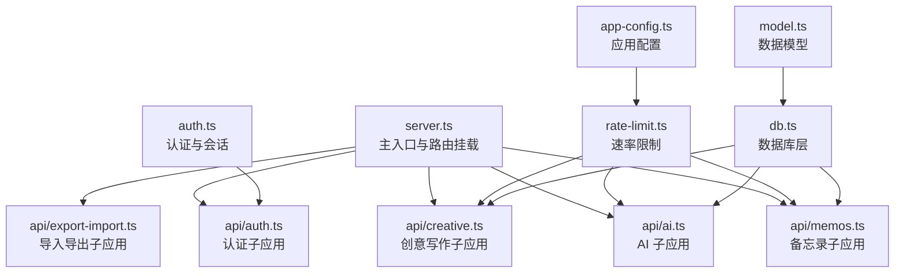
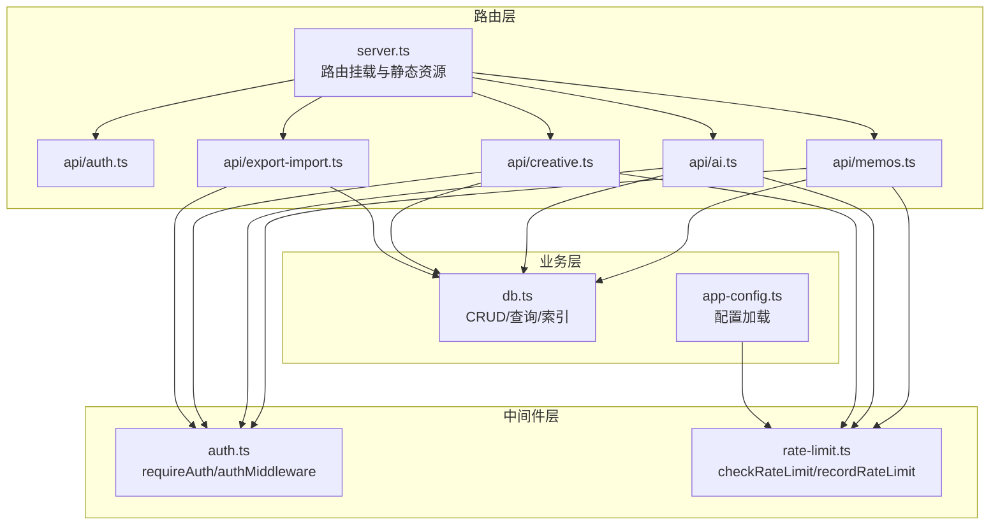
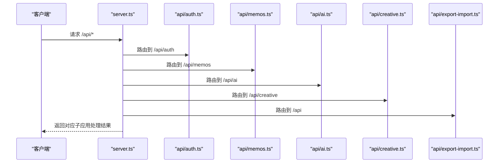
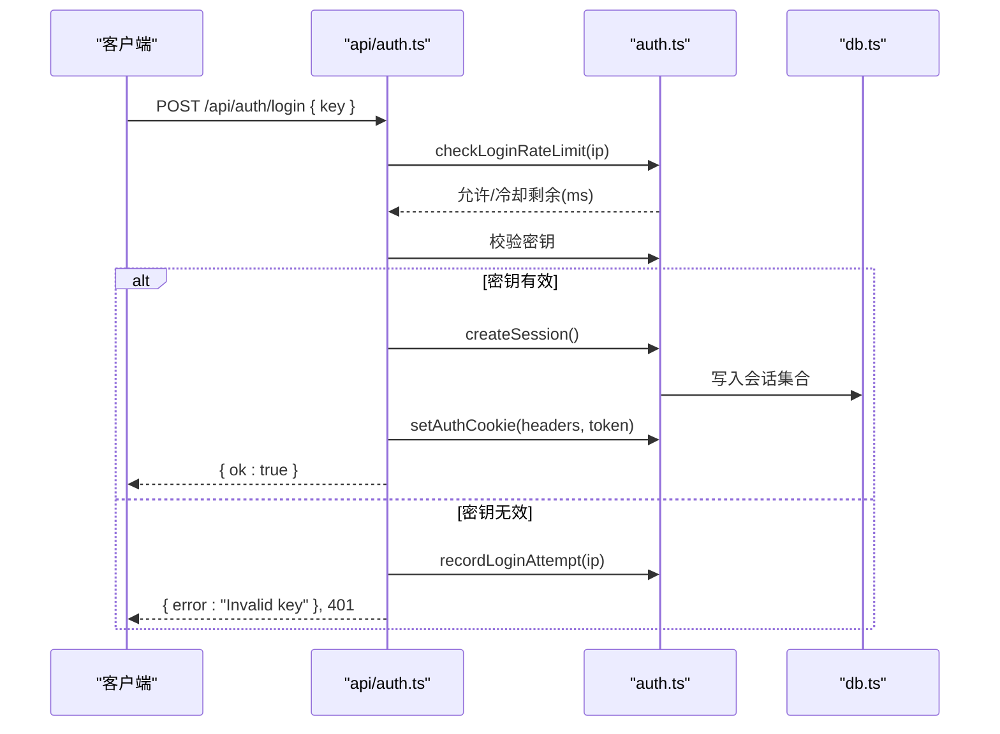
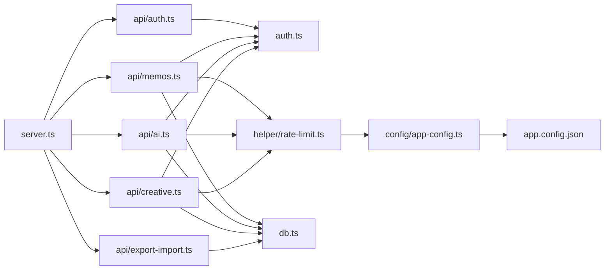

# 后端API设计规范

<cite>
**本文档引用的文件**
- [server.ts](file://src/server.ts)
- [auth.ts](file://src/auth.ts)
- [rate-limit.ts](file://src/helper/rate-limit.ts)
- [db.ts](file://src/db.ts)
- [memos.ts](file://src/api/memos.ts)
- [auth.ts](file://src/api/auth.ts)
- [ai.ts](file://src/api/ai.ts)
- [creative.ts](file://src/api/creative.ts)
- [export-import.ts](file://src/api/export-import.ts)
- [app-config.ts](file://src/config/app-config.ts)
- [app.config.json](file://app.config.json)
- [model.ts](file://src/model.ts)
- [package.json](file://package.json)
- [README.md](file://README.md)
</cite>

## 目录
1. [简介](#简介)
2. [项目结构](#项目结构)
3. [核心组件](#核心组件)
4. [架构总览](#架构总览)
5. [详细组件分析](#详细组件分析)
6. [依赖关系分析](#依赖关系分析)
7. [性能考虑](#性能考虑)
8. [故障排查指南](#故障排查指南)
9. [结论](#结论)
10. [附录](#附录)

## 简介
本规范面向 Memos 后端 API 的设计与实现，围绕 Hono 框架的路由组织、中间件使用、错误处理机制进行系统化梳理；同时给出 API 端点设计规范（RESTful 资源命名、HTTP 方法、状态码、请求响应格式）、认证授权机制（JWT/密钥、权限中间件、会话管理）、API 版本控制策略与向后兼容性保障、以及 API 测试与调试工具使用指南。目标是帮助开发者快速理解并遵循统一的设计与实现标准，提升可维护性与一致性。

## 项目结构
项目采用“入口文件 + 子应用 + 数据层 + 配置”的分层组织方式：
- 入口文件负责路由挂载与静态资源服务
- 子应用按功能域划分（认证、备忘录、AI、创意写作、导入导出）
- 数据层封装 SQLite 访问与模型映射
- 配置模块提供运行时参数加载与默认值回退

图表来源
- [server.ts:38-45](file://src/server.ts#L38-L45)
- [auth.ts:1-128](file://src/auth.ts#L1-L128)
- [rate-limit.ts:1-153](file://src/helper/rate-limit.ts#L1-L153)
- [db.ts:1-484](file://src/db.ts#L1-L484)
- [memos.ts:1-220](file://src/api/memos.ts#L1-L220)
- [ai.ts:1-326](file://src/api/ai.ts#L1-L326)
- [creative.ts:1-383](file://src/api/creative.ts#L1-L383)
- [export-import.ts:1-288](file://src/api/export-import.ts#L1-L288)
- [app-config.ts:1-108](file://src/config/app-config.ts#L1-L108)
- [model.ts:1-35](file://src/model.ts#L1-L35)

章节来源
- [server.ts:1-137](file://src/server.ts#L1-L137)
- [package.json:1-26](file://package.json#L1-L26)

## 核心组件
- Hono 子应用挂载：主入口集中挂载各子应用，形成清晰的功能边界与路由前缀隔离
- 认证与会话：支持 Cookie 会话与 Bearer Token 两种认证方式，统一中间件校验
- 速率限制：基于 IP 的两级窗口（小时/天）限流，支持 memo 与 AI 两类
- 数据层：SQLite WAL 模式，提供 CRUD、索引与 JSON 辅助查询
- 配置系统：app.config.json 与环境变量优先级，提供 AI、嵌入、重排序与速率限制等参数

章节来源
- [server.ts:38-45](file://src/server.ts#L38-L45)
- [auth.ts:109-128](file://src/auth.ts#L109-L128)
- [rate-limit.ts:77-153](file://src/helper/rate-limit.ts#L77-L153)
- [db.ts:15-61](file://src/db.ts#L15-L61)
- [app-config.ts:57-107](file://src/config/app-config.ts#L57-L107)

## 架构总览
整体架构以 Hono 为核心，通过子应用实现功能解耦，配合认证中间件与速率限制中间件，形成“路由层 → 中间件层 → 业务层 → 数据层”的清晰分层。

图表来源
- [server.ts:38-45](file://src/server.ts#L38-L45)
- [auth.ts:109-128](file://src/auth.ts#L109-L128)
- [rate-limit.ts:77-153](file://src/helper/rate-limit.ts#L77-L153)
- [db.ts:122-249](file://src/db.ts#L122-L249)
- [app-config.ts:103-107](file://src/config/app-config.ts#L103-L107)

## 详细组件分析

### 路由组织与子应用挂载
- 主入口集中挂载认证、备忘录、AI、创意写作、导入导出五个子应用，分别对应 /api/auth、/api/memos、/api/ai、/api/creative、/api
- 静态资源与 SPA 路由：favicon、前端构建产物、首页与管理后台 SPA
- 未匹配路由：非 /admin 前缀返回 JSON 错误，/admin 前缀返回 SPA HTML

图表来源
- [server.ts:40-45](file://src/server.ts#L40-L45)

章节来源
- [server.ts:38-119](file://src/server.ts#L38-L119)

### 中间件使用规范
- 认证中间件：requireAuth 支持 Cookie 会话与 Bearer Token；authMiddleware 在未通过时直接返回 401
- 速率限制中间件：checkRateLimit 与 recordRateLimit 组合，支持 memo 与 ai 两类；错误格式化函数统一返回人类可读消息
- 使用建议：
  - 对需要认证的端点统一使用 authMiddleware
  - 对写操作（创建/更新/删除）与高成本操作（AI/嵌入）统一加入速率限制
  - 在中间件之后再进行业务参数校验，避免重复校验

章节来源
- [auth.ts:109-128](file://src/auth.ts#L109-L128)
- [rate-limit.ts:77-153](file://src/helper/rate-limit.ts#L77-L153)
- [memos.ts:104-144](file://src/api/memos.ts#L104-L144)
- [ai.ts:33-72](file://src/api/ai.ts#L33-L72)
- [creative.ts:200-338](file://src/api/creative.ts#L200-L338)

### 错误处理机制
- 统一错误响应格式：JSON 对象包含 error 字段与状态码
- 认证失败：401 Unauthorized
- 参数无效：400 Bad Request
- 资源不存在：404 Not Found
- 速率限制触发：429 Too Many Requests，携带可读错误消息
- 服务不可用：503 Service Unavailable（如 AI 未配置）
- 未找到：404（notFound 回退）

章节来源
- [auth.ts:115-118](file://src/auth.ts#L115-L118)
- [memos.ts:109,117,177,193,212](file://src/api/memos.ts#L109,L117,L177,L193,L212)
- [ai.ts:44-48,56-58,91-93,172-174,226-228](file://src/api/ai.ts#L44-L48,L56-L58,L91-L93,L172-L174,L226-L228)
- [creative.ts:136-154,159-161,216-235,239-241,404-406](file://src/api/creative.ts#L136-L154,L159-L161,L216-L235,L239-L241,L404-L406)
- [server.ts:113-119](file://src/server.ts#L113-L119)

### API 端点设计规范

#### RESTful 资源命名与 HTTP 方法
- 备忘录资源：/api/memos（GET/POST/PUT/DELETE），支持 /api/memos/:id/pin
- 标签资源：/api/memos/tags（GET）
- 计数资源：/api/memos/count（GET）
- AI 资源：/api/ai/status（GET）、/api/ai/models（GET）、/api/ai/optimize（POST）、/api/ai/suggest-tags（POST）、/api/ai/action（POST）、/api/ai/chat（POST，SSE）
- 创意写作资源：/api/creative/prompts（GET/POST/PUT/DELETE）、/api/creative（GET/POST/DELETE）、/api/creative/preview-context（POST）、/api/creative/generate（POST，SSE）
- 导入导出资源：/api/export（GET）、/api/import（POST）

章节来源
- [memos.ts:28-220](file://src/api/memos.ts#L28-L220)
- [ai.ts:23-326](file://src/api/ai.ts#L23-L326)
- [creative.ts:34-383](file://src/api/creative.ts#L34-L383)
- [export-import.ts:165-287](file://src/api/export-import.ts#L165-L287)

#### 查询参数与分页
- 备忘录列表支持 search、tag、page、limit、all 参数；当 all=true 且已认证时返回私有内容
- 标签列表与计数接口不涉及分页
- 创意写作预览上下文支持 tag 与手动 memo_ids 两种模式

章节来源
- [memos.ts:29-70](file://src/api/memos.ts#L29-L70)
- [memos.ts:97-101](file://src/api/memos.ts#L97-L101)
- [memos.ts:72-77](file://src/api/memos.ts#L72-L77)
- [creative.ts:122-198](file://src/api/creative.ts#L122-L198)

#### 状态码返回
- 成功：200 OK；创建：201 Created；删除：200 OK 并返回 { ok: true }
- 认证失败：401 Unauthorized
- 参数错误：400 Bad Request
- 资源不存在：404 Not Found
- 速率限制：429 Too Many Requests
- 服务不可用：503 Service Unavailable

章节来源
- [memos.ts:143,186,198,218](file://src/api/memos.ts#L143,L186,L198,L218)
- [ai.ts:71,111,195,324](file://src/api/ai.ts#L71,L111,L195,L324)
- [creative.ts:67,97,171,194,314,372](file://src/api/creative.ts#L67,L97,L171,L194,L314,L372)
- [export-import.ts:180,286](file://src/api/export-import.ts#L180,L286)

#### 请求与响应格式
- 请求体：JSON；SSE 流式响应用于 AI 聊天与创意生成
- 响应体：统一 JSON 对象，成功时包含具体资源字段（如 memo、memos、tags、count、prompt、items、ok 等），错误时包含 error 字段
- SSE 帧：包含 type 与 payload（content/error/done 等）

章节来源
- [memos.ts:105,149,176,204,211](file://src/api/memos.ts#L105,L149,L176,L204,L211)
- [ai.ts:35,75,127,212,284](file://src/api/ai.ts#L35,L75,L127,L212,L284)
- [creative.ts:202,211,290,309](file://src/api/creative.ts#L202,L211,L290,L309)
- [export-import.ts:166,209,280](file://src/api/export-import.ts#L166,L209,L280)

### 认证授权机制
- 会话认证：Cookie 名称为 memos_token，HttpOnly + SameSite=Strict + Path=/，有效期 24 小时
- Bearer Token：通过 Authorization: Bearer <密钥> 方式，密钥来源于环境变量 MEMOS_SECRET_KEY
- 登录流程：校验密钥，记录登录尝试，成功后设置 Cookie 并返回 { ok: true }
- 登出流程：销毁会话并清除 Cookie
- 登录频率限制：同一 IP 最多 5 次尝试，1 分钟冷却

图表来源
- [auth.ts:14-27](file://src/auth.ts#L14-L27)
- [auth.ts:58-70](file://src/auth.ts#L58-L70)
- [auth.ts:81-107](file://src/auth.ts#L81-L107)
- [auth.ts:109-128](file://src/auth.ts#L109-L128)
- [auth.ts:33-46](file://src/auth.ts#L33-L46)
- [auth.ts:48-56](file://src/auth.ts#L48-L56)
- [auth.ts:65-70](file://src/auth.ts#L65-L70)

章节来源
- [auth.ts:1-128](file://src/auth.ts#L1-L128)
- [auth.ts:14-27](file://src/auth.ts#L14-L27)
- [auth.ts:58-70](file://src/auth.ts#L58-L70)
- [auth.ts:81-107](file://src/auth.ts#L81-L107)
- [auth.ts:109-128](file://src/auth.ts#L109-L128)

### API 版本控制策略与向后兼容性
- 当前未实现显式的 API 版本号（如 v1），所有端点均以 /api 前缀暴露
- 向后兼容性保障策略：
  - 新增端点时保持现有端点语义不变
  - 扩展字段时保持必填字段不变，新增可选字段
  - 错误码与响应结构保持稳定
  - 未来建议引入版本前缀（如 /api/v1/...），并在变更时提供迁移指引与兼容层

章节来源
- [server.ts:40-45](file://src/server.ts#L40-L45)
- [README.md:100-111](file://README.md#L100-L111)

### API 测试规范与调试工具
- 单元测试建议：
  - 路由与中间件：验证 authMiddleware 对 401 的拦截、requireAuth 的两种认证方式
  - 速率限制：覆盖小时/天窗口、冷却时间、错误消息格式
  - 数据层：CRUD 与查询条件组合（LIKE、IN、JSON EACH）
- 集成测试建议：
  - 完整流程：登录 → 创建/更新/删除备忘录 → 搜索/标签筛选 → AI 操作 → 导入导出
  - SSE 流：验证 content/done/error 帧顺序与内容
- 调试工具：
  - curl：用于快速验证端点行为与响应格式
  - 浏览器开发者工具：观察 Cookie、SSE 流、网络面板
  - 日志：关注速率限制与登录尝试记录

章节来源
- [README.md:130-176](file://README.md#L130-L176)
- [rate-limit.ts:77-153](file://src/helper/rate-limit.ts#L77-L153)
- [db.ts:122-249](file://src/db.ts#L122-L249)

## 依赖关系分析

图表来源
- [server.ts:38-45](file://src/server.ts#L38-L45)
- [auth.ts:1-128](file://src/auth.ts#L1-L128)
- [rate-limit.ts:1-153](file://src/helper/rate-limit.ts#L1-L153)
- [db.ts:1-484](file://src/db.ts#L1-L484)
- [app-config.ts:1-108](file://src/config/app-config.ts#L1-L108)
- [app.config.json:1-22](file://app.config.json#L1-L22)

章节来源
- [server.ts:1-137](file://src/server.ts#L1-L137)
- [auth.ts:1-128](file://src/auth.ts#L1-L128)
- [rate-limit.ts:1-153](file://src/helper/rate-limit.ts#L1-L153)
- [db.ts:1-484](file://src/db.ts#L1-L484)
- [app-config.ts:1-108](file://src/config/app-config.ts#L1-L108)
- [app.config.json:1-22](file://app.config.json#L1-L22)

## 性能考虑
- 数据库优化：
  - WAL 模式提升并发写入性能
  - 为 pinned_at 建立索引，优化置顶排序
  - 使用 JSON EACH 查询标签，支持逗号分隔多标签
- 分页与上下文：
  - 备忘录列表分页避免一次性返回大量数据
  - 创意写作上下文限制数量（MAX_TAG_CONTEXT、MAX_TAG_PREVIEW），防止 token 溢出
- SSE 流式输出：
  - AI 聊天与创意生成采用流式响应，降低单次响应体积
- 速率限制：
  - 两级窗口（小时/天）平衡用户体验与资源保护

章节来源
- [db.ts:19-61](file://src/db.ts#L19-L61)
- [db.ts:122-169](file://src/db.ts#L122-L169)
- [creative.ts:29-32](file://src/api/creative.ts#L29-L32)
- [ai.ts:198-325](file://src/api/ai.ts#L198-L325)
- [rate-limit.ts:77-153](file://src/helper/rate-limit.ts#L77-L153)

## 故障排查指南
- 认证问题：
  - 检查 Cookie 是否正确设置（名称、HttpOnly、SameSite、Path、Max-Age）
  - 确认 MEMOS_SECRET_KEY 是否正确配置
  - 观察登录尝试次数与冷却时间
- 速率限制：
  - 查看错误消息中的 retryAfterMs 与类别（memo/ai）
  - 检查 X-Forwarded-For/X-Real-IP 是否正确传递
- 数据库问题：
  - 确认 memos.db 是否存在且可写
  - 检查表结构与索引是否创建成功
- SSE 流异常：
  - 确保 Content-Type 为 text/event-stream，Cache-Control 为 no-cache
  - 检查流式生成器是否抛出异常并正确发送 error 帧

章节来源
- [auth.ts:58-70](file://src/auth.ts#L58-L70)
- [auth.ts:81-107](file://src/auth.ts#L81-L107)
- [rate-limit.ts:67-153](file://src/helper/rate-limit.ts#L67-L153)
- [db.ts:15-61](file://src/db.ts#L15-L61)
- [ai.ts:318-325](file://src/api/ai.ts#L318-L325)

## 结论
本规范总结了 Memos 后端 API 的设计与实现要点：以 Hono 子应用实现功能解耦，通过认证与速率限制中间件统一安全控制，采用 SQLite 提供高效的数据持久化，并通过配置模块实现灵活的运行时参数管理。建议在后续演进中引入明确的 API 版本控制与更完善的测试体系，持续提升系统的稳定性与可维护性。

## 附录
- 端点一览（按功能域）
  - 认证：/api/auth/check、/api/auth/login、/api/auth/logout
  - 备忘录：/api/memos、/api/memos/tags、/api/memos/count、/api/memos/:id/pin
  - AI：/api/ai/status、/api/ai/models、/api/ai/optimize、/api/ai/suggest-tags、/api/ai/action、/api/ai/chat
  - 创意写作：/api/creative/prompts、/api/creative、/api/creative/preview-context、/api/creative/generate
  - 导入导出：/api/export、/api/import

章节来源
- [auth.ts:31-76](file://src/api/auth.ts#L31-L76)
- [memos.ts:28-220](file://src/api/memos.ts#L28-L220)
- [ai.ts:23-326](file://src/api/ai.ts#L23-L326)
- [creative.ts:34-383](file://src/api/creative.ts#L34-L383)
- [export-import.ts:165-287](file://src/api/export-import.ts#L165-L287)