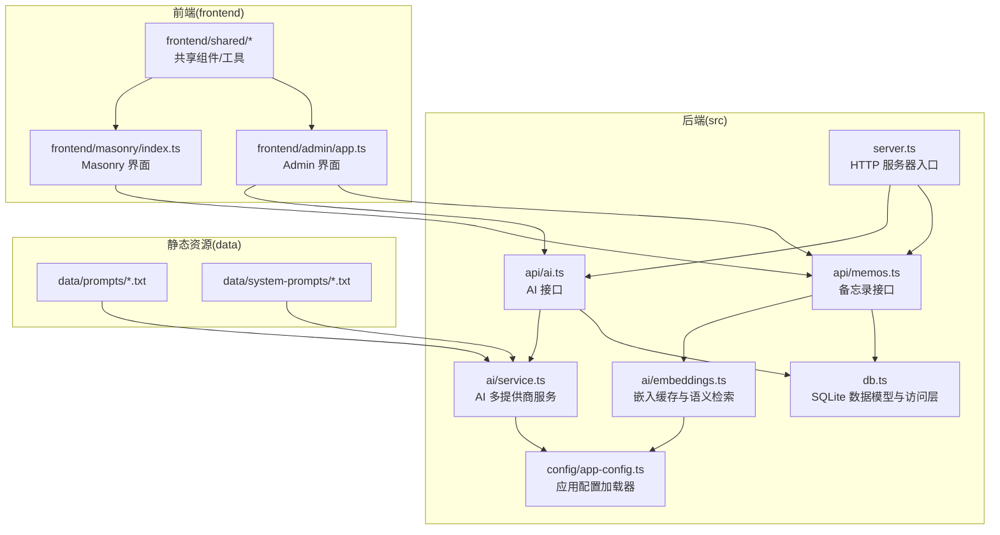
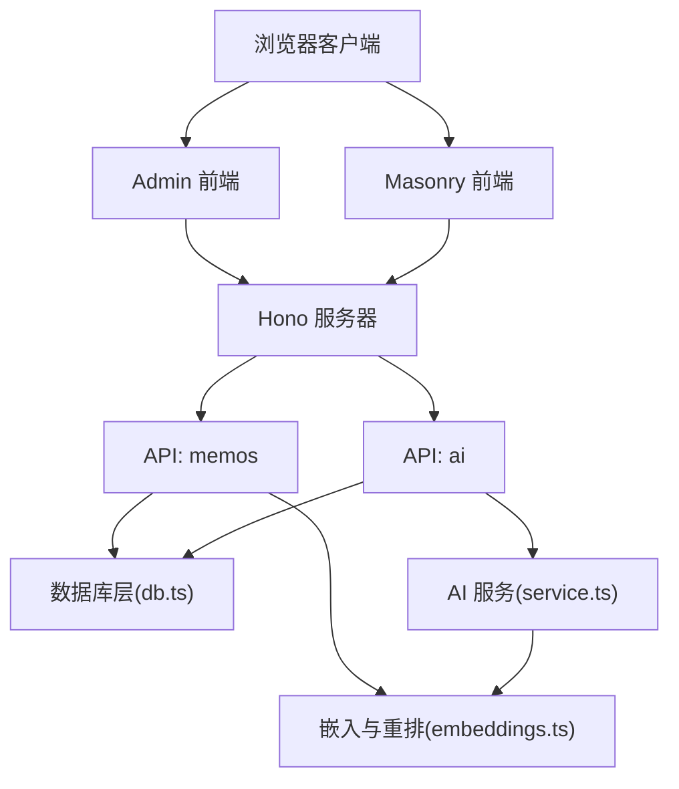
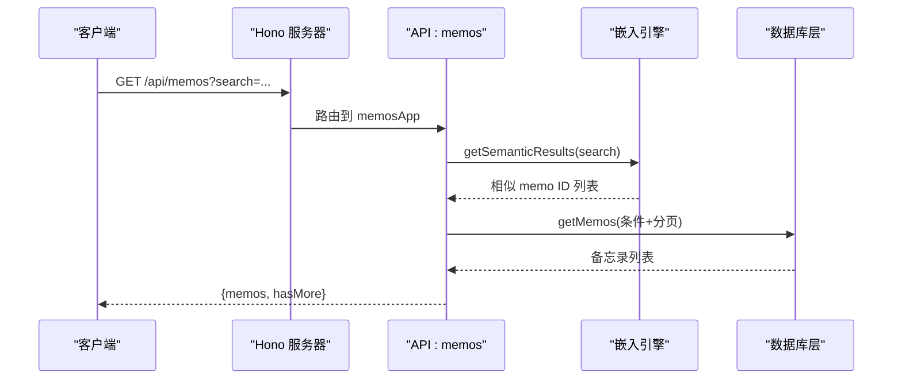
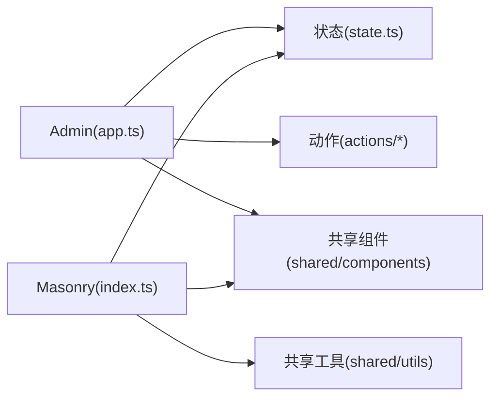
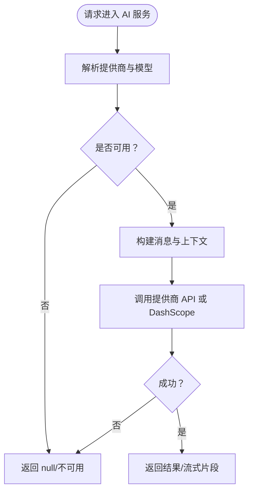
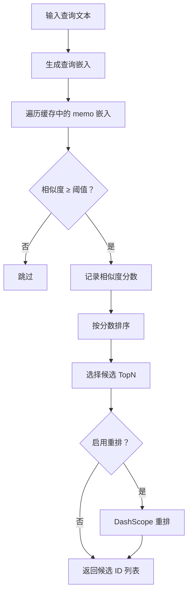
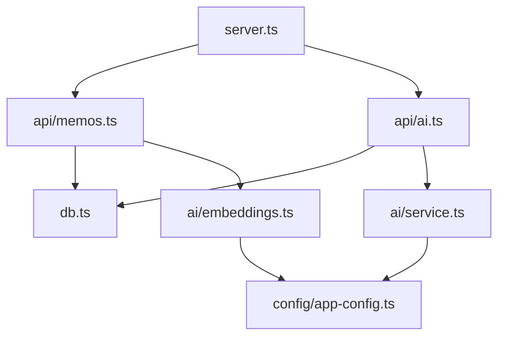

# 目录结构组织

<cite>
**本文引用的文件**
- [app.config.json](file://app.config.json)
- [ai.config.json](file://ai.config.json)
- [src/config/app-config.ts](file://src/config/app-config.ts)
- [src/server.ts](file://src/server.ts)
- [src/db.ts](file://src/db.ts)
- [src/api/memos.ts](file://src/api/memos.ts)
- [src/api/ai.ts](file://src/api/ai.ts)
- [src/ai/service.ts](file://src/ai/service.ts)
- [src/ai/embeddings.ts](file://src/ai/embeddings.ts)
- [src/frontend/admin/app.ts](file://src/frontend/admin/app.ts)
- [src/frontend/masonry/index.ts](file://src/frontend/masonry/index.ts)
- [src/frontend/shared/utils/text.ts](file://src/frontend/shared/utils/text.ts)
- [src/helper/util.ts](file://src/helper/util.ts)
- [package.json](file://package.json)
</cite>

## 目录索引
1. [简介](#简介)
2. [项目结构](#项目结构)
3. [核心组件](#核心组件)
4. [架构总览](#架构总览)
5. [详细组件分析](#详细组件分析)
6. [依赖关系分析](#依赖关系分析)
7. [性能考量](#性能考量)
8. [故障排查指南](#故障排查指南)
9. [结论](#结论)
10. [附录](#附录)

## 简介
本文件系统性梳理 Memos 项目的目录结构组织原则，重点说明 src 目录下各子目录的职责分工与组织逻辑，涵盖：
- api 目录的模块化路由设计与接口边界
- frontend 目录的双界面架构（Admin 与 Masonry）
- ai 目录的 AI 服务抽象与多提供商适配
- helper 目录的工具函数集合
- 配置文件的组织方式（app.config.json 与 ai.config.json）
- 静态资源的存放规范（数据文件、系统提示词、样式文件）
- 目录命名约定与文件组织最佳实践

## 项目结构
项目采用“按功能域分层 + 按职责分包”的组织方式，核心目录如下：
- src：后端与前端源代码
  - api：HTTP 接口模块化路由
  - ai：AI 服务抽象与嵌入检索
  - frontend：双界面前端应用
  - helper：通用工具函数
  - config：应用配置加载器
  - db.ts：SQLite 数据模型与访问层
  - server.ts：HTTP 服务器入口与静态页面路由
- data：静态数据与系统提示词
- docs：文档与设计说明
- 根目录配置：app.config.json、ai.config.json、package.json 等

图表来源
- [src/server.ts:1-137](file://src/server.ts#L1-L137)
- [src/api/memos.ts:1-220](file://src/api/memos.ts#L1-L220)
- [src/api/ai.ts:1-326](file://src/api/ai.ts#L1-L326)
- [src/ai/service.ts:1-507](file://src/ai/service.ts#L1-L507)
- [src/ai/embeddings.ts:1-228](file://src/ai/embeddings.ts#L1-L228)
- [src/db.ts:1-484](file://src/db.ts#L1-L484)
- [src/config/app-config.ts:1-108](file://src/config/app-config.ts#L1-L108)
- [src/frontend/admin/app.ts:1-251](file://src/frontend/admin/app.ts#L1-L251)
- [src/frontend/masonry/index.ts:1-23](file://src/frontend/masonry/index.ts#L1-L23)

章节来源
- [src/server.ts:1-137](file://src/server.ts#L1-L137)
- [src/db.ts:1-484](file://src/db.ts#L1-L484)

## 核心组件
- 应用配置加载器（src/config/app-config.ts）
  - 从 app.config.json 加载配置，带内存缓存与硬编码回退值
  - 提供统一的类型定义与默认值，保证运行时健壮性
- HTTP 服务器入口（src/server.ts）
  - 使用 Hono 框架，模块化挂载 API 子路由
  - 提供静态页面路由与 SPA 回退处理
  - 初始化数据库、种子数据与嵌入缓存
- 数据访问层（src/db.ts）
  - 定义 memos、memo_embeddings、prompts、creative 表结构
  - 提供 CRUD、搜索、标签聚合、导入导出等方法
- API 模块（src/api/*）
  - memos.ts：备忘录增删改查、相似度检索、标签查询、分页
  - ai.ts：AI 状态检测、模型列表、内容优化、标签建议、统一动作执行、对话式工作台（SSE）
- AI 抽象（src/ai/*）
  - service.ts：多提供商聊天与 DashScope 嵌入/Rerank；默认模型解析；可用性检测
  - embeddings.ts：嵌入缓存、余弦相似度、语义检索、重排（Rerank）
- 前端双界面（src/frontend/*）
  - Admin：基于 vanjs-core 的管理界面，支持登录、备忘录/创意编辑、导入导出
  - Masonry：基于 vanjs-core 的展示界面，支持搜索、标签筛选、分页渲染
- 工具函数（src/helper/*）
  - util.ts：HTTP 响应封装、API 请求封装、日期格式化、字符串截断、字数统计
  - text.ts：HTML 转义，防止 XSS
- 静态资源（data/*）
  - prompts：创意写作提示词
  - system-prompts：系统提示词（摘要、改写、扩展、提取要点、润色、优化、建议标签等）

章节来源
- [src/config/app-config.ts:1-108](file://src/config/app-config.ts#L1-L108)
- [src/server.ts:1-137](file://src/server.ts#L1-L137)
- [src/db.ts:1-484](file://src/db.ts#L1-L484)
- [src/api/memos.ts:1-220](file://src/api/memos.ts#L1-L220)
- [src/api/ai.ts:1-326](file://src/api/ai.ts#L1-L326)
- [src/ai/service.ts:1-507](file://src/ai/service.ts#L1-L507)
- [src/ai/embeddings.ts:1-228](file://src/ai/embeddings.ts#L1-L228)
- [src/frontend/admin/app.ts:1-251](file://src/frontend/admin/app.ts#L1-L251)
- [src/frontend/masonry/index.ts:1-23](file://src/frontend/masonry/index.ts#L1-L23)
- [src/helper/util.ts:1-75](file://src/helper/util.ts#L1-L75)
- [src/frontend/shared/utils/text.ts:1-12](file://src/frontend/shared/utils/text.ts#L1-L12)

## 架构总览
后端通过 Hono 将不同业务领域的 API 模块化挂载，前端分别提供 Admin 与 Masonry 两种界面，二者共享公共组件与工具。AI 服务抽象屏蔽多提供商差异，嵌入与重排提升语义检索质量。

图表来源
- [src/server.ts:38-46](file://src/server.ts#L38-L46)
- [src/api/memos.ts:26-26](file://src/api/memos.ts#L26-L26)
- [src/api/ai.ts:21-21](file://src/api/ai.ts#L21-L21)
- [src/db.ts:15-61](file://src/db.ts#L15-L61)
- [src/ai/service.ts:130-175](file://src/ai/service.ts#L130-L175)
- [src/ai/embeddings.ts:16-64](file://src/ai/embeddings.ts#L16-L64)

## 详细组件分析

### API 模块化路由设计（src/api）
- 设计原则
  - 每个领域一个独立模块（memos、ai、auth、creative、export-import），便于维护与扩展
  - 使用 Hono 的 route 方法在服务器入口集中挂载，保持路由清晰
- 控制流
  - memos.ts：接收查询参数（all、search、tag、page、limit），调用 db.ts 获取数据；当存在 search 时，同时进行语义检索并合并结果
  - ai.ts：提供状态检测、模型列表、内容优化、标签建议、统一动作执行、SSE 对话工作台；均受速率限制保护
- 错误处理
  - 对无效输入返回明确错误码；对 AI 不可用场景返回 503；对速率超限返回 429

图表来源
- [src/api/memos.ts:28-70](file://src/api/memos.ts#L28-L70)
- [src/ai/embeddings.ts:95-154](file://src/ai/embeddings.ts#L95-L154)
- [src/db.ts:122-169](file://src/db.ts#L122-L169)

章节来源
- [src/api/memos.ts:1-220](file://src/api/memos.ts#L1-L220)
- [src/api/ai.ts:1-326](file://src/api/ai.ts#L1-L326)

### 双界面架构（src/frontend）
- Admin 界面
  - 登录校验、顶部统计、标签切换、侧边时间线、卡片列表、表单弹窗、导入导出弹窗、AI 工具箱等
  - 通过状态模块（state.ts）与动作模块（actions/*）解耦 UI 与数据流
- Masonry 界面
  - 搜索与标签参数初始化、标签与总数加载、窗口宽度监听、分页拉取与渲染
- 共享组件与工具
  - shared/components：通用 UI 组件（如 ReadMoreModal）
  - shared/styles：公共样式（common.css）
  - shared/utils：工具函数（如 HTML 转义）

图表来源
- [src/frontend/admin/app.ts:1-251](file://src/frontend/admin/app.ts#L1-L251)
- [src/frontend/masonry/index.ts:1-23](file://src/frontend/masonry/index.ts#L1-L23)
- [src/frontend/shared/utils/text.ts:1-12](file://src/frontend/shared/utils/text.ts#L1-L12)

章节来源
- [src/frontend/admin/app.ts:1-251](file://src/frontend/admin/app.ts#L1-L251)
- [src/frontend/masonry/index.ts:1-23](file://src/frontend/masonry/index.ts#L1-L23)
- [src/frontend/shared/utils/text.ts:1-12](file://src/frontend/shared/utils/text.ts#L1-L12)

### AI 服务抽象（src/ai）
- 多提供商适配
  - 通过 ai.config.json 配置多个提供商（DeepSeek、Kimi、GLM、DashScope），每个提供商包含 endpoint、API Key 环境变量名与支持模型列表
  - 运行时解析默认提供商与模型，优先使用环境变量中的 API Key
- 功能能力
  - 聊天补全（同步与流式）、内容优化、标签建议、统一动作执行（摘要、改写、扩展、提取要点、润色）、DashScope 嵌入与重排
- 可用性检测
  - 根据是否存在 API Key 与配置判断优化、嵌入、标签建议与总体可用性

图表来源
- [src/ai/service.ts:79-94](file://src/ai/service.ts#L79-L94)
- [src/ai/service.ts:132-175](file://src/ai/service.ts#L132-L175)
- [src/ai/service.ts:249-264](file://src/ai/service.ts#L249-L264)
- [src/ai/service.ts:268-309](file://src/ai/service.ts#L268-L309)
- [src/ai/service.ts:313-347](file://src/ai/service.ts#L313-L347)
- [src/ai/service.ts:449-476](file://src/ai/service.ts#L449-L476)
- [src/ai/service.ts:480-506](file://src/ai/service.ts#L480-L506)

章节来源
- [src/ai/service.ts:1-507](file://src/ai/service.ts#L1-L507)
- [ai.config.json:1-44](file://ai.config.json#L1-L44)

### 嵌入与语义检索（src/ai/embeddings）
- 缓存策略
  - 启动时从数据库加载已有嵌入至内存 Map，缺失则异步生成并持久化
  - 提供 upsert、删除与批量生成接口
- 相似度计算
  - 余弦相似度阈值控制召回质量
  - 支持基于嵌入的候选集与 DashScope qwen3-rerank 的二次排序
- 与 API 的集成
  - memos 模块在搜索时先执行 LIKE 查询，再并发执行语义检索并去重合并

图表来源
- [src/ai/embeddings.ts:95-154](file://src/ai/embeddings.ts#L95-L154)
- [src/ai/embeddings.ts:156-215](file://src/ai/embeddings.ts#L156-L215)
- [src/ai/embeddings.ts:217-227](file://src/ai/embeddings.ts#L217-L227)

章节来源
- [src/ai/embeddings.ts:1-228](file://src/ai/embeddings.ts#L1-L228)

### 配置文件组织（app.config.json 与 ai.config.json）
- app.config.json
  - 应用级参数：AI 请求超时、默认最大 tokens、默认温度、嵌入相似度阈值、重排开关与候选/最终 TopN、速率限制（每小时/每天）
  - 通过 app-config.ts 加载并提供类型安全访问
- ai.config.json
  - 提供商列表与默认提供商/模型：包含 id、名称、endpoint、API Key 环境变量名、支持模型数组
  - 运行时解析默认提供商与模型，若未找到配置则回退到 DeepSeek 单提供商模式

章节来源
- [app.config.json:1-22](file://app.config.json#L1-L22)
- [src/config/app-config.ts:1-108](file://src/config/app-config.ts#L1-L108)
- [ai.config.json:1-44](file://ai.config.json#L1-L44)
- [src/ai/service.ts:43-71](file://src/ai/service.ts#L43-L71)

### 静态资源存放规范
- data/prompts：创意写作提示词（如 创意写作.txt、日记优化.txt、知识整理.txt）
- data/system-prompts：系统提示词（摘要、改写、扩展、提取要点、润色、重写、建议标签、总结等）
- frontend/shared/styles：公共样式文件（common.css）
- 前端构建产物：dist/admin 与 dist/masonry 下的预构建 JS Bundle

章节来源
- [src/server.ts:104-110](file://src/server.ts#L104-L110)
- [package.json:6-11](file://package.json#L6-L11)

### 目录命名约定与文件组织最佳实践
- 目录命名
  - 按功能域划分：api、ai、frontend、helper、config、data、docs
  - 前端按界面划分：frontend/admin、frontend/masonry、frontend/shared
- 文件命名
  - 采用小驼峰或全小写加下划线，避免混合大小写
  - API 模块以领域命名（如 memos.ts、ai.ts）
  - 工具函数模块以功能命名（如 util.ts、rate-limit.ts、markdown.ts）
- 组织原则
  - 高内聚低耦合：每个模块聚焦单一职责
  - 明确边界：API 模块只负责路由与参数校验，业务逻辑下沉至 db.ts 或 ai/*，UI 逻辑下沉至 frontend/*
  - 可测试性：将配置、工具函数、算法抽离为纯函数，便于单元测试
  - 可维护性：统一的错误处理与日志输出，避免魔法数字与字符串

## 依赖关系分析
- 服务器入口依赖各 API 模块与数据库层
- API 模块依赖数据库层与 AI 服务
- AI 服务依赖配置加载器与嵌入引擎
- 前端界面依赖 API 模块与共享工具

图表来源
- [src/server.ts:38-46](file://src/server.ts#L38-L46)
- [src/api/memos.ts:18-24](file://src/api/memos.ts#L18-L24)
- [src/api/ai.ts:3-13](file://src/api/ai.ts#L3-L13)
- [src/ai/service.ts:14](file://src/ai/service.ts#L14)
- [src/ai/embeddings.ts:11](file://src/ai/embeddings.ts#L11)

章节来源
- [src/server.ts:1-137](file://src/server.ts#L1-L137)
- [src/api/memos.ts:1-220](file://src/api/memos.ts#L1-L220)
- [src/api/ai.ts:1-326](file://src/api/ai.ts#L1-L326)
- [src/ai/service.ts:1-507](file://src/ai/service.ts#L1-L507)
- [src/ai/embeddings.ts:1-228](file://src/ai/embeddings.ts#L1-L228)
- [src/config/app-config.ts:1-108](file://src/config/app-config.ts#L1-L108)

## 性能考量
- 嵌入缓存与重排
  - 启动时加载已有嵌入，缺失项异步生成，减少重复计算
  - 余弦相似度与阈值控制召回规模；候选 TopN 与最终 TopN 降低下游重排成本
- 语义检索与 LIKE 并行
  - 搜索时先执行 LIKE，再并发执行语义检索，最后去重合并，兼顾速度与质量
- SSE 流式响应
  - AI 对话工作台采用 SSE，边生成边推送，改善交互体验
- 速率限制
  - 对备忘录创建与 AI 操作分别设置速率限制，避免滥用与服务过载

## 故障排查指南
- AI 不可用
  - 检查 ai.config.json 中提供商配置与对应环境变量是否正确
  - 确认 app.config.json 中 AI 请求超时与默认参数合理
- 嵌入检索无结果
  - 检查相似度阈值与候选 TopN 设置
  - 确认 DashScope API Key 是否配置
- 速率限制触发
  - 查看 app.config.json 中 memosPerHour/day 与 aiPerHour/day 配置
  - 检查前端是否频繁请求同一接口
- 前端页面空白或 404
  - 确认已执行构建命令生成 dist/* 下的 JS Bundle
  - 检查服务器静态路由与 SPA 回退逻辑

章节来源
- [src/ai/service.ts:98-115](file://src/ai/service.ts#L98-L115)
- [src/ai/embeddings.ts:95-154](file://src/ai/embeddings.ts#L95-L154)
- [src/api/memos.ts:120-124](file://src/api/memos.ts#L120-L124)
- [src/api/ai.ts:54-58](file://src/api/ai.ts#L54-L58)
- [src/server.ts:59-71](file://src/server.ts#L59-L71)
- [src/server.ts:113-119](file://src/server.ts#L113-L119)

## 结论
本项目通过清晰的目录划分与模块化设计，实现了后端 API 的高内聚、前端双界面的低耦合以及 AI 服务的可插拔抽象。配合完善的配置体系与静态资源分类管理，既满足了开发效率，也兼顾了运行时的稳定性与可维护性。建议在后续迭代中持续完善测试覆盖与监控告警，以进一步提升系统的可靠性。

## 附录
- 构建与启动
  - 开发：bun run dev
  - 构建：bun run build（或分别构建 Admin 与 Masonry）
  - 启动：bun run start（先构建再启动）
- 关键配置
  - app.config.json：应用级参数
  - ai.config.json：AI 提供商与默认模型
  - 环境变量：各提供商的 API Key

章节来源
- [package.json:6-11](file://package.json#L6-L11)
- [app.config.json:1-22](file://app.config.json#L1-L22)
- [ai.config.json:1-44](file://ai.config.json#L1-L44)