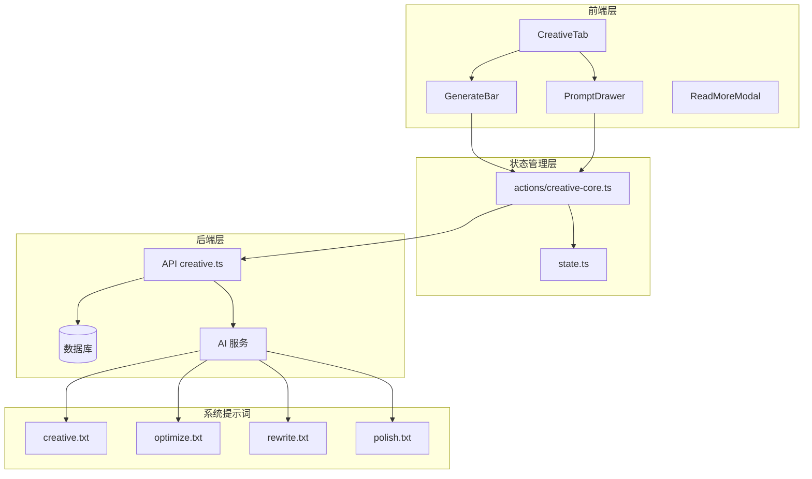
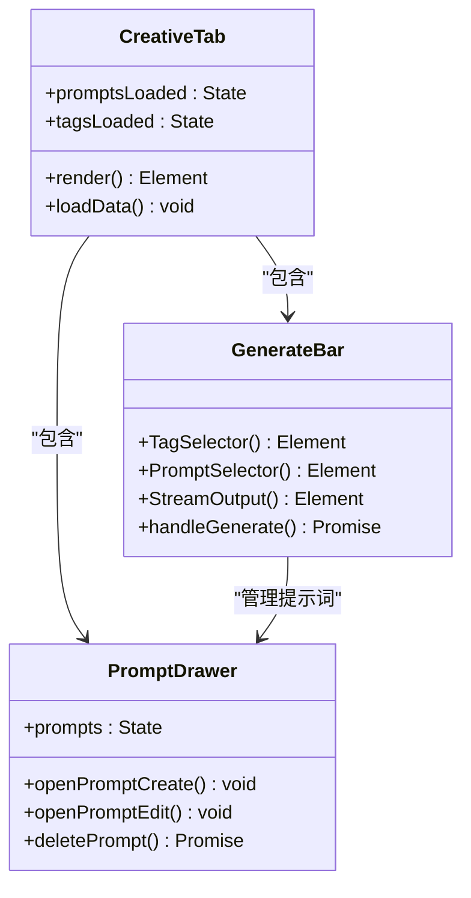
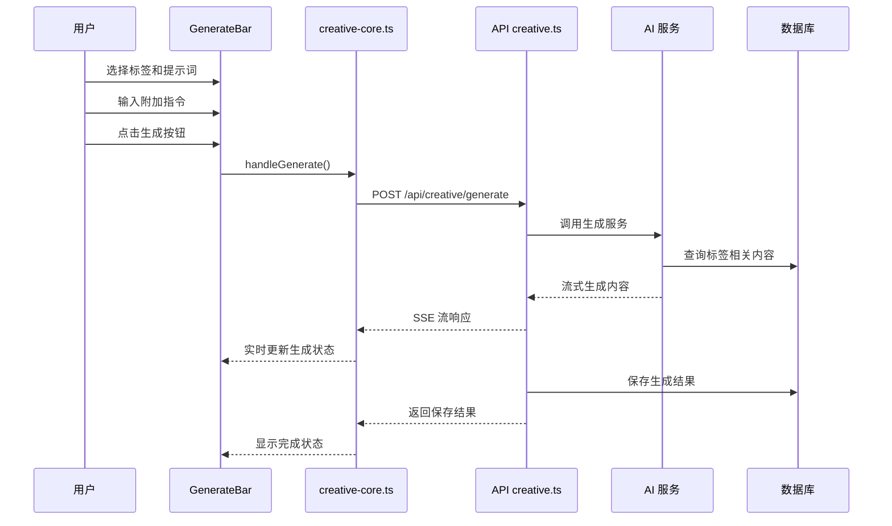
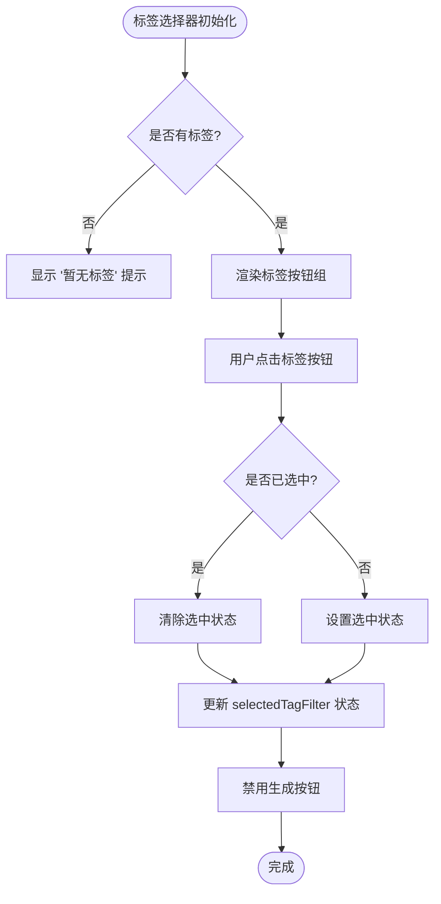
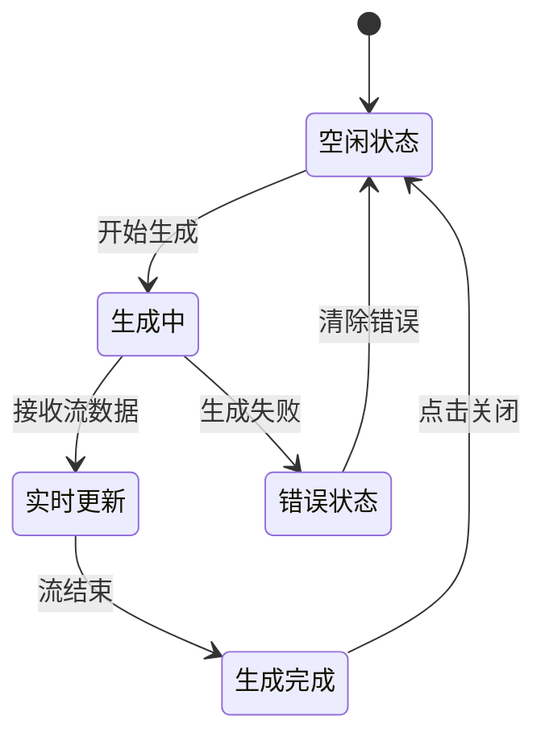
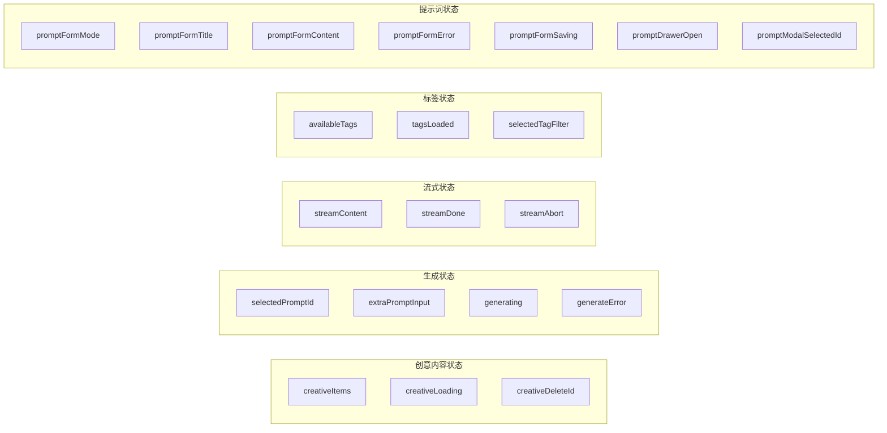
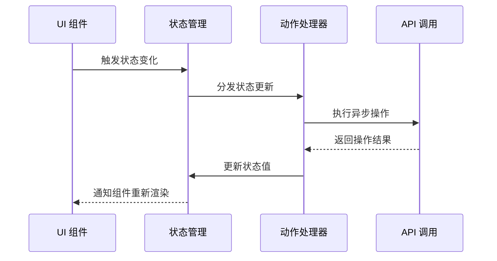

# 创意页面优化设计规范

<cite>
**本文档引用的文件**
- [2026-05-27-creative-page-optimization-design.md](file://docs/superpowers/specs/2026-05-27-creative-page-optimization-design.md)
- [creative.ts](file://src/frontend/admin/creative.ts)
- [creative.ts](file://src/api/creative.ts)
- [creative.txt](file://data/system-prompts/creative.txt)
- [GenerateBar.ts](file://src/frontend/admin/components/GenerateBar.ts)
- [PromptDrawer.ts](file://src/frontend/admin/components/PromptDrawer.ts)
- [creative-core.ts](file://src/frontend/admin/actions/creative-core.ts)
- [state.ts](file://src/frontend/admin/state.ts)
- [optimize.txt](file://data/system-prompts/optimize.txt)
- [rewrite.txt](file://data/system-prompts/rewrite.txt)
- [polish.txt](file://data/system-prompts/polish.txt)
</cite>

## 更新摘要
**所做更改**
- 新增 GenerateBar 生成栏组件的详细分析和实现说明
- 新增 PromptDrawer 提示词抽屉组件的完整架构分析
- 更新项目结构概览以反映新的组件架构
- 修订状态管理系统以体现新的状态变量组织
- 更新 API 设计以反映后端接口变更
- 移除已删除的 ChatPanel 和 GenerateModal 组件的相关内容
- 更新故障排除指南以反映新的错误处理机制

## 目录
1. [简介](#简介)
2. [项目结构概览](#项目结构概览)
3. [核心组件分析](#核心组件分析)
4. [架构设计](#架构设计)
5. [详细组件分析](#详细组件分析)
6. [状态管理系统](#状态管理系统)
7. [API 设计](#api-设计)
8. [性能考虑](#性能考虑)
9. [故障排除指南](#故障排除指南)
10. [总结](#总结)

## 简介

创意页面优化设计规范旨在简化和优化 Memos 应用中的创意内容生成功能。该设计将复杂的三步操作流程简化为一步完成，删除冗余功能，提升用户体验效率。

### 主要目标

- **简化操作流程**：从「选标签 → 选提示词 → 生成」的三步操作简化为「选择标签和提示词 → 一键生成」
- **内联生成界面**：删除弹窗，采用内联生成栏设计
- **功能精简**：删除 auto/manual 上下文模式，仅保留标签模式
- **提升效率**：减少用户交互步骤，提高创意内容生成效率

## 项目结构概览



**图表来源**
- [creative.ts:101-161](file://src/frontend/admin/creative.ts#L101-L161)
- [creative.ts:118-221](file://src/api/creative.ts#L118-L221)
- [state.ts:116-168](file://src/frontend/admin/state.ts#L116-L168)

**章节来源**
- [creative.ts:1-161](file://src/frontend/admin/creative.ts#L1-L161)
- [state.ts:1-168](file://src/frontend/admin/state.ts#L1-L168)

## 核心组件分析

### CreativeTab 主组件

CreativeTab 是创意页面的主容器组件，负责协调各个子组件的渲染和交互。它实现了内联生成界面，支持提示词管理和创意内容展示。



**图表来源**
- [creative.ts:101-161](file://src/frontend/admin/creative.ts#L101-L161)
- [GenerateBar.ts:119-245](file://src/frontend/admin/components/GenerateBar.ts#L119-L245)
- [PromptDrawer.ts:225-276](file://src/frontend/admin/components/PromptDrawer.ts#L225-L276)

### GenerateBar 内联生成栏

GenerateBar 是本次优化的核心组件，实现了内联的创意内容生成界面。它包含了标签选择器、提示词选择器、附加指令输入框和生成按钮。

**章节来源**
- [GenerateBar.ts:119-245](file://src/frontend/admin/components/GenerateBar.ts#L119-L245)

### PromptDrawer 提示词抽屉

PromptDrawer 提供了侧边栏形式的提示词管理界面，支持新建、编辑和删除操作。采用左右分栏设计，左侧显示提示词列表，右侧提供编辑表单。

**章节来源**
- [PromptDrawer.ts:225-276](file://src/frontend/admin/components/PromptDrawer.ts#L225-L276)

## 架构设计

### 前后端分离架构



**图表来源**
- [creative-core.ts:165-225](file://src/frontend/admin/actions/creative-core.ts#L165-L225)
- [creative.ts:118-221](file://src/api/creative.ts#L118-L221)

### 状态管理模式

系统采用 Van.js 的响应式状态管理，将所有状态集中管理，确保组件间的通信和数据同步。

**章节来源**
- [state.ts:116-168](file://src/frontend/admin/state.ts#L116-L168)

## 详细组件分析

### 标签选择器组件

标签选择器实现了可滚动的标签按钮组，支持单选功能。每个标签按钮都有高亮状态指示。



**图表来源**
- [GenerateBar.ts:18-50](file://src/frontend/admin/components/GenerateBar.ts#L18-L50)

### 提示词选择器组件

提示词选择器提供了下拉菜单形式的提示词管理界面，集成了提示词管理入口。

**章节来源**
- [GenerateBar.ts:54-83](file://src/frontend/admin/components/GenerateBar.ts#L54-L83)

### 流式输出组件

流式输出组件实现了实时内容生成的可视化展示，包括闪烁光标效果和完成状态处理。



**图表来源**
- [GenerateBar.ts:87-115](file://src/frontend/admin/components/GenerateBar.ts#L87-L115)

### 提示词管理抽屉

提示词管理抽屉提供了侧边栏形式的提示词管理界面，支持新建、编辑和删除操作。

**章节来源**
- [PromptDrawer.ts:34-103](file://src/frontend/admin/components/PromptDrawer.ts#L34-L103)

## 状态管理系统

### 状态分类

系统状态按照功能模块进行分类管理：



**图表来源**
- [state.ts:116-168](file://src/frontend/admin/state.ts#L116-L168)

### 状态更新流程



**图表来源**
- [creative-core.ts:1-249](file://src/frontend/admin/actions/creative-core.ts#L1-L249)

**章节来源**
- [state.ts:1-168](file://src/frontend/admin/state.ts#L1-L168)

## API 设计

### 后端 API 架构

```mermaid
graph TB
subgraph "创意内容 API"
GP[/api/creative/prompts GET] --> GPC[获取提示词列表]
CP[/api/creative/prompts POST] --> CPC[创建提示词]
UP[/api/creative/prompts PUT] --> UPC[更新提示词]
DP[/api/creative/prompts DELETE] --> DPC[删除提示词]
GI[/api/creative GET] --> GIC[获取创意内容]
CG[/api/creative/generate POST] --> CGC[生成创意内容]
CI[/api/creative POST] --> CIC[创建创意内容]
DC[/api/creative DELETE] --> DCI[删除创意内容]
end
subgraph "AI 服务"
AI[AI 生成服务]
Embedding[向量嵌入]
end
CGC --> AI
AI --> Embedding
```

**图表来源**
- [creative.ts:32-266](file://src/api/creative.ts#L32-L266)

### 流式生成 API

后端实现了基于 Server-Sent Events (SSE) 的流式生成接口，提供实时的内容生成体验。

**章节来源**
- [creative.ts:118-221](file://src/api/creative.ts#L118-L221)

## 性能考虑

### 流式处理优化

系统采用了流式处理机制，通过 SSE 实现内容的实时传输，避免了长时间的等待。

### 内存管理

- **状态清理**：生成完成后及时清理流式状态，释放内存
- **组件卸载**：支持 AbortController 中断长时间运行的操作
- **虚拟滚动**：对于大量创意内容，考虑实现虚拟滚动优化

### 缓存策略

- **标签缓存**：标签列表只在首次加载时获取
- **提示词缓存**：提示词列表缓存在内存中
- **生成结果缓存**：创意内容列表按需刷新

## 故障排除指南

### 常见问题及解决方案

| 问题类型 | 症状 | 可能原因 | 解决方案 |
|---------|------|---------|---------|
| 生成失败 | 生成按钮禁用，显示错误信息 | 网络连接问题或 API 错误 | 检查网络连接，重试操作 |
| 标签无显示 | 标签选择器显示 "暂无标签" | 标签数据加载失败 | 刷新页面，检查标签 API |
| 提示词为空 | 提示词下拉菜单无选项 | 提示词数据加载失败 | 检查提示词管理功能 |
| 流式输出卡顿 | 生成过程中内容更新缓慢 | 网络延迟或服务器响应慢 | 检查网络状况，等待重试 |
| 提示词抽屉无法打开 | 点击齿轮图标无反应 | 状态管理异常 | 检查 promptDrawerOpen 状态 |

### 调试工具

- **浏览器开发者工具**：监控网络请求和响应
- **控制台日志**：查看状态变化和错误信息
- **SSE 流监控**：验证流式数据传输

**章节来源**
- [creative-core.ts:165-225](file://src/frontend/admin/actions/creative-core.ts#L165-L225)

## 总结

创意页面优化设计规范通过以下关键改进提升了用户体验：

### 主要改进点

1. **操作流程简化**：从三步操作简化为一步完成
2. **界面设计优化**：内联生成栏替代弹窗，提升操作效率
3. **功能精简**：删除冗余的上下文模式，专注于核心功能
4. **状态管理优化**：统一的状态管理确保组件间协调一致

### 技术优势

- **响应式设计**：基于 Van.js 的响应式状态管理
- **流式处理**：实时内容生成体验
- **模块化架构**：清晰的组件分离和职责划分
- **性能优化**：合理的状态管理和内存控制

### 未来发展方向

- **移动端适配**：优化移动端触摸交互体验
- **智能推荐**：基于使用历史的提示词推荐
- **批量操作**：支持多个创意内容的批量管理
- **导出功能**：增强创意内容的导出和分享能力

这一优化设计为用户提供了更加直观、高效的创意内容生成体验，同时保持了系统的可维护性和扩展性。