# 开发指南

<cite>
**本文引用的文件**
- [package.json](file://package.json)
- [tsconfig.json](file://tsconfig.json)
- [README.md](file://README.md)
- [ai.config.json](file://ai.config.json)
- [src/server.ts](file://src/server.ts)
- [src/db.ts](file://src/db.ts)
- [src/auth.ts](file://src/auth.ts)
- [src/model.ts](file://src/model.ts)
- [src/api/auth.ts](file://src/api/auth.ts)
- [src/api/memos.ts](file://src/api/memos.ts)
- [src/api/ai.ts](file://src/api/ai.ts)
- [src/util.ts](file://src/util.ts)
- [src/ai/embeddings.ts](file://src/ai/embeddings.ts)
- [src/ai/service.ts](file://src/ai/service.ts)
- [src/admin/app.ts](file://src/admin/app.ts)
- [src/admin/ai-state.ts](file://src/admin/ai-state.ts)
- [src/masonry/index.ts](file://src/masonry/index.ts)
- [src/config/rate-limit.ts](file://src/config/rate-limit.ts)
- [src/init/seed.ts](file://src/init/seed.ts)
- [data/memos.txt](file://data/memos.txt)
</cite>

## 目录
1. [简介](#简介)
2. [项目结构](#项目结构)
3. [核心组件](#核心组件)
4. [架构总览](#架构总览)
5. [详细组件分析](#详细组件分析)
6. [依赖关系分析](#依赖关系分析)
7. [性能考量](#性能考量)
8. [故障排除指南](#故障排除指南)
9. [结论](#结论)
10. [附录](#附录)

## 简介
本指南面向希望参与 memos 项目开发与维护的工程师，覆盖从环境搭建、调试与开发流程、TypeScript 配置与编译、构建与部署、代码风格与最佳实践、测试与质量保障、功能扩展与性能优化，到贡献与代码审查流程的完整开发手册。项目基于 Bun 运行时，采用 Hono 作为 Web 框架，前端使用 VanJS 和 @chenglou/pretext，数据库为 SQLite（bun:sqlite），并提供可选的 AI 能力（DeepSeek、DashScope、Kimi、GLM）。**新增功能**：支持IP级别两层窗口（小时+天）的速率限制系统，以及首次启动时的种子数据初始化功能。

## 项目结构
- 根目录包含运行脚本与配置文件：package.json、tsconfig.json、README.md、bun.lock、ai.config.json。
- 源码集中在 src/ 下，按职责划分为：
  - 服务入口与路由：server.ts
  - 数据层：db.ts
  - 认证中间件与会话：auth.ts、api/auth.ts
  - API 子域：api/memos.ts、api/ai.ts
  - 工具函数：util.ts
  - AI 能力：ai/service.ts、ai/embeddings.ts
  - 配置系统：config/rate-limit.ts（新增）
  - 初始化脚本：init/seed.ts（新增）
  - 前端页面：
    - 管理后台 SPA：admin/app.ts 及其 HTML 模板
    - 首页瀑布流：masonry/index.ts 及其 HTML 模板
- 数据目录：data/ 包含内置提示词和示例备忘录数据

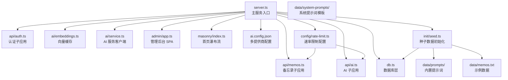

**图表来源**
- [src/server.ts:1-131](file://src/server.ts#L1-L131)
- [src/api/auth.ts:1-69](file://src/api/auth.ts#L1-L69)
- [src/api/memos.ts:1-166](file://src/api/memos.ts#L1-L166)
- [src/api/ai.ts:1-109](file://src/api/ai.ts#L1-L109)
- [src/db.ts:1-349](file://src/db.ts#L1-L349)
- [src/ai/embeddings.ts:1-99](file://src/ai/embeddings.ts#L1-L99)
- [src/ai/service.ts:1-417](file://src/ai/service.ts#L1-L417)
- [src/admin/app.ts:1-823](file://src/admin/app.ts#L1-L823)
- [src/masonry/index.ts:1-391](file://src/masonry/index.ts#L1-L391)
- [src/config/rate-limit.ts:1-145](file://src/config/rate-limit.ts#L1-L145)
- [src/init/seed.ts:1-118](file://src/init/seed.ts#L1-L118)
- [ai.config.json:1-44](file://ai.config.json#L1-L44)
- [data/memos.txt:1-46](file://data/memos.txt#L1-L46)

**章节来源**
- [README.md:25-45](file://README.md#L25-L45)
- [src/server.ts:75-131](file://src/server.ts#L75-L131)

## 核心组件
- 服务入口与路由
  - 使用 Hono 注册 API 子应用与静态页面路由；内置客户端 TS 按需构建与缓存；初始化数据库、向量缓存和种子数据；启动 HTTP 服务。
- 数据层
  - 使用 SQLite（bun:sqlite）；初始化表结构（memos、memo_embeddings、prompts、creative）；提供 CRUD 与统计查询；嵌入向量的增删改查。
- 认证与会话
  - 内存会话存储；Cookie 管理；登录频率限制；Hono 中间件保护受保护接口。
- API 子域
  - 认证 API：检查、登录、登出。
  - 备忘录 API：分页/筛选/计数/语义合并检索；创建/更新/删除；标签管理。
  - AI API：可用性检测；内容优化；标签建议；模型选择。
- **速率限制系统**：IP级别两层窗口（小时+天）速率限制，支持memo和AI两类，可配置环境变量进行调整。
- **种子数据初始化**：首次启动时自动导入内置提示词和示例备忘录数据。
- 前端
  - 管理后台 SPA：VanJS 响应式 UI，支持登录、创建/编辑/切换可见性/删除、AI 优化与标签建议、创意内容生成等。
  - 首页瀑布流：@chenglou/pretext 文本预排版，Masonry 布局，虚拟滚动，搜索与标签筛选，URL 同步。

**章节来源**
- [src/server.ts:1-131](file://src/server.ts#L1-L131)
- [src/db.ts:15-57](file://src/db.ts#L15-L57)
- [src/auth.ts:1-108](file://src/auth.ts#L1-L108)
- [src/api/auth.ts:14-69](file://src/api/auth.ts#L14-L69)
- [src/api/memos.ts:20-166](file://src/api/memos.ts#L20-L166)
- [src/api/ai.ts:8-109](file://src/api/ai.ts#L8-L109)
- [src/config/rate-limit.ts:1-145](file://src/config/rate-limit.ts#L1-L145)
- [src/init/seed.ts:1-118](file://src/init/seed.ts#L1-L118)
- [src/admin/app.ts:38-190](file://src/admin/app.ts#L38-L190)
- [src/masonry/index.ts:307-391](file://src/masonry/index.ts#L307-L391)

## 架构总览
整体采用"服务端按需编译 + 前端 SPA"的混合架构：服务端负责路由、API、静态资源与客户端 TS 的构建；前端 SPA 通过 fetch 与 API 交互，实现管理后台与首页瀑布流。AI 能力通过多提供商配置系统实现灵活的供应商选择。**新增架构元素**：速率限制中间件在API层提供统一的访问控制，种子数据初始化在应用启动时自动执行。

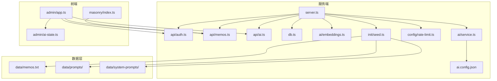

**图表来源**
- [src/server.ts:75-131](file://src/server.ts#L75-L131)
- [src/api/auth.ts:25-69](file://src/api/auth.ts#L25-L69)
- [src/api/memos.ts:18-166](file://src/api/memos.ts#L18-L166)
- [src/api/ai.ts:6-109](file://src/api/ai.ts#L6-L109)
- [src/db.ts:15-57](file://src/db.ts#L15-L57)
- [src/ai/embeddings.ts:12-99](file://src/ai/embeddings.ts#L12-L99)
- [src/ai/service.ts:12-417](file://src/ai/service.ts#L12-L417)
- [src/masonry/index.ts:307-391](file://src/masonry/index.ts#L307-L391)
- [src/admin/app.ts:38-190](file://src/admin/app.ts#L38-L190)
- [src/admin/ai-state.ts:1-10](file://src/admin/ai-state.ts#L1-L10)
- [src/config/rate-limit.ts:1-145](file://src/config/rate-limit.ts#L1-L145)
- [src/init/seed.ts:1-118](file://src/init/seed.ts#L1-L118)
- [ai.config.json:1-44](file://ai.config.json#L1-L44)
- [data/memos.txt:1-46](file://data/memos.txt#L1-L46)

## 详细组件分析

### 服务端路由与静态资源
- 负责注册子应用路由、静态页面路由与 404 处理；对 /admin/* 与 .ts 请求进行 SPA 回退；对 /index.ts 与 /admin/app.ts 提供按需构建与缓存。
- 构建缓存以 mtime 为键，避免重复编译；错误日志输出到控制台。
- **初始化流程**：启动时自动执行数据库初始化、种子数据导入和向量缓存初始化。

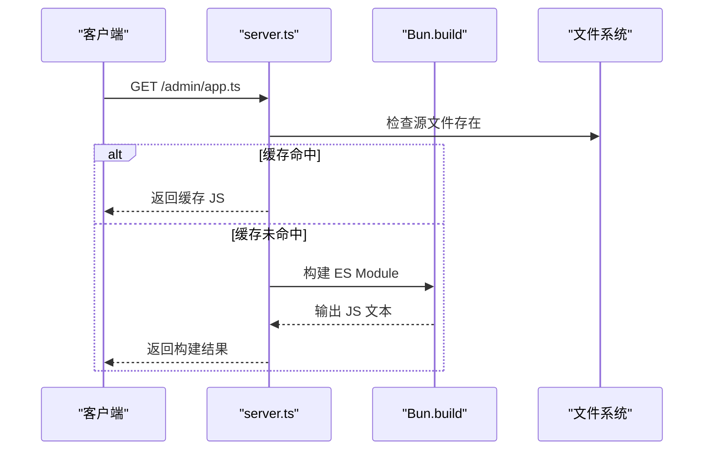

**图表来源**
- [src/server.ts:16-52](file://src/server.ts#L16-L52)

**章节来源**
- [src/server.ts:75-131](file://src/server.ts#L75-L131)

### 数据库层与模型
- 初始化 WAL 模式与外键约束；定义 memos、memo_embeddings、prompts、creative 表；提供查询、插入、更新、删除与统计方法；嵌入向量以 Blob 存储并在内存中维护 Float32Array 缓存。

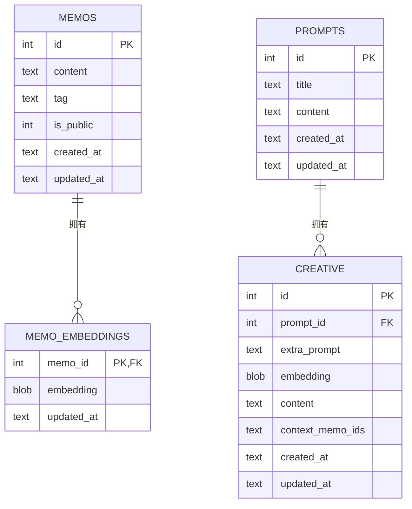

**图表来源**
- [src/db.ts:17-56](file://src/db.ts#L17-L56)

**章节来源**
- [src/db.ts:15-349](file://src/db.ts#L15-L349)
- [src/model.ts:1-28](file://src/model.ts#L1-L28)

### 认证与会话
- 内存会话集合；Cookie 名称与过期时间；登录频率限制（每 IP 最多 5 次，1 分钟冷却）；Hono 中间件 requireAuth 与 authMiddleware。

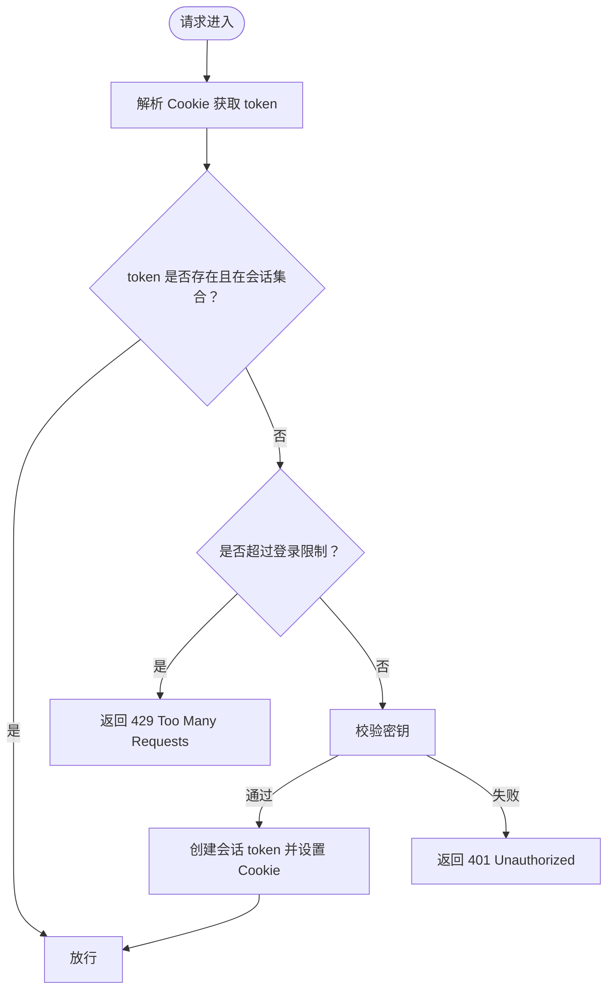

**图表来源**
- [src/auth.ts:23-108](file://src/auth.ts#L23-L108)
- [src/api/auth.ts:32-69](file://src/api/auth.ts#L32-L69)

**章节来源**
- [src/auth.ts:1-108](file://src/auth.ts#L1-L108)
- [src/api/auth.ts:14-69](file://src/api/auth.ts#L14-L69)

### 备忘录 API 与语义检索
- 支持搜索（LIKE）、标签筛选、私有备忘录（需认证）；创建/更新/删除；计数；标签列表；语义检索与 LIKE 结果合并（非阻塞）。
- **速率限制**：创建备忘录接口使用速率限制中间件，防止恶意批量创建。

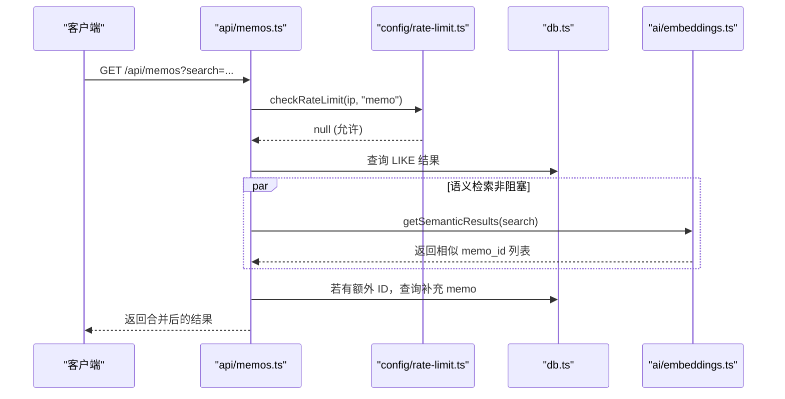

**图表来源**
- [src/api/memos.ts:20-66](file://src/api/memos.ts#L20-L66)
- [src/config/rate-limit.ts:68-102](file://src/config/rate-limit.ts#L68-L102)
- [src/ai/embeddings.ts:66-86](file://src/ai/embeddings.ts#L66-L86)
- [src/db.ts:99-131](file://src/db.ts#L99-L131)

**章节来源**
- [src/api/memos.ts:18-166](file://src/api/memos.ts#L18-L166)
- [src/db.ts:99-193](file://src/db.ts#L99-L193)
- [src/ai/embeddings.ts:12-99](file://src/ai/embeddings.ts#L12-L99)
- [src/config/rate-limit.ts:1-145](file://src/config/rate-limit.ts#L1-L145)

### AI 能力与多提供商配置系统
- **多提供商配置**：通过 ai.config.json 定义多个 AI 服务提供商，包括 DeepSeek、Kimi、GLM、DashScope，每个提供商支持不同的模型组合。
- **动态配置加载**：AI 服务客户端从配置文件加载提供商信息，支持运行时配置更新。
- **环境变量管理**：每个提供商通过独立的环境变量（如 DEEPSEEK_API_KEY、KIMI_API_KEY、GLM_API_KEY、DASHSCOPE_API_KEY）进行密钥管理。
- **可用性检测**：根据环境变量的存在性动态检测各提供商的可用状态。
- **内容优化与标签建议**：支持指定提供商和模型进行内容优化和标签建议。
- **创意内容生成**：支持同步和流式创意内容生成，可选择不同的提供商和模型。
- **速率限制**：AI相关接口同样受到速率限制保护。

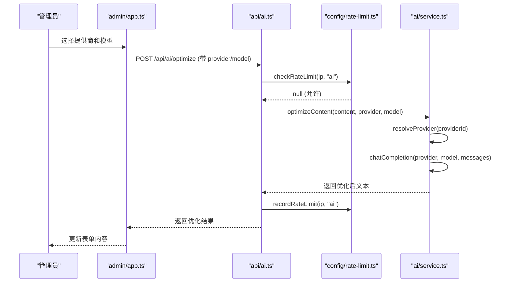

**图表来源**
- [src/admin/app.ts:225-246](file://src/admin/app.ts#L225-L246)
- [src/api/ai.ts:24-68](file://src/api/ai.ts#L24-L68)
- [src/config/rate-limit.ts:68-102](file://src/config/rate-limit.ts#L68-L102)
- [src/ai/service.ts:243-258](file://src/ai/service.ts#L243-L258)

**章节来源**
- [src/api/ai.ts:8-109](file://src/api/ai.ts#L8-L109)
- [src/ai/service.ts:12-417](file://src/ai/service.ts#L12-L417)
- [src/admin/app.ts:141-198](file://src/admin/app.ts#L141-L198)
- [src/admin/ai-state.ts:1-10](file://src/admin/ai-state.ts#L1-L10)
- [src/config/rate-limit.ts:1-145](file://src/config/rate-limit.ts#L1-L145)

### 速率限制系统
- **双层窗口设计**：采用小时窗口和天窗口两级限制，提供更精细的访问控制。
- **分类管理**：支持memo和ai两类不同的速率限制策略。
- **环境变量配置**：可通过环境变量自定义各类别的限制阈值。
- **IP识别**：支持通过X-Forwarded-For和X-Real-IP头部识别真实客户端IP。
- **错误处理**：提供详细的错误信息，包括剩余重试时间和限制类别。

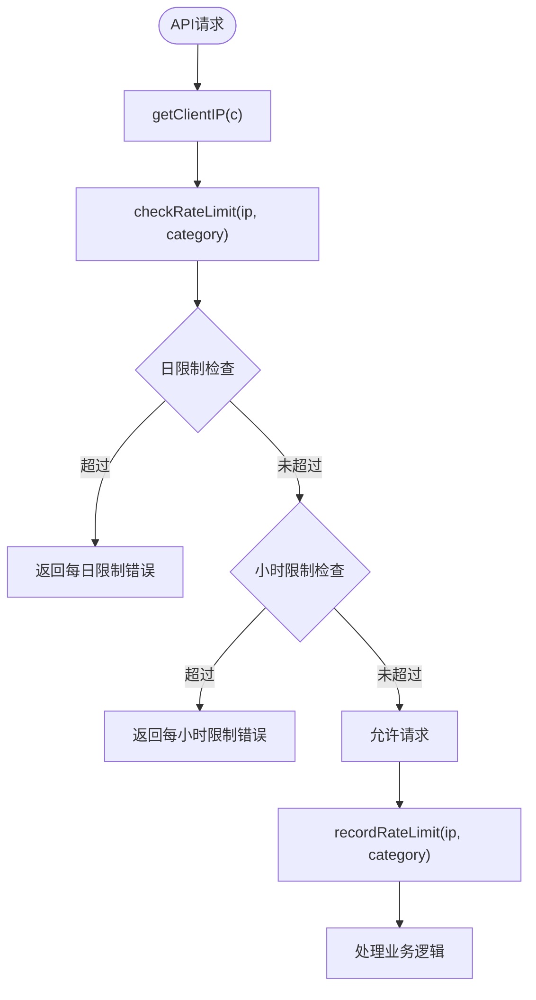

**图表来源**
- [src/config/rate-limit.ts:68-132](file://src/config/rate-limit.ts#L68-L132)

**章节来源**
- [src/config/rate-limit.ts:1-145](file://src/config/rate-limit.ts#L1-L145)
- [src/api/memos.ts:81-118](file://src/api/memos.ts#L81-L118)
- [src/api/ai.ts:29-108](file://src/api/ai.ts#L29-L108)

### 种子数据初始化系统
- **首次启动检查**：应用启动时自动检查数据库状态，决定是否导入种子数据。
- **内置提示词导入**：从data/prompts目录导入所有.txt文件作为内置提示词。
- **示例备忘录导入**：从data/memos.txt文件导入示例备忘录数据。
- **去重保护**：导入前检查现有数据，避免重复导入。
- **错误处理**：对导入过程中的异常进行捕获和记录，不影响应用正常启动。

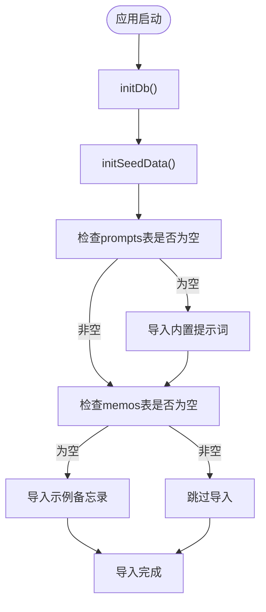

**图表来源**
- [src/init/seed.ts:112-118](file://src/init/seed.ts#L112-L118)

**章节来源**
- [src/init/seed.ts:1-118](file://src/init/seed.ts#L1-L118)
- [src/server.ts:115-122](file://src/server.ts#L115-L122)
- [data/memos.txt:1-46](file://data/memos.txt#L1-L46)

### 首页瀑布流与虚拟滚动
- 使用 @chenglou/pretext 进行文本预排版；Masonry 布局；窗口尺寸变化与滚动事件触发重绘；可视区域外卡片回收；URL 参数同步（搜索/标签）。

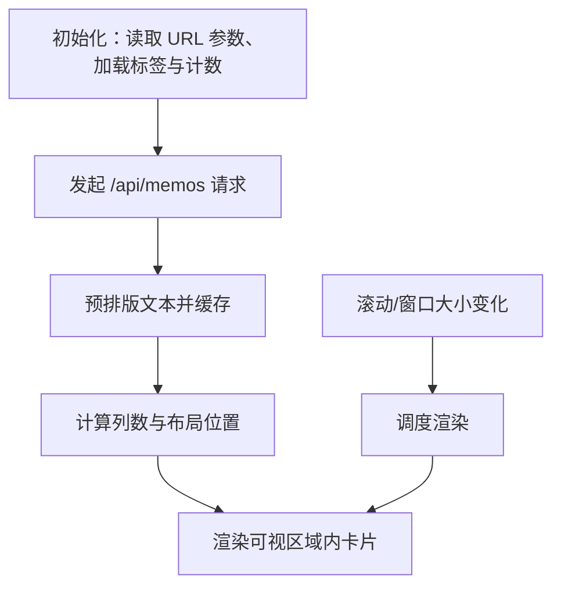

**图表来源**
- [src/masonry/index.ts:371-391](file://src/masonry/index.ts#L371-L391)
- [src/masonry/index.ts:146-270](file://src/masonry/index.ts#L146-L270)
- [src/masonry/index.ts:307-351](file://src/masonry/index.ts#L307-L351)

**章节来源**
- [src/masonry/index.ts:1-391](file://src/masonry/index.ts#L1-L391)

### 管理后台 SPA
- 登录/登出；创建/编辑/切换可见性/删除；AI 优化与标签建议；创意内容生成；时间线侧边栏；全局错误提示与加载状态。
- **AI 模型选择**：支持从多个提供商的可用模型中选择，使用 localStorage 持久化用户选择。

**章节来源**
- [src/admin/app.ts:38-190](file://src/admin/app.ts#L38-L190)
- [src/admin/app.ts:570-677](file://src/admin/app.ts#L570-L677)

## 依赖关系分析
- 运行时与框架：Bun、Hono
- 前端库：VanJS（管理后台）、@chenglou/pretext（首页瀑布流）
- 数据库：bun:sqlite（SQLite）
- AI 服务：DeepSeek、DashScope、Kimi、GLM（多提供商支持）
- **新增依赖**：速率限制中间件、种子数据初始化脚本

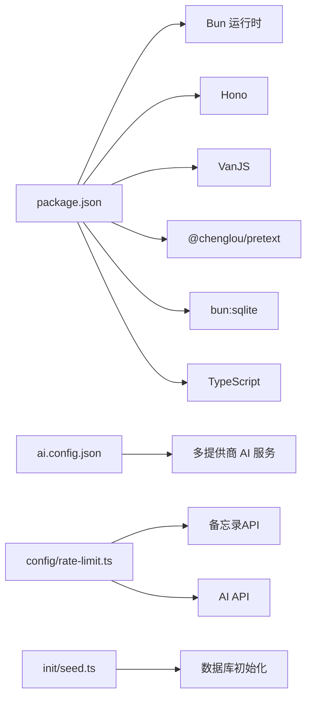

**图表来源**
- [package.json:16-20](file://package.json#L16-L20)
- [ai.config.json:1-44](file://ai.config.json#L1-44)
- [src/config/rate-limit.ts:1-145](file://src/config/rate-limit.ts#L1-L145)
- [src/init/seed.ts:1-118](file://src/init/seed.ts#L1-L118)

**章节来源**
- [package.json:1-22](file://package.json#L1-22)
- [tsconfig.json:1-30](file://tsconfig.json#L1-L30)

## 性能考量
- 构建缓存：server.ts 对客户端 TS 的构建结果按 mtime 缓存，避免重复编译。
- 嵌入缓存：内存中维护 memo_id → Float32Array 的向量缓存，减少数据库 IO。
- 首页瀑布流：可视区域外卡片回收，降低 DOM 数量；预排版与布局计算按需执行。
- 语义检索：与 LIKE 结果合并，非阻塞执行，提升响应速度。
- 数据库：WAL 模式与外键约束，确保一致性与并发性能。
- **AI 配置缓存**：AI 配置在内存中缓存，避免重复读取配置文件。
- **速率限制缓存**：速率限制状态存储在内存Map中，提供快速的访问控制。
- **种子数据缓存**：首次启动后不再重复导入，避免重复IO操作。

**章节来源**
- [src/server.ts:16-52](file://src/server.ts#L16-L52)
- [src/ai/embeddings.ts:12-99](file://src/ai/embeddings.ts#L12-L99)
- [src/masonry/index.ts:217-270](file://src/masonry/index.ts#L217-L270)
- [src/db.ts:9-13](file://src/db.ts#L9-L13)
- [src/ai/service.ts:29-61](file://src/ai/service.ts#L29-L61)
- [src/config/rate-limit.ts:26](file://src/config/rate-limit.ts#L26)
- [src/init/seed.ts:112-118](file://src/init/seed.ts#L112-L118)

## 故障排除指南
- 环境变量缺失
  - MEMOS_SECRET_KEY 在生产环境必须设置，否则认证模块会终止进程并记录致命错误。
  - **AI 配置问题**：DEEPSEEK_API_KEY、KIMI_API_KEY、GLM_API_KEY、DASHSCOPE_API_KEY 未设置时，相关功能返回 503 或被禁用。
  - **速率限制配置**：RATE_LIMIT_MEMOS_PER_HOUR、RATE_LIMIT_MEMOS_PER_DAY、RATE_LIMIT_AI_PER_HOUR、RATE_LIMIT_AI_PER_DAY 环境变量未设置时，使用默认值。
- AI 服务不可用
  - **提供商配置错误**：ai.config.json 中缺少提供商配置或 API 密钥环境变量未设置时，AI 功能将不可用。
  - **配置文件损坏**：ai.config.json 格式错误时，系统回退到单提供商 DeepSeek 配置。
- 构建失败
  - 客户端 TS 构建失败会输出错误日志；检查源文件路径与语法。
- 登录频繁失败
  - 登录尝试超过阈值会被限制，等待冷却时间后重试。
- 前端空白或不显示数据
  - 检查 /api/memos 与 /api/memos/tags 的响应；确认 Cookie 是否正确设置。
- **AI 模型选择问题**
  - 选择的模型不在可用模型列表中时，系统会自动回退到默认模型。
  - 本地存储的模型选择可能与当前配置不匹配，系统会尝试恢复保存的选择。
- **速率限制问题**
  - 如果遇到429错误，检查对应的环境变量配置是否合理。
  - 确认客户端IP是否正确识别，特别是通过代理服务器访问时。
- **种子数据导入失败**
  - 检查data/prompts和data/system-prompts目录是否存在且包含有效的.txt文件。
  - 确认数据库权限允许写入操作。

**章节来源**
- [src/api/auth.ts:14-23](file://src/api/auth.ts#L14-L23)
- [src/ai/service.ts:12-26](file://src/ai/service.ts#L12-L26)
- [src/server.ts:35-50](file://src/server.ts#L35-L50)
- [src/auth.ts:57-89](file://src/auth.ts#L57-L89)
- [src/masonry/index.ts:307-351](file://src/masonry/index.ts#L307-L351)
- [src/admin/app.ts:190-223](file://src/admin/app.ts#L190-L223)
- [src/config/rate-limit.ts:28-31](file://src/config/rate-limit.ts#L28-L31)
- [src/init/seed.ts:23-35](file://src/init/seed.ts#L23-L35)

## 结论
本指南提供了 memos 项目的开发全链路说明，涵盖环境搭建、调试、TS 配置、构建与部署、代码风格、测试与质量保障、扩展与性能优化、故障排除以及贡献与评审流程。**新增功能**：速率限制系统为应用提供了更完善的访问控制能力，种子数据初始化系统简化了首次使用体验。新增的多提供商AI配置系统为项目提供了更灵活的AI服务能力，支持多种主流AI提供商的无缝切换。建议在开发过程中遵循统一的 TS 配置与严格模式，结合现有缓存与虚拟化策略，持续优化用户体验与系统稳定性。

## 附录

### 开发环境搭建
- 环境要求
  - Bun >= 1.3.3
- 安装依赖
  - 使用 bun install 安装依赖与类型声明
- 启动方式
  - 开发模式：bun run dev（热重载）
  - 生产模式：bun run start
- 环境变量（可选）
  - PORT：服务器监听端口，默认 3020
  - MEMOS_SECRET_KEY：管理员登录密钥，默认开发值可在生产环境覆盖
  - **AI 配置**：DEEPSEEK_API_KEY、KIMI_API_KEY、GLM_API_KEY、DASHSCOPE_API_KEY（根据实际使用的提供商设置）
  - **速率限制配置**：
    - RATE_LIMIT_MEMOS_PER_HOUR：每小时备忘录创建限制，默认 50
    - RATE_LIMIT_MEMOS_PER_DAY：每天备忘录创建限制，默认 200
    - RATE_LIMIT_AI_PER_HOUR：每小时AI调用限制，默认 30
    - RATE_LIMIT_AI_PER_DAY：每天AI调用限制，默认 100

**章节来源**
- [README.md:49-81](file://README.md#L49-L81)
- [package.json:6-8](file://package.json#L6-L8)
- [src/config/rate-limit.ts:2-6](file://src/config/rate-limit.ts#L2-L6)

### TypeScript 配置与编译
- 目标与模块
  - 目标：ESNext；模块：Preserve；模块解析：bundler
- JSX 与兼容
  - JSX：react-jsx；允许 JS；严格模式启用
- 编译输出
  - noEmit：仅类型检查，不生成 JS
- 常见编译选项说明
  - strict：启用严格模式
  - skipLibCheck：跳过库文件检查
  - noFallthroughCasesInSwitch：switch 防止贯穿
  - noUncheckedIndexedAccess：索引访问更严格
  - verbatimModuleSyntax：保留模块语法

**章节来源**
- [tsconfig.json:2-28](file://tsconfig.json#L2-L28)

### 构建与部署
- 本地开发
  - 使用 dev 脚本启动热重载；server.ts 内置客户端 TS 按需构建与缓存
- 生产运行
  - 使用 start 脚本启动；数据库文件 memos.db 自动创建
- 部署建议
  - 将项目打包为可执行二进制（Bun 支持）；确保持久化存储 memos.db；设置环境变量 MEMOS_SECRET_KEY
  - **AI 配置部署**：在生产环境中正确配置 AI 提供商的 API 密钥环境变量
  - **速率限制部署**：根据实际流量情况调整速率限制环境变量
- **首次启动流程**
  - 应用启动时自动执行：数据库初始化 → 种子数据导入 → 向量缓存初始化 → 服务启动

**章节来源**
- [package.json:6-8](file://package.json#L6-L8)
- [README.md:66-81](file://README.md#L66-L81)
- [src/server.ts:115-122](file://src/server.ts#L115-L122)

### 代码风格与最佳实践
- 统一使用严格 TS 配置，开启 noFallthroughCasesInSwitch、noUncheckedIndexedAccess 等
- API 层统一返回 JSON 错误与状态码；前端 util.ts 提供统一的错误处理与格式化工具
- 数据库操作封装在 db.ts，避免分散 SQL；模型定义集中于 model.ts
- 前端状态管理使用 VanJS 的响应式状态，避免复杂状态机
- 避免在生产环境使用默认密钥，务必设置 MEMOS_SECRET_KEY
- **AI 配置管理**：使用 ai.config.json 集中管理提供商配置，避免硬编码 API 密钥
- **速率限制最佳实践**：根据业务需求合理设置环境变量，避免过度限制影响用户体验
- **种子数据管理**：在data目录下维护内置数据，确保首次启动的良好体验

**章节来源**
- [tsconfig.json:17-27](file://tsconfig.json#L17-L27)
- [src/util.ts:10-20](file://src/util.ts#L10-L20)
- [src/db.ts:15-57](file://src/db.ts#L15-L57)
- [src/model.ts:1-28](file://src/model.ts#L1-L28)
- [src/admin/app.ts:141-198](file://src/admin/app.ts#L141-L198)
- [ai.config.json:1-44](file://ai.config.json#L1-L44)
- [src/config/rate-limit.ts:28-31](file://src/config/rate-limit.ts#L28-L31)
- [src/init/seed.ts:12-14](file://src/init/seed.ts#L12-L14)

### 测试策略与质量保证
- 单元测试建议
  - 对 db.ts 的 CRUD 与聚合函数编写单元测试
  - 对 auth.ts 的会话与限流逻辑进行边界测试
  - 对 embeddings.ts 的余弦相似度与缓存一致性进行测试
  - **AI 配置测试**：测试 ai.config.json 的解析与回退机制
  - **AI 服务测试**：测试多提供商配置下的服务调用
  - **速率限制测试**：测试不同IP和类别的速率限制行为
  - **种子数据测试**：测试种子数据导入的完整性和去重逻辑
- 集成测试建议
  - 使用 fetch 调用 /api/* 接口，验证鉴权、搜索、标签、语义检索与 AI 功能
  - 验证管理后台 SPA 的登录、创建、编辑、删除流程
  - **AI 功能测试**：测试不同提供商和模型的 AI 服务调用
  - **速率限制集成测试**：测试API层的速率限制中间件
- 质量门禁
  - 保持 TS 严格模式；提交前运行类型检查；必要时增加 ESLint 规则

**章节来源**
- [src/db.ts:99-193](file://src/db.ts#L99-L193)
- [src/auth.ts:57-108](file://src/auth.ts#L57-L108)
- [src/ai/embeddings.ts:48-86](file://src/ai/embeddings.ts#L48-L86)
- [src/api/memos.ts:20-166](file://src/api/memos.ts#L20-L166)
- [src/admin/app.ts:38-190](file://src/admin/app.ts#L38-L190)
- [src/ai/service.ts:31-57](file://src/ai/service.ts#L31-L57)
- [src/config/rate-limit.ts:68-145](file://src/config/rate-limit.ts#L68-L145)
- [src/init/seed.ts:16-110](file://src/init/seed.ts#L16-L110)

### 扩展功能与新增特性
- 新增 API
  - 在 api/ 下新增子应用文件，导出 Hono 实例并通过 server.ts 挂载
  - 在 db.ts 中新增对应的数据访问方法
- 新增前端页面
  - 在 masonry/ 或 admin/ 下新增 .ts/.html，通过 server.ts 的路由规则暴露
  - 使用 util.ts 的 api 辅助函数与格式化工具
- 新增 AI 能力
  - 在 ai/service.ts 中新增服务调用；在 ai/embeddings.ts 中维护缓存与相似度计算
  - **多提供商配置**：在 ai.config.json 中添加新的提供商配置
- **新增速率限制功能**
  - 在现有API中集成速率限制中间件
  - 通过环境变量配置不同类别的限制策略
  - 支持自定义IP识别方式
- **新增种子数据功能**
  - 在data/目录下添加新的内置数据文件
  - 在init/seed.ts中添加相应的导入逻辑
  - 确保导入过程的去重和错误处理
- 数据库变更
  - 在 db.ts 的 initDb 中新增表或字段迁移逻辑；注意 WAL 模式与外键约束

**章节来源**
- [src/server.ts:75-122](file://src/server.ts#L75-L122)
- [src/api/memos.ts:18-166](file://src/api/memos.ts#L18-L166)
- [src/db.ts:15-57](file://src/db.ts#L15-L57)
- [src/ai/service.ts:12-417](file://src/ai/service.ts#L12-L417)
- [src/ai/embeddings.ts:12-99](file://src/ai/embeddings.ts#L12-L99)
- [ai.config.json:1-44](file://ai.config.json#L1-L44)
- [src/config/rate-limit.ts:1-145](file://src/config/rate-limit.ts#L1-L145)
- [src/init/seed.ts:1-118](file://src/init/seed.ts#L1-L118)

### 多提供商AI配置系统详解

#### ai.config.json 配置说明
- **提供商数组**：定义支持的所有 AI 提供商，每个提供商包含：
  - id：提供商唯一标识符
  - name：提供商显示名称
  - baseUrl：API 基础 URL
  - apiKeyEnv：对应的环境变量名
  - models：该提供商支持的模型列表
- **默认配置**：指定默认的提供商和模型
- **配置加载机制**：系统优先加载配置文件，若文件不存在或格式错误，则回退到单提供商 DeepSeek 配置

#### 环境变量配置
- **DeepSeek**：DEEPSEEK_API_KEY（可选 DEEPSEEK_BASE_URL）
- **Kimi**：KIMI_API_KEY
- **GLM**：GLM_API_KEY  
- **DashScope**：DASHSCOPE_API_KEY
- **配置优先级**：环境变量优先于配置文件中的基础 URL 设置

#### 从单提供商到多提供商的迁移指导
- **备份配置**：在迁移前备份现有的 DEEPSEEK_API_KEY 环境变量
- **创建配置文件**：在项目根目录创建 ai.config.json 文件
- **配置提供商**：在 ai.config.json 中添加所需的提供商配置
- **设置环境变量**：为每个提供商设置对应的 API 密钥环境变量
- **测试配置**：启动应用验证多提供商配置是否正常工作
- **回退策略**：如果配置有问题，系统会自动回退到单提供商模式

#### AI 服务调用流程
- **配置解析**：从 ai.config.json 加载提供商配置
- **提供商解析**：根据 providerId 查找配置并验证 API 密钥
- **模型选择**：支持显式指定模型或使用默认模型
- **API 调用**：通过 OpenAI 兼容接口调用各提供商的 Chat Completions API
- **流式响应**：支持流式响应，用于实时内容生成

**章节来源**
- [ai.config.json:1-44](file://ai.config.json#L1-L44)
- [src/ai/service.ts:31-80](file://src/ai/service.ts#L31-L80)
- [src/ai/service.ts:118-161](file://src/ai/service.ts#L118-L161)
- [src/ai/service.ts:165-231](file://src/ai/service.ts#L165-L231)

### 速率限制系统详解

#### 配置与实现
- **双层窗口设计**：同时维护小时窗口和天窗口的计数器
- **内存存储**：使用Map存储IP到限流状态的映射，提供快速访问
- **环境变量配置**：支持通过环境变量自定义各类别的限制阈值
- **IP识别**：支持通过X-Forwarded-For和X-Real-IP头部识别真实客户端IP

#### 限制策略
- **memo类别**：针对备忘录创建操作的速率限制
- **ai类别**：针对AI服务调用的速率限制
- **双重限制**：先检查日限制，再检查小时限制，确保更严格的控制

#### 错误处理
- **详细错误信息**：包含限制类别、剩余重试时间和限制数量
- **人性化提示**：提供易于理解的错误消息，帮助用户了解限制原因

**章节来源**
- [src/config/rate-limit.ts:1-145](file://src/config/rate-limit.ts#L1-L145)
- [src/api/memos.ts:81-118](file://src/api/memos.ts#L81-L118)
- [src/api/ai.ts:29-108](file://src/api/ai.ts#L29-L108)

### 种子数据初始化系统详解

#### 初始化流程
- **数据库检查**：启动时检查数据库表状态，决定是否执行初始化
- **提示词导入**：扫描data/prompts目录，导入所有.txt文件作为内置提示词
- **示例数据导入**：从data/memos.txt文件导入示例备忘录数据
- **去重保护**：导入前检查现有数据，避免重复导入

#### 数据结构
- **提示词文件**：文件名作为标题，文件内容作为内容
- **示例备忘录**：使用"---"分隔符分割多个备忘录条目
- **数据完整性**：确保导入过程中的数据一致性和完整性

#### 错误处理
- **目录检查**：如果data目录不存在，记录警告并跳过导入
- **文件处理**：对单个文件导入失败的情况进行捕获和记录
- **应用启动**：即使导入失败，应用也会正常启动

**章节来源**
- [src/init/seed.ts:1-118](file://src/init/seed.ts#L1-L118)
- [src/server.ts:115-122](file://src/server.ts#L115-L122)
- [data/memos.txt:1-46](file://data/memos.txt#L1-L46)

### 调试技巧与开发工作流
- 开发模式
  - 使用 bun run dev 启动，修改源码自动重启
- 日志与错误
  - server.ts 与 ai/service.ts 输出构建与 API 调用错误日志
  - **AI 配置错误**：检查 ai.config.json 格式和提供商配置
  - **速率限制错误**：检查环境变量配置和IP识别是否正确
  - **种子数据错误**：检查data目录结构和文件权限
- 断点与检查
  - 在管理后台 SPA 中使用浏览器开发者工具检查网络请求与状态
  - **AI 模型选择**：检查 /api/ai/models 接口返回的可用提供商和模型
  - **速率限制调试**：通过API响应检查限制状态
- 性能分析
  - 关注瀑布流渲染节流与缓存命中率；评估语义检索对主查询的影响
  - **AI 配置缓存**：监控 AI 配置的加载和缓存情况
  - **速率限制性能**：监控内存Map的大小和访问性能

**章节来源**
- [README.md:73-81](file://README.md#L73-L81)
- [src/server.ts:35-50](file://src/server.ts#L35-L50)
- [src/ai/service.ts:42-69](file://src/ai/service.ts#L42-L69)
- [src/admin/app.ts:190-223](file://src/admin/app.ts#L190-L223)
- [src/config/rate-limit.ts:68-132](file://src/config/rate-limit.ts#L68-L132)
- [src/init/seed.ts:16-110](file://src/init/seed.ts#L16-L110)

### 贡献指南与代码审查流程
- 提交规范
  - 保持功能单一、提交信息清晰；先在本地运行类型检查与最小化测试
  - **AI 配置变更**：任何对 ai.config.json 的修改都需要相应的环境变量配置说明
  - **速率限制变更**：任何对速率限制策略的修改都需要相应的环境变量配置
  - **种子数据变更**：对data目录的任何修改都需要相应的导入逻辑更新
- 代码审查
  - 至少一名维护者审查；关注安全性（鉴权、速率限制）、性能（缓存、虚拟化）、可维护性（模块拆分、错误处理）
  - **多提供商支持**：审查新增提供商的集成是否符合现有架构模式
  - **速率限制审查**：审查速率限制策略的合理性和性能影响
  - **种子数据审查**：审查数据结构和导入逻辑的正确性
- 发布流程
  - 在本地与 CI 中验证构建与 API 可用性；更新 README 与必要的文档
  - **AI 配置文档**：更新相关文档以反映新的配置选项
  - **速率限制文档**：更新环境变量配置说明
  - **种子数据文档**：更新内置数据的使用说明

**章节来源**
- [README.md:100-176](file://README.md#L100-L176)
- [src/api/auth.ts:14-23](file://src/api/auth.ts#L14-L23)
- [src/ai/service.ts:12-26](file://src/ai/service.ts#L12-L26)
- [src/config/rate-limit.ts:28-31](file://src/config/rate-limit.ts#L28-L31)
- [src/init/seed.ts:12-14](file://src/init/seed.ts#L12-L14)