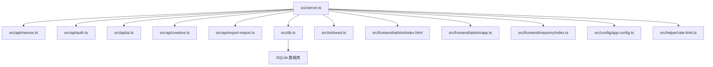
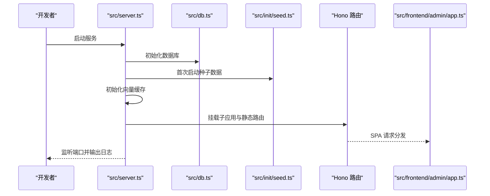
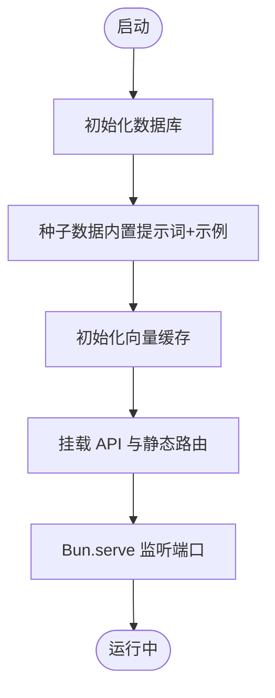
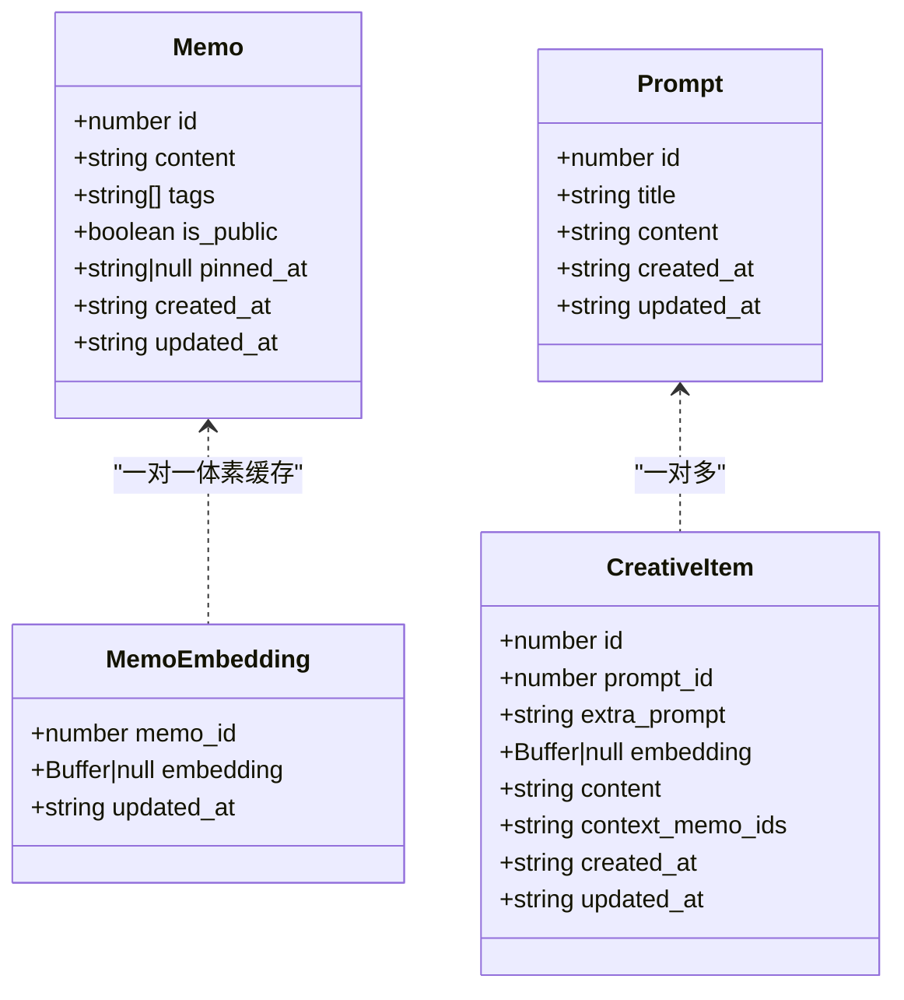
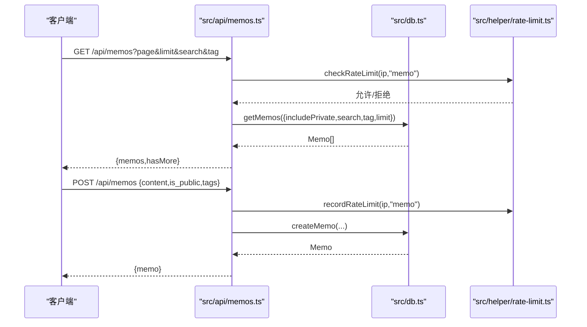
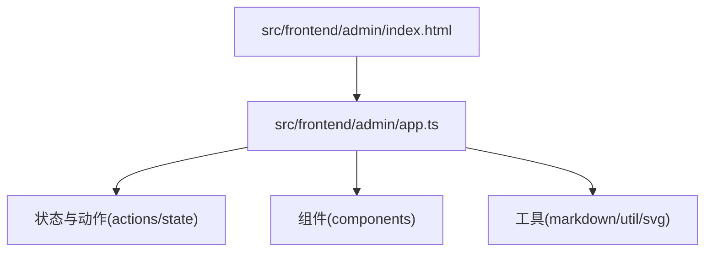
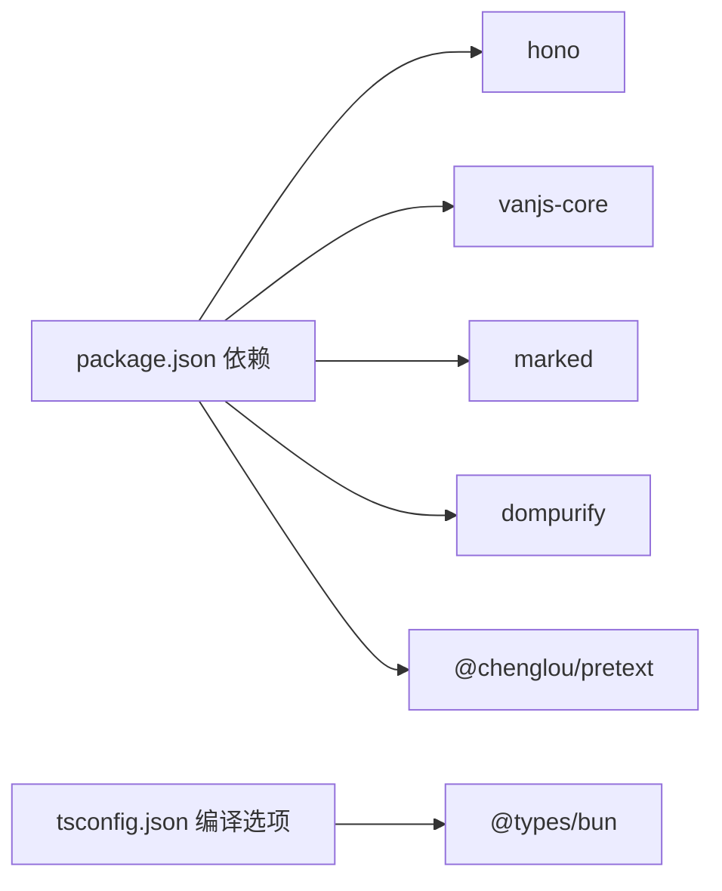

# 开发指南

<cite>
**本文引用的文件**
- [package.json](file://package.json)
- [tsconfig.json](file://tsconfig.json)
- [README.md](file://README.md)
- [src/server.ts](file://src/server.ts)
- [src/db.ts](file://src/db.ts)
- [src/api/memos.ts](file://src/api/memos.ts)
- [src/frontend/admin/index.html](file://src/frontend/admin/index.html)
- [src/frontend/admin/app.ts](file://src/frontend/admin/app.ts)
- [src/frontend/masonry/index.ts](file://src/frontend/masonry/index.ts)
- [src/config/app-config.ts](file://src/config/app-config.ts)
- [src/init/seed.ts](file://src/init/seed.ts)
- [src/helper/rate-limit.ts](file://src/helper/rate-limit.ts)
- [src/model.ts](file://src/model.ts)
- [app.config.json](file://app.config.json)
</cite>

## 目录
1. [简介](#简介)
2. [项目结构](#项目结构)
3. [核心组件](#核心组件)
4. [架构总览](#架构总览)
5. [详细组件分析](#详细组件分析)
6. [依赖关系分析](#依赖关系分析)
7. [性能考量](#性能考量)
8. [调试与排错指南](#调试与排错指南)
9. [测试策略](#测试策略)
10. [构建与打包](#构建与打包)
11. [贡献指南](#贡献指南)
12. [结论](#结论)

## 简介
本指南面向参与 Memos 项目的开发者，覆盖开发环境搭建、代码结构与职责、编码规范、调试与性能分析、测试策略、构建打包以及贡献流程等。项目基于 Bun 运行时，采用 Hono 作为 Web 框架，VanJS 作为前端响应式 UI，SQLite（bun:sqlite）持久化存储，提供瀑布流主页与独立的管理后台。

## 项目结构
- 根目录包含包管理与类型配置、运行时脚本、配置文件与数据模板。
- src 目录为核心源码：
  - server.ts：主服务入口，路由聚合、静态页面与 SPA 分发、数据库与种子数据初始化。
  - api/*：按领域拆分的子应用，如认证、备忘录、AI、创意等。
  - frontend/*：前端模块，admin 为管理后台 SPA，masonry 为首页瀑布流。
  - db.ts：数据库初始化、Schema、CRUD 与查询。
  - config/app-config.ts：应用配置加载器，支持 JSON 配置与回退默认值。
  - init/seed.ts：首次启动的数据种子（内置提示词与示例备忘录）。
  - helper/*：通用工具，如速率限制。
  - model.ts：实体模型定义。
- data/ 与 docs/：数据模板与设计文档。

图表来源
- [src/server.ts:1-125](file://src/server.ts#L1-L125)
- [src/api/memos.ts:1-220](file://src/api/memos.ts#L1-L220)
- [src/db.ts:1-484](file://src/db.ts#L1-L484)
- [src/init/seed.ts:1-118](file://src/init/seed.ts#L1-L118)
- [src/frontend/admin/index.html:1-1076](file://src/frontend/admin/index.html#L1-L1076)
- [src/frontend/admin/app.ts:1-251](file://src/frontend/admin/app.ts#L1-L251)
- [src/frontend/masonry/index.ts:1-23](file://src/frontend/masonry/index.ts#L1-L23)
- [src/config/app-config.ts:1-108](file://src/config/app-config.ts#L1-L108)
- [src/helper/rate-limit.ts:1-153](file://src/helper/rate-limit.ts#L1-L153)

章节来源
- [README.md:25-45](file://README.md#L25-L45)
- [src/server.ts:1-125](file://src/server.ts#L1-L125)

## 核心组件
- 服务入口与路由：主服务负责 API 路由挂载、静态资源与 SPA 分发、数据库与种子数据初始化。
- 数据层：SQLite Schema、CRUD、索引与 JSON 查询；嵌入向量缓存；创意内容表。
- 配置系统：从 app.config.json 加载配置，支持环境变量覆盖与回退默认值。
- 速率限制：基于 IP 的小时/天双窗口计数，支持两类类别。
- 前端：管理后台 SPA（VanJS）、首页瀑布流（VanJS + 预处理文本）。

章节来源
- [src/server.ts:1-125](file://src/server.ts#L1-L125)
- [src/db.ts:1-484](file://src/db.ts#L1-L484)
- [src/config/app-config.ts:1-108](file://src/config/app-config.ts#L1-L108)
- [src/helper/rate-limit.ts:1-153](file://src/helper/rate-limit.ts#L1-L153)

## 架构总览
服务启动流程概览：初始化数据库 → 种子数据 → 向量缓存 → 启动 HTTP 服务器。API 子应用按域划分，前端 SPA 通过静态路由分发。

图表来源
- [src/server.ts:109-125](file://src/server.ts#L109-L125)
- [src/db.ts:15-61](file://src/db.ts#L15-L61)
- [src/init/seed.ts:112-118](file://src/init/seed.ts#L112-L118)

## 详细组件分析

### 服务入口与路由（src/server.ts）
- 职责：聚合 API 子应用、提供静态页面与 SPA、注入 base 标签、处理 404 SPA 回退。
- 关键点：/admin 与 / 端点的 HTML 注入与 SPA 分发；/index.js 与 /admin/app.js 的预构建资源路由；数据库与种子数据初始化顺序。

图表来源
- [src/server.ts:109-125](file://src/server.ts#L109-L125)
- [src/db.ts:15-61](file://src/db.ts#L15-L61)
- [src/init/seed.ts:112-118](file://src/init/seed.ts#L112-L118)

章节来源
- [src/server.ts:1-125](file://src/server.ts#L1-L125)

### 数据层（src/db.ts）
- 职责：数据库连接与 WAL 模式、Schema 初始化、CRUD、标签解析与 JSON 查询、嵌入向量缓存、创意内容管理、导入/导出辅助。
- 关键点：标签字段兼容旧格式；全文检索 LIKE + 语义相似度合并；分页与置顶排序；外键约束与索引。

图表来源
- [src/model.ts:1-35](file://src/model.ts#L1-L35)
- [src/db.ts:18-61](file://src/db.ts#L18-L61)

章节来源
- [src/db.ts:1-484](file://src/db.ts#L1-L484)
- [src/model.ts:1-35](file://src/model.ts#L1-L35)

### 备忘录 API（src/api/memos.ts）
- 职责：列表、计数、标签、相似检索、CRUD、置顶。
- 关键点：搜索支持 LIKE 与语义检索合并；分页；速率限制；内容变更触发向量更新。

图表来源
- [src/api/memos.ts:28-70](file://src/api/memos.ts#L28-L70)
- [src/api/memos.ts:103-144](file://src/api/memos.ts#L103-L144)
- [src/db.ts:122-169](file://src/db.ts#L122-L169)
- [src/helper/rate-limit.ts:77-110](file://src/helper/rate-limit.ts#L77-L110)

章节来源
- [src/api/memos.ts:1-220](file://src/api/memos.ts#L1-L220)
- [src/db.ts:122-250](file://src/db.ts#L122-L250)
- [src/helper/rate-limit.ts:1-153](file://src/helper/rate-limit.ts#L1-L153)

### 管理后台（src/frontend/admin）
- 结构：HTML 模板 + VanJS SPA；状态集中于 state.ts（未在本节展开）；组件化卡片、表单、时间线侧边栏、模型选择器等。
- 关键点：登录密钥认证、导入导出、AI 工具箱、标签云、分页与搜索状态同步至 URL。

图表来源
- [src/frontend/admin/index.html:1-1076](file://src/frontend/admin/index.html#L1-L1076)
- [src/frontend/admin/app.ts:1-251](file://src/frontend/admin/app.ts#L1-L251)

章节来源
- [src/frontend/admin/index.html:1-1076](file://src/frontend/admin/index.html#L1-L1076)
- [src/frontend/admin/app.ts:1-251](file://src/frontend/admin/app.ts#L1-L251)

### 首页瀑布流（src/frontend/masonry）
- 结构：VanJS 组件与状态；从 URL 参数初始化搜索/标签；加载标签与计数；按需渲染。
- 关键点：URL 同步、窗口宽度响应、分页加载。

章节来源
- [src/frontend/masonry/index.ts:1-23](file://src/frontend/masonry/index.ts#L1-L23)

### 配置系统（src/config/app-config.ts）
- 职责：从 app.config.json 加载配置，支持环境变量覆盖，提供回退默认值。
- 关键点：严格类型定义、合并策略、日志提示。

章节来源
- [src/config/app-config.ts:1-108](file://src/config/app-config.ts#L1-L108)
- [app.config.json:1-22](file://app.config.json#L1-L22)

### 速率限制（src/helper/rate-limit.ts）
- 职责：基于 IP 的小时/天双窗口计数，支持两类类别；错误消息格式化。
- 关键点：环境变量优先级高于配置文件，配置文件优先级高于硬编码默认值。

章节来源
- [src/helper/rate-limit.ts:1-153](file://src/helper/rate-limit.ts#L1-L153)

## 依赖关系分析
- 运行时：Bun（SQLite、HTTP 服务器、构建）。
- 依赖：Hono（路由与中间件）、VanJS（UI）、marked、dompurify、pretext。
- 类型：@types/bun 提供 Bun 运行时类型。

图表来源
- [package.json:19-25](file://package.json#L19-L25)
- [tsconfig.json:2-28](file://tsconfig.json#L2-L28)

章节来源
- [package.json:1-26](file://package.json#L1-L26)
- [tsconfig.json:1-30](file://tsconfig.json#L1-L30)

## 性能考量
- 数据库：WAL 模式提升并发写入；JSON 查询与索引配合；分页避免一次性加载过多。
- 前端：瀑布流仅渲染可视区域节点；URL 同步减少重复请求。
- API：搜索合并 LIKE 与语义检索结果，非阻塞；嵌入向量异步生成。
- 构建：Bun.build 输出 ESM，按需编译，减少打包体积。

## 调试与排错指南
- 开发模式：使用热重载启动服务，便于快速迭代。
- 日志：服务启动与错误输出；种子数据与配置加载日志。
- 常见问题：
  - 端口占用：调整环境变量 PORT。
  - 管理后台登录：确认密钥与环境变量 MEMOS_SECRET_KEY。
  - 静态资源 404：检查 dist 产物与路由映射。
  - 速率限制触发：检查环境变量或配置文件中的限额设置。

章节来源
- [README.md:49-81](file://README.md#L49-L81)
- [src/server.ts:119-125](file://src/server.ts#L119-L125)
- [src/config/app-config.ts:57-101](file://src/config/app-config.ts#L57-L101)
- [src/helper/rate-limit.ts:27-39](file://src/helper/rate-limit.ts#L27-L39)

## 测试策略
- 单元测试：针对纯函数与工具模块（如标签解析、速率限制、配置加载）编写断言。
- 集成测试：模拟 API 请求与数据库交互，验证路由、鉴权、CRUD、搜索与分页。
- 端到端测试：使用浏览器自动化（如 Playwright）验证管理后台与首页交互、SPA 深层链接与状态同步。
- 建议：为每个 API 子应用建立独立测试套件；为前端组件提供快照测试与交互测试。

## 构建与打包
- 开发：bun run dev 启动热重载。
- 生产：先执行构建脚本生成 dist，再启动服务。
- 构建命令：
  - 构建瀑布流：bun build src/frontend/masonry/index.ts --outdir=dist/masonry --target=browser --format=esm
  - 构建管理后台：bun build src/frontend/admin/app.ts --outdir=dist/admin --target=browser --format=esm
  - 统一构建：bun run build
- TypeScript 编译：严格模式、bundler 解析、ESNext 目标、JSX 支持。

章节来源
- [package.json:6-11](file://package.json#L6-L11)
- [tsconfig.json:2-28](file://tsconfig.json#L2-L28)

## 贡献指南
- Git 工作流：从 develop 分支派生功能分支，提交前确保通过本地测试与构建。
- 提交信息：遵循约定式提交，清晰描述变更类型与影响范围。
- Pull Request：简述背景与改动点，附上测试与构建结果截图；至少一名代码审查者批准。
- 代码审查：关注可读性、性能、安全性与一致性；确保新增逻辑有配套测试。

## 结论
本指南提供了 Memos 项目的开发全链路说明。建议在本地按环境要求安装 Bun 并完成依赖安装，结合热重载进行迭代开发；利用配置系统与速率限制保障运行稳定性；通过分层架构与模块化组织提升可维护性；最后以完善的测试与构建流程保证交付质量。