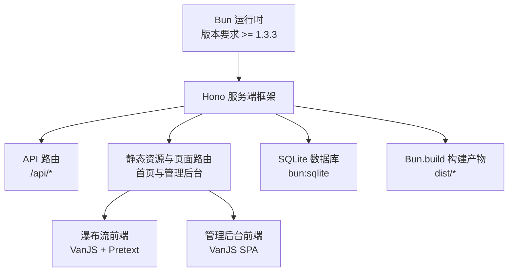
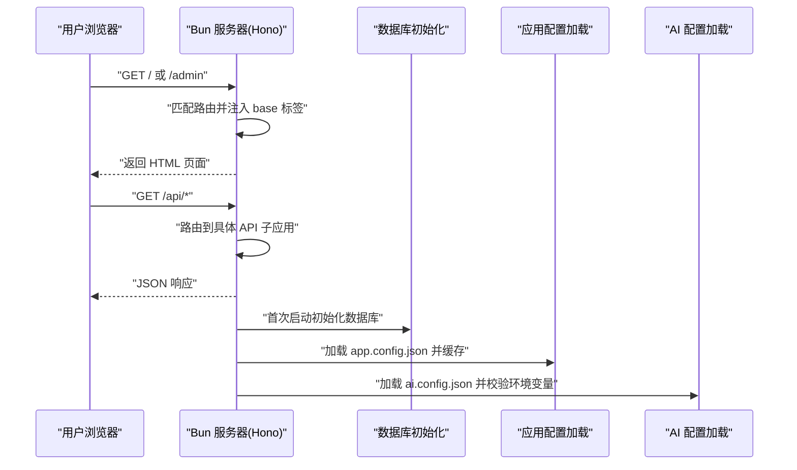
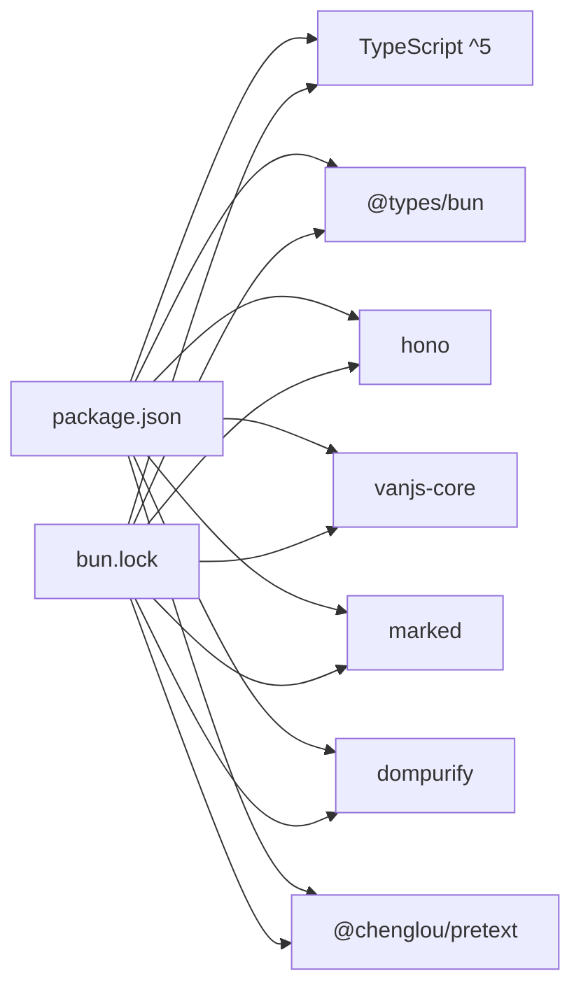

# 开发环境搭建

<cite>
**本文引用的文件**
- [package.json](file://package.json)
- [tsconfig.json](file://tsconfig.json)
- [bun.lock](file://bun.lock)
- [README.md](file://README.md)
- [src/server.ts](file://src/server.ts)
- [src/frontend/masonry/index.ts](file://src/frontend/masonry/index.ts)
- [src/frontend/admin/app.ts](file://src/frontend/admin/app.ts)
- [src/config/app-config.ts](file://src/config/app-config.ts)
- [app.config.json](file://app.config.json)
- [ai.config.json](file://ai.config.json)
- [.gitignore](file://.gitignore)
- [CLAUDE.md](file://CLAUDE.md)
</cite>

## 目录
1. [简介](#简介)
2. [项目结构](#项目结构)
3. [核心组件](#核心组件)
4. [架构总览](#架构总览)
5. [详细组件分析](#详细组件分析)
6. [依赖分析](#依赖分析)
7. [性能考虑](#性能考虑)
8. [故障排查指南](#故障排查指南)
9. [结论](#结论)
10. [附录](#附录)

## 简介
本指南面向希望在本地搭建 Memos 项目的开发者，围绕以下目标展开：  
- 明确运行时与版本要求（Bun 与 TypeScript）  
- 依赖安装与项目初始化流程  
- 包管理器选择与使用（Bun 优先，npm 兼容）  
- TypeScript 编译配置与路径映射  
- IDE 推荐配置（VS Code 扩展、调试、格式化）  
- 环境变量配置（开发与生产差异）  
- 常见问题排查（依赖冲突、路径问题、权限问题）

## 项目结构
该项目采用 Bun 运行时，前端使用 VanJS 和 Pretext，后端基于 Hono 框架，数据库使用 SQLite（bun:sqlite）。  
- 运行时：Bun（>= 1.3.3）  
- 构建：Bun.build（ESM，浏览器目标）  
- 语言：TypeScript（严格模式，bundler 解析）  
- 前端：VanJS（管理后台 SPA）、Pretext（瀑布流页面）  
- 配置：app.config.json（应用配置）、ai.config.json（AI 提供商配置）

章节来源
- [README.md:49-52](file://README.md#L49-L52)
- [package.json:13-25](file://package.json#L13-L25)
- [src/server.ts:119-125](file://src/server.ts#L119-L125)

## 核心组件
- 运行时与包管理器：Bun 作为首选运行时，提供安装、运行与构建能力；同时兼容 npm 生态（用于类型定义与部分工具链）。  
- TypeScript 配置：启用严格模式、bundler 解析、ESNext 目标、JSX 支持等。  
- 构建脚本：分别构建瀑布流与管理后台前端，再启动服务。  
- 配置系统：app.config.json 与 ai.config.json 分别承载应用与 AI 提供商配置。

章节来源
- [package.json:6-11](file://package.json#L6-L11)
- [tsconfig.json:1-30](file://tsconfig.json#L1-L30)
- [src/config/app-config.ts:1-108](file://src/config/app-config.ts#L1-L108)
- [ai.config.json:1-44](file://ai.config.json#L1-L44)

## 架构总览
下图展示了从请求进入、路由分发、静态资源与页面返回，到数据库初始化与 AI 配置加载的整体流程。

图表来源
- [src/server.ts:38-125](file://src/server.ts#L38-L125)
- [src/config/app-config.ts:55-108](file://src/config/app-config.ts#L55-L108)
- [ai.config.json:1-44](file://ai.config.json#L1-L44)

章节来源
- [src/server.ts:119-125](file://src/server.ts#L119-L125)

## 详细组件分析

### 运行时与版本要求
- 运行时：Bun（>= 1.3.3）  
- TypeScript：^5（peerDependencies）  
- 说明：项目脚本与构建均基于 Bun，建议使用 Bun 作为默认运行时；若使用 npm/pnpm/yarn，请仅将其用于安装依赖与类型定义，实际运行仍推荐 Bun。

章节来源
- [README.md:49-52](file://README.md#L49-L52)
- [package.json:16-18](file://package.json#L16-L18)

### 依赖安装与项目初始化
- 使用 Bun 安装依赖：bun install  
- 初始化数据库：首次启动会自动创建 memos.db 并初始化表结构  
- 初始化种子数据：首次启动会写入内置提示与示例备忘录  
- 初始化向量缓存：根据历史备忘录生成嵌入向量并缓存  

章节来源
- [README.md:55-57](file://README.md#L55-L57)
- [README.md:66-72](file://README.md#L66-L72)
- [src/server.ts:110-116](file://src/server.ts#L110-L116)

### 包管理器选择与使用
- 推荐：Bun（install/run/build）  
- 兼容：npm（安装类型定义与部分工具），但请避免混用不同包管理器  
- 版本兼容：TypeScript ^5；Bun Types 与相关类型包已锁定在 lockfile 中  
- 注意：Bun 自动加载 .env，无需额外 dotenv 配置  

章节来源
- [CLAUDE.md:1-9](file://CLAUDE.md#L1-L9)
- [bun.lock:18-20](file://bun.lock#L18-L20)
- [package.json:13-18](file://package.json#L13-L18)

### TypeScript 配置
- 目标与模块：ESNext，bundler 解析，ESM 输出  
- JSX：react-jsx  
- 严格性：开启严格模式，跳过库检查，禁止 switch 漏处理等  
- 无 emit：仅类型检查，不输出 JS  
- 路径映射：通过 bundler 与 moduleDetection: force 实现  
- 允许 JS：允许混合 JS/TS 源码  
- 重要：noEmit 与 bundler 模式配合，构建阶段由 Bun.build 输出 JS  

章节来源
- [tsconfig.json:1-30](file://tsconfig.json#L1-L30)

### 构建与运行脚本
- 开发：bun run dev（监听并热重载）  
- 构建：分别构建瀑布流与管理后台前端  
- 启动：先构建再运行服务端入口  
- 产物：dist 目录（瀑布流与管理后台的 ESM JS 与 HTML）  

章节来源
- [package.json:6-11](file://package.json#L6-L11)
- [src/server.ts:59-98](file://src/server.ts#L59-L98)

### 配置系统
- 应用配置（app.config.json）：AI 请求超时、默认 token 数、温度、相似度阈值、重排策略、限流策略  
- AI 配置（ai.config.json）：提供商列表、默认模型、API Key 环境变量名  
- 运行时加载：app-config.ts 从 JSON 读取并提供内存缓存与回退值  
- 环境变量：PORT、MEMOS_SECRET_KEY（管理后台密钥）  

章节来源
- [app.config.json:1-22](file://app.config.json#L1-L22)
- [ai.config.json:1-44](file://ai.config.json#L1-L44)
- [src/config/app-config.ts:1-108](file://src/config/app-config.ts#L1-L108)
- [README.md:59-65](file://README.md#L59-L65)

### 前端入口与路由
- 瀑布流入口：src/frontend/masonry/index.ts 从 URL 参数读取初始搜索与标签，初始化状态并渲染  
- 管理后台入口：src/frontend/admin/app.ts 作为 VanJS SPA，负责登录、备忘录管理、创意工具等  
- 服务端路由：/ 与 /index.html 返回瀑布流页面；/admin* 返回管理后台页面并注入 base 标签保证静态资源解析正确  

章节来源
- [src/frontend/masonry/index.ts:1-23](file://src/frontend/masonry/index.ts#L1-L23)
- [src/frontend/admin/app.ts:1-200](file://src/frontend/admin/app.ts#L1-L200)
- [src/server.ts:67-98](file://src/server.ts#L67-L98)

## 依赖分析
- 运行时依赖（节选）：Hono（Web 框架）、VanJS（UI）、Marked（Markdown）、DOMPurify（安全）、Pretext（排版）  
- 开发依赖：@types/bun（Bun 类型）  
- TypeScript：^5（peerDependencies）  
- 锁定文件：bun.lock 包含上述依赖及类型包版本信息  

图表来源
- [package.json:13-25](file://package.json#L13-L25)
- [bun.lock:23-47](file://bun.lock#L23-L47)

章节来源
- [package.json:13-25](file://package.json#L13-L25)
- [bun.lock:1-49](file://bun.lock#L1-L49)

## 性能考虑
- 构建：Bun.build 输出 ESM，减少打包体积与冷启动时间  
- 严格类型：tsconfig 的严格模式有助于早期发现潜在性能问题  
- 首次启动：数据库初始化与向量缓存生成可能带来短暂延迟，建议在开发机上预先执行一次  
- 限流：应用配置中包含限流策略，避免过度请求导致性能抖动  

## 故障排查指南
- 依赖冲突或安装失败  
  - 症状：安装时报错或构建失败  
  - 处理：统一使用 Bun 安装；如需 npm 工具，仅用于类型定义；清理 node_modules 与缓存后重试  
  - 参考：包管理器一致性与 peerDependencies 版本要求  
  - 章节来源: [package.json:13-18](file://package.json#L13-L18), [CLAUDE.md:1-9](file://CLAUDE.md#L1-L9)

- 路径问题（静态资源 404 或资源解析错误）  
  - 症状：管理后台或首页样式/脚本加载失败  
  - 处理：确认 dist 目录存在且包含对应 JS；服务端路由已注入 base 标签；检查静态资源路径  
  - 章节来源: [src/server.ts:22-28](file://src/server.ts#L22-L28), [.gitignore:4-6](file://.gitignore#L4-L6)

- 权限问题（数据库无法创建或写入）  
  - 症状：首次启动报数据库写入错误  
  - 处理：确保项目目录可写；删除旧的 memos.db* 文件后重启；检查 .gitignore 中对数据库文件的忽略规则  
  - 章节来源: [.gitignore:35](file://.gitignore#L35), [README.md:66-72](file://README.md#L66-L72)

- 环境变量未生效  
  - 症状：端口不是预期值、管理后台密钥无效  
  - 处理：Bun 自动加载 .env，无需 dotenv；确认 .env 文件存在且键名正确  
  - 章节来源: [CLAUDE.md:9](file://CLAUDE.md#L9), [README.md:59-65](file://README.md#L59-L65)

- TypeScript 类型错误  
  - 症状：类型检查失败  
  - 处理：保持 TypeScript ^5；确保 @types/bun 与相关类型包版本一致；避免混用不同包管理器  
  - 章节来源: [package.json:16-18](file://package.json#L16-L18), [bun.lock:14-16](file://bun.lock#L14-L16)

## 结论
按照本指南完成 Bun 运行时安装、依赖统一、TypeScript 配置与构建脚本后，即可快速启动 Memos 项目。开发阶段建议使用 Bun 的 dev 脚本进行热重载，生产阶段使用 start 脚本完成构建与运行。合理配置环境变量与应用配置文件，可获得稳定可靠的开发体验。

## 附录

### 环境变量配置说明
- PORT：服务器监听端口，默认 3020  
- MEMOS_SECRET_KEY：管理后台登录密钥，默认 123  
- AI 提供商 API Key：根据 ai.config.json 中的 apiKeyEnv 字段设置对应环境变量  
- .env 加载：Bun 自动加载 .env，无需额外配置  

章节来源
- [README.md:59-65](file://README.md#L59-L65)
- [ai.config.json:7,14,21,28](file://ai.config.json#L7,L14,L21,L28)

### IDE 推荐配置（VS Code）
- 扩展：TypeScript Importer、ES7+ React/Redux/React-Native snippets、Prettier、EditorConfig、DotENV  
- 设置要点：  
  - 将 TypeScript 编译器指向项目内 tsserver（TypeScript > Path: Tsserver）  
  - 启用 ESLint/Prettier 保存时格式化  
  - 关闭自动引入 @types/* 的自动安装，统一通过 Bun 安装  
  - 使用 Bun 作为默认终端与任务运行器  
- 调试：  
  - 在 VS Code 中新建 launch.json，使用 Node 调试器运行 Bun 脚本（例如 dev/start）  
  - 或直接在终端使用 bun run dev

[本节为通用实践建议，不直接分析具体文件，故无“章节来源”]