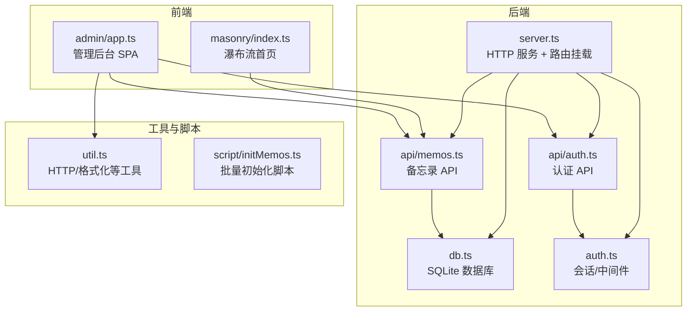
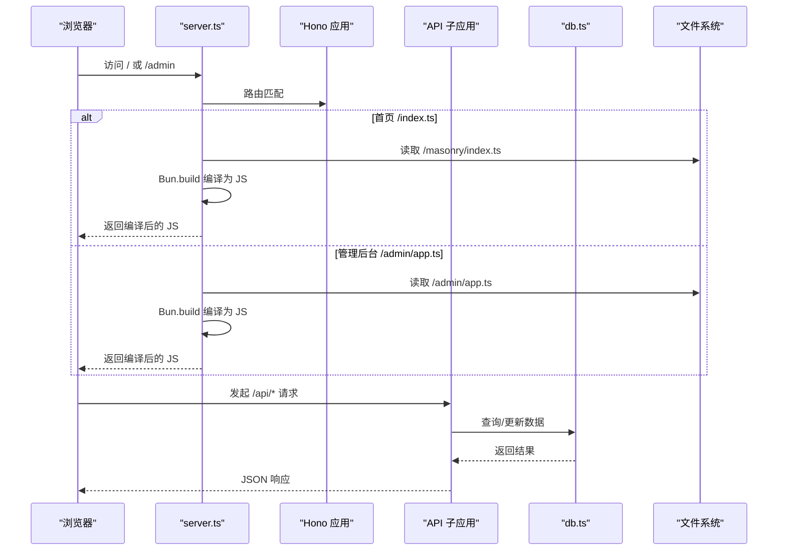
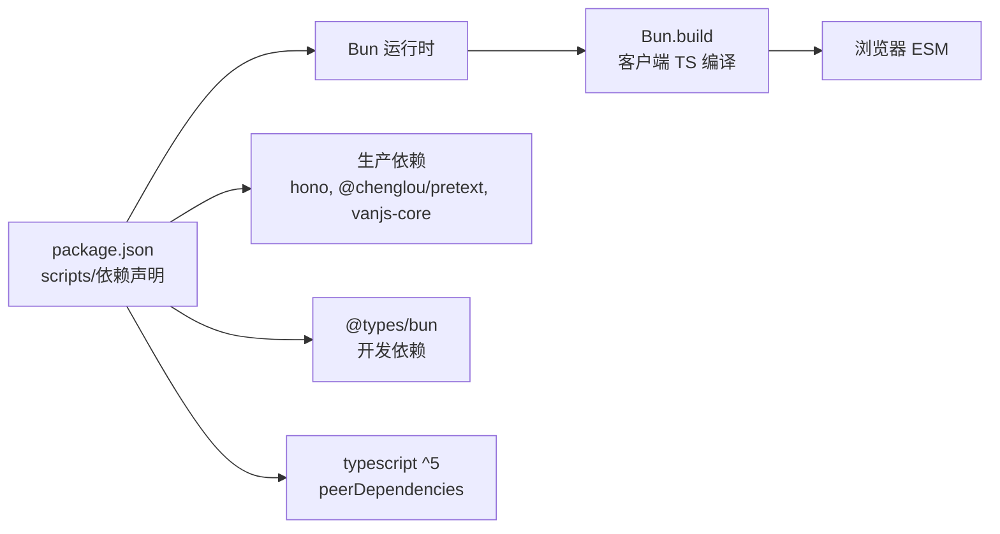

# 开发环境搭建

<cite>
**本文引用的文件**
- [package.json](file://package.json)
- [tsconfig.json](file://tsconfig.json)
- [README.md](file://README.md)
- [bun.lock](file://bun.lock)
- [src/server.ts](file://src/server.ts)
- [src/db.ts](file://src/db.ts)
- [src/auth.ts](file://src/auth.ts)
- [src/api/auth.ts](file://src/api/auth.ts)
- [src/api/memos.ts](file://src/api/memos.ts)
- [src/util.ts](file://src/util.ts)
- [src/admin/app.ts](file://src/admin/app.ts)
- [src/masonry/index.ts](file://src/masonry/index.ts)
- [script/initMemos.ts](file://script/initMemos.ts)
</cite>

## 目录
1. [简介](#简介)
2. [项目结构](#项目结构)
3. [核心组件](#核心组件)
4. [架构总览](#架构总览)
5. [详细组件分析](#详细组件分析)
6. [依赖关系分析](#依赖关系分析)
7. [性能与运行时特性](#性能与运行时特性)
8. [环境变量与配置](#环境变量与配置)
9. [开发工具与 IDE 配置建议](#开发工具与-ide-配置建议)
10. [验证环境配置](#验证环境配置)
11. [常见问题排查](#常见问题排查)
12. [结语](#结语)

## 简介
本指南面向希望在本地搭建并运行 memos 项目的开发者，重点覆盖以下方面：
- Node.js 与 Bun 运行时的安装要求与选择建议
- 项目依赖安装流程（生产依赖与开发依赖）
- TypeScript 配置文件的设置与编译选项说明
- 环境变量配置与使用场景
- 开发工具与 IDE 配置建议
- 如何验证环境配置是否正确
- 常见环境问题的解决方案

## 项目结构
memos 是一个基于 Bun 运行时的全栈应用，采用模块化组织方式：
- 后端服务入口与路由：src/server.ts
- 数据层：src/db.ts（SQLite + WAL 模式）
- 认证与会话：src/auth.ts、src/api/auth.ts
- API 子应用：src/api/memos.ts、src/api/ai.ts、src/api/creative.ts
- 前端（瀑布流首页）：src/masonry/index.ts（基于 @chenglou/pretext）
- 前端（管理后台）：src/admin/app.ts（基于 vanjs-core）
- 工具函数：src/util.ts
- 初始化脚本：script/initMemos.ts
- 构建与运行脚本：package.json 中的 scripts 字段
- TypeScript 配置：tsconfig.json
- 依赖锁文件：bun.lock

图表来源
- [src/server.ts:1-127](file://src/server.ts#L1-L127)
- [src/db.ts:1-349](file://src/db.ts#L1-L349)
- [src/auth.ts:1-111](file://src/auth.ts#L1-L111)
- [src/api/auth.ts:1-77](file://src/api/auth.ts#L1-L77)
- [src/api/memos.ts:1-139](file://src/api/memos.ts#L1-L139)
- [src/masonry/index.ts:1-391](file://src/masonry/index.ts#L1-L391)
- [src/admin/app.ts:1-677](file://src/admin/app.ts#L1-L677)
- [src/util.ts:1-43](file://src/util.ts#L1-L43)
- [script/initMemos.ts:1-62](file://script/initMemos.ts#L1-L62)

章节来源
- [README.md:25-46](file://README.md#L25-L46)
- [src/server.ts:74-127](file://src/server.ts#L74-L127)

## 核心组件
- 服务入口与路由：负责挂载 API 子应用、静态页面与客户端 TS 的按需转译（Bun.build），并启动 HTTP 服务。
- 数据层：封装 SQLite 初始化、表结构、CRUD 与统计查询；启用 WAL 模式与外键约束。
- 认证与中间件：基于内存会话与 Cookie，提供登录/登出/状态检查与速率限制。
- API 子应用：提供认证 API 与备忘录 API，支持搜索、标签筛选、计数与嵌入向量缓存。
- 前端瀑布流：使用 @chenglou/pretext 进行文本预排版，实现自适应列数、虚拟滚动与 URL 同步。
- 管理后台：基于 vanjs-core 的 SPA，提供登录、创建/编辑/删除备忘录、AI 优化与标签建议等功能。
- 工具函数：统一的 HTTP 响应与请求封装、日期格式化、字符串截断等。
- 初始化脚本：从文本文件批量导入备忘录，去重并插入数据库。

章节来源
- [src/server.ts:1-127](file://src/server.ts#L1-L127)
- [src/db.ts:1-349](file://src/db.ts#L1-L349)
- [src/auth.ts:1-111](file://src/auth.ts#L1-L111)
- [src/api/auth.ts:1-77](file://src/api/auth.ts#L1-L77)
- [src/api/memos.ts:1-139](file://src/api/memos.ts#L1-L139)
- [src/masonry/index.ts:1-391](file://src/masonry/index.ts#L1-L391)
- [src/admin/app.ts:1-677](file://src/admin/app.ts#L1-L677)
- [src/util.ts:1-43](file://src/util.ts#L1-L43)
- [script/initMemos.ts:1-62](file://script/initMemos.ts#L1-L62)

## 架构总览
memos 采用“服务端按需编译 + 前端 SPA”的混合架构：
- 服务端使用 Hono 作为路由框架，Bun.serve 提供 HTTP 服务。
- 客户端 TS 文件通过 Bun.build 在请求时按需编译为 ESM，结合 mtime 缓存提升性能。
- 前端瀑布流与管理后台分别通过静态 HTML + 动态 JS 的方式加载。
- 数据持久化使用 SQLite（bun:sqlite），WAL 模式提升并发写入性能。

图表来源
- [src/server.ts:15-72](file://src/server.ts#L15-L72)
- [src/api/memos.ts:1-139](file://src/api/memos.ts#L1-L139)
- [src/db.ts:15-57](file://src/db.ts#L15-L57)

## 详细组件分析

### 服务端入口与路由（server.ts）
- 端口与静态基路径：从环境变量读取端口，默认 3020；静态资源根目录指向 import.meta.dir。
- 客户端 TS 按需编译：buildClientJs 使用 Bun.build 对 .ts 文件进行浏览器目标的 ESM 编译，并以 mtime 缓存结果。
- 静态页面与 SPA：对 /admin 与 / 路径提供 HTML 页面与 .ts 到 .js 的编译代理；对未命中路径进行 SPA 回退。
- 初始化：启动前调用 initDb 与 initEmbeddingCache，确保数据库与向量缓存可用。
- 启动：Bun.serve 监听指定端口并转发 fetch 请求给 Hono 应用。

章节来源
- [src/server.ts:9-127](file://src/server.ts#L9-L127)

### 数据层（db.ts）
- 数据库连接：延迟初始化，开启 WAL 模式与外键约束。
- 表结构：memos、memo_embeddings、prompts、creative。
- CRUD 与查询：提供备忘录的增删改查、标签聚合、计数、嵌入向量的保存与清理等。
- 嵌入向量：提供获取、保存、删除嵌入向量的辅助方法，用于语义检索。

章节来源
- [src/db.ts:15-57](file://src/db.ts#L15-L57)
- [src/db.ts:99-131](file://src/db.ts#L99-L131)
- [src/db.ts:197-221](file://src/db.ts#L197-L221)

### 认证与中间件（auth.ts 与 api/auth.ts）
- 会话存储：基于内存 Set 存储 token，服务重启即失效。
- Cookie 策略：HttpOnly + SameSite=Strict + Max-Age=86400。
- 登录速率限制：按 IP 维护尝试次数与冷却时间，超过阈值返回 429。
- SECRET_KEY：优先从环境变量读取；生产环境未设置时会致命退出并提示。
- 中间件：requireAuth 与 authMiddleware 用于保护受保护的 API。

章节来源
- [src/auth.ts:1-111](file://src/auth.ts#L1-L111)
- [src/api/auth.ts:14-27](file://src/api/auth.ts#L14-L27)
- [src/api/auth.ts:36-77](file://src/api/auth.ts#L36-L77)

### 备忘录 API（api/memos.ts）
- 查询：支持搜索（LIKE）、标签筛选、是否包含私有备忘录（需认证）。
- 语义检索：可选地与 LIKE 结果合并，非阻塞执行。
- 创建/更新/删除：鉴权后操作；更新时可触发嵌入向量重新生成；删除时清理嵌入缓存。

章节来源
- [src/api/memos.ts:20-47](file://src/api/memos.ts#L20-L47)
- [src/api/memos.ts:62-91](file://src/api/memos.ts#L62-L91)
- [src/api/memos.ts:93-139](file://src/api/memos.ts#L93-L139)

### 前端瀑布流（masonry/index.ts）
- 文本预排版：使用 @chenglou/pretext 进行精确的高度计算。
- 布局算法：根据窗口宽度计算列数与列宽，维护列高度数组，选择最短列插入卡片。
- 虚拟滚动：只渲染可视区域卡片，滚动时动态回收/创建 DOM 节点。
- URL 同步：搜索与标签状态同步到 URL 参数，支持前进/后退与书签。

章节来源
- [src/masonry/index.ts:146-269](file://src/masonry/index.ts#L146-L269)
- [src/masonry/index.ts:308-351](file://src/masonry/index.ts#L308-L351)

### 管理后台（admin/app.ts）
- 登录流程：通过 /api/auth/login 获取 Cookie，随后加载备忘录列表。
- 表单：支持创建/编辑备忘录，含内容、标签与公开/私密切换。
- AI 集成：可调用 /api/ai/optimize 与 /api/ai/suggest-tags（若可用）。
- 时间线：按年/月分组展示备忘录，支持展开/折叠与跳转。

章节来源
- [src/admin/app.ts:40-87](file://src/admin/app.ts#L40-L87)
- [src/admin/app.ts:142-197](file://src/admin/app.ts#L142-L197)
- [src/admin/app.ts:260-315](file://src/admin/app.ts#L260-L315)

### 工具函数（util.ts）
- 统一 JSON 响应与错误处理。
- HTTP 客户端封装：自动携带同源 Cookie，统一错误抛出。
- 日期格式化与字符串截断。

章节来源
- [src/util.ts:1-43](file://src/util.ts#L1-L43)

### 初始化脚本（script/initMemos.ts）
- 从 memos.txt 读取条目，按 "---" 分割并去空白。
- 去重：基于现有内容集合避免重复插入。
- 批量插入：逐条插入并统计成功/跳过/失败数量。

章节来源
- [script/initMemos.ts:1-62](file://script/initMemos.ts#L1-L62)

## 依赖关系分析
- 运行时与构建：Bun（>= 1.3.3），Bun.build 用于客户端 TS 编译。
- 依赖管理：bun install 安装生产依赖与开发依赖。
- TypeScript：通过 tsconfig.json 设置严格模式与 bundler 模式，配合 Bun 的模块解析。
- 关键依赖：
  - Hono：Web 框架
  - @chenglou/pretext：文本预排版与高度计算
  - vanjs-core：前端响应式 UI
  - bun:sqlite：SQLite 数据库

图表来源
- [package.json:6-21](file://package.json#L6-L21)
- [bun.lock:4-18](file://bun.lock#L4-L18)
- [tsconfig.json:11-15](file://tsconfig.json#L11-L15)

章节来源
- [package.json:1-22](file://package.json#L1-L22)
- [bun.lock:1-38](file://bun.lock#L1-L38)
- [tsconfig.json:1-30](file://tsconfig.json#L1-L30)

## 性能与运行时特性
- 客户端 TS 编译缓存：基于 mtime 的 Map 缓存，避免重复编译。
- SQLite WAL 模式：提升并发写入性能与崩溃恢复能力。
- 前端瀑布流虚拟滚动：仅渲染可视区域卡片，降低 DOM 负担。
- Bun.serve：内置 HTTP 服务器，无需额外 Node.js 运行时。

章节来源
- [src/server.ts:13-51](file://src/server.ts#L13-L51)
- [src/db.ts:8-13](file://src/db.ts#L8-L13)
- [src/masonry/index.ts:217-269](file://src/masonry/index.ts#L217-L269)

## 环境变量与配置
- 端口 PORT：默认 3020，可通过环境变量覆盖。
- 管理员密钥 MEMOS_SECRET_KEY：用于 /api/auth/login 的认证；生产环境必须设置，否则会致命退出。
- NODE_ENV：影响 SECRET_KEY 的警告行为（生产环境未设置时会致命退出）。

章节来源
- [README.md:59-65](file://README.md#L59-L65)
- [src/api/auth.ts:14-27](file://src/api/auth.ts#L14-L27)

## 开发工具与 IDE 配置建议
- 运行时选择
  - 推荐使用 Bun（>= 1.3.3），以获得最佳兼容性和性能。
  - 不建议使用 Node.js，因为项目使用了 Bun 特有的 API（如 bun:sqlite、Bun.build、Bun.serve）。
- TypeScript 支持
  - 安装 TypeScript ^5（peerDependencies）以获得类型检查与语言特性。
  - 使用 Bun 的 bundler 模式与 noEmit 配置，适合开发时的即时编译与类型检查。
- IDE 建议
  - VS Code：安装 Bun 与 TypeScript 相关扩展，启用 ESLint/Prettier（如已配置）。
  - 保持 tsconfig.json 的 strict 与 skipLibCheck 等严格选项，有助于早期发现潜在问题。
- 开发脚本
  - 开发模式：bun run dev（热重载）
  - 生产模式：bun run start

章节来源
- [README.md:49-52](file://README.md#L49-L52)
- [package.json:6-8](file://package.json#L6-L8)
- [tsconfig.json:11-27](file://tsconfig.json#L11-L27)

## 验证环境配置
- 安装与依赖
  - 执行 bun install，确保生产依赖与开发依赖均已安装。
- 运行服务
  - 执行 bun run dev，观察控制台输出“Memos server running at http://localhost:3020”。
- 访问页面
  - 浏览器访问 http://localhost:3020 查看首页瀑布流。
  - 访问 http://localhost:3020/admin 查看管理后台。
- 认证测试
  - 使用默认密钥 memos-dev-test 登录管理后台（生产环境请设置 MEMOS_SECRET_KEY）。
- 数据库初始化
  - 首次启动会自动创建 memos.db 与表结构。
- 初始化脚本
  - 可选：执行 script/initMemos.ts 导入示例备忘录。

章节来源
- [README.md:53-81](file://README.md#L53-L81)
- [src/server.ts:114-127](file://src/server.ts#L114-L127)
- [src/api/auth.ts:14-27](file://src/api/auth.ts#L14-L27)
- [script/initMemos.ts:1-62](file://script/initMemos.ts#L1-L62)

## 常见问题排查
- 无法启动或端口占用
  - 检查 PORT 是否被占用；可设置环境变量 PORT=新端口。
- 认证失败或登录频繁被限流
  - 确认 MEMOS_SECRET_KEY 设置；生产环境必须设置。
  - 观察登录速率限制日志，等待冷却时间结束。
- 客户端 TS 编译失败
  - 检查 Bun 版本是否满足 >= 1.3.3。
  - 清理 build 缓存（删除 mtime 缓存相关逻辑中的缓存项）后重试。
- 数据库异常
  - 确认 memos.db 文件可写；检查 SQLite 权限。
- 管理后台空白或报错
  - 确认 /admin/app.ts 能被正确编译与返回；检查网络面板与控制台错误。
- 初始化脚本失败
  - 确认 memos.txt 存在且可读；检查内容格式与编码。

章节来源
- [src/server.ts:15-51](file://src/server.ts#L15-L51)
- [src/api/auth.ts:36-77](file://src/api/auth.ts#L36-L77)
- [src/db.ts:15-57](file://src/db.ts#L15-L57)
- [script/initMemos.ts:10-17](file://script/initMemos.ts#L10-L17)

## 结语
按照本指南完成 Bun 运行时安装、依赖安装与环境变量配置后，即可顺利启动并运行 memos 项目。开发过程中建议保持 Bun 版本与依赖版本一致，并充分利用 TypeScript 的严格模式与 Bun 的按需编译能力，以获得更佳的开发体验与运行性能。