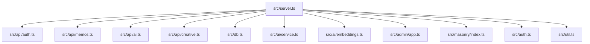
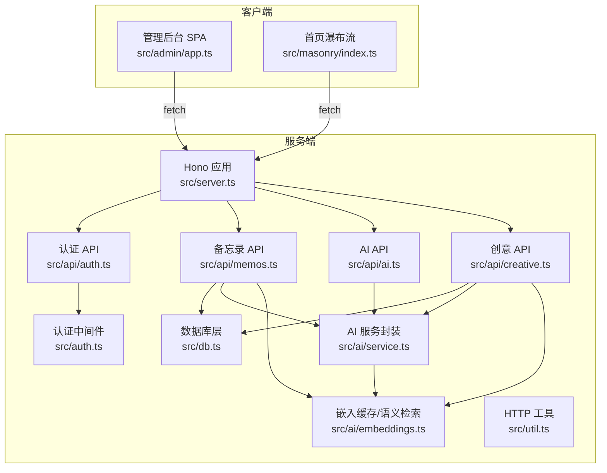
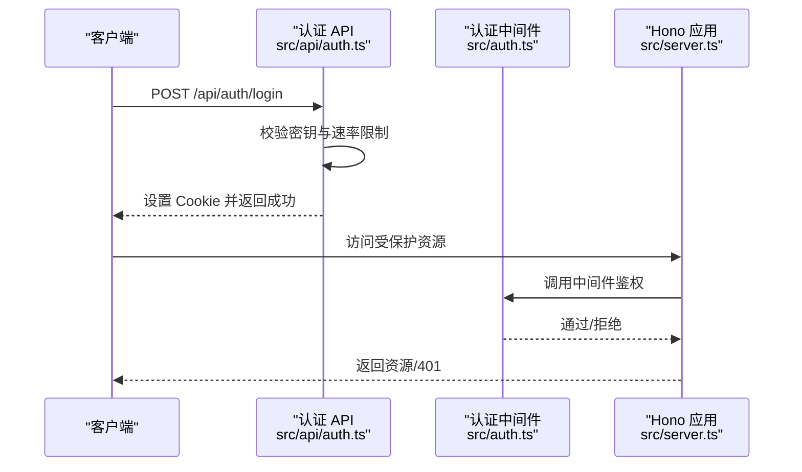
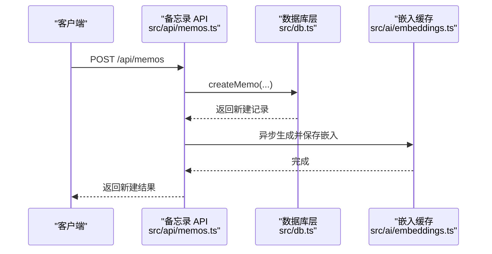
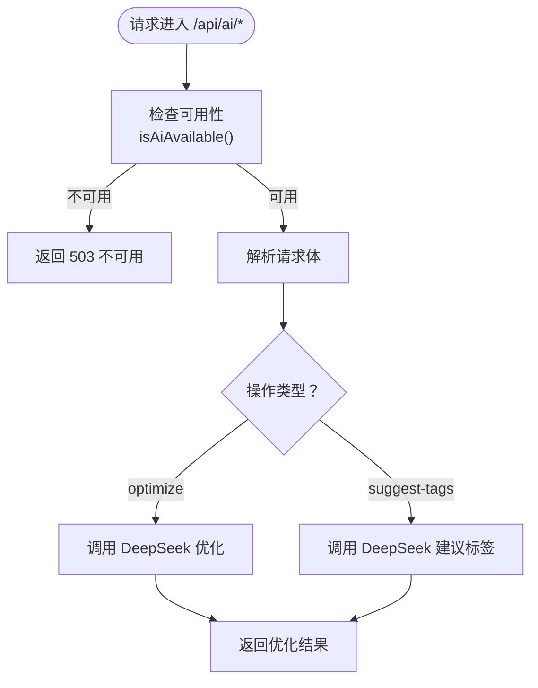
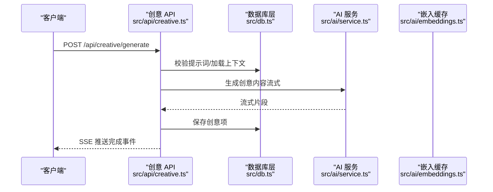
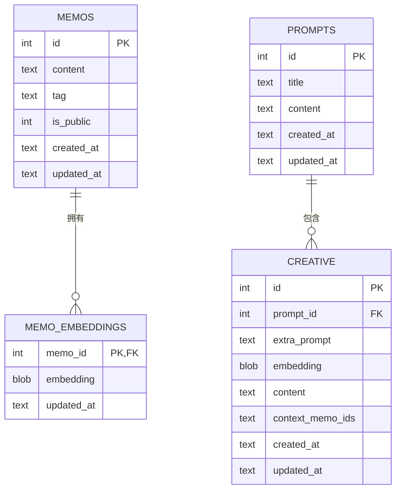
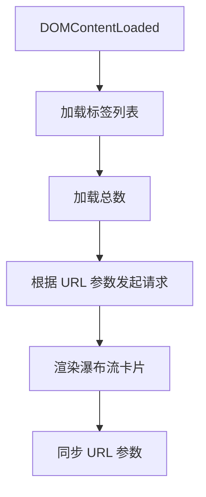
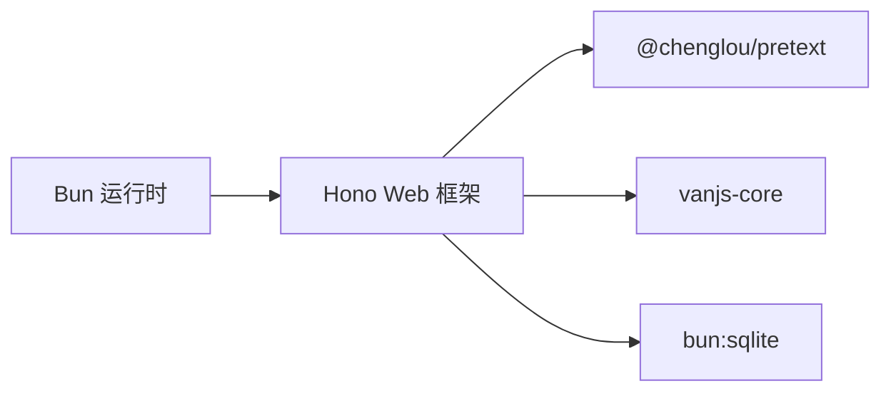

# 扩展与定制

<cite>
**本文引用的文件**   
- [README.md](file://README.md)
- [package.json](file://package.json)
- [tsconfig.json](file://tsconfig.json)
- [src/server.ts](file://src/server.ts)
- [src/db.ts](file://src/db.ts)
- [src/model.ts](file://src/model.ts)
- [src/auth.ts](file://src/auth.ts)
- [src/api/auth.ts](file://src/api/auth.ts)
- [src/api/memos.ts](file://src/api/memos.ts)
- [src/api/ai.ts](file://src/api/ai.ts)
- [src/api/creative.ts](file://src/api/creative.ts)
- [src/ai/service.ts](file://src/ai/service.ts)
- [src/ai/embeddings.ts](file://src/ai/embeddings.ts)
- [src/admin/app.ts](file://src/admin/app.ts)
- [src/masonry/index.ts](file://src/masonry/index.ts)
- [src/util.ts](file://src/util.ts)
- [script/initMemos.ts](file://script/initMemos.ts)
</cite>

## 目录
1. [简介](#简介)
2. [项目结构](#项目结构)
3. [核心组件](#核心组件)
4. [架构总览](#架构总览)
5. [详细组件分析](#详细组件分析)
6. [依赖关系分析](#依赖关系分析)
7. [性能考虑](#性能考虑)
8. [故障排查指南](#故障排查指南)
9. [结论](#结论)
10. [附录](#附录)

## 简介
本指南面向希望在 memos 项目上进行扩展与定制的开发者，覆盖以下主题：
- 新增 API 端点与功能模块
- 插件化与中间件扩展思路
- 自定义主题与样式定制
- 数据库表结构扩展与迁移策略
- 第三方服务集成（AI、嵌入等）
- 前端组件扩展与新页面开发
- 配置文件与环境变量定制
- 性能优化与功能增强最佳实践
- 版本升级与兼容性维护策略

## 项目结构
项目采用“服务端路由 + 前端 SPA”的分层设计，核心目录与职责如下：
- src/server.ts：Hono 应用入口，统一挂载子应用与静态资源路由
- src/api/*：按功能拆分的 API 子应用（认证、备忘录、AI、创意）
- src/db.ts：SQLite 数据层封装与表结构定义
- src/ai/*：AI 能力封装（服务调用、嵌入缓存、语义检索）
- src/admin/app.ts：管理后台 SPA（VanJS）
- src/masonry/index.ts：首页瀑布流前端逻辑（@chenglou/pretext）
- script/initMemos.ts：数据库初始化与种子数据导入脚本

**图表来源**
- [src/server.ts:74-127](file://src/server.ts#L74-L127)
- [src/api/auth.ts:29](file://src/api/auth.ts#L29)
- [src/api/memos.ts:18](file://src/api/memos.ts#L18)
- [src/api/ai.ts:6](file://src/api/ai.ts#L6)
- [src/api/creative.ts:22](file://src/api/creative.ts#L22)
- [src/db.ts:15-57](file://src/db.ts#L15-L57)
- [src/ai/service.ts:1-289](file://src/ai/service.ts#L1-L289)
- [src/ai/embeddings.ts:1-99](file://src/ai/embeddings.ts#L1-L99)
- [src/admin/app.ts:1-677](file://src/admin/app.ts#L1-L677)
- [src/masonry/index.ts:1-391](file://src/masonry/index.ts#L1-L391)
- [src/auth.ts:1-111](file://src/auth.ts#L1-L111)
- [src/util.ts:1-43](file://src/util.ts#L1-L43)

**章节来源**
- [README.md:25-45](file://README.md#L25-L45)
- [src/server.ts:74-127](file://src/server.ts#L74-L127)

## 核心组件
- 服务入口与路由
  - Hono 应用在服务入口中注册 API 子应用与静态页面路由，支持 /admin 与首页的 SPA 深度链接。
- 认证与会话
  - 基于内存会话与 Cookie 的简单认证，提供登录、登出、状态检查与中间件鉴权。
- 数据层
  - SQLite 初始化、CRUD 封装、嵌入缓存与提示词/创意内容管理。
- AI 能力
  - 内容优化、标签建议、嵌入生成、创意内容生成（含流式输出）、语义检索。
- 前端
  - 管理后台 SPA（VanJS），首页瀑布流（@chenglou/pretext），支持搜索、标签筛选、URL 同步。

**章节来源**
- [src/server.ts:74-127](file://src/server.ts#L74-L127)
- [src/auth.ts:28-111](file://src/auth.ts#L28-L111)
- [src/db.ts:15-57](file://src/db.ts#L15-L57)
- [src/ai/service.ts:12-289](file://src/ai/service.ts#L12-L289)
- [src/ai/embeddings.ts:12-99](file://src/ai/embeddings.ts#L12-L99)
- [src/admin/app.ts:1-677](file://src/admin/app.ts#L1-L677)
- [src/masonry/index.ts:1-391](file://src/masonry/index.ts#L1-L391)

## 架构总览
整体采用“服务端路由 + 前端 SPA”架构，API 以子应用形式挂载，前端通过 fetch 与 API 交互，管理后台与首页分别承载不同业务场景。

**图表来源**
- [src/server.ts:74-127](file://src/server.ts#L74-L127)
- [src/api/auth.ts:29](file://src/api/auth.ts#L29)
- [src/api/memos.ts:18](file://src/api/memos.ts#L18)
- [src/api/ai.ts:6](file://src/api/ai.ts#L6)
- [src/api/creative.ts:22](file://src/api/creative.ts#L22)
- [src/db.ts:15-57](file://src/db.ts#L15-L57)
- [src/ai/service.ts:12-289](file://src/ai/service.ts#L12-L289)
- [src/ai/embeddings.ts:12-99](file://src/ai/embeddings.ts#L12-L99)
- [src/auth.ts:95-111](file://src/auth.ts#L95-L111)
- [src/util.ts:9-20](file://src/util.ts#L9-L20)

## 详细组件分析

### 认证与会话扩展
- 扩展点
  - 替换内存会话为持久化存储（如 Redis/数据库）
  - 引入多用户/角色模型
  - 增加速率限制策略与安全头
- 关键实现位置
  - 会话与 Cookie 管理、登录速率限制、中间件鉴权
- 建议
  - 使用更健壮的令牌机制（如 JWT），并配合 HTTPS 与 SameSite 策略
  - 对敏感操作增加二次校验或验证码

**图表来源**
- [src/api/auth.ts:36-77](file://src/api/auth.ts#L36-L77)
- [src/auth.ts:95-111](file://src/auth.ts#L95-L111)
- [src/server.ts:74-80](file://src/server.ts#L74-L80)

**章节来源**
- [src/auth.ts:28-111](file://src/auth.ts#L28-L111)
- [src/api/auth.ts:14-77](file://src/api/auth.ts#L14-L77)

### 备忘录 API 扩展
- 当前能力
  - 列表、计数、标签、创建、更新、删除；支持全文检索与语义检索融合
- 扩展方向
  - 新增字段（如优先级、到期时间、附件）、标签体系优化、富文本支持
  - 引入分页、排序、过滤器组合查询
- 关键实现位置
  - 路由与鉴权中间件、数据库 CRUD、嵌入生成与清理

**图表来源**
- [src/api/memos.ts:62-91](file://src/api/memos.ts#L62-L91)
- [src/db.ts:158-169](file://src/db.ts#L158-L169)
- [src/ai/embeddings.ts:88-99](file://src/ai/embeddings.ts#L88-L99)

**章节来源**
- [src/api/memos.ts:18-139](file://src/api/memos.ts#L18-L139)
- [src/db.ts:99-195](file://src/db.ts#L99-L195)
- [src/ai/embeddings.ts:12-99](file://src/ai/embeddings.ts#L12-L99)

### AI 能力扩展
- 当前能力
  - 内容优化、标签建议、嵌入生成、创意内容生成（含流式输出）、语义检索
- 扩展方向
  - 支持多模型/多供应商（OpenAI、Anthropic、本地模型）
  - 引入上下文记忆、提示词模板管理、生成质量评估
- 关键实现位置
  - AI 服务封装、嵌入缓存与相似度计算

**图表来源**
- [src/api/ai.ts:8-67](file://src/api/ai.ts#L8-L67)
- [src/ai/service.ts:12-137](file://src/ai/service.ts#L12-L137)

**章节来源**
- [src/api/ai.ts:1-67](file://src/api/ai.ts#L1-L67)
- [src/ai/service.ts:12-289](file://src/ai/service.ts#L12-L289)

### 创意内容模块扩展
- 当前能力
  - 提示词 CRUD、创意内容生成（流式）、语义检索辅助上下文
- 扩展方向
  - 上下文选择策略（手动/自动）、生成历史管理、导出/分享
- 关键实现位置
  - 提示词与创意项的 CRUD、流式生成与 SSE 输出

**图表来源**
- [src/api/creative.ts:112-228](file://src/api/creative.ts#L112-L228)
- [src/db.ts:284-348](file://src/db.ts#L284-L348)
- [src/ai/service.ts:185-289](file://src/ai/service.ts#L185-L289)
- [src/ai/embeddings.ts:66-86](file://src/ai/embeddings.ts#L66-L86)

**章节来源**
- [src/api/creative.ts:1-238](file://src/api/creative.ts#L1-L238)
- [src/db.ts:284-348](file://src/db.ts#L284-L348)
- [src/ai/service.ts:185-289](file://src/ai/service.ts#L185-L289)
- [src/ai/embeddings.ts:66-86](file://src/ai/embeddings.ts#L66-L86)

### 数据库层扩展与迁移
- 当前表结构
  - memos、memo_embeddings、prompts、creative
- 扩展策略
  - 新增表或列时，先在 initDb 中创建，再在模型与 CRUD 函数中适配
  - 迁移采用“版本号 + 升级函数”的方式，避免破坏现有数据
- 关键实现位置
  - 初始化与建表、模型定义、CRUD 函数

**图表来源**
- [src/db.ts:17-56](file://src/db.ts#L17-L56)
- [src/model.ts:1-28](file://src/model.ts#L1-L28)

**章节来源**
- [src/db.ts:15-57](file://src/db.ts#L15-L57)
- [src/model.ts:1-28](file://src/model.ts#L1-L28)

### 前端扩展与新页面开发
- 管理后台（VanJS）
  - 状态驱动、组件化、Tab 切换、表单与列表、错误处理
- 首页瀑布流（@chenglou/pretext）
  - 自适应列数、虚拟滚动、搜索与标签筛选、URL 同步
- 扩展建议
  - 新页面：在 server.ts 注册路由，SPA 中新增 Tab 或页面组件
  - 组件复用：将通用 UI 抽象为可复用组件，保持一致的样式与交互

**图表来源**
- [src/masonry/index.ts:356-391](file://src/masonry/index.ts#L356-L391)
- [src/masonry/index.ts:308-351](file://src/masonry/index.ts#L308-L351)

**章节来源**
- [src/admin/app.ts:570-677](file://src/admin/app.ts#L570-L677)
- [src/masonry/index.ts:1-391](file://src/masonry/index.ts#L1-L391)

## 依赖关系分析
- 运行时与依赖
  - Bun、Hono、@chenglou/pretext、vanjs-core
- 构建与打包
  - 服务端按需编译 TS→JS，静态资源路由与转译
- 外部集成
  - AI 服务通过标准 fetch 调用，支持多供应商适配

**图表来源**
- [package.json:16-20](file://package.json#L16-L20)
- [src/server.ts:13-51](file://src/server.ts#L13-L51)

**章节来源**
- [package.json:1-22](file://package.json#L1-22)
- [src/server.ts:13-51](file://src/server.ts#L13-L51)

## 性能考虑
- 服务端
  - 客户端 JS 按需构建与缓存（mtime 校验），减少重复编译
  - 嵌入缓存使用内存向量与阈值相似度匹配，降低数据库压力
- 前端
  - 首页瀑布流采用虚拟滚动与可视区域渲染，提升大列表性能
  - 搜索输入防抖，减少请求频率
- 建议
  - 对高频接口引入缓存（如标签列表、统计）
  - 对 AI 生成引入超时与重试策略，避免阻塞

**章节来源**
- [src/server.ts:13-51](file://src/server.ts#L13-L51)
- [src/ai/embeddings.ts:12-99](file://src/ai/embeddings.ts#L12-L99)
- [src/masonry/index.ts:217-270](file://src/masonry/index.ts#L217-L270)
- [src/masonry/index.ts:354-367](file://src/masonry/index.ts#L354-L367)

## 故障排查指南
- 认证相关
  - 密钥不正确或触发速率限制：检查密钥与日志，确认生产环境必须设置密钥
- API 请求
  - 400/401/404：核对请求体格式、鉴权状态与路径参数
  - 500/503：AI 服务不可用或网络异常，检查环境变量与网络连通性
- 前端
  - 加载失败：检查静态资源路由与转译是否成功
  - 瀑布流空白：确认请求返回与 URL 参数同步逻辑

**章节来源**
- [src/api/auth.ts:36-77](file://src/api/auth.ts#L36-L77)
- [src/api/ai.ts:8-67](file://src/api/ai.ts#L8-L67)
- [src/admin/app.ts:38-87](file://src/admin/app.ts#L38-L87)
- [src/masonry/index.ts:308-351](file://src/masonry/index.ts#L308-L351)

## 结论
memos 项目提供了清晰的分层架构与可扩展点。通过在现有 API 子应用、数据库层与前端 SPA 中注入新模块，即可快速实现功能增强与定制化需求。建议在扩展过程中遵循“最小改动、最大收益”的原则，并结合性能与安全最佳实践，确保系统的稳定性与可维护性。

## 附录

### 新增 API 端点步骤
- 在对应子应用中新增路由与处理器
- 在数据库层补充必要的 CRUD 函数
- 在前端侧调用新接口并更新 UI

**章节来源**
- [src/api/memos.ts:18-139](file://src/api/memos.ts#L18-L139)
- [src/db.ts:99-195](file://src/db.ts#L99-L195)
- [src/util.ts:9-20](file://src/util.ts#L9-L20)

### 插件化与中间件扩展
- 中间件：在 Hono 应用中注册全局中间件，实现统一鉴权、限流、日志
- 插件：将通用能力抽象为模块，按需挂载到主应用

**章节来源**
- [src/server.ts:74-80](file://src/server.ts#L74-L80)
- [src/auth.ts:95-111](file://src/auth.ts#L95-L111)

### 自定义主题与样式定制
- 管理后台与首页均通过静态 HTML + 样式文件提供，可在相应 HTML 中引入自定义样式
- 建议使用 CSS 变量与模块化样式，便于主题切换

**章节来源**
- [src/admin/app.ts:1-677](file://src/admin/app.ts#L1-L677)
- [src/masonry/index.ts:1-391](file://src/masonry/index.ts#L1-L391)

### 数据库迁移策略
- 新增表：在初始化函数中创建，保证幂等
- 新增列：使用 ALTER TABLE，注意默认值与非空约束
- 迁移脚本：编写版本化迁移函数，执行后更新版本号

**章节来源**
- [src/db.ts:15-57](file://src/db.ts#L15-L57)

### 第三方服务集成
- AI 服务：通过环境变量配置供应商与密钥，统一在服务封装中调用
- 嵌入服务：使用 DashScope，生成固定维度向量并缓存

**章节来源**
- [src/ai/service.ts:12-289](file://src/ai/service.ts#L12-L289)
- [src/ai/embeddings.ts:12-99](file://src/ai/embeddings.ts#L12-L99)

### 配置文件与参数调整
- 环境变量：端口、密钥、AI 供应商配置
- 构建脚本：开发/生产模式切换

**章节来源**
- [README.md:59-81](file://README.md#L59-L81)
- [package.json:6-8](file://package.json#L6-L8)

### 版本升级与兼容性维护
- 语义化版本：小版本用于功能增强，大版本用于破坏性变更
- 兼容性：保留旧 API，提供迁移指引与过渡期
- 测试：对数据库迁移与 API 变更进行回归测试

[本节为通用指导，无需特定文件来源]