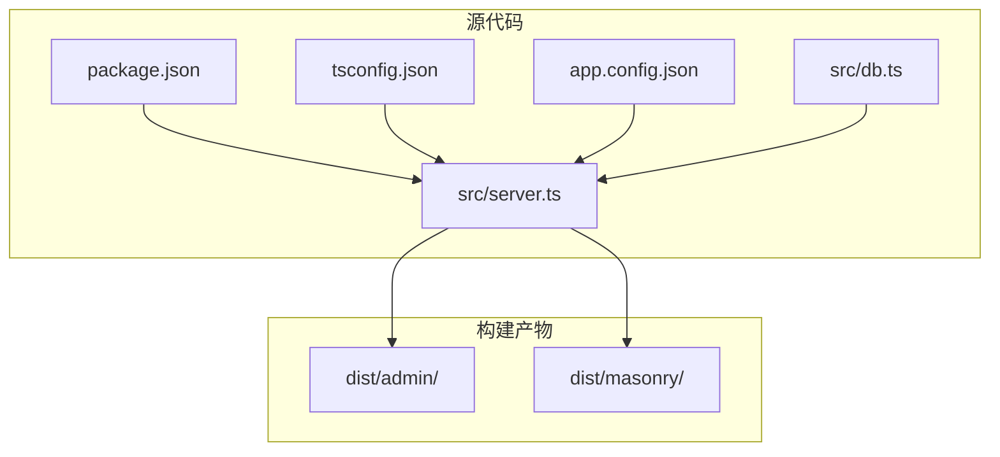
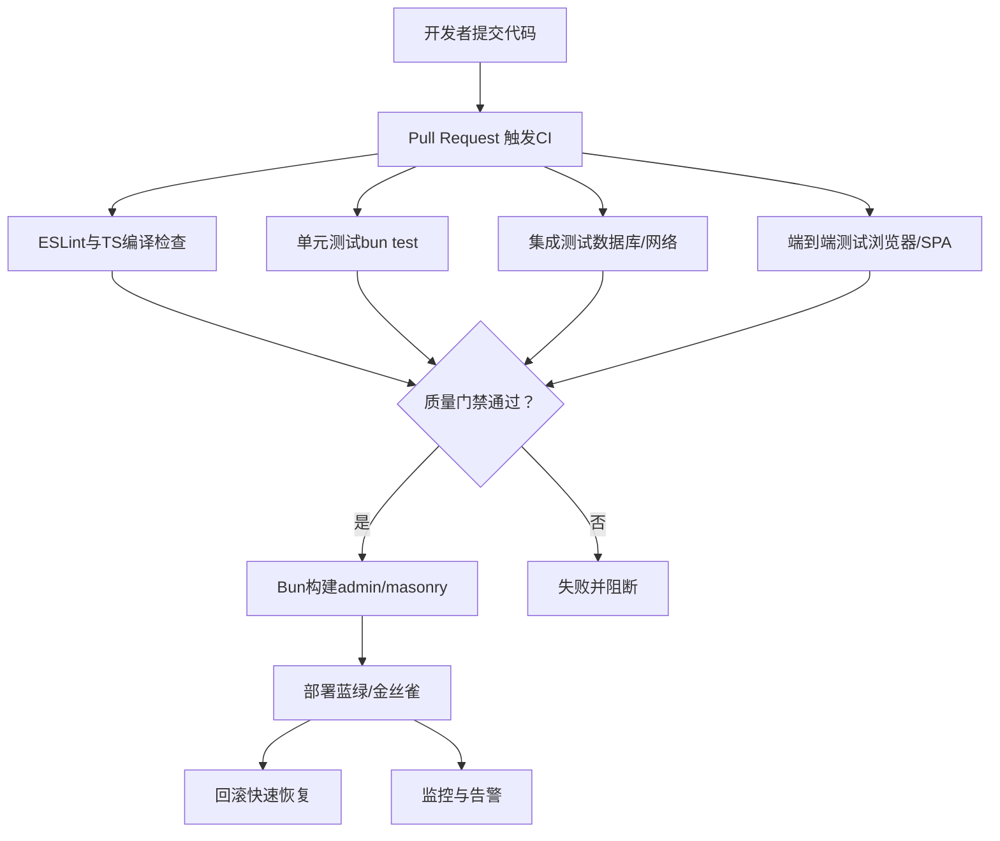
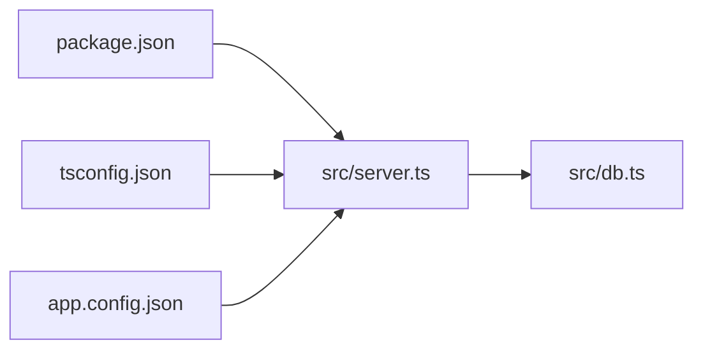

# CI/CD流水线

<cite>
**本文引用的文件**
- [package.json](file://package.json)
- [tsconfig.json](file://tsconfig.json)
- [.gitignore](file://.gitignore)
- [README.md](file://README.md)
- [src/server.ts](file://src/server.ts)
- [src/db.ts](file://src/db.ts)
- [app.config.json](file://app.config.json)
- [CLAUDE.md](file://CLAUDE.md)
</cite>

## 目录
1. [简介](#简介)
2. [项目结构](#项目结构)
3. [核心组件](#核心组件)
4. [架构总览](#架构总览)
5. [详细组件分析](#详细组件分析)
6. [依赖关系分析](#依赖关系分析)
7. [性能考量](#性能考量)
8. [故障排查指南](#故障排查指南)
9. [结论](#结论)
10. [附录](#附录)

## 简介
本指南面向Memmos项目的持续集成与持续部署（CI/CD）流水线设计与实施，聚焦以下目标：
- GitHub Actions工作流配置：构建、测试与部署的自动化流程
- 多阶段构建策略：开发、测试、生产环境的差异化配置
- 自动化测试流程：单元测试、集成测试与端到端测试的执行策略
- 代码质量检查：ESLint、TypeScript编译检查与安全扫描
- 部署回滚策略：蓝绿部署与金丝雀发布的落地建议
- 监控与通知：可观测性与告警机制

Memmos基于Bun运行时，采用Hono作为Web框架，SQLite作为本地存储，前端使用VanJS与Pretext，整体以“零依赖、轻量”为核心特征。流水线设计将围绕这些技术栈进行适配与优化。

## 项目结构
- 核心运行入口：服务端主程序负责路由、静态资源与页面分发
- 数据层：SQLite数据库初始化与CRUD操作封装
- 前端：瀑布流主页与管理后台SPA，分别预构建输出至dist目录
- 构建脚本：Bun原生构建命令，分别产出admin与masonry两套前端产物
- 配置：TypeScript编译选项、应用配置、环境变量与忽略规则

图表来源
- [src/server.ts:1-137](file://src/server.ts#L1-L137)
- [package.json:6-12](file://package.json#L6-L12)
- [tsconfig.json:1-30](file://tsconfig.json#L1-L30)
- [app.config.json:1-22](file://app.config.json#L1-L22)

章节来源
- [README.md:25-45](file://README.md#L25-L45)
- [package.json:6-12](file://package.json#L6-L12)
- [src/server.ts:11-137](file://src/server.ts#L11-L137)

## 核心组件
- 构建脚本与产物
  - 管理后台构建：将前端SPA打包为ESM模块，输出至dist/admin
  - 瀑布流主页构建：将主页逻辑打包为ESM模块，输出至dist/masonry
  - 统一构建：同时执行上述两个子任务
  - 启动脚本：先构建再启动服务，用于生产环境
- 服务端路由与静态资源
  - API路由挂载：认证、AI、备忘录、创意写作、导入导出等子应用
  - 静态资源：favicon、CSS共享样式
  - 页面路由：首页与管理后台SPA，支持深层链接回退
- 数据层
  - SQLite初始化：WAL模式、外键约束
  - 表结构：memos、memo_embeddings、prompts、creative
  - 辅助函数：查询、插入、更新、删除、导入导出、去重校验
- 应用配置
  - AI请求超时、默认Token数、温度
  - 嵌入相似度阈值、重排序开关与候选数量
  - 速率限制：每小时/每天的备忘录与AI调用上限

章节来源
- [package.json:6-12](file://package.json#L6-L12)
- [src/server.ts:38-137](file://src/server.ts#L38-L137)
- [src/db.ts:15-61](file://src/db.ts#L15-L61)
- [app.config.json:1-22](file://app.config.json#L1-L22)

## 架构总览
下图展示了从代码提交到生产部署的关键步骤与职责边界，以及质量门禁与回滚策略的衔接。

## 详细组件分析

### GitHub Actions工作流配置
- 触发条件
  - push到主分支或发布分支
  - pull_request事件
  - 手动触发（可选）
- 作业拆分
  - Lint与TypeScript编译检查
  - 单元测试（bun test）
  - 集成测试（启动服务+数据库）
  - 端到端测试（浏览器驱动）
  - 构建与制品归档
  - 部署（蓝绿/金丝雀）
  - 回滚与通知
- 缓存策略
  - Bun依赖缓存
  - 构建产物缓存（dist）
- 安全扫描
  - 依赖漏洞扫描（如GitHub Security Advisory）
  - 代码扫描（Secrets Detection）

章节来源
- [package.json:6-12](file://package.json#L6-L12)
- [CLAUDE.md:21-31](file://CLAUDE.md#L21-L31)

### 多阶段构建策略
- 开发环境
  - 使用Bun watch与热重载
  - 仅构建必要前端模块，提升迭代速度
- 测试环境
  - 执行完整构建，确保产物一致性
  - 启动内存数据库或临时数据库实例
- 生产环境
  - 构建完成后一次性启动服务
  - 产物仅包含最终静态资源与最小运行时依赖

章节来源
- [README.md:73-81](file://README.md#L73-L81)
- [package.json:6-12](file://package.json#L6-L12)
- [src/server.ts:11-137](file://src/server.ts#L11-L137)

### 自动化测试流程
- 单元测试
  - 使用Bun内置测试运行器
  - 覆盖核心工具函数与纯函数
- 集成测试
  - 启动服务与SQLite数据库
  - 覆盖API路由、认证、CRUD与嵌入缓存初始化
- 端到端测试
  - 浏览器驱动（如Playwright或Cypress）
  - 覆盖SPA深层链接、搜索与标签筛选、管理后台登录流程

章节来源
- [CLAUDE.md:21-31](file://CLAUDE.md#L21-L31)
- [src/server.ts:38-137](file://src/server.ts#L38-L137)
- [src/db.ts:15-61](file://src/db.ts#L15-L61)

### 代码质量检查
- ESLint
  - 在CI中执行，确保风格一致与潜在问题暴露
- TypeScript编译检查
  - 使用tsconfig严格模式，避免隐式any与未使用项
- 安全扫描
  - 依赖漏洞扫描与机密信息检测

章节来源
- [tsconfig.json:1-30](file://tsconfig.json#L1-L30)
- [.gitignore:18-28](file://.gitignore#L18-L28)

### 部署回滚策略
- 蓝绿部署
  - 两套环境并行：当前（green）与待切换（blue）
  - 流量切换通过反向代理或负载均衡完成
  - 失败时立即切回green，保障业务连续性
- 金丝雀发布
  - 将新版本流量按百分比引入（如10%）
  - 结合健康检查与指标阈值，逐步扩大流量
  - 异常则停止扩容并回滚
- 回滚触发条件
  - 健康检查失败
  - 错误率或延迟突增
  - 监控告警阈值触发

章节来源
- [src/server.ts:11-137](file://src/server.ts#L11-L137)

### 监控与通知
- 健康检查端点
  - 提供存活/就绪探针，便于Kubernetes或平台侧探测
- 指标采集
  - 收集错误率、响应时间、吞吐量、数据库连接数
- 告警策略
  - 针对错误率、延迟、资源使用率设置阈值
  - 与团队通讯渠道集成（如Slack、邮件）

章节来源
- [src/server.ts:11-137](file://src/server.ts#L11-L137)

## 依赖关系分析
- 构建链路
  - package.json中的脚本定义了构建顺序与产物位置
  - 服务端根据dist目录是否存在决定是否返回503
- 运行时依赖
  - Hono提供路由与中间件能力
  - SQLite用于本地持久化
  - VanJS与Pretext用于前端SPA与排版
- 配置耦合
  - app.config.json影响AI与嵌入缓存行为
  - tsconfig严格模式影响编译与测试覆盖率

图表来源
- [package.json:6-12](file://package.json#L6-L12)
- [tsconfig.json:1-30](file://tsconfig.json#L1-L30)
- [app.config.json:1-22](file://app.config.json#L1-L22)
- [src/server.ts:1-137](file://src/server.ts#L1-L137)
- [src/db.ts:1-484](file://src/db.ts#L1-L484)

章节来源
- [package.json:6-12](file://package.json#L6-L12)
- [src/server.ts:1-137](file://src/server.ts#L1-L137)
- [src/db.ts:1-484](file://src/db.ts#L1-L484)

## 性能考量
- 构建性能
  - 并行执行admin与masonry构建，减少总耗时
  - 使用Bun原生构建，避免额外打包器开销
- 运行性能
  - SQLite WAL模式提升并发读写
  - 首屏资源按需加载，SPA深层链接优化用户体验
- 测试性能
  - 单元测试优先，集成测试复用最小化数据库实例
  - E2E测试在CI中按需执行，避免过度占用资源

## 故障排查指南
- 构建失败
  - 检查dist目录是否存在对应产物
  - 确认Bun版本与依赖安装
- 服务启动异常
  - 查看端口占用与环境变量
  - 确认数据库初始化与表结构
- 测试失败
  - 单元测试：定位具体用例与断言
  - 集成测试：检查服务启动日志与数据库状态
  - E2E测试：确认浏览器驱动与页面路由

章节来源
- [src/server.ts:59-96](file://src/server.ts#L59-L96)
- [src/db.ts:15-61](file://src/db.ts#L15-L61)
- [CLAUDE.md:21-31](file://CLAUDE.md#L21-L31)

## 结论
本指南提供了针对Memmos项目的CI/CD流水线设计蓝图，涵盖工作流配置、多阶段构建、测试策略、质量门禁与部署回滚方案，并结合实际代码结构给出可视化映射。建议在落地过程中结合团队运维实践与平台能力，持续优化构建与部署效率，确保交付质量与稳定性。

## 附录
- 关键文件路径与用途
  - package.json：构建脚本与依赖声明
  - tsconfig.json：编译选项与严格模式
  - app.config.json：AI与嵌入缓存配置
  - src/server.ts：路由、静态资源与页面分发
  - src/db.ts：数据库初始化与CRUD封装
  - .gitignore：忽略规则与缓存目录
  - CLAUDE.md：Bun测试与前端使用建议

章节来源
- [package.json:1-26](file://package.json#L1-L26)
- [tsconfig.json:1-30](file://tsconfig.json#L1-L30)
- [app.config.json:1-22](file://app.config.json#L1-L22)
- [src/server.ts:1-137](file://src/server.ts#L1-L137)
- [src/db.ts:1-484](file://src/db.ts#L1-L484)
- [.gitignore:1-35](file://.gitignore#L1-L35)
- [CLAUDE.md:1-68](file://CLAUDE.md#L1-L68)