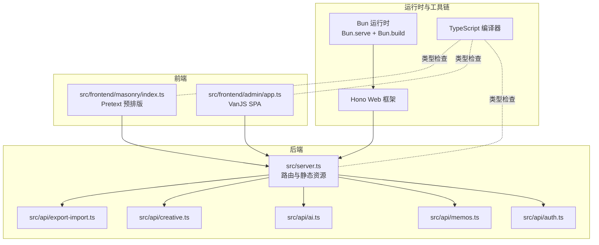
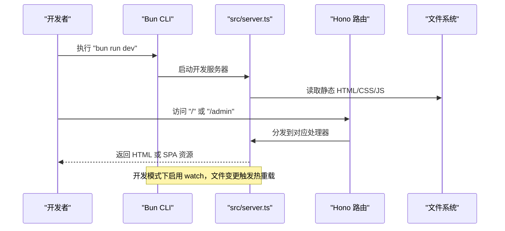
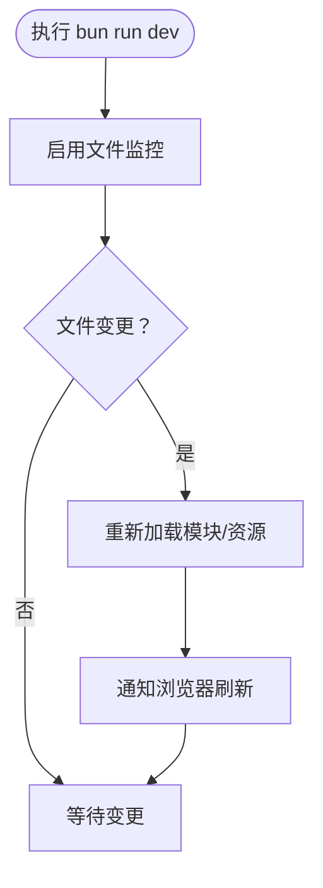
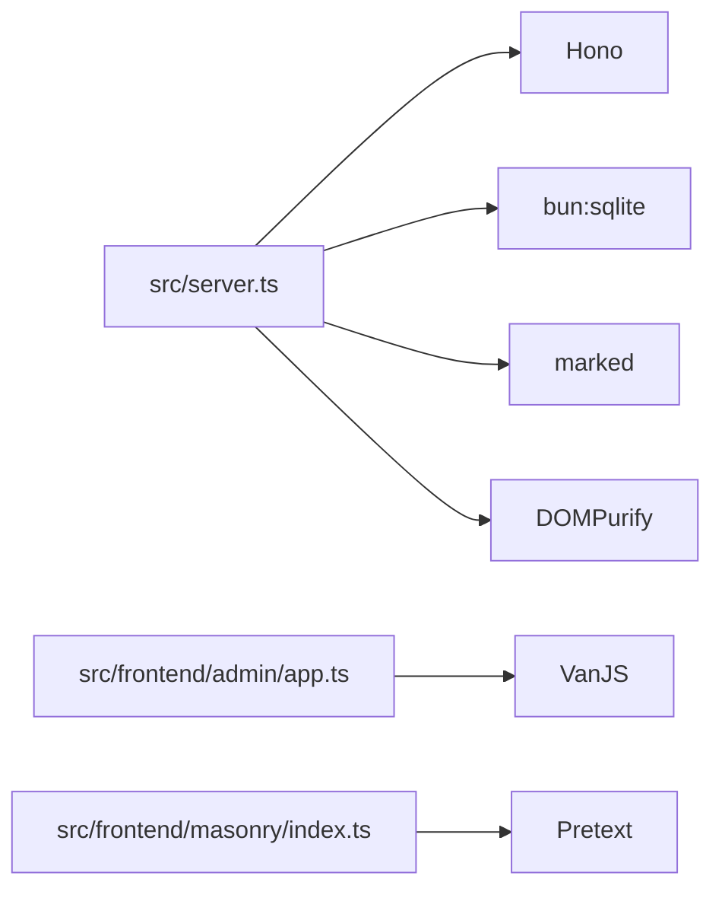

# 开发环境搭建

<cite>
**本文引用的文件**
- [package.json](file://package.json)
- [tsconfig.json](file://tsconfig.json)
- [README.md](file://README.md)
- [src/server.ts](file://src/server.ts)
- [src/frontend/admin/app.ts](file://src/frontend/admin/app.ts)
- [src/frontend/masonry/index.ts](file://src/frontend/masonry/index.ts)
- [.gitignore](file://.gitignore)
- [app.config.json](file://app.config.json)
- [ai.config.json](file://ai.config.json)
</cite>

## 目录
1. [简介](#简介)
2. [项目结构](#项目结构)
3. [核心组件](#核心组件)
4. [架构总览](#架构总览)
5. [详细组件分析](#详细组件分析)
6. [依赖分析](#依赖分析)
7. [性能考虑](#性能考虑)
8. [故障排查指南](#故障排查指南)
9. [结论](#结论)
10. [附录](#附录)

## 简介
本指南面向首次参与 Memos 项目的开发者，帮助你完成本地开发环境的准备与验证，涵盖以下主题：
- 运行时与版本要求：Node.js 与 Bun 的差异、最低版本与兼容性
- 依赖安装流程：npm 与 bun 的区别及注意事项
- TypeScript 编译配置：tsconfig.json 的关键项、编译目标与输出策略
- 开发服务器启动：dev 命令、热重载与生产构建
- IDE 配置建议：VS Code 插件、TypeScript 设置与调试
- Git 钩子与代码格式化：保证团队一致性

## 项目结构
该项目采用 Bun 作为运行时与构建工具，前端采用 VanJS 与 Pretext，后端基于 Hono 框架，数据库使用 SQLite（bun:sqlite）。包管理器使用 Bun，TypeScript 以“仅类型检查”模式配合 Bun 的打包能力。

图表来源
- [src/server.ts:1-137](file://src/server.ts#L1-L137)
- [src/frontend/admin/app.ts:1-251](file://src/frontend/admin/app.ts#L1-L251)
- [src/frontend/masonry/index.ts:1-23](file://src/frontend/masonry/index.ts#L1-L23)

章节来源
- [README.md:1-186](file://README.md#L1-L186)
- [package.json:1-26](file://package.json#L1-L26)
- [tsconfig.json:1-30](file://tsconfig.json#L1-L30)

## 核心组件
- 运行时与包管理：项目使用 Bun 作为运行时与包管理器，脚本中直接使用 bun run 与 bun build。
- 开发服务器：通过 src/server.ts 使用 Bun.serve 提供 HTTP 服务，支持静态页面与 SPA 路由回退。
- 前端构建：使用 Bun.build 将前端入口打包为 ESM，输出至 dist 目录，供服务器按需提供。
- TypeScript 配置：采用严格模式与 bundler 模式，不生成 JS 输出，仅用于类型检查。

章节来源
- [package.json:6-12](file://package.json#L6-L12)
- [src/server.ts:11-137](file://src/server.ts#L11-L137)
- [tsconfig.json:2-28](file://tsconfig.json#L2-L28)

## 架构总览
下图展示了从请求到响应的关键路径，以及前端构建与热重载的关系。

图表来源
- [src/server.ts:38-137](file://src/server.ts#L38-L137)
- [package.json:7-7](file://package.json#L7-L7)

## 详细组件分析

### 运行时与版本要求
- 运行时：项目明确使用 Bun 作为运行时与包管理器，最低版本要求在 README 中给出。
- Node.js：虽然项目未直接声明 Node.js 依赖，但若团队需要在 Node 环境下进行某些任务（如 CI），请确保 Node 版本满足 Bun 生态工具链的要求；本仓库未提供 Node 版本约束。
- 兼容性提示：Bun 在 1.x 版本中已稳定支持 ES Module、TypeScript 与原生 HTTP 服务器，适合本项目的技术栈。

章节来源
- [README.md:49-52](file://README.md#L49-L52)

### 依赖安装流程（npm vs bun）
- 本项目使用 Bun 作为包管理器，推荐使用 bun install 安装依赖。
- 若使用 npm 安装，由于项目未提供 package-lock.json 且使用 Bun 的特定脚本与构建方式，可能导致行为不一致或无法正常运行。
- 建议：
  - 清理 node_modules（如存在）
  - 使用 bun install 安装依赖
  - 避免混用 npm 与 Bun 的依赖树

章节来源
- [README.md:53-57](file://README.md#L53-L57)
- [package.json:1-26](file://package.json#L1-L26)

### TypeScript 编译配置（tsconfig.json）
- 目标与模块：目标为 ESNext，模块解析为 bundler，避免生成 JS 输出（noEmit），仅用于类型检查。
- JSX：启用 react-jsx，便于前端组件开发。
- 严格性：开启严格模式与多项严格规则，提升代码质量。
- 模块检测：强制 moduleDetection 为 force，有助于 ESM 与 TS 扩展名的导入。
- 输出策略：不生成 JS，前端构建由 Bun.build 完成，后端按需编译。

章节来源
- [tsconfig.json:2-28](file://tsconfig.json#L2-L28)

### 开发服务器启动与热重载
- 开发命令：使用 bun run dev 启动，该命令通过 --watch 监听文件变化，实现热重载。
- 服务器入口：src/server.ts 使用 Bun.serve 提供 HTTP 服务，挂载 Hono 路由。
- 静态资源：服务器按需读取 dist 与静态资源目录，支持 SPA 深度链接回退。
- 生产构建：先执行构建脚本生成 dist，再启动服务器。

图表来源
- [package.json:7-7](file://package.json#L7-L7)
- [src/server.ts:131-137](file://src/server.ts#L131-L137)

章节来源
- [package.json:6-12](file://package.json#L6-L12)
- [src/server.ts:11-137](file://src/server.ts#L11-L137)

### 前端构建与输出目录
- 构建脚本：分别对 admin 与 masonry 前端进行打包，输出到 dist/admin 与 dist/masonry。
- 构建目标：browser、ESM 格式，便于在浏览器中直接加载。
- 服务器提供：服务器在请求 /admin/app.js 与 /index.js 时，从 dist 目录提供预构建产物。

章节来源
- [package.json:8-10](file://package.json#L8-L10)
- [src/server.ts:60-96](file://src/server.ts#L60-L96)

### IDE 配置建议（VS Code）
- 插件推荐
  - ESLint：统一代码风格与规则
  - Prettier：格式化
  - TypeScript Importer：自动导入
  - Bun VSCode Extension：Bun 语言支持
- TypeScript 设置
  - 使用工作区内的 tsconfig.json，保持与项目一致的编译选项
  - 确保编辑器使用项目中的 tsserver，避免全局版本差异
- 调试设置
  - 使用 Node 风格的调试器连接到 Bun 进程（Bun 支持 Node Inspector 协议）
  - 可在 VS Code 中为 src/server.ts 添加 launch 配置，指向 Bun 进程

章节来源
- [tsconfig.json:2-28](file://tsconfig.json#L2-L28)
- [package.json:13-18](file://package.json#L13-L18)

### Git 钩子与代码格式化
- 忽略清单：.gitignore 已包含 node_modules、dist、缓存与日志等，避免将构建产物与临时文件提交。
- 团队一致性建议
  - 使用 Husky + lint-staged 在提交前执行格式化与简单检查
  - 统一使用 Prettier 与 ESLint 规则，确保跨平台一致
  - 对 TypeScript 与前端文件分别配置检查任务

章节来源
- [.gitignore:1-35](file://.gitignore#L1-L35)

## 依赖分析
- 运行时与框架
  - Bun：运行时、HTTP 服务器、构建工具
  - Hono：Web 框架，提供路由与中间件能力
- 前端生态
  - VanJS：响应式 UI 库，用于管理后台 SPA
  - Pretext：文字排版与预排版，用于首页瀑布流
- 数据与工具
  - SQLite（bun:sqlite）：本地数据库，WAL 模式
  - marked、DOMPurify：Markdown 渲染与安全清理

图表来源
- [src/server.ts:1-10](file://src/server.ts#L1-L10)
- [src/frontend/admin/app.ts:1-10](file://src/frontend/admin/app.ts#L1-L10)
- [src/frontend/masonry/index.ts:1-4](file://src/frontend/masonry/index.ts#L1-L4)

章节来源
- [README.md:14-24](file://README.md#L14-L24)
- [package.json:19-25](file://package.json#L19-L25)

## 性能考虑
- 开发阶段
  - 使用 Bun 的 watch 模式进行增量加载，减少冷启动时间
  - 前端构建使用 ESM，浏览器可并行加载，降低首屏阻塞
- 生产阶段
  - 通过 Bun.build 生成最小化与去重后的 ESM，减少传输体积
  - 静态资源按需提供，避免不必要的请求
- 数据层
  - SQLite WAL 模式提升并发读写性能
  - 合理索引与查询条件可进一步优化搜索与分页

## 故障排查指南
- 依赖安装失败
  - 确认使用 bun install，避免混用 npm
  - 清理 node_modules 并重新安装
- 端口占用
  - 修改环境变量 PORT，默认 3020
- 前端资源缺失
  - 先执行构建脚本生成 dist，再启动服务器
  - 确认 /admin/app.js 与 /index.js 能被正确提供
- 热重载无效
  - 确认 dev 命令使用了 --watch
  - 检查文件是否在受监控范围内
- TypeScript 报错
  - 使用项目内 tsconfig.json，避免编辑器使用全局配置
  - 确保未生成 JS 输出（noEmit）

章节来源
- [README.md:59-86](file://README.md#L59-L86)
- [src/server.ts:60-96](file://src/server.ts#L60-L96)
- [package.json:6-12](file://package.json#L6-L12)
- [tsconfig.json:15-15](file://tsconfig.json#L15-L15)

## 结论
本指南围绕 Bun 运行时与 TypeScript 配置，给出了从安装到开发、构建与调试的完整流程。遵循本文建议可快速搭建一致的开发环境，确保团队协作顺畅。

## 附录
- 环境变量
  - PORT：服务器监听端口，默认 3020
  - MEMOS_SECRET_KEY：管理后台登录密钥，默认 123
- 配置文件
  - app.config.json：应用级配置（AI、嵌入、重排、限流）
  - ai.config.json：AI 提供商与模型配置

章节来源
- [README.md:59-65](file://README.md#L59-L65)
- [app.config.json:1-22](file://app.config.json#L1-L22)
- [ai.config.json:1-44](file://ai.config.json#L1-L44)