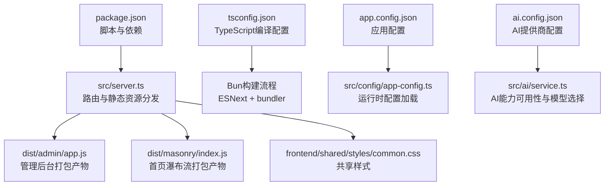
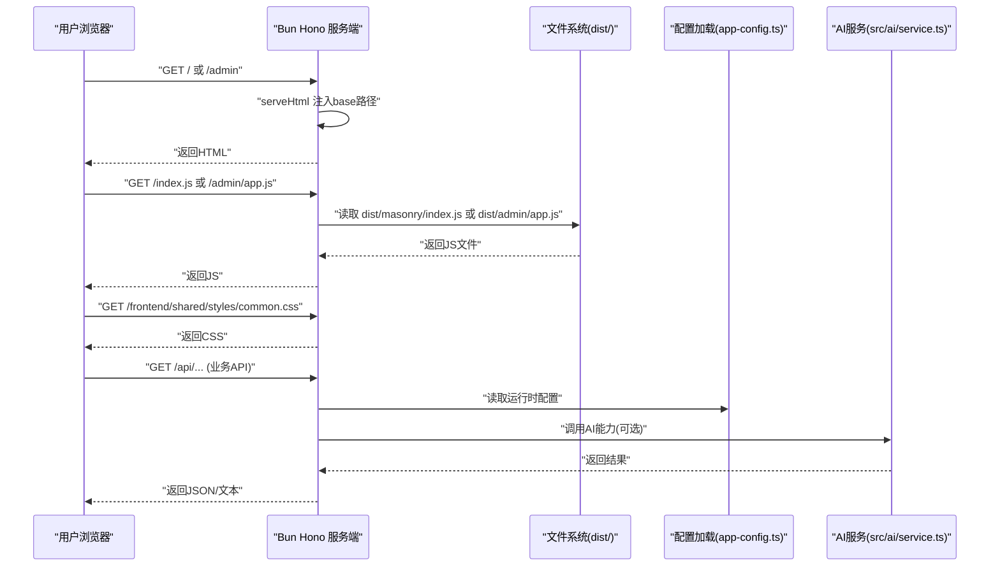
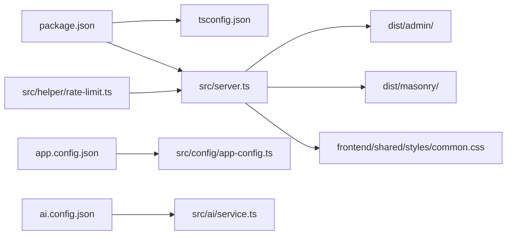

# 构建与部署

<cite>
**本文引用的文件**
- [package.json](file://package.json)
- [tsconfig.json](file://tsconfig.json)
- [README.md](file://README.md)
- [src/server.ts](file://src/server.ts)
- [src/frontend/admin/index.html](file://src/frontend/admin/index.html)
- [src/frontend/masonry/index.html](file://src/frontend/masonry/index.html)
- [src/frontend/shared/styles/common.css](file://src/frontend/shared/styles/common.css)
- [src/config/app-config.ts](file://src/config/app-config.ts)
- [app.config.json](file://app.config.json)
- [ai.config.json](file://ai.config.json)
- [src/ai/service.ts](file://src/ai/service.ts)
- [src/helper/rate-limit.ts](file://src/helper/rate-limit.ts)
- [node_modules/bun-types/docs/guides/deployment/vercel.mdx](file://node_modules/bun-types/docs/guides/deployment/vercel.mdx)
- [.gitignore](file://.gitignore)
</cite>

## 目录
1. [简介](#简介)
2. [项目结构](#项目结构)
3. [核心组件](#核心组件)
4. [架构总览](#架构总览)
5. [详细组件分析](#详细组件分析)
6. [依赖关系分析](#依赖关系分析)
7. [性能考虑](#性能考虑)
8. [故障排查指南](#故障排查指南)
9. [结论](#结论)
10. [附录](#附录)

## 简介
本指南面向Memmos项目的构建与部署，覆盖以下主题：
- TypeScript编译流程：编译配置、输出目录、源码映射与开发体验
- 静态资源处理：前端文件打包、CSS处理与图片资源优化建议
- Bun运行时环境：进程管理、环境变量与性能优化参数
- Docker容器化：Dockerfile编写、镜像构建与容器编排思路
- 云平台部署：Vercel、Railway等平台配置与部署流程
- 自动化部署流水线：GitHub Actions、CI/CD与部署回滚策略
- 监控与日志：应用监控、错误追踪与性能指标收集

## 项目结构
Memmos采用“服务端按需编译”的前端构建策略，使用Bun内置的构建工具对前端入口进行打包，运行时由服务端路由分发静态资源与页面。

图示来源
- [package.json:1-26](file://package.json#L1-L26)
- [src/server.ts:119-125](file://src/server.ts#L119-L125)
- [tsconfig.json:1-30](file://tsconfig.json#L1-L30)
- [src/config/app-config.ts:1-107](file://src/config/app-config.ts#L1-L107)
- [ai.config.json:1-44](file://ai.config.json#L1-L44)
- [src/ai/service.ts:88-130](file://src/ai/service.ts#L88-L130)

章节来源
- [README.md:25-45](file://README.md#L25-L45)
- [package.json:6-12](file://package.json#L6-L12)
- [src/server.ts:47-107](file://src/server.ts#L47-L107)

## 核心组件
- 构建脚本与打包
  - 管理后台打包：将管理后台SPA入口编译为ESM模块，输出至dist/admin
  - 首页瀑布流打包：将首页入口编译为ESM模块，输出至dist/masonry
  - 统一构建：先执行管理后台打包，再执行首页瀑布流打包
  - 启动：先完成打包，再启动服务端
- 运行时路由与静态资源
  - 管理后台：/admin → 注入base路径的HTML；/admin/app.js → dist/admin/app.js
  - 首页：/ → 注入base路径的HTML；/index.js → dist/masonry/index.js
  - 共享样式：/frontend/shared/styles/common.css
  - 图标：/favicon.svg
- 配置体系
  - app.config.json：应用行为配置（AI、嵌入、重排序、限流）
  - ai.config.json：AI提供商与默认模型配置
  - 运行时加载：src/config/app-config.ts负责读取与合并配置

章节来源
- [package.json:6-12](file://package.json#L6-L12)
- [src/server.ts:47-107](file://src/server.ts#L47-L107)
- [src/config/app-config.ts:1-107](file://src/config/app-config.ts#L1-L107)
- [app.config.json:1-22](file://app.config.json#L1-L22)
- [ai.config.json:1-44](file://ai.config.json#L1-L44)

## 架构总览
下图展示了从请求到静态资源与页面的端到端流程，以及配置与AI能力的集成。

图示来源
- [src/server.ts:47-107](file://src/server.ts#L47-L107)
- [src/config/app-config.ts:103-107](file://src/config/app-config.ts#L103-L107)
- [src/ai/service.ts:88-130](file://src/ai/service.ts#L88-L130)

## 详细组件分析

### TypeScript编译与构建流程
- 编译目标与模块系统
  - 目标：ESNext
  - 模块：ESNext
  - 模块解析：bundler
  - JSX：react-jsx
  - 严格性：启用严格模式与多项严格检查
  - 仅编译：noEmit（TypeScript不产出JS，由Bun构建）
- 构建命令
  - 管理后台：Bun构建ESM到dist/admin
  - 首页瀑布流：Bun构建ESM到dist/masonry
  - 统一构建：先后台后首页
  - 启动：先构建，再启动服务端
- 源码映射
  - 当前配置未显式开启source map；如需调试生产问题，可在Bun构建时增加相应参数以生成映射文件

章节来源
- [tsconfig.json:1-30](file://tsconfig.json#L1-L30)
- [package.json:6-12](file://package.json#L6-L12)
- [src/server.ts:119-125](file://src/server.ts#L119-L125)

### 静态资源处理
- HTML注入base标签
  - 为避免深层路径下的资源解析问题，服务端在返回HTML时根据路径注入base标签
- JS与CSS分发
  - 管理后台：/admin/app.js → dist/admin/app.js
  - 首页：/index.js → dist/masonry/index.js
  - 共享样式：/frontend/shared/styles/common.css
- 图标
  - /favicon.svg同时服务于首页与管理后台
- 前端入口与样式
  - 管理后台HTML引入common.css与内联样式
  - 首页HTML引入common.css与内联样式，并加载index.js

章节来源
- [src/server.ts:15-36](file://src/server.ts#L15-L36)
- [src/server.ts:47-107](file://src/server.ts#L47-L107)
- [src/frontend/admin/index.html:1-22](file://src/frontend/admin/index.html#L1-L22)
- [src/frontend/masonry/index.html:1-21](file://src/frontend/masonry/index.html#L1-L21)
- [src/frontend/shared/styles/common.css:1-20](file://src/frontend/shared/styles/common.css#L1-L20)

### Bun运行时环境配置
- 进程管理
  - 开发：bun run --watch src/server.ts
  - 生产：bun run build && bun run src/server.ts
- 端口与静态目录
  - 端口：PORT（默认3020）
  - 静态基础：import.meta.dir
  - 打包产物目录：../dist
- 性能优化建议
  - 使用ESNext与bundler解析，减少运行时转换开销
  - 将共享CSS与图标作为静态资源直接分发，降低运行时负担
  - 在生产环境结合反向代理或CDN缓存静态资源

章节来源
- [package.json:6-12](file://package.json#L6-L12)
- [src/server.ts:11-13](file://src/server.ts#L11-L13)
- [src/server.ts:119-125](file://src/server.ts#L119-L125)

### Docker容器化部署方案
- Dockerfile编写要点
  - 基础镜像：选择官方Bun镜像或Debian/Alpine+安装Bun
  - 工作目录：设置工作目录并复制依赖清单与源码
  - 安装依赖：bun install（注意.devDependencies与peerDependencies）
  - 构建：bun run build（生成dist）
  - 启动：bun run src/server.ts（监听PORT）
  - 健康检查：暴露端口并添加健康检查
- 镜像构建与容器编排
  - 构建镜像：docker build -t memos .
  - 运行容器：docker run -d -p 80:3020 --name memos-app memos
  - 编排：使用Compose定义服务、环境变量与持久化卷（如需要）

说明：以上为通用实践建议，具体镜像选择与体积优化请结合实际需求调整。

### 云平台部署指南
- Vercel
  - Bun运行时：在vercel.json中声明bunVersion
  - 注意事项：Bun.serve在Functions中不受支持；建议配合Next.js、Express、Hono或Nitro等框架
  - 部署：连接仓库或使用CLI部署；验证运行时版本
- Railway
  - 语言：Bun
  - 设置：安装脚本使用bun install，构建脚本使用bun run build，启动使用bun run src/server.ts
  - 环境变量：在平台面板配置PORT、密钥与AI提供商API Key

章节来源
- [node_modules/bun-types/docs/guides/deployment/vercel.mdx:21-98](file://node_modules/bun-types/docs/guides/deployment/vercel.mdx#L21-L98)

### 自动化部署流水线
- GitHub Actions（建议步骤）
  - 触发：push到main分支或发布Release
  - 步骤：
    - 设置Bun环境
    - 安装依赖
    - 构建前端（bun run build）
    - 运行测试（可选）
    - 构建镜像（可选）
    - 部署到目标平台（Vercel/Railway/自建服务器）
  - 回滚策略：
    - 平滑回滚：保留上一版本镜像/部署工件，失败时快速恢复
    - 蓝绿部署：新版本就绪后切换流量
    - 版本标记：以Git Tag或Release作为回滚锚点

说明：本节为通用CI/CD最佳实践，具体YAML请结合目标平台与团队规范编写。

### 监控与日志收集
- 应用监控
  - 指标：请求QPS、P95/P99延迟、错误率、内存与CPU使用
  - 工具：Prometheus + Grafana或平台自带监控
- 错误追踪
  - 结合服务端日志与前端错误上报，定位AI调用异常与网络超时
- 日志
  - 服务端：标准输出记录启动与错误
  - 前端：控制台与网络面板排查静态资源加载问题

说明：本节为通用运维建议，具体接入方式依平台而定。

## 依赖关系分析
- 构建与运行时
  - package.json定义了构建脚本与依赖，Bun负责TS到JS的按需打包
  - tsconfig.json定义编译选项，确保TypeScript与Bundler协同
- 配置与AI
  - app.config.json与ai.config.json分别提供应用行为与AI提供商配置
  - 运行时通过app-config.ts加载配置，AI服务根据可用API Key决定能力开关

图示来源
- [package.json:1-26](file://package.json#L1-L26)
- [tsconfig.json:1-30](file://tsconfig.json#L1-L30)
- [src/server.ts:47-107](file://src/server.ts#L47-L107)
- [src/config/app-config.ts:1-107](file://src/config/app-config.ts#L1-L107)
- [ai.config.json:1-44](file://ai.config.json#L1-L44)
- [src/ai/service.ts:88-130](file://src/ai/service.ts#L88-L130)
- [src/helper/rate-limit.ts:1-98](file://src/helper/rate-limit.ts#L1-L98)

章节来源
- [package.json:1-26](file://package.json#L1-L26)
- [tsconfig.json:1-30](file://tsconfig.json#L1-L30)
- [src/server.ts:47-107](file://src/server.ts#L47-L107)

## 性能考虑
- 构建阶段
  - 使用ESNext与bundler解析，减少运行时转换
  - 将共享CSS与图标作为静态资源直传，避免运行时拼接
- 运行阶段
  - 首屏：仅加载必要HTML与JS，按需渲染
  - 缓存：静态资源可结合CDN与HTTP缓存头
  - 限流：通过app.config.json与环境变量控制AI与Memo操作频率

## 故障排查指南
- 构建失败
  - 确认Bun版本与package.json脚本一致
  - 检查dist目录权限与输出路径
- 静态资源404
  - 确认dist产物存在且路径正确
  - 检查HTML注入的base标签是否与路由匹配
- 配置未生效
  - 检查app.config.json格式与字段名
  - 确认运行时配置加载逻辑与环境变量覆盖顺序
- AI能力不可用
  - 检查对应API Key是否已设置
  - 查看AI服务可用性判断逻辑与网络连通性

章节来源
- [src/server.ts:15-36](file://src/server.ts#L15-L36)
- [src/config/app-config.ts:55-107](file://src/config/app-config.ts#L55-L107)
- [src/ai/service.ts:88-130](file://src/ai/service.ts#L88-L130)
- [src/helper/rate-limit.ts:27-39](file://src/helper/rate-limit.ts#L27-L39)

## 结论
Memmos采用轻量的Bun运行时与按需构建策略，结合清晰的配置体系与路由分发机制，实现了简洁高效的前后端一体化部署方案。通过合理利用Bun构建、静态资源分发与平台部署能力，可快速实现从开发到生产的稳定交付。

## 附录
- 环境变量
  - PORT：服务端监听端口（默认3020）
  - MEMOS_SECRET_KEY：管理员密钥（用于后台登录）
  - AI提供商API Key：由ai.config.json中的apiKeyEnv字段决定（如DEEPSEEK_API_KEY、KIMI_API_KEY、GLM_API_KEY、DASHSCOPE_API_KEY）
- 速率限制
  - 支持按小时与天粒度的双窗口限制，类别包括Memo与AI
  - 可通过环境变量覆盖app.config.json中的默认值

章节来源
- [README.md:59-65](file://README.md#L59-L65)
- [src/helper/rate-limit.ts:27-39](file://src/helper/rate-limit.ts#L27-L39)
- [ai.config.json:1-44](file://ai.config.json#L1-L44)